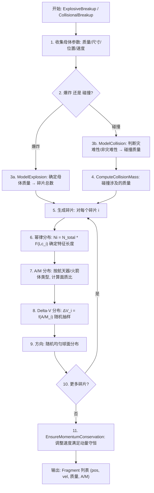

# 算法卡片 — NASA 卫星碎片解体模型

> **状态**：draft
> **日期**：2026-06-11
> **索引证据**：function-index.jsonl (ComputeCollisionMass 为 math 标记)
> **关联文档**：space-integrating-propagator-card.md

### 基础资料

- **算法名称**：NASA Standard Satellite Breakup Model（NASA 标准卫星解体模型）
- **算法所属模块**：wsf_space（空间/轨道力学模块）
- **算法功能**：模拟卫星爆炸解体或碰撞解体事件，生成符合 NASA 统计分布的碎片云。包括碎片数量幂律分布、面质比（A/M）分布、Delta-V 分布，满足动量守恒约束。

### 算法变量和常量

#### 输入变量

| 变量名 | 类型 | 中文说明 | 所属函数 (Method) |
|--------|------|----------|-------------------|
| `M_parent` | double | 解体母体质量 (kg) | ComputeCollisionMass |
| `L_c_parent` | double | 母体特征长度 (m) | ComputeCollisionMass |
| `v_rel` | double | 碰撞相对速度 (km/s) | ComputeCollisionMass |
| `M_small` | double | 较小碰撞体质量 (kg) | ComputeCollisionMass |
| `M_large` | double | 较大碰撞体质量 (kg) | ComputeCollisionMass |
| `position` | UtVector3 | 解体位置 ECI 坐标 (m) | ExplosiveBreakup |
| `velocity` | UtVector3 | 解体速度 ECI (m/s) | ExplosiveBreakup |
| `type` | enum | 解体类型（爆炸/碰撞） | ExplosiveBreakup |
| `spacecraft_type` | enum | 母体类型（航天器/火箭体） | SetModeledAsSpacecraft |
| `S_factor` | double | 爆炸缩放因子 | SetExplosionS_Factor |

#### 输出变量

| 变量名 | 类型 | 中文说明 | 所属函数 (Method) |
|--------|------|----------|-------------------|
| `fragments` | Fragment[] | 碎片列表（位置、速度、质量、A/M） | GetFragmentCount |
| `N_fragments` | int | 碎片总数 | GetFragmentCount |
| `M_collision` | double | 碰撞涉及的总质量 (kg) | ComputeCollisionMass |

#### 常量

| 常量名 | 类型 | 值 | 中文说明 | 所属函数 (Method) |
|--------|------|-----|----------|-------------------|
| `alpha_explosion` | double | 1.6 | 爆炸幂律指数 | ExplosionN |
| `alpha_collision` | double | 1.71 | 碰撞幂律指数 | CollisionN |
| `S_default` | double | 1.0 | 默认爆炸 S 因子 | ExplosionN |
| `L_c_min` | double | 0.01 m | 最小碎片特征长度 | GetFragmentCount |
| `min_fragment_mass` | double | 1e-6 kg | 最小碎片质量阈值 | SetMinFragmentSize |
| `large_fragment_mass_fraction` | double | 0.1 | 大碎片质量占比 | SetLargeFragmentMassFraction |
| `DeltaV_slope_explosion` | double | 0.4 | 爆炸 ΔV-A/M 对数斜率 | DeltaV_Explosion |
| `DeltaV_slope_collision` | double | 0.5 | 碰撞 ΔV-A/M 对数斜率 | DeltaV_Collision |
| `DeltaV_intercept_explosion` | double | 2.9 | 爆炸 ΔV 对数截距 | DeltaV_Explosion |
| `DeltaV_intercept_collision` | double | 2.6 | 碰撞 ΔV 对数截距 | DeltaV_Collision |
| `threshold_specific_energy` | double | 1000 J/g | 灾难性/非灾难性碰撞能量阈值 | CatastrophicCollisionMass |

### 算法流程

### 关键数学公式

1. **碎片数量幂律分布 (NASA 标准模型)**：

   $N(L_c) = \begin{cases} N_0 \cdot (L_c)^{-\alpha} & L_c \geq L_{c,min} \\ 0 & L_c < L_{c,min} \end{cases}$

   爆炸：$N_{explosion} = 6 \cdot S \cdot L_c^{-1.6}$（$S$ 为缩放因子，默认 1.0）

   碰撞：$N_{collision} = 0.1 \cdot \hat{M}^{0.75} \cdot L_c^{-1.71}$（$\hat{M} = M_{total} / (1 \text{ kg})$ 为碰撞涉及的质量）

2. **碰撞质量计算 (ComputeCollisionMass)**：

   灾难性碰撞：$M_{collision} = M_{small} + M_{large}$

   非灾难性碰撞：$M_{collision} = M_{small} \cdot v_{rel}^2 / (1000 \text{ J/g})$

3. **面质比 A/M 分布**（经验公式）：

   航天器（$L_c \geq 0.1$ m）：

   $\log_{10}(A/M) = \begin{cases} -1.0 + 0.5 \cdot \log_{10}(L_c) & L_c \leq 0.1 \\ -1.0 & 0.1 < L_c \leq 1.0 \\ -1.0 - 0.5 \cdot \log_{10}(L_c) & L_c > 1.0 \end{cases}$

   火箭体（$L_c \geq 0.1$ m）：

   $\log_{10}(A/M) = \begin{cases} -1.5 + 0.5 \cdot \log_{10}(L_c) & L_c \leq 0.1 \\ -1.5 & 0.1 < L_c \leq 1.0 \\ -1.5 - 0.5 \cdot \log_{10}(L_c) & L_c > 1.0 \end{cases}$

   小尺寸混合（$L_c < 0.1$ m）：使用 `BlendFunctionWeight` 在航天器和火箭体之间平滑过渡。

4. **Delta-V 分布**：

   $\Delta V(A/M) = 10^{a \cdot \log_{10}(A/M) + b + \sigma \cdot \mathcal{N}(0,1)}$

   爆炸：$\log_{10}(\Delta V) = 0.4 \cdot \log_{10}(A/M) + 2.9 + 0.4 \cdot \mathcal{N}(0,1)$

   碰撞：$\log_{10}(\Delta V) = 0.5 \cdot \log_{10}(A/M) + 2.6 + 0.4 \cdot \mathcal{N}(0,1)$

5. **动量守恒修正**：生成所有碎片后，对 Delta-V 施加整体偏置：

   $\Delta\mathbf{v}_i^{corrected} = \Delta\mathbf{v}_i - \frac{\sum_j m_j \Delta\mathbf{v}_j}{\sum_j m_j}$

### 源码位置

| File | Symbol | 中文说明 |
|------|--------|----------|
| [WsfNASA_BreakupModel.hpp](source_root/src/core/wsf_space/source/WsfNASA_BreakupModel.hpp) | `WsfNASA_BreakupModel` | NASA 标准解体模型主类 |
| 同上 | `ComputeCollisionMass()` | 碰撞质量计算 |
| 同上 | `ExplosionN()` / `CollisionN()` | 碎片数幂律分布函数 |
| 同上 | `AoverM_Spacecraft()` / `AoverM_RocketBody()` | 面质比经验模型 |
| 同上 | `DeltaV_Explosion()` / `DeltaV_Collision()` | Delta-V 经验分布 |
| 同上 | `EnsureMomentumConservation()` | 动量守恒修正 |
| [WsfSatelliteBreakupModel.cpp](source_root/src/core/wsf_space/source/WsfSatelliteBreakupModel.cpp) | `ExplosiveBreakup()` / `CollisionalBreakup()` | 解体事件入口 |

### 可移植性评分

**可移植性**：高 — 所有经验公式和幂律系数来自 NASA 公开文献（Johnson et al., 2001 等），不依赖专有代码。随机数生成可用任何标准库替代。
