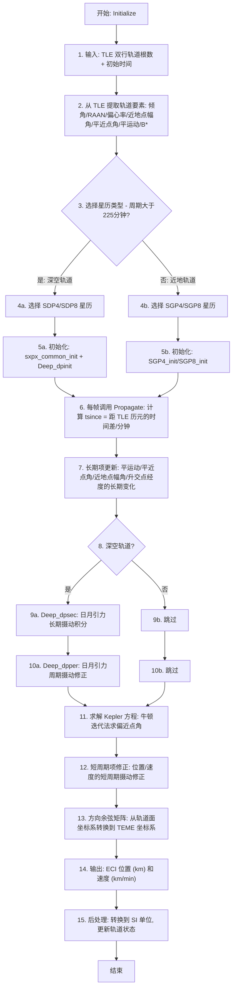

# 算法卡片 — NORAD SGP4/SDP4 轨道传播器

> **状态**：draft
> **日期**：2026-06-11
> **索引证据**：function-index.jsonl (wsf_space, 16 个 NORAD 相关函数), symbol-index.jsonl (7 个 NORAD 类/结构体)
> **关联文档**：space-integrating-propagator-card.md, space-orbital-event-condition-card.md

### 基础资料

- **算法名称**：NORAD SGP4/SDP4 Orbital Propagator（NORAD SGP4/SDP4 轨道传播器）
- **算法所属模块**：wsf_space（空间/轨道力学模块）
- **算法功能**：基于 TLE（Two-Line Element，双行轨道根数）输入，使用 SGP4/SDP4 解析模型对地球轨道卫星进行位置和速度预报。支持近地轨道（SGP4/SGP8）和深空轨道（SDP4/SDP8）两种模式，考虑 J2/J3/J4 地球非球形摄动、大气阻力以及日月引力摄动。

### 算法流程

整个算法流程图如下：



其中，第一步从 TLE 数据中解析轨道要素；第二步使用平运动恢复半长轴；第三步根据轨道周期判断近地/深空；第四、五步执行初始化（含 J2/J3/J4 和大气阻力系数预计算）；第六步传播时计算距历元的时间差；第七步更新长期（secular）摄动项；第八至十步对深空轨道额外处理日月引力摄动；第十一步用牛顿迭代法求解 Kepler 方程；第十二步施加短周期（periodic）修正；第十三步构建方向余弦矩阵得到 TEME 坐标。

### 算法变量和常量

1. 输入 (input)：
   
   | 英文标识符 (Symbol) | 中文名称 (Name)  | 数据类型 (Type) | 含义 (Meaning)     | 单位 (Units) | 所属函数 (Method) |
   | -------------- | ------------ | ----------- | ---------------- | ---------- | ------------- |
   | `tle->epoch`   | TLE 历元时刻     | double (JD) | TLE 数据的参考历元（儒略日） | days       | Initialize    |
   | `tle->xno`     | 平运动          | double      | 卫星平均角速度          | rad/min    | Initialize    |
   | `tle->eo`      | 偏心率          | double      | 轨道偏心率            | 无量纲        | Initialize    |
   | `tle->xincl`   | 轨道倾角         | double      | 轨道面与赤道面的夹角       | rad        | Initialize    |
   | `tle->xnodeo`  | 升交点赤经 (RAAN) | double      | 升交点方向在赤道面内的角度    | rad        | Initialize    |
   | `tle->omegao`  | 近地点幅角        | double      | 升交点到近地点的角距       | rad        | Initialize    |
   | `tle->xmo`     | 平近点角         | double      | 历元时刻的平均近点角       | rad        | Initialize    |
   | `tle->bstar`   | B* 阻力系数      | double      | 弹道系数的修正阻力项       | 1/地球半径     | Initialize    |
   | `tle->xndt2o`  | 平运动一阶导数      | double      | 平运动的时间一阶导数       | rad/min²   | Initialize    |
   | `tle->xndd6o`  | 平运动二阶导数      | double      | 平运动的时间二阶导数 / 6   | rad/min³   | Initialize    |
   | `aTime`        | 当前仿真时间       | UtCalendar  | 需要预报到的目标时刻       | —          | Propagate     |
   | `aInitialTime` | 初始仿真时间       | UtCalendar  | 仿真起始时间           | —          | Initialize    |

2. 输出 (output)：
   
   | 英文标识符 (Symbol)            | 中文名称 (Name) | 数据类型 (Type)      | 含义 (Meaning)        | 单位 (Units)             | 所属函数 (Method)           |
   | ------------------------- | ----------- | ---------------- | ------------------- | ---------------------- | ----------------------- |
   | `mPos[3]`                 | ECI 位置矢量    | double[3]        | TEME 坐标系中的卫星位置      | km (内部) → m (输出)       | Propagate |
   | `mVel[3]`                 | ECI 速度矢量    | double[3]        | TEME 坐标系中的卫星速度      | km/min (内部) → m/s (输出) | Propagate |
   | `mPropagatedOrbitalState` | 传播后轨道状态     | ut::OrbitalState | 包含 ECI 位置/速度的完整轨道状态 | m, m/s                 | UpdateOrbitalState      |

3. 常量 (constant):
   
   | 英文标识符 (Symbol) | 中文名称 (Name) | 数据类型 (Type)                    | 含义 (Meaning)          | 单位 (Units)    | 所属函数 (Method)    |
   | -------------- | ----------- | ------------------------------ | --------------------- | ------------- | ---------------- |
   | `xke`          | 开普勒常数       | double (0.074366916133173408)  | $\sqrt{GM}$，地球引力常数平方根 | (地球半径)³/²/min | sxpx_common_init |
   | `ck2`          | J2 摄动系数     | double (5.413079E-4)           | 地球扁率 J2 项的一半归一化系数     | 无量纲           | sxpx_common_init |
   | `ck4`          | J4 摄动系数     | double (6.2098875E-7)          | 地球扁率 J4 项的归一化系数       | 无量纲           | sxpx_common_init |
   | `xj3`          | J3 摄动系数     | double (-2.53881E-6)           | 地球扁率 J3 项的归一化系数       | 无量纲           | Initialize |
   | `xkmper`       | 地球赤道半径      | double (6378.135)              | WGS72 地球赤道半径          | km            | Propagate |
   | `ae`           | 地球半径归一化常数   | double (1.0)                   | 距离归一化参考值              | 地球半径          | sxpx_common_init |
   | `s`            | S 参数        | double (1.0122292801892716)    | 近地点高度修正的参考值           | 地球半径          | sxpx_common_init |
   | `qoms2t`       | QOMS2T 参数   | double (1.8802791590152709E-9) | $(q_0 - s)^4$ 的修正参数   | 无量纲           | sxpx_common_init |
   | `rho`          | 大气密度参数      | double (1.5696615E-1)          | 近地点大气密度的修正参数          | 无量纲           | sxpx_common_init |
   | `two_thirds`   | 2/3 常数      | double (2/3)                   | 幂运算常用分数               | 无量纲           | sxpx_common_init |
   | `e6a`          | 收敛容差        | double (1.0E-6)                | Kepler 方程迭代收敛阈值       | 无量纲           | sxpx_common_init |
   | `xmnpda`       | 每天分钟数       | double (1440.0)                | 分钟/天的转换常数             | min/day       | Initialize |
   | `zns`          | 太阳平运动       | double (1.19459E-5)            | 太阳平均角速度               | rad/min       | Deep_dpinit      |
   | `zes`          | 太阳轨道偏心率     | double (0.01675)               | 太阳绕地球轨道的偏心率           | 无量纲           | Deep_dpinit      |
   | `znl`          | 月球平运动       | double (1.5835218E-4)          | 月球平均角速度               | rad/min       | Deep_dpinit      |
   | `zel`          | 月球轨道偏心率     | double (0.05490)               | 月球轨道的偏心率              | 无量纲           | Deep_dpinit      |
   | `thdt`         | 地球自转角速度     | double (4.3752691E-3)          | 地球自转的角速度              | rad/min       | Deep_dpinit      |

### 关键数学公式

1. **平运动恢复半长轴**：
   从 TLE 给定的平运动 $n_0$（rad/min）恢复初始半长轴。这是整个 SGP4/SDP4 理论的基础。
   公式如下：
   
   $a_1 = \left(\frac{\sqrt{GM}}{n_0}\right)^{2/3} = \left(\frac{xke}{n_0}\right)^{2/3}$
   
   $\delta_1 = \frac{3}{2} \cdot ck2 \cdot \frac{3\cos^2 i_0 - 1}{a_1^2 \cdot \beta_0^3}$
   
   $a_0 = a_1 \cdot \left(1 - \delta_1 \cdot \left(\frac{1}{3} + \delta_1 + \frac{134}{81}\delta_1^2\right)\right)$
   
   $\delta_0 = \frac{3}{2} \cdot ck2 \cdot \frac{3\cos^2 i_0 - 1}{a_0^2 \cdot \beta_0^3}$
   
   $n_0'' = \frac{n_0}{1 + \delta_0}$ （恢复的原始平运动）
   
   $a_0'' = \frac{a_0}{1 - \delta_0}$ （恢复的原始半长轴）
   
   其中：
   
   - $a_1$ 为开普勒半长轴的初值，单位为地球半径。
   - $i_0$ 为轨道倾角（TLE 的 `xincl`），单位为 rad。
   - $\beta_0 = \sqrt{1 - e_0^2}$，$e_0$ 为偏心率。
   - $\delta_1, \delta_0$ 为 J2 修正项。
   - $a_0'', n_0''$ 为恢复的原始半长轴和平运动，用于后续初始化。

2. **长期摄动项（Secular Perturbations）**：
   计算平运动、近地点幅角、升交点赤经和平均近点角随时间的长期变化率。公式如下（SGP4）：
   
   $\dot{M} = n_0'' + \frac{1}{2} \cdot \frac{3 \cdot ck2}{p_0^2} \cdot n_0'' \cdot \beta_0 \cdot (3\cos^2 i_0 - 1)$
   
   $\dot{\omega} = -\frac{1}{2} \cdot \frac{3 \cdot ck2}{p_0^2} \cdot n_0'' \cdot (1 - 5\cos^2 i_0) + \cdots$
   
   $\dot{\Omega} = -\frac{3 \cdot ck2}{p_0^2} \cdot n_0'' \cdot \cos i_0 + \cdots$
   
   其中：
   
   - $\dot{M}, \dot{\omega}, \dot{\Omega}$ 分别为平近点角、近地点幅角、升交点赤经的长期变化率，单位为 rad/min。
   - $p_0 = a_0'' \cdot \beta_0^2$ 为半通径。
   - 省略号"..."表示含 J4 和更高阶的修正项（完整公式见源码中的 `sxpx_common_init`）。

3. **大气阻力长期摄动**：
   以 B* 项驱动的大气阻力导致平运动和偏心率的变化（SGP4）：
   
   $C_1 = B^* \cdot C_2$，其中 $C_2$ 为与 $n_0''$、$a_0''$、$\eta$ 相关的系数。
   
   $a = a_0'' \cdot (1 - C_1 \cdot t_{since})^2$
   
   $e = e_0 - B^* \cdot C_4 \cdot t_{since}$
   
   其中：
   
   - $t_{since}$ 为距历元的时间差（min）。
   - $C_1, C_4$ 为从 `sxpx_common_init` 推导的阻力系数。
   - 当近地点高度低于 220 km 时，使用简化标志（`mSimpleFlag`）。

4. **Kepler 方程求解 — 牛顿迭代法**：
   将平近点角转换为偏近点角，通过牛顿迭代法求解 Kepler 方程：
   
   $M = E - e \cdot \sin(E)$
   
   迭代公式：
   
   $E_{k+1} = E_k + \frac{M + e \cdot \sin(E_k) - E_k}{1 - e \cdot \cos(E_k)}$
   
   其中：
   
   - $M$ 为平近点角。
   - $E$ 为偏近点角。
   - $e$ 为当前偏心率（含长期修正）。
   - 收敛条件：$|E_{k+1} - E_k| \leq 10^{-6}$，最多迭代 10 次。

5. **短周期项修正（Short-Period Periodic Corrections）**：
   在求解 Kepler 方程得到偏近点角后，施加短周期摄动修正：
   
   $r_k = r \cdot \left[1 - \frac{3}{2} \cdot \frac{ck2}{p} \cdot \beta \cdot (3\cos^2 i - 1)\right] + \frac{1}{2} \cdot \frac{ck2}{p} \cdot (1 - \cos^2 i) \cdot \cos(2u)$
   
   $u_k = u - \frac{1}{4} \cdot \frac{ck2}{p^2} \cdot (7\cos^2 i - 1) \cdot \sin(2u)$
   
   $\Omega_k = \Omega + \frac{3}{2} \cdot \frac{ck2}{p^2} \cdot \cos i \cdot \sin(2u)$
   
   $i_k = i + \frac{3}{2} \cdot \frac{ck2}{p^2} \cdot \cos i \cdot \sin i \cdot \cos(2u)$
   
   其中：
   
   - $r$ 为未经修正的向径距离。
   - $u = \omega + f$ 为纬度幅角（近地点幅角 + 真近点角）。
   - $p = a \cdot (1 - e^2)$ 为当前半通径。
   - 下标 $_k$ 表示短周期修正后的量。

6. **TEME 位置/速度计算**：
   将修正后的轨道要素转换为地心地固 TEME（True Equator Mean Equinox）坐标：
   
   $\mathbf{U} = M_{rot}(-\Omega_k, \hat{z}) \cdot M_{rot}(-i_k, \hat{x}) \cdot \begin{pmatrix} \cos u_k \\ \sin u_k \\ 0 \end{pmatrix}$
   
   $\mathbf{V} = M_{rot}(-\Omega_k, \hat{z}) \cdot M_{rot}(-i_k, \hat{x}) \cdot \begin{pmatrix} -\sin u_k \\ \cos u_k \\ 0 \end{pmatrix}$
   
   $\mathbf{r}_{ECI} = r_k \cdot xkmper \cdot \mathbf{U}$ （km）
   
   $\mathbf{v}_{ECI} = (\dot{r}_k \cdot \mathbf{U} + r_k \cdot \dot{f}_k \cdot \mathbf{V}) \cdot xkmper$ （km/min）
   
   其中方向余弦矩阵展开为：
   
   $ux = -\sin\Omega_k \cos i_k \cdot \sin u_k + \cos\Omega_k \cdot \cos u_k$
   $uy = \cos\Omega_k \cos i_k \cdot \sin u_k + \sin\Omega_k \cdot \cos u_k$
   $uz = \sin i_k \cdot \sin u_k$

7. **星历类型选择 — 近地/深空判别**：
   通过轨道周期判断使用 SGPx（近地）还是 SDPx（深空）星历：
   
   $T_{orbit} = \frac{2\pi}{n_0'' \cdot xmnpda}$ （天）
   
   若 $T_{orbit} \geq \frac{1}{6.4}$ 天（即轨道周期 ≥ 225 分钟），则为深空轨道，使用 SDP4/SDP8。

8. **深空日月引力摄动（SDP4 独有）**：
   SDP4 额外处理日月引力的长期和周期摄动，通过 `Deep_dpsec` 和 `Deep_dpper` 实现。
   
   长期项（dpsec）：每半步积分日月引力对 $M, \omega, \Omega, e, i$ 的长期影响，使用最大 720 分钟的积分步长。
   
   周期项（dpper）：计算太阳和月球的周期摄动修正量：
   
   $zf = M_{sun} + 2 \cdot e_{sun} \cdot \sin(M_{sun})$
   $f_2 = \frac{1}{2}\sin^2(zf) - \frac{1}{4}$
   $f_3 = -\frac{1}{2}\sin(zf) \cdot \cos(zf)$
   $\Delta e = se_2 \cdot f_2 + se_3 \cdot f_3$
   
   同理计算对 $i, \Omega, \omega, M$ 的修正量。

9. **Greenwich 恒星时计算（ThetaG）**：
   用于 TEME 与 ECEF 系之间的转换：
   
   $T_{cen} = \frac{JD_{UT1} - 2451545.0}{36525}$
   
   $GMST = 24110.54841 + T_{cen} \cdot (8640184.812866 + T_{cen} \cdot (0.093104 - T_{cen} \cdot 6.2 \times 10^{-6}))$
   
   $\theta_G = 2\pi \cdot \frac{GMST \bmod 86400}{86400}$
   
   其中：
   
   - $JD_{UT1}$ 为 UT1 时刻的儒略日。
   - $GMST$ 为 Greenwich 平恒星时（秒）。
   - $\theta_G$ 为 Greenwich 时角（rad）。

### 算法伪代码

```
// === NORAD SGP4/SDP4 轨道传播器 ===
// 整体目标：给定 TLE 双行根数和目标时刻，预报卫星在 TEME 坐标系中的位置和速度。

// ---------- 初始化阶段 ----------
function Initialize(aInitialTime):
    // 1. 从 TLE 提取轨道要素
    epoch  = tle.epoch           // TLE 历元 (JD)
    n0     = tle.xno * 60.0     // 平运动 → rad/min
    e0     = tle.eo              // 偏心率
    i0     = tle.xincl           // 倾角 (rad)
    Ω0     = tle.xnodeo          // 升交点赤经 (rad)
    ω0     = tle.omegao          // 近地点幅角 (rad)
    M0     = tle.xmo             // 平近点角 (rad)
    Bstar  = tle.bstar           // B* 阻力项

    // 2. 选择星历类型（近地 SGPx vs 深空 SDPx）
    isDeep = SelectEphemeris()   // 周期 > 225 分钟 → 深空

    // 3. 调用对应的初始化函数
    if isDeep:
        SDP4_init() 或 SDP8_init()
          → sxpx_common_init()   // 通用 SXP 初始化
          → Deep_dpinit()        // 日月引力摄动初始化
    else:
        SGP4_init() 或 SGP8_init()
          → 同 sxpx_common_init()

// ---------- 传播阶段（每帧调用）----------
function Propagate(aTime):
    tsince = (aTime - epoch) / 60.0  // 距历元的时间差 (min)

    if isSGP4:
        SGP4(tsince)
    else if isSDP4:
        SDP4(tsince)
    // ... SGP, SGP8, SDP8 同理

function SGP4(tsince):
    // 4. 长期摄动更新
    M    = M0 + M_dot * tsince       // 平近点角长期变化
    ω    = ω0 + ω_dot * tsince       // 近地点幅角长期变化
    Ω    = Ω0 + Ω_dot * tsince       // 升交点赤经长期变化

    // 5. 大气阻力对半长轴和偏心率的影响
    tsq  = tsince * tsince
    a    = a0'' * (1 - C1 * tsince)^2
    e    = e0 - Bstar * C4 * tsince

    // 6. 如果非简化模式，计算更精确的长期项
    if not mSimpleFlag:
        M  += xmcof * ((1 + η*cos(M0))^3 - delmo)  // 平近点角高阶修正
        ω  -= (omgcof + xmcof * ...) * tsince       // 进动高阶修正

    // 7. 求解 Kepler 方程 → 偏近点角 → 真近点角 → 纬度幅角
    xl = M + ω + Ω + n0'' * (t2cof * tsq + t3cof * tcube + ...)
    sxpx_posn_vel(Ω, a, e, params, cos_i, sin_i, i, ω, xl, pos, vel)
      → 内部：牛顿迭代法求解 Kepler 方程
      → 内部：计算短周期摄动修正
      → 内部：方向余弦矩阵计算 TEME 位置/速度

function SDP4(tsince):
    // 8. 与 SGP4 相似的长期项更新
    // 9. 深空日月引力长期项积分 (Deep_dpsec)
    Deep_dpsec(tle, deep_arg)
      → 更新 xll (平经度), omgadf (近地点幅角), xnode (升交点)
      → 更新 em (偏心率), xinc (倾角)
      → 若在共振轨道上，用半步积分法推进 xli 和 xni

    // 10. 日月引力周期项修正 (Deep_dpper)
    Deep_dpper(deep_arg)
      → 计算太阳摄动: ses, sis, sls, sghs, shs
      → 计算月球摄动: sel, sil, sll, sghl, sh1
      → 叠加修正到 e, i, Ω, ω, M
      → 对低倾角轨道 (i < 0.2 rad) 使用 Lyddane 修正

    // 11. 同 SGP4 的 Kepler 方程求解和位置/速度计算
    sxpx_posn_vel(...)

// ---------- 后处理阶段 ----------
function PostPropagate():
    // 12. 单位转换: km → m, km/min → m/s
    pos = mPos * 1000.0           // m
    vel = mVel * 1000.0 / 60.0    // m/s
    // 13. 写入传播后的轨道状态
    mPropagatedOrbitalState.Set(currentTime, Vector(pos, vel))
```

### 源码使用说明

#### 入口和调用链

```
// 仿真引擎每帧从 WsfSpaceMover 调用 NORAD 传播器
WsfSimulation::Update()                                            // AFSIM 仿真引擎主循环
  → WsfNORAD_SpaceMover::Update()                                 // NORAD 空间运动器 — 管理 TLE 和传播
    → WsfNORAD_OrbitalPropagator::Propagate(currentTime)          // NORAD 传播器入口 — 根据星历类型分派
      → SGP4(tsince)  或  SDP4(tsince)                           // 具体星历模型传播
        → sxpx_posn_vel(...)                                      // 通用位置/速度计算（含 Kepler + 短周期修正）
        → Deep_dpsec(tle, deep_arg) [仅 SDP4/SDP8]               // 深空日月长期摄动
        → Deep_dpper(deep_arg) [仅 SDP4/SDP8]                    // 深空日月周期摄动
    → WsfNORAD_OrbitalPropagator::PostPropagate()                 // 单位转换和状态后处理
      → mPropagatedOrbitalState.Set(...)                          // 写入 SI 单位的位置/速度
```

#### 源码位置

| File                                                                                                   | Symbol                       | Lines   | Evidence level | 中文说明                                      |
| ------------------------------------------------------------------------------------------------------ | ---------------------------- | ------- | -------------- | ----------------------------------------- |
| [WsfNORAD_OrbitalPropagator.hpp](source_root/src/core/wsf_space/source/WsfNORAD_OrbitalPropagator.hpp) | `WsfNORAD_OrbitalPropagator` | 34-110  | source-cited   | 传播器主类声明 — 5 种星历类型的接口和成员变量                 |
| [WsfNORAD_OrbitalPropagator.cpp](source_root/src/core/wsf_space/source/WsfNORAD_OrbitalPropagator.cpp) | `Initialize()`               | 68-121  | source-cited   | 初始化入口 — TLE 解析 → 星历选择 → 对应初始化函数           |
| [WsfNORAD_OrbitalPropagator.cpp](source_root/src/core/wsf_space/source/WsfNORAD_OrbitalPropagator.cpp) | `SelectEphemeris()`          | 191-217 | source-cited   | 星历类型选择 — 周期 > 225 分钟判为深空                  |
| [WsfNORAD_OrbitalPropagator.cpp](source_root/src/core/wsf_space/source/WsfNORAD_OrbitalPropagator.cpp) | `SGP4_init()`                | 440-499 | source-cited   | SGP4 初始化 — 计算所有长期/周期摄动系数                  |
| [WsfNORAD_OrbitalPropagator.cpp](source_root/src/core/wsf_space/source/WsfNORAD_OrbitalPropagator.cpp) | `SGP4()`                     | 503-539 | source-cited   | SGP4 传播 — 长期项 + 阻力 + Kepler + 短周期项        |
| [WsfNORAD_OrbitalPropagator.cpp](source_root/src/core/wsf_space/source/WsfNORAD_OrbitalPropagator.cpp) | `SDP4_init()`                | 587-605 | source-cited   | SDP4 初始化 — 额外初始化日月引力摄动                    |
| [WsfNORAD_OrbitalPropagator.cpp](source_root/src/core/wsf_space/source/WsfNORAD_OrbitalPropagator.cpp) | `SDP4()`                     | 609-654 | source-cited   | SDP4 传播 — 长期项 + 日月引力长期/周期摄动 + Kepler      |
| [WsfNORAD_OrbitalPropagator.cpp](source_root/src/core/wsf_space/source/WsfNORAD_OrbitalPropagator.cpp) | `PostPropagate()`            | 220-234 | source-cited   | 后处理 — km→m, km/min→m/s 单位转换               |
| [WsfNORAD_Util.hpp](source_root/src/core/wsf_space/source/WsfNORAD_Util.hpp)                           | `tle_t`                      | 55-89   | source-cited   | TLE 数据结构 — 9 个标准轨道要素                      |
| [WsfNORAD_Util.hpp](source_root/src/core/wsf_space/source/WsfNORAD_Util.hpp)                           | `deep_arg_t`                 | 91-121  | source-cited   | 深空摄动参数结构 — 80+ 个深空计算中间量                   |
| [WsfNORAD_Util.cpp](source_root/src/core/wsf_space/source/WsfNORAD_Util.cpp)                           | `sxpx_common_init()`         | 49-130  | source-cited   | 通用 SXP 初始化 — 恢复 $a_0'', n_0''$ 和所有长期/周期系数 |
| [WsfNORAD_Util.cpp](source_root/src/core/wsf_space/source/WsfNORAD_Util.cpp)                           | `sxpx_posn_vel()`            | 132-260 | source-cited   | 位置/速度计算 — Kepler 求解 + 短周期修正 + TEME 输出     |
| [WsfNORAD_Util.cpp](source_root/src/core/wsf_space/source/WsfNORAD_Util.cpp)                           | `Deep_dpinit()`              | 294-608 | source-cited   | 深空初始化 — 日月引力摄动初值 + 共振轨道系数                 |
| [WsfNORAD_Util.cpp](source_root/src/core/wsf_space/source/WsfNORAD_Util.cpp)                           | `Deep_dpsec()`               | 611-758 | source-cited   | 深空长期摄动 — 日月引力半步积分（含 12h 和同步共振）            |
| [WsfNORAD_Util.cpp](source_root/src/core/wsf_space/source/WsfNORAD_Util.cpp)                           | `Deep_dpper()`               | 761-882 | source-cited   | 深空周期摄动 — 日月引力周期项叠加（含 Lyddane 修正）          |
| [WsfNORAD_Util.cpp](source_root/src/core/wsf_space/source/WsfNORAD_Util.cpp)                           | `ThetaG()`                   | 896-914 | source-cited   | Greenwich 恒星时 — 从天球历书公式计算                 |

#### 框架依赖

| AFSIM 原始依赖                         | 依赖类型        | 替换方案                                  |
| ---------------------------------- | ----------- | ------------------------------------- |
| `UtOrbitalPropagatorBase`          | 基类（框架必需）    | 自定义 `OrbitalPropagatorBase` 抽象接口      |
| `UtTwoLineElement`                 | TLE 数据容器    | 自定义 `TLE` 结构体，含 9 个标准要素               |
| `UtCalendar`                       | 时间表示        | 可直接使用 `double`（JD）或 C++ `std::chrono` |
| `UtOrbitalState`                   | 轨道状态容器      | 自定义 `OrbitalState` 结构体（位置 + 速度 + 时间）  |
| `UtVec3d`                          | 三维矢量        | Eigen::Vector3d 或自定义 Vec3             |
| `WsfNonClassicalOrbitalPropagator` | 中间基类        | 可合并到自定义传播器基类中                         |
| `WsfScenario`                      | 场景管理（仅工厂注册） | 移除工厂模式，直接构造                           |
| `UtMath::cTWO_PI, UtMath::cPI`     | 数学常数        | `M_PI`, `2.0 * M_PI`                  |
| `ut::log::error()`                 | 日志          | `std::cerr` 或 spdlog                  |

#### 测试和验证计划

1. **单元测试 — 已知 TLE 对比**：使用公开 TLE 数据（如 celestrak.com），与参考 SGP4 实现（如 Vallado 的代码或 STK 输出）对比位置/速度，误差应在 mm/s 级别。
2. **回归测试 — NORAD 测试用例**：`test_mission/` 目录下已有 13 个 NORAD 测试场景文件（`.txt`），覆盖 SGP4、SDP4、轨道机动等场景，可直接用作回归测试数据。
3. **边界测试**：
   - 近地点 < 98 km（S 参数切换逻辑）
   - 近地点 < 156 km（QOMS2T 切换逻辑）
   - 近地点 < 220 km（简化标志触发）
   - 零倾角轨道（$\sin i = 0$ 时的除零保护）
   - 极高衰减轨道（$a \leq 0$ 或 $q \leq 0$ 时的保护逻辑）
   - 12 小时共振轨道（$e > 0.5$）
   - 地球同步轨道（$n_0''$ 在同步范围内）
4. **数值精度验证**：检查 Kepler 方程迭代次数（应 ≤ 10），验证 FMod2p 角度归一化正确性。

#### 可移植性评分

**可移植性**：中

**原因**：

1. 核心数学公式（Kepler 方程、J2/J3/J4 摄动、大气阻力、日月引力摄动）均为公开的 Spacetrack Report #3 标准，可以用任何语言重新实现。
2. 代码中所有物理常数（`xke`、`ck2`、`ck4`、`xj3`、`xkmper` 等）均以 WGS72 为参考，直接移植常数即可。
3. 框架耦合较重：依赖 `UtOrbitalPropagatorBase`、`UtTwoLineElement`、`UtCalendar`、`UtOrbitalState` 等多个 AFSIM 基础设施类，需要在移植时重新定义这些类型。
4. 深空函数（`Deep_dpinit`/`Deep_dpsec`/`Deep_dpper`）中包含大量硬编码的经验系数（如 `root22 = 1.7891679E-6`），需要在移植时完整保留这些数值。
5. 单位体系在内部使用混合单位（km, km/min, rad/min），输出时转换到 SI，移植时需注意单位一致性。
