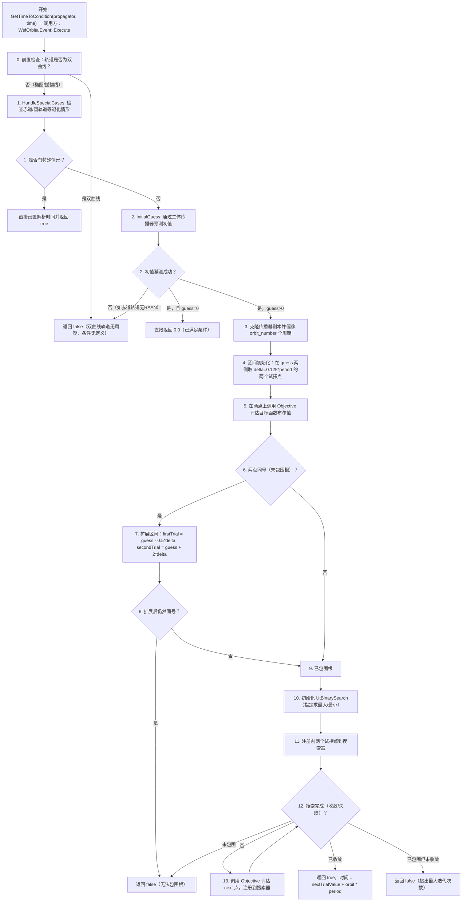

# 轨道事件条件（OrbitalPropagatorCondition）算法模型

> **状态**：draft
> **日期**：2026-06-11
> **索引证据**：function-index.jsonl (wsf_space 模块，22 个条件相关函数), symbol-index.jsonl
> **关联文档**：space-integrating-propagator-card.md, space-norad-orbital-propagator-card.md

### 基础资料

- **算法名称**：轨道事件条件系统 — 二分/增步搜索求根（Orbital Event Condition System — Bisection Search Root-Finding）
- **算法所属模块**：wsf_space（空间/轨道力学模块）
- **算法功能**：在轨道传播过程中寻找满足特定几何条件（近地点、远地点、升交点、降交点、指定半径穿越、轨道面交线等）的时刻。对于大多数条件子类，采用基于 UtBinarySearch 的"先增步扩界、再二分收缩"求根策略；对于非优化类条件（EclipseEntry / EclipseExit），直接委托传播器计算地影时刻。该体系通过模板方法模式（Template Method），允许派生类仅覆写 `Objective`（目标函数布尔值）、`InitialGuess`（二体近似猜测）和 `HandleSpecialCases`（特殊轨道处理）三个纯虚函数，即可适配任意轨道传播器（含数值积分、NORAD 等非二体传播器）。

---

### 算法流程

整个条件求解算法（以 `OrbitalPropagatorOptimizingCondition::GetTimeToCondition` 模板方法为核心）的流程图如下：



**流程文字说明**：

1. **前置检查**：判断传播器的轨道是否为双曲线。双曲线轨道不存在周期，轨道事件条件（如"近地点""升交点"）在物理上无定义，直接返回 `false`。
2. **特殊情形处理**（`HandleSpecialCases`）：检查退化轨道——圆轨道无独立的近地点/远地点，赤道轨道无独立的升交点/降交点；两个轨道面法向量反平行时处处为交线。这些情形直接返回基于轨道周期和 `orbit_number` 的计算时间。
3. **初值猜测**（`InitialGuess`）：利用传播器内置的二体机动传播器（`GetManeuveringPropagator`）做解析预测，给出条件发生的近似时间。对近/远地点等条件使用开普勒方程解析解。
4. **克隆传播器**：为避免求解过程中污染原始传播器状态，创建传播器的深拷贝并初始化到当前轨道状态。
5. **偏移轨道数**：如果 `mOrbitNumber > 0`，将基准时刻向前偏移 `mOrbitNumber * period` 秒，使得搜索在指定圈数后才开始。
6. **包围根**（Bracketing）：在初值两侧取试探点评估 `Objective`。如果两点返回的布尔值不同（一个返回 `true`，一个返回 `false`），说明根在区间内；否则扩展区间再试。
7. **UtBinarySearch 搜索**：根据前两点的符号确定搜索方向（`firstResult=true, secondResult=false` 则查找 true 区域的最大值；反之查最小值）。搜索器采用"先等比增长扩界、后二分收缩"策略。
8. **收敛与退出**：当 bestSuccess 与 bestFailure 差值小于容差 `cSEARCH_TOLERANCE = 1e-8` 秒时收敛；超过 60 次迭代未收敛则失败。

---

### 算法变量和常量

（所属函数(Method) 必须为 function-index.jsonl 中的函数名）

#### 1. 输入变量（Input）

| 英文标识符(Symbol) | 中文名称(Name) | 数据类型(Type) | 含义(Meaning) | 单位(Units) | 所属函数(Method) |
| ---- | ---- | ---- | --- | ---- | --- |
| `aPropagator` | 轨道传播器引用 | `const UtOrbitalPropagatorBase&` | 提供当前轨道状态（位置、速度、轨道根数）和传播能力的对象 | 无 | `GetTimeToCondition` |
| `aPropagator` | 可修改轨道传播器引用 | `UtOrbitalPropagatorBase&` | 在目标函数中需要推进传播器到指定时刻以评估条件 | 无 | `Objective` |
| `aBaseEpoch` | 基准历元 | `const UtCalendar&` | 搜索起点的绝对日历时刻，所有 `aOffsetTime` 相对于此刻 | 日历 | `Objective` |
| `aOffsetTime` | 偏移时间 | `double` | 从基准历元起算的时间偏移量，表示传播器应推进到的相对时刻 | 秒 (s) | `Objective` |
| `aInput` | 输入配置流 | `UtInput&` | 场景文件解析器，用于从文本中读取条件参数（如相对时间、目标半径） | 无 | `ProcessInput` |
| `aVisitor` | 访问器 | `OrbitalPropagatorConditionVisitor&` | 访问者模式中的访问器，用于分发不同类型的条件处理逻辑 | 无 | `Accept` |
| `aTimeToCondition` | 到条件时间（出参） | `double&` | 输出参数，接收从当前时刻到条件满足所需的秒数 | 秒 (s) | `HandleSpecialCases` |
| `rHat` | 位置单位向量 | `UtVec3d` | 当前位置矢量的归一化方向向量，表示地心到卫星的方向 | 无量纲 | `Objective` (Periapsis/Apoapsis) |
| `vel` | 速度矢量 | `UtVec3d` | 当前轨道状态的速度矢量（ECI 坐标系） | m/s | `Objective` (Periapsis/Apoapsis) |
| `z` | ECI Z 坐标 | `double` | 当前轨道位置在 ECI 坐标系 Z 轴上的分量（TOD 坐标系） | m | `Objective` (AscendingNode/DescendingNode) |
| `r` | 地心距 | `double` | 当前卫星到地心的距离（位置矢量模长） | m | `Objective` (AscendingRadius/DescendingRadius) |
| `n2` | 目标轨道面法向量 | `UtVec3d` | 另一个轨道的平面法向量，由目标 RAAN 和倾角计算 | 无量纲 | `Objective` (Northern/SouthernIntersection) |

#### 2. 输出变量（Output）

| 英文标识符(Symbol) | 中文名称(Name) | 数据类型(Type) | 含义(Meaning) | 单位(Units) | 所属函数(Method) |
| ---- | ---- | ---- | --- | ---- | --- |
| `aTimeToCondition` | 到条件满足的时间 | `double&` | 从传播器当前时间到条件满足的秒数 | 秒 (s) | `GetTimeToCondition` |
| 返回值 | 求解成功标志 | `bool` | `true` 表示成功找到条件时间；`false` 表示无法确定（双曲线/未包围/未收敛） | 无 | `GetTimeToCondition` |
| 返回值 | 初值猜测结果 | `std::pair<bool, double>` | `.first = true` 表示猜测成功，`.second` 为猜测时间 | 秒 (s) | `InitialGuess` |
| 返回值 | 目标函数布尔值 | `bool` | `true` 表示当前偏移时刻在根的"之前"区域；`false` 表示在"之后"区域 | 无 | `Objective` |
| 返回值 | 特殊情形检测 | `bool` | `true` 表示检测到退化轨道并已直接设置 `aTimeToCondition` | 无 | `HandleSpecialCases` |
| 返回值 | 参数验证结果 | `bool` | `true` 表示所有输入参数满足物理约束（如半径 > 0，偏移时间 >= 0） | 无 | `ValidateParameterRanges` |

#### 3. 常量（Constant）

| 英文标识符(Symbol) | 中文名称(Name) | 数据类型(Type) | 含义(Meaning) | 单位(Units) | 所属函数(Method) |
| ---- | ---- | ---- | --- | ---- | --- |
| `cMAX_ITERATIONS` | 最大迭代次数 | `constexpr size_t` | 二分搜索允许的最大循环次数，超出则判定搜索失败 | 次 (无量纲) | `GetTimeToCondition` |
| `cSEARCH_TOLERANCE` | 搜索收敛容差 | `constexpr double` | 当 bestSuccess 与 bestFailure 之差小于此值时判定收敛 | 秒 (s) | `GetTimeToCondition` |
| `cINCREMENT_RATIO` | 增量比率 | `constexpr double` | 初始区间两侧试探点偏离初值的比例（delta = 0.125 * period） | 无量纲 | `GetTimeToCondition` |
| `cTOLERANCE` | 反平行判定容差 | `static constexpr double` | 用于判定两个轨道法向量是否反平行（点积接近 -1）的容差 | 无量纲 | `HandleSpecialCases` (IntersectionCondition) |
| `cTYPE` | 类型字符串标识 | `constexpr static const char*` | 每个条件子类在场景文件中对应的字符串键（如 "periapsis", "ascending_node"） | 无 | 各条件子类构造函数 |
| `mOrbitNumber` | 目标轨道圈数 | `unsigned` | 指定在多少圈完整轨道之后才检测条件，0 表示当前圈即可 | 圈 (无量纲) | `GetTimeToCondition` |
| `mOffsetTime` | 相对时间偏移 | `UtTimeValue` | RelativeTimeCondition 配置的时间偏移量 | 秒 (s) | `GetTimeToCondition` (RelativeTimeCondition) |
| `mRadius` | 目标半径 | `UtLengthValue` | AscendingRadiusCondition / DescendingRadiusCondition 配置的目标地心距 | m | `Objective` (AscendingRadius/DescendingRadius) |
| `mRAAN` | 目标升交点赤经 | `double` | IntersectionCondition 配置的目标轨道升交点赤经 | 弧度 (rad) | `Objective` (Northern/SouthernIntersection) |
| `mInclination` | 目标轨道倾角 | `double` | IntersectionCondition 配置的目标轨道倾角 | 弧度 (rad) | `Objective` (Northern/SouthernIntersection) |

---

### 关键数学公式

1. **二分搜索收敛判定**：
   搜索过程持续追踪两个变量：`mBestSuccess`（最近一次返回 `true` 的最优试探点）和 `mBestFailure`（最近一次返回 `false` 的最优试探点）。当搜索区间已被包围（bracketed），新试探点通过二分法生成：
   
   $$t_{\text{next}} = \frac{t_{\text{bestSuccess}} + t_{\text{bestFailure}}}{2}$$
   
   收敛条件为：
   
   $$|t_{\text{bestSuccess}} - t_{\text{bestFailure}}| < \epsilon$$
   
   其中：
   - $t_{\text{bestSuccess}}$ 表示条件为目标状态（`true`）的最优时刻，单位为秒 (s)，通过 `SaveBests()` 持续更新。
   - $t_{\text{bestFailure}}$ 表示条件为非目标状态（`false`）的最优时刻，单位为秒 (s)，同样由 `SaveBests()` 维护。
   - $\epsilon = 1.0 \times 10^{-8}$ 表示收敛容差 `cSEARCH_TOLERANCE`，单位为秒 (s)，保证时间精度约为 10 纳秒级别。

2. **近地点/远地点条件（PeriapsisCondition / ApoapsisCondition）**：
   利用径向速度的符号变化来检测近地点或远地点穿越。目标函数计算位置方向向量与速度矢量的点积：
   
   $$f(t) = \mathbf{v}(t) \cdot \hat{\mathbf{r}}(t) = v_x \hat{r}_x + v_y \hat{r}_y + v_z \hat{r}_z$$
   
   - 近地点：当 $f(t) < 0$ 时认为还在近地点之前（径向速度向内），$f(t)$ 从负穿越零变为正的时刻即为近地点。
   - 远地点：当 $f(t) > 0$ 时认为还在远地点之前（径向速度向外），$f(t)$ 从正穿越零变为负的时刻即为远地点。
   
   其中：
   - $\mathbf{v}(t) = (v_x, v_y, v_z)$ 表示卫星在 ECI 坐标系中的速度矢量，单位为 m/s，由 `GetOrbitalStateVector().GetVelocity()` 获取。
   - $\hat{\mathbf{r}}(t)$ 表示位置矢量的单位方向向量（归一化到模长为 1），无量纲，由 `GetLocation().GetNormal()` 获取。

3. **升交点/降交点条件（AscendingNodeCondition / DescendingNodeCondition）**：
   利用卫星在 ECI 坐标系中 Z 分量的符号变化来检测赤道面穿越：
   
   $$f(t) = z_{\text{TOD}}(t)$$
   
   - 升交点：当 $z_{\text{TOD}}(t) < 0$ 时认为在赤道面以下（南半球），穿越 $z = 0$ 且 $\dot{z} > 0$ 的时刻为升交点。
   - 降交点：当 $z_{\text{TOD}}(t) > 0$ 时认为在赤道面以上（北半球），穿越 $z = 0$ 且 $\dot{z} < 0$ 的时刻为降交点。
   
   其中：
   - $z_{\text{TOD}}(t)$ 表示卫星在真赤道真春分点（TOD）坐标系中的 Z 坐标，单位为米 (m)，通过 `GetOrbitalStateVectorTOD().GetLocation().Get(2)` 获取（索引 2 为 Z 分量）。

4. **半径穿越条件（AscendingRadiusCondition / DescendingRadiusCondition）**：
   比较卫星当前地心距与目标半径的大小关系：
   
   $$f(t) = r(t) - r_{\text{target}}$$
   
   - 上升穿越（AscendingRadius）：当 $r(t) < r_{\text{target}}$ 时认为还在目标半径之下，$r(t)$ 从下往上穿越 $r_{\text{target}}$ 的时刻即为上升穿越。
   - 下降穿越（DescendingRadius）：当 $r(t) > r_{\text{target}}$ 时认为还在目标半径之上，$r(t)$ 从上往下穿越 $r_{\text{target}}$ 的时刻即为下降穿越。
   
   其中：
   - $r(t) = \sqrt{x^2 + y^2 + z^2}$ 表示卫星到地心的距离（位置矢量模长），单位为米 (m)，由 `GetLocation().Magnitude()` 计算。
   - $r_{\text{target}}$ 表示配置的目标半径值，单位为米 (m)，由 `mRadius` 存储并在 `ProcessInput` 中解析，必须大于 0。

5. **轨道面交线条件（NorthernIntersectionCondition / SouthernIntersectionCondition）**：
   利用两个轨道平面法向量的叉积来确定交线方向。首先通过 RAAN 和倾角计算轨道面法向量：
   
   $$\hat{\mathbf{n}}(\Omega, i) = \begin{pmatrix} \sin i \cdot \sin \Omega \\ -\sin i \cdot \cos \Omega \\ \cos i \end{pmatrix}$$
   
   交线条件为卫星位置矢量与目标轨道面法向量垂直（位置在目标轨道面内）：
   
   $$f(t) = \hat{\mathbf{r}}_{\text{TOD}}(t) \cdot \hat{\mathbf{n}}_2(\Omega_{\text{target}}, i_{\text{target}})$$
   
   当 $f(t) > 0$ 时认为在交线之前（北交点正侧），$f(t)$ 穿越零的时刻即为交线。
   
   其中：
   - $\Omega$ 表示升交点赤经 (Right Ascension of the Ascending Node)，单位为弧度 (rad)。
   - $i$ 表示轨道倾角 (Inclination)，单位为弧度 (rad)。
   - $\hat{\mathbf{r}}_{\text{TOD}}(t)$ 表示卫星位置在 TOD 坐标系中的单位方向向量，无量纲，由 `GetOrbitalStateVectorTOD().GetLocation().GetNormal()` 获取。
   - $\hat{\mathbf{n}}_2$ 表示目标轨道的平面法向量，无量纲，由 `OrbitNormal()` 方法计算。
   - **特殊情形**：当 $\hat{\mathbf{n}}_1 \cdot \hat{\mathbf{n}}_2 \approx -1$（两个法向量反平行，容差 `cTOLERANCE = 1e-7`）时，两个轨道面重合但方向相反，所有点都是交点，直接返回 `mOrbitNumber * period`。

6. **相对时间条件（RelativeTimeCondition）**：
   此条件不需要搜索，直接返回配置的时间偏移：
   
   $$t_{\text{condition}} = t_{\text{offset}} + N_{\text{orbit}} \cdot T_{\text{period}}$$
   
   其中：
   - $t_{\text{offset}}$ 表示配置的偏移时间，单位为秒 (s)，通过 `mOffsetTime` 存储，必须 $\ge 0$。
   - $N_{\text{orbit}}$ 表示目标轨道圈数（`mOrbitNumber`），无量纲。
   - $T_{\text{period}}$ 表示轨道周期，单位为秒 (s)，由 `GetOrbitalElements().GetPeriod()` 获取。

---

### 算法伪代码

（以下伪代码从 `OrbitalPropagatorOptimizingCondition::GetTimeToCondition` 源码逐段还原，每 3-5 行附带中文注释）

```
// ============================================================
// 算法：轨道事件条件求解（模板方法 — 二分/增步搜索）
// 调用上下文：WsfOrbitalEvent::Execute() 需要知道距离下次事件触发的秒数
//            → 调用具体条件子类的 GetTimeToCondition(propagator, time)
//            → 进入本模板方法执行搜索
// ============================================================

function GetTimeToCondition(aPropagator, aTimeToCondition):
    // 阶段 1：前置检查 — 拒绝双曲线轨道
    if aPropagator.GetOrbitalState().OrbitIsHyperbolic():
        aTimeToCondition = -1.0    // 双曲线轨道没有周期，条件无物理意义
        return false               // 返回失败

    // 阶段 2：特殊情形处理 — 退化轨道（圆轨道、赤道轨道、反平行轨道面）
    if HandleSpecialCases(aPropagator, aTimeToCondition):
        return true                // 已直接设置解析时间，无需搜索

    // 阶段 3：初值猜测 — 利用二体传播器做解析预测
    initialGuess = InitialGuess(aPropagator)
    // initialGuess 类型为 pair<bool, double>：.first 是猜测是否成功，.second 是猜测的时间（秒）
    if NOT initialGuess.first:
        // 无法猜测（如赤道轨道无法定义 RAAN 交点）
        aTimeToCondition = -1.0
        return false

    // 阶段 4：克隆传播器 — 避免搜索过程污染原始状态
    propPtr = ut::clone(aPropagator)             // 深拷贝传播器
    propPtr.Initialize(aPropagator.GetOrbitalState())  // 初始化副本到当前轨道状态

    // 阶段 5：偏移轨道数 — 如果要求在第 N 圈之后才触发条件
    baseEpoch = propPtr.GetCurrentTime()         // 基准历元 = 传播器当前时刻
    period = propPtr.GetOrbitalState().GetOrbitalElements().GetPeriod()  // 轨道周期 (s)
    if mOrbitNumber > 0:
        baseEpoch.AdvanceTimeBy(mOrbitNumber * period)  // 基准时刻前移 N 圈
        propPtr.Update(baseEpoch)                        // 同步传播器到新基准
        initialGuess.second -= mOrbitNumber * period     // 猜测值减去已偏移的时间

    // 阶段 6：区间试探 — 在初值两侧取点评估 Objective
    delta = 0.125 * period                       // 初始试探间距 = 1/8 轨道周期
    if initialGuess.second > 0.0:
        firstTrial  = max(initialGuess.second - delta, 0.0)   // 左侧试探点，不小于 0
        secondTrial = initialGuess.second + delta              // 右侧试探点
    else:
        // 初值为 0 说明当前已经满足条件，直接返回
        aTimeToCondition = 0.0
        return true

    firstResult  = Objective(propPtr, baseEpoch, firstTrial)   // 评估左点布尔值
    secondResult = Objective(propPtr, baseEpoch, secondTrial)  // 评估右点布尔值

    // 阶段 7：两点同号则扩展区间重试
    if firstResult == secondResult:
        // 初始区间未能包围根，扩大搜索范围
        firstTrial   = initialGuess.second - 0.5 * delta       // 左侧扩大
        secondTrial  = initialGuess.second + 2.0 * delta       // 右侧扩大
        firstResult  = Objective(propPtr, baseEpoch, firstTrial)
        secondResult = Objective(propPtr, baseEpoch, secondTrial)
        if firstResult == secondResult:
            // 扩大后仍然同号，无法包围根，放弃
            log_error("Unable to bracket solution")
            aTimeToCondition = -1.0
            return false

    // 阶段 8：初始化 UtBinarySearch — 确定搜索方向和策略
    if firstResult AND NOT secondResult:
        // 左侧 true、右侧 false：查找 true 区域的最大值
        search.Initialize(true, cMAX_ITERATIONS, cSEARCH_TOLERANCE, cINCREMENT_RATIO)
    else if NOT firstResult AND secondResult:
        // 左侧 false、右侧 true：查找 true 区域的最小值
        search.Initialize(false, cMAX_ITERATIONS, cSEARCH_TOLERANCE, cINCREMENT_RATIO)
        swap(firstTrial, secondTrial)      // UtBinarySearch 要求 success 在前、failure 在后
        swap(firstResult, secondResult)    // 确保包围顺序正确

    // 阶段 9：将前两个试探点注册到搜索器
    search.Update(firstTrial, firstResult, searchFailed, searchConverged, valueBracketed, nextTrialValue)
    // 注册第一个点：记录为 bestSuccess 或 bestFailure，计算下一个试探点
    search.Update(secondTrial, secondResult, searchFailed, searchConverged, valueBracketed, nextTrialValue)
    // 注册第二个点：完成包围判定，nextTrialValue = (bestSuccess + bestFailure) / 2

    // 阶段 10：主搜索循环 — 二分迭代至收敛或超限
    while NOT searchFailed AND NOT searchConverged:
        nextResult = Objective(propPtr, baseEpoch, nextTrialValue)
        // 评估当前试探点的目标函数布尔值
        search.Update(nextTrialValue, nextResult, searchFailed, searchConverged, valueBracketed, nextTrialValue)
        // 更新搜索器状态：若已包围则 next = (bestSuccess + bestFailure)/2
        //                若未包围则继续按 incrRatio 扩展区间

    // 阶段 11：结果合成 — 根据不同退出原因返回结果
    if searchConverged:
        aTimeToCondition = nextTrialValue + mOrbitNumber * period
        // 收敛成功：将相对基准的偏移 + 跳过圈数的时间 = 最终的绝对偏移
        return true
    else if NOT valueBracketed:
        log_error("Unable to bracket solution")    // 仍未包围
        return false
    else:
        log_error("Unable to converge")            // 已包围但迭代不足
        return false
```

---

### 源码使用说明

#### 入口和调用链

条件求解的完整调用链（从事件执行到具体 Objective 评估）：

```
WsfOrbitalEvent::Execute(context)
  // 轨道事件执行入口：当仿真时间到达事件预设计时，执行事件并调度下一事件
  → mCondition->GetTimeToCondition(aContext.GetPropagator(), timeToCondition)
    // 第一步：调用具体条件子类的求解方法，传入当前传播器
    // （WsfSpaceOrbitalPropagatorCondition.cpp:48 - OrbitalPropagatorOptimizingCondition::GetTimeToCondition）
    → HandleSpecialCases(aPropagator, aTimeToCondition)
      // 第二步（Periapsis/Apoapsis）：检查圆轨道退化情形
      // （如 PeriapsisCondition::HandleSpecialConditions, .cpp:250-258）
      // 第二步（IntersectionCondition）：检查反平行轨道面退化情形
      // （.cpp:537-552）
    → InitialGuess(aPropagator)
      // 第三步：通过二体传播器做解析预测
      // （如 PeriapsisCondition::InitialGuess, .cpp:229-233）
      → predictorPtr->GetTimeToPeriapsisPassage(mOrbitNumber)
        // 二体传播器的开普勒方程求解（不对本卡片展开）
    → Objective(*propPtr, baseEpoch, trialValue)  【被反复调用】
      // 第四步：推进传播器副本到试探时刻，评估目标函数
      // （如 PeriapsisCondition::Objective, .cpp:236-248）
      → propPtr->Update(then)  // 推进传播器到指定历元
      → rHat = GetOrbitalState().GetOrbitalStateVector().GetLocation().GetNormal()
      → vel = GetOrbitalState().GetOrbitalStateVector().GetVelocity()
      → vDotR = vel.DotProduct(rHat)   // 计算径向速度点积
      → return (vDotR < 0.0)           // 返回布尔值指示在根之前/之后
    → search.Update(...)  // 在循环中多次调用
      // 第五步：UtBinarySearch 更新内部状态，计算下一个试探点
      // （UtBinarySearch.cpp:143-216）
```

#### 源码位置

| 文件路径（相对于 source_root/afsim-2_9/swdev/src/core/wsf_space/source/） | 符号/函数 | Lines | 中文说明 | Evidence level |
|------|--------|-------|----------|----------------|
| `WsfSpaceOrbitalPropagatorCondition.hpp` | `OrbitalPropagatorCondition` (基类) | 37-78 | 所有条件的抽象基类，定义 `mOrbitNumber` 成员和纯虚接口 | source-cited |
| `WsfSpaceOrbitalPropagatorCondition.hpp` | `OrbitalPropagatorOptimizingCondition` (优化条件基类) | 87-127 | 模板方法基类，定义 `Objective`、`InitialGuess`、`HandleSpecialCases` 虚函数和 `GetTimeToCondition` 最终实现 | source-cited |
| `WsfSpaceOrbitalPropagatorCondition.hpp` | `NoneCondition` | 130-144 | 无条件（尽快执行） | source-cited |
| `WsfSpaceOrbitalPropagatorCondition.hpp` | `RelativeTimeCondition` | 147-172 | 相对时间偏移条件 | source-cited |
| `WsfSpaceOrbitalPropagatorCondition.hpp` | `PeriapsisCondition` | 175-193 | 近地点条件 | source-cited |
| `WsfSpaceOrbitalPropagatorCondition.hpp` | `ApoapsisCondition` | 196-214 | 远地点条件 | source-cited |
| `WsfSpaceOrbitalPropagatorCondition.hpp` | `AscendingNodeCondition` | 217-235 | 升交点条件 | source-cited |
| `WsfSpaceOrbitalPropagatorCondition.hpp` | `DescendingNodeCondition` | 238-256 | 降交点条件 | source-cited |
| `WsfSpaceOrbitalPropagatorCondition.hpp` | `EclipseEntryCondition` | 259-273 | 进入地影条件（非优化类，直接委托传播器） | source-cited |
| `WsfSpaceOrbitalPropagatorCondition.hpp` | `EclipseExitCondition` | 276-290 | 离开地影条件（非优化类，直接委托传播器） | source-cited |
| `WsfSpaceOrbitalPropagatorCondition.hpp` | `RadiusCondition` | 292-307 | 半径条件基类（存储 mRadius 成员和输入/验证逻辑） | source-cited |
| `WsfSpaceOrbitalPropagatorCondition.hpp` | `AscendingRadiusCondition` | 310-326 | 上升穿越指定半径条件 | source-cited |
| `WsfSpaceOrbitalPropagatorCondition.hpp` | `DescendingRadiusCondition` | 329-345 | 下降穿越指定半径条件 | source-cited |
| `WsfSpaceOrbitalPropagatorCondition.hpp` | `IntersectionCondition` | 347-367 | 轨道面交线条件基类（存储 mRAAN/mInclination 和 OrbitNormal 辅助方法） | source-cited |
| `WsfSpaceOrbitalPropagatorCondition.hpp` | `NorthernIntersectionCondition` | 371-387 | 北交线条件 | source-cited |
| `WsfSpaceOrbitalPropagatorCondition.hpp` | `SouthernIntersectionCondition` | 391-407 | 南交线条件 | source-cited |
| `WsfSpaceOrbitalPropagatorCondition.cpp` | `GetTimeToCondition` (实现) | 48-173 | 优化条件基类的模板方法实现，包含完整搜索流程 | source-cited |
| `WsfSpaceOrbitalPropagatorCondition.cpp` | `NoneCondition::GetTimeToCondition` | 177-185 | 返回 0（立即执行）+ 轨道圈数偏移 | source-cited |
| `WsfSpaceOrbitalPropagatorCondition.cpp` | `RelativeTimeCondition` (全部实现) | 194-225 | 相对时间的 ProcessInput/Validate/GetTimeToCondition | source-cited |
| `WsfSpaceOrbitalPropagatorCondition.cpp` | `PeriapsisCondition` (全部实现) | 229-264 | 近地点的 InitialGuess/Objective/HandleSpecialCases | source-cited |
| `WsfSpaceOrbitalPropagatorCondition.cpp` | `ApoapsisCondition` (全部实现) | 268-303 | 远地点的 InitialGuess/Objective/HandleSpecialCases | source-cited |
| `WsfSpaceOrbitalPropagatorCondition.cpp` | `AscendingNodeCondition` (全部实现) | 307-340 | 升交点的 InitialGuess/Objective/HandleSpecialCases | source-cited |
| `WsfSpaceOrbitalPropagatorCondition.cpp` | `DescendingNodeCondition` (全部实现) | 344-377 | 降交点的 InitialGuess/Objective/HandleSpecialCases | source-cited |
| `WsfSpaceOrbitalPropagatorCondition.cpp` | `EclipseEntryCondition::GetTimeToCondition` | 381-402 | 进入地影：委托 propagator.GetEclipseTimes，取 timeToEntry | source-cited |
| `WsfSpaceOrbitalPropagatorCondition.cpp` | `EclipseExitCondition::GetTimeToCondition` | 411-432 | 离开地影：委托 propagator.GetEclipseTimes，取 timeToExit | source-cited |
| `WsfSpaceOrbitalPropagatorCondition.cpp` | `RadiusCondition` (ProcessInput/Validate) | 441-457 | 半径条件的输入解析和参数验证 | source-cited |
| `WsfSpaceOrbitalPropagatorCondition.cpp` | `AscendingRadiusCondition` (全部实现) | 461-484 | 上升半径穿越的 InitialGuess/Objective | source-cited |
| `WsfSpaceOrbitalPropagatorCondition.cpp` | `DescendingRadiusCondition` (全部实现) | 488-511 | 下降半径穿越的 InitialGuess/Objective | source-cited |
| `WsfSpaceOrbitalPropagatorCondition.cpp` | `IntersectionCondition` (辅助方法) | 515-559 | RAAN/Inclination 设值、反平行检测、OrbitNormal 计算 | source-cited |
| `WsfSpaceOrbitalPropagatorCondition.cpp` | `NorthernIntersectionCondition` (全部实现) | 563-598 | 北交线的 InitialGuess/Objective | source-cited |
| `WsfSpaceOrbitalPropagatorCondition.cpp` | `SouthernIntersectionCondition` (全部实现) | 602-637 | 南交线的 InitialGuess/Objective | source-cited |
| `WsfSpaceOrbitalPropagatorConditionTypes.cpp` | `OrbitalPropagatorConditionTypes` (构造函数) | 25-40 | 注册所有 12 种条件子类类型到场景类型系统 | source-cited |
| `WsfOrbitalEvent.cpp` | `Execute` (调用入口) | 287 | 调用 `mCondition->GetTimeToCondition(aContext.GetPropagator(), timeToCondition)` | source-cited |
| `tiles/util/source/UtBinarySearch.cpp` | `UtBinarySearch::Update` | 143-216 | 搜索核心：接收试探点、更新 bestSuccess/bestFailure、计算下一个试探点 | source-cited |
| `tiles/util/source/UtBinarySearch.cpp` | `UtBinarySearch::SaveBests` | 89-141 | 维护最优 true/false 值对，为收敛判定提供包围边界 | source-cited |

#### 框架依赖

本算法模块的依赖关系如下：

**强依赖（不可替换的框架基础设施）**：
1. `UtOrbitalPropagatorBase`：轨道传播器基类，提供 `GetOrbitalState()`、`GetManeuveringPropagator()`、`Propagate`/`Update` 等方法。这是条件求解的数据来源，所有 `Objective` 和 `InitialGuess` 都依赖传播器提供位置、速度、轨道根数。
2. `UtBinarySearch`：二分/增步搜索工具类，封装了包围边界、二分收缩、最大迭代数检查等逻辑。条件求解的循环迭代完全依赖此工具。
3. `UtVec3d`：三维向量运算（点积、叉积、模长），用于计算径向速度、赤道面穿越、轨道面法线等几何量。
4. `UtCalendar`：日历/时间系统，用于传播时刻的表达和偏移计算。
5. `WsfObject` / `WsfObjectTypeList`：AFSIM 对象类型注册系统，允许条件子类通过字符串键（如 `"periapsis"`）从场景文件实例化。

**弱依赖（可替换）**：
1. `UtOrbitalPropagatorBase::GetManeuveringPropagator()`：仅用于 `InitialGuess` 中的二体近似预测。如果传播器不支持二体机动传播，可将 `InitialGuess` 改为更简单的启发式猜测（如直接返回 `0.5 * period`）。
2. `ut::clone()`：仅用于深拷贝传播器。任何支持拷贝传播器状态的工厂方法均可替代。

#### 测试和验证计划

**最简测试方案（单条件验证）**：

1. **测试环境**：创建一条已知轨道根数的椭圆轨道（如 $a = 8000$ km, $e = 0.1$, $i = 45^\circ$），使用二体传播器（`TwoBodyPropagator`）。
2. **测试近地点条件**：
   - 配置 `PeriapsisCondition`，设置 `orbit_number = 0`
   - 调用 `GetTimeToCondition(propagator, time)` 
   - 验证：`time` 应为从当前真近点角到近地点所需的飞行时间，且传播器推进 `time` 秒后真近点角应为 0（或 2$\pi$）。
3. **测试升交点条件**：
   - 配置 `AscendingNodeCondition`，设置 `orbit_number = 0`
   - 调用 `GetTimeToCondition(propagator, time)`
   - 验证：传播器推进 `time` 秒后 ECI Z 坐标应约等于 0 且 $\dot{z} > 0$。
4. **测试边界情形**：
   - 设置轨道为圆轨道（$e = 0$），对 `PeriapsisCondition` 应触发 `HandleSpecialCases` 返回 `period`。
   - 设置轨道为赤道轨道（$i = 0$），对 `AscendingNodeCondition` 应触发 `HandleSpecialCases` 返回 `period`。
   - 设置轨道为双曲线（$e > 1$），应直接返回 `false` 且 `time = -1.0`。
5. **测试 NonOptimizing 条件**：
   - 配置 `NoneCondition`，应返回 `time = 0.0`。
   - 配置 `RelativeTimeCondition`（offset = 100s），应返回 `time = 100.0`。

#### 可移植性评分

**可移植性**：高

**原因**：
1. 二分搜索算法（`UtBinarySearch`）是极其标准的数值方法，仅依赖基本的比较运算和双精度浮点数，可以在任何支持 IEEE 754 浮点数的平台上实现。
2. 所有条件子类的 `Objective` 函数均为纯几何计算（位置/速度的点积、模长、分量提取），不依赖任何专有库或硬件加速。
3. `InitialGuess` 依赖二体传播器做解析预测，但这不是必需的——如果分离到非 AFSIM 环境，可以改用更简单的常值猜测（如使用半个轨道周期作为初始值），代价是搜索效率略有下降。
4. `UtBinarySearch` 的增步率 `cINCREMENT_RATIO = 1.5` 和容差 `cSEARCH_TOLERANCE = 1e-8` 是经验值，根据具体精度需求可调。

---

### 内部状态（跨帧持久化变量）

| 英文标识符(Symbol) | 中文名称 | 数据类型 | 含义 | 持久化范围 |
| ---- | ---- | ---- | --- | ---- |
| `mOrbitNumber` | 轨道圈数 | `unsigned` | 指定在第几圈完整轨道之后才触发条件，0 为当前圈 | 条件对象生命周期（整个仿真过程） |
| `mOffsetTime` | 时间偏移 | `UtTimeValue` | RelativeTimeCondition 配置的固定偏移时间 | 条件对象生命周期 |
| `mRadius` | 目标半径 | `UtLengthValue` | 半径类条件配置的目标地心距 | 条件对象生命周期 |
| `mRAAN` | 目标 RAAN | `double` | 交线类条件配置的目标轨道升交点赤经 | 条件对象生命周期 |
| `mInclination` | 目标倾角 | `double` | 交线类条件配置的目标轨道倾角 | 条件对象生命周期 |
| `mBestSuccess` | 最优成功试探点 | `double` | UtBinarySearch 内部：最近一次返回 true 的最优 IV 值 | 单次搜索生命周期 |
| `mBestFailure` | 最优失败试探点 | `double` | UtBinarySearch 内部：最近一次返回 false 的最优 IV 值 | 单次搜索生命周期 |
| `mIterCount` | 迭代计数 | `size_t` | UtBinarySearch 内部：当前搜索已执行的迭代次数 | 单次搜索生命周期 |
| `mConverged` | 收敛标志 | `bool` | UtBinarySearch 内部：|bestSuccess - bestFailure| < tolerance | 单次搜索生命周期 |
| `mFailed` | 失败标志 | `bool` | UtBinarySearch 内部：mIterCount > mIterLimit 或无法包围 | 单次搜索生命周期 |

---

### 变量映射表（代码变量 | 数学符号 | 含义）

| 代码变量（Code Variable） | 数学符号（Math Symbol） | 中文含义（Chinese Meaning） |
| ---- | ---- | ---- |
| `aTimeToCondition` | $t_{\text{cond}}$ | 从传播器当前时刻到条件满足的秒数 |
| `delta` | $\delta t$ | 初始试探间隔，取值为 $0.125 \times T$ |
| `firstTrial` / `secondTrial` | $t_1, t_2$ | 在初值两侧的两个试探时间点 |
| `nextTrialValue` | $t_{\text{next}}$ | UtBinarySearch 建议的下一个试探时间点 |
| `cSEARCH_TOLERANCE` | $\epsilon$ | 搜索收敛容差 ($10^{-8}$ s) |
| `cMAX_ITERATIONS` | $N_{\text{max}}$ | 最大迭代次数 (60) |
| `cINCREMENT_RATIO` | $\alpha$ | 增量比 (1.5) |
| `period` | $T$ | 轨道周期 (s) |
| `mOrbitNumber` | $N$ | 跳过的轨道圈数 |
| `rHat` | $\hat{\mathbf{r}}$ | 位置矢量的单位方向向量 |
| `vel` | $\mathbf{v}$ | 速度矢量 (m/s) |
| `vDotR` | $\mathbf{v} \cdot \hat{\mathbf{r}}$ | 径向速度分量 (m/s) |
| `z` (Z 分量) | $z$ | ECI / TOD 坐标系 Z 坐标 (m) |
| `r` (Magnitude) | $r = \|\mathbf{r}\|$ | 地心距 (m) |
| `n2` (OrbitNormal) | $\hat{\mathbf{n}}_2$ | 目标轨道面单位法向量 |
| `mRAAN` / `aRAAN` | $\Omega$ | 升交点赤经 (rad) |
| `mInclination` / `aInclination` | $i$ | 轨道倾角 (rad) |

---

### 边界条件

**数值稳定性**：
1. **双曲线轨道**（`OrbitIsHyperbolic() == true`）：所有优化条件直接返回 `false`。双曲线轨道偏心率为 $e > 1$，轨道不闭合，不存在周期性的近地点/远地点/升交点等概念。
2. **圆轨道**（`OrbitIsCircular() == true`）：近地点和远地点条件退化——轨道上任意点的地心距都相等，不存在唯一的近地点/远地点。`HandleSpecialCases` 直接返回 `mOrbitNumber * period`，等同于按周期执行。
3. **赤道轨道**（`OrbitIsEquatorial() == true`）：升交点和降交点条件退化——赤道轨道面与赤道面重合，不存在唯一的穿越点。`HandleSpecialCases` 直接返回 `mOrbitNumber * period`。
4. **反平行轨道面**（$\hat{\mathbf{n}}_1 \cdot \hat{\mathbf{n}}_2 \approx -1$）：两个轨道的法向量反平行（几乎 180 度），`IntersectionCondition::HandleSpecialCases` 判定容差为 `cTOLERANCE = 1e-7`，直接返回 `mOrbitNumber * period`。
5. **双赤道交线**（`NorthernIntersectionCondition::InitialGuess`）：当传播器本身是赤道轨道（`OrbitIsEquatorial()`）且目标轨道也是赤道轨道（`mInclination == 0 || mInclination == PI`）时，RAAN 无定义，`InitialGuess` 返回 `(false, -1.0)`，导致 `GetTimeToCondition` 返回失败。
6. **零初值短路**（`.cpp:105-108`）：如果 `InitialGuess` 返回 0.0，说明当前时刻已经满足条件（即卫星已在目标点附近），直接返回 0.0 而不进入搜索循环。

**无效输入保护**：
1. `RelativeTimeCondition::ValidateParameterRanges` 检查 `mOffsetTime >= 0.0`，如果为负则打印错误并返回 `false`。
2. `RadiusCondition::ValidateParameterRanges` 检查 `mRadius > 0.0`，如果 <= 0 则打印错误并返回 `false`（因为地心距必须为正数）。
3. `RadiusCondition::ProcessInput` 使用 `aInput.ValueGreater<double>(mRadius, 0.0)` 在解析阶段即拒绝非正半径。

**迭代限幅**：
- 最大迭代次数硬编码为 `cMAX_ITERATIONS = 60`。即使搜索已包围根但迭代次数超标（`mIterCount > mIterLimit`），UtBinarySearch 仍将 `mFailed` 设为 `true`，调用方日志会输出 "Unable to converge" 错误及条件类型、最大迭代数和容差值。
- 如果搜索从未包围根（`valueBracketed == false`），则报告 "Unable to bracket" 错误。

---

### 提取策略

本算法卡片从以下源文件提取所有信息：

1. **主头文件**：`WsfSpaceOrbitalPropagatorCondition.hpp` (wsf_space/source/)
   - 提取所有条件类的类声明、虚函数接口、成员变量、常量 `cTYPE`。
   - 提取 `OrbitalPropagatorOptimizingCondition` 的 doxygen 注释（描述搜索策略和各虚函数职责）。

2. **主实现文件**：`WsfSpaceOrbitalPropagatorCondition.cpp` (wsf_space/source/)
   - 提取 `GetTimeToCondition` 完整实现，用于还原伪代码。
   - 提取所有子类的 `InitialGuess`、`Objective`、`HandleSpecialCases` 实现。
   - 提取匿名命名空间中的 `cMAX_ITERATIONS`、`cSEARCH_TOLERANCE`、`cINCREMENT_RATIO` 常量。
   - 提取非优化条件（`NoneCondition`、`RelativeTimeCondition`、`EclipseEntryCondition`、`EclipseExitCondition`）的直接求解逻辑。

3. **类型注册文件**：`WsfSpaceOrbitalPropagatorConditionTypes.hpp` / `.cpp`
   - 提取 `OrbitalPropagatorConditionTypes` 注册列表中实际存在的 12 个子类（确认为：Apoapsis, AscendingNode, AscendingRadius, DescendingNode, DescendingRadius, EclipseEntry, EclipseExit, None, NorthernIntersection, Periapsis, RelativeTime, SouthernIntersection）。

4. **搜索工具类**：`UtBinarySearch.hpp` / `.cpp` (tools/util/source/)
   - 提取搜索算法的收敛条件、迭代策略、bestSuccess/bestFailure 维护逻辑。

5. **调用入口文件**：`WsfOrbitalEvent.hpp` / `.cpp` (wsf_space/source/)
   - 确认调用链入口（`WsfOrbitalEvent::Execute` → `mCondition->GetTimeToCondition`）。

6. **函数索引**：`workspace/source-index/core/function-index.jsonl`
   - 关联所有函数名到所属函数列，确保变量表中的 Method 列与索引一致。
