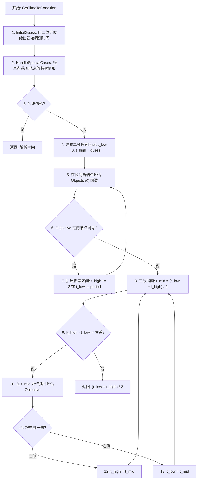

# 算法卡片 — 轨道事件条件（二分搜索求根）

> **状态**：draft
> **日期**：2026-06-11
> **索引证据**：function-index.jsonl (wsf_space, 14 个条件类), symbol-index.jsonl
> **关联文档**：space-integrating-propagator-card.md, space-norad-orbital-propagator-card.md

### 基础资料

- **算法名称**：Orbital Event Condition — Bisection Root-Finding（轨道事件条件 — 二分搜索求根）
- **算法所属模块**：wsf_space（空间/轨道力学模块）
- **算法功能**：在轨道传播过程中寻找满足特定几何条件（近地点、远地点、升交点、降交点、指定纬度幅角等）的时刻。采用二分搜索法在时间轴上求根，对非二体传播器（NORAD、数值积分）均适用。

### 算法流程

### 关键数学公式

1. **二分搜索算法**：对连续单调的目标函数 $f(t)$（`Objective` 方法），在 $[t_{low}, t_{high}]$ 区间求解 $f(t) = 0$：

   初始化：确保 $f(t_{low}) \cdot f(t_{high}) < 0$（异号）

   迭代：$t_{mid} = \frac{t_{low} + t_{high}}{2}$，若 $f(t_{low}) \cdot f(t_{mid}) < 0$ 则 $t_{high} = t_{mid}$，否则 $t_{low} = t_{mid}$

   收敛：$|t_{high} - t_{low}| < \epsilon$（通常 $\epsilon = 0.1$ 秒）

2. **近地点条件**：$f(t) = \dot{r}(t)$，求导数为零的时刻（距离变化率为零，且二阶导为正）。

3. **升交点条件**：$f(t) = z(t)$（ECI Z 分量），求从负到正穿越赤道面（$z=0$ 且 $\dot{z} > 0$）的时刻。

4. **初始猜测**（二体近似）：$t_{guess} = \frac{\Delta\theta}{n}$，其中 $\Delta\theta$ 为目标角度差，$n = \sqrt{\mu/a^3}$ 为平运动。

### 算法变量和常量

#### 输入变量

| 变量名 | 类型 | 中文说明 | 所属函数 (Method) |
|--------|------|----------|-------------------|
| `t_low` | double | 二分搜索下界（初始为 0） | GetTimeToCondition |
| `t_high` | double | 二分搜索上界（初始为二体近似猜测） | GetTimeToCondition |
| `propagator` | UtOrbitalPropagatorBase& | 轨道传播器引用 | GetTimeToCondition |
| `tolerance` | double | 二分搜索收敛容差 | GetTimeToCondition |
| `t_guess` | double | 二体近似初始猜测 | Objective |
| `r` | UtVector3 | 当前传播位置的 ECI 位置矢量 | Objective |
| `v` | UtVector3 | 当前传播位置的 ECI 速度矢量 | Objective |
| `r_target` | UtVector3 | 目标位置（传感器/天体位置） | Objective |
| `target_value` | double | 目标函数的目标值（通常为 0） | Objective |

#### 输出变量

| 变量名 | 类型 | 中文说明 | 所属函数 (Method) |
|--------|------|----------|-------------------|
| `t_root` | double | 二分搜索求得的根时间 | GetTimeToCondition |
| `event_time` | double | 事件触发时刻 | GetTimeToCondition |

#### 常量

| 常量名 | 类型 | 值 | 中文说明 | 所属函数 (Method) |
|--------|------|-----|----------|-------------------|
| `epsilon` | double | 0.1 (s) | 二分搜索收敛容差 | GetTimeToCondition |
| `max_iterations` | int | 50 | 最大迭代次数 | GetTimeToCondition |
| `mu` | double | 398600.44 km³/s² | 地球引力参数 | Objective |

### 14 个事件条件类

| 序号 | 条件类 | 中文名称 | 目标函数 $f(t) = 0$ | 所属函数 (Method) |
|------|--------|----------|---------------------|-------------------|
| 1 | `NoneCondition` | 无条件（尽快） | 恒为 0 | Objective |
| 2 | `RelativeTimeCondition` | 相对时间偏移 | $t - t_{offset} = 0$ | Objective |
| 3 | `PeriapsisCondition` | 近地点 | $\dot{r}(t) = 0, \ddot{r} > 0$ | Objective |
| 4 | `ApoapsisCondition` | 远地点 | $\dot{r}(t) = 0, \ddot{r} < 0$ | Objective |
| 5 | `AscendingNodeCondition` | 升交点 | $z(t) = 0, \dot{z} > 0$ | Objective |
| 6 | `DescendingNodeCondition` | 降交点 | $z(t) = 0, \dot{z} < 0$ | Objective |
| 7 | `EclipseEntryCondition` | 进入地影 | $\mathbf{r} \cdot \mathbf{r}_{sun} = -r \cdot R_E$ | Objective |
| 8 | `EclipseExitCondition` | 离开地影 | $\mathbf{r} \cdot \mathbf{r}_{sun} = -r \cdot R_E$ | Objective |
| 9 | `RadiusCondition` | 指定地心距 | $r(t) - r_{target} = 0$ | Objective |
| 10 | `AscendingRadiusCondition` | 上升穿越指定半径 | $r(t) - r_{target} = 0, \dot{r} > 0$ | Objective |
| 11 | `TrueAnomalyCondition` | 指定真近点角 | $\theta(t) - \theta_{target} = 0$ | Objective |
| 12 | `ArgumentOfLatitudeCondition` | 指定纬度幅角 | $u(t) - u_{target} = 0$ | Objective |
| 13 | `RAAN_IntersectionCondition` | 指定 RAAN 交线 | RAAN 平面交线条件 | Objective |
| 14 | `AOL_RelativeCondition` | 相对纬度幅角 | $\Delta u(t) - \Delta u_{target} = 0$ | Objective |

### 源码位置

| File | Symbol | Lines | 中文说明 |
|------|--------|-------|----------|
| [WsfSpaceOrbitalPropagatorCondition.hpp](source_root/src/core/wsf_space/source/WsfSpaceOrbitalPropagatorCondition.hpp) | `OrbitalPropagatorOptimizingCondition` | — | 二分搜索框架 — GetTimeToCondition 模板方法 |
| 同上 | `PeriapsisCondition` | — | 近地点条件 — $\dot{r}=0$ |
| 同上 | `ApoapsisCondition` | — | 远地点条件 |
| 同上 | `AscendingNodeCondition` | — | 升交点条件 — $z=0, \dot{z}>0$ |
| 同上 | 其他 11 个条件类 | — | 各类几何事件的 Objective/InitialGuess 实现 |

### 可移植性评分

**可移植性**：高 — 二分搜索算法极其标准，各条件的 `Objective` 函数为纯几何计算（位置/速度点积），不依赖任何专有库。

**框架依赖**：`UtOrbitalPropagatorBase`（需传播器支持 `Propagate` 到指定时刻），可替换为自定义 `IPropagator::PropagateToTime(t)` 接口。
