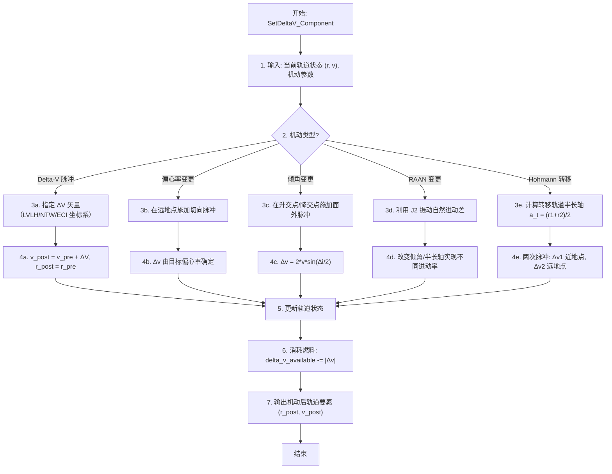

# 算法卡片 -- 经典轨道机动模型

> **状态**：draft
> **日期**：2026-06-11
> **索引证据**：function-index.jsonl (wsf_space maneuvers), symbol-index.jsonl
> **关联文档**：space-integrating-propagator-card.md, space-lambert-solver-card.md, space-rendezvous-targeting-card.md

### 基础资料

- **算法名称**：Classical Orbital Maneuvers — Delta-V Impulsive Maneuvers, Element Change, Hohmann Transfer（经典轨道机动 — Delta-V 脉冲机动、轨道要素变更、Hohmann 转移）
- **算法所属模块**：wsf_space（空间/轨道力学模块）
- **算法功能**：对航天器施加轨道机动，包括瞬时 Delta-V（速度脉冲）、轨道要素变更（偏心率/倾角/RAAN）、以及 Hohmann 共面圆轨道转移。所有机动均为脉冲机动假设（机动时间远小于轨道周期），位置不变而速度瞬时改变。

### 算法流程

所有机动类型均基于脉冲机动假设：推力冲量极大，机动时间远小于轨道周期，因此位置 $\mathbf{r}$ 在机动瞬间不变，仅速度 $\mathbf{v}$ 突变。这是一个合理且广泛使用的近似，对大多数轨道规划任务（除长时间低推力电推进外）精度充足。

### 算法变量和常量

#### 输入变量

| 变量名 | 类型 | 中文说明 | 所属函数 (Method) |
|--------|------|----------|-------------------|
| `delta_v` | UtVector3 | 施加的 ΔV 矢量 (m/s) | SetDeltaV_Component |
| `delta_v_mag` | double | ΔV 标量大小 (m/s) | SetDeltaV_Component |
| `target_eccentricity` | double | 目标偏心率 | ExecuteEvent |
| `target_inclination` | double | 目标倾角 (rad) | ExecuteEvent |
| `target_RAAN` | double | 目标升交点赤经 (rad) | ExecuteEvent |
| `target_orbit` | OrbitalElements | 目标轨道要素（用于 Hohmann 等） | ExecuteEvent |
| `coordinate_frame` | enum | ΔV 坐标系 (LVLH/NTW/ECI) | SetDeltaV_Component |

#### 输出变量

| 变量名 | 类型 | 中文说明 | 所属函数 (Method) |
|--------|------|----------|-------------------|
| `r_post` | UtVector3 | 机动后 ECI 位置矢量 (m) | ExecuteEvent |
| `v_post` | UtVector3 | 机动后 ECI 速度矢量 (m/s) | ExecuteEvent |
| `delta_v_total` | double | 总 ΔV 消耗 (m/s) | GetAvailableDeltaV |
| `maneuver_result` | OrbitalElements | 机动后轨道要素 | ExecuteEvent |

#### 常量

| 常量名 | 类型 | 值 | 中文说明 | 所属函数 (Method) |
|--------|------|-----|----------|-------------------|
| `mu` | double | 398600.44 km³/s² | 地球引力参数 | ExecuteEvent |
| `J2` | double | 1.08263e-3 | 地球 J2 摄动系数 | ExecuteEvent |
| `R_E` | double | 6378.137 km | 地球赤道半径 | ExecuteEvent |

### 关键数学公式

1. **Delta-V 机动（瞬时速度脉冲）**：

   位置不变，速度瞬时叠加：

   $\mathbf{v}_{post} = \mathbf{v}_{pre} + \Delta\mathbf{v}$

   $\mathbf{r}_{post} = \mathbf{r}_{pre}$

   其中 $\Delta\mathbf{v}$ 可在任意坐标系（LVLH、NTW、ECI）中指定，机动前需转换至 ECI 系。

2. **轨道要素变更方程**：

   **偏心率变更** -- 在远地点施加切向脉冲。远地点速度由活力公式给出，新偏心率 $e_{new}$ 对应的远地点速度不同：

   $\Delta v = \sqrt{\frac{\mu}{a}} \cdot \left(\sqrt{\frac{1+e_{new}}{1-e_{new}}} - \sqrt{\frac{1+e}{1-e}}\right)$

   **倾角变更** -- 在升交点或降交点施加面外脉冲。速度矢量在轨道面内旋转 $\Delta i$ 角：

   $\Delta v = 2 \cdot v \cdot \sin\left(\frac{\Delta i}{2}\right)$

   其中 $v$ 为机动点的轨道速度。

   **RAAN 变更** -- 利用 J2 摄动的自然进动率差：

   $\dot{\Omega}_{J2} = -\frac{3}{2} \cdot \frac{J_2 R_E^2}{p^2} \cdot n \cdot \cos i$

   其中 $p = a(1-e^2)$ 为半通径，$n = \sqrt{\mu/a^3}$ 为平均运动。通过改变轨道倾角或半长轴来实现不同的进动率，等待足够时间后 RAAN 自然分离到期望值。这是一种极省燃料的 RAAN 变更方法。

3. **Hohmann 转移**（共面圆轨道间最省燃料转移）：

   转移轨道半长轴：
   $a_t = \frac{r_1 + r_2}{2}$

   第一次脉冲（近地点加速）：
   $\Delta v_1 = \sqrt{\frac{2\mu}{r_1} - \frac{\mu}{a_t}} - \sqrt{\frac{\mu}{r_1}}$

   第二次脉冲（远地点加速/减速）：
   $\Delta v_2 = \sqrt{\frac{\mu}{r_2}} - \sqrt{\frac{2\mu}{r_2} - \frac{\mu}{a_t}}$

   总 ΔV：$\Delta v_{total} = |\Delta v_1| + |\Delta v_2|$

   转移时间（半个转移轨道周期）：$TOF = \pi \sqrt{\frac{a_t^3}{\mu}}$

4. **燃料消耗追踪**：

   每次机动从航天器预算中扣除：
   $\Delta v_{available} \leftarrow \Delta v_{available} - |\Delta v|$

   当 $\Delta v_{available} < |\Delta v|$ 时机动不可执行。

### 内部状态

每种机动类型的内部状态封装在对应的派生类中。父类 `WsfOrbitalManeuver` 提供所有机动共有的状态：

| 成员变量 | 类型 | 初始值 | 物理含义 | 更新时机 |
|----------|------|--------|----------|----------|
| `mDeltaV` | double | 0.0 | 本机动已消耗的 ΔV 总量（标量，m/s）。有限推力机动中随执行逐步累加，完成后为机动全量 | `ExecuteEvent` 中每次推力分段执行后累加 |
| `mRemainingDeltaV` | double | 与 ΔV 预算相同 | 本机动还需执行的剩余 ΔV。有限推力机动中随执行逐步递减到 0 | `ExecuteEvent` 中每次分段后扣减 |

**DeltaV 机动（`WsfOrbitalManeuvers::DeltaV`）**：

| 成员变量 | 类型 | 初始值 | 物理含义 | 更新时机 |
|----------|------|--------|----------|----------|
| `mConfiguredDeltaV` | UtVec3d | `{0,0,0}` | 用户配置的 ΔV 矢量，在所配置坐标系中表达（ECI 或 RIC） | 场景加载时通过 `delta_v` 输入命令设置 |
| `mFrame` | OrbitalReferenceFrame | `cUNKNOWN` | ΔV 矢量的参考坐标系。支持 `cINERTIAL`（ECI）和 `cRIC`（径向-沿迹-面外） | 与 `mConfiguredDeltaV` 同时配置 |

**偏心率变更（`ChangeEccentricity`）**：

| 成员变量 | 类型 | 初始值 | 物理含义 | 更新时机 |
|----------|------|--------|----------|----------|
| `mEccentricity` | double | 0.0 | 目标偏心率 e。机动后轨道偏心率应达到此值 | 场景加载时通过输入命令设置 |

**倾角变更（`ChangeInclination`）**：

| 成员变量 | 类型 | 初始值 | 物理含义 | 更新时机 |
|----------|------|--------|----------|----------|
| `mInclination` | UtAngleValue | 默认 0 rad | 目标倾角。机动后轨道倾角应达到此值 | 场景加载时通过输入命令设置 |

**RAAN 变更（`ChangeRAAN`，继承自 `ChangeRAAN_Inclination`）**：

| 成员变量 | 类型 | 初始值 | 物理含义 | 更新时机 |
|----------|------|--------|----------|----------|
| `mRAAN` | UtAngleValue | 默认 0 rad | 目标 RAAN。通过改变倾角或半长轴的 J2 进动率差来实现 RAAN 自然漂移到目标值 | 场景加载时通过 `RAAN` 输入命令设置 |
| `mInclination` | UtAngleValue | 默认 0 rad | 目标倾角（来自基类 `ChangeRAAN_Inclination`），与 RAAN 同时变更 | 场景加载时通过 `Inclination` 输入命令设置 |

**Hohmann 转移（`HohmannTransfer`）**：

| 成员变量 | 类型 | 初始值 | 物理含义 | 更新时机 |
|----------|------|--------|----------|----------|
| `mFinalSMA` | UtLengthValue | 0.0 | 目标圆轨道半长轴（或半径，取决于 `mInputAsRadius` 标志）。内部拆分为两次 `ChangeSemiMajorAxis` 机动 | 场景加载时通过 `final_semi_major_axis` 或 `final_radius` 输入命令设置 |
| `mInputAsRadius` | bool | `false` | 指示 `mFinalSMA` 是按半径还是半长轴解读 | 与 `mFinalSMA` 同时配置 |

### 变量映射表

**DeltaV 机动**（`DeltaV::ComputeDeltaV`，cpp 第 158-183 行）：

| 代码变量 | 数学符号 | 含义 |
|----------|----------|------|
| `mConfiguredDeltaV` | $\Delta\mathbf{v}_{cfg}$ | 用户配置的 ΔV 矢量 |
| `mFrame` | — | 坐标系枚举：`cINERTIAL`（ECI）或 `cRIC`（径向-沿迹-面外） |
| `aDeltaV` | $\Delta\mathbf{v}_{out}$ | 输出：等效 ECI 系 ΔV 矢量。ECI 模式下直接赋值；RIC 模式下通过 `ut::RIC_Frame::VelocityFromRIC` 转换后取差值 |
| `osvInertial` | $(\mathbf{r}, \mathbf{v})$ | 当前惯性系轨道状态矢量 |
| `vInertial` | $\mathbf{v}_{new}^{ECI}$ | RIC 模式：从当前 RIC 速度加上配置 ΔV 后还原为 ECI 速度 |

**Hohmann 转移**（`HohmannTransfer::Initialize`，cpp 第 46-82 行）：

| 代码变量 | 数学符号 | 含义 |
|----------|----------|------|
| `a1` | $a_1$ | 初始轨道的半长轴 |
| `e1` | $e_1$ | 初始轨道的偏心率 |
| `mFinalSMA` | $a_f$ / $r_f$ | 目标圆轨道半长轴/半径 |
| `transferSMA` | $a_t$ | 转移椭圆半长轴。升轨时 $a_t = (a_f + a_1(1-e_1))/2$（近地点处机动）；降轨时 $a_t = (a_f + a_1(1+e_1))/2$（远地点处机动） |
| `transferManeuverPtr` | — | 第一阶段机动：`ChangeSemiMajorAxis` 到 `transferSMA` |
| `finalManeuverPtr` | — | 第二阶段机动：`ChangeSemiMajorAxis` 到 `mFinalSMA` |
| `PeriapsisCondition` / `ApoapsisCondition` | — | 触发条件：升轨首段在近地点执行、末段在远地点执行；降轨反之 |

**基类 WsfOrbitalManeuver** 中的积累变量：

| 代码变量 | 数学符号 | 含义 |
|----------|----------|------|
| `mDeltaV` | $\sum |\Delta\mathbf{v}|$ | 累计执行的 ΔV 标量，每次 `ExecuteEvent` 分段后累加 |
| `mRemainingDeltaV` | $|\Delta\mathbf{v}_{rem}|$ | 剩余待执行的 ΔV 标量，有限推力机动中逐步递减到 0 |
| `GetAvailableDeltaV()` | $\Delta V_{avail}$ | 平台剩余总 ΔV 预算，每次机动后从预算中扣减 |

### 边界条件

1. **DeltaV 机动的数值稳定性保护**：
   - `EvaluatePreconditions` 中检查机动后轨道是否变为双曲轨道：在评估时刻（`mEvaluationTime`）用克隆传播器计算当前状态，施加 `mConfiguredDeltaV` 后调用 `UtLambertProblem::Hyperbolic()` 检查；若为双曲且传播器不允许双曲传播，则拒绝机动（cpp 第 118-141 行）
   - `EvaluatePostconditions` 中检查机动后轨道是否与中心天体表面相交（`OrbitIntersectsCentralBody()`），相交时记录错误（cpp 第 143-156 行）
   - 坐标系支持检查：仅 `cINERTIAL` 和 `cRIC` 有效，无效帧抛出 `BadValue` 异常（cpp 第 95-102 行）

2. **Hohmann 转移的边界条件**：
   - `ValidateParameterRanges`：`mFinalSMA` 必须 > 0（cpp 第 102-103 行）
   - `EvaluatePreconditions`：`mFinalSMA` 必须大于地球平均半径（`UtSphericalEarth::cEARTH_MEAN_RADIUS`）（cpp 第 89 行），否则目标轨道在地球内部
   - 升轨/降轨判断：根据 `mFinalSMA > a1` 确定转移方向，转移 SMA 公式不同：
     - 升轨（向外）：`transferSMA = (mFinalSMA + a1 * (1 - e1)) / 2`，首段近地点机动
     - 降轨（向内）：`transferSMA = (mFinalSMA + a1 * (1 + e1)) / 2`，首段远地点机动

3. **偏心率/倾角/RAAN 变更的执行条件**：
   - `ChangeEccentricity`：非圆轨道必须在近地点或远地点执行（头文件第 28-29 行注释要求），由 `Condition::cAT_PERIAPSIS` 或 `cAT_APOAPSIS` 确保
   - `ChangeInclination`：必须在升交点或降交点执行（头文件第 28-29 行注释），由 `Condition::cAT_ASCENDING_NODE` 或 `cAT_DESCENDING_NODE` 确保
   - `ChangeRAAN`：必须在北部或南部交点执行（头文件第 26-27 行注释），由 `Condition::cAT_NORTHERN_INTERSECTION` 或 `cAT_SOUTHERN_INTERSECTION` 确保

4. **通用保护**：
   - 所有机动在执行前经过 `EvaluatePreconditions` 检查（基类 `WsfOrbitalEvent` 定义的条件检查，如是否在正确轨道位置、是否有非零条件等）
   - 燃料不足时机动不执行：`EvaluatePreconditions` 中检查所需的 ΔV 是否小于等于可用预算
   - 有限推力机动中 `VerifyCondition()` 持续检查机动是否满足继续执行的条件

### 提取策略

**源文件与提取方式**：

| 源文件 | 提取内容 | 提取方式 |
|--------|----------|----------|
| `maneuvers/WsfOrbitalManeuversDeltaV.hpp` + `.cpp` | DeltaV 机动类：成员变量（`mConfiguredDeltaV`, `mFrame`）、`ComputeDeltaV()` 中的 ECI/RIC 速度转换、`EvaluatePreconditions` 中的双曲轨道检查、`EvaluatePostconditions` 中的地表相交检查 | 解析类声明获取成员变量；分析 `ComputeDeltaV` 方法体获取 RIC 转 ECI 的调用（`ut::RIC_Frame::VelocityFromRIC`）；分析 `EvaluatePreconditions/Postconditions` 获取验证逻辑 |
| `maneuvers/WsfOrbitalManeuversChangeEccentricity.hpp` | ChangeEccentricity 类：成员变量（`mEccentricity`）、条件约束（近地点/远地点） | 头文件注释直接说明执行条件；`mEccentricity` 为目标偏心率 |
| `maneuvers/WsfOrbitalManeuversChangeInclination.hpp` | ChangeInclination 类：成员变量（`mInclination`）、条件约束（升交点/降交点）、`EvaluateCompletion` | 头文件注释说明执行条件；通过 `GetInclination/SetInclination` 存取器推断参数语义 |
| `maneuvers/WsfOrbitalManeuversChangeRAAN.hpp` + `WsfOrbitalManeuversChangeRAAN_Inclination.hpp` | ChangeRAAN 类（继承自 ChangeRAAN_Inclination）：成员变量（`mRAAN`, `mInclination`）、利用 J2 进动差的策略 | 头文件注释说明无需直接产生 ΔV，而是通过等待 J2 自然进动实现 RAAN 变更；继承关系揭示 RAAN 与 Inclination 同时变更的能力 |
| `maneuvers/WsfOrbitalManeuversHohmannTransfer.hpp` + `.cpp` | HohmannTransfer 类：成员变量（`mFinalSMA`, `mInputAsRadius`）、`Initialize` 中的升轨/降轨分支和 TransferSMA 计算公式、内部拆分为两次 `ChangeSemiMajorAxis` 的组合 | 分析 `Initialize` 方法体提取转移 SMA 公式（升轨/降轨两种情况）；搜索 `AddMissionEvent` 确认组合模式 |
| `WsfOrbitalManeuver.hpp` | 父类通用状态：`mDeltaV`, `mRemainingDeltaV`；`ComputeDeltaV` 纯虚接口的签名和调用契约 | 解析基类声明，提取所有派生类共享的成员变量和虚函数约定 |
| `WsfSpaceScriptOrbitalManeuvers.hpp` | 脚本层类的注册信息，揭示哪些脚本命令映射到哪些 C++ 类 | 搜索 `Construct`, `SetDeltaV_Component`, `Frame` 等脚本方法注册，用于确认用户可见参数名 |
| `function-index.jsonl` | 各机动类型的所有公开函数（`Accept`, `ExecuteEvent`, `EvaluatePreconditions`, `GetAvailableDeltaV`, `SetDeltaV_Component`, `ProcessInput` 等），标注生命周期角色和算法提示 | 搜索 `DeltaV`, `Hohmann`, `ChangeEccentric`, `ChangeInclin`, `ChangeRAAN`, `maneuver` 关键词，提取全部相关函数的参数签名和角色标记 |

**提取依赖关系**：
- 所有机动类型的纯数学公式（Delta-V 叠加、偏心率/倾角变更的速度计算、Hohmann 的转移 SMA 和两次脉冲公式、J2 进动率公式）均可独立提取，不依赖 AFSIM 框架
- 坐标系转换（RIC 到 ECI）依赖 `ut::RIC_Frame::VelocityFromRIC`，移植时可用标准 RIC-ECI 转换矩阵（$\mathbf{T}_{RIC}^{ECI} = [\hat{\mathbf{r}}, \hat{\mathbf{c}}, \hat{\mathbf{i}}]$）替代
- 轨道传播器查询（`GetOrbitalState`, `GetOrbitalElements`）、中心天体信息（`GetCentralBody`, `GetGravitationalParameter`）属于框架胶水层，移植时需替换为自定义轨道状态结构和天体参数配置
- Hohmann 转移是组合模式（两次 `ChangeSemiMajorAxis` 加上 MissionSequence 调度），提取时应保留"组合基本机动+调度"的设计模式

### 源码位置

| File | Symbol | 中文说明 |
|------|--------|----------|
| [WsfDeltaVOrbitalManeuver.cpp](source_root/src/core/wsf_space/source/) | `SetDeltaV_Component()` | 瞬时 Delta-V 机动 — 指定 ΔV 矢量分量 |
| 同上 | `ExecuteEvent()` | 机动执行 — 更新轨道状态 + 从可用 ΔV 预算扣减 |
| 同上 | `GetAvailableDeltaV()` | 查询剩余 ΔV 预算 |
| [maneuvers/WsfOrbitalManeuversChangeEccentricity.hpp](source_root/src/core/wsf_space/source/maneuvers/) | `ChangeEccentricity` | 偏心率变更机动 |
| [maneuvers/WsfOrbitalManeuversChangeInclination.hpp](source_root/src/core/wsf_space/source/maneuvers/) | `ChangeInclination` | 倾角变更机动 |
| [maneuvers/WsfOrbitalManeuversChangeRAAN.hpp](source_root/src/core/wsf_space/source/maneuvers/) | `ChangeRAAN` | RAAN 变更机动（利用 J2 进动） |

### 可移植性评分

**可移植性**：高 — 所有机动方程均为标准航天动力学公式（Vallado, Bate-Mueller-White 等教材均有完整推导），可直接用公式重实现。脉冲机动假设使实现极为简单（位置不变、速度叠加），不依赖数值积分。J2 RAAN 变更是工程上广泛使用的省燃料策略。
