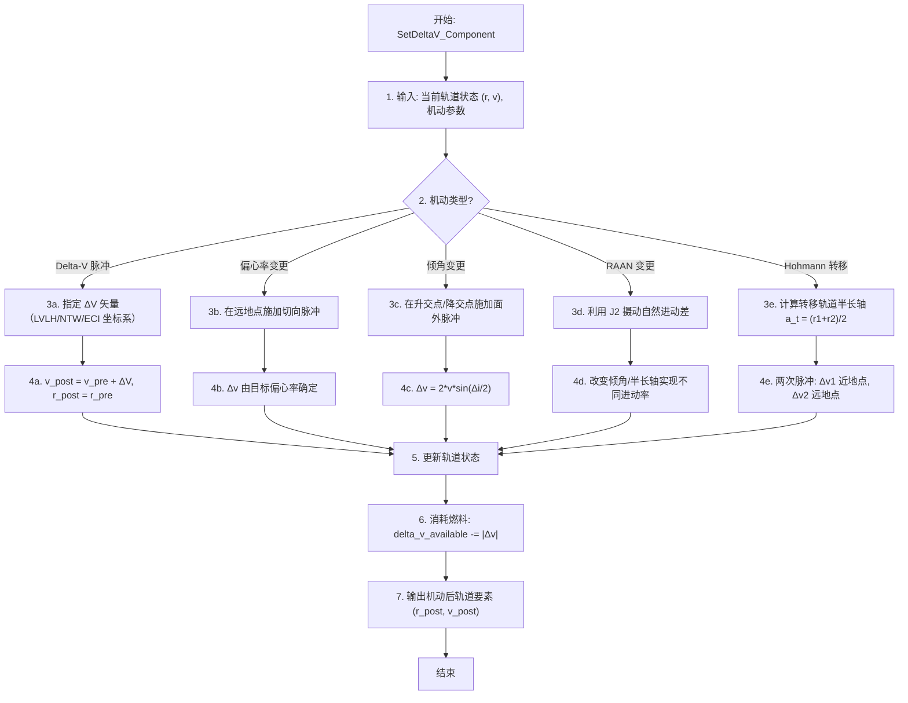

# 算法卡片 -- 经典轨道机动模型

> **状态**：draft
> **日期**：2026-06-11
> **索引证据**：function-index.jsonl (wsf_space maneuvers), symbol-index.jsonl
> **关联文档**：space-integrating-propagator-card.md, space-lambert-solver-card.md, space-rendezvous-targeting-card.md

### 基础资料

- **算法名称**：Classical Orbital Maneuvers — Delta-V Impulsive Maneuvers, Element Change, Hohmann Transfer（经典轨道机动 — Delta-V 脉冲机动、轨道要素变更、Hohmann 转移）
- **算法所属模块**：wsf_space（空间/轨道力学模块）
- **算法功能**：对航天器施加轨道机动，包括瞬时 Delta-V（速度脉冲）、轨道要素变更（偏心率/倾角/RAAN）、以及 Hohmann 共面圆轨道转移。所有机动均为脉冲机动假设（机动时间远小于轨道周期），位置不变而速度瞬时改变。

### 算法流程

所有机动类型均基于脉冲机动假设：推力冲量极大，机动时间远小于轨道周期，因此位置 $\mathbf{r}$ 在机动瞬间不变，仅速度 $\mathbf{v}$ 突变。这是一个合理且广泛使用的近似，对大多数轨道规划任务（除长时间低推力电推进外）精度充足。

### 算法变量和常量

#### 输入变量

| 变量名 | 类型 | 中文说明 | 所属函数 (Method) |
|--------|------|----------|-------------------|
| `delta_v` | UtVector3 | 施加的 ΔV 矢量 (m/s) | SetDeltaV_Component |
| `delta_v_mag` | double | ΔV 标量大小 (m/s) | SetDeltaV_Component |
| `target_eccentricity` | double | 目标偏心率 | ExecuteEvent |
| `target_inclination` | double | 目标倾角 (rad) | ExecuteEvent |
| `target_RAAN` | double | 目标升交点赤经 (rad) | ExecuteEvent |
| `target_orbit` | OrbitalElements | 目标轨道要素（用于 Hohmann 等） | ExecuteEvent |
| `coordinate_frame` | enum | ΔV 坐标系 (LVLH/NTW/ECI) | SetDeltaV_Component |

#### 输出变量

| 变量名 | 类型 | 中文说明 | 所属函数 (Method) |
|--------|------|----------|-------------------|
| `r_post` | UtVector3 | 机动后 ECI 位置矢量 (m) | ExecuteEvent |
| `v_post` | UtVector3 | 机动后 ECI 速度矢量 (m/s) | ExecuteEvent |
| `delta_v_total` | double | 总 ΔV 消耗 (m/s) | GetAvailableDeltaV |
| `maneuver_result` | OrbitalElements | 机动后轨道要素 | ExecuteEvent |

#### 常量

| 常量名 | 类型 | 值 | 中文说明 | 所属函数 (Method) |
|--------|------|-----|----------|-------------------|
| `mu` | double | 398600.44 km³/s² | 地球引力参数 | ExecuteEvent |
| `J2` | double | 1.08263e-3 | 地球 J2 摄动系数 | ExecuteEvent |
| `R_E` | double | 6378.137 km | 地球赤道半径 | ExecuteEvent |

### 关键数学公式

1. **Delta-V 机动（瞬时速度脉冲）**：

   位置不变，速度瞬时叠加：

   $\mathbf{v}_{post} = \mathbf{v}_{pre} + \Delta\mathbf{v}$

   $\mathbf{r}_{post} = \mathbf{r}_{pre}$

   其中 $\Delta\mathbf{v}$ 可在任意坐标系（LVLH、NTW、ECI）中指定，机动前需转换至 ECI 系。

2. **轨道要素变更方程**：

   **偏心率变更** -- 在远地点施加切向脉冲。远地点速度由活力公式给出，新偏心率 $e_{new}$ 对应的远地点速度不同：

   $\Delta v = \sqrt{\frac{\mu}{a}} \cdot \left(\sqrt{\frac{1+e_{new}}{1-e_{new}}} - \sqrt{\frac{1+e}{1-e}}\right)$

   **倾角变更** -- 在升交点或降交点施加面外脉冲。速度矢量在轨道面内旋转 $\Delta i$ 角：

   $\Delta v = 2 \cdot v \cdot \sin\left(\frac{\Delta i}{2}\right)$

   其中 $v$ 为机动点的轨道速度。

   **RAAN 变更** -- 利用 J2 摄动的自然进动率差：

   $\dot{\Omega}_{J2} = -\frac{3}{2} \cdot \frac{J_2 R_E^2}{p^2} \cdot n \cdot \cos i$

   其中 $p = a(1-e^2)$ 为半通径，$n = \sqrt{\mu/a^3}$ 为平均运动。通过改变轨道倾角或半长轴来实现不同的进动率，等待足够时间后 RAAN 自然分离到期望值。这是一种极省燃料的 RAAN 变更方法。

3. **Hohmann 转移**（共面圆轨道间最省燃料转移）：

   转移轨道半长轴：
   $a_t = \frac{r_1 + r_2}{2}$

   第一次脉冲（近地点加速）：
   $\Delta v_1 = \sqrt{\frac{2\mu}{r_1} - \frac{\mu}{a_t}} - \sqrt{\frac{\mu}{r_1}}$

   第二次脉冲（远地点加速/减速）：
   $\Delta v_2 = \sqrt{\frac{\mu}{r_2}} - \sqrt{\frac{2\mu}{r_2} - \frac{\mu}{a_t}}$

   总 ΔV：$\Delta v_{total} = |\Delta v_1| + |\Delta v_2|$

   转移时间（半个转移轨道周期）：$TOF = \pi \sqrt{\frac{a_t^3}{\mu}}$

4. **燃料消耗追踪**：

   每次机动从航天器预算中扣除：
   $\Delta v_{available} \leftarrow \Delta v_{available} - |\Delta v|$

   当 $\Delta v_{available} < |\Delta v|$ 时机动不可执行。

### 源码位置

| File | Symbol | 中文说明 |
|------|--------|----------|
| [WsfDeltaVOrbitalManeuver.cpp](source_root/src/core/wsf_space/source/) | `SetDeltaV_Component()` | 瞬时 Delta-V 机动 — 指定 ΔV 矢量分量 |
| 同上 | `ExecuteEvent()` | 机动执行 — 更新轨道状态 + 从可用 ΔV 预算扣减 |
| 同上 | `GetAvailableDeltaV()` | 查询剩余 ΔV 预算 |
| [maneuvers/WsfOrbitalManeuversChangeEccentricity.hpp](source_root/src/core/wsf_space/source/maneuvers/) | `ChangeEccentricity` | 偏心率变更机动 |
| [maneuvers/WsfOrbitalManeuversChangeInclination.hpp](source_root/src/core/wsf_space/source/maneuvers/) | `ChangeInclination` | 倾角变更机动 |
| [maneuvers/WsfOrbitalManeuversChangeRAAN.hpp](source_root/src/core/wsf_space/source/maneuvers/) | `ChangeRAAN` | RAAN 变更机动（利用 J2 进动） |

### 可移植性评分

**可移植性**：高 — 所有机动方程均为标准航天动力学公式（Vallado, Bate-Mueller-White 等教材均有完整推导），可直接用公式重实现。脉冲机动假设使实现极为简单（位置不变、速度叠加），不依赖数值积分。J2 RAAN 变更是工程上广泛使用的省燃料策略。
