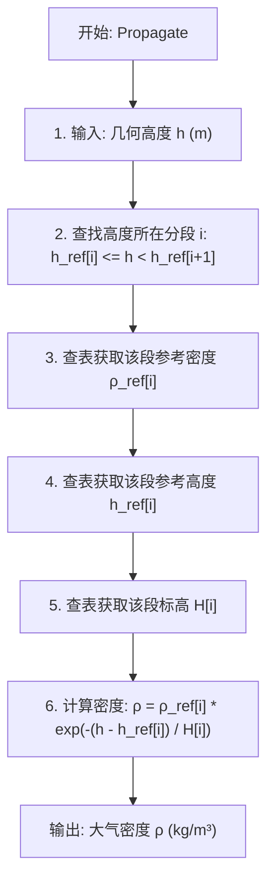

# 算法卡片 -- 分段指数大气密度模型

> **状态**：draft
> **日期**：2026-06-11
> **索引证据**：function-index.jsonl (wsf_space, PiecewiseExponential)
> **关联文档**：space-integrating-propagator-card.md, space-jacchia-roberts-atmosphere-card.md

### 基础资料

- **算法名称**：Piecewise Exponential Atmosphere Model（分段指数大气密度模型）
- **算法所属模块**：wsf_space（空间/轨道力学模块）
- **算法功能**：计算地球轨道上任意位置的大气密度，用于大气阻力计算。采用按高度分段的指数衰减模型——将大气沿垂直方向划分为多个高度段，每段内密度按指数函数衰减，标高由该段的平均温度决定。该模型计算速度快，适用于对大气密度精度要求不高或需要快速评估的场景。

### 算法流程

分段指数模型是工程中最简化和最常用的大气密度近似方法。核心思路是将连续变化的大气密度剖面离散为若干高度区间，在每个区间内用指数函数拟合密度随高度的衰减。标高 $H$ 为密度衰减到 $1/e$ 所需的高度差，与当地温度成正比。

### 算法变量和常量

#### 输入变量

| 变量名 | 类型 | 中文说明 | 所属函数 (Method) |
|--------|------|----------|-------------------|
| `h` | double | 几何高度 (m) | Propagate |
| `r_eci` | UtVector3 | ECI 位置矢量 (m)，用于提取高度 | Propagate |

#### 输出变量

| 变量名 | 类型 | 中文说明 | 所属函数 (Method) |
|--------|------|----------|-------------------|
| `rho` | double | 大气密度 (kg/m³) | Propagate |

#### 常量

| 常量名 | 类型 | 值 | 中文说明 | 所属函数 (Method) |
|--------|------|-----|----------|-------------------|
| `rho_ref` | double[] | 分段查表 | 各段参考密度 (kg/m³) | Initialize |
| `h_ref` | double[] | 分段查表 | 各段参考高度 (m) | Initialize |
| `H_i` | double[] | 分段查表 | 各段标高 (m) | Initialize |
| `R_gas` | double | 287.058 | 气体常数 (J/(kg·K)) | Initialize |
| `M_molar` | double | 28.9644 | 大气分子量 (kg/kmol) | Initialize |
| `g0` | double | 9.80665 | 海平面重力加速度 (m/s²) | Initialize |
| `R_E` | double | 6378137.0 | 地球赤道半径 (m) | Initialize |

### 关键数学公式

1. **分段指数大气密度模型**：

   将大气按高度分段，每段内为指数衰减：

   $\rho(h) = \rho_{ref,i} \cdot \exp\left(-\frac{h - h_{ref,i}}{H_i}\right)$

   其中：
   - $h$ 为几何高度（m）。
   - $h_{ref,i}$ 为第 $i$ 段的参考高度（m），通常取该段底边界高度。
   - $\rho_{ref,i}$ 为第 $i$ 段的参考密度（kg/m³），即 $h = h_{ref,i}$ 处的密度。
   - $H_i$ 为第 $i$ 段的标高（scale height, m）。

2. **标高计算**：

   标高与大气温度的关系由气压测高方程导出：

   $H_i = \frac{R \cdot T_i}{M \cdot g}$

   其中：
   - $R = 287.058$ J/(kg·K) 为空气气体常数。
   - $T_i$ 为第 $i$ 段平均温度（K）。
   - $M = 28.9644$ kg/kmol 为大气平均分子量。
   - $g = 9.80665$ m/s² 为海平面重力加速度。

3. **高度提取**：

   从 ECI 位置矢量提取几何高度：
   $h = |\mathbf{r}_{ECI}| - R_E$

   其中 $R_E = 6378137.0$ m 为地球赤道半径。

4. **加速度计算**（由动力学项调用，本模型仅提供密度）：

   $\mathbf{a}_{drag} = -\frac{1}{2} \cdot \frac{C_D A}{m} \cdot \rho \cdot |\mathbf{v}_{rel}| \cdot \mathbf{v}_{rel}$

   其中 $C_D$ 为阻力系数，$A$ 为横截面积，$m$ 为质量，$\mathbf{v}_{rel}$ 为相对于大气的速度。

### 源码位置

| File | Symbol | 中文说明 |
|------|--------|----------|
| [WsfPiecewiseExponentialAtmosphere.cpp](source_root/src/core/wsf_space/source/WsfPiecewiseExponentialAtmosphere.cpp) | `Propagate()` | 分段指数大气密度计算 — 按高度查表 + 指数衰减 |
| 同上 | `Initialize()` | 初始化分段表（参考高度/参考密度/标高） |
| [WsfAtmosphere.hpp](source_root/src/core/wsf_space/source/WsfAtmosphere.hpp) | `Atmosphere` | 大气模型基类接口 |

### 可移植性评分

**可移植性**：高 — 分段指数为纯数学公式（指数函数 + 查表），不依赖任何外部模型或观测数据。分段表参数（参考高度、参考密度、标高）可来自标准大气表或用户自定义。单位统一（SI），不依赖 AFSIM 核心库。移植只需实现分段查找和指数函数。
