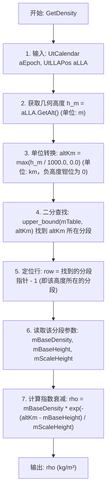

# 算法卡片 -- 分段指数大气密度模型

> **状态**：draft
> **日期**：2026-06-11
> **索引证据**：function-index.jsonl（注：该模型的核心函数 GetDensity、Construct 未在 function-index.jsonl 中收录；本卡片所有函数签名均从源码直接提取）
> **关联文档**：space-jacchia-roberts-atmosphere-card.md, space-integrating-propagator-card.md

---

### 基础资料

- **算法名称**：Piecewise Exponential Atmosphere Model（分段指数大气密度模型）
- **算法所属模块**：wsf_space（空间/轨道力学模块）
- **算法功能**：计算地球轨道上任意位置的大气密度，用于大气阻力计算。该模型将大气按高度分为 28 个分段，每段内密度按指数函数衰减，标高由该段的平均温度决定。与 Jacchia-Roberts 模型相比，该模型不考虑太阳活动、地磁活动、季节和昼夜变化，因此计算速度快，适用于对大气密度精度要求不高或需要快速评估的场景。参考文献：David A. Vallado, *Fundamentals of Astrodynamics and Applications*, Fourth Edition, pp. 565-568, Table 8-4。

---

### 算法流程

整个算法流程图如下：



其中，第一步获取输入的时间和地理坐标（时间在本模型中未使用，仅保持接口一致性）；第二步从 LLA 位置对象中提取几何高度；第三步将米转换为千米，并将海平面以下的负高度钳位为零；第四步使用 `std::upper_bound` 对 28 行静态表进行二分查找，找到第一个基准高度严格大于 `altKm` 的分段；第五步将指针前移一位，得到 `altKm` 实际所在的分段（基准高度 <= altKm）；第六步从该分段读取基准密度、基准高度和标高；第七步套用分段指数公式计算当前高度的密度并返回。

---

### 算法变量和常量

> 说明：function-index.jsonl 中未收录本模型的函数，以下"所属函数(Method)"列使用源码中的实际 C++ 函数名。

#### 1. 输入(input)

| 英文标识符(Symbol) | 中文名称(Name) | 数据类型(Type) | 含义(Meaning) | 单位(Units) | 所属函数(Method) |
| ---- | ---- | ---- | --- | ---- | ---- |
| `aEpoch` | 时间纪元 | `const UtCalendar&` | 查询时刻（本模型未使用，仅保持接口统一） | - | `GetDensity` |
| `aLLA` | 经纬度高度位置 | `const UtLLAPos&` | 地心地理坐标（纬度、经度、几何高度），本模型仅使用高度 | - | `GetDensity` |
| `aLLA.GetAlt()` | 几何高度 | `double`（UtLLAPos 内部方法返回值） | 几何高度，由 LLA 对象提供 | m | `GetDensity` |
| `altKm` | 几何高度（千米） | `double` | 由 `aLLA.GetAlt() / 1000.0` 得来，用于查表 | km | `GetDensity` |

#### 2. 输出(output)

| 英文标识符(Symbol) | 中文名称(Name) | 数据类型(Type) | 含义(Meaning) | 单位(Units) | 所属函数(Method) |
| ---- | ---- | ---- | --- | ---- | ---- |
| `rho` | 大气密度 | `double`（函数返回值） | 当前高度处的大气密度，通过分段指数公式计算 | kg/m³ | `GetDensity` |

#### 3. 常量(constant)

| 英文标识符(Symbol) | 中文名称(Name) | 数据类型(Type) | 含义(Meaning) | 单位(Units) | 所属函数(Method) |
| ---- | ---- | ---- | --- | ---- | ---- |
| `cTYPE` | 模型类型标识 | `static constexpr const char*`（值为 `"WSF_PIECEWISE_EXPONENTIAL_ATMOSPHERE"`） | 注册到场景类型系统中的唯一标识符 | - | 构造函数 `PiecewiseExponentialAtmosphere()` |
| `mTable[i].mBaseHeight` | 第 i 段基准高度 | `double` | 分段表中第 i 段的底边界高度（共 28 段） | km | `GetDensity`（只读） |
| `mTable[i].mScaleHeight` | 第 i 段标高 | `double` | 分段表中第 i 段的标高 scale height，密度衰减到 1/e 所需的高度差（共 28 段） | km | `GetDensity`（只读） |
| `mTable[i].mBaseDensity` | 第 i 段基准密度 | `double` | 分段表中第 i 段底边界处的大气密度（共 28 段） | kg/m³ | `GetDensity`（只读） |

**28 段分段表完整数据**（来源：Vallado, Table 8-4, p.567）：

| 段序号 | 基准高度 (km) | 标高 (km) | 基准密度 (kg/m³) |
| ---- | ---- | ---- | ---- |
| 0 | 0.0 | 7.249 | 1.225 |
| 1 | 25.0 | 6.349 | 3.899e-2 |
| 2 | 30.0 | 6.682 | 1.774e-2 |
| 3 | 40.0 | 7.554 | 3.972e-3 |
| 4 | 50.0 | 8.382 | 1.057e-3 |
| 5 | 60.0 | 7.714 | 3.206e-4 |
| 6 | 70.0 | 6.549 | 8.770e-5 |
| 7 | 80.0 | 5.799 | 1.905e-5 |
| 8 | 90.0 | 5.382 | 3.396e-6 |
| 9 | 100.0 | 5.877 | 5.297e-7 |
| 10 | 110.0 | 7.263 | 9.661e-8 |
| 11 | 120.0 | 9.473 | 2.438e-8 |
| 12 | 130.0 | 12.636 | 8.484e-9 |
| 13 | 140.0 | 16.149 | 3.845e-9 |
| 14 | 150.0 | 22.523 | 2.070e-9 |
| 15 | 180.0 | 29.740 | 5.464e-10 |
| 16 | 200.0 | 37.105 | 2.789e-10 |
| 17 | 250.0 | 45.546 | 7.248e-11 |
| 18 | 300.0 | 53.628 | 2.418e-11 |
| 19 | 350.0 | 53.298 | 9.518e-12 |
| 20 | 400.0 | 58.515 | 3.725e-12 |
| 21 | 450.0 | 60.828 | 1.585e-12 |
| 22 | 500.0 | 63.822 | 6.967e-13 |
| 23 | 600.0 | 71.835 | 1.454e-13 |
| 24 | 700.0 | 88.667 | 3.614e-14 |
| 25 | 800.0 | 124.64 | 1.170e-14 |
| 26 | 900.0 | 181.05 | 5.245e-15 |
| 27 | 1000.0 | 268.00 | 3.019e-15 |

---

### 关键数学公式

1. **分段指数大气密度公式**（核心公式）：

   在每一个高度分段 $[h_{ref,i},\ h_{ref,i+1})$ 内，大气密度按指数规律衰减，公式如下：

   $$\rho(h) = \rho_{ref,i} \cdot \exp\left(-\frac{h_{km} - h_{ref,i}}{H_i}\right)$$

   其中：
   - $\rho(h)$ 表示高度 $h$ 处的大气密度，单位为 kg/m³。
   - $\rho_{ref,i}$ 表示第 $i$ 段的基准密度（该段底边界高度处的密度），单位为 kg/m³，取值见上方 28 段分段表。
   - $h_{km}$ 表示几何高度，单位为 km（由输入的高度米值除以 1000 得到）。
   - $h_{ref,i}$ 表示第 $i$ 段的基准高度（该段底边界），单位为 km，取值见上方分段表。
   - $H_i$ 表示第 $i$ 段的标高（scale height），物理意义是密度衰减到 $1/e$ 所需的高度差，单位为 km，取值见上方分段表。

2. **标高与温度的关系**（理论背景，源码中直接查表而非实时计算）：

   标高由气压测高方程导出，公式如下：

   $$H_i = \frac{R \cdot T_i}{M \cdot g_0}$$

   其中：
   - $H_i$ 表示第 $i$ 段的标高，单位为 km。
   - $R = 287.058$ J/(kg·K)，为空气气体常数。
   - $T_i$ 表示第 $i$ 段的大气平均温度，单位为 K。
   - $M = 28.9644$ kg/kmol，为大气平均分子量。
   - $g_0 = 9.80665$ m/s²，为海平面重力加速度。

   > 注意：源码中 $H_i$ 直接从 Vallado 表 8-4 查取，不实时计算。此处给出公式仅供理解标高的物理含义。

3. **高度单位转换与钳位**（数值预处理）：

   $$h_{km} = \max\left(\frac{h_m}{1000.0},\ 0.0\right)$$

   其中：
   - $h_m$ 表示输入的几何高度，单位为 m。
   - $h_{km}$ 表示转换后的几何高度，单位为 km。
   - $\max(\cdot, 0.0)$ 表示将海平面以下的负高度钳位为 0，避免查表越界。

4. **大气阻力加速度**（本模型仅提供密度，此公式由调用方 `WsfAtmosphericDragTerm` 使用）：

   $$\mathbf{a}_{drag} = -\frac{1}{2} \cdot \frac{C_D \cdot A}{m} \cdot \rho \cdot v_{rel}^2 \cdot \hat{\mathbf{v}}_{rel}$$

   其中：
   - $\mathbf{a}_{drag}$ 表示大气阻力产生的加速度矢量，单位为 m/s²。
   - $C_D$ 表示阻力系数，无量纲（典型值 2.0-2.5）。
   - $A$ 表示航天器横截面积，单位为 m²。
   - $m$ 表示航天器质量，单位为 kg。
   - $\rho$ 表示大气密度，单位为 kg/m³，由本模型 `GetDensity()` 提供。
   - $v_{rel}$ 表示航天器相对于大气的速度标量，单位为 m/s。
   - $\hat{\mathbf{v}}_{rel}$ 表示相对速度方向的单位矢量，无量纲。

---

### 算法伪代码

```
// ============================================================
// 分段指数大气密度模型 - GetDensity()
// 功能：根据几何高度查询大气密度
// 调用上下文：由 WsfAtmosphericDragTerm::ComputeAcceleration() 调用，
//             用于获取大气密度以计算阻力加速度
// 输入：aEpoch (UtCalendar), aLLA (UtLLAPos)
// 输出：rho (double, kg/m³)
// ============================================================

function GetDensity(aEpoch, aLLA):
    // --- 第 1 步：提取几何高度 ---
    h_m = aLLA.GetAlt()          // 几何高度 (m)

    // --- 第 2 步：单位转换与负高度保护 ---
    altKm = max(h_m / 1000.0, 0.0)   // 转为 km，负高度钳位为 0

    // --- 第 3 步：二分查找所在分段 ---
    // upper_bound 返回第一个 mBaseHeight > altKm 的行
    // 前移一位后得到 altKm 所在分段（mBaseHeight <= altKm < 下一段 mBaseHeight）
    row = upper_bound(mTable, altKm, compareBy_mBaseHeight)
    row = row - 1   // 前移一位，定位到实际所在分段

    // --- 第 4 步：读取该分段的三个参数 ---
    rho_ref = row.mBaseDensity   // 该段底边界密度 (kg/m³)
    h_ref   = row.mBaseHeight    // 该段底边界高度 (km)
    H       = row.mScaleHeight   // 该段标高 (km)

    // --- 第 5 步：计算分段指数衰减密度 ---
    rho = rho_ref * exp(-(altKm - h_ref) / H)
    // rho: 当前高度处的大气密度 (kg/m³)

    // --- 第 6 步：返回结果 ---
    return rho
```

---

### 源码使用说明

#### 入口和调用链

```
→ PiecewiseExponentialAtmosphere::GetDensity()          // 核心入口：根据高度查表计算大气密度
  → aLLA.GetAlt()                                       // 获取几何高度 (m)
  → std::upper_bound(mTable, ..., compareBy_mBaseHeight) // 二分查找所在分段
  → std::exp(...)                                       // 指数衰减计算

→ WsfAtmosphericDragTerm::ComputeAcceleration()         // 上层调用者：大气阻力项
  → mAtmospherePtr->GetDensity(aTime, llaPos)           // 获取当前高度处的大气密度
  → prefactor = -0.5 * A * Cd * v² * rho / mass         // 计算阻力加速度

→ WsfScriptPiecewiseExponentialAtmosphere::Construct()  // 脚本层工厂方法：创建模型实例
  → ut::make_unique<PiecewiseExponentialAtmosphere>()   // 调用构造函数

→ WsfScriptAtmosphere::Density()                        // 脚本层查询密度
  → aObjectPtr->GetDensity(*calPtr, lla)                // 委托给 C++ GetDensity()
```

#### 源码位置

| 文件 (File) | 函数/类 (Symbol) | 行号 (Lines) | 中文说明 | 证据等级 (Evidence Level) |
| ---- | ---- | ---- | ---- | ---- |
| WsfPiecewiseExponentialAtmosphere.hpp | `class PiecewiseExponentialAtmosphere` | :32-63 | 分段指数大气模型类定义，含 Row 结构体和 28 段静态表声明 | source-cited |
| WsfPiecewiseExponentialAtmosphere.hpp | `Row` 结构体 | :48-60 | 分段表单行数据结构（mBaseHeight, mScaleHeight, mBaseDensity） | source-cited |
| WsfPiecewiseExponentialAtmosphere.hpp | `mTable` | :62 | 28 段静态常量数组声明 | source-cited |
| WsfPiecewiseExponentialAtmosphere.cpp | `PiecewiseExponentialAtmosphere()` | :38-42 | 构造函数，设置模型类型标识 | source-cited |
| WsfPiecewiseExponentialAtmosphere.cpp | `GetDensity()` | :44-53 | 核心算法：二分查找分段 + 指数衰减计算密度 | source-cited |
| WsfPiecewiseExponentialAtmosphere.cpp | `mTable` 初始化 | :26-36 | 28 段分段表完整数据（来自 Vallado Table 8-4, p.567） | source-cited |
| WsfScriptPiecewiseExponentialAtmosphere.hpp | `class WsfScriptPiecewiseExponentialAtmosphere` | :17-24 | 脚本层封装类声明 | source-cited |
| WsfScriptPiecewiseExponentialAtmosphere.cpp | `Construct()` | :25-34 | 脚本层工厂方法：创建 PiecewiseExponentialAtmosphere 实例 | source-cited |
| WsfAtmosphere.hpp | `class Atmosphere` | :29-58 | 大气模型抽象基类，定义 GetDensity 纯虚接口 | source-cited |
| WsfAtmosphere.cpp | `ProcessInput()` | :30-51 | 基类输入解析（central_body 命令） | source-cited |
| WsfAtmosphereTypes.cpp | `AtmosphereTypes()` | :28-33 | 将本模型注册到场景类型系统 | source-cited |
| WsfAtmosphericDragTerm.cpp | `ComputeAcceleration()` | :45-63 | 上层调用者：大气阻力加速度计算 | source-cited |

#### 框架依赖

| 依赖项 | 说明 | 是否可替换 |
| ---- | ---- | ---- |
| `WsfObject` | 基础对象框架，提供 SetType、GetName、ProcessInput 等基础设施 | 可替换，但需要自行实现对象注册和输入解析 |
| `WsfAtmosphere` | 大气模型抽象基类，定义 `GetDensity()` 纯虚接口 | 可替换，只需实现等价的抽象接口 |
| `UtLLAPos` | 经纬度高度位置类，提供 `GetAlt()` 方法 | 可替换，任何能提供几何高度（m）的结构体均可 |
| `UtCalendar` | 时间类（本模型未使用，仅保持接口一致） | 可替换为任意时间类型，或直接删除 |
| `std::upper_bound`（STL） | 标准库二分查找算法 | 不可替换，是核心算法步骤；可替换为手写二分查找 |
| `std::exp`（STL/C math） | 标准指数函数 | 不可替换，是核心数学运算 |
| `WsfScenario` / `WsfSimulation` | AFSIM 场景/仿真框架，用于模型注册和查询 | 可替换，但需要自行实现模型管理机制 |
| `WsfAtmosphericDragTerm` | 大气阻力项，是本模型的主要消费者 | 可替换，任何调用 GetDensity 的组件均可 |

#### 测试和验证计划

**最简测试方案**：

1. **单元级验证**：对 28 个分段的基准高度，验证 `GetDensity()` 返回值等于该段的基准密度 $\rho_{ref,i}$（此时指数项为 $e^0 = 1$）。
2. **段间连续性验证**：取相邻分段的边界高度 $h_{ref,i+1}$，分别用第 $i$ 段公式外推和第 $i+1$ 段公式内插，验证两值在容差范围内相等（分段表设计保证了连续性）。
3. **已知点对照**：对照 Vallado Table 8-4 中的典型值，例如：
   - 海平面 (h=0 km)：$\rho \approx 1.225$ kg/m³
   - 100 km 高度：$\rho \approx 5.297 \times 10^{-7}$ kg/m³
   - 500 km 高度：$\rho \approx 6.967 \times 10^{-13}$ kg/m³
4. **边界条件验证**：
   - 负高度（h < 0）：应返回海平面密度 1.225 kg/m³（钳位效果）。
   - 超出表范围（h > 1000 km）：应使用最后一段的指数衰减公式继续外推。
5. **与 Jacchia-Roberts 模型对比**：在平静太阳活动条件下，两者在 200-800 km 高度范围的密度量级应一致（差异在 2-5 倍以内）。

---

#### 可移植性评分

**可移植性**：高

**原因**：
1. 核心算法仅使用 `std::upper_bound`（二分查找）和 `std::exp`（指数函数），均为标准库函数，任何 C++ 编译器均支持。
2. 分段表数据（28 段）是静态常量，硬编码在源码中，不依赖任何外部数据文件或网络资源。
3. 不依赖太阳活动参数（$F_{10.7}$）或地磁指数（$K_p$），无需外部观测数据输入。
4. 单位统一使用 SI 制（km 用于高度查表，kg/m³ 用于密度输出），无复杂单位转换。
5. 仅需实现分段查找和指数衰减两个核心步骤，移植到 Python/JavaScript 等语言均可在 20 行内完成。

**移植注意事项**：
- 查表高度单位为 km（不是 m），需注意输入的高度单位转换。
- `std::upper_bound` 返回迭代器后需要 `--row` 前移一位，这是容易出错的细节。
- 最后一段（1000 km）以上的外推依赖于指数衰减，对于极高轨道（>1000 km）精度会下降。

---

### 内部状态

本模型不维护跨帧持久化的内部状态。

| 变量 | 说明 | 生命周期 | 位置 |
| ---- | ---- | ---- | ---- |
| `mTable` | 28 段静态分段表（编译时常量，所有实例共享同一份数据） | 进程级（`static const`） | WsfPiecewiseExponentialAtmosphere.hpp:62 |
| `mCentralBodyPtr` | 中心天体指针，由基类 `Atmosphere` 持有，默认为 `EarthEGM96` | 对象级（构造时初始化） | WsfAtmosphere.hpp:57（基类成员） |

> 说明：`PiecewiseExponentialAtmosphere` 是完全无状态的（stateless），每次调用 `GetDensity()` 仅依赖输入参数和静态常量表，计算结果不依赖历史调用。`mCentralBodyPtr` 由基类维护，本模型未使用。

---

### 变量映射表

| 代码变量 | 数学符号 | 含义 |
| ---- | ---- | ---- |
| `altKm` | $h_{km}$ | 几何高度（km），由输入高度（m）除以 1000 并钳位得到 |
| `row->mBaseHeight` | $h_{ref,i}$ | 第 $i$ 段基准高度（km），即该段的底边界 |
| `row->mScaleHeight` | $H_i$ | 第 $i$ 段标高（km），密度衰减到 $1/e$ 所需的高度差 |
| `row->mBaseDensity` | $\rho_{ref,i}$ | 第 $i$ 段基准密度（kg/m³），即 $h_{ref,i}$ 处的密度 |
| 返回值 `rho` | $\rho(h)$ | 当前高度处的大气密度（kg/m³） |
| `aEpoch` | - | 时间纪元（本模型未使用） |
| `aLLA` | - | 经纬度高度位置对象（本模型仅使用其高度） |

---

### 边界条件

| 条件 | 处理方式 | 源码证据 |
| ---- | ---- | ---- |
| **负高度**（h < 0，即海平面以下） | 钳位为 0 km，使用第 0 段参数计算（等效于返回海平面密度 1.225 kg/m³） | `std::max(aLLA.GetAlt() / 1000.0, 0.0)` — WsfPiecewiseExponentialAtmosphere.cpp:46 |
| **高度 = 0 km** | 正好落在第 0 段底边界，指数项为 $e^0 = 1$，返回基准密度 1.225 kg/m³ | upper_bound 返回第 1 段，--row 后指向第 0 段 — WsfPiecewiseExponentialAtmosphere.cpp:47-51 |
| **高度 = 1000 km**（最后一段底边界） | 正好落在第 27 段底边界，返回 3.019e-15 kg/m³ | upper_bound 返回 end()，--row 后指向最后一段 — WsfPiecewiseExponentialAtmosphere.cpp:51 |
| **高度 > 1000 km**（超出表范围） | 使用最后一段（1000 km）的参数继续指数外推，密度会低于 3.019e-15 kg/m³ | upper_bound 返回 end()，--row 后指向最后一段 — WsfPiecewiseExponentialAtmosphere.cpp:51 |
| **数值稳定性** | 表中最大 $H_i$ = 268 km（1000 km 段），最大指数参数为 $(1000-1000)/268 = 0$；极端情况下 $(altKm - h_{ref}) / H_i$ 不会溢出（双精度指数函数可处理约 +/-709 的参数） | std::exp 的标准行为 |
| **未使用的 aEpoch 参数** | 时间参数被忽略（函数签名中参数名被注释），不参与计算 | `/*aEpoch*/` — WsfPiecewiseExponentialAtmosphere.cpp:44 |
| **未使用的纬度/经度** | aLLA 中的纬度和经度被忽略，该模型不考虑空间位置变化 | 仅调用 `aLLA.GetAlt()` — WsfPiecewiseExponentialAtmosphere.cpp:46 |

---

### 提取策略

**提取来源**：

| 文件 | 提取内容 | 提取方式 |
| ---- | ---- | ---- |
| `WsfPiecewiseExponentialAtmosphere.hpp` | 类定义、Row 结构体、mTable 声明、cTYPE 常量 | 直接读取头文件 |
| `WsfPiecewiseExponentialAtmosphere.cpp` | GetDensity() 实现、28 段分段表完整数据、构造函数 | 直接读取源文件（核心算法所在） |
| `WsfScriptPiecewiseExponentialAtmosphere.hpp` | 脚本封装类声明 | 直接读取头文件 |
| `WsfScriptPiecewiseExponentialAtmosphere.cpp` | 脚本层 Construct 工厂方法实现 | 直接读取源文件 |
| `WsfAtmosphere.hpp` / `.cpp` | 基类接口定义、ProcessInput、mCentralBodyPtr | 直接读取（理解继承关系和接口契约） |
| `WsfAtmosphereTypes.cpp` | 模型注册到场景类型系统 | 直接读取（理解初始化流程） |
| `WsfAtmosphericDragTerm.cpp` | 大气阻力计算中的调用方式 | 直接读取（理解使用上下文） |

**提取方式说明**：

1. 核心算法从 `WsfPiecewiseExponentialAtmosphere.cpp` 的 `GetDensity()` 方法（仅 10 行代码）直接提取。
2. 分段表数据从同文件的 `mTable` 静态初始化列表中逐行提取，参考文献标注为 Vallado Table 8-4。
3. 调用链通过追踪 `GetDensity()` 的调用者（`WsfAtmosphericDragTerm::ComputeAcceleration()`）和脚本层封装（`WsfScriptPiecewiseExponentialAtmosphere`）构建。
4. 框架依赖通过分析 `#include` 指令和类继承关系确定。
5. function-index.jsonl 中未收录本模型的相关函数，所有函数信息直接从源码提取。
