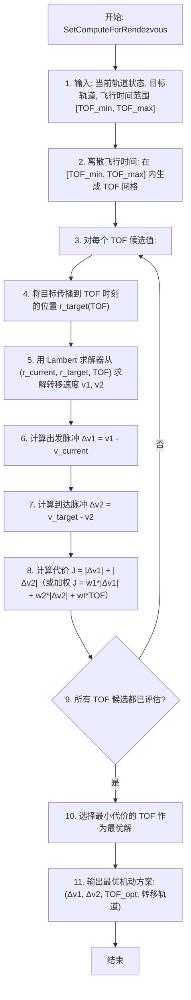

# 算法卡片 -- 轨道交会与拦截瞄准

> **状态**：draft
> **日期**：2026-06-11
> **索引证据**：function-index.jsonl (wsf_space maneuvers, SetComputeForRendezvous)
> **关联文档**：space-lambert-solver-card.md, space-orbital-maneuvers-card.md, space-integrating-propagator-card.md

### 基础资料

- **算法名称**：Orbital Rendezvous and Intercept Targeting（轨道交会与拦截瞄准）
- **算法所属模块**：wsf_space（空间/轨道力学模块）
- **算法功能**：计算航天器与目标航天器交会或拦截所需的转移轨道。以 Lambert 求解器为核心引擎，在给定的飞行时间范围内搜索最优转移轨道——最小化总 ΔV 或加权代价函数（ΔV + 时间）。不同于经典脉冲机动（给定 ΔV 直接执行），交会瞄准是一个逆向问题：从期望的终端状态反推所需的机动参数。

### 算法流程

交会瞄准的核心是在飞行时间-ΔV 空间中搜索 Pareto 最优解。对于给定的当前轨道和目标轨道，存在无限多组解（每个飞行时间对应一组 Lambert 解），优化目标是找到 ΔV 最小（或时间-燃料加权最优）的那一组。拦截问题可以看作是交会问题在远距离目标上的应用。

### 算法变量和常量

#### 输入变量

| 变量名 | 类型 | 中文说明 | 所属函数 (Method) |
|--------|------|----------|-------------------|
| `rendezvous_target` | WsfTrack | 交会目标航天器（含轨道状态和传播器） | SetComputeForRendezvous |
| `time_of_flight_min` | double | 最小飞行时间 (s) | SetComputeForRendezvous |
| `time_of_flight_max` | double | 最大飞行时间 (s) | SetComputeForRendezvous |
| `time_of_flight_grid` | double[] | 飞行时间候选网格 (s) | SetComputeForRendezvous |
| `current_r` | UtVector3 | 当前航天器 ECI 位置 (m) | SetComputeForRendezvous |
| `current_v` | UtVector3 | 当前航天器 ECI 速度 (m/s) | SetComputeForRendezvous |
| `weight_deltaV_1` | double | 出发脉冲 ΔV 权重 | SetComputeForRendezvous |
| `weight_deltaV_2` | double | 到达脉冲 ΔV 权重 | SetComputeForRendezvous |
| `weight_TOF` | double | 飞行时间权重 | SetComputeForRendezvous |

#### 输出变量

| 变量名 | 类型 | 中文说明 | 所属函数 (Method) |
|--------|------|----------|-------------------|
| `delta_v_1_opt` | UtVector3 | 最优出发脉冲 ΔV (m/s) | GetMaximumDeltaV |
| `delta_v_2_opt` | UtVector3 | 最优到达脉冲 ΔV (m/s) | GetMaximumDeltaV |
| `TOF_opt` | double | 最优飞行时间 (s) | GetMaximumDeltaT |
| `J_opt` | double | 最优代价函数值 | SetComputeForRendezvous |
| `transfer_orbit` | OrbitalElements | 转移轨道要素 | SetComputeForRendezvous |

#### 常量

| 常量名 | 类型 | 值 | 中文说明 | 所属函数 (Method) |
|--------|------|-----|----------|-------------------|
| `mu` | double | 398600.44 km³/s² | 地球引力参数 | SetComputeForRendezvous |
| `num_TOF_samples` | int | 100 | TOF 网格采样点数（默认） | SetComputeForRendezvous |

### 关键数学公式

1. **交会问题的 Lambert 表述**：

   已知当前状态 $(\mathbf{r}_1, \mathbf{v}_1)$ 和目标在 $TOF$ 后的位置 $\mathbf{r}_2 = \mathbf{r}_{target}(TOF)$，Lambert 求解器给出转移轨道的出发速度 $\mathbf{v}_{transfer,1}$ 和到达速度 $\mathbf{v}_{transfer,2}$：

   $(\mathbf{v}_{transfer,1}, \mathbf{v}_{transfer,2}) = \text{Lambert}(\mathbf{r}_1, \mathbf{r}_2, TOF, \mu)$

2. **出发和到达脉冲**：

   出发脉冲（当前速度 → 转移速度）：
   $\Delta\mathbf{v}_1 = \mathbf{v}_{transfer,1} - \mathbf{v}_{current}$

   到达脉冲（转移速度 → 目标速度）：
   $\Delta\mathbf{v}_2 = \mathbf{v}_{target}(TOF) - \mathbf{v}_{transfer,2}$

   其中 $\mathbf{v}_{target}(TOF)$ 为目标航天器在 $TOF$ 时刻的速度（通过其轨道传播器获得）。

3. **代价函数（瞄准优化目标）**：

   总 ΔV 代价：
   $J = |\Delta\mathbf{v}_1| + |\Delta\mathbf{v}_2|$

   加权代价（允许权衡燃料与时间）：
   $J = w_1 \cdot |\Delta\mathbf{v}_1| + w_2 \cdot |\Delta\mathbf{v}_2| + w_t \cdot TOF$

   其中 $w_1, w_2$ 为脉冲权重（通常 $w_1 = w_2 = 1$），$w_t$ 为时间权重（通常 $w_t \ll 1$，仅在时间紧迫时增大）。

4. **最大 ΔV 和最大飞行时间约束**：

   搜索过程中排除不可行解：
   - $|\Delta\mathbf{v}_1| > \Delta V_{max}$：出发脉冲超出推力器能力
   - $|\Delta\mathbf{v}_1| + |\Delta\mathbf{v}_2| > \Delta V_{available}$：总 ΔV 超出燃料预算
   - $TOF < TOF_{min}$ 或 $TOF > TOF_{max}$：飞行时间超出允许范围

5. **目标位置传播**：

   $\mathbf{r}_{target}(TOF) = \text{Propagate}(\mathbf{r}_{target,0}, \mathbf{v}_{target,0}, TOF)$

   其中 $\text{Propagate}$ 为目标航天器的轨道传播函数（可以是二体问题解析解、SGP4 或数值积分，取决于目标类型）。

### 内部状态

交会与拦截瞄准由 `WsfOrbitalManeuvers::Target` 类实现核心瞄准逻辑，`WsfOrbitalManeuvers::Rendezvous`（Target + MatchVelocity 组合）和 `WsfOrbitalManeuvers::Intercept`（Target + CompleteInterceptEvent 组合）实现高层次交会/拦截编排。

**Target 机动（核心瞄准类）**：

| 成员变量 | 类型 | 初始值 | 物理含义 | 更新时机 |
|----------|------|--------|----------|----------|
| `mComputeForRendezvous` | bool | `false` | 是否作为交会（Rendezvous）的一部分计算。为 true 时 Lambert 解要同时计算终端速度匹配量（`mFinalDeltaV`） | 由外层 Rendezvous 类通过 `SetComputeForRendezvous(true)` 在构造函数中设置 |
| `mOptimizeOption` | OptimizeOption | `cOPTIMIZE_NONE` | 优化策略枚举：`cOPTIMIZE_NONE`（固定时间求解）、`cOPTIMIZE_TIME`（最小化飞行时间）、`cOPTIMIZE_DELTA_V`（最小化 ΔV）、`cOPTIMIZE_COST`（最小化自定义代价函数） | 场景加载时通过 `optimize_time` / `optimize_delta_v` / `optimize_cost` 命令设置，或在构造函数中通过参数指定 |
| `mCostPtr` | CloneablePtr\<OrbitalTargetingCost\> | `nullptr` | 自定义代价函数指针。仅在 `cOPTIMIZE_COST` 模式下有效，提供 `IsLeastTime()` / `IsValid()` 等接口 | 场景加载时通过 `optimize_cost` 输入块加载，或通过 `SetOptimizationCost` 设置 |
| `mMaxTime` | UtTimeValue | 0.0 (s) | 飞行时间的上限约束。优化模式下为最大允许飞行时间；非优化模式下为 0 | 场景加载时通过 `maximum_time` / `maximum_delta_time` 命令设置；初始化时若从 TargetPoint 获取特征时间可自动填充 |
| `mDeltaTime` | UtTimeValue | 0.0 (s) | 固定飞行时间。仅在 `cOPTIMIZE_NONE` 模式下有效（此时 `mMaxTime` 的值赋给 `mDeltaTime`） | 场景加载时通过 `delta_time` 命令设置 |
| `mMaxDeltaV` | UtSpeedValue | 0.0 (m/s) | 单次脉冲 ΔV 上限约束。为 0 时初始化自动填充为平台可用 ΔV（`GetAvailableDeltaV()`） | 场景加载时通过 `maximum_delta_v` 命令设置；选择 `cOPTIMIZE_DELTA_V` 时必须 > 0 |
| `mInterceptTime` | UtCalendar | 默认历元 | 计算出的实际交会/拦截时刻（绝对日历时间）。`mStartTime + dT` 的结果 | 初始化时由 `OptimizeSolution` 或 `OptimizeNone` 计算；`ComputeDeltaV` 中使用此时间查询目标位置 |
| `mFinalDeltaV` | UtVec3d | (0,0,0) | 交会模式下（`mComputeForRendezvous=true`），拦截时刻追击器与目标的速度差。由 Lambert 解计算的转移到达速度与目标速度之差 | `FixedDtSolve` 中由 `WsfOrbitalTargeting::Solve` 填充 |
| `mTolerance` | double | `1.0e-9` | Lambert 瞄准求解的数值容差。传递给 `WsfOrbitalTargeting::SetTolerance` 用于控制 Lambert 迭代精度 | 场景加载时通过 `tolerance` 命令设置 |

**Rendezvous（交会编排）**：

| 成员变量 | 类型 | 初始值 | 物理含义 | 更新时机 |
|----------|------|--------|----------|----------|
| `mTargetPtr` | Target* | 指向第一子机动 | 非持久化指针，指向内部 Target 子机动对象。通过 `SetupManeuverPointers` 动态获取 | 构造函数末尾和拷贝构造时通过 `SetupManeuverPointers()` 解析内部序列 |
| `mMatchVelocityPtr` | MatchVelocity* | 指向第二子机动 | 非持久化指针，指向内部 MatchVelocity 子机动对象。在 Target 完成后执行，匹配目标速度 | 同上 |

**Intercept（拦截编排）**：

| 成员变量 | 类型 | 初始值 | 物理含义 | 更新时机 |
|----------|------|--------|----------|----------|
| `mTargetPtr` | Target* | 指向第一子机动 | 指向内部 Target 子机动。与 Rendezvous 共享相同的核心瞄准逻辑 | 构造函数末尾通过 `SetupManeuverPointers()` 解析 |
| `mCompleteInterceptPtr` | CompleteInterceptEvent* | 指向第二子事件 | 指向拦截完成事件（空操作，仅用于标记任务完成，不消耗 ΔV） | 同上 |

**基类 TargetingCapableManeuver（瞄准目标管理）**：

| 成员变量 | 类型 | 初始值 | 物理含义 | 更新时机 |
|----------|------|--------|----------|----------|
| `mTargetPtr` | unique_ptr\<OrbitalTargetPoint\> | `nullptr` | 目标点抽象指针。封装目标轨道传播器查询、位置/速度偏移、时间偏移/滞后、平动点目标等功能 | 初始化时通过 `TargetPointOptions` 创建 |
| `mTargetOptions` | TargetPointOptions | 含唯一 TrackId | 目标配置选项：平台名称、航迹 ID、位置偏移（含坐标系）、速度偏移、时间偏移、滞后时间、平动点设置 | 场景加载/构造函数中配置；初始化后 `mTargetPtr` 从中创建目标点对象 |

### 变量映射表

**Target 优化求解的核心变量**（`Target::OptimizeSolution`，cpp 第 347-413 行）：

| 代码变量 | 数学符号 | 含义 |
|----------|----------|------|
| `myProp` | — | 当前传播器的克隆。克隆后初始化并更新到机动开始时刻 `mStartTime`，确保优化搜索不污染原始传播器状态 |
| `tgt` | — | `WsfOrbitalTargeting` 对象，封装 Lambert 求解 + 目标状态的接口。接收开始时刻、传播器和目标点，负责在 [0, mMaxTime] 范围内搜索最优转移 |
| `dT` | $\Delta T_{opt}$ | 搜索得到的最优飞行时间 |
| `dV` | $\|\Delta\mathbf{v}_1\|$ | 搜索得到的最优出发 ΔV 标量 |
| `result` | — | `UtLambertProblem::Result` 对象。包含 `IsSolution()`, `IsHyperbolic()`, `HitsCentralBody()` 等状态标志 |
| `cTIME_TOLERANCE` | $10^{-2}$ s 或 $10^{-4}$ s | 优化搜索的时间精度容差。最小化时间模式用 1e-2 s（较快收敛）；最小化 ΔV 和代价模式用 1e-4 s（更精细） |

**优化策略与对应求解函数**：

| 代码枚举值 | 调用函数 | 优化目标 | 输入参数 |
|------------|----------|----------|----------|
| `cOPTIMIZE_TIME` | `tgt.MinimizeDeltaT(...)` | 在满足 ΔV 约束下最小化飞行时间 | `mMaxTime`（上界）, `mMaxDeltaV`, `mComputeForRendezvous`, `1e-2` 精度 |
| `cOPTIMIZE_DELTA_V` | `tgt.MinimizeDeltaV(...)` | 在给定时间窗口中最小化 ΔV | `mMaxTime`（窗口）, `mMaxDeltaV`（约束）, `mComputeForRendezvous`, `1e-4` 精度 |
| `cOPTIMIZE_COST` | `tgt.MinimizeCost(...)` | 最小化自定义加权代价函数 $J(\Delta T, \Delta V)$ | `*mCostPtr`, `mMaxTime`, `mMaxDeltaV`, `mComputeForRendezvous`, `1e-4` 精度 |
| `cOPTIMIZE_NONE` | `OptimizeNone` → `FixedDtSolve` | 固定飞行时间求解，不优化 | `mDeltaTime` |

**Target::FixedDtSolve**（cpp 第 447-461 行）：

| 代码变量 | 数学符号 | 含义 |
|----------|----------|------|
| `mInterceptTime` | $t_{intercept}$ | 交会绝对时间（`mStartTime + dT`），用于查询目标点在该时刻的位置与速度 |
| `dt` | $\Delta t$ | 从评估时刻到交会时刻的时间差：`mInterceptTime.GetTimeSince(mEvaluationTime)` |
| `aDeltaV` | $\Delta\mathbf{v}_1$ | 输出：出发机动脉冲（ECI 系） |
| `mFinalDeltaV` | $\Delta\mathbf{v}_{final}$ | 输出：交会时刻追击器与目标的速度差（仅在 `mComputeForRendezvous=true` 时有意义，传递给 MatchVelocity 机动） |
| `tgt.Solve(dt, aDeltaV, mFinalDeltaV)` | — | 核心 Lambert 求解调用：输入飞行时间 dt，输出出发 ΔV 和终端速度差 |

### 边界条件

1. **数值稳定性与求解保护**：
   - 所有优化搜索在克隆的传播器上进行（`ut::clone(aPropagator)`），确保搜索过程不修改原始状态
   - `ComputeDeltaV` 中当 `result.Assess()` 返回 false（无解、双曲不支持、或与地表相交），ΔV 被设置为 `std::numeric_limits<double>::max()`（cpp 第 343 行），确保解被标记为不可执行
   - `WsfOrbitalTargeting` 内部使用 `mTolerance = 1e-9` 作为 Lambert Universal 求解器的收敛容差
   - 最小化时间优化使用较粗收敛容差（1e-2 s），最小化 ΔV 和代价优化使用更精细容差（1e-4 s）

2. **无效输入处理**：
   - `Target::Initialize` 中检查 `mMaxTime == 0 && mMaxDeltaV == 0 && mDeltaTime == 0`：三项全零时报错 "Must define a delta time, maximum delta time, or maximum delta-v"（cpp 第 200-206 行）
   - `mMaxDeltaV > GetAvailableDeltaV()` 时：报错并拒绝初始化（cpp 第 208-216 行），告知用户指定 ΔV 超出平台总可用预算
   - `cOPTIMIZE_COST` 模式但 `mCostPtr` 为空或 `!mCostPtr->IsValid()` 时：报错并拒绝初始化（cpp 第 219-234 行）
   - `GetTargetPoint()` 返回 nullptr 时（目标点初始化失败，如目标平台不存在或航迹无效）：`Initialize` 返回 false（cpp 第 261-264 行）
   - `ValidateParameterRanges` 中对 `mMaxTime < 0`, `mDeltaTime < 0`, `mMaxDeltaV < 0` 分别报错（cpp 第 271-302 行）

3. **限幅阈值与约束**：
   - `mMaxTime`：若从 TargetPoint 获取特征时间自动填充（`GetTargetPoint()->GetCharacteristicTime()`），避免用户遗漏配置
   - `mMaxDeltaV`：若为 0 且从 TargetPoint 获取的特征时间有效，自动填充为 `GetAvailableDeltaV()`（cpp 第 247-250 行）
   - 优化搜索中的时间容差：1e-2 s（最小化时间）或 1e-4 s（最小化 ΔV 和代价）
   - Lambert 解验证标志：
     - `result.IsSolution()` = false：无有效解
     - `result.IsHyperbolic() && !aPropagator.HyperbolicPropagationAllowed()`：解为双曲但传播器不支持
     - `result.HitsCentralBody()`：转移轨道与中心天体表面相交
     - `dV > mMaxDeltaV`：解超出 ΔV 限幅

4. **回退行为**：
   - 优化搜索无解时：`OptimizeSolution` 返回 false，`mInterceptTime` 仍被设置但解无效；`Initialize` 失败
   - 非优化模式（`cOPTIMIZE_NONE`）无解时：`OptimizeNone` → `FixedDtSolve` 返回无效结果，`Assess()` 返回 false
   - Rendezvous 模式（`mComputeForRendezvous=true`）：解算时将终端速度差 `mFinalDeltaV` 传出给 MatchVelocity 机动，MatchVelocity 随后执行 ΔV = mFinalDeltaV 的速度匹配
   - 有限推力模式（`IsFinite() == true`）：产生警告 "Finite targeting maneuvers will have less accuracy in the resulting solution"（cpp 第 189-191 行），因为有限推力与 Lambert 脉冲假设不完全兼容

### 提取策略

**源文件与提取方式**：

| 源文件 | 提取内容 | 提取方式 |
|--------|----------|----------|
| `maneuvers/WsfOrbitalManeuversTarget.hpp` | Target 瞄准类完整声明：成员变量（`mComputeForRendezvous`, `mOptimizeOption`, `mCostPtr`, `mMaxTime`, `mDeltaTime`, `mMaxDeltaV`, `mInterceptTime`, `mFinalDeltaV`, `mTolerance`）、优化策略枚举 `OptimizeOption`（4 个枚举值及注释）、`FixedDtSolve` / `OptimizeSolution` / `OptimizeNone` 等关键方法签名 | 解析类声明获取所有成员变量类型和默认值（`mTolerance = 1e-9`）；解析枚举定义获取优化模式 |
| `maneuvers/WsfOrbitalManeuversTarget.cpp` | 优化求解完整逻辑：`OptimizeSolution`（第 347-413 行）中 4 种优化模式的分支和 `WsfOrbitalTargeting` 调用；`FixedDtSolve`（第 447-461 行）的固定时间求解；`Initialize`（第 198-269 行）的输入验证和保护逻辑；`ComputeDeltaV`（第 325-345 行）的失败处理（ΔV 设为 `max()`） | 分析方法体代码，提取各优化模式的容差常量（1e-2 / 1e-4）、输入验证条件链、错误消息字符串；提取 `TargetPoint` 的自动填充逻辑 |
| `maneuvers/WsfOrbitalManeuversRendezvous.hpp` + `.cpp` | Rendezvous 编排类：内部组合 Target + MatchVelocity 的 MissionSequence 模式；`AdvanceMissionEvent` 中 Target 完成后的 MatchVelocity 调度（读取 `GetInterceptTime()` 设置相对时间条件） | 分析 `AddMissionEvent` 调用和 `SetupManeuverPointers` 理解组合关系；分析 `AdvanceMissionEvent` 的拦截时间传递逻辑 |
| `maneuvers/WsfOrbitalManeuversIntercept.hpp` | Intercept 编排类：内部组合 Target + CompleteInterceptEvent（空操作完成事件）；`CompleteInterceptEvent` 内部类（第 113-128 行）仅返回 true 作为完成标记 | 分析类声明获取组合关系；`CompleteInterceptEvent` 为无操作标记事件 |
| `maneuvers/WsfOrbitalManeuversTargetingCapableManeuver.hpp` | 瞄准能力基类：`mTargetPtr`（OrbitalTargetPoint 唯一指针）、`mTargetOptions`（TargetPointOptions）；目标点管理接口 `UpdateTargetPoint`, `GetTargetPropagator`；偏移量存取器（位置/速度偏移、时间偏移/滞后、平动点、运动学状态） | 解析基类声明，提取目标点生命周期（初始化时创建、每次求解时更新到交会时刻）、偏移量类型和坐标系枚举 |
| `function-index.jsonl` | `Target::Accept`（line 3364），`Intercept::Accept`（line 3358），`Rendezvous::Accept`（line 3362），`GetMaximumDeltaV`（lines 3520-3521），`GetMaximumDeltaT`（lines 3517-3518），`GetDeltaTime`（lines 3464-3466），`GetVelocityOffset`（lines 3605-3606），`GetTolerance`（lines 3595-3596），`HasVelocityOffset`（line 3617），所有 `Set*` 存取器 | 搜索 `rendezvous`, `intercept`, `TargetingCapable`, `ComputeForRendezvous` 关键词，全量提取函数签名和生命周期角色标记 |

**提取依赖关系**：
- 纯算法层：Lambert 求解（`UtLambertProblem::Universal`）和代价最小化搜索（`WsfOrbitalTargeting::MinimizeDeltaT/MinimizeDeltaV/MinimizeCost`）可独立提取和理解
- Target 类本身依赖 `TargetingCapableManeuver` → `WsfOrbitalManeuver` → `WsfOrbitalEvent` 三层继承链，以及 `TargetPointOptions` → `OrbitalTargetPoint` 的目标点抽象层
- Rendezvous 和 Intercept 是 MissionSequence 组合模式（基类 `WsfOrbitalMissionSequence`），分别组合 Target + MatchVelocity 和 Target + CompleteInterceptEvent，移植时可保留"核心瞄准 + 编排调度"的分层架构
- 框架胶水部分：`WsfOrbitalTargeting` 内部调用 `UtLambertProblem::Universal` 和传播器 `Propagate`，移植时可用独立 Lambert 求解器和轨道传播函数替代；`TargetPointOptions` 和 `OrbitalTargetPoint` 的目标查询接口可用自定义目标轨道状态结构体替代

### 源码位置

| File | Symbol | 中文说明 |
|------|--------|----------|
| [maneuvers/WsfOrbitalManeuversTarget.hpp](source_root/src/core/wsf_space/source/maneuvers/) | `SetComputeForRendezvous()` | 交会瞄准入口 — 设置目标、TOF 范围和代价权重 |
| 同上 | `GetMaximumDeltaV()` | 查询最优机动方案的最大单次脉冲 ΔV |
| 同上 | `GetMaximumDeltaT()` | 查询最优飞行时间 |

### 可移植性评分

**可移植性**：高 — 交会瞄准算法的核心为 Lambert 求解器 + 一维代价函数最小化，两个子模块均为标准航天动力学方法。Lambert 求解器可独立移植（见 Lambert 卡片），代价函数优化为简单的网格搜索或黄金分割搜索。不依赖 AFSIM 特有组件。

**框架依赖**：`WsfTrack`（目标航迹 + 轨道传播器），可替换为含轨道状态和传播函数的自定义目标结构体。
