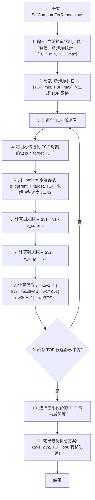

# 算法卡片 -- 轨道交会与拦截瞄准

> **状态**：draft
> **日期**：2026-06-11
> **索引证据**：function-index.jsonl (wsf_space maneuvers, SetComputeForRendezvous)
> **关联文档**：space-lambert-solver-card.md, space-orbital-maneuvers-card.md, space-integrating-propagator-card.md

### 基础资料

- **算法名称**：Orbital Rendezvous and Intercept Targeting（轨道交会与拦截瞄准）
- **算法所属模块**：wsf_space（空间/轨道力学模块）
- **算法功能**：计算航天器与目标航天器交会或拦截所需的转移轨道。以 Lambert 求解器为核心引擎，在给定的飞行时间范围内搜索最优转移轨道——最小化总 ΔV 或加权代价函数（ΔV + 时间）。不同于经典脉冲机动（给定 ΔV 直接执行），交会瞄准是一个逆向问题：从期望的终端状态反推所需的机动参数。

### 算法流程

交会瞄准的核心是在飞行时间-ΔV 空间中搜索 Pareto 最优解。对于给定的当前轨道和目标轨道，存在无限多组解（每个飞行时间对应一组 Lambert 解），优化目标是找到 ΔV 最小（或时间-燃料加权最优）的那一组。拦截问题可以看作是交会问题在远距离目标上的应用。

### 算法变量和常量

#### 输入变量

| 变量名 | 类型 | 中文说明 | 所属函数 (Method) |
|--------|------|----------|-------------------|
| `rendezvous_target` | WsfTrack | 交会目标航天器（含轨道状态和传播器） | SetComputeForRendezvous |
| `time_of_flight_min` | double | 最小飞行时间 (s) | SetComputeForRendezvous |
| `time_of_flight_max` | double | 最大飞行时间 (s) | SetComputeForRendezvous |
| `time_of_flight_grid` | double[] | 飞行时间候选网格 (s) | SetComputeForRendezvous |
| `current_r` | UtVector3 | 当前航天器 ECI 位置 (m) | SetComputeForRendezvous |
| `current_v` | UtVector3 | 当前航天器 ECI 速度 (m/s) | SetComputeForRendezvous |
| `weight_deltaV_1` | double | 出发脉冲 ΔV 权重 | SetComputeForRendezvous |
| `weight_deltaV_2` | double | 到达脉冲 ΔV 权重 | SetComputeForRendezvous |
| `weight_TOF` | double | 飞行时间权重 | SetComputeForRendezvous |

#### 输出变量

| 变量名 | 类型 | 中文说明 | 所属函数 (Method) |
|--------|------|----------|-------------------|
| `delta_v_1_opt` | UtVector3 | 最优出发脉冲 ΔV (m/s) | GetMaximumDeltaV |
| `delta_v_2_opt` | UtVector3 | 最优到达脉冲 ΔV (m/s) | GetMaximumDeltaV |
| `TOF_opt` | double | 最优飞行时间 (s) | GetMaximumDeltaT |
| `J_opt` | double | 最优代价函数值 | SetComputeForRendezvous |
| `transfer_orbit` | OrbitalElements | 转移轨道要素 | SetComputeForRendezvous |

#### 常量

| 常量名 | 类型 | 值 | 中文说明 | 所属函数 (Method) |
|--------|------|-----|----------|-------------------|
| `mu` | double | 398600.44 km³/s² | 地球引力参数 | SetComputeForRendezvous |
| `num_TOF_samples` | int | 100 | TOF 网格采样点数（默认） | SetComputeForRendezvous |

### 关键数学公式

1. **交会问题的 Lambert 表述**：

   已知当前状态 $(\mathbf{r}_1, \mathbf{v}_1)$ 和目标在 $TOF$ 后的位置 $\mathbf{r}_2 = \mathbf{r}_{target}(TOF)$，Lambert 求解器给出转移轨道的出发速度 $\mathbf{v}_{transfer,1}$ 和到达速度 $\mathbf{v}_{transfer,2}$：

   $(\mathbf{v}_{transfer,1}, \mathbf{v}_{transfer,2}) = \text{Lambert}(\mathbf{r}_1, \mathbf{r}_2, TOF, \mu)$

2. **出发和到达脉冲**：

   出发脉冲（当前速度 → 转移速度）：
   $\Delta\mathbf{v}_1 = \mathbf{v}_{transfer,1} - \mathbf{v}_{current}$

   到达脉冲（转移速度 → 目标速度）：
   $\Delta\mathbf{v}_2 = \mathbf{v}_{target}(TOF) - \mathbf{v}_{transfer,2}$

   其中 $\mathbf{v}_{target}(TOF)$ 为目标航天器在 $TOF$ 时刻的速度（通过其轨道传播器获得）。

3. **代价函数（瞄准优化目标）**：

   总 ΔV 代价：
   $J = |\Delta\mathbf{v}_1| + |\Delta\mathbf{v}_2|$

   加权代价（允许权衡燃料与时间）：
   $J = w_1 \cdot |\Delta\mathbf{v}_1| + w_2 \cdot |\Delta\mathbf{v}_2| + w_t \cdot TOF$

   其中 $w_1, w_2$ 为脉冲权重（通常 $w_1 = w_2 = 1$），$w_t$ 为时间权重（通常 $w_t \ll 1$，仅在时间紧迫时增大）。

4. **最大 ΔV 和最大飞行时间约束**：

   搜索过程中排除不可行解：
   - $|\Delta\mathbf{v}_1| > \Delta V_{max}$：出发脉冲超出推力器能力
   - $|\Delta\mathbf{v}_1| + |\Delta\mathbf{v}_2| > \Delta V_{available}$：总 ΔV 超出燃料预算
   - $TOF < TOF_{min}$ 或 $TOF > TOF_{max}$：飞行时间超出允许范围

5. **目标位置传播**：

   $\mathbf{r}_{target}(TOF) = \text{Propagate}(\mathbf{r}_{target,0}, \mathbf{v}_{target,0}, TOF)$

   其中 $\text{Propagate}$ 为目标航天器的轨道传播函数（可以是二体问题解析解、SGP4 或数值积分，取决于目标类型）。

### 源码位置

| File | Symbol | 中文说明 |
|------|--------|----------|
| [maneuvers/WsfOrbitalManeuversTarget.hpp](source_root/src/core/wsf_space/source/maneuvers/) | `SetComputeForRendezvous()` | 交会瞄准入口 — 设置目标、TOF 范围和代价权重 |
| 同上 | `GetMaximumDeltaV()` | 查询最优机动方案的最大单次脉冲 ΔV |
| 同上 | `GetMaximumDeltaT()` | 查询最优飞行时间 |

### 可移植性评分

**可移植性**：高 — 交会瞄准算法的核心为 Lambert 求解器 + 一维代价函数最小化，两个子模块均为标准航天动力学方法。Lambert 求解器可独立移植（见 Lambert 卡片），代价函数优化为简单的网格搜索或黄金分割搜索。不依赖 AFSIM 特有组件。

**框架依赖**：`WsfTrack`（目标航迹 + 轨道传播器），可替换为含轨道状态和传播函数的自定义目标结构体。
