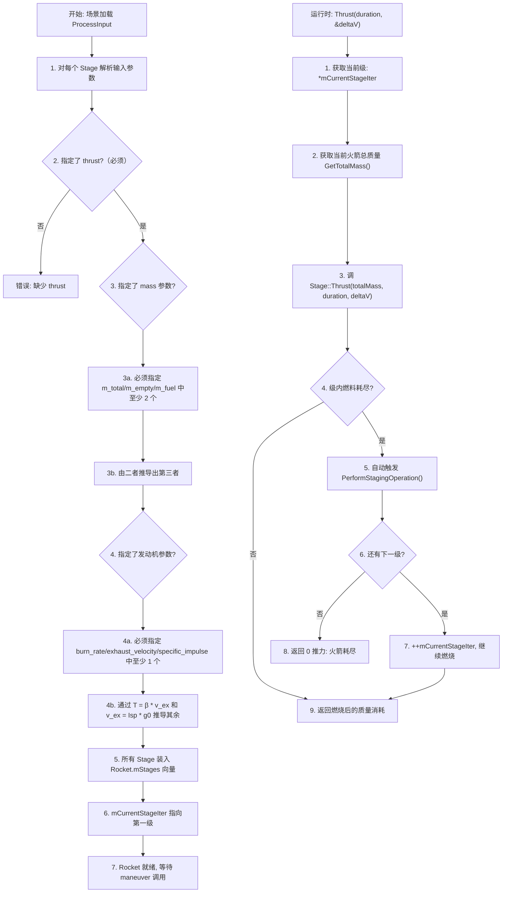

# 算法卡片 -- 多级火箭 Tsiolkovsky 方程模型

> **状态**：draft
> **日期**：2026-06-24
> **索引证据**：function-index.jsonl (WsfRocketOrbitalManeuvering Stage/Rocket math), symbol-index.jsonl
> **关联文档**：space-orbital-maneuvers-card.md, space-integrating-propagator-card.md

### 基础资料

- **算法名称**：Multi-Stage Rocket Tsiolkovsky Equation Model -- Stage-level Delta-V Computation, Rocket-level Stage Sequencing（多级火箭齐奥尔科夫斯基方程模型 -- 级层 ΔV 计算、火箭级间排序）
- **算法所属模块**：wsf_space（空间/轨道力学模块）
- **算法功能**：基于 Tsiolkovsky 火箭方程对多级火箭进行建模。`Stage` 类负责单级火箭的推进性能计算（ΔV、推力、燃烧时间），`Rocket` 类管理 `std::vector<Stage>` 序列，支持级间分离（`PerformStagingOperation`）和整个多级火箭的顶层查询（总质量/有效载荷质量/空重/ΔV/推力）。核心公式完全依据经典火箭方程 $T = \beta \cdot v_{ex}$ 和 $\Delta v = v_{ex} \cdot \ln(M_0 / M_f)$。

### 算法流程



`Stage` 实现 Tsiolkovsky 方程的单级计算，`Rocket` 实现多级序列管理和级间分离。全部公式基于理想火箭方程：恒定排气速度、恒定燃烧速率、忽略重力损失和空气阻力（脉冲近似）。这是一个分析模型，适用于轨道规划阶段的 ΔV 预算分配，对大多数化学火箭推进场景精度充足。

### 算法变量和常量

#### Stage 输入变量（ProcessInput 阶段）

| 变量名 | 类型 | 中文说明 | 所属函数 (Method) |
|--------|------|----------|-------------------|
| `thrust` | double | 本级的额定推力 (N)，必须指定 | Stage::ProcessInput |
| `total_mass` / `m_total` | double | 本级初始总质量 (kg)，wet mass | Stage::ProcessInput |
| `empty_mass` / `m_empty` | double | 本级空重（干重），燃烧后质量 (kg) | Stage::ProcessInput |
| `fuel_mass` / `m_fuel` | double | 本级燃料质量 (kg)。m_total = m_empty + m_fuel | Stage::ProcessInput |
| `burn_rate` / `m_burn_rate` | double | 燃料质量流率 (kg/s)。T = burn_rate * v_ex | Stage::ProcessInput |
| `exhaust_velocity` / `m_exhaust_velocity` | double | 有效排气速度 (m/s)。可从 Isp 推导 | Stage::ProcessInput |
| `specific_impulse` | double | 比冲 (s)。v_ex = Isp * g0，g0 = 9.80665 m/s² | Stage::ProcessInput |

#### Rocket 输入变量（ProcessInput 阶段）

| 变量名 | 类型 | 中文说明 | 所属函数 (Method) |
|--------|------|----------|-------------------|
| `stages` / `mStages` | `std::vector<Stage>` | 各级火箭的有序列表（Stage[0] 为第一级） | Rocket::ProcessInput |
| `perform_automatic_staging` | bool | 是否在当前级燃料耗尽时自动分离并点燃下一级 | Rocket::ProcessInput |

#### Stage 输出 / 查询变量

| 变量名 | 类型 | 中文说明 | 所属函数 (Method) |
|--------|------|----------|-------------------|
| `available_delta_v` | double | 本级的可用 ΔV (m/s) | Stage::GetAvailableDeltaV |
| `available_duration` | double | 本级全燃料燃烧的总持续时间 (s) | Stage::GetAvailableDuration |
| `required_duration` | double | 完成指定 ΔV 所需燃烧时间 (s) | Stage::GetRequiredDuration |
| `required_delta_v` | double | 在指定时间内可获得的 ΔV (m/s) | Stage::GetRequiredDeltaV |
| `actual_delta_v` | double& (输出参数) | Thrust() 实际执行的 ΔV (m/s) | Stage::Thrust |
| `actual_thrust` | double (返回值) | Thrust() 返回燃烧消耗的质量 (kg) | Stage::Thrust |
| `total_mass_after` | double | Thrust() 后当前级剩余的 m_total (kg) | Stage::Thrust |

#### Rocket 输出 / 查询变量

| 变量名 | 类型 | 中文说明 | 所属函数 (Method) |
|--------|------|----------|-------------------|
| `total_mass` | double | 从当前级到末级的总质量 (kg) | Rocket::GetTotalMass |
| `payload_mass` | double | 当前级之后所有级的总质量 (kg) | Rocket::GetPayloadMass |
| `empty_mass` | double | 当前级总质量减去燃料，即当前级燃烧后+上级总重 (kg) | Rocket::GetEmptyMass |
| `fuel_mass` | double | 当前级的燃料质量 (kg) | Rocket::GetFuelMass |
| `available_delta_v` | double | 从当前级起的全部可用 ΔV (m/s) | Rocket::GetAvailableDeltaV |
| `available_duration` | double | 当前级全燃料燃烧总持续时间 (s) | Rocket::GetAvailableDuration |
| `delta_v` | double& (输出参数) | Thrust() 实际执行的 ΔV (m/s) | Rocket::Thrust |

#### 常量

| 常量名 | 类型 | 值 | 中文说明 | 所属函数 (Method) |
|--------|------|-----|----------|-------------------|
| `g0` | double | 9.80665 m/s² | 标准重力加速度，用于 Isp 到 v_ex 的转换 | Stage::Initialize |
| `cINFINITE_DURATION` | double | 极大值 | 表示无限持续时间（当前级无法提供所需 ΔV 时返回） | Rocket::GetDuration |
| `cINFINITE_DELTA_V` | double | 极大值 | 表示无限 ΔV（燃烧时间超过当前级燃料时返回） | Rocket::GetDeltaV |

### 关键数学公式

1. **Tsiolkovsky 火箭方程（ΔV 计算）**：

   可用 ΔV 为燃料完全燃烧后获得的速度增量：

   $\Delta v_{max} = v_{ex} \cdot \ln\left(\frac{M_{total}}{M_{total} - m_{fuel}}\right) = v_{ex} \cdot \ln\left(\frac{M_{total}}{M_{empty}}\right)$

   其中 $M_{total}$ 为起飞总质量（含该级燃料），$M_{empty} = M_{total} - m_{fuel}$ 为燃烧后空重。

2. **推力与排气速度关系**：

   推力、燃烧速率和排气速度满足：

   $T = \beta \cdot v_{ex}$

   比冲与排气速度的关系：

   $v_{ex} = I_{sp} \cdot g_0$

   其中 $g_0 = 9.80665 \ \text{m/s}^2$。

3. **给定 ΔV 求燃烧时间**：

   从 Tsiolkovsky 方程反解时间。设质量流率为 $\beta$（kg/s），在时间 $\Delta t$ 内燃烧质量为 $\beta \cdot \Delta t$：

   $\Delta t = \frac{M_{total}}{\beta} \cdot \left(1 - \exp\left(-\frac{\Delta v}{v_{ex}}\right)\right)$

   推导：$\Delta v = v_{ex} \cdot \ln(M_{total} / (M_{total} - \beta \cdot \Delta t))$，解出 $\Delta t$。

4. **给定燃烧时间求 ΔV**：

   $\Delta v = v_{ex} \cdot \ln\left(\frac{M_{total}}{M_{total} - \beta \cdot \Delta t}\right)$

   约束：当 $\beta \cdot \Delta t \geq m_{fuel}$ 时燃料不足（燃烧时间超过可用燃料），ΔV 为 $+\infty$（cINFINITE_DELTA_V）。

5. **Stage::Thrust 的燃料消耗更新**：

   设当前总质量为 $M_{pre}$（含上级载荷），要求燃烧时间 $\Delta t$：
   - 计算最大可消耗燃料：$m_{burn} = \min(\beta \cdot \Delta t, \ m_{fuel}^{remaining})$
   - 实际燃烧质量：$m_{burned}$（若燃料不足则被截断）
   - 实际执行 ΔV：$\Delta v_{actual} = v_{ex} \cdot \ln\left(\frac{M_{pre}}{M_{pre} - m_{burned}}\right)$
   - 状态更新：$m_{fuel} \leftarrow m_{fuel} - m_{burned}$，$m_{total} \leftarrow m_{total} - m_{burned}$
   - 返回值：$m_{burned}$（燃烧消耗的质量，用于上级质量同步）

6. **Rocket::GetTotalMass 的多级求和**：

   $M_{total}^{rocket} = \sum_{i=current}^{N-1} m_{total}^{(i)}$

   其中 $m_{total}^{(i)}$ 为第 $i$ 级（0 索引为第一级）的当前总质量。调用私有重载 `GetTotalMass(mCurrentStageIter)` 实现。

7. **Rocket 级间分离**：

   `PerformStagingOperation()` 执行：
   - `++mCurrentStageIter`（迭代器前移，丢弃当前级）
   - 若 `mCurrentStageIter == mStages.end()`，返回 `false`（无更多级）
   - 触发 `StagingOperationPerformedCallback` 回调通知（`WsfObserver`）

### 内部状态

#### Stage 成员变量

| 成员变量 | 类型 | 初始值 | 物理含义 | 更新时机 |
|----------|------|--------|----------|----------|
| `mTotalMass` | double | 0.0 | 本级当前总质量（含剩余燃料和上级载荷）(kg) | `ProcessInput` 中设置；`Thrust` 中燃料消耗后递减 |
| `mEmptyMass` | double | 0.0 | 本级空重（燃烧后质量）(kg) | `ProcessInput` 中根据 mass 参数设置；运行期不变 |
| `mFuelMass` | double | 0.0 | 本级当前剩余燃料质量 (kg) | `ProcessInput` 中设置；`Thrust` 中按燃烧量扣减 |
| `mBurnRate` | double | 0.0 | 燃料质量流率 $\beta$ (kg/s) | `ProcessInput` 中根据 engine 参数设置；运行期不变 |
| `mThrust` | double | 0.0 | 额定推力 $T$ (N) | `ProcessInput` 中设置（必须）；运行期不变 |
| `mExhaustVelocity` | double | 0.0 | 有效排气速度 $v_{ex}$ (m/s) | `ProcessInput` 中根据 Isp 或直接给定设置；运行期不变 |

#### Rocket 成员变量

| 成员变量 | 类型 | 初始值 | 物理含义 | 更新时机 |
|----------|------|--------|----------|----------|
| `mStages` | `std::vector<Stage>` | 空 | 多级火箭的各级排序列表（Stage[0] 为第一级） | `ProcessInput` 中构建；在 `ReduceAvailableDeltaV_By` 中调用 `Stage::Thrust` 时修改各级的 `mTotalMass`/`mFuelMass` |
| `mCurrentStageIter` | `std::vector<Stage>::iterator` | `mStages.begin()` | 当前激活级的迭代器 | `Initialize` 中设为 begin()；`PerformStagingOperation` 中递增 |
| `mPerformAutomaticStaging` | bool | `false` | 是否在每级燃料耗尽时自动执行级间分离 | `ProcessInput` 中设置；运行期不变 |

#### WsfRocketOrbitalManeuvering 父类成员

`WsfRocketOrbitalManeuvering` 继承自 `WsfOrbitalManeuvering`，包含一个 `Rocket` 实例（作为其内部 Maneuvering 模型）。父类提供框架胶水层接口 `ProcessInput`、`Initialize`、`SetPlatformAttributes`、`GetRequiredDuration`、`GetRequiredDeltaV`、`GetAvailableDeltaV`、`GetAvailableDuration`、`ReduceAvailableDeltaV_By`、`PerformStagingOperation`、`Clone` 等。`WsfRocketOrbitalManeuvering` 将框架层的 ΔV 查询和消耗请求委派给内嵌的 `Rocket` 实例，`Rocket` 再委派给当前激活的 `Stage`（通过 `*mCurrentStageIter`）。

### 变量映射表

**Stage::GetAvailableDeltaV**（头文件第 40 行，获取本级最大 ΔV）：

| 代码变量 | 数学符号 | 含义 |
|----------|----------|------|
| `mTotalMass` | $M_{total}$ | 本级当前总质量（含剩余燃料和载荷） |
| `mFuelMass` | $m_{fuel}$ | 本级当前剩余燃料质量 |
| `mExhaustVelocity` | $v_{ex}$ | 有效排气速度 |
| `return` | $\Delta v_{max}$ | $v_{ex} \cdot \ln(M_{total} / (M_{total} - m_{fuel}))$ |

**Stage::GetDuration**（头文件第 60 行，计算给定 ΔV 所需的燃烧时间）：

| 代码变量 | 数学符号 | 含义 |
|----------|----------|------|
| `aTotalMass` | $M_{total}$ | 火箭总质量（含当前级+上级） |
| `aDeltaV` | $\Delta v_{req}$ | 请求的 ΔV |
| `mBurnRate` | $\beta$ | 燃料质量流率 |
| `mExhaustVelocity` | $v_{ex}$ | 排气速度 |
| `return` | $\Delta t$ | $(M_{total}/\beta) \cdot (1 - \exp(-\Delta v_{req} / v_{ex}))$ |

**Stage::GetDeltaV**（头文件第 61 行，计算给定时间内获得的 ΔV）：

| 代码变量 | 数学符号 | 含义 |
|----------|----------|------|
| `aTotalMass` | $M_{total}$ | 初始总质量 |
| `aDuration` | $\Delta t$ | 燃烧持续时间 |
| `mBurnRate` | $\beta$ | 燃料质量流率 |
| `mExhaustVelocity` | $v_{ex}$ | 排气速度 |
| `return` | $\Delta v$ | $v_{ex} \cdot \ln(M_{total} / (M_{total} - \beta \cdot \Delta t))$ |

**Stage::Thrust**（头文件第 71 行，执行实际燃烧）：

| 代码变量 | 数学符号 | 含义 |
|----------|----------|------|
| `aTotalMass` | $M_{total}$ | 当前总质量（输入参数） |
| `aDuration` | $\Delta t_{req}$ | 请求的燃烧时间 |
| `aDeltaV` | $\Delta v_{out}$ | 输出：实际获得的 ΔV |
| `mBurnRate` | $\beta$ | 燃料质量流率 |
| `mFuelMass` | $m_{fuel}$ | 本级剩余燃料（燃烧后递减） |
| `mTotalMass` | $M_{total}$ | 本级总质量（燃烧后递减） |
| `mExhaustVelocity` | $v_{ex}$ | 排气速度 |
| `return` | $m_{burned}$ | 燃烧消耗的质量 (kg) |

**Rocket::GetTotalMass**（头文件第 46 行，从当前级起的总质量）：

| 代码变量 | 数学符号 | 含义 |
|----------|----------|------|
| `mStages` | — | 所有级的向量 |
| `mCurrentStageIter` | — | 当前激活级的迭代器 |
| `return` | $\sum M_i$ | 从当前级到末级各 $m_{total}$ 之和 |

**Rocket::GetPayloadMass**（头文件第 116 行，当前级之上的载荷质量）：

| 代码变量 | 数学符号 | 含义 |
|----------|----------|------|
| `mCurrentStageIter` | — | 当前激活级 |
| `mStages` | — | 所有级 |
| `return` | $M_{payload}$ | 从当前级下一级到末级的总质量之和 |

**Rocket::Thrust**（头文件第 71 行，火箭级推力入口）：

| 代码变量 | 数学符号 | 含义 |
|----------|----------|------|
| `aDuration` | $\Delta t$ | 请求燃烧时间 |
| `aDeltaV` | $\Delta v_{out}$ | 输出：实际 ΔV |
| `*mCurrentStageIter` | — | 当前激活级 |
| `GetTotalMass()` | $M_{total}$ | 从当前级起的火箭总质量 |
| `mPerformAutomaticStaging` | — | 是否自动级间分离 |
| `return` | $m_{burned}$ | 燃烧消耗质量 |

### 边界条件

1. **Initialize 参数验证**：
   - 必须为每个 Stage 指定 `thrust`（否则 `Stage::Initialize` 返回 `false`）
   - 必须指定 `m_total`、`m_empty`、`m_fuel` 中至少 2 个参数（否则无法推导第三个）
   - 必须指定 `burn_rate`、`exhaust_velocity`、`specific_impulse` 中至少 1 个参数（否则无法确定发动机性能）
   - 无效参数组合导致 `Initialize()` 返回 `false`，仅记录错误日志而不抛出异常

2. **燃料不足时的 Thrust 截断行为**：
   - `Stage::Thrust` 中若燃料不足以支撑整个请求时间，实际燃烧时间截断至 $m_{fuel}^{remaining} / \beta$
   - 计算的 ΔV 按实际可消耗燃料计算，不超过 $v_{ex} \cdot \ln(M_{total} / (M_{total} - m_{fuel}^{remaining}))$
   - 返回值（燃烧质量）被限制在 $m_{fuel}^{remaining}$ 内
   - 级内燃料耗尽后 `mFuelMass == 0`

3. **级间分离（Staging）的保护**：
   - `PerformStagingOperation` 仅当 `mCurrentStageIter + 1 != mStages.end()` 时成功
   - 分离前当前级必须已耗尽（或手动要求分离），否则可能造成该级残存燃料被丢弃
   - 自动分离模式（`mPerformAutomaticStaging == true`）：`Thrust` 中监测到当前级 `mFuelMass == 0` 时自动调用 `PerformStagingOperation`
   - 分离失败时 `Rocket::Thrust` 返回 0（推力为零）

4. **ΔV 预算查询的保护**：
   - `Rocket::GetDuration(Δv)`：当前级无法提供足够 ΔV 时返回 `cINFINITE_DURATION`（极大值），表示当前级无法满足需求
   - `Rocket::GetDeltaV(duration)`：燃烧时间超过当前级燃料时返回 `cINFINITE_DELTA_V`（极大值）
   - `GetAvailableDeltaV` 在 `mFuelMass == 0` 时返回 0

5. **数值稳定性**：
   - Tsiolkovsky 公式中 $\ln$ 参数在分母趋近于 0（即 $M_{total} - m_{fuel} \to 0$，空重过小或燃料过多）时会导致 $+\infty$ 或 NaN。实现中通过质量参数验证（`m_empty > 0`）避免此情况
   - 燃烧质量流率 $\beta$ 必须 > 0（确保不出现除零）
   - 排气速度 $v_{ex}$ 必须 > 0

### 提取策略

**源文件与提取方式**：

| 源文件 | 提取内容 | 提取方式 |
|--------|----------|----------|
| `WsfRocketOrbitalManeuvering.hpp` (行 51-94, `Stage` 类) | Stage 成员变量（`mEmptyMass`, `mFuelMass`, `mTotalMass`, `mBurnRate`, `mThrust`, `mExhaustVelocity`）、所有查询方法（`GetDuration`, `GetDeltaV`, `GetAvailableDeltaV`, `GetAvailableDuration`, `GetThrust`, `GetBurnRate`, `GetSpecificImpulse`, `GetExhaustVelocity`, `GetTotalMass`, `GetEmptyMass`, `GetFuelMass`）、`Thrust` 方法签名 | 解析头文件类声明，提取成员变量列表和函数签名 |
| `WsfRocketOrbitalManeuvering.hpp` (行 97-126, `Rocket` 类) | Rocket 成员变量（`mStages`, `mCurrentStageIter`）、管理方法（`GetTotalMass`, `GetPayloadMass`, `GetEmptyMass`, `GetFuelMass`, `GetAvailableDeltaV`, `GetAvailableDuration`, `GetDuration`, `GetDeltaV`, `Thrust`, `PerformStagingOperation`） | 解析 `Rocket` 类声明，提取组合模式（`Rocket` 持有 `std::vector<Stage>`） |
| `WsfRocketOrbitalManeuvering.cpp` (行 1-484) | `Stage::Initialize` 的参数解析和推导逻辑、`Stage::Thrust` 的燃料消耗与 ΔV 计算、`Rocket::Thrust` 的委派和自动级间分离、`Rocket::GetTotalMass` 的求和实现 | 分析方法体获取参数解析代码（mass 推导、engine 参数推导）、Tsiolkovsky 方程的 std::log/std::exp 调用、级间分离的条件判断 |
| `WsfOrbitalManeuvering.hpp` | 基类 `WsfOrbitalManeuvering` 接口（纯虚函数声明）与 `WsfRocketOrbitalManeuvering` 的关系 | 搜索 `WsfRocketOrbitalManeuvering` 的继承声明，确认哪些接口来自基类 |
| `function-index.jsonl` | Stage/Rocket 全部方法索引（行 21240-21271），标注 `algorithm_hint: "math"` 和生命周期角色 | 搜索 `Stage::` 和 `Rocket::` 关键词提取函数列表、参数签名、const 属性 |

**提取依赖关系**：
- 核心数学公式（Tsiolkovsky 方程）为纯解析函数，无外部依赖，可直接移植到任何语言
- `Stage::Initialize` 中的参数验证和默认值推导依赖 `UtInput` 框架类——移植时可用简单的键值对映射替代
- `Stage::Thrust` 返回消耗质量（用于上层质量同步，如 `WsfSpaceMoverBase` 中更新平台质量）——移植时保持此设计模式
- `Rocket` 的组合模式（`std::vector<Stage>` + 迭代器）为标准 C++ STL 用法，移植时等价替换为语言的序列容器
- `PerformStagingOperation` 触发 `StagingOperationPerformedCallback` 回调（`WsfObserver` 监听），移植时可用事件通知模式替代

### 源码位置

| File | Symbol | 中文说明 |
|------|--------|----------|
| [WsfRocketOrbitalManeuvering.hpp](source_root/src/core/wsf_space/source/) | `class Stage` | 单级火箭模型：成员变量 + 全部查询方法和 Thrust 方法 |
| 同上 | `class Rocket` | 多级火箭管理：`mStages`, `mCurrentStageIter`, 级间分离 |
| 同上 | `Stage::GetAvailableDeltaV()` | 最大可用 ΔV 查询：$v_{ex} \cdot \ln(M_{total} / M_{empty})$ |
| 同上 | `Stage::GetDuration()` | 给定 ΔV 求燃烧时间 |
| 同上 | `Stage::GetDeltaV()` | 给定时间求 ΔV |
| 同上 | `Stage::Thrust()` | 执行实际燃烧并更新质量状态 |
| 同上 | `Stage::Initialize()` | 参数解析和质量/发动机参数推导 |
| 同上 | `Rocket::GetTotalMass()` | 从当前级起累计总质量 |
| 同上 | `Rocket::GetPayloadMass()` | 当前级载荷质量（上级总重） |
| 同上 | `Rocket::Thrust()` | 委派到当前激活级并处理自动级间分离 |
| 同上 | `Rocket::PerformStagingOperation()` | 执行级间分离，递增迭代器 |
| [WsfRocketOrbitalManeuvering.cpp](source_root/src/core/wsf_space/source/) | `Stage::Thrust` 实现 | 燃料消耗的截断逻辑 + 实际 ΔV 输出 |
| [WsfIntegratingPropagator.cpp](source_root/src/core/wsf_space/source/) | `WsfIntegratingPropagator` | 集成传播器（消费 Rocket 推力，更新航天器速度和质量） |

### 伪代码

```cpp
// ============ Stage::GetAvailableDeltaV ============
// 计算本级当前可用的最大 ΔV
double Stage::GetAvailableDeltaV(double aTotalMass) const {
    // 公式: Δv_max = v_ex * ln(M_total / (M_total - m_fuel))
    // 即: Δv_max = v_ex * ln(当前总质量 / 空重)
    return mExhaustVelocity * std::log(aTotalMass / (aTotalMass - mFuelMass));
}

// ============ Stage::GetDuration ============
// 计算完成指定 ΔV 所需的燃烧时间
double Stage::GetDuration(double aTotalMass, double aDeltaV) const {
    // 公式: Δt = (M_total / β) * (1 - exp(-Δv / v_ex))
    return (aTotalMass / mBurnRate) * (1.0 - std::exp(-aDeltaV / mExhaustVelocity));
}

// ============ Stage::GetDeltaV ============
// 计算指定燃烧时间内获得的 ΔV
double Stage::GetDeltaV(double aTotalMass, double aDuration) const {
    // 公式: Δv = v_ex * ln(M_total / (M_total - β*Δt))
    double mass_burned = mBurnRate * aDuration;  // 计划燃烧质量
    if (mass_burned >= mFuelMass) {
        return cINFINITE_DELTA_V;  // 燃料不足以支撑该燃烧时间
    }
    return mExhaustVelocity * std::log(aTotalMass / (aTotalMass - mass_burned));
}

// ============ Stage::Thrust ============
// 执行实际燃烧，消耗燃料并输出 ΔV
// 返回: 燃烧消耗的质量 (kg)
double Stage::Thrust(double aTotalMass, double aDuration, double& aDeltaV) {
    double mass_to_burn = mBurnRate * aDuration;          // 计划燃烧质量
    // 按可用燃料截断
    double mass_burned = std::min(mass_to_burn, mFuelMass);
    // 实际 ΔV: v_ex * ln(M_pre / (M_pre - m_burned))
    aDeltaV = mExhaustVelocity * std::log(aTotalMass / (aTotalMass - mass_burned));
    // 更新本级状态:
    // mFuelMass -= mass_burned;  燃料扣减
    // mTotalMass -= mass_burned; 总质量递减
    return mass_burned;  // 返回消耗质量，用于上级载荷质量同步
}

// ============ Rocket::GetTotalMass ============
// 从当前级起累计各级总质量
double Rocket::GetTotalMass() const {
    return GetTotalMass(mCurrentStageIter);  // 私有重载
}
double Rocket::GetTotalMass(const Stages::iterator aFromStage) const {
    double total = 0.0;
    for (auto iter = aFromStage; iter != mStages.end(); ++iter) {
        total += iter->GetTotalMass();  // 每个 Stage 的当前总质量
    }
    return total;
}

// ============ Rocket::GetPayloadMass ============
// 当前级之上的载荷质量（所有上级总质量）
double Rocket::GetPayloadMass() const {
    if (mCurrentStageIter == mStages.end()) return 0.0;
    auto next_iter = mCurrentStageIter;
    ++next_iter;
    return GetTotalMass(next_iter);
}

// ============ Rocket::Thrust ============
// 委派到当前激活级执行推力，必要时自动级间分离
double Rocket::Thrust(double aDuration, double& aDeltaV) {
    if (mCurrentStageIter == mStages.end()) {
        aDeltaV = 0.0;
        return 0.0;  // 无更多级
    }
    double totalMass = GetTotalMass();  // 含当前级+所有上级
    double massBurned = mCurrentStageIter->Thrust(totalMass, aDuration, aDeltaV);
    // 若燃料耗尽且启用了自动分离
    if (mPerformAutomaticStaging && /* 当前级燃料耗尽条件 */) {
        PerformStagingOperation();  // 切换到下一级
    }
    return massBurned;
}

// ============ Rocket::PerformStagingOperation ============
// 执行级间分离，抛弃当前级，激活下一级
bool Rocket::PerformStagingOperation() {
    if (mCurrentStageIter == mStages.end()) return false;
    ++mCurrentStageIter;  // 前移迭代器（前级被丢弃）
    if (mCurrentStageIter == mStages.end()) return false;  // 无更多级
    // 触发回调: StagingOperationPerformedCallback (WsfObserver)
    return true;
}
```

### 测试计划

1. **Tsiolkovsky 方程一致性测试**：
   - 输入：$M_{total} = 1000\text{ kg}, \ m_{fuel} = 500\text{ kg}, \ v_{ex} = 3000\text{ m/s}$
   - 期望 `GetAvailableDeltaV`：$3000 \cdot \ln(1000/500) = 3000 \cdot 0.6931 = 2079.4\text{ m/s}$
   - 验证 `GetDuration` 和 `GetDeltaV` 互为反函数（数值容差 $10^{-6}$）

2. **燃料不足截断测试**：
   - 当前级 $m_{fuel} = 50\text{ kg}, \beta = 10\text{ kg/s}$，请求 $\Delta t = 10\text{ s}$（需 $100\text{ kg}$ 燃料）
   - 期望实际燃烧仅 $5\text{ s}$，$m_{fuel} \to 0$，$aDeltaV$ 为可用最大 ΔV

3. **多级火箭总质量测试**：
   - 构造 3 级火箭：Stage0 (total=1000, fuel=400), Stage1 (total=600, fuel=300), Stage2 (total=200, fuel=100)
   - `GetTotalMass()` 期望：$1000 + 600 + 200 = 1800$
   - `GetPayloadMass()` 期望（当前为第 0 级）：$600 + 200 = 800$

4. **级间分离测试**：
   - 初始 `mCurrentStageIter` 指向 Stage[0]
   - 调用 `PerformStagingOperation()` 后，`mCurrentStageIter` 指向 Stage[1]
   - `GetTotalMass()` 从 1800 变为 800（Stage0 被丢弃）
   - 到末级后再调用 `PerformStagingOperation()` 返回 `false`

5. **Isp/g0 转换测试**：
   - 输入 `specific_impulse = 300 s`，期望 `v_ex = 300 * 9.80665 = 2941.995 m/s`
   - 输入 `thrust = 100000 N, burn_rate = 34.0 kg/s`，期望 `v_ex = 100000/34.0 = 2941.18 m/s`

6. **自动级间分离测试**：
   - Stage0: fuel=10, burn_rate=10 (1 秒烧完)；Stage1: fuel=100, burn_rate=10
   - 请求 `Thrust(aDuration=5.0, &deltaV)`：
   - 期望第 0 级燃烧 1 秒后自动分离，第 1 级继续燃烧 4 秒
   - 输出 `aDeltaV` 应为两级的累计 ΔV 之和

### 可移植性评分

**可移植性**：高 -- Tsiolkovsky 火箭方程为航天工程中最基础的公式之一，一百余年来在所有航天教材和实践中反复验证。核心计算仅涉及 `std::log` 和 `std::exp`，无特殊库依赖。`Stage`/`Rocket` 的二层模型设计清晰，可轻松翻译为 Python/Java/C# 等任何支持浮点运算的语言。需移植的唯一胶水代码是 `UtInput` 参数解析层（可用 JSON/YAML 配置文件替代）和 `StagingOperationPerformedCallback` 事件通知（可用标准观察者/回调模式替代）。
