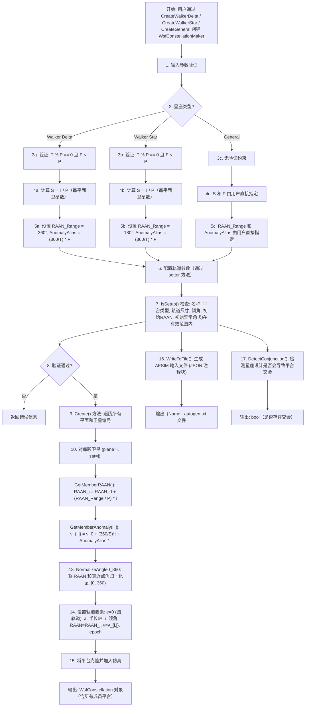

# 算法卡片 -- Walker 星座几何生成器

> **状态**：draft
> **日期**：2026-06-24
> **索引证据**：function-index.jsonl (WsfConstellationMaker 为空间/星座模块核心类, 创建 Walker Delta / Walker Star / General 三种星座几何)
> **关联文档**：space-integrating-propagator-card.md, space-orbital-maneuvers-card.md

### 基础资料

- **算法名称**：Walker Constellation Geometry Generator（Walker 星座几何生成器）
- **算法所属模块**：wsf_space（空间/轨道力学模块 -- 星座管理子模块）
- **算法功能**：使用 Walker 模式数学（Walker Delta, Walker Star）和通用（General）参数化方法生成卫星星座的轨道几何布局。为星座中的每个成员计算其轨道面的 RAAN（升交点赤经）和轨道内的真近点角（初始相位），构建完整的星座构型。

### 算法流程

整个算法流程图如下：



其中，Walker Delta 和 Walker Star 的区别仅在于 RAAN 分布范围（Delta: 360°，Star: 180°），两者均要求总卫星数 T 能被平面数 P 整除，且相位参数 F 必须小于 P。General 类型无此类约束，允许用户直接指定所有参数（每平面卫星数 S 可各不相同？-- 此处 General 的 S 仍为全局统一值，区别于 Walker 的是 P 和 S 无需满足 T/P 整除关系，且 RAAN 范围和异常角偏移由用户自由设置）。

### 算法变量和常量

#### 输入变量（Input）

| 英文标识符(Symbol) | 中文名称(Name) | 数据类型(Type) | 含义(Meaning) | 单位(Units) | 所属函数(Method) |
| ---- | ---- | ---- | --- | ---- | --- |
| aNumTotalSats | 总卫星数 | unsigned int | 星座中卫星总数 T | -- | CreateWalkerDelta, CreateWalkerStar |
| aNumPlanes | 轨道面数 | unsigned int | 轨道平面数量 P | -- | CreateWalkerDelta, CreateWalkerStar, CreateGeneral |
| aWalkerF | Walker F 参数 | unsigned int | 相邻平面的相对相位参数 F，取值范围 [0, P-1] | -- | CreateWalkerDelta, CreateWalkerStar |
| aNumSatsPerPlane | 每平面卫星数 | unsigned int | 每个轨道平面的卫星数量 S | -- | CreateGeneral |
| aAnomalyAlias | 异常角偏移量 | UtAngleValue | 相邻平面间卫星的异常角相位差（即 inter-plane phasing angle） | 度或弧度 | CreateGeneral |
| aRAAN_Range | RAAN 分布范围 | UtAngleValue | 轨道平面 RAAN 的总分布范围 | 度或弧度 | CreateGeneral |
| mInclination | 轨道倾角 | UtAngleValue | 所有轨道面的倾角 | 度或弧度 | SetInclination |
| mInitialRAAN | 初始 RAAN | UtAngleValue | 第 0 号轨道平面的 RAAN 值 | 度或弧度 | SetInitialRAAN |
| mInitialAnomaly | 初始真近点角 | UtAngleValue | 第 0 号平面第 0 颗卫星的真近点角 | 度或弧度 | SetInitialAnomaly |
| mOrbitSize | 轨道尺寸 | wsf::space::OrbitSize | 轨道大小（可通过半长轴、圆轨道高度、轨道周期或每日圈数指定） | m 或 s 或 rev/day | SetSemiMajorAxis / SetCircularAltitude / SetOrbitalPeriod / SetRevolutionsPerDay |
| mConstellationName | 星座名称 | std::string | 星座的唯一标识名称 | -- | SetConstellationName |
| mPlatformType | 平台类型名 | std::string | 星座成员的平台模板类型 | -- | SetPlatformType |
| mBasePath | 生成文件基础路径 | UtPath | 生成输入文件时的输出路径 | -- | SetBasePath |

#### 输出变量（Output）

| 英文标识符(Symbol) | 中文名称(Name) | 数据类型(Type) | 含义(Meaning) | 单位(Units) | 所属函数(Method) |
| ---- | ---- | ---- | --- | ---- | --- |
| retval (Create*) | 星座生成器指针 | unique_ptr\<WsfConstellationMaker\> | 创建的星座生成器对象，若参数无效则返回 nullptr | -- | CreateWalkerDelta, CreateWalkerStar |
| retval (CreateGeneral) | 星座生成器指针 | unique_ptr\<WsfConstellationMaker\> | 创建的星座生成器对象 | -- | CreateGeneral |
| retval (Create) | 星座指针 | WsfConstellation* | 已加入仿真的星座对象 | -- | Create |
| retval (DetectConjunction) | 是否存在交会 | bool | true 表示星座设计存在平台交会 | -- | DetectConjunction |
| GetMemberRAAN | 成员 RAAN | UtAngleValue | 第 aPlane 号平面的 RAAN 值 | 度或弧度 | GetMemberRAAN |
| GetMemberAnomaly | 成员真近点角 | UtAngleValue | 第 aPlane 号平面第 aSatellite 号卫星的真近点角 | 度或弧度 | GetMemberAnomaly |

#### 常量（Constant）

| 英文标识符(Symbol) | 中文名称(Name) | 数据类型(Type) | 值(Value) | 含义(Meaning) | 单位(Units) | 所属函数(Method) |
| ---- | ---- | ---- | --- | --- | --- | --- |
| cBASE_NAME | 星座名称键 | constexpr const char* | "Constellation Name" | 生成文件 JSON 中的名称键 | -- | OutputOptions |
| cPLATFORM_TYPE | 平台类型键 | constexpr const char* | "Platform Type" | 生成文件 JSON 中的平台类型键 | -- | OutputOptions |
| cGENERATION_PATH | 生成路径键 | constexpr const char* | "Path to generated files" | 生成文件 JSON 中的路径键 | -- | OutputOptions |
| cREVS_PER_DAY | 每日圈数键 | constexpr const char* | "Revs. Per Day" | 生成文件 JSON 中的每日圈数键 | -- | OutputOptions |
| cINCLINATION | 倾角键 | constexpr const char* | "Inclination" | 生成文件 JSON 中的倾角键 | -- | OutputOptions |
| cNUM_PLANES | 平面数键 | constexpr const char* | "Number of Planes" | 生成文件 JSON 中的平面数键 | -- | OutputOptions |
| cSATS_PER_PLANE | 每平面卫星数键 | constexpr const char* | "Satellites per Plane" | 生成文件 JSON 中的每平面卫星数键 | -- | OutputOptions |
| cINITIAL_RAAN | 初始 RAAN 键 | constexpr const char* | "Initial RAAN" | 生成文件 JSON 中的初始 RAAN 键 | -- | OutputOptions |
| cRAAN_RANGE | RAAN 范围键 | constexpr const char* | "RAAN Range" | 生成文件 JSON 中的 RAAN 范围键 | -- | OutputOptions |
| cINITIAL_ANOMALY | 初始异常角键 | constexpr const char* | "Initial Anomaly" | 生成文件 JSON 中的初始异常角键 | -- | OutputOptions |
| cANOMALY_ALIAS | 异常角偏移键 | constexpr const char* | "Anomaly Alias" | 生成文件 JSON 中的异常角偏移键 | -- | OutputOptions |
| cALTITUDE | 轨道高度键 | constexpr const char* | "Orbit Altitude" | 生成文件 JSON 中的轨道高度键 | -- | OutputOptions |
| cSEMI_MAJOR_AXIS | 半长轴键 | constexpr const char* | "Semi-major Axis" | 生成文件 JSON 中的半长轴键 | -- | OutputOptions |
| cPERIOD | 轨道周期键 | constexpr const char* | "Orbital Period" | 生成文件 JSON 中的轨道周期键 | -- | OutputOptions |
| cHEADER_START_MARKER | 文件头标记 | constexpr const char* | "# New file created..." | 生成文件的头部注释标记 | -- | OutputOptions |

### 关键数学公式

1. **Walker F 参数到异常角偏移的转换**：

   从 Walker 整型相位参数 F 计算相邻平面间的异常角偏移量（AnomalyAlias）：

   $$\Delta\phi = \frac{360^\circ}{T} \times F$$

   其中：
   - $T$ 为总卫星数 (`aNumTotalSats`)
   - $F$ 为 Walker 相位参数 (`aWalkerF`)，需满足 $0 \leq F < P$
   - $\Delta\phi$ 为 AnomalyAlias，单位：度

   源函数 `AnomalyAliasFromWalkerF` (WsfConstellationOptions.cpp line 252-255):
   ```cpp
   return UtAngleValue{(360.0 / aNumSatsTotal) * aWalkerF, UtUnitAngle::cDEGREES};
   ```

2. **Walker Delta 星座构型**（RAAN 范围 = 360°）：

   RAAN 分布（第 $i$ 号平面，$i = 0, 1, \dots, P-1$）：

   $$\Omega_i = \Omega_0 + \frac{360^\circ}{P} \times i$$

   真近点角（第 $i$ 号平面第 $j$ 颗卫星，$j = 0, 1, \dots, S-1$）：

   $$\nu_{i,j} = \nu_0 + \frac{360^\circ}{S} \times j + \Delta\phi \times i$$

3. **Walker Star 星座构型**（RAAN 范围 = 180°）：

   RAAN 分布（第 $i$ 号平面）：

   $$\Omega_i = \Omega_0 + \frac{180^\circ}{P} \times i$$

   真近点角（与 Delta 相同公式）：

   $$\nu_{i,j} = \nu_0 + \frac{360^\circ}{S} \times j + \Delta\phi \times i$$

4. **General 通用构型**（用户指定的 RAAN 范围和异常角偏移）：

   RAAN 分布（第 $i$ 号平面）：

   $$\Omega_i = \Omega_0 + \frac{\text{RAAN\_Range}}{P} \times i$$

   真近点角（第 $i$ 号平面第 $j$ 颗卫星）：

   $$\nu_{i,j} = \nu_0 + \frac{360^\circ}{S} \times j + \text{AnomalyAlias} \times i$$

5. **角度归一化**：

   所有 RAAN 和真近点角值均通过 `UtMath::NormalizeAngle0_360()` 归一化到 $[0^\circ, 360^\circ)$ 区间（WsfConstellationOptions.cpp line 214, 224）：

   $$\Omega_i = \Omega_i \bmod 360^\circ$$
   $$\nu_{i,j} = \nu_{i,j} \bmod 360^\circ$$

   若计算结果为负，则加 360° 映射到正区间。

6. **卫星命名规则**：

   每颗卫星的平台名称由星座名称、平面编号和卫星编号组成（WsfConstellationOptions.cpp line 204-207）：

   $$\text{Name}_{i,j} = \text{ConstellationName} + "\_" + i + "\_" + j$$

   例如：`"NavConst_0_3"` 表示星座 `NavConst` 中第 0 号平面第 3 颗卫星。

7. **轨道要素设置**：

   所有星座轨道均为圆轨道（`e = 0.0`），轨道要素包括：
   - 偏心率：$e = 0$
   - 半长轴：$a$（或等效的圆轨道高度、轨道周期、每日圈数）
   - 倾角：$i = mInclination$
   - 升交点赤经：$\Omega = \Omega_i$
   - 真近点角：$\nu = \nu_{i,j}$
   - 历元：$t_0$（仿真开始时刻 + 创建时间偏移）

### 算法伪代码

```
// ========== Walker Delta 星座创建 ==========
// 算法目标：验证 Walker Delta 参数并生成星座选项

function CreateWalkerDelta(aNumTotalSats, aNumPlanes, aWalkerF):
    // 第一步：验证 Walker 参数
    if NOT ValidWalkerInputs(aNumTotalSats, aNumPlanes, aWalkerF):
        return nullptr  // 参数无效，已打印错误日志

    // 第二步：构造星座选项
    options ← new WsfConstellationOptions{
        type: cWALKER_DELTA,
        numTotalSats: aNumTotalSats,
        numPlanes: aNumPlanes,
        satsPerPlane: aNumTotalSats / aNumPlanes,
        walkerF: aWalkerF,
        anomalyAlias: (360.0 / aNumTotalSats) * aWalkerF,  // 度
        raanRange: 360.0  // 度 -- Delta 的固定 RAAN 范围
    }

    // 第三步：创建并返回生成器
    return new WsfConstellationMaker(options)

// ========== Walker 参数验证 ==========
function ValidWalkerInputs(aNumTotalSats, aNumPlanes, aWalkerF):
    valid ← true
    if aNumTotalSats % aNumPlanes != 0:
        log_error("总卫星数必须能被平面数整除")
        valid ← false
    if aWalkerF >= aNumPlanes:
        log_error("F 参数必须小于平面数")
        valid ← false
    return valid

// ========== Walker Star 星座创建 ==========
function CreateWalkerStar(aNumTotalSats, aNumPlanes, aWalkerF):
    if NOT ValidWalkerInputs(aNumTotalSats, aNumPlanes, aWalkerF):
        return nullptr

    options ← new WsfConstellationOptions{
        type: cWALKER_STAR,
        numTotalSats: aNumTotalSats,
        numPlanes: aNumPlanes,
        satsPerPlane: aNumTotalSats / aNumPlanes,
        walkerF: aWalkerF,
        anomalyAlias: (360.0 / aNumTotalSats) * aWalkerF,
        raanRange: 180.0  // 度 -- Star 的固定 RAAN 范围
    }

    return new WsfConstellationMaker(options)

// ========== General 通用星座创建 ==========
function CreateGeneral(aNumPlanes, aNumSatsPerPlane, aAnomalyAlias, aRAAN_Range):
    options ← new WsfConstellationOptions{
        type: cGENERAL,
        numTotalSats: aNumPlanes * aNumSatsPerPlane,
        numPlanes: aNumPlanes,
        satsPerPlane: aNumSatsPerPlane,
        walkerF: 0,
        anomalyAlias: aAnomalyAlias,
        raanRange: aRAAN_Range
    }

    return new WsfConstellationMaker(options)

// ========== 成员 RAAN 计算 ==========
function GetMemberRAAN(aPlane):
    raan_deg ← GetInitialRAAN().degrees + GetRAAN_Range().degrees / GetNumPlanes() * aPlane
    raan_deg ← NormalizeAngle0_360(raan_deg)
    return UtAngleValue{raan_deg, cDEGREES}

// ========== 成员真近点角计算 ==========
function GetMemberAnomaly(aPlane, aSatellite):
    anom_deg ← GetInitialAnomaly().degrees
             + 360.0 / GetSatsPerPlane() * aSatellite
             + GetAnomalyAlias().degrees * aPlane
    anom_deg ← NormalizeAngle0_360(anom_deg)
    return UtAngleValue{anom_deg, cDEGREES}

// ========== 星座平台创建 (Create 方法) ==========
function Create(aCreationTime, aSimulation, aContext, aFilterScriptPtr, aSetupScriptPtr):
    // 第一步：验证平台类型存在且具有空间运动器
    platformType ← CheckTypeExistence(aSimulation)
    // 要求平台类型已定义且其 mover 为 WsfSpaceMoverBase 派生类

    // 第二步：检测命名冲突
    CheckNameCollisions(aSimulation)
    // 检查星座名是否已存在，检查各成员名是否与已有平台冲突

    // 第三步：添加成员到仿真
    constellationPtr ← AddMembersToSimulation(aCreationTime, aSimulation, aContext,
                                              aFilterScriptPtr, platformType)

    // 第四步：执行用户设置脚本
    SetupMembers(aContext, aSetupScriptPtr, aCreationTime, constellationPtr)

    return constellationPtr

// ========== 逐成员添加 (AddMembersToSimulation 核心) ==========
function AddMembersToSimulation(aCreationTime, aSimulation, aContext,
                                aFilterScriptPtr, aPlatformType):
    epoch ← 仿真起始时间 + aCreationTime
    remover ← AddedPlatformsRemover(aSimulation, aCreationTime)  // RAII 回滚保护

    for plane ← 0 to GetNumPlanes() - 1:
        for sat ← 0 to GetSatsPerPlane() - 1:
            // 过滤检查
            if FilterMember(aContext, aFilterScriptPtr, aCreationTime, plane, sat):
                continue  // 被用户脚本过滤掉的成员

            // 克隆平台模板
            memberPtr ← aPlatformType.Clone()

            // 设置轨道要素
            SetupMemberElements(memberPtr, plane, sat, epoch):
                moverPtr ← memberPtr.GetMover()  // 必须为 WsfSpaceMoverBase
                elements ← moverPtr.GetInitialOrbitalState().GetOrbitalElements()
                elements.SetEccentricity(0.0)
                elements.SetSemiMajorAxis(GetSemiMajorAxis().meters)
                elements.SetInclination(GetInclination().radians)
                elements.SetRAAN(GetMemberRAAN(plane).radians)
                elements.SetTrueAnomaly(GetMemberAnomaly(plane, sat).radians)
                elements.SetEpoch(epoch)
                initialState ← OrbitalState(cEQUATORIAL, cTRUE_OF_DATE, elements)
                moverPtr.SetInitialOrbitalState(initialState)
                memberPtr.SetName(GetMemberName(plane, sat))  // "{Name}_{plane}_{sat}"

            // 加入仿真
            if NOT aSimulation.AddPlatform(aCreationTime, memberPtr):
                throw runtime_error(添加失败)  // RAII 回滚已添加的平台

    // 创建星座管理对象
    constellationPtr ← new WsfConstellation(manager, mOptions)
    manager.AddConstellation(constellationPtr)

    remover.Release()  // 全部成功，释放回滚保护
    return manager.FindConstellation(GetConstellationName())

// ========== 验证是否设置完整 ==========
function ValidateSetup():
    errors ← ""
    if mConstellationType == cINVALID:
        errors += "Invalid constellation type.\n"
    if mConstellationName.empty():
        errors += "Must provide a name for the constellation.\n"
    if mPlatformType.empty():
        errors += "Must provide a platform type for the constellation.\n"
    if mOrbitSize.GetSemiMajorAxis() == 0.0:
        errors += "Orbit size is not defined.\n"
    if mInclination < 0.0 OR mInclination.degrees > 180.0:
        errors += "Inclination must be in the range [0.0, 180.0] degrees.\n"
    if mInitialRAAN < 0.0 OR mInitialRAAN.degrees > 360.0:
        errors += "Initial RAAN must be in the range [0.0, 360.0] degrees.\n"
    if mInitialAnomaly < 0.0 OR mInitialAnomaly.degrees >= 360.0:
        errors += "Initial Anomaly must be in the range [0.0, 360.0) degrees.\n"
    return errors
```

### 源码使用说明

#### 入口和调用链

```
// 方式一：通过脚本命令创建星座（典型使用路径）
WsfConstellationManager 脚本命令
  → WsfConstellationMaker::CreateWalkerDelta(T, P, F)   // 或 CreateWalkerStar / CreateGeneral
    → WsfConstellationOptions::CreateWalkerDelta(T, P, F)
      → ValidWalkerInputs(T, P, F)                     // 参数验证
      → AnomalyAliasFromWalkerF(F, T)                  // F → Δφ 转换
    → new WsfConstellationMaker(options)               // 不可变参数固化
  → maker.SetInclination(...)                         // 通过 setter 配置其余参数
  → maker.SetInitialRAAN(...)
  → maker.SetInitialAnomaly(...)
  → maker.SetSemiMajorAxis(...)  // 或 SetCircularAltitude / SetOrbitalPeriod / SetRevolutionsPerDay
  → maker.SetConstellationName(...)
  → maker.SetPlatformType(...)
  → maker.SetBasePath(...)
  → maker.IsSetup()               // 验证所有参数是否到位

// 方式二：创建星座并加入仿真
  → maker.Create(creationTime, simulation, context, filterScript, setupScript)
    → CheckTypeExistence(simulation)                   // 平台类型和空间运动器存在性
    → CheckNameCollisions(simulation)                  // 命名冲突检测
    → AddMembersToSimulation(...)                       // 逐成员克隆并加入
      → for plane, for sat:
        → FilterMember(...) if filterScript            // 用户过滤脚本
        → platformType.Clone()                        // 克隆平台模板
        → SetupMemberElements(memberPtr, plane, sat, epoch)
          → GetMemberRAAN(plane)                       // 公式计算 RAAN
          → GetMemberAnomaly(plane, sat)               // 公式计算真近点角
          → NormalizeAngle0_360(...)                   // 角度归一化
          → elements.SetEccentricity(0.0)              // 圆轨道
          → moverPtr.SetInitialOrbitalState(initialState)
        → simulation.AddPlatform(...)
    → SetupMembers(...) if setupScript                 // 用户设置脚本
    → return constellationPtr

// 方式三：生成 AFSIM 输入文件
  → maker.WriteToFile()
    → mOptions.ValidateSetup()                         // 验证设计完整性
    → GetGeneratedName()                               // 生成文件名
    → CreateContainingFolder()                         // 创建输出目录
    → ConstellationGenerator::Generate(mOptions, outFile)
      → 逐成员输出 create_platform 命令和轨道要素

// 方式四：检测星座交会
  → maker.DetectConjunction()
    → mOptions.ValidateSetup()                         // 先验证设计完整性
    → ConstellationConjunction::Assess(P, S, inclination, raanRange, anomalyAlias)
```

#### 源码位置

| File | Symbol | Lines | 中文说明 |
|------|--------|-------|----------|
| [WsfConstellationMaker.hpp](source_root/afsim-2_9/swdev/src/core/wsf_space/source/WsfConstellationMaker.hpp) | `WsfConstellationMaker` | 40-184 | 星座生成器主类声明 |
| 同上 | `CreateWalkerDelta()` | 43-45 | Walker Delta 静态工厂方法 |
| 同上 | `CreateWalkerStar()` | 46-48 | Walker Star 静态工厂方法 |
| 同上 | `CreateGeneral()` | 49-52 | General 通用静态工厂方法 |
| 同上 | `Create()` | 55-59 | 将星座实例化并加入仿真 |
| 同上 | `WriteToFile()` | 54 | 生成 AFSIM 输入文件 |
| 同上 | `DetectConjunction()` | 60 | 检测星座设计是否导致交会 |
| 同上 | `IsSetup() / Validate()` | 63, 66 | 验证星座设计是否配置完整 |
| 同上 | `IsWalkerDelta() / IsWalkerStar() / IsGeneral()` | 69, 72, 75 | 星座类型查询 |
| 同上 | `GetMemberRAAN()` (在 Options 中) | -- | 计算指定平面的 RAAN |
| 同上 | `GetMemberAnomaly()` (在 Options 中) | -- | 计算指定卫星的真近点角 |
| [WsfConstellationMaker.cpp](source_root/afsim-2_9/swdev/src/core/wsf_space/source/WsfConstellationMaker.cpp) | `CreateWalkerDelta()` | 86-97 | Walker Delta 工厂实现 |
| 同上 | `CreateWalkerStar()` | 111-122 | Walker Star 工厂实现 |
| 同上 | `CreateGeneral()` | 131-144 | General 工厂实现 |
| 同上 | `Create()` | 200-212 | 星座创建主入口（平台实例化 + 仿真加入） |
| 同上 | `AddMembersToSimulation()` | 326-378 | 逐成员克隆并加入仿真（核心循环） |
| 同上 | `SetupMemberElements()` | 380-404 | 设置单个成员的轨道要素 |
| 同上 | `SetupMembers()` | 406-435 | 执行用户设置脚本 |
| 同上 | `FilterMember()` | 306-324 | 调用用户过滤脚本 |
| 同上 | `CheckTypeExistence()` | 257-277 | 验证平台类型及其空间运动器 |
| 同上 | `CheckNameCollisions()` | 279-304 | 命名冲突检测 |
| [WsfConstellationOptions.hpp](source_root/afsim-2_9/swdev/src/core/wsf_space/source/WsfConstellationOptions.hpp) | `WsfConstellationOptions` | 26-227 | 星座选项数据类声明 |
| 同上 | `ConstellationType` 枚举 | 173-179 | cINVALID, cGENERAL, cWALKER_DELTA, cWALKER_STAR |
| 同上 | `mNumTotalSats / mNumPlanes / mSatsPerPlane / mWalkerF / mAnomalyAlias / mRAAN_Range` | 210-215 | 不可变星座几何参数（构造后只读） |
| 同上 | `mOrbitSize / mInclination / mInitialRAAN / mInitialAnomaly / mConstellationName / mPlatformType / mBasePath` | 219-225 | 可变轨道和标识参数 |
| 同上 | `ValidWalkerInputs()` | 199 | Walker 参数验证私有方法 |
| 同上 | `AnomalyAliasFromWalkerF()` | 200 | F 参数到异常角偏移转换 |
| [WsfConstellationOptions.cpp](source_root/afsim-2_9/swdev/src/core/wsf_space/source/WsfConstellationOptions.cpp) | `CreateWalkerDelta()` | 46-64 | Walker Delta 选项构造 |
| 同上 | `CreateWalkerStar()` | 78-96 | Walker Star 选项构造 |
| 同上 | `CreateGeneral()` | 99-111 | General 选项构造 |
| 同上 | `ValidWalkerInputs()` | 230-249 | Walker 参数验证实现（T%P==0 且 F<P） |
| 同上 | `AnomalyAliasFromWalkerF()` | 252-255 | F → Δφ 度 转换 |
| 同上 | `GetMemberRAAN()` | 210-217 | **核心公式**: RAAN_i = RAAN_0 + (Range/P)*i, 归一化 |
| 同上 | `GetMemberAnomaly()` | 220-227 | **核心公式**: ν_{i,j} = ν_0 + (360/S)*j + Alias*i, 归一化 |
| 同上 | `ValidateSetup()` | 126-161 | 设计完整性验证（名称、平台类型、轨道尺寸、角度范围） |
| 同上 | `GetMemberName()` | 204-207 | 成员命名: "{Name}_{plane}_{sat}" |
| 同上 | `OutputOptions()` | 164-195 | 生成 JSON 格式选项输出 |
| 同上 | `IsSetup()` | 114-117 | 综合判定: 类型非 INVALID 且 ValidateSetup 无错误 |

#### 框架依赖

| AFSIM 原始依赖 | 依赖类型 | 替换方案 |
| ---------------------------------------------------------- | ----------- | -------------------------------------------- |
| `WsfConstellationOptions` | 数据类（参数容器） | 自定义 `ConstellationConfig` 结构体或字典 |
| `WsfConstellation` | 星座管理容器 | 自定义 `Constellation` 类，存储成员列表和元数据 |
| `WsfConstellationManager` | 仿真级星座注册表 | 自定义 `ConstellationRegistry` 单例或容器 |
| `WsfPlatform` | 平台/航天器对象 | 自定义 `Satellite` 类，含轨道要素属性 |
| `WsfSpaceMoverBase` | 空间运动器抽象类 | 自定义 `SpaceMover` 类，含 `SetInitialOrbitalState()` 方法 |
| `WsfSimulation` | 仿真引擎 | 自定义 `Simulation` 类，含 `AddPlatform()` 方法 |
| `WsfScriptContext` | 脚本执行上下文 | 移除或替换为用户自定义过滤/设置回调函数 |
| `UtAngleValue` | 带单位角度类型 | `double` + 显式单位约定（默认度或弧度） |
| `UtLengthValue` | 带单位长度类型 | `double` + 显式单位约定（默认米） |
| `UtTimeValue` | 带单位时间类型 | `double` + 显式单位约定（默认秒） |
| `UtOrbitalElements` | 轨道要素容器 | 自定义 `OrbitalElements` 结构体 (a, e, i, Ω, ω, ν, epoch) |
| `UtOrbitalState` | 轨道状态容器 | 自定义 `OrbitalState` 结构体 (含 CoordSystem, RefFrame, Elements) |
| `UtMath::NormalizeAngle0_360()` | 角度归一化函数 | `fmod(angle, 360.0)` 或 `while(angle<0) angle+=360; while(angle>=360) angle-=360;` |
| `UtCalendar` | 日历时间 | `double` 秒偏移 或 `std::chrono::time_point` |
| `UtPath` | 文件系统路径 | `std::filesystem::path` |
| `WsfConstellationGenerator` | 输入文件生成器 | 自定义 JSON/YAML/文本序列化 |
| `WsfSpaceConstellationConjunction` | 交会检测算法 | 可选功能，可移植时实现或省略 |
| `UtScript/UtScriptData/UtScriptDataList` | 脚本系统 | 替换为普通回调函数或 lambda |

#### 测试和验证计划

1. **Walker Delta 基本构型测试**：创建 T=24, P=6, F=1 的 Walker Delta 星座。验证：(a) S = 4 颗/平面；(b) 6 个平面的 RAAN 均匀分布在 [0, 360) 间隔为 60°；(c) 每平面 4 颗卫星的真近点角间隔 90°，相邻平面偏移 Δφ = 15°；(d) 所有角度在 [0, 360) 内。

2. **Walker Star 基本构型测试**：创建 T=24, P=6, F=1 的 Walker Star 星座。验证：(a) RAAN 均匀分布在 [0, 180) 间隔为 30°；(b) 真近点角公式与 Delta 相同。

3. **Walker 无效参数测试**：(a) T=25, P=6（25%6!=0）应返回 nullptr 并打印错误日志；(b) T=24, P=6, F=6（F>=P）应返回 nullptr 并打印错误日志。

4. **General 构型测试**：创建 P=3, S=4, AnomalyAlias=30°, RAAN_Range=240° 的 General 星座。验证：(a) T=12 颗卫星；(b) RAAN 分布在 [RAAN_0, RAAN_0+240) 内，三平面间隔 80°；(c) 真近点角偏移量 30° 在相邻平面间应用。

5. **角度归一化测试**：设置初始 RAAN = 350°, RAAN_Range = 360°, P = 6。验证第 1 号平面的 RAAN = (350 + 60) mod 360 = 50°（跨 360° 边界）。

6. **ValidateSetup 边界值测试**：
   - 倾角 = 0.0°（允许）、180.0°（允许）、-0.1°（拒绝）、180.1°（拒绝）
   - 初始 RAAN = 0.0°（允许）、360.0°（允许）、-0.1°（拒绝）、360.1°（拒绝）
   - 初始异常角 = 0.0°（允许）、359.999°（允许）、-0.1°（拒绝）、360.0°（拒绝）
   - 轨道尺寸 = 0.0（拒绝）

7. **命名冲突测试**：(a) 创建同名星座两次 -- 第二次应抛出异常；(b) 星座成员名与已有平台名冲突 -- 应抛出异常。

8. **平台类型验证测试**：(a) 指定不存在的 platform_type -- 应抛出异常；(b) 指定存在但无 space mover 的平台类型 -- 应抛出异常。

9. **成员过滤测试**：传入过滤脚本，跳过奇数编号平面或卫星，验证仿真中仅包含未被过滤的成员。

10. **WriteToFile 测试**：配置完整参数后调用 WriteToFile()，验证 (a) 生成的文件名格式正确；(b) JSON 注释块包含所有输出字段；(c) 文件内容包含每个成员的 create_platform 和轨道要素命令。

### 内部状态

**WsfConstellationMaker -- 不可变状态（通过工厂方法创建后无法修改）：**

| 变量名 | 类型 | 初始值 | 物理含义 | 更新时机 |
|--------|------|--------|----------|----------|
| `mConstellationType` | `ConstellationType` | `cINVALID` | 星座构型类别：Delta / Star / General | 工厂方法中通过构造函数设置，之后不可变 |
| `mNumTotalSats` | `unsigned int` | 0 | 星座中卫星总数 T | 工厂方法中通过构造函数设置，之后不可变 |
| `mNumPlanes` | `unsigned int` | 0 | 轨道平面数量 P | 工厂方法中通过构造函数设置，之后不可变 |
| `mSatsPerPlane` | `unsigned int` | 0 | 每平面卫星数 S | 工厂方法中通过构造函数设置，之后不可变 |
| `mWalkerF` | `unsigned int` | 0 | Walker 相位参数 F | 工厂方法中通过构造函数设置，之后不可变 |
| `mAnomalyAlias` | `UtAngleValue` | 默认构造 | 相邻平面间异常角偏移量 Δφ（度） | 工厂方法中通过构造函数设置，之后不可变 |
| `mRAAN_Range` | `UtAngleValue` | 默认构造 | RAAN 分布总范围（Delta=360°, Star=180°, General=用户指定） | 工厂方法中通过构造函数设置，之后不可变 |

**WsfConstellationMaker -- 可变状态（通过 setter 方法配置）：**

| 变量名 | 类型 | 初始值 | 物理含义 | 更新时机 |
|--------|------|--------|----------|----------|
| `mOrbitSize` | `wsf::space::OrbitSize` | 默认构造 | 轨道尺寸（可通过半长轴、圆轨道高度、周期或每日圈数四种方式指定） | `SetSemiMajorAxis()`, `SetCircularAltitude()`, `SetOrbitalPeriod()`, `SetRevolutionsPerDay()` |
| `mInclination` | `UtAngleValue` | `-90.0°` | 所有轨道面的倾角 | `SetInclination()` |
| `mInitialRAAN` | `UtAngleValue` | `-90.0°` | 第 0 号平面的 RAAN 基准值 | `SetInitialRAAN()` |
| `mInitialAnomaly` | `UtAngleValue` | `-90.0°` | 第 0 号平面第 0 颗卫星的真近点角基准值 | `SetInitialAnomaly()` |
| `mConstellationName` | `std::string` | `""` (空) | 星座的唯一名称标识 | `SetConstellationName()` |
| `mPlatformType` | `std::string` | `""` (空) | 星座成员的平台模板类型名 | `SetPlatformType()` |
| `mBasePath` | `UtPath` | `"./"` | 输出生成文件的目标路径 | `SetBasePath()` |

> **关键设计说明**：星座的几何参数（T, P, S, F, AnomalyAlias, RAAN_Range）被设计为不可变（immutable），因为它们之间存在严格的数学约束关系（T = P * S，Δφ = 360/T * F）。通过工厂方法（`CreateWalkerDelta` 等）而非公开构造函数创建对象，确保了这些约束在对象创建时即被满足。其余的轨道参数和标识参数则是独立可配的，不存在相互约束。

### 变量映射表

本节建立源代码中变量与数学公式变量之间的对应关系。

#### 星座几何公式变量

| 代码变量 | 数学符号 | 含义 |
|----------|----------|------|
| `mNumTotalSats` / `aNumTotalSats` | $T$ | 星座中的卫星总数 |
| `mNumPlanes` / `aNumPlanes` | $P$ | 轨道平面数量 |
| `mSatsPerPlane` / `aNumSatsPerPlane` | $S$ | 每个轨道平面的卫星数（$S = T / P$ 对于 Walker） |
| `mWalkerF` / `aWalkerF` | $F$ | Walker 整型相位参数，$0 \le F < P$ |
| `mAnomalyAlias` / `aAnomalyAlias` | $\Delta\phi$ | 相邻平面间卫星的异常角相位差（度） |
| `mRAAN_Range` / `aRAAN_Range` | $R_{\Omega}$ | RAAN 的分布总范围（度） |

#### GetMemberRAAN 相关变量

| 代码变量 | 数学符号 | 含义 |
|----------|----------|------|
| `GetInitialRAAN().GetAsUnit(cDEGREES)` | $\Omega_0$ | 第 0 号平面的 RAAN 基准值（度） |
| `GetRAAN_Range().GetAsUnit(cDEGREES)` | $R_\Omega$ | RAAN 总分布范围（度） |
| `GetNumPlanes()` | $P$ | 轨道平面数量 |
| `aPlane` | $i$ | 当前平面编号（0, 1, ..., P-1） |
| `raan`（中间变量） | $\Omega_i$ | 第 $i$ 号平面的 RAAN（度，归一化前） |
| `retval`（返回值） | $\Omega_i$ | 归一化到 [0, 360) 的 RAAN 值 |

#### GetMemberAnomaly 相关变量

| 代码变量 | 数学符号 | 含义 |
|----------|----------|------|
| `GetInitialAnomaly().GetAsUnit(cDEGREES)` | $\nu_0$ | 第 0 号平面第 0 颗卫星的真近点角基准值（度） |
| `GetSatsPerPlane()` | $S$ | 每平面卫星数 |
| `aSatellite` | $j$ | 当前卫星在平面内的编号（0, 1, ..., S-1） |
| `aPlane` | $i$ | 当前平面编号（0, 1, ..., P-1） |
| `GetAnomalyAlias().GetAsUnit(cDEGREES)` | $\Delta\phi$ | 相邻平面间异常角偏移量（度） |
| `anom`（中间变量） | $\nu_{i,j}$ | 第 $i$ 号平面第 $j$ 颗卫星的真近点角（度，归一化前） |
| `retval`（返回值） | $\nu_{i,j}$ | 归一化到 [0, 360) 的真近点角值 |

#### 轨道要素设置变量

| 代码变量 | 数学符号 | 含义 |
|----------|----------|------|
| `elements.SetEccentricity(0.0)` | $e = 0$ | 圆轨道偏心率 |
| `elements.SetSemiMajorAxis(...)` | $a$ | 轨道半长轴（米） |
| `elements.SetInclination(...)` | $i$ | 轨道倾角（弧度） |
| `elements.SetRAAN(...)` | $\Omega_i$ | 第 $i$ 平面的升交点赤经（弧度） |
| `elements.SetTrueAnomaly(...)` | $\nu_{i,j}$ | 卫星的真近点角（弧度） |
| `elements.SetEpoch(epoch)` | $t_0$ | 轨道历元时刻 |

#### 三种星座类型的 RAAN 范围常量

| 星座类型 | RAAN_Range 值 | 含义 |
|----------|---------------|------|
| `cWALKER_DELTA` | `360.0°` | 轨道平面均匀分布在全部 360° 经度范围内 |
| `cWALKER_STAR` | `180.0°` | 轨道平面均匀分布在 180° 经度范围内（南北对称升降轨道） |
| `cGENERAL` | 用户指定 | 轨道平面分布范围由用户自由定义 |

### 边界条件

1. **Walker 参数整除验证**：
   - **条件**：`aNumTotalSats % aNumPlanes != 0` 时工厂方法返回 `nullptr`。
   - **保护**：`ValidWalkerInputs()` 在 `WsfConstellationOptions.cpp` line 230-239 中检查此条件。不满足时打印错误日志：包括总卫星数和平面数的具体值。
   - **后果**：返回 `WsfConstellationOptions{}`（类型为 `cINVALID`，`IsWalkerDelta()` 和 `IsWalkerStar()` 均返回 false），工厂方法检测到无效后返回 `nullptr`。

2. **Walker F 参数范围验证**：
   - **条件**：`aWalkerF >= aNumPlanes` 时工厂方法返回 `nullptr`。
   - **保护**：同上 `ValidWalkerInputs()` line 241-247。不满足时打印错误日志：包括 F 参数和平面数的具体值。
   - **注意**：F 的下限 0 仅由 `unsigned int` 类型保证（无符号整数不能为负），代码中无显式 `F >= 0` 检查。

3. **倾角范围验证**：
   - **检测**：`ValidateSetup()` line 147-149 检查 `mInclination < 0.0` 或 `mInclination.degrees > 180.0`。
   - **有效范围**：$[0.0^\circ, 180.0^\circ]$。
   - **初始值**：`-90.0°`（明显无效），强制用户在星座可用前显式设置倾角。

4. **初始 RAAN 范围验证**：
   - **检测**：`ValidateSetup()` line 151-153 检查 `mInitialRAAN < 0.0` 或 `mInitialRAAN.degrees > 360.0`。
   - **有效范围**：$[0.0^\circ, 360.0^\circ]$。
   - **初始值**：`-90.0°`（明显无效）。

5. **初始异常角范围验证**：
   - **检测**：`ValidateSetup()` line 155-157 检查 `mInitialAnomaly < 0.0` 或 `mInitialAnomaly.degrees >= 360.0`。
   - **有效范围**：$[0.0^\circ, 360.0^\circ)$（注意上界是开区间，360.0° 被视为无效，因为其等价于 0.0°）。
   - **初始值**：`-90.0°`（明显无效）。

6. **角度归一化**：
   - **方法**：`UtMath::NormalizeAngle0_360()` 将计算结果映射到 $[0^\circ, 360^\circ)$。
   - **应用位置**：`GetMemberRAAN()` line 214 和 `GetMemberAnomaly()` line 224。
   - **含义**：即使 RAAN_0 + (Range/P)*i 可能超过 360°，归一化后确保每个成员得到有效的角度值。

7. **圆轨道强制**：
   - **硬编码**：`SetupMemberElements()` (WsfConstellationMaker.cpp line 393) 无条件调用 `elements.SetEccentricity(0.0)`，忽略平台模板原有的偏心率设置。
   - **含义**：星座生成器只能创建圆轨道星座，这是 Walker 模式的固有属性。如需椭圆轨道星座，需使用 General 模式并通过其他方式手动设置。

8. **空名称和空平台类型**：
   - **检测**：`ValidateSetup()` 检查 `mConstellationName.empty()` 和 `mPlatformType.empty()`。
   - **后果**：两者为空时验证失败，`IsSetup()` 返回 false，星座无法创建。

9. **零轨道尺寸**：
   - **检测**：`ValidateSetup()` line 143-145 检查 `mOrbitSize.GetSemiMajorAxis() == 0.0`。
   - **含义**：`OrbitSize` 内部分辨是通过半长轴、圆轨道高度、周期还是每日圈数来指定 -- 若最终计算的半长轴为 0，视为未定义。

10. **RAII 事务回滚（AddMembersToSimulation）**：
    - **机制**：`AddedPlatformsRemover` (WsfConstellationMaker.cpp line 45-70) 使用 RAII 模式跟踪已添加的平台。若任何一步添加失败，析构函数自动从仿真中移除所有已添加的平台。
    - **`Release()` 调用**：仅在所有平台和星座管理对象都成功添加后才调用 `remover.Release()`（line 375），禁用自动回滚。
    - **含义**：星座创建是原子操作 -- 要么全部成功，要么全部回滚。

11. **平台类型空间运动器验证**：
    - **检测**：`CheckTypeExistence()` line 268-274 在找到平台类型后，进一步检查其 `mover` 是否为 `WsfSpaceMoverBase` 的派生类。
    - **原因**：星座几何生成需要设置轨道要素，只有空间运动器支持此操作。若平台类型使用其他运动器（如六自由度动力学），抛出异常。

### 提取策略

#### 提取源文件

| 源文件 | 提取目标 | 提取方式 |
|--------|----------|----------|
| `wsf_space/source/WsfConstellationMaker.hpp` | 公开 API 声明（CreateWalkerDelta, CreateWalkerStar, CreateGeneral, Create, WriteToFile, DetectConjunction 及所有 setter/getter） | 直接解析头文件，提取所有 public 方法签名及其 Doxygen 注释 |
| `wsf_space/source/WsfConstellationMaker.cpp` | 工厂方法实现、Create 主流程、AddMembersToSimulation 核心循环、SetupMemberElements 轨道要素设置、CheckTypeExistence/CheckNameCollisions 验证逻辑、RAII 回滚机制 | 逐方法分析函数体，提取算法步骤和异常处理路径 |
| `wsf_space/source/WsfConstellationOptions.hpp` | 数据类结构（ConstellationType 枚举、所有成员变量及其初始值）、Getter/Setter 声明、静态工厂方法和验证方法声明 | 解析类定义：提取枚举项、私有成员变量声明及初始值、constexpr 字符串常量 |
| `wsf_space/source/WsfConstellationOptions.cpp` | **核心数学公式**：GetMemberRAAN (line 210-217)、GetMemberAnomaly (line 220-227)、AnomalyAliasFromWalkerF (line 252-255)；参数验证：ValidWalkerInputs (line 230-249)、ValidateSetup (line 126-161)；工厂方法 CreateWalkerDelta/CreateWalkerStar/CreateGeneral | 定位公式函数，提取数学表达式和归一化步骤；定位验证函数，提取所有边界条件和错误消息 |

#### 提取流程

1. **头文件扫描**（第一步）
   - 打开 `WsfConstellationMaker.hpp`，提取 `CreateWalkerDelta`, `CreateWalkerStar`, `CreateGeneral` 的完整函数签名和 Doxygen 参数说明。
   - 提取所有 `public` getter/setter 方法签名，理解星座生成器的完整配置界面。
   - 打开 `WsfConstellationOptions.hpp`，提取 `ConstellationType` 枚举（`cINVALID`, `cGENERAL`, `cWALKER_DELTA`, `cWALKER_STAR`）。
   - 提取所有私有成员变量（几何参数 + 轨道参数）及其默认初始值。

2. **选项类实现分析**（第二步 -- 核心数学）
   - 打开 `WsfConstellationOptions.cpp`，首先定位 `GetMemberRAAN()`（line 210）和 `GetMemberAnomaly()`（line 220）。
   - 从这两个函数体中直接读取 RAAN 和真近点角生成公式，包括 `NormalizeAngle0_360()` 归一化步骤。
   - 定位 `AnomalyAliasFromWalkerF()`（line 252），确认 Δφ = (360/T) * F 的转换公式。
   - 定位 `CreateWalkerDelta()`, `CreateWalkerStar()`, `CreateGeneral()`，确认每种模式如何设置 RAAN_Range 和 AnomalyAlias。

3. **生成器实现分析**（第三步）
   - 打开 `WsfConstellationMaker.cpp`，分析 `Create()` 方法的完整流程。
   - 分析 `AddMembersToSimulation()` 中的双层循环（plane × sat）和 RAII 回滚模式。
   - 分析 `SetupMemberElements()` 中的轨道要素赋值逻辑。

4. **验证逻辑提取**（第四步）
   - 从 `ValidWalkerInputs()` 提取 Walker 参数验证条件和错误消息。
   - 从 `ValidateSetup()` 提取所有配置完整性检查和角度范围限制。

5. **跨文件依赖关系**（第五步）
   - `WsfConstellationMaker` → `WsfConstellationOptions`：Maker 通过私有 `mOptions` 成员持有 Options 对象，所有参数存储和几何计算最终在 Options 中完成。
   - `WsfConstellationMaker::Create()` → `WsfPlatform::Clone()`, `WsfSpaceMoverBase::SetInitialOrbitalState()`, `WsfSimulation::AddPlatform()`：这些是 AFSIM 框架耦合点，移植时需替换。
   - `WsfConstellationOptions::GetMemberRAAN/GetMemberAnomaly` → `UtMath::NormalizeAngle0_360()`：角度归一化工具函数，移植时可用 `fmod` 替代。

#### 提取注意事项

- **不可变 vs 可变参数**：注意 Options 对象中前者（T, P, S, F, AnomalyAlias, RAAN_Range）由 `cINVALID` 哨兵值和工厂方法保护，不可变；后者（轨道尺寸、倾角、初始角度、名称、平台类型、路径）可自由修改。提取算法时需正确区分两者的配置生命周期。
- **AnomalyAlias vs WalkerF**：`AnomalyAlias` 是以角度为单位的连续值（△φ），而 `WalkerF` 是 $[0, P-1]$ 内的整数。两者通过 $△φ = (360/T) * F$ 关联。General 模式下直接使用 AnomalyAlias 而不经过 F 转换。
- **RAAN_Range 的物理意义**：Delta 的 360° 表示所有升交点均匀覆盖赤道一周（相邻轨道升交点同向）。Star 的 180° 表示覆盖一半赤道（交替的升/降轨道）。General 允许任意范围。
- **圆轨道假设**：代码强制 e=0，这是 Walker 星座理论的标准假设。如果需要椭圆轨道星座，需要修改 SetupMemberElements 或被归类为超出此算法范围的需求。
- **normalize 函数语义**：`NormalizeAngle0_360()` 将任意实数映射到 [0, 360)。若输入为 540°，输出为 180°。若输入为 -90°，输出为 270°。这一致性保证所有成员的轨道角在预期范围内。

#### 可移植性评分

**可移植性**：高

**原因**：

1. Walker 星座几何生成的核心公式（RAAN 均匀分布 + 真近点角平面间相位偏移）是公开的标准数学方法，仅涉及乘法和加法运算，可在任何编程语言中一行代码实现。
2. 所有配置参数（T, P, F, S, 轨道倾角, 轨道高度等）均为标量值，无复杂数据结构依赖。
3. 角度归一化（NormalizeAngle0_360）是简单的取模运算，任何语言的标准库均支持。
4. 唯一依赖 AFSIM 框架的部分是平台克隆/仿真加入/脚本过滤 -- 这些属于星座对象生命周期的"框架胶水层"，与核心几何算法完全分离。
5. 三种星座构型模式（Delta/Star/General）的差异仅在于 RAAN_Range 默认值和参数来源，通过简单的条件分支即可支持全体。
6. 验证逻辑（整除性、范围检查）是标准的输入校验，不依赖任何外部库。
