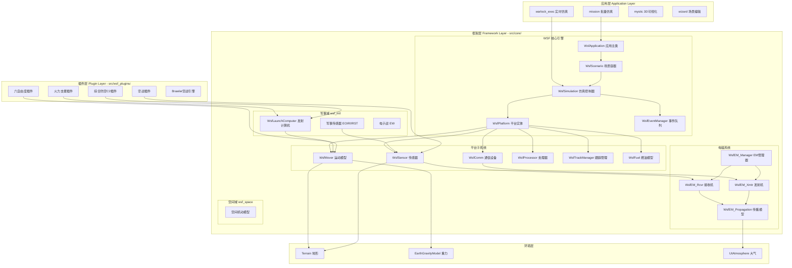
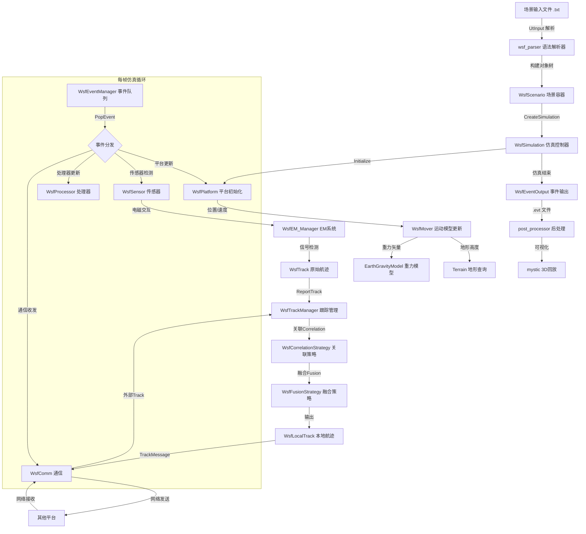
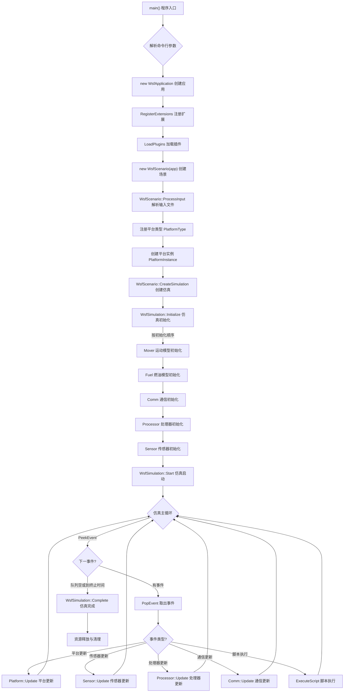
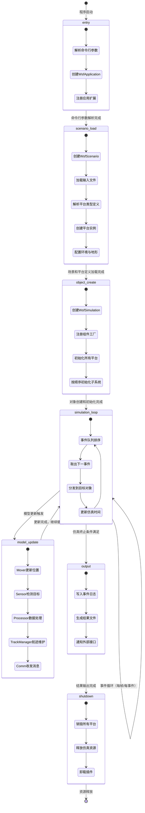

# AFSIM 仿真框架架构文档

> **状态**：🔴 草稿 — 等待开发人员校对
> **日期**：2026-06-09
> **分析范围**：afsim_2.9.0_src_linux/ 全部（P0-P4，26,856 文件）

---

## 1. 总体概述

AFSIM（The Advanced Framework for Simulation, Integration, and Modeling，高级仿真集成与建模框架）是 Boeing 公司开发的 C++ 军事作战仿真平台。其核心称为 WSF（Weapon System Framework，武器系统框架）。

**业务价值**：AFSIM 为军事分析人员提供从单件武器到战区级联合作战的多分辨率仿真能力，覆盖空战、海战、太空战、网络战、电子战等全谱系作战域。

**编程语言**：C++（C++11/14），构建系统 CMake，GUI 基于 Qt，3D 可视化基于 OpenSceneGraph（OSG）。

---

## 2. 目录结构含义

> 格式参考 [directroy_structure.md](directroy_structure.md)

```
./afsim_2.9.0_src_linux/
├── dependencies/              # 第三方依赖库和仿真资源文件
│   ├── 3rd_party/             # 预编译第三方库包（curl通信库/ffmpeg音视频/gdal地理数据/geos空间计算/gtest测试/openssl加密/osg三维渲染/osgEarth地球渲染）
│   └── resources/             # 仿真资源
│       ├── maps/              # 地图数据文件
│       └── models/            # 三维模型文件（.osgb 格式）
│
└── src/                       # 全部源代码
    ├── CMakeLists.txt          # 顶层 CMake 构建入口
    ├── CMakePresets.json       # CMake 预设配置
    ├── cmake/                  # CMake 构建系统模块（含 Logo、第三方查找模块、预设、模板、发行版配置）
    ├── doc/                    # 全局文档（变更日志 changelog、开发者文档、用户手册、图片）
    │
    ├── core/                   # ═══════════ 核心框架层（P0）═══════════
    │   ├── wsf/                # 武器系统框架（Weapon System Framework）— AFSIM 仿真引擎内核
    │   │   ├── source/         # 框架基础类：WsfApplication（应用）/WsfSimulation（仿真）/WsfScenario（场景）/WsfPlatform（平台）/WsfComponent（组件）/WsfTrack（跟踪）/WsfObject（对象基类）/WsfTypes（类型枚举）/WsfEvent（事件）/WsfMessage（消息）等
    │   │   ├── source/comm/    # 通信子系统（通信设备/网络协议/路由器/传输媒体）
    │   │   ├── source/dis/     # IEEE 1278.1 DIS（分布式交互仿真）协议栈实现
    │   │   ├── source/mover/   # 运动模型子系统（气动/地面/水面/跟随/旋翼/航路点等）
    │   │   ├── source/sensor/  # 传感器子系统基类与通用模型
    │   │   ├── source/processor/ # 数据处理器子系统
    │   │   ├── source/observer/  # 观察者模式子系统（各类事件/状态变化监听器接口）
    │   │   ├── source/script/    # 脚本子系统（语法接口/GrammarInterface/脚本上下文管理器）
    │   │   ├── source/xio/       # 外部IO子系统（XIO序列化/反序列化框架）
    │   │   ├── source/xio_sim/   # 仿真IO子系统
    │   │   ├── source/traffic/   # 交通流模拟
    │   │   ├── source/ext/       # 扩展接口定义
    │   │   └── source/event_pipe/ # 事件流管道（事件过滤与转发）
    │   │
    │   ├── wsf_mil/            # 军事域扩展（Military Domain）— 武器/电子战/军事传感器/军事通信的具体实现
    │   │   └── source/
    │   │       ├── weapon/     # 武器子系统：发射计算机（空对空A2A/空对地ATA/ATG/弹道导弹/轨道武器/地对空SAM/表格化）
    │   │       ├── mover/      # 军事运动模型（制导运动/寻的运动体）
    │   │       ├── sensor/     # 军事传感器（光电EOIR/红外IRST/表面波雷达等）
    │   │       ├── comm/       # 军事通信扩展
    │   │       ├── ew/         # 电子战子系统（Electronic Warfare）
    │   │       ├── dis/        # DIS协议军事扩展（引爆/定向能等）
    │   │       ├── observer/   # 军事域观察者（武器/交战等事件监听）
    │   │       ├── processor/  # 军事域处理器
    │   │       ├── script/     # 军事脚本绑定（武器/激光/发射计算机脚本类）
    │   │       └── xio/        # 军事域外部IO
    │   │
    │   ├── wsf_space/          # 空间域扩展（Space Domain）— 轨道力学/空间机动/空间传感器
    │   │   └── source/maneuvers/ # 空间机动模型
    │   │
    │   ├── wsf_nx/             # 下一代框架（Next Generation）— 新版传感器和处理器原型实现
    │   │   └── source/（sensor/processor/ew）
    │   │
    │   ├── wsf_parser/         # 语法解析器 — 将 AFSIM 输入文件（.txt 场景定义）解析为 C++ 运行时对象
    │   ├── wsf_mil_parser/     # 军事域语法解析器
    │   ├── wsf_grammar_check/  # 语法检查器 — 验证输入文件语法正确性
    │   ├── wsf_util/           # 基础工具库 — UtStringId/UtException/UtRandom 等底层通用类型
    │   ├── wsf_ripr/           # RIPR 作业调度系统 — JobBoard（作业面板）/Job（作业）/Manager（管理器）模式
    │   ├── wsf_cyber/          # 网络战/赛博域（Cyber Domain）— 网络攻击/攻击参数/赛博组件角色定义
    │   ├── wsf_l16/            # Link-16 战术数据链 — MIL-STD-6016 消息格式/计算机处理器
    │   ├── wsf_mtt/            # 多目标跟踪（Multi-Target Tracking）— 活动跟踪/候选跟踪/胚胎跟踪状态机
    │   ├── wsf_weapon_server/  # 武器服务器 — 独立进程的武器计算服务
    │   └── sensor_plot_lib/    # 传感器绘图库 — 传感器覆盖范围的二维可视化渲染
    │
    ├── wsf_plugins/            # ═══════════ 插件生态层（P1）═══════════
    │   ├── wsf_air_combat/        # 空战插件（Air Combat）— 空对空交战逻辑/态势感知(SA)处理器
    │   ├── wsf_alternate_locations/ # 备用位置插件 — 平台备选位置计算
    │   ├── wsf_annotation/        # 标注插件 — 仿真结果标注与注释
    │   ├── wsf_argo8/             # ARGO8 插件
    │   ├── wsf_brawler/           # Brawler 空战仿真引擎集成 — 大规模空战蒙特卡洛仿真
    │   ├── wsf_coverage/          # 覆盖范围分析插件 — 传感器/武器覆盖区域计算
    │   ├── wsf_fires/             # 火力支援插件（Fires）— 弹道计算(BallisticPath)/火力路径/火力平台
    │   ├── wsf_iads_c2_lib/       # 综合防空指挥控制库（IADS C2）— 拦截计算(InterceptCalc)/战损评估/武器-目标配对/战斗管理
    │   ├── wsf_multiresolution/   # 多分辨率仿真插件 — 不同保真度模型切换
    │   ├── wsf_oms_uci/           # OMS/UCI 标准接口插件 — 开放任务系统/通用控制接口
    │   ├── wsf_p6dof/             # 质点六自由度插件（Point-mass 6-DOF）— 质点运动/制导计算机/显式武器
    │   ├── wsf_scenario_analyzer/ # 场景分析器 — 场景参数敏感性分析
    │   ├── wsf_scenario_analyzer_iads_c2/ # IADS C2 场景分析器
    │   ├── wsf_simdis/            # SIMDIS 可视化集成 — 与 SIMDIS 3D 显示系统的桥接
    │   ├── wsf_six_dof/           # 六自由度插件（6-DOF）— 刚体六自由度运动/制导/序列器
    │   └── wsf_sosm/              # SOSM 插件 — 含简单大气模型(SimpleAtmosphere)
    │
    ├── tools/                 # ═══════════ 辅助工具集（P2）═══════════
    │   ├── 3rd_party-cmake/   # 第三方 CMake 查找模块
    │   ├── artificer/         # Artificer 工具
    │   ├── dis/               # DIS 协议调试工具
    │   ├── genio/             # 通用 IO 代码生成工具
    │   ├── geodata/           # 地理数据处理工具
    │   ├── misc/              # 杂项工具
    │   ├── packetio/          # 数据包 IO 工具
    │   ├── profiling/         # 性能分析（Profiling）工具
    │   ├── scene_gen/         # 场景生成（Scene Generation）工具
    │   ├── tracking_filters/  # 跟踪滤波器工具（Kalman/AlphaBeta 参数调优）
    │   ├── util/              # 通用 C++ 工具库（基础数据结构与算法）
    │   ├── utilosg/           # OpenSceneGraph（OSG）工具库
    │   ├── utilqt/            # Qt 工具库
    │   ├── util_script/       # 脚本工具库
    │   ├── vespatk/           # VESPA Toolkit
    │   └── wkf/               # WKF 工具
    │
    ├── warlock/               # ═══════════ 实时仿真控制（P2）═══════════
    │   ├── warlock_core/      # Warlock 核心库
    │   ├── warlock_exec/      # Warlock 可执行程序入口
    │   ├── plugins/           # Warlock 控制插件（SensorController 传感器控制器等）
    │   └── data/              # 示例场景数据（简单场景/路由测试/压力测试等）
    │
    ├── wizard/                # 场景编辑向导（Wizard）— GUI 工具用于创建和编辑 AFSIM 场景文件（P3）
    │   ├── lib/               # 向导核心库
    │   ├── main/              # GUI 主程序入口（Qt 应用）
    │   ├── plugins/           # 向导扩展插件
    │   └── usmtf/             # USMTF（United States Message Text Format，美军标准消息文本格式）解析与验证
    │
    ├── mover_creator/         # 运动体创建工具（Mover Creator）— GUI 工具定义飞行器/武器气动参数（P1）
    │   ├── source/            # 气动几何建模/性能参数/脚本生成（支持六自由度/质点/刚体模型）
    │   ├── ui/                # Qt UI 界面文件
    │   └── data/              # 预置数据（翼型库/发动机库/大气模型参数）
    │
    ├── weapon_tools/          # 武器分析工具（Weapon Tools）— 发射计算机配置生成/杀伤区(LAR)计算（P1）
    ├── sensor_plot/           # 传感器绘图工具 — 传感器覆盖范围二维可视化（P3）
    ├── post_processor/        # 后处理器（Post Processor）— 仿真结果数据分析/轨迹可视化/报告生成（P3）
    │   ├── exec/              # 后处理器可执行入口
    │   ├── lib/               # 后处理核心库
    │   └── WizPostProcessor/  # 向导式后处理器（滤波器配置/发射机显示/轨迹对话/报告对话）
    │
    ├── mission/               # 任务级仿真入口 — mission.cpp 可执行程序，批量仿真的主入口（P3）
    ├── mystic/                # 后处理3D可视化工具（Mystic）— 基于OSG的仿真结果三维回放（P3）
    │   ├── exec/              # Mystic 可执行入口
    │   ├── lib/               # 可视化库（RvEnvironment环境/RvResultPlatform平台/RvResultData结果数据）
    │   ├── plugins/           # 可视化插件（空战结果/轨道结果/态势感知显示）
    │   └── python/            # Python 编程接口（pymystic.py）
    │
    ├── engage/                # 交战分析工具（Engage）— 处理仿真事件输出、生成交战报告（P3）
    └── evt_reader/            # 事件读取器（Event Reader）— 读取和可视化 .evt 事件文件（P3）
```

---

## 3. 子系统/模块划分

AFSIM 按三层架构组织：

### 3.1 系统 → 子系统树

```
AFSIM 仿真平台（系统）
│
├── 框架层（Framework Layer）— src/core/
│   ├── WSF 核心引擎 — src/core/wsf/source/
│   │   ├── 对象与类型系统（Object/Type）— WsfObject/WsfNamed/WsfStringId/WsfTypes
│   │   ├── 组件模型系统（Component Model）— WsfComponent/WsfComponentT/WsfComponentList/WsfComponentRoles
│   │   ├── 应用管理系统（Application）— WsfApplication/WsfStandardApplication
│   │   ├── 场景管理系统（Scenario）— WsfScenario
│   │   ├── 仿真引擎系统（Simulation Engine）— WsfSimulation/WsfEventManager/WsfMultiThreadManager
│   │   ├── 平台实体系统（Platform）— WsfPlatform/WsfPlatformPart/WsfArticulatedPart
│   │   ├── 运动模型系统（Mover）— WsfMover/WsfAero/WsfAirMover（mover/ 子目录）
│   │   ├── 传感器系统（Sensor）— WsfSensor/WsfFieldOfView（sensor/ 子目录）
│   │   ├── 电磁系统（EM/Electromagnetic）— WsfEM_Manager/WsfEM_Xmtr/WsfEM_Rcvr/WsfEM_Propagation/WsfEM_Attenuation
│   │   ├── 跟踪系统（Track/Tracking）— WsfTrack/WsfTrackManager/WsfCorrelationStrategy/WsfFusionStrategy
│   │   ├── 通信系统（Comm/Communication）— comm/ 子目录
│   │   ├── 事件系统（Event）— WsfEvent/WsfEventManager/WsfEventOutput/WsfCallback
│   │   ├── 消息系统（Message）— WsfMessage/WsfMessageTable/WsfTrackMessage/WsfStatusMessage
│   │   ├── 脚本系统（Script）— script/ 子目录
│   │   ├── 行为树系统（Behavior Tree）— WsfBehaviorTree/WsfAdvancedBehaviorTree
│   │   ├── 地形环境系统（Terrain/Environment）— wsf::Terrain/WsfEnvironment/WsfEarthGravityModel
│   │   ├── 区域系统（Zone）— WsfZone/WsfZoneDefinition/WsfZoneSet/WsfZoneRouteFinder
│   │   ├── 滤波器系统（Filter）— WsfFilter/WsfAlphaBetaFilter/WsfKalmanFilter
│   │   └── 基础工具系统（Utilities）— WsfVariable/WsfRandomVariable/WsfDateTime/WsfGeoPoint
│   │
│   ├── WSF 军事域 — src/core/wsf_mil/source/
│   │   ├── 武器子系统（Weapon）— WsfLaunchComputer/WsfBallisticMissileLaunchComputer 等
│   │   ├── 军事传感器子系统 — WsfEOIR_Sensor/WsfIRST_Sensor 等
│   │   ├── 电子战子系统（EW）— ew/ 子目录
│   │   └── 军事通信扩展 — comm/ 子目录
│   │
│   ├── WSF 空间域 — src/core/wsf_space/source/
│   │   └── 空间机动子系统 — maneuvers/ 子目录
│   │
│   ├── WSF 赛博域 — src/core/wsf_cyber/source/
│   │   └── 网络攻击子系统 — WsfCyberAttack/WsfCyberAttackParameters
│   │
│   ├── 语法解析 — src/core/wsf_parser/ + wsf_mil_parser/ + wsf_grammar_check/
│   ├── Link-16 — src/core/wsf_l16/
│   ├── 多目标跟踪 — src/core/wsf_mtt/
│   ├── 作业调度 — src/core/wsf_ripr/
│   └── 武器服务器 — src/core/wsf_weapon_server/
│
├── 插件层（Plugin Layer）— src/wsf_plugins/
│   ├── 空战插件（Air Combat）
│   ├── 火力支援插件（Fires）
│   ├── 综合防空C2插件（IADS C2）
│   ├── 六自由度插件（6-DOF/six_dof + p6dof）
│   ├── Brawler 空战引擎集成
│   ├── 覆盖范围分析（Coverage）
│   └── ...（共 16 个插件子系统）
│
├── 工具层（Tool Layer）— src/tools/ + src/warlock/
│   ├── 辅助工具集（16 个工具目录）
│   └── 实时仿真控制器（Warlock）
│
└── 应用层（Application Layer）— P3 可执行入口
    ├── mission/ — 批量仿真
    ├── warlock/warlock_exec/ — 实时交互仿真
    ├── mystic/exec/ — 3D 结果可视化
    ├── wizard/main/ — GUI 场景编辑器
    ├── post_processor/exec/ — 后处理器
    ├── engage/ — 交战报告分析
    └── evt_reader/ — 事件文件查看
```

---

## 4. 组件图/模块图



---

## 5. 数据流图



---

## 6. 控制流图



---

## 7. 生命周期



### 生命周期各阶段关联

| 阶段 | 入口函数/关键类 | 配置来源 | 主要状态对象 | 证据位置 |
|------|----------------|----------|-------------|----------|
| entry | `main()` → `WsfApplication::WsfApplication()` | 命令行参数 argv | WsfApplication::mInstancePtr | `src/mission/source/mission.cpp` |
| scenario_load | `WsfScenario::FromInput()` / `ProcessInput()` | 场景 .txt 文件 | WsfScenario | `src/core/wsf/source/WsfScenario.hpp` |
| object_create | `WsfSimulation::Initialize()` | 平台类型/实例定义 | WsfSimulation::mState | `src/core/wsf/source/WsfSimulation.hpp` |
| simulation_loop | `WsfEventManager::PopEvent()` / `WsfSimulation::Start()` | 仿真时间参数 | WsfEventManager::mEvents | `src/core/wsf/source/WsfEventManager.hpp` |
| model_update | `WsfPlatform::Update()` → `DoUpdate()` → 各组件 Update | 组件参数 | WsfPlatform::mLastUpdateTime | `src/core/wsf/source/WsfPlatform.hpp` |
| output | `WsfEventOutput::WriteEvent()` / `WsfCSV_EventOutput` | 输出配置 | WsfEventResults | `src/core/wsf/source/WsfEventOutput.hpp` |
| shutdown | `WsfSimulation::~WsfSimulation()` | N/A | 析构链 | `src/core/wsf/source/WsfSimulation.cpp` |

---

## 8. 子系统/模块映射表格

| 子系统/模块 | 涉及目录/文件 | P 级 |
|------------|-------------|------|
| 对象与类型系统 | [src/core/wsf/source/WsfObject.hpp](src/core/wsf/source/WsfObject.hpp), [WsfNamed.hpp](src/core/wsf/source/WsfNamed.hpp), [WsfStringId.hpp](src/core/wsf/source/WsfStringId.hpp), [WsfTypes.hpp](src/core/wsf/source/WsfTypes.hpp), [WsfUniqueId.hpp](src/core/wsf/source/WsfUniqueId.hpp) | P0 |
| 组件模型系统 | [src/core/wsf/source/WsfComponent.hpp](src/core/wsf/source/WsfComponent.hpp), [WsfComponentList.hpp](src/core/wsf/source/WsfComponentList.hpp), [WsfComponentFactory.hpp](src/core/wsf/source/WsfComponentFactory.hpp), [WsfComponentRoles.hpp](src/core/wsf/source/WsfComponentRoles.hpp), [WsfSimpleComponent.hpp](src/core/wsf/source/WsfSimpleComponent.hpp) | P0 |
| 应用管理系统 | [src/core/wsf/source/](src/core/wsf/source/) 下所有 WsfApplication*.hpp/cpp, WsfStandardApplication*.hpp/cpp | P0 |
| 场景管理系统 | [src/core/wsf/source/](src/core/wsf/source/) 下所有 WsfScenario*.hpp/cpp | P0 |
| 仿真引擎系统 | [src/core/wsf/source/](src/core/wsf/source/) 下所有 WsfSimulation*.hpp/cpp, WsfEventManager*.hpp/cpp, WsfMultiThreadManager*.hpp/cpp, WsfFrameStepSimulation*.hpp/cpp, WsfEventStepSimulation*.hpp/cpp | P0 |
| 平台实体系统 | [src/core/wsf/source/](src/core/wsf/source/) 下所有 WsfPlatform*.hpp/cpp, WsfArticulatedPart*.hpp/cpp, WsfAuxDataEnabled*.hpp/cpp | P0 |
| 运动模型系统 | [src/core/wsf/source/mover/](src/core/wsf/source/mover/) 全部 .hpp/.cpp 文件 | P0 |
| 传感器系统 | [src/core/wsf/source/sensor/](src/core/wsf/source/sensor/) 全部 .hpp/.cpp 文件 | P0 |
| 电磁系统 | [src/core/wsf/source/](src/core/wsf/source/) 下所有 WsfEM_*.hpp/cpp, WsfAntennaPattern*.hpp/cpp, WsfMaskingPattern*.hpp/cpp, WsfSignature*.hpp/cpp, WsfRadarSignature*.hpp/cpp, WsfIFF_Manager*.hpp/cpp, WsfLOS_Manager*.hpp/cpp | P0 |
| 跟踪系统 | [src/core/wsf/source/](src/core/wsf/source/) 下所有 WsfTrack*.hpp/cpp, WsfCorrelation*.hpp/cpp, WsfFusion*.hpp/cpp, WsfKinematic*.hpp/cpp, WsfLocalTrack*.hpp/cpp | P0 |
| 通信系统 | [src/core/wsf/source/comm/](src/core/wsf/source/comm/) 全部 .hpp/.cpp 文件 | P0 |
| 事件系统 | [src/core/wsf/source/](src/core/wsf/source/) 下所有 WsfEvent*.hpp/cpp, WsfCallback*.hpp/cpp | P0 |
| 消息系统 | [src/core/wsf/source/](src/core/wsf/source/) 下所有 WsfMessage*.hpp/cpp, WsfMessageTable*.hpp/cpp, Wsf*Message*.hpp/cpp | P0 |
| 脚本系统 | [src/core/wsf/source/script/](src/core/wsf/source/script/) 全部 .hpp/.cpp 文件 | P0 |
| 行为树系统 | [src/core/wsf/source/](src/core/wsf/source/) 下所有 WsfBehaviorTree*.hpp/cpp, WsfAdvancedBehaviorTree*.hpp/cpp | P0 |
| 地形环境系统 | [src/core/wsf/source/](src/core/wsf/source/) 下所有 WsfTerrain*.hpp/cpp, WsfEnvironment*.hpp/cpp, WsfEarthGravityModel*.hpp/cpp, WsfDtedRect*.hpp/cpp, WsfLandCover*.hpp | P0 |
| 区域系统 | [src/core/wsf/source/](src/core/wsf/source/) 下所有 WsfZone*.hpp/cpp, WsfConvexHull*.hpp/cpp | P0 |
| 滤波器系统 | [src/core/wsf/source/](src/core/wsf/source/) 下所有 WsfFilter*.hpp/cpp, WsfAlphaBeta*.hpp, WsfKalman*.hpp | P0 |
| 基础工具系统 | [src/core/wsf/source/](src/core/wsf/source/) 下所有 WsfVariable*.hpp/cpp, WsfRandom*.hpp/cpp, WsfDateTime*.hpp/cpp, WsfGeoPoint*.hpp/cpp 等 | P0 |
| 军事武器子系统 | [src/core/wsf_mil/source/weapon/](src/core/wsf_mil/source/weapon/) 全部 .hpp/.cpp 文件 | P0 |
| 军事传感器子系统 | [src/core/wsf_mil/source/sensor/](src/core/wsf_mil/source/sensor/) 全部 .hpp/.cpp 文件 | P0 |
| 电子战子系统 | [src/core/wsf_mil/source/ew/](src/core/wsf_mil/source/ew/) 全部 .hpp/.cpp 文件 | P0 |
| 空间域子系统 | [src/core/wsf_space/source/](src/core/wsf_space/source/) 全部 .hpp/.cpp 文件 | P0 |
| 赛博域子系统 | [src/core/wsf_cyber/source/](src/core/wsf_cyber/source/) 全部 .hpp/.cpp 文件 | P0 |
| Link-16 子系统 | [src/core/wsf_l16/source/](src/core/wsf_l16/source/) 全部 .hpp/.cpp 文件 | P0 |
| 多目标跟踪 | [src/core/wsf_mtt/source/](src/core/wsf_mtt/source/) 全部 .hpp/.cpp 文件 | P0 |
| 语法解析 | [src/core/wsf_parser/source/](src/core/wsf_parser/source/) + [wsf_mil_parser/source/](src/core/wsf_mil_parser/source/) + [wsf_grammar_check/source/](src/core/wsf_grammar_check/source/) | P0 |
| 基础工具库 | [src/core/wsf_util/source/](src/core/wsf_util/source/) 全部 .hpp/.cpp 文件 | P0 |
| 空战插件 | [src/wsf_plugins/wsf_air_combat/](src/wsf_plugins/wsf_air_combat/) 全部 .hpp/.cpp 文件 | P1 |
| 火力支援插件 | [src/wsf_plugins/wsf_fires/](src/wsf_plugins/wsf_fires/) 全部 .hpp/.cpp 文件 | P1 |
| IADS C2 插件 | [src/wsf_plugins/wsf_iads_c2_lib/](src/wsf_plugins/wsf_iads_c2_lib/) 全部 .hpp/.cpp 文件 | P1 |
| 六自由度插件 | [src/wsf_plugins/wsf_six_dof/](src/wsf_plugins/wsf_six_dof/) + [wsf_p6dof/](src/wsf_plugins/wsf_p6dof/) 全部 .hpp/.cpp 文件 | P1 |
| Brawler 插件 | [src/wsf_plugins/wsf_brawler/](src/wsf_plugins/wsf_brawler/) 全部 .hpp/.cpp 文件 | P1 |
| 覆盖范围插件 | [src/wsf_plugins/wsf_coverage/](src/wsf_plugins/wsf_coverage/) 全部 .hpp/.cpp 文件 | P1 |
| 运动体创建工具 | [src/mover_creator/source/](src/mover_creator/source/) 全部 .hpp/.cpp 文件 | P1 |
| 武器分析工具 | [src/weapon_tools/source/](src/weapon_tools/source/) 全部 .hpp/.cpp 文件 | P1 |
| 实时仿真控制器 | [src/warlock/warlock_core/](src/warlock/warlock_core/) + [warlock_exec/](src/warlock/warlock_exec/) + [plugins/](src/warlock/plugins/) | P2 |
| 辅助工具集 | [src/tools/](src/tools/) 下各子目录 | P2 |
| 场景编辑向导 | [src/wizard/](src/wizard/) 下各子目录 | P3 |
| 后处理器 | [src/post_processor/](src/post_processor/) 下各子目录 | P3 |
| 3D可视化 | [src/mystic/](src/mystic/) 下各子目录 | P3 |
| 任务仿真入口 | [src/mission/source/](src/mission/source/) | P3 |
| 交战分析 | [src/engage/source/](src/engage/source/) | P3 |
| 事件读取器 | [src/evt_reader/source/](src/evt_reader/source/) | P3 |
