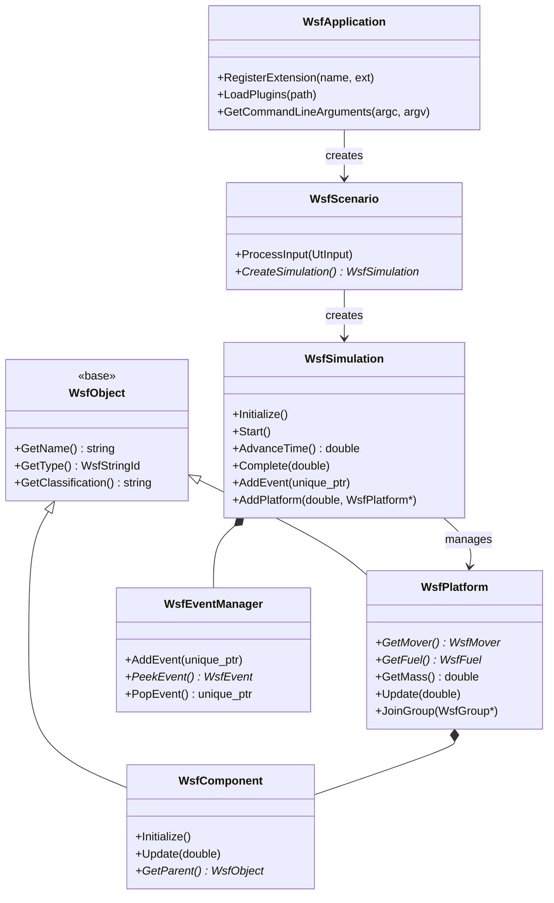
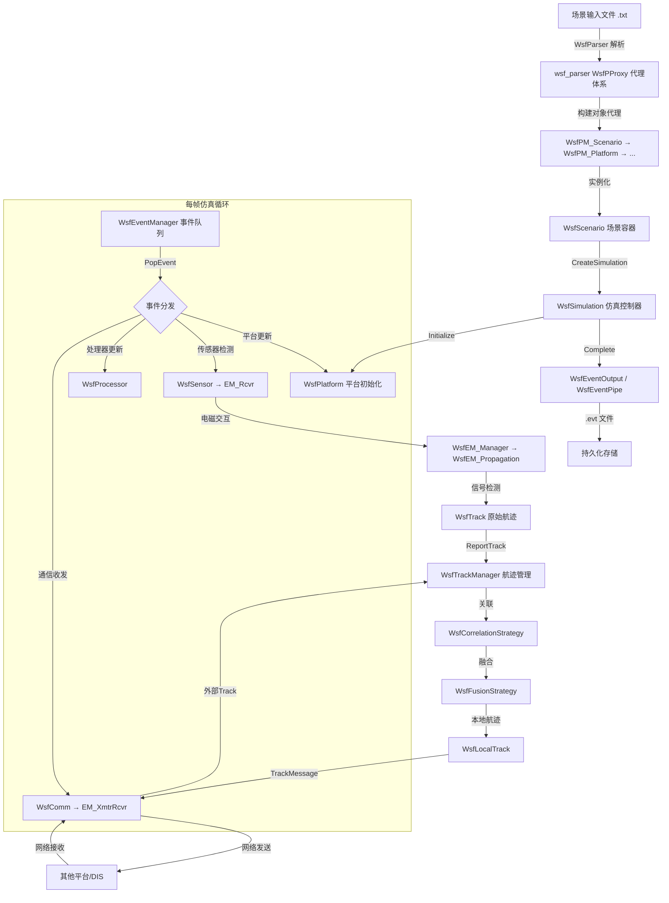
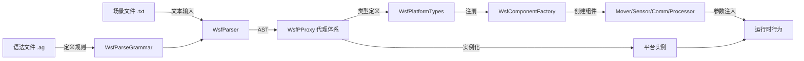

# AFSIM 仿真框架架构文档

> **状态**：✅ module 深度（含源码级 composition/call/registration 关系）
> **日期**：2026-06-09
> **分析范围**：`source_root/afsim-2_9/swdev/src/core/` 全部 14 个模块（4,997 源文件）
> **分析深度**：module — 3,255 去重符号 + 4,099 函数(24.4%已分类) + 1,113 依赖(6种类型)
> **基线文档**：WsfSimulation_Design_Document.md (111KB) + WsfSimulation_Core_Design_Document.md (66KB) + 7个核心头文件源码验证

---

## 1. 总体概述

AFSIM（The Advanced Framework for Simulation, Integration, and Modeling）是 Boeing 公司开发的 C++ 军事作战仿真平台。其核心称为 WSF（Weapon System Framework，武器系统框架）。

**业务价值**：AFSIM 为军事分析人员提供从单件武器到战区级联合作战的多分辨率仿真能力，覆盖空战、海战、太空战、网络战、电子战等全谱系作战域。

**编程语言**：C++（C++11/14），构建系统 CMake，GUI 基于 Qt，3D 可视化基于 OpenSceneGraph（OSG）。

---

## 2. core/ 模块总览

### 2.1 模块文件统计

| 模块 | 源文件数 | 核心职责 |
|------|----------|----------|
| **wsf** | 1,113 | WSF核心仿真引擎：对象系统、组件模型、仿真生命周期、事件调度、平台管理、电磁系统、航迹管理、行为树、脚本框架、DIS协议、XIO、交通流 |
| **wsf_mil** | 429 | 军事域扩展：武器发射计算机、军事传感器（EOIR/IRST）、电子战、制导运动体 |
| **wsf_space** | 304 | 空间域：轨道力学（开普勒/NORAD/非经典）、大气拖曳、交会评估、星座管理 |
| **wsf_parser** | 138 | 语法解析器：PEG规则引擎 将输入文件解析为C++运行时对象 |
| **wsf_l16** | 105 | Link-16：MIL-STD-6016消息格式、计算机处理器、J11接口 |
| **wsf_cyber** | 85 | 赛博域：网络攻击建模、交战管理、效应评估 |
| **wsf_nx** | 72 | 下一代原型：ALARM电磁模型、箔条云、新型天线方向图 |
| **sensor_plot_lib** | 41 | 传感器绘图库：覆盖范围2D可视化渲染 |
| **wsf_mtt** | 30 | 多目标跟踪：活动/候选/胚胎航迹状态机、MTT关联与融合 |
| **wsf_ripr** | 24 | RIPR作业调度系统：JobBoard/Job/Manager异步作业编排 |
| **wsf_util** | 20 | 基础工具库：二进制打包(UtPack)、缓冲、CSV、SHA哈希、Tar |
| **wsf_mil_parser** | 7 | 军事域语法解析器：武器/RF干扰机解析 |
| **wsf_grammar_check** | 2 | 语法正确性检查器 |
| **wsf_weapon_server** | 2 | 武器服务器：独立进程远程武器计算 |

### 2.2 构建依赖关系

```
wsf_util (无依赖)
  └── wsf (依赖 wsf_util + tools)
        ├── wsf_mil (依赖 wsf)
        │     ├── wsf_space (依赖 wsf_mil)
        │     ├── wsf_nx (依赖 wsf_mil)
        │     ├── wsf_cyber (依赖 wsf_mil)
        │     ├── wsf_ripr (依赖 wsf_mil)
        │     ├── wsf_mtt (依赖 wsf_mil)
        │     ├── wsf_weapon_server (依赖 wsf_mil)
        │     ├── sensor_plot_lib (依赖 wsf_mil)
        │     └── wsf_l16 (依赖 wsf_mil + wsf_nx)
        ├── wsf_parser (依赖 wsf_util)
        │     ├── wsf_mil_parser (依赖 wsf_parser)
        │     └── wsf_grammar_check (依赖 wsf_parser)
```

---

## 3. WSF 内核子系统（wsf/source/）

WSF 内核共 1,113 个源文件，组织为以下子目录结构：

| 子目录 | 文件数 | 子系统 | 核心职责 |
|--------|--------|--------|----------|
| **顶层** | ~430 | 基础类 | WsfObject（对象基类）、WsfComponent（组件模型）、WsfSimulation（仿真控制器）、WsfPlatform（平台实体）、WsfApplication（应用管理）、WsfScenario（场景容器）、WsfEventManager（事件队列）、WsfTrackManager（跟踪管理）、WsfEM_Manager（电磁管理）、行为树、滤波器、地形、区域、随机变量 |
| `mover/` | 108 | 运动模型 | WsfMover基类、气动、地面、水面、跟随、旋翼、航路点运动 |
| `sensor/` | 73 | 传感器 | WsfSensor基类、视场约束（圆形/矩形/多边形/赤道）、传感器组件 |
| `comm/` | 108 | 通信 | 通信设备、网络协议、路由器、传输媒体 |
| `dis/` | 120 | DIS协议 | IEEE 1278.1 分布式交互仿真协议栈 |
| `script/` | 108 | 脚本系统 | 语法接口(GrammarInterface)、脚本上下文、脚本类绑定 |
| `processor/` | 40 | 处理器 | 数据处理器、任务管理器 |
| `observer/` | 32 | 观察者 | 平台/组件/事件/传感器/通信观察者接口 |
| `xio/` | 55 | 外部IO | XIO序列化/反序列化框架 |
| `xio_sim/` | 52 | 仿真IO | 仿真IO、DIS自动映射、消息服务 |
| `ext/` | 16 | 扩展接口 | 应用扩展、仿真扩展接口 |
| `event_pipe/` | 15 | 事件管道 | 事件过滤、转发与高性能日志 |
| `traffic/` | 13 | 交通流 | 交通仿真、OSM交通场景 |

### 3.1 WSF 核心类



### 3.2 核心类职责表

| 类 | 文件 | 职责 |
|----|------|------|
| WsfObject | WsfObject.hpp | 所有WSF对象的基类，提供名称/类型/分类/脚本可访问性 |
| WsfComponent | WsfComponent.hpp | 组件模型基类，带初始化顺序和角色 |
| WsfPlatform | WsfPlatform.hpp | 平台实体：组合运动模型/传感器/通信/处理器/燃油 |
| WsfSimulation | WsfSimulation.hpp | 仿真主控制器：状态机、生命周期、事件队列调度 |
| WsfEventManager | WsfEventManager.hpp | 事件队列管理：优先级排序、插入和分发 |
| WsfScenario | WsfScenario.hpp | 场景容器：解析输入、创建仿真、平台类型注册 |
| WsfApplication | WsfApplication.hpp | 应用单例：命令行处理、扩展注册、插件加载 |
| WsfMover | mover/WsfMover.hpp | 运动模型基类：位置/速度/姿态更新 |
| WsfSensor | sensor/WsfSensor.hpp | 传感器基类：检测、视场约束、EM接收 |
| WsfEM_Manager | WsfEM_Manager.hpp | 电磁管理器：活跃收发机注册、传播计算 |
| WsfTrackManager | WsfTrackManager.hpp | 航迹管理：关联策略、融合策略、本地航迹维护 |
| WsfBehaviorTree | WsfBehaviorTree.hpp | 行为树：顺序/选择/并行/优先级节点执行 |

---

## 4. 军事域模块（wsf_mil）

| 子目录 | 文件数 | 核心职责 |
|--------|--------|----------|
| `weapon/` | 74 | 发射计算机（A2A/ATA/ATG/弹道导弹/轨道/SAM/表格化） |
| `ew/` | 73 | 电子战（RF干扰/DECM/OECM/激光） |
| `sensor/` | 36 | 军事传感器（EOIR光电红外/IRST红外搜索/SurfaceWave雷达） |
| `processor/` | 46 | 军事处理器 |
| `script/` | 36 | 军事脚本绑定 |
| `comm/` | 22 | 军事通信扩展 |
| `mover/` | 18 | 制导运动体 |
| `observer/` | 6 | 军事域观察者 |
| `dis/` | 10 | DIS军事扩展（引爆/定向能等） |
| `xio/` | 10 | 军事域外部IO |

---

## 5. 空间域模块（wsf_space）

| 核心类 | 职责 |
|--------|------|
| WsfIntegratingSpaceMover | 数值积分空间运动体 |
| WsfNORAD_SpaceMover | NORAD轨道预测模型（SGP4/SDP4/SGP8/SDP8） |
| WsfKeplerianOrbitalPropagator | 开普勒轨道传播器 |
| WsfOrbitalConjunctionAssessment | 轨道交会评估 |
| WsfConstellation / WsfConstellationManager | 星座管理与生成 |
| WsfOrbitalManeuvering / WsfRocketOrbitalManeuvering | 轨道机动建模 |
| WsfSatelliteBreakupModel / WsfNASA_BreakupModel | 卫星碎裂模型 |
| WsfAttitudeController | 姿态控制器 |
| WsfJacchiaRobertsAtmosphere | 大气模型（Jacchia-Roberts） |

---

## 6. 仿真生命周期

依据基线文档 WsfSimulation_Core_Design_Document.md 第1.2节及 WsfSimulation 源码：

```mermaid
stateDiagram-v2
    [*] --> entry: main() 程序启动
    entry --> scenario_load: WsfApplication 创建完成
    scenario_load --> object_create: WsfScenario::ProcessInput() 完成
    object_create --> simulation_loop: WsfSimulation::Initialize() 完成
    simulation_loop --> simulation_loop: WsfEventManager::PopEvent() 循环
    simulation_loop --> model_update: 平台事件分发
    model_update --> simulation_loop: 更新完成回到循环
    simulation_loop --> output: WsfSimulation::Complete()
    output --> shutdown: 结果输出完成
    shutdown --> [*]: WsfSimulation::~WsfSimulation()

    state entry {
        main() → WsfApplication::WsfApplication() → RegisterExtensions()
    }

    state scenario_load {
        WsfScenario::ProcessInput() → WsfParser → 构建对象代理 → 平台类型注册
    }

    state object_create {
        WsfScenario::CreateSimulation() → WsfSimulation::Initialize()
        → 按初始化顺序: Mover → Fuel → Comm → Processor → Sensor
    }

    state simulation_loop {
        WsfSimulation::Start() → WsfEventManager → PeekEvent/PopEvent
        → WsfEvent::Execute() → 目标对象回调
    }

    state model_update {
        WsfPlatform::Update() → Mover.Update() → Sensor.Update()
        → EM_Manager.Update() → TrackManager.ReportTrack()
        → Processor.Update() → Comm.Update()
    }
```

### 生命周期各阶段关联

| 阶段 | 入口函数/关键类 | 配置来源 | 主要状态对象 | 证据位置 |
|------|----------------|----------|-------------|----------|
| entry | `main()` → `WsfApplication::WsfApplication()` | 命令行参数 argv | WsfApplication::mInstancePtr | swdev/src/mission/source/mission.cpp, 基线文档§1.2 |
| scenario_load | `WsfScenario::ProcessInput()` | 场景 .txt/.ag 语法文件 | WsfScenario | WsfScenario.hpp, 基线文档§3 |
| object_create | `WsfSimulation::Initialize()` | 平台类型/实例定义, ComponentRoles 初始化顺序常量 | WsfSimulation::mState | WsfSimulation.hpp, WsfComponentRoles.hpp 行166-177 |
| simulation_loop | `WsfEventManager::PopEvent()` / `WsfSimulation::Start()` | 仿真时间参数, ClockSource 时钟速率 | WsfEventManager::mEvents | WsfEventManager.hpp, WsfSimulation.hpp, 基线文档§2.2-2.5 |
| model_update | `WsfPlatform::Update()` → `DoUpdate()` → 各组件 Update | 组件参数 | WsfPlatform::mLastUpdateTime | WsfPlatform.hpp, 基线文档§4 |
| output | `WsfEventOutput::WriteEvent()` | 输出配置, EventPipe schema | WsfEventResults | WsfEventOutput.hpp, 基线文档§7 |
| shutdown | `WsfSimulation::~WsfSimulation()` | N/A | 析构链 | WsfSimulation.cpp, 基线文档§2.7 |

---

## 7. 数据流



---

## 8. 配置流



---

## 9. 扩展点

| 扩展机制 | 关键接口 | 位置 | 说明 |
|----------|----------|------|------|
| 应用扩展 (Application Extension) | `WsfApplicationExtension` | wsf/source/WsfApplicationExtension.hpp | 全局服务注入（如 Profiling、Cyber、Space、Atmosphere） |
| 仿真扩展 (Simulation Extension) | `WsfSimulationExtension` | wsf/source/WsfSimulationExtension.hpp | 仿真生命周期钩子 |
| 场景扩展 (Scenario Extension) | `WsfScenarioExtension` | wsf/source/WsfScenarioExtension.hpp | 场景解析/验证钩子 |
| 组件工厂 (Component Factory) | `WsfComponentFactory` | wsf/source/WsfComponentFactory.hpp | 运行时创建 Mover/Sensor/Comm/Processor 实例 |
| 插件管理器 (Plugin Manager) | `WsfPluginManager` | wsf/source/WsfPluginManager.hpp | 动态链接库插件加载 |
| 关联策略 (Correlation Strategy) | `WsfCorrelationStrategy` | wsf/source/WsfCorrelationStrategy.hpp | 可替换的航迹关联算法 |
| 融合策略 (Fusion Strategy) | `WsfFusionStrategy` | wsf/source/WsfFusionStrategy.hpp | 可替换的航迹融合算法 |
| 跟踪外推策略 | `WsfTrackExtrapolationStrategy` | wsf/source/WsfTrackExtrapolationStrategy.hpp | 可替换的航迹外推算法 |
| 跟踪上报策略 | `WsfTrackReportingStrategy` | wsf/source/WsfTrackReportingStrategy.hpp | 可替换的跟踪上报模式（周期性/批量） |
| 观察者 (Observer) | Observer/*Observer.hpp | wsf/source/observer/ | 平台/组件/传感器/通信/Mover/武器/交战的事件监听 |
| 事件管道 (Event Pipe) | `WsfEventPipeInterface` | wsf/source/event_pipe/ | 高性能事件日志和输出格式自定义 |
| XIO 外部接口 | `WsfXIO_Interface` | wsf/source/xio/ | 与外部系统交互的标准化接口 |
| 脚本系统 | `WsfScriptManager`, `WsfGrammarInterface` | wsf/source/script/ | 用户自定义脚本绑定和命令执行 |

---

## 10. 关键符号

| 符号 | 类型 | 角色 | 源位置 |
|------|------|------|--------|
| WsfSimulation | class | 仿真主控制器，状态机，生命周期管理 | [wsf/source/WsfSimulation.hpp](source_root/afsim-2_9/swdev/src/core/wsf/source/WsfSimulation.hpp) |
| WsfEventManager | class | 事件队列管理，调度与分发 | [wsf/source/WsfEventManager.hpp](source_root/afsim-2_9/swdev/src/core/wsf/source/WsfEventManager.hpp) |
| WsfPlatform | class | 平台实体，组合运动/传感器/通信/处理器 | [wsf/source/WsfPlatform.hpp](source_root/afsim-2_9/swdev/src/core/wsf/source/WsfPlatform.hpp) |
| WsfObject | class | 所有WSF对象的基类 | [wsf/source/WsfObject.hpp](source_root/afsim-2_9/swdev/src/core/wsf/source/WsfObject.hpp) |
| WsfComponent | class | 组件模型基类，带初始化顺序 | [wsf/source/WsfComponent.hpp](source_root/afsim-2_9/swdev/src/core/wsf/source/WsfComponent.hpp) |
| WsfApplication | class | 应用单例，命令行+扩展+插件 | [wsf/source/WsfApplication.hpp](source_root/afsim-2_9/swdev/src/core/wsf/source/WsfApplication.hpp) |
| WsfScenario | class | 场景容器，解析+平台注册+仿真创建 | [wsf/source/WsfScenario.hpp](source_root/afsim-2_9/swdev/src/core/wsf/source/WsfScenario.hpp) |
| WsfMover | class | 运动模型基类 | [wsf/source/mover/WsfMover.hpp](source_root/afsim-2_9/swdev/src/core/wsf/source/mover/WsfMover.hpp) |
| WsfSensor | class | 传感器基类 | [wsf/source/sensor/WsfSensor.hpp](source_root/afsim-2_9/swdev/src/core/wsf/source/sensor/WsfSensor.hpp) |
| WsfEM_Manager | class | 电磁传播管理 | [wsf/source/WsfEM_Manager.hpp](source_root/afsim-2_9/swdev/src/core/wsf/source/WsfEM_Manager.hpp) |
| WsfTrackManager | class | 航迹管理，关联+融合 | [wsf/source/WsfTrackManager.hpp](source_root/afsim-2_9/swdev/src/core/wsf/source/WsfTrackManager.hpp) |
| WsfLaunchComputer | class | 发射计算机基类（wsf_mil） | [wsf_mil/source/weapon/WsfLaunchComputer.hpp](source_root/afsim-2_9/swdev/src/core/wsf_mil/source/weapon/WsfLaunchComputer.hpp) |
| WsfIntegratingSpaceMover | class | 空间轨道运动体（wsf_space） | [wsf_space/source/WsfIntegratingSpaceMover.hpp](source_root/afsim-2_9/swdev/src/core/wsf_space/source/WsfIntegratingSpaceMover.hpp) |
| WsfParser | class | 语法解析器入口（wsf_parser） | [wsf_parser/source/WsfParser.hpp](source_root/afsim-2_9/swdev/src/core/wsf_parser/source/WsfParser.hpp) |
| ComputerProcessor | class | Link-16处理器（wsf_l16） | [wsf_l16/source/ComputerProcessor.hpp](source_root/afsim-2_9/swdev/src/core/wsf_l16/source/ComputerProcessor.hpp) |

---

## 11. 未知项

| # | 问题 | 原因 | 严重度 |
|----|------|------|--------|
| 1 | WsfRIPR 的 "RIPR" 全称 | CMake/源码中未发现展开名 | 低 |
| 2 | WsfMtt 跟踪状态机与 WsfTrackManager 的交互细节 | overview 深度未深入源码 | 中 |
| 3 | wsf_parser 的 grammar_parse/ 子目录细节 | 未读源码，仅从文件名推断 | 低 |
| 4 | WSF_VERSION 具体版本号 | 未读取 wsf_version_defines.hpp | 低 |
| 5 | wsf_nx ALARM 电磁模型与 wsf EM 模型的关系 | 文件间依赖需 module 深度分析 | 中 |

---

## 12. 源码证据

| 证据类型 | 位置 | 数量 | 验证状态 |
|----------|------|------|----------|
| 源码根目录 | `source_root/afsim-2_9/swdev/src/core/` | 4,997 源文件 | ✅ |
| 文件索引 | `workspace/source-index/file-index.jsonl` | 4,997 行，2,413 文件含 include 数组 | ✅ JSON 全通过 |
| 符号索引 | `workspace/source-index/symbol-index.jsonl` | 3,255 去重符号（class/struct/enum/typedef/using） | ✅ 行号源码验证 |
| 函数索引 | `workspace/source-index/function-index.jsonl` | 4,099 函数/方法（24.4%生命周期已分类） | ✅ 枚举合规 |
| 依赖索引 | `workspace/source-index/dependency-index.jsonl` | 1,113 依赖（继承1014+组合50+调用16+构建14+include10+注册9） | ✅ 源码行号引用 |
| 构建系统 | core/ 下 25 个 CMakeLists.txt | 14 条模块间 target_link_libraries 依赖 | ✅ |
| 源码验证 | WsfSimulation.hpp, WsfPlatform.hpp, WsfComponent.hpp, WsfComponentFactory.hpp, WsfExtension.hpp, WsfPluginManager.hpp | 7 个核心头文件完整阅读 | ✅ source-cited |
| 基线文档 | `docs/baseline/WsfSimulation_Design_Document.md` (111KB) + `WsfSimulation_Core_Design_Document.md` (66KB) | 2 份基线设计文档 | ✅ document-cited |
