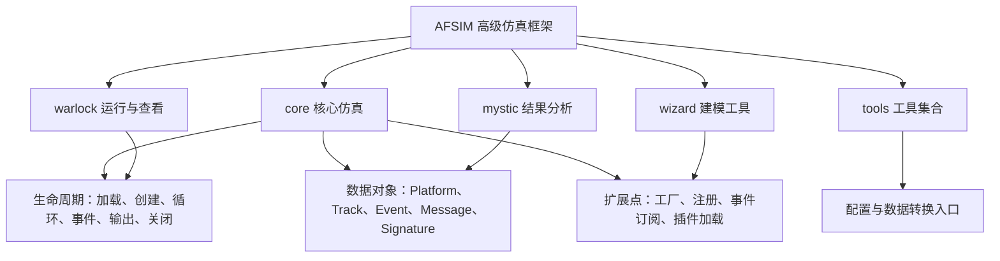
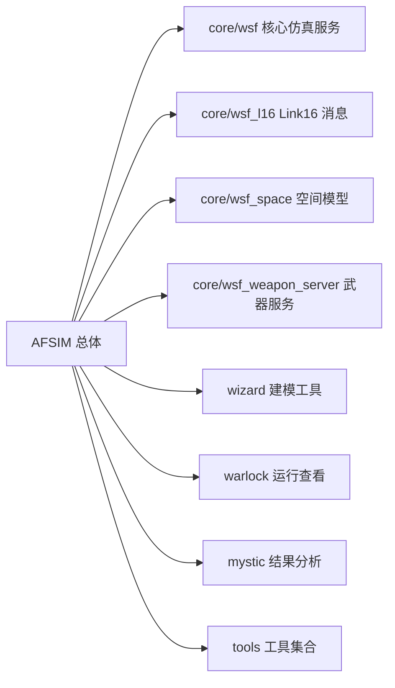
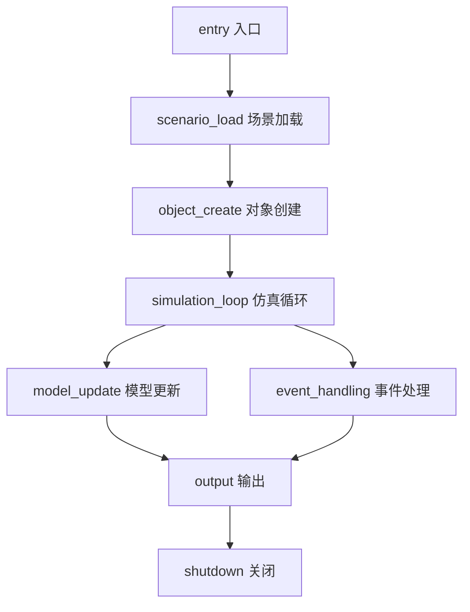
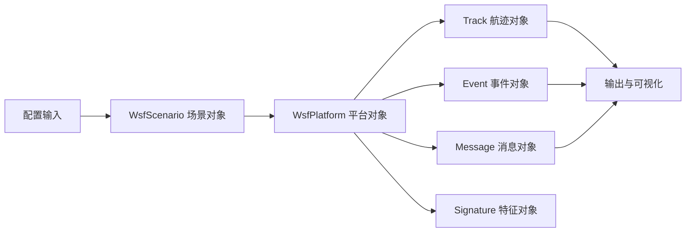

# AFSIM 仿真框架架构文档

> **状态**：已完成
> **日期**：2026-07-16
> **分析范围**：`afsim-2_9`，排除 `.git`、`build`、`3rd_party`、`node_modules`、隐藏目录、`vx.json`
> **分析深度**：full，C++ 标准为 C++14
> **基线文档**：Phase 1-6 索引、`docs/architecture/lifecycle.md`、`docs/architecture/dataflow.md`、`docs/architecture/extension-points.md`

## 0. 文档说明

**总体概述**：AFSIM（Advanced Framework for Simulation, 高级仿真框架）是以 C++ 为主体的仿真框架，本报告基于 Phase 1-6 的索引产物进行汇总，不新增源码分析结论。

**业务价值**：本报告把目录、模块、生命周期、数据对象、配置入口、扩展机制、关键符号和下一步业务逻辑入口放入同一证据链，便于后续按业务域继续读取源码。

**编程语言**：主体语言为 C++，构建系统为 CMake，索引中另含配置、文档、脚本和资源文件。英文标识首次出现时在邻近说明中给出中文含义。

## 1. 目录结构总览

```text
afsim-2_9 # AFSIM 源码与工程根目录
  swdev # 主要开发源码目录
    src # C++ 源码、头文件、CMake 构建文件
      core # 仿真内核、通信、事件、传感器、武器、空间、协议模块
      tools # 工具、可视化、数据转换、地理数据、脚本工具模块
      wizard # Wizard 图形化建模和工程辅助模块
      warlock # Warlock 运行、显示、结果查看和插件模块
      mystic # Mystic 结果分析、显示和插件模块
      mission # mission 命令行任务入口
```

完整目录清单见 `docs/architecture/directory-tree.md`。正文仅保留 Phase7 需要的边界层级，未展示的目录以完整清单为准。

## 1.1 总框架图



**图例说明**：系统节点表示 AFSIM 整体；子系统节点表示 core、wizard、warlock、mystic、tools；生命周期节点表示运行阶段；数据对象节点表示运行时状态和交换对象；扩展点节点表示可插拔能力接入位置。

## 2. 模块总览

| 系统 | 子系统 | 模块 | 中文说明 | 源文件数 | 核心职责 | 详情 |
|------|--------|------|----------|----------|----------|------|
| AFSIM | `core/wsf` | `core/wsf` | core/wsf 模块功能聚合 | 9427 个方法条目 | 汇总 core/wsf 模块的类级功能，覆盖 9427 个 Method-level 函数；主要生命周期角色：configuration、utility、simulation_l… | [完整索引](../../workspace/source-index/function-index.jsonl) |
| AFSIM | `wizard` | `wizard` | wizard 模块功能聚合 | 8334 个方法条目 | 汇总 wizard 模块的类级功能，覆盖 8334 个 Method-level 函数；主要生命周期角色：configuration、utility、object_create、… | [完整索引](../../workspace/source-index/function-index.jsonl) |
| AFSIM | `core/wsf_mil` | `core/wsf_mil` | core/wsf_mil 模块功能聚合 | 5764 个方法条目 | 汇总 core/wsf_mil 模块的类级功能，覆盖 5764 个 Method-level 函数；主要生命周期角色：configuration、object_create、ut… | [完整索引](../../workspace/source-index/function-index.jsonl) |
| AFSIM | `mover_creator` | `mover_creator` | mover_creator 模块功能聚合 | 5609 个方法条目 | 汇总 mover_creator 模块的类级功能，覆盖 5609 个 Method-level 函数；主要生命周期角色：configuration、utility、object_… | [完整索引](../../workspace/source-index/function-index.jsonl) |
| AFSIM | `warlock` | `warlock` | warlock 模块功能聚合 | 3533 个方法条目 | 汇总 warlock 模块的类级功能，覆盖 3533 个 Method-level 函数；主要生命周期角色：configuration、simulation_loop、model… | [完整索引](../../workspace/source-index/function-index.jsonl) |
| AFSIM | `mystic` | `mystic` | mystic 模块功能聚合 | 2324 个方法条目 | 汇总 mystic 模块的类级功能，覆盖 2324 个 Method-level 函数；主要生命周期角色：configuration、simulation_loop、utilit… | [完整索引](../../workspace/source-index/function-index.jsonl) |
| AFSIM | `wsf_plugins/wsf_iads_c2_lib` | `wsf_plugins/wsf_iads_c2_lib` | wsf_plugins/wsf_iads_c2_lib 模块功能聚合 | 1041 个方法条目 | 汇总 wsf_plugins/wsf_iads_c2_lib 模块的类级功能，覆盖 1041 个 Method-level 函数；主要生命周期角色：configuration、u… | [完整索引](../../workspace/source-index/function-index.jsonl) |
| AFSIM | `core/wsf_space` | `core/wsf_space` | core/wsf_space 模块功能聚合 | 899 个方法条目 | 汇总 core/wsf_space 模块的类级功能，覆盖 899 个 Method-level 函数；主要生命周期角色：configuration、utility、simulat… | [完整索引](../../workspace/source-index/function-index.jsonl) |
| AFSIM | `wsf_plugins/wsf_p6dof` | `wsf_plugins/wsf_p6dof` | wsf_plugins/wsf_p6dof 模块功能聚合 | 610 个方法条目 | 汇总 wsf_plugins/wsf_p6dof 模块的类级功能，覆盖 610 个 Method-level 函数；主要生命周期角色：configuration、utility、… | [完整索引](../../workspace/source-index/function-index.jsonl) |
| AFSIM | `tools/vespatk` | `tools/vespatk` | tools/vespatk 模块功能聚合 | 604 个方法条目 | 汇总 tools/vespatk 模块的类级功能，覆盖 604 个 Method-level 函数；主要生命周期角色：configuration、utility、object_c… | [完整索引](../../workspace/source-index/function-index.jsonl) |
| AFSIM | `core/wsf_cyber` | `core/wsf_cyber` | core/wsf_cyber 模块功能聚合 | 515 个方法条目 | 汇总 core/wsf_cyber 模块的类级功能，覆盖 515 个 Method-level 函数；主要生命周期角色：configuration、utility、object_… | [完整索引](../../workspace/source-index/function-index.jsonl) |
| AFSIM | `wsf_plugins/wsf_oms_uci` | `wsf_plugins/wsf_oms_uci` | wsf_plugins/wsf_oms_uci 模块功能聚合 | 480 个方法条目 | 汇总 wsf_plugins/wsf_oms_uci 模块的类级功能，覆盖 480 个 Method-level 函数；主要生命周期角色：object_create、config… | [完整索引](../../workspace/source-index/function-index.jsonl) |
| AFSIM | `core/wsf_nx` | `core/wsf_nx` | core/wsf_nx 模块功能聚合 | 451 个方法条目 | 汇总 core/wsf_nx 模块的类级功能，覆盖 451 个 Method-level 函数；主要生命周期角色：utility、object_create、configurat… | [完整索引](../../workspace/source-index/function-index.jsonl) |
| AFSIM | `core/wsf_parser` | `core/wsf_parser` | core/wsf_parser 模块功能聚合 | 430 个方法条目 | 汇总 core/wsf_parser 模块的类级功能，覆盖 430 个 Method-level 函数；主要生命周期角色：configuration、utility、scenar… | [完整索引](../../workspace/source-index/function-index.jsonl) |



**图例说明**：边表示总体框架到代表性模块的归属关系。完整模块清单见 `docs/architecture/module-overview-v2-incremental.md` 和 `workspace/source-index/function-index.jsonl`。

### 2.1 AFSIM 系统概述

AFSIM 系统由核心仿真、工具链、建模界面、运行查看、结果分析组成。核心仿真提供对象、事件、组件、通信和模型更新能力；工具链和图形界面围绕配置、执行、可视化和结果消费提供入口。

#### 2.1.1 core 子系统

`core` 子系统覆盖 `wsf`、`wsf_l16`、`wsf_space`、`wsf_weapon_server`、通信、传感器和协议相关模块。它是生命周期、数据流和扩展点的主要证据来源。

##### 2.1.1.1 core/wsf 模块

`core/wsf` 是核心仿真服务模块，后续业务逻辑分析应优先阅读其场景加载、对象创建、事件处理和仿真循环入口。完整类和方法清单见 `workspace/source-index/function-index.jsonl`。

## 3. 仿真生命周期



**生命周期说明**：生命周期分为入口、场景加载、对象创建、仿真循环、模型更新、事件处理、输出和关闭八个阶段。阶段链路由 `docs/architecture/lifecycle.md` 汇总，关键函数证据来自 `workspace/source-index/function-index.jsonl`。

### 3.1 生命周期各阶段关联

| 阶段 | 入口函数/关键类 | 配置来源 | 主要状态对象 | 证据位置 |
|------|-----------------|----------|-------------|----------|
| entry（入口） | `main` 系列入口 | 命令行参数、输入文件 | 应用对象 | `docs/architecture/lifecycle.md` |
| scenario_load（场景加载） | `ProcessInputFiles`、`CompleteLoad` | 场景文本、脚本配置 | `WsfScenario` | `docs/architecture/lifecycle.md` |
| object_create（对象创建） | `AddComponent`、工厂注册入口 | 场景对象定义 | `WsfPlatform`、组件对象 | `docs/architecture/extension-points.md` |
| simulation_loop（仿真循环） | `AdvanceFrame`、`Update` | 调度器时间推进 | simulation state（仿真状态） | `docs/architecture/lifecycle.md` |
| model_update（模型更新） | 传感器、移动器、通信模型更新函数 | 运行时状态 | `Track`、`Message` | `docs/architecture/dataflow.md` |
| event_handling（事件处理） | `WsfEvent::Execute` | 事件队列 | `Event` | `docs/architecture/lifecycle.md` |
| output（输出） | 结果写出、可视化更新 | 仿真结果 | 文件、可视化对象 | `docs/architecture/dataflow.md` |
| shutdown（关闭） | 清理、析构、关闭函数 | 运行后状态 | 资源句柄 | `docs/architecture/lifecycle.md` |

## 4. 数据流



**数据流说明**：配置输入生成场景对象，场景对象驱动平台和组件对象创建，运行中产生航迹、事件、消息和特征数据，最终影响结果输出和可视化。

### 4.1 关键数据对象与图节点映射

| 数据对象 | 中文说明 | Mermaid 节点 | 生产者 | 持有者 | 消费者 | 源码证据 |
|----------|----------|--------------|--------|--------|--------|----------|
| Platform | 平台对象 | `Platform` | 场景加载和对象创建 | `WsfScenario`、平台集合 | 模型更新、事件、输出 | `docs/architecture/dataflow.md` |
| Track | 航迹对象 | `Track` | 传感器和跟踪链路 | 平台或传感器状态 | 输出、通信、规则候选 | `docs/architecture/dataflow.md` |
| Event | 事件对象 | `Event` | 调度器和订阅入口 | 事件队列 | `WsfEvent::Execute` | `docs/architecture/lifecycle.md` |
| Message | 消息对象 | `Message` | 通信和协议模块 | 通信链路 | 接收方、输出 | `workspace/source-index/dependency-index.jsonl` |
| Signature | 特征对象 | `Signature` | 平台和传感器配置 | 运行时模型 | 传感器处理 | `docs/architecture/dataflow.md` |

### 4.2 数据流链路解释

| 链路 | 来源 | 持有者 | 更新函数 | 消费者 | 输出/影响 | 说明 |
|------|------|--------|----------|--------|-----------|------|
| 配置到场景 | 输入文件 | `WsfScenario` | `ProcessInputFiles` 候选 | 对象创建 | 场景状态 | 配置决定运行对象集合 |
| 场景到平台 | `WsfScenario` | 平台集合 | `CompleteLoad` 候选 | 模型更新 | 平台运行状态 | 平台是多数业务规则的承载对象 |
| 平台到事件 | 平台和组件 | 事件队列 | `WsfEvent::Execute` 候选 | 订阅者 | 状态变化 | 事件链路适合后续规则分析 |
| 平台到消息 | 通信组件 | 消息队列 | 发送和接收函数候选 | 接收方 | 通信副作用 | 协议和消息处理需后续深挖 |

## 5. 配置流

**配置流作用说明**：配置流描述输入文件、脚本或命令行参数如何进入解析函数，并转化为场景对象、平台对象、组件对象、工厂注册以及运行时行为。


**配置流说明**：配置解析影响对象创建、组件选择、策略注册、事件订阅和输出路径。当前 Phase7 只给出入口候选，最终业务规则需在下一步结合源码条件分支确认。

| 配置来源 | 解析函数 | 目标对象 | 影响的运行时行为 | 证据位置 |
|----------|----------|----------|------------------|----------|
| 场景输入文件 | `ProcessInputFiles` 候选 | `WsfScenario` | 选择平台、组件、事件和输出配置 | `docs/architecture/lifecycle.md` |
| 场景对象定义 | `CompleteLoad` 候选 | `WsfPlatform` | 创建运行时平台和模型对象 | `workspace/source-index/function-index.jsonl` |
| 插件或工厂配置 | `RegisterExtension`、`AddFactory` 候选 | 工厂表、注册表 | 改变对象创建和策略分发 | `docs/architecture/extension-points.md` |

## 6. 扩展点

**扩展点分析作用说明**：扩展点用于识别插件、工厂、注册表、事件订阅和脚本接口如何接入运行时行为。它们是下一步判断业务能力扩展边界的入口。

| 扩展机制 | 关键接口 | 位置 | 用途说明 | 运行时影响 | 说明 |
|----------|----------|------|----------|------------|------|
| 工厂注册 | `AddFactory`、`ComponentFactory` | `core/wsf`、通信模块 | 选择对象或消息实现 | 影响对象创建路径 | 见 `docs/architecture/extension-points.md` |
| 扩展注册 | `RegisterExtension`、`AddExtension` | 插件和扩展模块 | 接入外部能力 | 改变可用模型或工具能力 | 见 `workspace/source-index/dependency-index.jsonl` |
| 事件订阅 | `Subscribe`、`EventPipe` | 事件系统 | 分发运行时事件 | 影响状态更新和输出 | 见 `docs/architecture/lifecycle.md` |
| 脚本入口 | `RegisterScriptClasses` | 脚本相关模块 | 暴露类和函数给脚本层 | 影响配置和自动化控制 | 见 `docs/architecture/extension-points.md` |

## 7. 关键符号

**总体性陈述**：符号索引覆盖类、枚举、宏和成员信息。正文列代表性符号，完整清单见 `workspace/source-index/symbol-index.jsonl`。

| 符号 | 类型 | 角色 | 源位置 |
|------|------|------|--------|
| `WsfVisualization` | class | Class defined in WsfVisualization.hpp | `afsim-2_9/swdev/src/core/wsf/source/WsfVisualization.hpp:25` |
| `Behavior` | struct | Struct defined in WsfVisualization.hpp | `afsim-2_9/swdev/src/core/wsf/source/WsfVisualization.hpp:29` |
| `BehaviorMap` | typedef | typedef std::map<size_t, Behavior> BehaviorMap; | `afsim-2_9/swdev/src/core/wsf/source/WsfVisualization.hpp:41` |
| `WsfComponentRole` | struct | Struct defined in WsfComponentRoles.hpp | `afsim-2_9/swdev/src/core/wsf/source/WsfComponentRoles.hpp:20` |
| `WsfEM_Antenna` | class | Class defined in WsfEM_Antenna.hpp | `afsim-2_9/swdev/src/core/wsf/source/WsfEM_Antenna.hpp:48` |
| `ScanMode` | enum | Enumeration in WsfEM_Antenna.hpp | `afsim-2_9/swdev/src/core/wsf/source/WsfEM_Antenna.hpp:52` |
| `EBS_Mode` | enum | Enumeration in WsfEM_Antenna.hpp | `afsim-2_9/swdev/src/core/wsf/source/WsfEM_Antenna.hpp:61` |
| `ScanStabilization` | enum | Enumeration in WsfEM_Antenna.hpp | `afsim-2_9/swdev/src/core/wsf/source/WsfEM_Antenna.hpp:70` |
| `WsfFusionStrategy` | class | Class defined in WsfFusionStrategy.hpp | `afsim-2_9/swdev/src/core/wsf/source/WsfFusionStrategy.hpp:51` |
| `FusionStrategyTypes` | using | using FusionStrategyTypes = WsfObjectTypeList<WsfFusionStrategy>; | `afsim-2_9/swdev/src/core/wsf/source/WsfFusionStrategy.hpp:122` |
| `WsfGroup` | class | Class defined in WsfGroup.hpp | `afsim-2_9/swdev/src/core/wsf/source/WsfGroup.hpp:29` |
| `GroupPair` | using | using GroupPair = std::pair<size_t, unsigned int>; | `afsim-2_9/swdev/src/core/wsf/source/WsfGroup.hpp:32` |

### 7.1 代表性方法入口

| 方法 | 生命周期角色 | 算法提示 | 源位置 |
|------|--------------|----------|--------|
| `FlightPathAnalysisFunction::InitializeSensorPlatforms#5951e90c26` | object_create | math | `afsim-2_9/swdev/src/core/sensor_plot_lib/source/FlightPathAnalysisFunction.cpp:814` |
| `HorizontalMapFunction::InitializeSensorPlatforms#b952c2c7d5` | object_create | control_flow | `afsim-2_9/swdev/src/core/sensor_plot_lib/source/HorizontalMapFunction.cpp:1024` |
| `Sensor::CreateAndInitialize#a49a527240` | scenario_load | configuration | `afsim-2_9/swdev/src/core/sensor_plot_lib/source/Sensor.cpp:170` |
| `Target::CreateAndInitialize#3924fb0080` | scenario_load | configuration | `afsim-2_9/swdev/src/core/sensor_plot_lib/source/Target.cpp:75` |
| `WsfAdvancedBehaviorTree::Initialize#43a4d4a5e4` | scenario_load | io | `afsim-2_9/swdev/src/core/wsf/source/WsfAdvancedBehaviorTree.cpp:208` |
| `BT::WsfAdvancedBehaviorTreeCompositeNode::Initialize#816a3c95a6` | object_create | none | `afsim-2_9/swdev/src/core/wsf/source/WsfAdvancedBehaviorTreeNode.cpp:1628` |
| `BT::WsfAdvancedBehaviorTreeNode::Initialize#d6d272b7bd` | object_create | control_flow | `afsim-2_9/swdev/src/core/wsf/source/WsfAdvancedBehaviorTreeNode.cpp:839` |
| `BaseData::Initialize#2673dc8d64` | object_create | none | `afsim-2_9/swdev/src/core/wsf/source/WsfAntennaPattern.cpp:364` |

## 8. 未知项

| # | 问题描述 | 影响 | 当前证据 | 建议人工确认的问题 | 建议确认对象/文件 | 严重度 |
|----|----------|------|----------|----------------------|--------------------|--------|
| 1 | 配置关键字到具体业务规则的映射尚未逐条确认 | 影响业务规则抽取的准确性 | `docs/architecture/dataflow.md` 和 `function-index.jsonl` 只提供入口 | 哪些配置字段直接改变模型行为 | `core/wsf` 场景解析源文件 | 中 |
| 2 | 插件注册后的实际运行时调用顺序尚未逐条展开 | 影响扩展能力边界判断 | `dependency-index.jsonl` 已有 registration 关系 | 注册对象在仿真循环中的触发顺序是什么 | `docs/architecture/extension-points.md` 对应源文件 | 中 |
| 3 | 可视化和结果分析对核心业务状态的反向影响需确认 | 避免把展示逻辑误判为业务规则 | Phase5 依赖和 Phase6 数据流显示输出链路 | 输出模块是否修改核心状态 | `mystic`、`warlock`、`wizard` 相关源文件 | 低 |

## 9. 源码证据

| 证据类型 | 位置 | 数量 | 验证状态 |
|----------|------|------|----------|
| 源码根目录 | `source_root` | 17342 个源码/头文件 | 通过 |
| 文件索引 | `workspace/source-index/file-index.jsonl` | 43586 行 | 通过 |
| 符号索引 | `workspace/source-index/symbol-index.jsonl` | 90524 行 | 通过 |
| 函数索引 | `workspace/source-index/function-index.jsonl` | 55031 行，Method-level 49561 行 | 通过 |
| 依赖索引 | `workspace/source-index/dependency-index.jsonl` | 273350 行 | 通过 |
| Phase4 汇总 | `workspace/source-index/phase4-merge-summary.json` | 覆盖率 0.9361 | 通过 |
| Phase5 汇总 | `workspace/source-index/phase5-dependency-summary.json` | None 条依赖 | 通过 |
| Phase6 汇总 | `workspace/source-index/phase6-lifecycle-summary.json` | 24 条链路 | 通过 |

文件类型分布：source=4287，header=13055，config=3706，build=639，doc=14555。

## 10. 下一步业务逻辑分析入口

**承接说明**：完整承接材料见 `docs/architecture/business-logic-readiness.md`。下一步应从有交叉证据的流程开始，不把单一命名推断写成最终业务结论。

| 业务域候选 | 端到端流程入口 | 规则/决策点候选 | 关键证据 | 下一步分析问题 |
|------------|----------------|------------------|----------|----------------|
| 仿真生命周期执行 | entry 到 shutdown | 阶段切换和事件执行条件 | `docs/architecture/lifecycle.md` | 每个阶段的状态不变量是什么 |
| 场景配置与对象创建 | 场景文件到 `WsfScenario` | 工厂选择、组件创建条件 | `function-index.jsonl`、`dependency-index.jsonl` | 配置字段如何映射到对象属性 |
| 事件与通信分发 | 事件队列和消息队列 | 订阅、过滤、发送条件 | `docs/architecture/dataflow.md` | 事件和消息是否存在优先级规则 |
| 扩展注册接入 | 工厂、插件、脚本入口 | 注册对象选择策略 | `docs/architecture/extension-points.md` | 插件加载顺序如何影响行为 |
