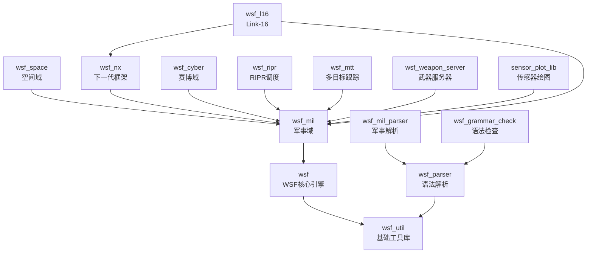
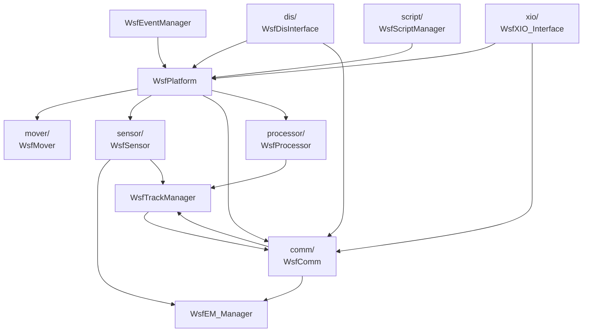

# AFSIM 模块依赖关系说明

> **状态**：✅ module 深度 — 含源码级 #include、继承链和构建依赖
> **日期**：2026-06-09
> **索引证据**：dependency-index.jsonl (1,038 条依赖), symbol-index.jsonl (3,255 符号), file-index.jsonl (2,413 文件含 includes)
> **关联文档**：[afsim-architecture.md](afsim-architecture.md)

---

## 1. 构建依赖（来自 CMakeLists.txt target_link_libraries）

| 源模块 | 依赖模块 | 证据 |
|--------|----------|------|
| wsf | wsf_util + TOOLS_LIBS | `wsf/CMakeLists.txt`: WSF_LIBS = wsf + TOOLS_LIBS + wsf_util |
| wsf_mil | wsf | `wsf_mil/CMakeLists.txt` project(wsf_mil) — 依赖 wsf 头文件和库 |
| wsf_space | wsf_mil | `wsf_space/CMakeLists.txt`: target_link_libraries(wsf_space wsf_mil) |
| wsf_nx | wsf_mil | `wsf_nx/CMakeLists.txt`: target_link_libraries(wsf_nx wsf_mil) |
| wsf_cyber | wsf_mil | `wsf_cyber/CMakeLists.txt`: target_link_libraries(wsf_cyber wsf_mil) |
| wsf_ripr | wsf_mil | `wsf_ripr/CMakeLists.txt`: target_link_libraries(wsf_ripr wsf_mil) |
| wsf_mtt | wsf_mil | `wsf_mtt/CMakeLists.txt`: target_link_libraries(wsf_mtt wsf_mil) |
| wsf_weapon_server | wsf_mil | `wsf_weapon_server/CMakeLists.txt`: target_link_libraries(wsf_weapon_server wsf_mil) |
| sensor_plot_lib | wsf_mil | `sensor_plot_lib/CMakeLists.txt`: target_link_libraries(sensor_plot_lib wsf_mil) |
| wsf_l16 | wsf_mil, wsf_nx | `wsf_l16/CMakeLists.txt`: target_link_libraries(wsf_l16 wsf_mil wsf_nx) |
| wsf_parser | util, wsf_util | `wsf_parser/CMakeLists.txt`: target_link_libraries(wsf_parser util wsf_util) |
| wsf_mil_parser | wsf_parser | `wsf_mil_parser/CMakeLists.txt`: target_link_libraries(wsf_mil_parser wsf_parser) |
| wsf_grammar_check | wsf_parser | `wsf_grammar_check/CMakeLists.txt`: target_link_libraries(wsf_grammar_check wsf_parser) |

---

## 2. 架构级依赖（继承/组合/调用）

### 2.1 WSF 内核内部依赖

| 源（类） | 目标（类） | 关系 | 说明 |
|----------|-----------|------|------|
| WsfPlatform | WsfObject | 继承 | 平台实体继承基础对象 |
| WsfPlatform | WsfMover | 组合 | mMoverPtr，无Mover则不能移动 |
| WsfPlatform | WsfSensor[] | 聚合 | 管理多个传感器组件 |
| WsfPlatform | WsfComm[] | 聚合 | 管理多个通信设备 |
| WsfPlatform | WsfProcessor[] | 聚合 | 管理多个处理器 |
| WsfPlatform | WsfFuel | 组合（可选） | 燃油消耗管理 |
| WsfPlatform | WsfSignatureList | 组合 | 可检测特征管理 |
| WsfSimulation | WsfEventManager | 组合 | mEventManager + mWallEventManager |
| WsfSimulation | WsfClockSource | 组合 | mClockSourcePtr（unique_ptr） |
| WsfSimulation | WsfMultiThreadManager | 组合 | mMultiThreadManager |
| WsfSimulation | ut::Random | 组合 | mRandom + mScriptRandom |
| WsfSimulation | WsfEM_Manager | 组合 | 管理活跃收发机 |
| WsfSimulation | WsfGroupManager | 组合 | 平台编组管理 |
| WsfScenario | WsfApplication | 强依赖 | 需要 Application 实例构造 |
| WsfScenario | WsfComponentFactoryList | 聚合 | 管理组件工厂注册 |
| WsfTrackManager | WsfCorrelationStrategy | 策略 | 可替换的航迹关联算法 |
| WsfTrackManager | WsfFusionStrategy | 策略 | 可替换的航迹融合算法 |
| WsfTrackManager | WsfLocalTrack[] | 聚合 | 维护本地航迹列表 |
| WsfEM_Manager | WsfEM_Xmtr[] | 聚合 | 活跃发射机列表 |
| WsfEM_Manager | WsfEM_Rcvr[] | 聚合 | 活跃接收机列表 |
| WsfEM_XmtrRcvr | WsfEM_Propagation | 组合 | 路径损耗计算 |
| WsfEM_XmtrRcvr | WsfEM_Attenuation | 组合 | 大气衰减计算 |
| WsfSensor | WsfEM_Rcvr | 组合 | 通过接收机感知电磁环境 |
| WsfSensor | WsfFieldOfView | 组合 | 空间覆盖范围限制 |
| WsfComm | WsfEM_XmtrRcvr | 组合 | 通过收发机实现通信 |
| WsfBehaviorTree | WsfBehaviorTreeNode[] | 聚合 | 树结构由节点组合 |

### 2.2 军事域继承关系

| 源（类） | 目标（类） | 模块 |
|----------|-----------|------|
| WsfLaunchComputer | WsfComponent | wsf_mil → wsf |
| WsfBallisticMissileLaunchComputer | WsfLaunchComputer | wsf_mil |
| WsfOrbitalLaunchComputer | WsfLaunchComputer | wsf_mil |
| WsfSAM_LaunchComputer | WsfLaunchComputer | wsf_mil |
| WsfATA_LaunchComputer | WsfLaunchComputer | wsf_mil |
| WsfEOIR_Sensor | WsfSensor | wsf_mil → wsf |
| WsfIRST_Sensor | WsfSensor | wsf_mil → wsf |
| WsfGuidedMover | WsfMover | wsf_mil → wsf |

### 2.3 空间域继承关系

| 源（类） | 目标（类） | 模块 |
|----------|-----------|------|
| WsfIntegratingSpaceMover | WsfSpaceMoverBase → WsfMover | wsf_space → wsf |
| WsfNORAD_SpaceMover | WsfSpaceMoverBase → WsfMover | wsf_space → wsf |
| WsfKeplerianOrbitalPropagator | WsfOrbitalPropagator | wsf_space |
| WsfJacchiaRobertsAtmosphere | UtAtmosphere | wsf_space → wsf |

---

## 3. WSF 内核子系统间依赖

---

## 4. 关键全局常量依赖（初始化顺序）

| 常量 | 值 | 定义位置 | 说明 |
|------|-----|---------|------|
| cWSF_INITIALIZE_ORDER_FUEL | -950,000,000 | WsfComponentRoles.hpp | 燃油模型最先初始化 |
| cWSF_INITIALIZE_ORDER_MOVER | -800,000,000 | WsfComponentRoles.hpp | 运动模型次之 |
| cWSF_INITIALIZE_ORDER_COMM | -700,000,000 | WsfComponentRoles.hpp | 通信设备 |
| cWSF_INITIALIZE_ORDER_PROCESSOR | -600,000,000 | WsfComponentRoles.hpp | 处理器 |
| cWSF_INITIALIZE_ORDER_SENSOR | -500,000,000 | WsfComponentRoles.hpp | 传感器 |
| cWSF_INITIALIZE_ORDER_TRACK_MANAGER | -900,000,000 | WsfComponentRoles.hpp | 跟踪管理器最先初始化 |

---

## 5. 依赖强度说明

| 强度 | 含义 | 示例 |
|------|------|------|
| **build** | CMake target_link_libraries 声明，缺少则链接失败 | wsf_mil → wsf |
| **强** | 编译期依赖，缺少则无法编译 | 继承关系、值类型成员、模板实例化 |
| **中** | 逻辑依赖，运行时通常需要，但有默认/null 替代 | 指针类型成员、可选策略模式 |
| **弱** | 松耦合，仅在特定场景使用 | 日志、调试、可选功能 |
