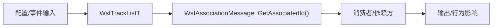
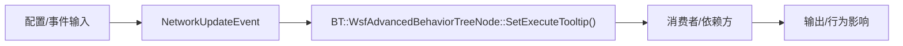
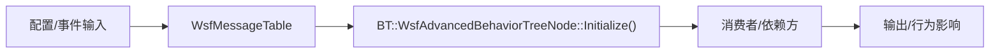
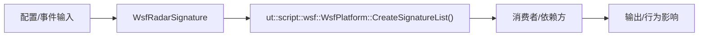
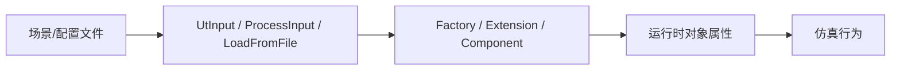

# 数据流分析

## 0. 用途说明

数据流分析用于解释 AFSIM 的关键状态如何从配置、事件或模型计算进入运行时对象，再被更新函数处理并影响其他模块、输出或可视化。

## 1. 关键数据对象

| 数据对象 | 类型 | 生产者 | 消费者 | 生命周期 |
|---|---|---|---|---|
| `Platform` | 平台对象/实体状态 | `ClutterTableFunction::ClutterTableFunction()` | `ClutterTableFunction::Execute#8035f2de5a` | `scenario_load → model_update/output` |
| `Track` | 航迹/目标跟踪状态 | `WsfAssociationMessage::GetAssociatedId()` | `CompositeMode::InitializeTrack#d28f2439f6` | `scenario_load → model_update/output` |
| `Event` | 事件队列与事件消息 | `BT::WsfAdvancedBehaviorTreeNode::SetExecuteTooltip()` | `event_output_plugin_test` | `scenario_load → model_update/output` |
| `Message` | 通信消息与消息表 | `BT::WsfAdvancedBehaviorTreeNode::Initialize()` | `FlightPathAnalysisFunction::Execute#8035f2de5a` | `scenario_load → model_update/output` |
| `Signature` | 传感器/目标特征数据 | `ut::script::wsf::WsfPlatform::CreateSignatureList()` | `RadarEnvelopeFunction::Execute#8035f2de5a` | `scenario_load → model_update/output` |

## 2. 数据流路径

### 数据流 Platform: 平台对象/实体状态

**节点映射**：

| Mermaid 节点 | 数据对象 | 中文说明 | 源码证据 |
|---|---|---|---|
| `Platform_source` | `Platform` 输入来源 | 场景输入、事件或运行时计算产生数据 | `workspace/source-index/function-index.jsonl` |
| `Platform_owner` | `PlatformElement` | 持有或表示该类数据的 class/struct | `afsim-2_9/swdev/src/core/wsf/source/WsfMultiThreadManager.hpp:72` |
| `Platform_update` | `ClutterTableFunction::ClutterTableFunction()` | 更新或处理该数据的函数 | `afsim-2_9/swdev/src/core/sensor_plot_lib/source/ClutterTableFunction.cpp:32` |
| `Platform_consumer` | 依赖消费者 | include/call/composition 中引用该对象的模块或函数 | `afsim-2_9/swdev/src/core/sensor_plot_lib/source/ClutterTableFunction.cpp` |
| `Platform_output` | 输出/行为影响 | 数据影响仿真状态、事件、报告或可视化 | `docs/architecture/dependency-graph.md` |

**链路说明**：state_source → state_owner → update_function → consumers → outputs

**逐步解释**：
1. `state_source` 产生 `Platform`：来自场景配置、仿真事件或上一帧状态。
2. `state_owner` 持有 `Platform`：`PlatformElement` 是当前索引中最直接的数据对象证据。
3. `update_function` 更新 `Platform`：`ClutterTableFunction::ClutterTableFunction()` 在 `afsim-2_9/swdev/src/core/sensor_plot_lib/source/ClutterTableFunction.cpp:32` 处理或传播相关状态。
4. `consumers` 消费 `Platform`：依赖索引显示 `ClutterTableFunction::Execute#8035f2de5a` 通过 `call` 关系使用它。
5. `outputs` 输出或影响行为：该数据最终影响模型更新、事件输出、报告或工具可视化。

### 数据流 Track: 航迹/目标跟踪状态

**节点映射**：

| Mermaid 节点 | 数据对象 | 中文说明 | 源码证据 |
|---|---|---|---|
| `Track_source` | `Track` 输入来源 | 场景输入、事件或运行时计算产生数据 | `workspace/source-index/function-index.jsonl` |
| `Track_owner` | `WsfTrackListT` | 持有或表示该类数据的 class/struct | `afsim-2_9/swdev/src/core/wsf/source/WsfTrackList.hpp:25` |
| `Track_update` | `WsfAssociationMessage::GetAssociatedId()` | 更新或处理该数据的函数 | `afsim-2_9/swdev/src/core/wsf/source/WsfAssociationMessage.hpp:88` |
| `Track_consumer` | 依赖消费者 | include/call/composition 中引用该对象的模块或函数 | `afsim-2_9/swdev/src/core/wsf/source/sensor/WsfCompositeSensor.cpp` |
| `Track_output` | 输出/行为影响 | 数据影响仿真状态、事件、报告或可视化 | `docs/architecture/dependency-graph.md` |

**链路说明**：state_source → state_owner → update_function → consumers → outputs

**逐步解释**：
1. `state_source` 产生 `Track`：来自场景配置、仿真事件或上一帧状态。
2. `state_owner` 持有 `Track`：`WsfTrackListT` 是当前索引中最直接的数据对象证据。
3. `update_function` 更新 `Track`：`WsfAssociationMessage::GetAssociatedId()` 在 `afsim-2_9/swdev/src/core/wsf/source/WsfAssociationMessage.hpp:88` 处理或传播相关状态。
4. `consumers` 消费 `Track`：依赖索引显示 `CompositeMode::InitializeTrack#d28f2439f6` 通过 `call` 关系使用它。
5. `outputs` 输出或影响行为：该数据最终影响模型更新、事件输出、报告或工具可视化。

### 数据流 Event: 事件队列与事件消息

**节点映射**：

| Mermaid 节点 | 数据对象 | 中文说明 | 源码证据 |
|---|---|---|---|
| `Event_source` | `Event` 输入来源 | 场景输入、事件或运行时计算产生数据 | `workspace/source-index/function-index.jsonl` |
| `Event_owner` | `NetworkUpdateEvent` | 持有或表示该类数据的 class/struct | `afsim-2_9/swdev/src/core/wsf/source/WsfNetworkInterface.hpp:91` |
| `Event_update` | `BT::WsfAdvancedBehaviorTreeNode::SetExecuteTooltip()` | 更新或处理该数据的函数 | `afsim-2_9/swdev/src/core/wsf/source/WsfAdvancedBehaviorTreeNode.cpp:1087` |
| `Event_consumer` | 依赖消费者 | include/call/composition 中引用该对象的模块或函数 | `afsim-2_9/swdev/src/wizard/plugins/EventOutput/test/CMakeLists.txt` |
| `Event_output` | 输出/行为影响 | 数据影响仿真状态、事件、报告或可视化 | `docs/architecture/dependency-graph.md` |

**链路说明**：state_source → state_owner → update_function → consumers → outputs

**逐步解释**：
1. `state_source` 产生 `Event`：来自场景配置、仿真事件或上一帧状态。
2. `state_owner` 持有 `Event`：`NetworkUpdateEvent` 是当前索引中最直接的数据对象证据。
3. `update_function` 更新 `Event`：`BT::WsfAdvancedBehaviorTreeNode::SetExecuteTooltip()` 在 `afsim-2_9/swdev/src/core/wsf/source/WsfAdvancedBehaviorTreeNode.cpp:1087` 处理或传播相关状态。
4. `consumers` 消费 `Event`：依赖索引显示 `event_output_plugin_test` 通过 `build` 关系使用它。
5. `outputs` 输出或影响行为：该数据最终影响模型更新、事件输出、报告或工具可视化。

### 数据流 Message: 通信消息与消息表

**节点映射**：

| Mermaid 节点 | 数据对象 | 中文说明 | 源码证据 |
|---|---|---|---|
| `Message_source` | `Message` 输入来源 | 场景输入、事件或运行时计算产生数据 | `workspace/source-index/function-index.jsonl` |
| `Message_owner` | `WsfMessageTable` | 持有或表示该类数据的 class/struct | `afsim-2_9/swdev/src/core/wsf/source/WsfMessageTable.hpp:47` |
| `Message_update` | `BT::WsfAdvancedBehaviorTreeNode::Initialize()` | 更新或处理该数据的函数 | `afsim-2_9/swdev/src/core/wsf/source/WsfAdvancedBehaviorTreeNode.cpp:839` |
| `Message_consumer` | 依赖消费者 | include/call/composition 中引用该对象的模块或函数 | `afsim-2_9/swdev/src/core/sensor_plot_lib/source/FlightPathAnalysisFunction.cpp` |
| `Message_output` | 输出/行为影响 | 数据影响仿真状态、事件、报告或可视化 | `docs/architecture/dependency-graph.md` |

**链路说明**：state_source → state_owner → update_function → consumers → outputs

**逐步解释**：
1. `state_source` 产生 `Message`：来自场景配置、仿真事件或上一帧状态。
2. `state_owner` 持有 `Message`：`WsfMessageTable` 是当前索引中最直接的数据对象证据。
3. `update_function` 更新 `Message`：`BT::WsfAdvancedBehaviorTreeNode::Initialize()` 在 `afsim-2_9/swdev/src/core/wsf/source/WsfAdvancedBehaviorTreeNode.cpp:839` 处理或传播相关状态。
4. `consumers` 消费 `Message`：依赖索引显示 `FlightPathAnalysisFunction::Execute#8035f2de5a` 通过 `call` 关系使用它。
5. `outputs` 输出或影响行为：该数据最终影响模型更新、事件输出、报告或工具可视化。

### 数据流 Signature: 传感器/目标特征数据

**节点映射**：

| Mermaid 节点 | 数据对象 | 中文说明 | 源码证据 |
|---|---|---|---|
| `Signature_source` | `Signature` 输入来源 | 场景输入、事件或运行时计算产生数据 | `workspace/source-index/function-index.jsonl` |
| `Signature_owner` | `WsfRadarSignature` | 持有或表示该类数据的 class/struct | `afsim-2_9/swdev/src/core/wsf/source/WsfRadarSignature.hpp:26` |
| `Signature_update` | `ut::script::wsf::WsfPlatform::CreateSignatureList()` | 更新或处理该数据的函数 | `afsim-2_9/swdev/src/core/wsf/source/WsfPlatform.cpp:726` |
| `Signature_consumer` | 依赖消费者 | include/call/composition 中引用该对象的模块或函数 | `afsim-2_9/swdev/src/core/sensor_plot_lib/source/RadarEnvelopeFunction.cpp` |
| `Signature_output` | 输出/行为影响 | 数据影响仿真状态、事件、报告或可视化 | `docs/architecture/dependency-graph.md` |

**链路说明**：state_source → state_owner → update_function → consumers → outputs

**逐步解释**：
1. `state_source` 产生 `Signature`：来自场景配置、仿真事件或上一帧状态。
2. `state_owner` 持有 `Signature`：`WsfRadarSignature` 是当前索引中最直接的数据对象证据。
3. `update_function` 更新 `Signature`：`ut::script::wsf::WsfPlatform::CreateSignatureList()` 在 `afsim-2_9/swdev/src/core/wsf/source/WsfPlatform.cpp:726` 处理或传播相关状态。
4. `consumers` 消费 `Signature`：依赖索引显示 `RadarEnvelopeFunction::Execute#8035f2de5a` 通过 `call` 关系使用它。
5. `outputs` 输出或影响行为：该数据最终影响模型更新、事件输出、报告或工具可视化。

## 配置流分析

配置流分析用于说明场景/配置文件如何转化为运行时对象属性、工厂注册和仿真行为。它帮助读者定位“输入文本中的命令”最终影响哪个对象、哪个初始化阶段和哪类运行时行为。

| 配置流 | 配置来源 | 解析函数 | 目标对象 | 运行时影响 | 证据位置 |
|---|---|---|---|---|---|
| 配置流 1 | 场景/配置文件 | `WsfAdvancedBehaviorTree::CreateNode()` | `WsfAdvancedBehaviorTree` | 影响对象属性或注册行为 | `afsim-2_9/swdev/src/core/wsf/source/WsfAdvancedBehaviorTree.cpp:263` |
| 配置流 2 | 场景/配置文件 | `WsfAdvancedBehaviorTree::GetFullFilePath()` | `WsfAdvancedBehaviorTree` | 影响对象属性或注册行为 | `afsim-2_9/swdev/src/core/wsf/source/WsfAdvancedBehaviorTree.cpp:127` |
| 配置流 3 | 场景/配置文件 | `WsfAdvancedBehaviorTree::Initialize()` | `WsfAdvancedBehaviorTree` | 影响对象属性或注册行为 | `afsim-2_9/swdev/src/core/wsf/source/WsfAdvancedBehaviorTree.cpp:208` |
| 配置流 4 | 场景/配置文件 | `WsfAdvancedBehaviorTree::ProcessInput()` | `WsfAdvancedBehaviorTree` | 影响对象属性或注册行为 | `afsim-2_9/swdev/src/core/wsf/source/WsfAdvancedBehaviorTree.cpp:249` |
| 配置流 5 | 场景/配置文件 | `WsfAdvancedBehaviorTree::ProcessTree()` | `WsfAdvancedBehaviorTree` | 影响对象属性或注册行为 | `afsim-2_9/swdev/src/core/wsf/source/WsfAdvancedBehaviorTree.cpp:557` |
| 配置流 6 | 场景/配置文件 | `BT::WsfAdvancedBehaviorTreeLeafNode::ProcessInput()` | `BT::WsfAdvancedBehaviorTreeLeafNode` | 影响对象属性或注册行为 | `afsim-2_9/swdev/src/core/wsf/source/WsfAdvancedBehaviorTreeNode.cpp:1215` |
| 配置流 7 | 场景/配置文件 | `BT::WsfAdvancedBehaviorTreeLeafNode::RegisterInput()` | `BT::WsfAdvancedBehaviorTreeLeafNode` | 影响对象属性或注册行为 | `afsim-2_9/swdev/src/core/wsf/source/WsfAdvancedBehaviorTreeNode.cpp:1253` |
| 配置流 8 | 场景/配置文件 | `BT::WsfAdvancedBehaviorTreeNode::LoadType()` | `BT::WsfAdvancedBehaviorTreeNode` | 影响对象属性或注册行为 | `afsim-2_9/swdev/src/core/wsf/source/WsfAdvancedBehaviorTreeNode.cpp:559` |

**逐步解释**：

1. 配置来源进入 `WsfAdvancedBehaviorTree::CreateNode()` (`afsim-2_9/swdev/src/core/wsf/source/WsfAdvancedBehaviorTree.cpp:263`)，函数通过 `AddChild, AddTree, BadValue, Clone, FromInput` 等调用读取命令或值，写入 `WsfAdvancedBehaviorTree` 的运行时状态，并影响后续初始化/更新行为。
2. 配置来源进入 `WsfAdvancedBehaviorTree::GetFullFilePath()` (`afsim-2_9/swdev/src/core/wsf/source/WsfAdvancedBehaviorTree.cpp:127`)，函数通过 `GetCurrentFileName, GetNormalizedPath, WorkingDirectory, substr` 等调用读取命令或值，写入 `WsfAdvancedBehaviorTree` 的运行时状态，并影响后续初始化/更新行为。
3. 配置来源进入 `WsfAdvancedBehaviorTree::Initialize()` (`afsim-2_9/swdev/src/core/wsf/source/WsfAdvancedBehaviorTree.cpp:208`)，函数通过 `BadValue, Clone, CreateNode, FromInput, GetAdvancedBehaviorTreeNodeTypes` 等调用读取命令或值，写入 `WsfAdvancedBehaviorTree` 的运行时状态，并影响后续初始化/更新行为。
4. 配置来源进入 `WsfAdvancedBehaviorTree::ProcessInput()` (`afsim-2_9/swdev/src/core/wsf/source/WsfAdvancedBehaviorTree.cpp:249`)，函数通过 `GetCommand, GetFullFilePath, ProcessTree, SetFilePath` 等调用读取命令或值，写入 `WsfAdvancedBehaviorTree` 的运行时状态，并影响后续初始化/更新行为。
5. 配置来源进入 `WsfAdvancedBehaviorTree::ProcessTree()` (`afsim-2_9/swdev/src/core/wsf/source/WsfAdvancedBehaviorTree.cpp:557`)，函数通过 `AddChild, AddTree, CreateNode, FromInput, GetCommand` 等调用读取命令或值，写入 `WsfAdvancedBehaviorTree` 的运行时状态，并影响后续初始化/更新行为。
