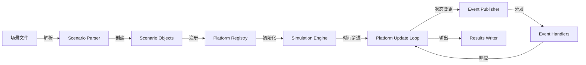
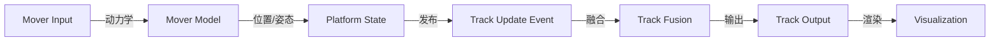
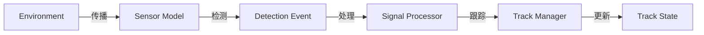
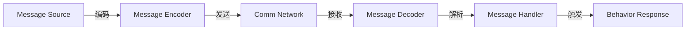
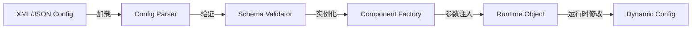

# AFSIM 数据流分析

> 生成日期：2026-06-22
> 阶段：Phase 6

## 关键数据对象

| 数据对象                     | 依赖引用数 | 生产者（写入方）                                                               | 消费者（读取方）                                                                                                             | 关联生命周期       |
| ------------------------ | ----- | ---------------------------------------------------------------------- | -------------------------------------------------------------------------------------------------------------------- | ------------ |
| Clone                    | 1042  | N/A                                                                    | WsfGeoPoint::GetLat, WsfGeoPoint::GetLocationLLA                                                                     | model_update |
| ProcessInput             | 621   | N/A                                                                    | WsfMessageTable::DefaultProp, WsfCorrelationStrategyTypes::ProcessInput                                              | model_update |
| WsfStringId              | 595   | WsfXIO_RawTrackPkt, WsfStandardInherentContrast                        | XWsfSeaTraffic::ProcessDepartureTraffic, XWsfSeaTraffic::ProcessLocalTraffic                                         | model_update |
| Initialize               | 553   | N/A                                                                    | WsfMessageTable::DefaultProp, WsfEventStepSimulation::~WsfEventStepSimulation                                        | output       |
| QString                  | 502   | ModelImport::detail::Json::ItemData, rv::RvStatistics::EventTableModel | N/A                                                                                                                  | model_update |
| BehaviorTreeNodeChildren | 462   | N/A                                                                    | wsf::comm::router::event::MessageTransmitEnded::GetSimulation, wsf::comm::router::event::MessageFailedRouting::Print | model_update |
| BehaviorTreeNodeExec     | 462   | N/A                                                                    | wsf::comm::router::event::MessageTransmitEnded::GetSimulation, wsf::comm::router::event::MessageFailedRouting::Print | model_update |
| CommAddedToLocal         | 462   | N/A                                                                    | wsf::comm::router::event::MessageTransmitEnded::GetSimulation, wsf::comm::router::event::MessageFailedRouting::Print | model_update |
| CommAddedToManager       | 462   | N/A                                                                    | wsf::comm::router::event::MessageTransmitEnded::GetSimulation, wsf::comm::router::event::MessageFailedRouting::Print | model_update |
| CommBroken               | 462   | N/A                                                                    | wsf::comm::router::event::MessageTransmitEnded::GetSimulation, wsf::comm::router::event::MessageFailedRouting::Print | model_update |

## 数据流路径

### 数据流 1: 仿真场景数据流

**描述**：场景文件 → 解析器(WsfParser/WsfParseGrammar) → 对象工厂(WsfComponentFactory) → 平台注册 → 仿真引擎(WsfSimulation) → 主循环更新 → 事件发布 → 事件处理 → 结果输出

### 数据流 2: 平台轨迹数据流

### 数据流 3: 传感器检测数据流

### 数据流 4: 通信消息数据流

### 数据流 5: 配置参数流

