# Phase5 依赖关系图

> 状态：已生成
> 完整清单：`workspace/source-index/dependency-index.jsonl`
> 模块明细：`docs/architecture/module-dependency.md`
> 验证报告：`docs/verification/phase5-verify-report.md`

## 0. 分析边界

以下路径按 Phase1 边界排除出核心架构依赖索引和 Mermaid 图：

| 路径 | 原因 |
|---|---|
| `afsim-2_9/demos` | Phase1 建议排除架构依赖核心图 |
| `afsim-2_9/documentation` | Phase1 建议排除架构依赖核心图 |
| `afsim-2_9/training` | Phase1 建议排除架构依赖核心图 |
| `afsim-2_9/resources` | Phase1 建议排除架构依赖核心图 |

图中只展示摘要边。筛选标准为：优先跨模块、优先 `strong` 强度、每组 `source_module + target_module + relation` 只展示一条代表证据。完整依赖清单以 `workspace/source-index/dependency-index.jsonl` 为准。

## 1. 依赖关系分布

| relation | 条目数 |
|---|---:|
| `build` | 280 |
| `call` | 179,465 |
| `composition` | 13,083 |
| `include` | 74,737 |
| `inheritance` | 5,102 |
| `registration` | 683 |

## 2. 构建依赖图

```mermaid
graph TD
  n_1cc2f92208["GTest::GTest"]
  n_2099328d27["wsf_nx"]
  n_23b2c16bb4["core/wsf_mil"]
  n_2fc18c419e["core/wsf_grammar_check"]
  n_35f63190c0["core/wsf"]
  n_3a4bb5b46b["wsf_mil"]
  n_402d99ffe4["${WSF_LIBS}"]
  n_4f78e2cb7d["wsf_cyber"]
  n_57d027b0f9["${SWDEV_THREAD_LIB}"]
  n_608c4a9020["core/wsf_l16"]
  n_6df139fe09["sensor_plot_lib"]
  n_73338e9760["core/wsf_cyber"]
  n_807c6ad73f["wsf_parser"]
  n_9092a2997e["wsf"]
  n_97b185a376["wsf_util"]
  n_a07ed5175f["GTest::Main"]
  n_ac94fc3b14["${TOOLS_LIBS}"]
  n_ceb13cd263["${SWDEV_DL_LIB}"]
  n_fdb4d6006e["core/sensor_plot_lib"]
  n_fdb4d6006e -->|"build dep_c1e48620343a614e"| n_ceb13cd263
  n_fdb4d6006e -->|"build dep_0d59dae27a226b98"| n_57d027b0f9
  n_fdb4d6006e -->|"build dep_4383b78595fc0324"| n_402d99ffe4
  n_fdb4d6006e -->|"build dep_b0671464a3250584"| n_1cc2f92208
  n_fdb4d6006e -->|"build dep_fccf5f6198e76ddb"| n_a07ed5175f
  n_fdb4d6006e -->|"build dep_56f18d8b4d855ff2"| n_6df139fe09
  n_fdb4d6006e -->|"build dep_09e56cf278ba0b47"| n_3a4bb5b46b
  n_35f63190c0 -->|"build dep_ade40c87728bc693"| n_ceb13cd263
  n_35f63190c0 -->|"build dep_386b4853d1a29cb5"| n_57d027b0f9
  n_35f63190c0 -->|"build dep_6f91b1a4b0754fb3"| n_ac94fc3b14
  n_35f63190c0 -->|"build dep_ab151bae6d38d36f"| n_1cc2f92208
  n_35f63190c0 -->|"build dep_fa432891149a0798"| n_a07ed5175f
  n_35f63190c0 -->|"build dep_0751a2e60eabef56"| n_9092a2997e
  n_35f63190c0 -->|"build dep_1c0a4dd01fe8f917"| n_97b185a376
  n_73338e9760 -->|"build dep_0268a6ee53f438eb"| n_ceb13cd263
  n_73338e9760 -->|"build dep_2647c49985abf556"| n_57d027b0f9
  n_73338e9760 -->|"build dep_2a6d9ab81d13302d"| n_402d99ffe4
  n_73338e9760 -->|"build dep_7a2517f5f11c3e7f"| n_1cc2f92208
  n_73338e9760 -->|"build dep_62c88ba6abde43c9"| n_a07ed5175f
  n_73338e9760 -->|"build dep_1a8ce54d32b3db50"| n_4f78e2cb7d
  n_73338e9760 -->|"build dep_59fafe05945a8bec"| n_3a4bb5b46b
  n_2fc18c419e -->|"build dep_fb4c1ab14c1e8094"| n_807c6ad73f
  n_608c4a9020 -->|"build dep_0a6e808a7c162e57"| n_3a4bb5b46b
  n_608c4a9020 -->|"build dep_c4f8024caf2953d9"| n_2099328d27
  n_23b2c16bb4 -->|"build dep_0a94ad46a14b2f88"| n_ceb13cd263
  n_23b2c16bb4 -->|"build dep_84abac9b2a17a627"| n_57d027b0f9
  n_23b2c16bb4 -->|"build dep_c27e8220119f46fa"| n_402d99ffe4
  n_23b2c16bb4 -->|"build dep_b663dc887c71b1af"| n_1cc2f92208
  n_23b2c16bb4 -->|"build dep_8ed5ccea338f6b8f"| n_a07ed5175f
  n_23b2c16bb4 -->|"build dep_6a6375dbfbc59eed"| n_9092a2997e
```

## 3. 架构级依赖图

覆盖 `inheritance`、`composition`、`call` 三类关系的跨模块摘要。

```mermaid
graph TD
  n_0a225c3854["class:SelectorType"]
  n_0f799fb999["class:AddressNetworkMap"]
  n_115ea5ba68["class:Array"]
  n_16aa531042["class:AuxDataAccessedItems"]
  n_1c1b948717["class:std::vector<PendingEdge>"]
  n_1c69f8ece2["class:WsfScriptContext"]
  n_1d79f039a9["class:AuxDataFusionRules"]
  n_22fb5b31c5["class:std::vector<PathPoint>"]
  n_24535fcd6c["class:Target"]
  n_2a6b167355["class:AircraftTypes"]
  n_329be2421b["class:AdjacentNodes"]
  n_335945eac3["class:AnalysisMapOptions"]
  n_35f63190c0["core/wsf"]
  n_3eb2af48ca["class:AttachmentType"]
  n_3f32de0115["class:std::vector<ColorRange>"]
  n_46d2c3071a["class:WsfScenario"]
  n_541ed5c90c["class:std::vector<Point> aVarValues)"]
  n_57dc35bfaa["class:WsfSensor::Settings"]
  n_619cf3da5c["class:WsfPlatformAvailability"]
  n_653fcd6b12["class:std::vector<Point>"]
  n_789d75a907["class:WsfTSPI"]
  n_7e1f443701["class:AddressMap"]
  n_80f762e391["class:WsfEM_Antenna::EBS_Mode"]
  n_882d9c2d77["class:SupTMProjection"]
  n_9c6a88d57c["class:std::vector<Variable>"]
  n_9fd50abdba["class:Altitudes"]
  n_ba7124f13d["class:Envelope"]
  n_bcadcde92d["class:UtCallbackHolder"]
  n_c1e186ea10["class:Action"]
  n_c2a97bca87["class:WsfStringId"]
  n_cbc474765c["class:Address"]
  n_cc01999025["class:FunctionFactoryMap"]
  n_cdf47aa224["class:UtAtmosphere"]
  n_dc9d1c55f1["class:UtColor"]
  n_e874cd0a43["class:Sensor"]
  n_e9ac7cedbd["class:MapPlotVariables"]
  n_ea8ccf63ca["class:WsfEM_Types::Polarization"]
  n_ed4992a042["class:std::vector<ContourLevel>"]
  n_fc298bef85["class:Airbases"]
  n_fcb3326bcf["class:MapPlotVariables::MapPlotVariableMap"]
  n_fdb4d6006e["core/sensor_plot_lib"]
  n_ffab5fed68["class:SelectorList"]
  n_fdb4d6006e -->|"composition dep_ea514128e23943c8"| n_335945eac3
  n_fdb4d6006e -->|"composition dep_9b7ec6328463d1de"| n_ba7124f13d
  n_fdb4d6006e -->|"composition dep_0329bff6238dc28b"| n_cc01999025
  n_fdb4d6006e -->|"composition dep_2cdac6dd200603d5"| n_e9ac7cedbd
  n_fdb4d6006e -->|"composition dep_25591f6c015335c0"| n_fcb3326bcf
  n_fdb4d6006e -->|"composition dep_616cad20af057a96"| n_ffab5fed68
  n_fdb4d6006e -->|"composition dep_f2491bb864c4e431"| n_0a225c3854
  n_fdb4d6006e -->|"composition dep_49cb338357951d38"| n_e874cd0a43
  n_fdb4d6006e -->|"composition dep_cee57fcf4181d9c4"| n_882d9c2d77
  n_fdb4d6006e -->|"composition dep_be85b821d974acb7"| n_24535fcd6c
  n_fdb4d6006e -->|"composition dep_2270bfafbd39ba38"| n_cdf47aa224
  n_fdb4d6006e -->|"composition dep_48358696ea4bf955"| n_bcadcde92d
  n_fdb4d6006e -->|"composition dep_574188b79f41a91d"| n_dc9d1c55f1
  n_fdb4d6006e -->|"composition dep_d6fbf795c7e4ec32"| n_80f762e391
  n_fdb4d6006e -->|"composition dep_c70ad33d9e97540f"| n_ea8ccf63ca
  n_fdb4d6006e -->|"composition dep_5eae8ebb4357670f"| n_619cf3da5c
  n_fdb4d6006e -->|"composition dep_a74e7cfc4c2cae21"| n_46d2c3071a
  n_fdb4d6006e -->|"composition dep_d982d087d621b9c9"| n_1c69f8ece2
  n_fdb4d6006e -->|"composition dep_d0ed61e8559f10f4"| n_57dc35bfaa
  n_fdb4d6006e -->|"composition dep_c15c7640e837c6a6"| n_c2a97bca87
  n_fdb4d6006e -->|"composition dep_4548b449b7fe7ef3"| n_789d75a907
  n_fdb4d6006e -->|"composition dep_8d59b2630fbd3d45"| n_3f32de0115
  n_fdb4d6006e -->|"composition dep_ef610c34b1b51633"| n_ed4992a042
  n_fdb4d6006e -->|"composition dep_e12fc6c2a30bdc90"| n_22fb5b31c5
  n_fdb4d6006e -->|"composition dep_c872064dabcfef84"| n_1c1b948717
  n_fdb4d6006e -->|"composition dep_84280fd7cfa4d799"| n_653fcd6b12
  n_fdb4d6006e -->|"composition dep_e751fbd7b67ba9a3"| n_541ed5c90c
  n_fdb4d6006e -->|"composition dep_2830aad6692eea7d"| n_9c6a88d57c
  n_35f63190c0 -->|"composition dep_ea1fb95ed6fd1ac2"| n_c1e186ea10
  n_35f63190c0 -->|"composition dep_7aa0c87cd5bff054"| n_cbc474765c
  n_35f63190c0 -->|"composition dep_335a4003f7c802d4"| n_7e1f443701
  n_35f63190c0 -->|"composition dep_1c0c02b64a9f08cd"| n_0f799fb999
  n_35f63190c0 -->|"composition dep_63b723b0a7796236"| n_329be2421b
  n_35f63190c0 -->|"composition dep_1873e72730d5a769"| n_fc298bef85
  n_35f63190c0 -->|"composition dep_b39eef53315430cf"| n_2a6b167355
  n_35f63190c0 -->|"composition dep_e3ece16a08876914"| n_9fd50abdba
  n_35f63190c0 -->|"composition dep_6a76958b5de39e5a"| n_115ea5ba68
  n_35f63190c0 -->|"composition dep_7fa4ddc162cc5734"| n_3eb2af48ca
  n_35f63190c0 -->|"composition dep_b0988a4728a7b0d6"| n_16aa531042
  n_35f63190c0 -->|"composition dep_3c8eb96d411a30bd"| n_1d79f039a9
```

## 4. 子系统间依赖图

```mermaid
graph TD
  n_02b525c25f["core/wsf_mil_parser"]
  n_1cc2f92208["GTest::GTest"]
  n_1fa3ebad75["GMock::Main"]
  n_2099328d27["wsf_nx"]
  n_23b2c16bb4["core/wsf_mil"]
  n_281811faa9["util"]
  n_2fc18c419e["core/wsf_grammar_check"]
  n_35f63190c0["core/wsf"]
  n_3a4bb5b46b["wsf_mil"]
  n_402d99ffe4["${WSF_LIBS}"]
  n_48a8786420["core/wsf_nx"]
  n_4f78e2cb7d["wsf_cyber"]
  n_57d027b0f9["${SWDEV_THREAD_LIB}"]
  n_608c4a9020["core/wsf_l16"]
  n_6df139fe09["sensor_plot_lib"]
  n_73338e9760["core/wsf_cyber"]
  n_807c6ad73f["wsf_parser"]
  n_9092a2997e["wsf"]
  n_97b185a376["wsf_util"]
  n_a07ed5175f["GTest::Main"]
  n_ac94fc3b14["${TOOLS_LIBS}"]
  n_c84ba09fed["core/wsf_ripr"]
  n_ceb13cd263["${SWDEV_DL_LIB}"]
  n_d7fff7a1ec["GMock::GMock"]
  n_e67a7d7cfa["core/wsf_mtt"]
  n_f1286beb5b["core/wsf_parser"]
  n_fdb4d6006e["core/sensor_plot_lib"]
  n_fdb4d6006e -->|"build dep_c1e48620343a614e"| n_ceb13cd263
  n_fdb4d6006e -->|"build dep_0d59dae27a226b98"| n_57d027b0f9
  n_fdb4d6006e -->|"build dep_4383b78595fc0324"| n_402d99ffe4
  n_fdb4d6006e -->|"build dep_b0671464a3250584"| n_1cc2f92208
  n_fdb4d6006e -->|"build dep_fccf5f6198e76ddb"| n_a07ed5175f
  n_fdb4d6006e -->|"build dep_56f18d8b4d855ff2"| n_6df139fe09
  n_fdb4d6006e -->|"build dep_09e56cf278ba0b47"| n_3a4bb5b46b
  n_35f63190c0 -->|"build dep_ade40c87728bc693"| n_ceb13cd263
  n_35f63190c0 -->|"build dep_386b4853d1a29cb5"| n_57d027b0f9
  n_35f63190c0 -->|"build dep_6f91b1a4b0754fb3"| n_ac94fc3b14
  n_35f63190c0 -->|"build dep_ab151bae6d38d36f"| n_1cc2f92208
  n_35f63190c0 -->|"build dep_fa432891149a0798"| n_a07ed5175f
  n_35f63190c0 -->|"build dep_0751a2e60eabef56"| n_9092a2997e
  n_35f63190c0 -->|"build dep_1c0a4dd01fe8f917"| n_97b185a376
  n_73338e9760 -->|"build dep_0268a6ee53f438eb"| n_ceb13cd263
  n_73338e9760 -->|"build dep_2647c49985abf556"| n_57d027b0f9
  n_73338e9760 -->|"build dep_2a6d9ab81d13302d"| n_402d99ffe4
  n_73338e9760 -->|"build dep_7a2517f5f11c3e7f"| n_1cc2f92208
  n_73338e9760 -->|"build dep_62c88ba6abde43c9"| n_a07ed5175f
  n_73338e9760 -->|"build dep_1a8ce54d32b3db50"| n_4f78e2cb7d
  n_73338e9760 -->|"build dep_59fafe05945a8bec"| n_3a4bb5b46b
  n_2fc18c419e -->|"build dep_fb4c1ab14c1e8094"| n_807c6ad73f
  n_608c4a9020 -->|"build dep_0a6e808a7c162e57"| n_3a4bb5b46b
  n_608c4a9020 -->|"build dep_c4f8024caf2953d9"| n_2099328d27
  n_23b2c16bb4 -->|"build dep_0a94ad46a14b2f88"| n_ceb13cd263
  n_23b2c16bb4 -->|"build dep_84abac9b2a17a627"| n_57d027b0f9
  n_23b2c16bb4 -->|"build dep_c27e8220119f46fa"| n_402d99ffe4
  n_23b2c16bb4 -->|"build dep_b663dc887c71b1af"| n_1cc2f92208
  n_23b2c16bb4 -->|"build dep_8ed5ccea338f6b8f"| n_a07ed5175f
  n_23b2c16bb4 -->|"build dep_6a6375dbfbc59eed"| n_9092a2997e
  n_23b2c16bb4 -->|"build dep_f84c2c074e023ae2"| n_3a4bb5b46b
  n_02b525c25f -->|"build dep_0ea40a3ea061e995"| n_807c6ad73f
  n_e67a7d7cfa -->|"build dep_9c977e8c0c7b2abc"| n_3a4bb5b46b
  n_48a8786420 -->|"build dep_fa121896c7aa92b5"| n_3a4bb5b46b
  n_f1286beb5b -->|"build dep_20b877518d339189"| n_ceb13cd263
  n_f1286beb5b -->|"build dep_8733d7d405831c8f"| n_57d027b0f9
  n_f1286beb5b -->|"build dep_06e596930f305546"| n_402d99ffe4
  n_f1286beb5b -->|"build dep_8b2adb20d452be96"| n_d7fff7a1ec
  n_f1286beb5b -->|"build dep_260fbcf28b0916f5"| n_1fa3ebad75
  n_f1286beb5b -->|"build dep_0cf59dfca1218758"| n_1cc2f92208
  n_f1286beb5b -->|"build dep_f02b8c257d284adb"| n_a07ed5175f
  n_f1286beb5b -->|"build dep_7847deedd45dfac3"| n_281811faa9
  n_f1286beb5b -->|"build dep_06d7858109c6582d"| n_807c6ad73f
  n_f1286beb5b -->|"build dep_02a28c766592ccc2"| n_97b185a376
  n_c84ba09fed -->|"build dep_f6f533bb2add3695"| n_3a4bb5b46b
```

## 5. 注册/扩展点依赖图

注册依赖用于识别插件、工厂、事件订阅和扩展点接入路径，帮助判断运行时能力如何接入系统。

```mermaid
graph TD
  n_23b2c16bb4["core/wsf_mil"]
  n_2fc18c419e["core/wsf_grammar_check"]
  n_35f63190c0["core/wsf"]
  n_475917ef1f["registration:RegisterExtension"]
  n_608c4a9020["core/wsf_l16"]
  n_73338e9760["core/wsf_cyber"]
  n_8a1be8c8c4["registration:AddExtension"]
  n_aba03b8b99["registration:AddMessage"]
  n_bc18a97354["registration:AddComponent"]
  n_c7175f74f3["registration:EventPipe"]
  n_d6744696e6["registration:Subscribe"]
  n_e3c9a2b235["registration:AddFactory"]
  n_f061e6fdd7["registration:RegisterScriptClasses"]
  n_fb59cd3ed0["registration:ComponentFactory"]
  n_fdb4d6006e["core/sensor_plot_lib"]
  n_fdb4d6006e -->|"registration dep_51d359cd1b080fbc"| n_bc18a97354
  n_fdb4d6006e -->|"registration dep_27fb23e676d75983"| n_475917ef1f
  n_35f63190c0 -->|"registration dep_28cfd81b8e234431"| n_bc18a97354
  n_35f63190c0 -->|"registration dep_cc94693bd8cbd1db"| n_8a1be8c8c4
  n_35f63190c0 -->|"registration dep_600dc856f6dd7905"| n_e3c9a2b235
  n_35f63190c0 -->|"registration dep_034c504ce210910a"| n_c7175f74f3
  n_35f63190c0 -->|"registration dep_dcda8583ea315bcf"| n_475917ef1f
  n_35f63190c0 -->|"registration dep_ef4ecf936e0b4e24"| n_d6744696e6
  n_73338e9760 -->|"registration dep_bf22ac8ab0f50873"| n_bc18a97354
  n_73338e9760 -->|"registration dep_e9d60b5aa3ba440b"| n_fb59cd3ed0
  n_73338e9760 -->|"registration dep_e305b1f344a5e547"| n_c7175f74f3
  n_73338e9760 -->|"registration dep_6eae6683fce1ea02"| n_475917ef1f
  n_2fc18c419e -->|"registration dep_9bdd76560ec7aea6"| n_475917ef1f
  n_608c4a9020 -->|"registration dep_577c11f52481bb63"| n_8a1be8c8c4
  n_608c4a9020 -->|"registration dep_1ad0eec0011d8097"| n_aba03b8b99
  n_608c4a9020 -->|"registration dep_f27e32de19f142f2"| n_475917ef1f
  n_608c4a9020 -->|"registration dep_4172de47a9ab0b80"| n_f061e6fdd7
  n_23b2c16bb4 -->|"registration dep_a53ebdb909fbd227"| n_bc18a97354
  n_23b2c16bb4 -->|"registration dep_37557b52143a9567"| n_475917ef1f
  n_23b2c16bb4 -->|"registration dep_7abae7c1ee1b6f13"| n_d6744696e6
```

## 6. 孤立或未展示模块说明

| 模块 | 说明 |
|---|---|
| 无 | 所有索引模块均有依赖记录 |

## 7. Mermaid 边追溯矩阵

| Mermaid 边 | dependency-index 条目 | relation | 证据路径 | 证据 |
|---|---|---|---|---|
| `core/sensor_plot_lib -> ${SWDEV_DL_LIB}` | `dep_c1e48620343a614e` | `build` | `afsim-2_9/swdev/src/core/sensor_plot_lib/test/CMakeLists.txt` | target_link_libraries(sensor_plot_lib_test ... ${SWDEV_DL_LIB} ...) |
| `core/sensor_plot_lib -> ${SWDEV_THREAD_LIB}` | `dep_0d59dae27a226b98` | `build` | `afsim-2_9/swdev/src/core/sensor_plot_lib/test/CMakeLists.txt` | target_link_libraries(sensor_plot_lib_test ... ${SWDEV_THREAD_LIB} ...) |
| `core/sensor_plot_lib -> ${WSF_LIBS}` | `dep_4383b78595fc0324` | `build` | `afsim-2_9/swdev/src/core/sensor_plot_lib/test/CMakeLists.txt` | target_link_libraries(sensor_plot_lib_test ... ${WSF_LIBS} ...) |
| `core/sensor_plot_lib -> GTest::GTest` | `dep_b0671464a3250584` | `build` | `afsim-2_9/swdev/src/core/sensor_plot_lib/test/CMakeLists.txt` | target_link_libraries(sensor_plot_lib_test ... GTest::GTest ...) |
| `core/sensor_plot_lib -> GTest::Main` | `dep_fccf5f6198e76ddb` | `build` | `afsim-2_9/swdev/src/core/sensor_plot_lib/test/CMakeLists.txt` | target_link_libraries(sensor_plot_lib_test ... GTest::Main ...) |
| `core/sensor_plot_lib -> sensor_plot_lib` | `dep_56f18d8b4d855ff2` | `build` | `afsim-2_9/swdev/src/core/sensor_plot_lib/test/CMakeLists.txt` | target_link_libraries(sensor_plot_lib_test ... sensor_plot_lib ...) |
| `core/sensor_plot_lib -> wsf_mil` | `dep_09e56cf278ba0b47` | `build` | `afsim-2_9/swdev/src/core/sensor_plot_lib/CMakeLists.txt` | target_link_libraries(${PROJECT_NAME} ... wsf_mil ...) |
| `core/wsf -> ${SWDEV_DL_LIB}` | `dep_ade40c87728bc693` | `build` | `afsim-2_9/swdev/src/core/wsf/test/CMakeLists.txt` | target_link_libraries(core_test ... ${SWDEV_DL_LIB} ...) |
| `core/wsf -> ${SWDEV_THREAD_LIB}` | `dep_386b4853d1a29cb5` | `build` | `afsim-2_9/swdev/src/core/wsf/test/CMakeLists.txt` | target_link_libraries(core_test ... ${SWDEV_THREAD_LIB} ...) |
| `core/wsf -> ${TOOLS_LIBS}` | `dep_6f91b1a4b0754fb3` | `build` | `afsim-2_9/swdev/src/core/wsf/source/CMakeLists.txt` | target_link_libraries(${PROJECT_NAME} ... ${TOOLS_LIBS} ...) |
| `core/wsf -> GTest::GTest` | `dep_ab151bae6d38d36f` | `build` | `afsim-2_9/swdev/src/core/wsf/test/CMakeLists.txt` | target_link_libraries(core_test ... GTest::GTest ...) |
| `core/wsf -> GTest::Main` | `dep_fa432891149a0798` | `build` | `afsim-2_9/swdev/src/core/wsf/test/CMakeLists.txt` | target_link_libraries(core_test ... GTest::Main ...) |
| `core/wsf -> wsf` | `dep_0751a2e60eabef56` | `build` | `afsim-2_9/swdev/src/core/wsf/test/CMakeLists.txt` | target_link_libraries(core_test ... wsf ...) |
| `core/wsf -> wsf_util` | `dep_1c0a4dd01fe8f917` | `build` | `afsim-2_9/swdev/src/core/wsf/source/CMakeLists.txt` | target_link_libraries(${PROJECT_NAME} ... wsf_util ...) |
| `core/wsf_cyber -> ${SWDEV_DL_LIB}` | `dep_0268a6ee53f438eb` | `build` | `afsim-2_9/swdev/src/core/wsf_cyber/test/CMakeLists.txt` | target_link_libraries(cyber_test ... ${SWDEV_DL_LIB} ...) |
| `core/wsf_cyber -> ${SWDEV_THREAD_LIB}` | `dep_2647c49985abf556` | `build` | `afsim-2_9/swdev/src/core/wsf_cyber/test/CMakeLists.txt` | target_link_libraries(cyber_test ... ${SWDEV_THREAD_LIB} ...) |
| `core/wsf_cyber -> ${WSF_LIBS}` | `dep_2a6d9ab81d13302d` | `build` | `afsim-2_9/swdev/src/core/wsf_cyber/test/CMakeLists.txt` | target_link_libraries(cyber_test ... ${WSF_LIBS} ...) |
| `core/wsf_cyber -> GTest::GTest` | `dep_7a2517f5f11c3e7f` | `build` | `afsim-2_9/swdev/src/core/wsf_cyber/test/CMakeLists.txt` | target_link_libraries(cyber_test ... GTest::GTest ...) |
| `core/wsf_cyber -> GTest::Main` | `dep_62c88ba6abde43c9` | `build` | `afsim-2_9/swdev/src/core/wsf_cyber/test/CMakeLists.txt` | target_link_libraries(cyber_test ... GTest::Main ...) |
| `core/wsf_cyber -> wsf_cyber` | `dep_1a8ce54d32b3db50` | `build` | `afsim-2_9/swdev/src/core/wsf_cyber/test/CMakeLists.txt` | target_link_libraries(cyber_test ... wsf_cyber ...) |
| `core/wsf_cyber -> wsf_mil` | `dep_59fafe05945a8bec` | `build` | `afsim-2_9/swdev/src/core/wsf_cyber/CMakeLists.txt` | target_link_libraries(${PROJECT_NAME} ... wsf_mil ...) |
| `core/wsf_grammar_check -> wsf_parser` | `dep_fb4c1ab14c1e8094` | `build` | `afsim-2_9/swdev/src/core/wsf_grammar_check/CMakeLists.txt` | target_link_libraries(${PROJECT_NAME} ... wsf_parser ...) |
| `core/wsf_l16 -> wsf_mil` | `dep_0a6e808a7c162e57` | `build` | `afsim-2_9/swdev/src/core/wsf_l16/CMakeLists.txt` | target_link_libraries(${PROJECT_NAME} ... wsf_mil ...) |
| `core/wsf_l16 -> wsf_nx` | `dep_c4f8024caf2953d9` | `build` | `afsim-2_9/swdev/src/core/wsf_l16/CMakeLists.txt` | target_link_libraries(${PROJECT_NAME} ... wsf_nx ...) |
| `core/wsf_mil -> ${SWDEV_DL_LIB}` | `dep_0a94ad46a14b2f88` | `build` | `afsim-2_9/swdev/src/core/wsf_mil/test/CMakeLists.txt` | target_link_libraries(mil_test ... ${SWDEV_DL_LIB} ...) |
| `core/wsf_mil -> ${SWDEV_THREAD_LIB}` | `dep_84abac9b2a17a627` | `build` | `afsim-2_9/swdev/src/core/wsf_mil/test/CMakeLists.txt` | target_link_libraries(mil_test ... ${SWDEV_THREAD_LIB} ...) |
| `core/wsf_mil -> ${WSF_LIBS}` | `dep_c27e8220119f46fa` | `build` | `afsim-2_9/swdev/src/core/wsf_mil/test/CMakeLists.txt` | target_link_libraries(mil_test ... ${WSF_LIBS} ...) |
| `core/wsf_mil -> GTest::GTest` | `dep_b663dc887c71b1af` | `build` | `afsim-2_9/swdev/src/core/wsf_mil/test/CMakeLists.txt` | target_link_libraries(mil_test ... GTest::GTest ...) |
| `core/wsf_mil -> GTest::Main` | `dep_8ed5ccea338f6b8f` | `build` | `afsim-2_9/swdev/src/core/wsf_mil/test/CMakeLists.txt` | target_link_libraries(mil_test ... GTest::Main ...) |
| `core/wsf_mil -> wsf` | `dep_6a6375dbfbc59eed` | `build` | `afsim-2_9/swdev/src/core/wsf_mil/source/CMakeLists.txt` | target_link_libraries(${PROJECT_NAME} ... wsf ...) |
| `core/sensor_plot_lib -> class:AnalysisMapOptions` | `dep_ea514128e23943c8` | `composition` | `afsim-2_9/swdev/src/core/sensor_plot_lib/source/HorizontalMapFunction.hpp` | AnalysisMapOptions mAnalysisMapOptions [public] |
| `core/sensor_plot_lib -> class:Envelope` | `dep_9b7ec6328463d1de` | `composition` | `afsim-2_9/swdev/src/core/sensor_plot_lib/source/ClutterTableFunction.hpp` | Envelope mEnvelope [private] |
| `core/sensor_plot_lib -> class:FunctionFactoryMap` | `dep_0329bff6238dc28b` | `composition` | `afsim-2_9/swdev/src/core/sensor_plot_lib/source/WsfSensorPlot.hpp` | FunctionFactoryMap mFunctionFactory [private] |
| `core/sensor_plot_lib -> class:MapPlotVariables` | `dep_2cdac6dd200603d5` | `composition` | `afsim-2_9/swdev/src/core/sensor_plot_lib/source/MapPlotFunction.hpp` | MapPlotVariables mPlotVariables{} [protected] |
| `core/sensor_plot_lib -> class:MapPlotVariables::MapPlotVariableMap` | `dep_25591f6c015335c0` | `composition` | `afsim-2_9/swdev/src/core/sensor_plot_lib/source/WsfSensorPlot.hpp` | MapPlotVariables::MapPlotVariableMap mMapPlotVariableMap [private] |
| `core/sensor_plot_lib -> class:SelectorList` | `dep_616cad20af057a96` | `composition` | `afsim-2_9/swdev/src/core/sensor_plot_lib/source/FlightPathAnalysisFunction.hpp` | SelectorList mExclusionList [public] |
| `core/sensor_plot_lib -> class:SelectorType` | `dep_f2491bb864c4e431` | `composition` | `afsim-2_9/swdev/src/core/sensor_plot_lib/source/FlightPathAnalysisFunction.hpp` | SelectorType mType [public] |
| `core/sensor_plot_lib -> class:Sensor` | `dep_49cb338357951d38` | `composition` | `afsim-2_9/swdev/src/core/sensor_plot_lib/source/ClutterTableFunction.hpp` | Sensor mSensor [private] |
| `core/sensor_plot_lib -> class:SupTMProjection` | `dep_cee57fcf4181d9c4` | `composition` | `afsim-2_9/swdev/src/core/sensor_plot_lib/source/FlightPathAnalysisFunction.hpp` | SupTMProjection mProjection [public] |
| `core/sensor_plot_lib -> class:Target` | `dep_be85b821d974acb7` | `composition` | `afsim-2_9/swdev/src/core/sensor_plot_lib/source/ClutterTableFunction.hpp` | Target mTarget [private] |
| `core/sensor_plot_lib -> class:UtAtmosphere` | `dep_2270bfafbd39ba38` | `composition` | `afsim-2_9/swdev/src/core/sensor_plot_lib/source/Target.hpp` | UtAtmosphere mAtmosphere [private] |
| `core/sensor_plot_lib -> class:UtCallbackHolder` | `dep_48358696ea4bf955` | `composition` | `afsim-2_9/swdev/src/core/sensor_plot_lib/source/Function.hpp` | UtCallbackHolder mFunctionCallbacks [private] |
| `core/sensor_plot_lib -> class:UtColor` | `dep_574188b79f41a91d` | `composition` | `afsim-2_9/swdev/src/core/sensor_plot_lib/source/HorizontalMapFunction.hpp` | UtColor mColor [private] |
| `core/sensor_plot_lib -> class:WsfEM_Antenna::EBS_Mode` | `dep_d6fbf795c7e4ec32` | `composition` | `afsim-2_9/swdev/src/core/sensor_plot_lib/source/AntennaPlotFunction.hpp` | WsfEM_Antenna::EBS_Mode mEBS_Mode [private] |
| `core/sensor_plot_lib -> class:WsfEM_Types::Polarization` | `dep_c70ad33d9e97540f` | `composition` | `afsim-2_9/swdev/src/core/sensor_plot_lib/source/AntennaPlotFunction.hpp` | WsfEM_Types::Polarization mPolarization [private] |
| `core/sensor_plot_lib -> class:WsfPlatformAvailability` | `dep_5eae8ebb4357670f` | `composition` | `afsim-2_9/swdev/src/core/sensor_plot_lib/source/Function.hpp` | WsfPlatformAvailability mPlatformAvailability [protected] |
| `core/sensor_plot_lib -> class:WsfScenario` | `dep_a74e7cfc4c2cae21` | `composition` | `afsim-2_9/swdev/src/core/sensor_plot_lib/source/Function.hpp` | const WsfScenario& mScenario [private] |
| `core/sensor_plot_lib -> class:WsfScriptContext` | `dep_d982d087d621b9c9` | `composition` | `afsim-2_9/swdev/src/core/sensor_plot_lib/source/Function.hpp` | WsfScriptContext mScriptContext [private] |
| `core/sensor_plot_lib -> class:WsfSensor::Settings` | `dep_d0ed61e8559f10f4` | `composition` | `afsim-2_9/swdev/src/core/sensor_plot_lib/source/Sensor.hpp` | WsfSensor::Settings mSettings [private] |
| `core/sensor_plot_lib -> class:WsfStringId` | `dep_c15c7640e837c6a6` | `composition` | `afsim-2_9/swdev/src/core/sensor_plot_lib/source/FlightPathAnalysisFunction.hpp` | WsfStringId mValue [public] |
| `core/sensor_plot_lib -> class:WsfTSPI` | `dep_4548b449b7fe7ef3` | `composition` | `afsim-2_9/swdev/src/core/sensor_plot_lib/source/FlightPathAnalysisFunction.hpp` | WsfTSPI mTSPI_Point [public] |
| `core/sensor_plot_lib -> class:std::vector<ColorRange>` | `dep_8d59b2630fbd3d45` | `composition` | `afsim-2_9/swdev/src/core/sensor_plot_lib/source/HorizontalMapFunction.hpp` | std::vector<ColorRange> mColorRanges [private] |
| `core/sensor_plot_lib -> class:std::vector<ContourLevel>` | `dep_ef610c34b1b51633` | `composition` | `afsim-2_9/swdev/src/core/sensor_plot_lib/source/HorizontalMapFunction.hpp` | std::vector<ContourLevel> mContourLevels [public] |
| `core/sensor_plot_lib -> class:std::vector<PathPoint>` | `dep_e12fc6c2a30bdc90` | `composition` | `afsim-2_9/swdev/src/core/sensor_plot_lib/source/FlightPathAnalysisFunction.hpp` | std::vector<PathPoint> mPathPoints [public] |
| `core/sensor_plot_lib -> class:std::vector<PendingEdge>` | `dep_c872064dabcfef84` | `composition` | `afsim-2_9/swdev/src/core/sensor_plot_lib/source/ContourFilter2D.hpp` | std::vector<PendingEdge> mPendingEdges [private] |
| `core/sensor_plot_lib -> class:std::vector<Point>` | `dep_84280fd7cfa4d799` | `composition` | `afsim-2_9/swdev/src/core/sensor_plot_lib/source/ClutterTableFunction.hpp` | std::vector<Point> data [public] |
| `core/sensor_plot_lib -> class:std::vector<Point> aVarValues)` | `dep_e751fbd7b67ba9a3` | `composition` | `afsim-2_9/swdev/src/core/sensor_plot_lib/source/HorizontalMapFunction.hpp` | const const std::vector<Point>&  aVarValues) const [public] |
| `core/sensor_plot_lib -> class:std::vector<Variable>` | `dep_2830aad6692eea7d` | `composition` | `afsim-2_9/swdev/src/core/sensor_plot_lib/source/FlightPathAnalysisFunction.hpp` | std::vector<Variable> mVarList [public] |
| `core/wsf -> class:Action` | `dep_ea1fb95ed6fd1ac2` | `composition` | `afsim-2_9/swdev/src/core/wsf/source/processor/WsfMessageProcessor.hpp` | Action mAction [public] |
| `core/wsf -> class:Address` | `dep_7aa0c87cd5bff054` | `composition` | `afsim-2_9/swdev/src/core/wsf/source/comm/WsfCommProtocolIGMP.hpp` | Address mCommAddress [private] |
| `core/wsf -> class:AddressMap` | `dep_335a4003f7c802d4` | `composition` | `afsim-2_9/swdev/src/core/wsf/source/comm/WsfCommNetworkManager.hpp` | AddressMap mCommToAddressMap [private] |
| `core/wsf -> class:AddressNetworkMap` | `dep_1c0c02b64a9f08cd` | `composition` | `afsim-2_9/swdev/src/core/wsf/source/comm/WsfCommNetworkManager.hpp` | AddressNetworkMap mAddressToNetworkMap [private] |
| `core/wsf -> class:AdjacentNodes` | `dep_63b723b0a7796236` | `composition` | `afsim-2_9/swdev/src/core/wsf/source/mover/WsfShortestPath.hpp` | AdjacentNodes mAdjacentNodes [private] |
| `core/wsf -> class:Airbases` | `dep_1873e72730d5a769` | `composition` | `afsim-2_9/swdev/src/core/wsf/source/traffic/XWsfAirTraffic.hpp` | Airbases mAirbases [public] |
| `core/wsf -> class:AircraftTypes` | `dep_b39eef53315430cf` | `composition` | `afsim-2_9/swdev/src/core/wsf/source/traffic/XWsfAirTraffic.hpp` | AircraftTypes mAircraftTypes [public] |
| `core/wsf -> class:Altitudes` | `dep_e3ece16a08876914` | `composition` | `afsim-2_9/swdev/src/core/wsf/source/mover/WsfVariableRateFuel.hpp` | Altitudes mAltitudes [public] |
| `core/wsf -> class:Array` | `dep_6a76958b5de39e5a` | `composition` | `afsim-2_9/swdev/src/core/wsf/source/mover/WsfTabularRateFuel.hpp` | Array FirstIV [private] |
| `core/wsf -> class:AttachmentType` | `dep_7fa4ddc162cc5734` | `composition` | `afsim-2_9/swdev/src/core/wsf/source/mover/WsfOffsetMover.hpp` | AttachmentType mAttachmentType [protected] |
| `core/wsf -> class:AuxDataAccessedItems` | `dep_b0988a4728a7b0d6` | `composition` | `afsim-2_9/swdev/src/core/wsf/source/xio_sim/WsfXIO_AuxData.hpp` | AuxDataAccessedItems mAuxDataAccessed [private] |
| `core/wsf -> class:AuxDataFusionRules` | `dep_3c8eb96d411a30bd` | `composition` | `afsim-2_9/swdev/src/core/wsf/source/WsfTrackManager.hpp` | AuxDataFusionRules mAuxDataFusionRules [private] |
| `core/sensor_plot_lib -> ${SWDEV_DL_LIB}` | `dep_c1e48620343a614e` | `build` | `afsim-2_9/swdev/src/core/sensor_plot_lib/test/CMakeLists.txt` | target_link_libraries(sensor_plot_lib_test ... ${SWDEV_DL_LIB} ...) |
| `core/sensor_plot_lib -> ${SWDEV_THREAD_LIB}` | `dep_0d59dae27a226b98` | `build` | `afsim-2_9/swdev/src/core/sensor_plot_lib/test/CMakeLists.txt` | target_link_libraries(sensor_plot_lib_test ... ${SWDEV_THREAD_LIB} ...) |
| `core/sensor_plot_lib -> ${WSF_LIBS}` | `dep_4383b78595fc0324` | `build` | `afsim-2_9/swdev/src/core/sensor_plot_lib/test/CMakeLists.txt` | target_link_libraries(sensor_plot_lib_test ... ${WSF_LIBS} ...) |
| `core/sensor_plot_lib -> GTest::GTest` | `dep_b0671464a3250584` | `build` | `afsim-2_9/swdev/src/core/sensor_plot_lib/test/CMakeLists.txt` | target_link_libraries(sensor_plot_lib_test ... GTest::GTest ...) |
| `core/sensor_plot_lib -> GTest::Main` | `dep_fccf5f6198e76ddb` | `build` | `afsim-2_9/swdev/src/core/sensor_plot_lib/test/CMakeLists.txt` | target_link_libraries(sensor_plot_lib_test ... GTest::Main ...) |
| `core/sensor_plot_lib -> sensor_plot_lib` | `dep_56f18d8b4d855ff2` | `build` | `afsim-2_9/swdev/src/core/sensor_plot_lib/test/CMakeLists.txt` | target_link_libraries(sensor_plot_lib_test ... sensor_plot_lib ...) |
| `core/sensor_plot_lib -> wsf_mil` | `dep_09e56cf278ba0b47` | `build` | `afsim-2_9/swdev/src/core/sensor_plot_lib/CMakeLists.txt` | target_link_libraries(${PROJECT_NAME} ... wsf_mil ...) |
| `core/wsf -> ${SWDEV_DL_LIB}` | `dep_ade40c87728bc693` | `build` | `afsim-2_9/swdev/src/core/wsf/test/CMakeLists.txt` | target_link_libraries(core_test ... ${SWDEV_DL_LIB} ...) |
| `core/wsf -> ${SWDEV_THREAD_LIB}` | `dep_386b4853d1a29cb5` | `build` | `afsim-2_9/swdev/src/core/wsf/test/CMakeLists.txt` | target_link_libraries(core_test ... ${SWDEV_THREAD_LIB} ...) |
| `core/wsf -> ${TOOLS_LIBS}` | `dep_6f91b1a4b0754fb3` | `build` | `afsim-2_9/swdev/src/core/wsf/source/CMakeLists.txt` | target_link_libraries(${PROJECT_NAME} ... ${TOOLS_LIBS} ...) |
| `core/wsf -> GTest::GTest` | `dep_ab151bae6d38d36f` | `build` | `afsim-2_9/swdev/src/core/wsf/test/CMakeLists.txt` | target_link_libraries(core_test ... GTest::GTest ...) |
| `core/wsf -> GTest::Main` | `dep_fa432891149a0798` | `build` | `afsim-2_9/swdev/src/core/wsf/test/CMakeLists.txt` | target_link_libraries(core_test ... GTest::Main ...) |
| `core/wsf -> wsf` | `dep_0751a2e60eabef56` | `build` | `afsim-2_9/swdev/src/core/wsf/test/CMakeLists.txt` | target_link_libraries(core_test ... wsf ...) |
| `core/wsf -> wsf_util` | `dep_1c0a4dd01fe8f917` | `build` | `afsim-2_9/swdev/src/core/wsf/source/CMakeLists.txt` | target_link_libraries(${PROJECT_NAME} ... wsf_util ...) |
| `core/wsf_cyber -> ${SWDEV_DL_LIB}` | `dep_0268a6ee53f438eb` | `build` | `afsim-2_9/swdev/src/core/wsf_cyber/test/CMakeLists.txt` | target_link_libraries(cyber_test ... ${SWDEV_DL_LIB} ...) |
| `core/wsf_cyber -> ${SWDEV_THREAD_LIB}` | `dep_2647c49985abf556` | `build` | `afsim-2_9/swdev/src/core/wsf_cyber/test/CMakeLists.txt` | target_link_libraries(cyber_test ... ${SWDEV_THREAD_LIB} ...) |
| `core/wsf_cyber -> ${WSF_LIBS}` | `dep_2a6d9ab81d13302d` | `build` | `afsim-2_9/swdev/src/core/wsf_cyber/test/CMakeLists.txt` | target_link_libraries(cyber_test ... ${WSF_LIBS} ...) |
| `core/wsf_cyber -> GTest::GTest` | `dep_7a2517f5f11c3e7f` | `build` | `afsim-2_9/swdev/src/core/wsf_cyber/test/CMakeLists.txt` | target_link_libraries(cyber_test ... GTest::GTest ...) |
| `core/wsf_cyber -> GTest::Main` | `dep_62c88ba6abde43c9` | `build` | `afsim-2_9/swdev/src/core/wsf_cyber/test/CMakeLists.txt` | target_link_libraries(cyber_test ... GTest::Main ...) |
| `core/wsf_cyber -> wsf_cyber` | `dep_1a8ce54d32b3db50` | `build` | `afsim-2_9/swdev/src/core/wsf_cyber/test/CMakeLists.txt` | target_link_libraries(cyber_test ... wsf_cyber ...) |
| `core/wsf_cyber -> wsf_mil` | `dep_59fafe05945a8bec` | `build` | `afsim-2_9/swdev/src/core/wsf_cyber/CMakeLists.txt` | target_link_libraries(${PROJECT_NAME} ... wsf_mil ...) |
| `core/wsf_grammar_check -> wsf_parser` | `dep_fb4c1ab14c1e8094` | `build` | `afsim-2_9/swdev/src/core/wsf_grammar_check/CMakeLists.txt` | target_link_libraries(${PROJECT_NAME} ... wsf_parser ...) |
| `core/wsf_l16 -> wsf_mil` | `dep_0a6e808a7c162e57` | `build` | `afsim-2_9/swdev/src/core/wsf_l16/CMakeLists.txt` | target_link_libraries(${PROJECT_NAME} ... wsf_mil ...) |
| `core/wsf_l16 -> wsf_nx` | `dep_c4f8024caf2953d9` | `build` | `afsim-2_9/swdev/src/core/wsf_l16/CMakeLists.txt` | target_link_libraries(${PROJECT_NAME} ... wsf_nx ...) |
| `core/wsf_mil -> ${SWDEV_DL_LIB}` | `dep_0a94ad46a14b2f88` | `build` | `afsim-2_9/swdev/src/core/wsf_mil/test/CMakeLists.txt` | target_link_libraries(mil_test ... ${SWDEV_DL_LIB} ...) |
| `core/wsf_mil -> ${SWDEV_THREAD_LIB}` | `dep_84abac9b2a17a627` | `build` | `afsim-2_9/swdev/src/core/wsf_mil/test/CMakeLists.txt` | target_link_libraries(mil_test ... ${SWDEV_THREAD_LIB} ...) |
| `core/wsf_mil -> ${WSF_LIBS}` | `dep_c27e8220119f46fa` | `build` | `afsim-2_9/swdev/src/core/wsf_mil/test/CMakeLists.txt` | target_link_libraries(mil_test ... ${WSF_LIBS} ...) |
| `core/wsf_mil -> GTest::GTest` | `dep_b663dc887c71b1af` | `build` | `afsim-2_9/swdev/src/core/wsf_mil/test/CMakeLists.txt` | target_link_libraries(mil_test ... GTest::GTest ...) |
| `core/wsf_mil -> GTest::Main` | `dep_8ed5ccea338f6b8f` | `build` | `afsim-2_9/swdev/src/core/wsf_mil/test/CMakeLists.txt` | target_link_libraries(mil_test ... GTest::Main ...) |
| `core/wsf_mil -> wsf` | `dep_6a6375dbfbc59eed` | `build` | `afsim-2_9/swdev/src/core/wsf_mil/source/CMakeLists.txt` | target_link_libraries(${PROJECT_NAME} ... wsf ...) |
| `core/wsf_mil -> wsf_mil` | `dep_f84c2c074e023ae2` | `build` | `afsim-2_9/swdev/src/core/wsf_mil/test/CMakeLists.txt` | target_link_libraries(mil_test ... wsf_mil ...) |
| `core/wsf_mil_parser -> wsf_parser` | `dep_0ea40a3ea061e995` | `build` | `afsim-2_9/swdev/src/core/wsf_mil_parser/CMakeLists.txt` | target_link_libraries(${PROJECT_NAME} ... wsf_parser ...) |
| `core/wsf_mtt -> wsf_mil` | `dep_9c977e8c0c7b2abc` | `build` | `afsim-2_9/swdev/src/core/wsf_mtt/CMakeLists.txt` | target_link_libraries(${PROJECT_NAME} ... wsf_mil ...) |
| `core/wsf_nx -> wsf_mil` | `dep_fa121896c7aa92b5` | `build` | `afsim-2_9/swdev/src/core/wsf_nx/CMakeLists.txt` | target_link_libraries(${PROJECT_NAME} ... wsf_mil ...) |
| `core/wsf_parser -> ${SWDEV_DL_LIB}` | `dep_20b877518d339189` | `build` | `afsim-2_9/swdev/src/core/wsf_parser/test/CMakeLists.txt` | target_link_libraries(parser_test ... ${SWDEV_DL_LIB} ...) |
| `core/wsf_parser -> ${SWDEV_THREAD_LIB}` | `dep_8733d7d405831c8f` | `build` | `afsim-2_9/swdev/src/core/wsf_parser/test/CMakeLists.txt` | target_link_libraries(parser_test ... ${SWDEV_THREAD_LIB} ...) |
| `core/wsf_parser -> ${WSF_LIBS}` | `dep_06e596930f305546` | `build` | `afsim-2_9/swdev/src/core/wsf_parser/test/CMakeLists.txt` | target_link_libraries(parser_test ... ${WSF_LIBS} ...) |
| `core/wsf_parser -> GMock::GMock` | `dep_8b2adb20d452be96` | `build` | `afsim-2_9/swdev/src/core/wsf_parser/test/CMakeLists.txt` | target_link_libraries(parser_test ... GMock::GMock ...) |
| `core/wsf_parser -> GMock::Main` | `dep_260fbcf28b0916f5` | `build` | `afsim-2_9/swdev/src/core/wsf_parser/test/CMakeLists.txt` | target_link_libraries(parser_test ... GMock::Main ...) |
| `core/wsf_parser -> GTest::GTest` | `dep_0cf59dfca1218758` | `build` | `afsim-2_9/swdev/src/core/wsf_parser/test/CMakeLists.txt` | target_link_libraries(parser_test ... GTest::GTest ...) |
| `core/wsf_parser -> GTest::Main` | `dep_f02b8c257d284adb` | `build` | `afsim-2_9/swdev/src/core/wsf_parser/test/CMakeLists.txt` | target_link_libraries(parser_test ... GTest::Main ...) |
| `core/wsf_parser -> util` | `dep_7847deedd45dfac3` | `build` | `afsim-2_9/swdev/src/core/wsf_parser/CMakeLists.txt` | target_link_libraries(${PROJECT_NAME} ... util ...) |
| `core/wsf_parser -> wsf_parser` | `dep_06d7858109c6582d` | `build` | `afsim-2_9/swdev/src/core/wsf_parser/test/CMakeLists.txt` | target_link_libraries(parser_test ... wsf_parser ...) |
| `core/wsf_parser -> wsf_util` | `dep_02a28c766592ccc2` | `build` | `afsim-2_9/swdev/src/core/wsf_parser/CMakeLists.txt` | target_link_libraries(${PROJECT_NAME} ... wsf_util ...) |
| `core/wsf_ripr -> wsf_mil` | `dep_f6f533bb2add3695` | `build` | `afsim-2_9/swdev/src/core/wsf_ripr/CMakeLists.txt` | target_link_libraries(${PROJECT_NAME} ... wsf_mil ...) |
| `core/sensor_plot_lib -> registration:AddComponent` | `dep_51d359cd1b080fbc` | `registration` | `afsim-2_9/swdev/src/core/sensor_plot_lib/source/MapPlotVariables.cpp` | // after ownership has been transferred to the platform (via AddComponent) |
| `core/sensor_plot_lib -> registration:RegisterExtension` | `dep_27fb23e676d75983` | `registration` | `afsim-2_9/swdev/src/core/sensor_plot_lib/source/WsfSensorPlot.cpp` | aScenario.RegisterExtension(GetExtensionName(), ut::make_unique<WsfSensorPlotExtension>(this)); |
| `core/wsf -> registration:AddComponent` | `dep_28cfd81b8e234431` | `registration` | `afsim-2_9/swdev/src/core/wsf/source/WsfCallbackTypes.cpp` | if (aPlatform.AddComponent(instancePtr.get())) |
| `core/wsf -> registration:AddExtension` | `dep_cc94693bd8cbd1db` | `registration` | `afsim-2_9/swdev/src/core/wsf/source/WsfApplication.cpp` | mExtensionListPtr->AddExtension(aName, std::move(aExtensionPtr)); |
| `core/wsf -> registration:AddFactory` | `dep_600dc856f6dd7905` | `registration` | `afsim-2_9/swdev/src/core/wsf/source/comm/WsfCommMediumFactory.hpp` | void AddFactory(std::unique_ptr<Factory<MEDIUM_TYPE>> aFactory) |
| `core/wsf -> registration:EventPipe` | `dep_034c504ce210910a` | `registration` | `afsim-2_9/swdev/src/core/wsf/source/xio_sim/WsfXIO_EventPipe.cpp` | void wsf::xio::EventPipe::RegisterEvents(WsfEventPipeExtension& aEventPipeExtension) |
| `core/wsf -> registration:RegisterExtension` | `dep_dcda8583ea315bcf` | `registration` | `afsim-2_9/swdev/src/core/wsf/source/WsfApplication.cpp` | void WsfApplication::RegisterExtension(const std::string& aName, std::unique_ptr<WsfApplicationExtension> aExtensionPtr) |
| `core/wsf -> registration:Subscribe` | `dep_ef4ecf936e0b4e24` | `registration` | `afsim-2_9/swdev/src/core/wsf/source/dis/WsfDisInterface.cpp` | // Subscribe to callbacks; these are applicable for both threaded and non-threaded |
| `core/wsf_cyber -> registration:AddComponent` | `dep_bf22ac8ab0f50873` | `registration` | `afsim-2_9/swdev/src/core/wsf_cyber/source/WsfCyberConstraint.cpp` | const_cast<WsfPlatformComponentList&>(aPlatform.GetComponents()).AddComponent(componentPtr); |
| `core/wsf_cyber -> registration:ComponentFactory` | `dep_e9d60b5aa3ba440b` | `registration` | `afsim-2_9/swdev/src/core/wsf_cyber/source/WsfCyberConstraintTypes.cpp` | class ComponentFactory : public WsfComponentFactory<WsfPlatform> |
| `core/wsf_cyber -> registration:EventPipe` | `dep_e305b1f344a5e547` | `registration` | `afsim-2_9/swdev/src/core/wsf_cyber/source/WsfCyberEventPipe.cpp` | void EventPipe::RegisterEvents(WsfEventPipeExtension& aEventPipeExtension) |
| `core/wsf_cyber -> registration:RegisterExtension` | `dep_6eae6683fce1ea02` | `registration` | `afsim-2_9/swdev/src/core/wsf_cyber/source/WsfCyberApplicationExtension.cpp` | aScenario.RegisterExtension(GetExtensionName(), ut::make_unique<ScenarioExtension>()); |
| `core/wsf_grammar_check -> registration:RegisterExtension` | `dep_9bdd76560ec7aea6` | `registration` | `afsim-2_9/swdev/src/core/wsf_grammar_check/source/WsfGrammarCheck.cpp` | aApplication.RegisterExtension("wsf_grammar_check", |
| `core/wsf_l16 -> registration:AddExtension` | `dep_577c11f52481bb63` | `registration` | `afsim-2_9/swdev/src/core/wsf_l16/source/Interface.cpp` | std::cout << "   .. method:: " << wordName << " AddExtension" << c << "()\n\n"; |
| `core/wsf_l16 -> registration:AddMessage` | `dep_1ad0eec0011d8097` | `registration` | `afsim-2_9/swdev/src/core/wsf_l16/source/MessagesFactory.cpp` | AddMessage(new J2_0::Initial()); |
| `core/wsf_l16 -> registration:RegisterExtension` | `dep_f27e32de19f142f2` | `registration` | `afsim-2_9/swdev/src/core/wsf_l16/source/Loader.cpp` | aSimulation.RegisterExtension(GetExtensionName(), ut::make_unique<WsfL16::Interface>(mInterfaceSetup)); |
| `core/wsf_l16 -> registration:RegisterScriptClasses` | `dep_4172de47a9ab0b80` | `registration` | `afsim-2_9/swdev/src/core/wsf_l16/source/MessagesFactory.cpp` | RegisterScriptClasses(*aScriptTypes); |
| `core/wsf_mil -> registration:AddComponent` | `dep_a53ebdb909fbd227` | `registration` | `afsim-2_9/swdev/src/core/wsf_mil/source/WsfMil.cpp` | WsfExtInput::Find(GetScenario())->mData.AddComponent(new WsfMilExtInterface(this)); |
| `core/wsf_mil -> registration:RegisterExtension` | `dep_37557b52143a9567` | `registration` | `afsim-2_9/swdev/src/core/wsf_mil/source/WsfLaserDesignations.cpp` | aSimulation.RegisterExtension(GetExtensionName(), ut::make_unique<WsfLaserDesignations>(*this)); |
| `core/wsf_mil -> registration:Subscribe` | `dep_7abae7c1ee1b6f13` | `registration` | `afsim-2_9/swdev/src/core/wsf_mil/source/processor/WsfWeaponTaskManager.cpp` | // Subscribe to simulation events of interest. |
