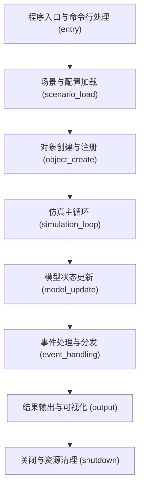

# 应用/仿真生命周期分析

> 状态：已按 Phase6 重建
> 输入索引：`workspace/source-index/function-index.jsonl`、`workspace/source-index/dependency-index.jsonl`
> 说明：本文件以 Phase4 函数级生命周期角色为主，入口点补充来自一次 CodeGraph 批量查询。

## 生命周期总览

## 各阶段详情

### 阶段 1: 程序入口与命令行处理 (`entry`)

| 属性 | 值 |
|---|---|
| 入口函数 | `mission::main()`, `mystic::main()`, `post_processor/exec::main()` |
| 关键类 | `mission`, `mystic`, `phase2_batch09`, `post_processor/exec` |
| 配置来源 | 命令行/场景输入文件/UtInput |
| 主要状态对象 | `mInputFiles`, `mResetRequested`, `mRunMode` |
| 证据位置 | `afsim-2_9/swdev/src/mission/source/mission.cpp:80`, `afsim-2_9/swdev/src/mystic/exec/source/mystic.cpp:266`, `afsim-2_9/swdev/src/post_processor/exec/source/post_processor.cpp:27` |

| 关键函数 | 位置 | lifecycle_role | 代表性调用 |
|---|---|---|---|
| `mission::main()` | `afsim-2_9/swdev/src/mission/source/mission.cpp:80` | `simulation_loop` | `AddNote, CreateSimulation, GetFinalRunNumber, GetInitalRunNumber, GetReturnCode` |
| `mystic::main()` | `afsim-2_9/swdev/src/mystic/exec/source/mystic.cpp:266` | `simulation_loop` | `ReportException, SetApplicationErrorHandling, SetupApplicationLog, app, current_exception` |
| `post_processor/exec::main()` | `afsim-2_9/swdev/src/post_processor/exec/source/post_processor.cpp:27` | `simulation_loop` | `Execute, GetClock, GetReportTypeStr, config, what` |
| `phase2_batch09::main()` | `afsim-2_9/swdev/src/sensor_plot/source/sensor_plot.cpp:73` | `simulation_loop` | `AddNote, EnableSensorPlotMode, ExecutePlots, ExtensionDepends, Find` |
| `tools/artificer::main()` | `afsim-2_9/swdev/src/tools/artificer/source/cli/main.cpp:80` | `simulation_loop` | `GetSystemPath, TransformFile, parseArgs, what` |

**可验证调用链**：

1. `mission::main()` (`afsim-2_9/swdev/src/mission/source/mission.cpp:80`) → `wsf::comm::router::medium::WsfScenario::GetFinalRunNumber()` (`afsim-2_9/swdev/src/core/wsf/source/WsfScenario.hpp:307`)：通过 Phase4 `calls` 记录调用 `GetFinalRunNumber`，用于推进该阶段的状态变化；证据：function-index calls。
1. `mystic::main()` (`afsim-2_9/swdev/src/mystic/exec/source/mystic.cpp:266`) → `mystic/exec::rvExecute()` (`afsim-2_9/swdev/src/mystic/exec/source/mystic.cpp:107`)：通过 Phase4 `calls` 记录调用 `rvExecute`，用于推进该阶段的状态变化；证据：function-index calls。
1. `post_processor/exec::main()` (`afsim-2_9/swdev/src/post_processor/exec/source/post_processor.cpp:27`) → `WsfArticulatedPartEvent::Execute()` (`afsim-2_9/swdev/src/core/wsf/source/WsfArticulatedPartEvent.cpp:33`)：通过 Phase4 `calls` 记录调用 `Execute`，用于推进该阶段的状态变化；证据：function-index calls。

### 阶段 2: 场景与配置加载 (`scenario_load`)

| 属性 | 值 |
|---|---|
| 入口函数 | `WsfAdvancedBehaviorTree::ProcessInput()`, `BT::WsfAdvancedBehaviorTreeNode::ProcessInput()`, `BT::WsfAdvancedBehaviorTreeRepeaterNode::ProcessInput()` |
| 关键类 | `BT::WsfAdvancedBehaviorTreeLeafNode`, `BT::WsfAdvancedBehaviorTreeNode`, `BT::WsfAdvancedBehaviorTreeRepeaterNode`, `BaseData` |
| 配置来源 | 命令行/场景输入文件/UtInput |
| 主要状态对象 | `mAdjustment`, `mColor`, `mContextPtr`, `mDebug`, `mDescription` |
| 证据位置 | `afsim-2_9/swdev/src/core/wsf/source/WsfAdvancedBehaviorTree.cpp:249`, `afsim-2_9/swdev/src/core/wsf/source/WsfAdvancedBehaviorTreeNode.cpp:932`, `afsim-2_9/swdev/src/core/wsf/source/WsfAdvancedBehaviorTreeNode.cpp:932` |

| 关键函数 | 位置 | lifecycle_role | 代表性调用 |
|---|---|---|---|
| `WsfAdvancedBehaviorTree::ProcessInput()` | `afsim-2_9/swdev/src/core/wsf/source/WsfAdvancedBehaviorTree.cpp:249` | `scenario_load` | `GetCommand, GetFullFilePath, ProcessTree, SetFilePath` |
| `BT::WsfAdvancedBehaviorTreeNode::ProcessInput()` | `afsim-2_9/swdev/src/core/wsf/source/WsfAdvancedBehaviorTreeNode.cpp:932` | `scenario_load` | `Compile, GetCommand, ReadBool, ReadValue, ReadValueQuoted` |
| `BT::WsfAdvancedBehaviorTreeRepeaterNode::ProcessInput()` | `afsim-2_9/swdev/src/core/wsf/source/WsfAdvancedBehaviorTreeNode.cpp:932` | `scenario_load` | `Compile, GetCommand, ReadBool, ReadValue, ReadValueQuoted` |
| `BT::WsfAdvancedBehaviorTreeLeafNode::ProcessInput()` | `afsim-2_9/swdev/src/core/wsf/source/WsfAdvancedBehaviorTreeNode.cpp:1215` | `scenario_load` | `GetCommand, GetScenario, ReadCommand, SetName, UnknownCommand` |
| `WsfAntennaPattern::ProcessInput()` | `afsim-2_9/swdev/src/core/wsf/source/WsfAntennaPattern.cpp:214` | `scenario_load` | `` |

**可验证调用链**：

1. `WsfAdvancedBehaviorTree::ProcessInput()` (`afsim-2_9/swdev/src/core/wsf/source/WsfAdvancedBehaviorTree.cpp:249`) → `Function::GetCommand()` (`afsim-2_9/swdev/src/core/sensor_plot_lib/source/Function.hpp:38`)：通过 Phase4 `calls` 记录调用 `GetCommand`，用于推进该阶段的状态变化；证据：function-index calls。
1. `BT::WsfAdvancedBehaviorTreeNode::ProcessInput()` (`afsim-2_9/swdev/src/core/wsf/source/WsfAdvancedBehaviorTreeNode.cpp:932`) → `ut::script::WsfScriptContext::Compile()` (`afsim-2_9/swdev/src/core/wsf/source/script/WsfScriptContext.cpp:173`)：通过 Phase4 `calls` 记录调用 `Compile`，用于推进该阶段的状态变化；证据：function-index calls。
1. `BT::WsfAdvancedBehaviorTreeRepeaterNode::ProcessInput()` (`afsim-2_9/swdev/src/core/wsf/source/WsfAdvancedBehaviorTreeNode.cpp:932`) → `ut::script::WsfScriptContext::Compile()` (`afsim-2_9/swdev/src/core/wsf/source/script/WsfScriptContext.cpp:173`)：通过 Phase4 `calls` 记录调用 `Compile`，用于推进该阶段的状态变化；证据：function-index calls。

### 阶段 3: 对象创建与注册 (`object_create`)

| 属性 | 值 |
|---|---|
| 入口函数 | `BT::WsfAdvancedBehaviorTreeNode::Initialize()`, `BT::WsfAdvancedBehaviorTreeCompositeNode::Initialize()`, `WsfAntennaPattern::Initialize()` |
| 关键类 | `BT::WsfAdvancedBehaviorTreeCompositeNode`, `BT::WsfAdvancedBehaviorTreeNode`, `BaseData`, `WsfAntennaPattern` |
| 配置来源 | 命令行/场景输入文件/UtInput |
| 主要状态对象 | `mAvgGain`, `mAvgGainInitialized`, `mAvgGainMutex`, `mChildren`, `mContextPtr` |
| 证据位置 | `afsim-2_9/swdev/src/core/wsf/source/WsfAdvancedBehaviorTreeNode.cpp:839`, `afsim-2_9/swdev/src/core/wsf/source/WsfAdvancedBehaviorTreeNode.cpp:1628`, `afsim-2_9/swdev/src/core/wsf/source/WsfAntennaPattern.cpp:203` |

| 关键函数 | 位置 | lifecycle_role | 代表性调用 |
|---|---|---|---|
| `BT::WsfAdvancedBehaviorTreeNode::Initialize()` | `afsim-2_9/swdev/src/core/wsf/source/WsfAdvancedBehaviorTreeNode.cpp:839` | `object_create` | `EnterState, ExecuteScript, GetInitialStateIndex, GetOwningPlatform, GetOwningProcessor` |
| `BT::WsfAdvancedBehaviorTreeCompositeNode::Initialize()` | `afsim-2_9/swdev/src/core/wsf/source/WsfAdvancedBehaviorTreeNode.cpp:1628` | `object_create` | `` |
| `WsfAntennaPattern::Initialize()` | `afsim-2_9/swdev/src/core/wsf/source/WsfAntennaPattern.cpp:203` | `object_create` | `` |
| `WsfAntennaPattern::Initialize()` | `afsim-2_9/swdev/src/core/wsf/source/WsfAntennaPattern.cpp:203` | `object_create` | `` |
| `BaseData::Initialize()` | `afsim-2_9/swdev/src/core/wsf/source/WsfAntennaPattern.cpp:364` | `object_create` | `InitializeAverageGain` |

**可验证调用链**：

1. `BT::WsfAdvancedBehaviorTreeNode::Initialize()` (`afsim-2_9/swdev/src/core/wsf/source/WsfAdvancedBehaviorTreeNode.cpp:839`) → `WsfTrackStateController::EnterState()` (`afsim-2_9/swdev/src/core/wsf/source/WsfTrackStateController.cpp:381`)：通过 Phase4 `calls` 记录调用 `EnterState`，用于推进该阶段的状态变化；证据：function-index calls。
1. `BT::WsfAdvancedBehaviorTreeCompositeNode::Initialize()` (`afsim-2_9/swdev/src/core/wsf/source/WsfAdvancedBehaviorTreeNode.cpp:1628`) → `无显式 calls`：该函数是本阶段关键执行点，调用目标未全部解析为 Method-level，按索引证据记录；证据：function-index calls。
1. `WsfAntennaPattern::Initialize()` (`afsim-2_9/swdev/src/core/wsf/source/WsfAntennaPattern.cpp:203`) → `无显式 calls`：该函数是本阶段关键执行点，调用目标未全部解析为 Method-level，按索引证据记录；证据：function-index calls。

### 阶段 4: 仿真主循环 (`simulation_loop`)

| 属性 | 值 |
|---|---|
| 入口函数 | `wsf::event::output::SimulationExtension::SimulationComplete()`, `wsf::event::output::SimulationExtension::OnSimulationComplete()`, `wsf::comm::router::event::ExchangeCompleted::Print()` |
| 关键类 | `wsf::comm::router::event::ExchangeCompleted`, `wsf::comm::router::event::SimulationComplete`, `wsf::comm::router::event::TaskCompleted`, `wsf::event::output::SimulationExtension` |
| 配置来源 | 已加载运行时状态 |
| 主要状态对象 | `mCurrentStream`, `mData`, `mFileStream`, `mQuery`, `mSettings` |
| 证据位置 | `afsim-2_9/swdev/src/core/wsf/source/WsfEventOutputBase.cpp:439`, `afsim-2_9/swdev/src/core/wsf/source/WsfEventOutputBase.hpp:59`, `afsim-2_9/swdev/src/core/wsf/source/WsfEventResults.cpp:304` |

| 关键函数 | 位置 | lifecycle_role | 代表性调用 |
|---|---|---|---|
| `wsf::event::output::SimulationExtension::SimulationComplete()` | `afsim-2_9/swdev/src/core/wsf/source/WsfEventOutputBase.cpp:439` | `simulation_loop` | `GetPlatformCount, GetPlatformEntry, GetSimulation, IsEnabled, OnSimulationComplete` |
| `wsf::event::output::SimulationExtension::OnSimulationComplete()` | `afsim-2_9/swdev/src/core/wsf/source/WsfEventOutputBase.hpp:59` | `simulation_loop` | `` |
| `wsf::comm::router::event::ExchangeCompleted::Print()` | `afsim-2_9/swdev/src/core/wsf/source/WsfEventResults.cpp:304` | `simulation_loop` | `ContainerNameId, ContainerPtr, CurrentQuantity, DesiredQuantity, GetName` |
| `wsf::comm::router::event::ExchangeCompleted::PrintCSV()` | `afsim-2_9/swdev/src/core/wsf/source/WsfEventResults.cpp:331` | `simulation_loop` | `ContainerNameId, ContainerPtr, CurrentQuantity, DesiredQuantity, EventId` |
| `wsf::comm::router::event::SimulationComplete::Print()` | `afsim-2_9/swdev/src/core/wsf/source/WsfEventResults.cpp:2485` | `simulation_loop` | `GetTimeFormat, PrintDateTime, PrintTime` |

**可验证调用链**：

1. `wsf::event::output::SimulationExtension::SimulationComplete()` (`afsim-2_9/swdev/src/core/wsf/source/WsfEventOutputBase.cpp:439`) → `wsf::comm::WsfSimulation::GetPlatformCount()` (`afsim-2_9/swdev/src/core/wsf/source/WsfSimulation.cpp:761`)：通过 Phase4 `calls` 记录调用 `GetPlatformCount`，用于推进该阶段的状态变化；证据：function-index calls。
1. `wsf::event::output::SimulationExtension::OnSimulationComplete()` (`afsim-2_9/swdev/src/core/wsf/source/WsfEventOutputBase.hpp:59`) → `无显式 calls`：该函数是本阶段关键执行点，调用目标未全部解析为 Method-level，按索引证据记录；证据：function-index calls。
1. `wsf::comm::router::event::ExchangeCompleted::Print()` (`afsim-2_9/swdev/src/core/wsf/source/WsfEventResults.cpp:304`) → `WsfExchange::Transactor::ContainerNameId()` (`afsim-2_9/swdev/src/core/wsf/source/WsfExchange.hpp:390`)：通过 Phase4 `calls` 记录调用 `ContainerNameId`，用于推进该阶段的状态变化；证据：function-index calls。

### 阶段 5: 模型状态更新 (`model_update`)

| 属性 | 值 |
|---|---|
| 入口函数 | `BT::WsfAdvancedBehaviorTreeNode::ProcessMessage()`, `WsfPrivate::WsfApplicationExtension::ProcessCommandLine()`, `WsfPrivate::WsfApplicationExtension::ProcessCommandLineCommands()` |
| 关键类 | `BT::WsfAdvancedBehaviorTreeNode`, `WsfArticulatedPart`, `WsfPrivate::WsfApplicationExtension` |
| 配置来源 | 已加载运行时状态 |
| 主要状态对象 | `mActualCuedAz`, `mActualCuedEl`, `mArticulationUpdateInterval`, `mCueMode`, `mCueType` |
| 证据位置 | `afsim-2_9/swdev/src/core/wsf/source/WsfAdvancedBehaviorTreeNode.cpp:1012`, `afsim-2_9/swdev/src/core/wsf/source/WsfApplicationExtension.cpp:97`, `afsim-2_9/swdev/src/core/wsf/source/WsfApplicationExtension.cpp:119` |

| 关键函数 | 位置 | lifecycle_role | 代表性调用 |
|---|---|---|---|
| `BT::WsfAdvancedBehaviorTreeNode::ProcessMessage()` | `afsim-2_9/swdev/src/core/wsf/source/WsfAdvancedBehaviorTreeNode.cpp:1012` | `model_update` | `` |
| `WsfPrivate::WsfApplicationExtension::ProcessCommandLine()` | `afsim-2_9/swdev/src/core/wsf/source/WsfApplicationExtension.cpp:97` | `model_update` | `` |
| `WsfPrivate::WsfApplicationExtension::ProcessCommandLineCommands()` | `afsim-2_9/swdev/src/core/wsf/source/WsfApplicationExtension.cpp:119` | `model_update` | `` |
| `WsfArticulatedPart::UpdatePosition()` | `afsim-2_9/swdev/src/core/wsf/source/WsfArticulatedPart.cpp:442` | `model_update` | `GetData, GetLocation, GetPlatform, SetLocation, Update` |
| `WsfArticulatedPart::DisableArticulationUpdates()` | `afsim-2_9/swdev/src/core/wsf/source/WsfArticulatedPart.cpp:731` | `model_update` | `IncrementArticulationUpdateEventEpoch` |

**可验证调用链**：

1. `BT::WsfAdvancedBehaviorTreeNode::ProcessMessage()` (`afsim-2_9/swdev/src/core/wsf/source/WsfAdvancedBehaviorTreeNode.cpp:1012`) → `无显式 calls`：该函数是本阶段关键执行点，调用目标未全部解析为 Method-level，按索引证据记录；证据：function-index calls。
1. `WsfPrivate::WsfApplicationExtension::ProcessCommandLine()` (`afsim-2_9/swdev/src/core/wsf/source/WsfApplicationExtension.cpp:97`) → `无显式 calls`：该函数是本阶段关键执行点，调用目标未全部解析为 Method-level，按索引证据记录；证据：function-index calls。
1. `WsfPrivate::WsfApplicationExtension::ProcessCommandLineCommands()` (`afsim-2_9/swdev/src/core/wsf/source/WsfApplicationExtension.cpp:119`) → `无显式 calls`：该函数是本阶段关键执行点，调用目标未全部解析为 Method-level，按索引证据记录；证据：function-index calls。

### 阶段 6: 事件处理与分发 (`event_handling`)

| 属性 | 值 |
|---|---|
| 入口函数 | `WsfBatchTrackReporting::ReportFusedTracks()`, `WsfBatchTrackReporting::ReportRawTracks()`, `wsf::comm::router::event::ExecuteCallback::GetCallback()` |
| 关键类 | `WsfBatchTrackReporting`, `ut::script::wsf::WsfPlatform`, `wsf::comm::WsfSimulation`, `wsf::comm::router::event::ExecuteCallback` |
| 配置来源 | 已加载运行时状态 |
| 主要状态对象 | `mAdvancedBehaviorObserver`, `mBehaviorObserver`, `mCallback`, `mCommObserver`, `mObservers` |
| 证据位置 | `afsim-2_9/swdev/src/core/wsf/source/WsfBatchTrackReporting.cpp:29`, `afsim-2_9/swdev/src/core/wsf/source/WsfBatchTrackReporting.cpp:48`, `afsim-2_9/swdev/src/core/wsf/source/WsfEventResults.hpp:472` |

| 关键函数 | 位置 | lifecycle_role | 代表性调用 |
|---|---|---|---|
| `WsfBatchTrackReporting::ReportFusedTracks()` | `afsim-2_9/swdev/src/core/wsf/source/WsfBatchTrackReporting.cpp:29` | `event_handling` | `GetExternalLinks, GetTrackCount, GetTrackEntry, GetTrackManager, GetTrackProcessor` |
| `WsfBatchTrackReporting::ReportRawTracks()` | `afsim-2_9/swdev/src/core/wsf/source/WsfBatchTrackReporting.cpp:48` | `event_handling` | `GetExternalLinks, GetRawTrackList, GetTrackCount, GetTrackEntry, GetTrackManager` |
| `wsf::comm::router::event::ExecuteCallback::GetCallback()` | `afsim-2_9/swdev/src/core/wsf/source/WsfEventResults.hpp:472` | `event_handling` | `` |
| `ut::script::wsf::WsfPlatform::AttachObserver()` | `afsim-2_9/swdev/src/core/wsf/source/WsfPlatform.cpp:1535` | `event_handling` | `find, push_back` |
| `ut::script::wsf::WsfPlatform::DetachObserver()` | `afsim-2_9/swdev/src/core/wsf/source/WsfPlatform.cpp:1545` | `event_handling` | `erase, find` |

**可验证调用链**：

1. `WsfBatchTrackReporting::ReportFusedTracks()` (`afsim-2_9/swdev/src/core/wsf/source/WsfBatchTrackReporting.cpp:29`) → `WsfLinkedProcessor::GetExternalLinks()` (`afsim-2_9/swdev/src/core/wsf/source/processor/WsfLinkedProcessor.hpp:38`)：通过 Phase4 `calls` 记录调用 `GetExternalLinks`，用于推进该阶段的状态变化；证据：function-index calls。
1. `WsfBatchTrackReporting::ReportRawTracks()` (`afsim-2_9/swdev/src/core/wsf/source/WsfBatchTrackReporting.cpp:48`) → `WsfLinkedProcessor::GetExternalLinks()` (`afsim-2_9/swdev/src/core/wsf/source/processor/WsfLinkedProcessor.hpp:38`)：通过 Phase4 `calls` 记录调用 `GetExternalLinks`，用于推进该阶段的状态变化；证据：function-index calls。
1. `wsf::comm::router::event::ExecuteCallback::GetCallback()` (`afsim-2_9/swdev/src/core/wsf/source/WsfEventResults.hpp:472`) → `无显式 calls`：该函数是本阶段关键执行点，调用目标未全部解析为 Method-level，按索引证据记录；证据：function-index calls。

### 阶段 7: 结果输出与可视化 (`output`)

| 属性 | 值 |
|---|---|
| 入口函数 | `WsfAdvancedBehaviorTree::SetShouldOutputNextTick()`, `BT::WsfAdvancedBehaviorTreeCompositeNode::OutputTreeStructures()`, `BT::WsfAdvancedBehaviorTreeNode::OutputTreeStructures()` |
| 关键类 | `BT::WsfAdvancedBehaviorTreeCompositeNode`, `BT::WsfAdvancedBehaviorTreeNode`, `WsfAdvancedBehaviorTree`, `WsfCommandChain` |
| 配置来源 | 已加载运行时状态 |
| 主要状态对象 | `mChildren`, `mIsTreeRootNode`, `mParentTreePtr`, `mPlatformPtr`, `mShouldOutput` |
| 证据位置 | `afsim-2_9/swdev/src/core/wsf/source/WsfAdvancedBehaviorTree.hpp:143`, `afsim-2_9/swdev/src/core/wsf/source/WsfAdvancedBehaviorTreeNode.cpp:1523`, `afsim-2_9/swdev/src/core/wsf/source/WsfAdvancedBehaviorTreeNode.cpp:1523` |

| 关键函数 | 位置 | lifecycle_role | 代表性调用 |
|---|---|---|---|
| `WsfAdvancedBehaviorTree::SetShouldOutputNextTick()` | `afsim-2_9/swdev/src/core/wsf/source/WsfAdvancedBehaviorTree.hpp:143` | `output` | `` |
| `BT::WsfAdvancedBehaviorTreeCompositeNode::OutputTreeStructures()` | `afsim-2_9/swdev/src/core/wsf/source/WsfAdvancedBehaviorTreeNode.cpp:1523` | `output` | `OutputTreeStructure` |
| `BT::WsfAdvancedBehaviorTreeNode::OutputTreeStructures()` | `afsim-2_9/swdev/src/core/wsf/source/WsfAdvancedBehaviorTreeNode.cpp:1523` | `output` | `OutputTreeStructure` |
| `BT::WsfAdvancedBehaviorTreeCompositeNode::OutputTreeStates()` | `afsim-2_9/swdev/src/core/wsf/source/WsfAdvancedBehaviorTreeNode.cpp:1536` | `output` | `OutputTreeState` |
| `BT::WsfAdvancedBehaviorTreeNode::OutputTreeStates()` | `afsim-2_9/swdev/src/core/wsf/source/WsfAdvancedBehaviorTreeNode.cpp:1536` | `output` | `OutputTreeState` |

**可验证调用链**：

1. `WsfAdvancedBehaviorTree::SetShouldOutputNextTick()` (`afsim-2_9/swdev/src/core/wsf/source/WsfAdvancedBehaviorTree.hpp:143`) → `无显式 calls`：该函数是本阶段关键执行点，调用目标未全部解析为 Method-level，按索引证据记录；证据：function-index calls。
1. `BT::WsfAdvancedBehaviorTreeCompositeNode::OutputTreeStructures()` (`afsim-2_9/swdev/src/core/wsf/source/WsfAdvancedBehaviorTreeNode.cpp:1523`) → `WsfAdvancedBehaviorTree::OutputTreeStructure()` (`afsim-2_9/swdev/src/core/wsf/source/WsfAdvancedBehaviorTree.cpp:735`)：通过 Phase4 `calls` 记录调用 `OutputTreeStructure`，用于推进该阶段的状态变化；证据：function-index calls。
1. `BT::WsfAdvancedBehaviorTreeNode::OutputTreeStructures()` (`afsim-2_9/swdev/src/core/wsf/source/WsfAdvancedBehaviorTreeNode.cpp:1523`) → `WsfAdvancedBehaviorTree::OutputTreeStructure()` (`afsim-2_9/swdev/src/core/wsf/source/WsfAdvancedBehaviorTree.cpp:735`)：通过 Phase4 `calls` 记录调用 `OutputTreeStructure`，用于推进该阶段的状态变化；证据：function-index calls。

### 阶段 8: 关闭与资源清理 (`shutdown`)

| 属性 | 值 |
|---|---|
| 入口函数 | `BT::WsfAdvancedBehaviorTreeNode::~WsfAdvancedBehaviorTreeNode()`, `BT::WsfAdvancedBehaviorTreeCompositeNode::ResetPreconditionVars()`, `WsfAntennaPattern::~WsfAntennaPattern()` |
| 关键类 | `BT::WsfAdvancedBehaviorTreeCompositeNode`, `BT::WsfAdvancedBehaviorTreeNode`, `WsfAntennaPattern`, `WsfApplication` |
| 配置来源 | 已加载运行时状态 |
| 主要状态对象 | `mChildren`, `mContextPtr`, `mCueType`, `mExecuteTooltip`, `mExtensionListPtr` |
| 证据位置 | `afsim-2_9/swdev/src/core/wsf/source/WsfAdvancedBehaviorTreeNode.cpp:739`, `afsim-2_9/swdev/src/core/wsf/source/WsfAdvancedBehaviorTreeNode.cpp:1487`, `afsim-2_9/swdev/src/core/wsf/source/WsfAntennaPattern.cpp:50` |

| 关键函数 | 位置 | lifecycle_role | 代表性调用 |
|---|---|---|---|
| `BT::WsfAdvancedBehaviorTreeNode::~WsfAdvancedBehaviorTreeNode()` | `afsim-2_9/swdev/src/core/wsf/source/WsfAdvancedBehaviorTreeNode.cpp:739` | `shutdown` | `WsfAdvancedBehaviorTreeNode, it` |
| `BT::WsfAdvancedBehaviorTreeCompositeNode::ResetPreconditionVars()` | `afsim-2_9/swdev/src/core/wsf/source/WsfAdvancedBehaviorTreeNode.cpp:1487` | `shutdown` | `AddChild, AreChildrenRunning, Clone, GetDepth, GetIsTreeRootNode` |
| `WsfAntennaPattern::~WsfAntennaPattern()` | `afsim-2_9/swdev/src/core/wsf/source/WsfAntennaPattern.cpp:50` | `shutdown` | `Unref, WsfAntennaPattern` |
| `WsfApplication::~WsfApplication()` | `afsim-2_9/swdev/src/core/wsf/source/WsfApplication.cpp:124` | `shutdown` | `CaptureStdStreams, ClearTypes, WsfApplication` |
| `WsfPrivate::WsfApplicationExtension::~WsfApplicationExtension()` | `afsim-2_9/swdev/src/core/wsf/source/WsfApplicationExtension.cpp:29` | `shutdown` | `WsfApplicationExtension` |

**可验证调用链**：

1. `BT::WsfAdvancedBehaviorTreeNode::~WsfAdvancedBehaviorTreeNode()` (`afsim-2_9/swdev/src/core/wsf/source/WsfAdvancedBehaviorTreeNode.cpp:739`) → `BT::WsfAdvancedBehaviorTreeNode::WsfAdvancedBehaviorTreeNode()` (`afsim-2_9/swdev/src/core/wsf/source/WsfAdvancedBehaviorTreeNode.cpp:640`)：通过 Phase4 `calls` 记录调用 `WsfAdvancedBehaviorTreeNode`，用于推进该阶段的状态变化；证据：function-index calls。
1. `BT::WsfAdvancedBehaviorTreeCompositeNode::ResetPreconditionVars()` (`afsim-2_9/swdev/src/core/wsf/source/WsfAdvancedBehaviorTreeNode.cpp:1487`) → `BT::WsfAdvancedBehaviorTreeCompositeNode::AddChild()` (`afsim-2_9/swdev/src/core/wsf/source/WsfAdvancedBehaviorTreeNode.cpp:1470`)：通过 Phase4 `calls` 记录调用 `AddChild`，用于推进该阶段的状态变化；证据：function-index calls。
1. `WsfAntennaPattern::~WsfAntennaPattern()` (`afsim-2_9/swdev/src/core/wsf/source/WsfAntennaPattern.cpp:50`) → `UtScript::Unref()` (`afsim-2_9/swdev/src/tools/util_script/source/UtScript.cpp:296`)：通过 Phase4 `calls` 记录调用 `Unref`，用于推进该阶段的状态变化；证据：function-index calls。

