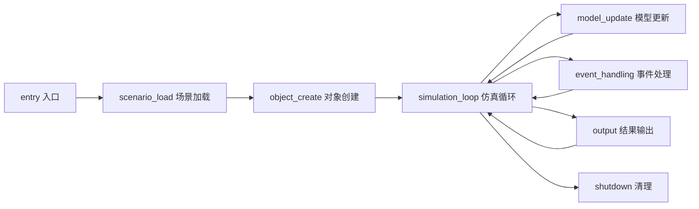

# AFSIM 仿真生命周期分析

> 生成日期：2026-06-22
> 阶段：Phase 6

## 生命周期总览

## 程序入口与初始化

| 属性 | 值 |
|------|-----|
| lifecycle_role | `entry` |
| 函数数量 | 0 |
| 关键类 | N/A |
| 主要状态对象 | N/A |
| 证据位置 | N/A |

**调用链**：

---

## 场景/配置加载

| 属性             | 值                                                                                                                   |
| -------------- | ------------------------------------------------------------------------------------------------------------------- |
| lifecycle_role | `scenario_load`                                                                                                     |
| 函数数量           | 1586                                                                                                                |
| 关键类            | N/A                                                                                                                 |
| 主要状态对象         | mName, mType, mRoot, mPath, mPointList                                                                              |
| 证据位置           | afsim-2_9/swdev/src/core/wsf/source/WsfExchange.hpp:41, afsim-2_9/swdev/src/core/wsf_parser/source/WsfParser.hpp:36 |

**调用链**：

1. **WsfExchange::Transactor::IsHookedToPayload**
   - 位置: afsim-2_9/swdev/src/core/wsf/source/WsfExchange.hpp:41
   - 调用: Accept → AlwaysHonorRate → BitNumberToCapability

2. **WsfParseError::FindSource**
   - 位置: afsim-2_9/swdev/src/core/wsf_parser/source/WsfParser.hpp:36
   - 调用: AddAuxiliaryValue → AddError → ClearErrors

3. **WsfParseError::GetWordsRead**
   - 位置: afsim-2_9/swdev/src/core/wsf_parser/source/WsfParser.hpp:36
   - 调用: AddAuxiliaryValue → AddError → ClearErrors

4. **WsfParseError::ReadWord**
   - 位置: afsim-2_9/swdev/src/core/wsf_parser/source/WsfParser.hpp:36
   - 调用: AddAuxiliaryValue → AddError → ClearErrors

5. **WsfParseError::ReadTerminator**
   - 位置: afsim-2_9/swdev/src/core/wsf_parser/source/WsfParser.hpp:36
   - 调用: AddAuxiliaryValue → AddError → ClearErrors

---

## 对象创建与注册

| 属性 | 值 |
|------|-----|
| lifecycle_role | `object_create` |
| 函数数量 | 5269 |
| 关键类 | N/A |
| 主要状态对象 | mCallbacks, mUi, mLastUpdateTime, mPlatformPtr, mUI |
| 证据位置 | afsim-2_9/swdev/src/core/wsf/source/WsfPlatformPart.hpp:61, afsim-2_9/swdev/src/core/wsf/source/WsfEM_Antenna.hpp:49, afsim-2_9/swdev/src/core/wsf/source/WsfPlatform.hpp:115 |

**调用链**：

1. **WsfEM_Antenna::Initialize**
   - 位置: afsim-2_9/swdev/src/core/wsf/source/WsfEM_Antenna.hpp:49
   - 调用: ComputeAspect → ComputeBeamAspect → ComputeBeamPosition

2. **WsfPlatformPart::PlatformAdded**
   - 位置: afsim-2_9/swdev/src/core/wsf/source/WsfPlatformPart.hpp:61
   - 调用: AddCategory → CanBeMadeNonOperational → CanBeMadeOperational

3. **ut::script::wsf::WsfPlatform::InitializeCreationTime**
   - 位置: afsim-2_9/swdev/src/core/wsf/source/WsfPlatform.hpp:115
   - 调用: AssignToSimulation → Clone → CloneComponent

4. **wsf::comm::router::medium::WsfScenario::CloneType**
   - 位置: afsim-2_9/swdev/src/core/wsf/source/WsfScenario.hpp:111
   - 调用: AddInputPlatform → AddInputProcessor → AddTypeList

5. **wsf::comm::router::event::CommAddedToLocal::Print**
   - 位置: afsim-2_9/swdev/src/core/wsf/source/WsfEventResults.hpp:34
   - 调用: BehaviorTreeNodeChildren → BehaviorTreeNodeExec → CommAddedToLocal

---

## 仿真主循环

| 属性 | 值 |
|------|-----|
| lifecycle_role | `simulation_loop` |
| 函数数量 | 782 |
| 关键类 | N/A |
| 主要状态对象 | mLastUpdateTime, mMutex, mDataValid, mPilotType, mOn |
| 证据位置 | afsim-2_9/swdev/src/core/wsf/source/WsfPlatform.hpp:115, afsim-2_9/swdev/src/core/wsf/source/WsfEM_Antenna.hpp:49, afsim-2_9/swdev/src/core/wsf/source/WsfSimulation.hpp:109 |

**调用链**：

1. **WsfEM_Antenna::UpdatePosition**
   - 位置: afsim-2_9/swdev/src/core/wsf/source/WsfEM_Antenna.hpp:49
   - 调用: ComputeAspect → ComputeBeamAspect → ComputeBeamPosition

2. **ut::script::wsf::WsfPlatform::GetLastUpdateTime**
   - 位置: afsim-2_9/swdev/src/core/wsf/source/WsfPlatform.hpp:115
   - 调用: AssignToSimulation → Clone → CloneComponent

3. **wsf::comm::WsfSimulation::AdvanceTime**
   - 位置: afsim-2_9/swdev/src/core/wsf/source/WsfSimulation.hpp:109
   - 调用: AddEvent → AddEventT → AddInputPlatforms

4. **wsf::comm::WsfSimulation::AdvanceTime**
   - 位置: afsim-2_9/swdev/src/core/wsf/source/WsfSimulation.hpp:109
   - 调用: AddEvent → AddEventT → AddInputPlatforms

5. **BT::WsfAdvancedBehaviorTreeNode::PreconditionValue**
   - 位置: afsim-2_9/swdev/src/core/wsf/source/WsfAdvancedBehaviorTreeNode.hpp:138
   - 调用: AddChild → AddTree → ChildStateMachine

---

## 模型更新与计算

| 属性 | 值 |
|------|-----|
| lifecycle_role | `model_update` |
| 函数数量 | 3886 |
| 关键类 | N/A |
| 主要状态对象 | mCallbacks, mType, mLastUpdateTime, mPlatformIndex, mPlatformPtr |
| 证据位置 | afsim-2_9/swdev/src/core/wsf/source/WsfPlatform.hpp:115, afsim-2_9/swdev/src/core/wsf/source/WsfEM_Antenna.hpp:49, afsim-2_9/swdev/src/core/wsf/source/WsfEventResults.hpp:34 |

**调用链**：

1. **WsfEM_Antenna::ProcessInput**
   - 位置: afsim-2_9/swdev/src/core/wsf/source/WsfEM_Antenna.hpp:49
   - 调用: ComputeAspect → ComputeBeamAspect → ComputeBeamPosition

2. **ut::script::wsf::WsfPlatform::SetUpdateLocked**
   - 位置: afsim-2_9/swdev/src/core/wsf/source/WsfPlatform.hpp:115
   - 调用: AssignToSimulation → Clone → CloneComponent

3. **wsf::comm::router::event::ExecuteCallback::GetPlatform**
   - 位置: afsim-2_9/swdev/src/core/wsf/source/WsfEventResults.hpp:34
   - 调用: BehaviorTreeNodeChildren → BehaviorTreeNodeExec → CommAddedToLocal

4. **wsf::comm::router::event::ExecuteCallback::GetCallback**
   - 位置: afsim-2_9/swdev/src/core/wsf/source/WsfEventResults.hpp:34
   - 调用: BehaviorTreeNodeChildren → BehaviorTreeNodeExec → CommAddedToLocal

5. **wsf::comm::router::event::LocalTrackUpdated::Print**
   - 位置: afsim-2_9/swdev/src/core/wsf/source/WsfEventResults.hpp:34
   - 调用: BehaviorTreeNodeChildren → BehaviorTreeNodeExec → CommAddedToLocal

---

## 事件处理与分发

| 属性 | 值 |
|------|-----|
| lifecycle_role | `event_handling` |
| 函数数量 | 13273 |
| 关键类 | N/A |
| 主要状态对象 | mCallbacks, mPlatformPtr, mUi, mSensorPtr, mValue |
| 证据位置 | afsim-2_9/swdev/src/core/wsf/source/WsfPlatform.hpp:115, afsim-2_9/swdev/src/core/wsf/source/WsfEventResults.hpp:34 |

**调用链**：

1. **ut::script::wsf::WsfPlatform::GetCreationTime**
   - 位置: afsim-2_9/swdev/src/core/wsf/source/WsfPlatform.hpp:115
   - 调用: AssignToSimulation → Clone → CloneComponent

2. **ut::script::wsf::WsfPlatform::SetCreationTime**
   - 位置: afsim-2_9/swdev/src/core/wsf/source/WsfPlatform.hpp:115
   - 调用: AssignToSimulation → Clone → CloneComponent

3. **wsf::comm::router::event::Comment::GetPlatform**
   - 位置: afsim-2_9/swdev/src/core/wsf/source/WsfEventResults.hpp:34
   - 调用: BehaviorTreeNodeChildren → BehaviorTreeNodeExec → CommAddedToLocal

4. **wsf::comm::router::event::Comment::GetComment**
   - 位置: afsim-2_9/swdev/src/core/wsf/source/WsfEventResults.hpp:34
   - 调用: BehaviorTreeNodeChildren → BehaviorTreeNodeExec → CommAddedToLocal

5. **wsf::comm::router::event::CommRemovedFromLocal::Print**
   - 位置: afsim-2_9/swdev/src/core/wsf/source/WsfEventResults.hpp:34
   - 调用: BehaviorTreeNodeChildren → BehaviorTreeNodeExec → CommAddedToLocal

---

## 结果输出与可视化

| 属性 | 值 |
|------|-----|
| lifecycle_role | `output` |
| 函数数量 | 1730 |
| 关键类 | N/A |
| 主要状态对象 | mUi, mData, mUI, mCallbacks, mTypes |
| 证据位置 | afsim-2_9/swdev/src/core/wsf_mil/source/weapon/WsfBallisticMissileLaunchComputer.hpp:40, afsim-2_9/swdev/src/core/wsf/source/mover/WsfWaypoint.hpp:57, afsim-2_9/swdev/src/core/wsf/source/dis/WsfDisInterface.hpp:83 |

**调用链**：

1. **WsfWaypoint::Print**
   - 位置: afsim-2_9/swdev/src/core/wsf/source/mover/WsfWaypoint.hpp:57
   - 调用: A → Clone → CreateScriptClass

2. **wsf::comm::WsfDisInterface::HasOutputDevice**
   - 位置: afsim-2_9/swdev/src/core/wsf/source/dis/WsfDisInterface.hpp:83
   - 调用: ActivateConnection → ActivateDeferredConnectionEvent → AddCallbacks

3. **SA_Table::PrintRangeLine**
   - 位置: afsim-2_9/swdev/src/core/wsf_mil/source/weapon/WsfBallisticMissileLaunchComputer.hpp:40
   - 调用: BallisticModel → BaseTypeName → CheckForInterceptOnRangeLine

4. **ObjectTest::GetDraw**
   - 位置: afsim-2_9/swdev/src/core/wsf_mil/source/processor/WsfImageProcessor.hpp:28
   - 调用: ClearStateList → Clone → CoastTimeExceeded

5. **wizard::Project::SaveAll**
   - 位置: afsim-2_9/swdev/src/wizard/lib/source/core/Project.hpp:66
   - 调用: AddComponent → AddProjectDirectory → AddProjectDirectoryBrowse

---

## 资源释放与清理

| 属性 | 值 |
|------|-----|
| lifecycle_role | `shutdown` |
| 函数数量 | 2257 |
| 关键类 | N/A |
| 主要状态对象 | mCallbacks, mInterfacePtr, mUi, mName, mType |
| 证据位置 | afsim-2_9/swdev/src/core/wsf/source/WsfPlatformPart.hpp:61, afsim-2_9/swdev/src/core/wsf/source/WsfEM_Antenna.hpp:49, afsim-2_9/swdev/src/core/wsf/source/mover/WsfRouteNetwork.hpp:40 |

**调用链**：

1. **WsfEM_Antenna::~WsfEM_Antenna**
   - 位置: afsim-2_9/swdev/src/core/wsf/source/WsfEM_Antenna.hpp:49
   - 调用: ComputeAspect → ComputeBeamAspect → ComputeBeamPosition

2. **WsfPlatformPart::PlatformDeleted**
   - 位置: afsim-2_9/swdev/src/core/wsf/source/WsfPlatformPart.hpp:61
   - 调用: AddCategory → CanBeMadeNonOperational → CanBeMadeOperational

3. **WsfRouteNetwork::~WsfRouteNetwork**
   - 位置: afsim-2_9/swdev/src/core/wsf/source/mover/WsfRouteNetwork.hpp:40
   - 调用: Add → Append → AppendShortestPathOnNetwork

4. **WsfPathGuidance::~WsfPathGuidance**
   - 位置: afsim-2_9/swdev/src/core/wsf/source/mover/WsfPathGuidance.hpp:39
   - 调用: AltIsSet → AxialAccelIsSet → BeginExtrapolation

5. **std::WsfRoute::~WsfRoute**
   - 位置: afsim-2_9/swdev/src/core/wsf/source/mover/WsfRoute.hpp:40
   - 调用: Append → AppendSubroute → Begin

---

## 阶段统计

| 阶段 | lifecycle_role | 函数数 | 占比 |
|------|---------------|--------|------|
| 程序入口与初始化 | `entry` | 0 | 0.0% |
| 场景/配置加载 | `scenario_load` | 1586 | 5.5% |
| 对象创建与注册 | `object_create` | 5269 | 18.3% |
| 仿真主循环 | `simulation_loop` | 782 | 2.7% |
| 模型更新与计算 | `model_update` | 3886 | 13.5% |
| 事件处理与分发 | `event_handling` | 13273 | 46.1% |
| 结果输出与可视化 | `output` | 1730 | 6.0% |
| 资源释放与清理 | `shutdown` | 2257 | 7.8% |
| **总计** | | **28783** | 100% |
