# AFSIM 模块依赖关系说明

> **状态**：已完成
> **日期**：2026-06-22
> **索引证据**：dependency-index.jsonl（52,996 条）, symbol-index.jsonl, function-index.jsonl
> **关联文档**：dependency-graph.md, afsim-architecture.md

---

## 0. 文档说明

本文档描述 AFSIM 仿真框架中模块间的所有依赖关系，包括：
- 构建依赖（CMake target_link_libraries）
- 架构级依赖（继承 inheritance、组合 composition、调用 call、包含 include）
- 子系统间依赖
- 关键全局常量依赖

每条 Mermaid 边均可追溯到 dependency-index.jsonl 中的具体条目。

---

## 1. 构建依赖

```mermaid
graph TD
  Build0[${PROJECT_NAME}] --> Build_0[afsim-2_9/training/developer/c]
  Build1[${PROJECT_NAME}] --> Build_1[${WSF_LIBS}]
  Build2[${PROJECT_NAME}] --> Build_2[libAFSIM_Mover]
  Build3[${PROJECT_NAME}] --> Build_3[mclmcrrt]
  Build4[${PROJECT_NAME}] --> Build_4[afsim-2_9/training/developer/c]
  Build5[${PROJECT_NAME}] --> Build_5[${WSF_LIBS}]
  Build6[${PROJECT_NAME}] --> Build_6[wsf_mil]
  Build7[${PROJECT_NAME}] --> Build_7[afsim-2_9/training/developer/c]
  Build8[${PROJECT_NAME}] --> Build_8[${WSF_LIBS}]
  Build9[${PROJECT_NAME}] --> Build_9[afsim-2_9/training/developer/c]
  Build10[${PROJECT_NAME}] --> Build_10[util]
  Build11[${PROJECT_NAME}] --> Build_11[genio]
  Build12[${PROJECT_NAME}] --> Build_12[afsim-2_9/training/developer/c]
  Build13[${PROJECT_NAME}] --> Build_13[${WSF_LIBS}]
  Build14[${PROJECT_NAME}] --> Build_14[afsim-2_9/training/developer/c]

```

| 源模块             | 依赖模块                                     | 证据                                                           |
| --------------- | ---------------------------------------- | ------------------------------------------------------------ |
| ${PROJECT_NAME} | afsim-2_9/training/developer/core/labs/s | add_library(${PROJECT_NAME} ${SRCS})                         |
| ${PROJECT_NAME} | ${WSF_LIBS}                              | target_link_libraries(${PROJECT_NAME} ${WSF_LIBS} libAFSIM_M |
| ${PROJECT_NAME} | libAFSIM_Mover                           | target_link_libraries(${PROJECT_NAME} ${WSF_LIBS} libAFSIM_M |
| ${PROJECT_NAME} | mclmcrrt                                 | target_link_libraries(${PROJECT_NAME} ${WSF_LIBS} libAFSIM_M |
| ${PROJECT_NAME} | afsim-2_9/training/developer/core/labs/s | add_library(${PROJECT_NAME} ${SRCS})                         |
| ${PROJECT_NAME} | ${WSF_LIBS}                              | target_link_libraries(${PROJECT_NAME} ${WSF_LIBS} wsf_mil)   |
| ${PROJECT_NAME} | wsf_mil                                  | target_link_libraries(${PROJECT_NAME} ${WSF_LIBS} wsf_mil)   |
| ${PROJECT_NAME} | afsim-2_9/training/developer/core/labs/s | add_library(${PROJECT_NAME} ${SRCS})                         |
| ${PROJECT_NAME} | ${WSF_LIBS}                              | target_link_libraries(${PROJECT_NAME} ${WSF_LIBS})           |
| ${PROJECT_NAME} | afsim-2_9/training/developer/core/labs/s | add_executable(${PROJECT_NAME} ${SRCS})                      |
| ${PROJECT_NAME} | util                                     | target_link_libraries(${PROJECT_NAME} util genio)            |
| ${PROJECT_NAME} | genio                                    | target_link_libraries(${PROJECT_NAME} util genio)            |
| ${PROJECT_NAME} | afsim-2_9/training/developer/core/labs/s | add_library(${PROJECT_NAME} ${SRCS})                         |
| ${PROJECT_NAME} | ${WSF_LIBS}                              | target_link_libraries(${PROJECT_NAME} ${WSF_LIBS})           |
| ${PROJECT_NAME} | afsim-2_9/training/developer/core/labs/s | add_library(${PROJECT_NAME} ${SRCS})                         |
| ${PROJECT_NAME} | ${WSF_LIBS}                              | target_link_libraries(${PROJECT_NAME} ${WSF_LIBS})           |
| ${PROJECT_NAME} | afsim-2_9/training/developer/core/labs/s | add_executable(${PROJECT_NAME} ${SRCS} ${UI_HEADERS})        |
| ${PROJECT_NAME} | ${WSF_LIBS}                              | target_link_libraries(${PROJECT_NAME} ${WSF_LIBS} Qt5::Core  |
| ${PROJECT_NAME} | Qt5::Core                                | target_link_libraries(${PROJECT_NAME} ${WSF_LIBS} Qt5::Core  |
| ${PROJECT_NAME} | Qt5::Gui                                 | target_link_libraries(${PROJECT_NAME} ${WSF_LIBS} Qt5::Core  |


---

## 2. 架构级依赖

### 2.1 继承关系（总计 3908 条）

| 源（子类）                               | 目标（基类）                    | 说明                            |
| ----------------------------------- | ------------------------- | ----------------------------- |
| WsfEM_Antenna                       | UtScriptAccessible        | 继承自 UtScriptAccessible        |
| WsfEM_Antenna                       | WsfSinglePlatformObserver | 继承自 WsfSinglePlatformObserver |
| WsfFusionStrategy                   | WsfObject                 | 继承自 WsfObject                 |
| WsfGroup                            | WsfObject                 | 继承自 WsfObject                 |
| WsfGroup                            | WsfAuxDataEnabled         | 继承自 WsfAuxDataEnabled         |
| SimulationUpdateThread              | WsfThread                 | 继承自 WsfThread                 |
| WsfPlatformPart                     | WsfObject                 | 继承自 WsfObject                 |
| WsfPlatformPart                     | WsfPlatformComponent      | 继承自 WsfPlatformComponent      |
| WsfPlatformPart                     | WsfUniqueId               | 继承自 WsfUniqueId               |
| WsfPlatformPart                     | WsfAuxDataEnabled         | 继承自 WsfAuxDataEnabled         |
| WsfSolarIlluminationComponent       | WsfSensorComponent        | 继承自 WsfSensorComponent        |
| WsfBehaviorTreeNode                 | WsfObject                 | 继承自 WsfObject                 |
| WsfBehaviorTreeNodeTypes            | WsfObjectTypeList         | 继承自 WsfObjectTypeList         |
| WsfBehaviorTreeLeafNode             | enum RunType              | 继承自 enum RunType              |
| WsfScriptBehaviorTreeNodeClass      | WsfScriptObjectClass      | 继承自 WsfScriptObjectClass      |
| WsfBehaviorTreeSequenceNode         | enum RunType              | 继承自 enum RunType              |
| WsfBehaviorTreeSelectorNode         | enum RunType              | 继承自 enum RunType              |
| WsfBehaviorTreeParallelNode         | enum RunType              | 继承自 enum RunType              |
| WsfBehaviorTreePrioritySelectorNode | enum RunType              | 继承自 enum RunType              |
| WsfBehaviorTreeWeightedRandomNode   | enum RunType              | 继承自 enum RunType              |
| WsfNetworkInterface                 | WsfNetworkInterfaceInput  | 继承自 WsfNetworkInterfaceInput  |
| NetworkUpdateEvent                  | WsfEvent                  | 继承自 WsfEvent                  |
| WsfTrackReportingStrategy           | WsfObject                 | 继承自 WsfObject                 |
| WsfMaskingPattern                   | WsfUncloneableObject      | 继承自 WsfUncloneableObject      |
| WsfAntennaPatternTypes              | WsfObjectTypeList         | 继承自 WsfObjectTypeList         |
| WsfTrackNotifyMessage               | WsfMessage                | 继承自 WsfMessage                |
| Result                              | ResultBase                | 继承自 ResultBase                |
| SubscriberBase                      | SubscriberBase            | 继承自 SubscriberBase            |
| ConsoleSubscriber                   | SubscriberBase            | 继承自 SubscriberBase            |
| FileSubscriber                      | SubscriberBase            | 继承自 SubscriberBase            |


### 2.2 组合关系（总计 10402 条）

组合关系通过类的成员变量持有其他类实例来建立。核心组合包括：
- `std::unique_ptr<T>`（独占所有权）
- `std::shared_ptr<T>`（共享所有权）
- 值类型成员（强组合）

| 源（持有者类）               | 目标（被持有类）              | 持有类型   |
| --------------------- | --------------------- | ------ |
| WsfVisualization      | WsfPlatform           | medium |
| WsfVisualization      | WsfVisualization      | medium |
| WsfVisualization      | BehaviorMap           | strong |
| Behavior              | WsfPlatform           | medium |
| WsfEM_Antenna         | WsfArticulatedPart    | medium |
| WsfEM_Antenna         | EBS_Mode              | strong |
| WsfEM_Antenna         | ScanMode              | strong |
| WsfEM_Antenna         | ScanStabilization     | strong |
| WsfEM_Antenna         | WsfFieldOfView        | medium |
| WsfFusionStrategy     | FusionStrategyTypes   | medium |
| WsfFusionStrategy     | WsfTrackManager       | medium |
| WsfFusionStrategy     | WsfProcessor          | medium |
| WsfGroup              | MemberList            | strong |
| WsfMultiThreadManager | WsfSensor             | medium |
| WsfMultiThreadManager | WsfMultiThreadManager | medium |
| WsfMultiThreadManager | WsfMultiThreadManager | medium |
| WsfMultiThreadManager | WsfSimulation         | medium |
| WsfMultiThreadManager | PlatformElement       | strong |
| WsfMultiThreadManager | SensorElement         | strong |
| WsfMultiThreadManager | WsfThreadPool         | medium |


### 2.3 调用关系（总计 28095 条）

| 源（调用方）   | 目标（被调用方）          | 说明   |
| -------- | ----------------- | ---- |
| Behavior | Behavior          | 方法调用 |
| Behavior | CreateScriptClass | 方法调用 |
| Behavior | Destroy           | 方法调用 |
| Behavior | GetBehavior       | 方法调用 |
| Behavior | GetBehaviors      | 方法调用 |
| Behavior | GetInstance       | 方法调用 |
| Behavior | SetBehavior       | 方法调用 |
| Behavior | void              | 方法调用 |
| void     | Behavior          | 方法调用 |
| void     | CreateScriptClass | 方法调用 |
| void     | Destroy           | 方法调用 |
| void     | GetBehavior       | 方法调用 |
| void     | GetBehaviors      | 方法调用 |
| void     | GetInstance       | 方法调用 |
| void     | SetBehavior       | 方法调用 |
| void     | void              | 方法调用 |
| void     | Behavior          | 方法调用 |
| void     | CreateScriptClass | 方法调用 |
| void     | Destroy           | 方法调用 |
| void     | GetBehavior       | 方法调用 |


---

## 3. 子系统间依赖

```mermaid
graph TD
  Sub0[AcoImporter] --> Sub0_PostProcessor
  Sub1[AirTrafficEvent] --> Sub1_other
  Sub2[Annotation] --> Sub2_other
  Sub3[AnnotationData] --> Sub3_other
  Sub4[BT] --> Sub4_other
  Sub5[Chat] --> Sub5_other
  Sub6[ColorUtils] --> Sub6_PostProcessor
  Sub7[CommandChain] --> Sub7_other
  Sub8[CoverageOverlay] --> Sub8_other
  Sub9[CrdImporter] --> Sub9_other
  Sub10[DemoBrowser] --> Sub10_other
  Sub11[Designer] --> Sub11_other
  Sub12[DisEnum] --> Sub12_other
  Sub13[ElevationMode] --> Sub13_other
  Sub14[Engage] --> Sub14_other
  Sub15[ErrorList] --> Sub15_PostProcessor
  Sub16[ExclusionMode] --> Sub16_other
  Sub17[ExitLoiterEvent] --> Sub17_other
  Sub18[Fires] --> Sub18_other
  Sub19[HDD] --> Sub19_other

```



### 3.1 核心仿真子系统 (wsf)

| 源   | 目标          | 依赖数  | 关系       |
| --- | ----------- | ---- | -------- |
| wsf | other       | 8912 | 继承/组合/调用 |
| wsf | WsfObserver | 49   | 继承/组合/调用 |
| wsf | rv          | 35   | 继承/组合/调用 |
| wsf | WsfPrivate  | 11   | 继承/组合/调用 |
| wsf | WsfExchange | 7    | 继承/组合/调用 |
| wsf | Chat        | 5    | 继承/组合/调用 |
| wsf | WsfPath     | 3    | 继承/组合/调用 |
| wsf | GraphImpl   | 3    | 继承/组合/调用 |
| wsf | Messages    | 3    | 继承/组合/调用 |
| wsf | ut          | 2    | 继承/组合/调用 |


### 3.2 太空仿真子系统 (wsf_space)

| 源 | 目标 | 依赖数 | 关系 |
|----|------|--------|------|


---

## 4. 关键全局常量依赖

| 常量                              | 定义位置                                                                                                          | 说明                                  |
| ------------------------------- | ------------------------------------------------------------------------------------------------------------- | ----------------------------------- |
| NOMINMAX                        | afsim-2_9/training/developer/core/labs/solution/mover/source/MATLABBallisticMover.hpp:19                      | 宏常量 NOMINMAX                        |
| __libAFSIM_Mover_h              | afsim-2_9/training/developer/core/labs/solution/mover/MATLAB_mover/lib/libAFSIM_Mover.h:18                    | 宏常量 __libAFSIM_Mover_h              |
| PUBLIC_libAFSIM_Mover_C_API     | afsim-2_9/training/developer/core/labs/solution/mover/MATLAB_mover/lib/libAFSIM_Mover.h:38                    | 宏常量 PUBLIC_libAFSIM_Mover_C_API     |
| LIB_libAFSIM_Mover_C_API        | afsim-2_9/training/developer/core/labs/solution/mover/MATLAB_mover/lib/libAFSIM_Mover.h:43                    | 宏常量 LIB_libAFSIM_Mover_C_API        |
| PUBLIC_libAFSIM_Mover_CPP_API   | afsim-2_9/training/developer/core/labs/solution/mover/MATLAB_mover/lib/libAFSIM_Mover.h:106                   | 宏常量 PUBLIC_libAFSIM_Mover_CPP_API   |
| LIB_libAFSIM_Mover_CPP_API      | afsim-2_9/training/developer/core/labs/solution/mover/MATLAB_mover/lib/libAFSIM_Mover.h:111                   | 宏常量 LIB_libAFSIM_Mover_CPP_API      |
| FLIGHT_CONTROLLER_INTERFACE     | afsim-2_9/training/developer/core/labs/solution/xio/flight_controller/source/FlightControllerInterface.hpp:16 | 宏常量 FLIGHT_CONTROLLER_INTERFACE     |
| FLIGHT_CONTROLLER_WIDGET        | afsim-2_9/training/developer/core/labs/solution/xio/flight_controller/source/FlightControllerWidget.hpp:16    | 宏常量 FLIGHT_CONTROLLER_WIDGET        |
| GENIO_LIT_ENDIAN                | afsim-2_9/swdev/src/tools/genio/source/GenIODefs.hpp:24                                                       | 宏常量 GENIO_LIT_ENDIAN                |
| GENIO_UINT64                    | afsim-2_9/swdev/src/tools/genio/source/GenIODefs.hpp:28                                                       | 宏常量 GENIO_UINT64                    |
| GENIO_INT64                     | afsim-2_9/swdev/src/tools/genio/source/GenIODefs.hpp:32                                                       | 宏常量 GENIO_INT64                     |
| GENIO_LONG64                    | afsim-2_9/swdev/src/tools/genio/source/GenIODefs.hpp:43                                                       | 宏常量 GENIO_LONG64                    |
| GENIO_BIG_ENDIAN                | afsim-2_9/swdev/src/tools/genio/source/GenIODefs.hpp:64                                                       | 宏常量 GENIO_BIG_ENDIAN                |
| GENIO_VAX_D_FLOAT               | afsim-2_9/swdev/src/tools/genio/source/GenIODefs.hpp:150                                                      | 宏常量 GENIO_VAX_D_FLOAT               |
| GENIO_VAX_G_FLOAT               | afsim-2_9/swdev/src/tools/genio/source/GenIODefs.hpp:156                                                      | 宏常量 GENIO_VAX_G_FLOAT               |
| GEN_UMP_IO_SERVER_CC_IS_DEFINED | afsim-2_9/swdev/src/tools/genio/source/GenUmpIOServerCC.hpp:13                                                | 宏常量 GEN_UMP_IO_SERVER_CC_IS_DEFINED |
| UT_SCRIPT_CONSTEXPR             | afsim-2_9/swdev/src/tools/util_script/source/UtScriptMethodDefine.hpp:156                                     | 宏常量 UT_SCRIPT_CONSTEXPR             |


---

## 5. 依赖强度说明

| 强度            | 含义            | 示例 relation                                  |
| ------------- | ------------- | -------------------------------------------- |
| **strong（强）** | 编译期依赖，缺少则编译失败 | inheritance, include, build, 值类型 composition |
| **medium（中）** | 逻辑依赖，运行时通常需要  | call（虚函数调用）, 指针类型 composition                |
| **weak（弱）**   | 松耦合，特定场景使用    | registration, configuration, test            |

---

## 6. 依赖统计汇总

| Relation（关系类型） | 条目数 | 占比 |
|---------------------|--------|------|
| build | 298 | 0.6% |
| inheritance | 3908 | 7.4% |
| composition | 10402 | 19.6% |
| call | 28095 | 53.0% |
| include | 8736 | 16.5% |
| registration | 1557 | 2.9% |
| **总计** | **52996** | 100% |
