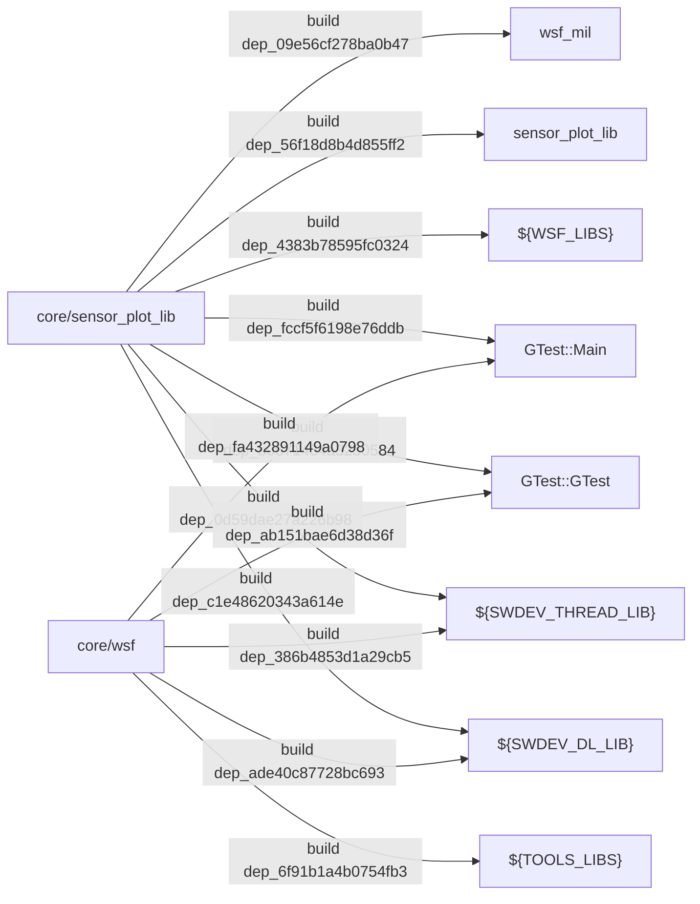
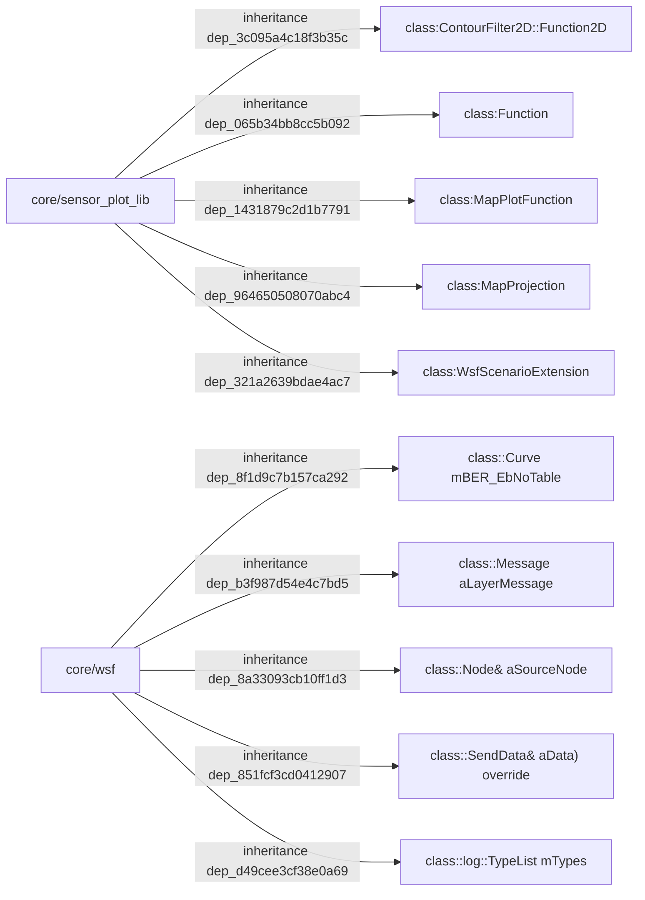
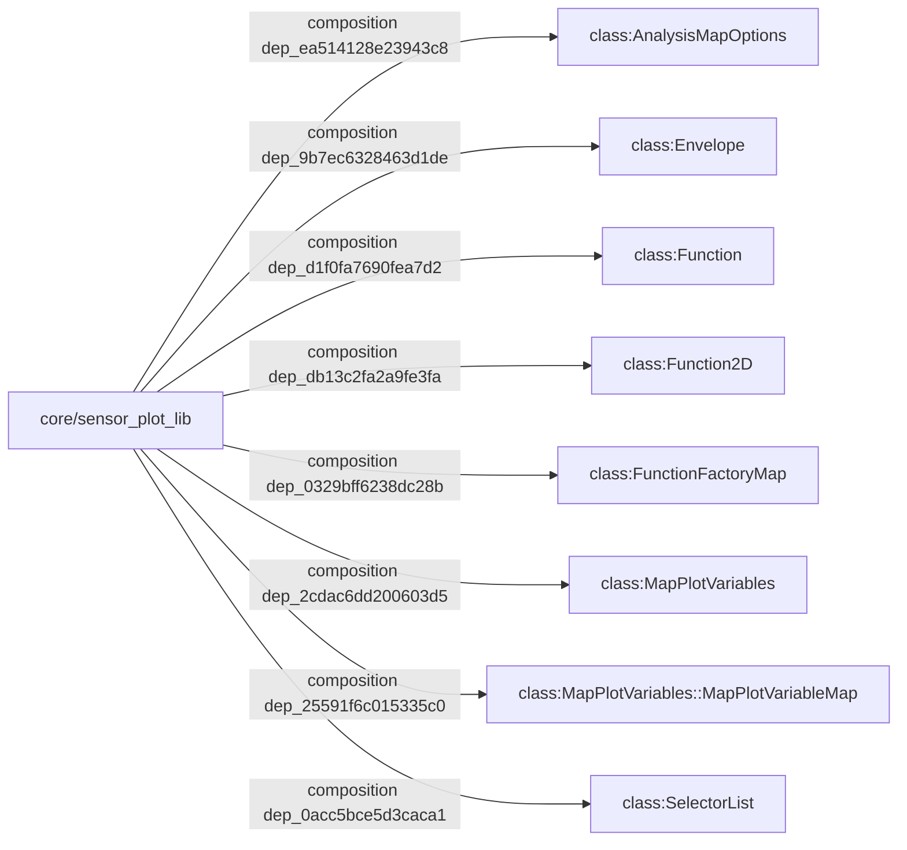
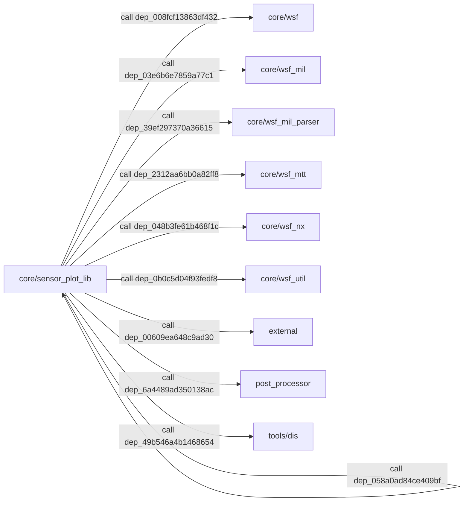
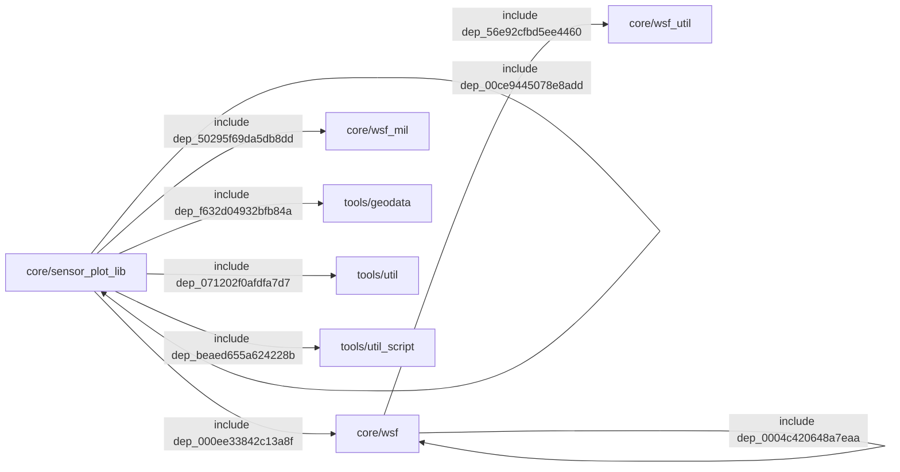
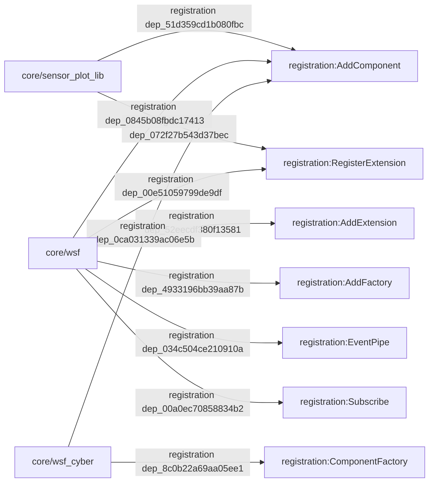

# AFSIM 模块依赖说明

> **状态**：已完成
> **日期**：2026-07-16
> **证据来源**：`workspace/source-index/dependency-index.jsonl`

## 0. 文档说明

本文汇总构建依赖、继承、组合、调用、包含和注册依赖。Mermaid 图中的每条边标签均包含 `dependency_id`，可在 `dependency-index.jsonl` 中回查。

依赖关系统计：build=280，inheritance=5102，composition=13083，call=179465，include=74737，registration=683。

## 1. 构建依赖

| dependency_id | 源模块 | 目标模块 | 关系 | 强度 | 证据 |
|---|---|---|---|---|---|
| `dep_c1e48620343a614e` | `core/sensor_plot_lib` | `${SWDEV_DL_LIB}` | `build` | `strong` | CMake 目标 sensor_plot_lib_test 链接 ${SWDEV_DL_LIB} |
| `dep_0d59dae27a226b98` | `core/sensor_plot_lib` | `${SWDEV_THREAD_LIB}` | `build` | `strong` | CMake 目标 sensor_plot_lib_test 链接 ${SWDEV_THREAD_LIB} |
| `dep_4383b78595fc0324` | `core/sensor_plot_lib` | `${WSF_LIBS}` | `build` | `strong` | CMake 目标 sensor_plot_lib_test 链接 ${WSF_LIBS} |
| `dep_b0671464a3250584` | `core/sensor_plot_lib` | `GTest::GTest` | `build` | `strong` | CMake 目标 sensor_plot_lib_test 链接 GTest::GTest |
| `dep_fccf5f6198e76ddb` | `core/sensor_plot_lib` | `GTest::Main` | `build` | `strong` | CMake 目标 sensor_plot_lib_test 链接 GTest::Main |
| `dep_56f18d8b4d855ff2` | `core/sensor_plot_lib` | `sensor_plot_lib` | `build` | `strong` | CMake 目标 sensor_plot_lib_test 链接 sensor_plot_lib |
| `dep_09e56cf278ba0b47` | `core/sensor_plot_lib` | `wsf_mil` | `build` | `strong` | CMake 目标 ${PROJECT_NAME} 链接 wsf_mil |
| `dep_ade40c87728bc693` | `core/wsf` | `${SWDEV_DL_LIB}` | `build` | `strong` | CMake 目标 core_test 链接 ${SWDEV_DL_LIB} |
| `dep_386b4853d1a29cb5` | `core/wsf` | `${SWDEV_THREAD_LIB}` | `build` | `strong` | CMake 目标 core_test 链接 ${SWDEV_THREAD_LIB} |
| `dep_6f91b1a4b0754fb3` | `core/wsf` | `${TOOLS_LIBS}` | `build` | `strong` | CMake 目标 ${PROJECT_NAME} 链接 ${TOOLS_LIBS} |
| `dep_ab151bae6d38d36f` | `core/wsf` | `GTest::GTest` | `build` | `strong` | CMake 目标 core_test 链接 GTest::GTest |
| `dep_fa432891149a0798` | `core/wsf` | `GTest::Main` | `build` | `strong` | CMake 目标 core_test 链接 GTest::Main |

## 2. 架构级依赖（继承、组合、调用）

### 2.1 继承依赖

| dependency_id | 源模块 | 目标模块 | 关系 | 强度 | 证据 |
|---|---|---|---|---|---|
| `dep_3c095a4c18f3b35c` | `core/sensor_plot_lib` | `class:ContourFilter2D::Function2D` | `inheritance` | `strong` | ContourFunction 继承 ContourFilter2D::Function2D |
| `dep_065b34bb8cc5b092` | `core/sensor_plot_lib` | `class:Function` | `inheritance` | `strong` | AntennaPlotFunction 继承 Function |
| `dep_1431879c2d1b7791` | `core/sensor_plot_lib` | `class:MapPlotFunction` | `inheritance` | `strong` | SphericalMapFunction 继承 MapPlotFunction |
| `dep_964650508070abc4` | `core/sensor_plot_lib` | `class:MapProjection` | `inheritance` | `strong` | SupTMProjection 继承 MapProjection |
| `dep_321a2639bdae4ac7` | `core/sensor_plot_lib` | `class:WsfScenarioExtension` | `inheritance` | `strong` | WsfSensorPlotExtension 继承 WsfScenarioExtension |
| `dep_8f1d9c7b157ca292` | `core/wsf` | `class::Curve mBER_EbNoTable` | `inheritance` | `strong` | ScriptMediumModeUnguidedClass 继承 :Curve mBER_EbNoTable |
| `dep_b3f987d54e4c7bd5` | `core/wsf` | `class::Message aLayerMessage` | `inheritance` | `strong` | NetworkLayerMessageHeader 继承 :Message aLayerMessage |
| `dep_8a33093cb10ff1d3` | `core/wsf` | `class::Node& aSourceNode` | `inheritance` | `strong` | EdgeWeight 继承 :Node& aSourceNode |
| `dep_851fcf3cd0412907` | `core/wsf` | `class::SendData& aData) override` | `inheritance` | `strong` | RouteData 继承 :SendData& aData) override |
| `dep_d49cee3cf38e0a69` | `core/wsf` | `class::log::TypeList mTypes` | `inheritance` | `strong` | SubscriberBase 继承 :log::TypeList mTypes |

### 2.2 组合依赖

| dependency_id | 源模块 | 目标模块 | 关系 | 强度 | 证据 |
|---|---|---|---|---|---|
| `dep_ea514128e23943c8` | `core/sensor_plot_lib` | `class:AnalysisMapOptions` | `composition` | `strong` | HorizontalMapFunction 通过成员变量持有 AnalysisMapOptions |
| `dep_9b7ec6328463d1de` | `core/sensor_plot_lib` | `class:Envelope` | `composition` | `strong` | ClutterTableFunction 通过成员变量持有 Envelope |
| `dep_d1f0fa7690fea7d2` | `core/sensor_plot_lib` | `class:Function` | `composition` | `medium` | WsfSensorPlotExtension 通过成员变量持有 Function |
| `dep_db13c2fa2a9fe3fa` | `core/sensor_plot_lib` | `class:Function2D` | `composition` | `medium` | ContourFilter2D 通过成员变量持有 Function2D |
| `dep_0329bff6238dc28b` | `core/sensor_plot_lib` | `class:FunctionFactoryMap` | `composition` | `strong` | WsfSensorPlotExtension 通过成员变量持有 FunctionFactoryMap |
| `dep_2cdac6dd200603d5` | `core/sensor_plot_lib` | `class:MapPlotVariables` | `composition` | `strong` | MapPlotFunction 通过成员变量持有 MapPlotVariables |
| `dep_25591f6c015335c0` | `core/sensor_plot_lib` | `class:MapPlotVariables::MapPlotVariableMap` | `composition` | `strong` | WsfSensorPlotExtension 通过成员变量持有 MapPlotVariables::MapPlotVariableMap |
| `dep_0acc5bce5d3caca1` | `core/sensor_plot_lib` | `class:SelectorList` | `composition` | `strong` | HorizontalMapFunction 通过成员变量持有 SelectorList |

### 2.3 调用依赖

| dependency_id | 源模块 | 目标模块 | 关系 | 强度 | 证据 |
|---|---|---|---|---|---|
| `dep_058a0ad84ce409bf` | `core/sensor_plot_lib` | `core/sensor_plot_lib` | `call` | `medium` | VerticalMapFunction::VerticalMapFunction#ff899c0549 调用 MapPlotFunction |
| `dep_008fcf13863df432` | `core/sensor_plot_lib` | `core/wsf` | `call` | `medium` | Function::Function#b5ea87565b 调用 SetDefaultAvailability |
| `dep_03e6b6e7859a77c1` | `core/sensor_plot_lib` | `core/wsf_mil` | `call` | `medium` | VerticalMapFunction::ProcessInput#a297210d8b 调用 ValueGreater |
| `dep_39ef297370a36615` | `core/sensor_plot_lib` | `core/wsf_mil_parser` | `call` | `medium` | HorizontalMapFunction::InitializeSensorPlatforms#b952c2c7d5 调用 platforms |
| `dep_2312aa6bb0a82ff8` | `core/sensor_plot_lib` | `core/wsf_mtt` | `call` | `medium` | Sensor::ConvertWCS_ToRBA#f6f9439e9f 调用 ConvertWCSToNED |
| `dep_048b3fe61b468f1c` | `core/sensor_plot_lib` | `core/wsf_nx` | `call` | `medium` | HorizontalMapFunction::ProcessInput#a297210d8b 调用 ReadLine |
| `dep_0b0c5d04f93fedf8` | `core/sensor_plot_lib` | `core/wsf_util` | `call` | `medium` | WsfSensorPlotExtension::ProcessInput#a297210d8b 调用 push_back |
| `dep_00609ea648c9ad30` | `core/sensor_plot_lib` | `external` | `call` | `weak` | HorizontalMapFunction::GetPdMapFileJsonMetadata#bb57a9dde2 调用 json |
| `dep_6a4489ad350138ac` | `core/sensor_plot_lib` | `post_processor` | `call` | `medium` | Function::Execute#00f2656564 调用 Connect |
| `dep_49b546a4b1468654` | `core/sensor_plot_lib` | `tools/dis` | `call` | `medium` | Sensor::CreateAndInitialize#a49a527240 调用 GetLocation |

## 3. 子系统间依赖

### 3.1 包含关系

| dependency_id | 源模块 | 目标模块 | 关系 | 强度 | 证据 |
|---|---|---|---|---|---|
| `dep_00ce9445078e8add` | `core/sensor_plot_lib` | `core/sensor_plot_lib` | `include` | `strong` | afsim-2_9/swdev/src/core/sensor_plot_lib/source/ContourFilter2D.cpp include ContourFilter2D.hpp |
| `dep_000ee33842c13a8f` | `core/sensor_plot_lib` | `core/wsf` | `include` | `strong` | afsim-2_9/swdev/src/core/sensor_plot_lib/source/RadarEnvelopeFunction.cpp include WsfStandardRadarS… |
| `dep_50295f69da5db8dd` | `core/sensor_plot_lib` | `core/wsf_mil` | `include` | `strong` | afsim-2_9/swdev/src/core/sensor_plot_lib/source/AntennaPlotFunction.cpp include WsfESA_AntennaPatte… |
| `dep_f632d04932bfb84a` | `core/sensor_plot_lib` | `tools/geodata` | `include` | `strong` | afsim-2_9/swdev/src/core/sensor_plot_lib/source/HorizontalMapFunction.cpp include GeoShapeFile.hpp |
| `dep_071202f0afdfa7d7` | `core/sensor_plot_lib` | `tools/util` | `include` | `strong` | afsim-2_9/swdev/src/core/sensor_plot_lib/test/test_mapplotvariables.cpp include UtInput.hpp |
| `dep_beaed655a624228b` | `core/sensor_plot_lib` | `tools/util_script` | `include` | `strong` | afsim-2_9/swdev/src/core/sensor_plot_lib/source/MapPlotVariables.cpp include UtScriptDataPack.hpp |
| `dep_0004c420648a7eaa` | `core/wsf` | `core/wsf` | `include` | `strong` | afsim-2_9/swdev/src/core/wsf/source/sensor/WsfSensorTracker.cpp include WsfPlatform.hpp |
| `dep_56e92cfbd5ee4460` | `core/wsf` | `core/wsf_util` | `include` | `strong` | afsim-2_9/swdev/src/core/wsf/source/event_pipe/WsfEventPipeInterface.cpp include Utml.hpp |

### 3.2 注册关系

| dependency_id | 源模块 | 目标模块 | 关系 | 强度 | 证据 |
|---|---|---|---|---|---|
| `dep_51d359cd1b080fbc` | `core/sensor_plot_lib` | `registration:AddComponent` | `registration` | `weak` | afsim-2_9/swdev/src/core/sensor_plot_lib/source/MapPlotVariables.cpp 使用 AddComponent 注册/订阅扩展点 |
| `dep_072f27b543d37bec` | `core/sensor_plot_lib` | `registration:RegisterExtension` | `registration` | `weak` | afsim-2_9/swdev/src/core/sensor_plot_lib/source/WsfSensorPlot.cpp 使用 RegisterExtension 注册/订阅扩展点 |
| `dep_0845b08fbdc17413` | `core/wsf` | `registration:AddComponent` | `registration` | `weak` | afsim-2_9/swdev/src/core/wsf/source/traffic/XWsfAirTraffic.cpp 使用 AddComponent 注册/订阅扩展点 |
| `dep_52eecdf380f13581` | `core/wsf` | `registration:AddExtension` | `registration` | `weak` | afsim-2_9/swdev/src/core/wsf/source/WsfScenario.cpp 使用 AddExtension 注册/订阅扩展点 |
| `dep_4933196bb39aa87b` | `core/wsf` | `registration:AddFactory` | `registration` | `weak` | afsim-2_9/swdev/src/core/wsf/source/comm/WsfCommMediumUnguided.cpp 使用 AddFactory 注册/订阅扩展点 |
| `dep_034c504ce210910a` | `core/wsf` | `registration:EventPipe` | `registration` | `weak` | afsim-2_9/swdev/src/core/wsf/source/xio_sim/WsfXIO_EventPipe.cpp 使用 EventPipe 注册/订阅扩展点 |
| `dep_00e51059799de9df` | `core/wsf` | `registration:RegisterExtension` | `registration` | `weak` | afsim-2_9/swdev/src/core/wsf/source/event_pipe/WsfEventPipe.cpp 使用 RegisterExtension 注册/订阅扩展点 |
| `dep_00a0ec70858834b2` | `core/wsf` | `registration:Subscribe` | `registration` | `weak` | afsim-2_9/swdev/src/core/wsf/source/xio/WsfXIO_Publisher.hpp 使用 Subscribe 注册/订阅扩展点 |
| `dep_0ca031339ac06e5b` | `core/wsf_cyber` | `registration:AddComponent` | `registration` | `weak` | afsim-2_9/swdev/src/core/wsf_cyber/source/effects/WsfCyberTrackManagerEffect.cpp 使用 AddComponent 注册… |
| `dep_8c0b22a69aa05ee1` | `core/wsf_cyber` | `registration:ComponentFactory` | `registration` | `weak` | afsim-2_9/swdev/src/core/wsf_cyber/source/WsfCyberConstraintTypes.cpp 使用 ComponentFactory 注册/订阅扩展点 |

### 3.3 子系统覆盖说明

| 子系统 | 覆盖状态 | 模块数 | 说明 |
|--------|----------|--------|------|
| `core/sensor_plot_lib` | 已覆盖 | 1 | 来自 Module-level 索引；无核心依赖时仍在完整依赖索引中可查 |
| `core/wsf` | 已覆盖 | 1 | 来自 Module-level 索引；无核心依赖时仍在完整依赖索引中可查 |
| `core/wsf_cyber` | 已覆盖 | 1 | 来自 Module-level 索引；无核心依赖时仍在完整依赖索引中可查 |
| `core/wsf_grammar_check` | 已覆盖 | 1 | 来自 Module-level 索引；无核心依赖时仍在完整依赖索引中可查 |
| `core/wsf_l16` | 已覆盖 | 1 | 来自 Module-level 索引；无核心依赖时仍在完整依赖索引中可查 |
| `core/wsf_mil` | 已覆盖 | 1 | 来自 Module-level 索引；无核心依赖时仍在完整依赖索引中可查 |
| `core/wsf_mil_parser` | 已覆盖 | 1 | 来自 Module-level 索引；无核心依赖时仍在完整依赖索引中可查 |
| `core/wsf_mtt` | 已覆盖 | 1 | 来自 Module-level 索引；无核心依赖时仍在完整依赖索引中可查 |
| `core/wsf_nx` | 已覆盖 | 1 | 来自 Module-level 索引；无核心依赖时仍在完整依赖索引中可查 |
| `core/wsf_parser` | 已覆盖 | 1 | 来自 Module-level 索引；无核心依赖时仍在完整依赖索引中可查 |
| `core/wsf_ripr` | 已覆盖 | 1 | 来自 Module-level 索引；无核心依赖时仍在完整依赖索引中可查 |
| `core/wsf_space` | 已覆盖 | 1 | 来自 Module-level 索引；无核心依赖时仍在完整依赖索引中可查 |
| `core/wsf_util` | 已覆盖 | 1 | 来自 Module-level 索引；无核心依赖时仍在完整依赖索引中可查 |
| `core/wsf_weapon_server` | 已覆盖 | 1 | 来自 Module-level 索引；无核心依赖时仍在完整依赖索引中可查 |
| `engage` | 已覆盖 | 1 | 来自 Module-level 索引；无核心依赖时仍在完整依赖索引中可查 |
| `evt_reader` | 已覆盖 | 1 | 来自 Module-level 索引；无核心依赖时仍在完整依赖索引中可查 |
| `mission` | 已覆盖 | 1 | 来自 Module-level 索引；无核心依赖时仍在完整依赖索引中可查 |
| `mover_creator` | 已覆盖 | 1 | 来自 Module-level 索引；无核心依赖时仍在完整依赖索引中可查 |
| `mystic` | 已覆盖 | 1 | 来自 Module-level 索引；无核心依赖时仍在完整依赖索引中可查 |
| `post_processor` | 已覆盖 | 1 | 来自 Module-level 索引；无核心依赖时仍在完整依赖索引中可查 |
| `sensor_plot` | 已覆盖 | 1 | 来自 Module-level 索引；无核心依赖时仍在完整依赖索引中可查 |
| `tools/artificer` | 已覆盖 | 1 | 来自 Module-level 索引；无核心依赖时仍在完整依赖索引中可查 |
| `tools/dis` | 已覆盖 | 1 | 来自 Module-level 索引；无核心依赖时仍在完整依赖索引中可查 |
| `tools/genio` | 已覆盖 | 1 | 来自 Module-level 索引；无核心依赖时仍在完整依赖索引中可查 |
| `tools/geodata` | 已覆盖 | 1 | 来自 Module-level 索引；无核心依赖时仍在完整依赖索引中可查 |
| `tools/packetio` | 已覆盖 | 1 | 来自 Module-level 索引；无核心依赖时仍在完整依赖索引中可查 |
| `tools/profiling` | 已覆盖 | 1 | 来自 Module-level 索引；无核心依赖时仍在完整依赖索引中可查 |
| `tools/scene_gen` | 已覆盖 | 1 | 来自 Module-level 索引；无核心依赖时仍在完整依赖索引中可查 |
| `tools/tracking_filters` | 已覆盖 | 1 | 来自 Module-level 索引；无核心依赖时仍在完整依赖索引中可查 |
| `tools/util` | 已覆盖 | 1 | 来自 Module-level 索引；无核心依赖时仍在完整依赖索引中可查 |
| `tools/util_script` | 已覆盖 | 1 | 来自 Module-level 索引；无核心依赖时仍在完整依赖索引中可查 |
| `tools/utilosg` | 已覆盖 | 1 | 来自 Module-level 索引；无核心依赖时仍在完整依赖索引中可查 |
| `tools/utilqt` | 已覆盖 | 1 | 来自 Module-level 索引；无核心依赖时仍在完整依赖索引中可查 |
| `tools/vespatk` | 已覆盖 | 1 | 来自 Module-level 索引；无核心依赖时仍在完整依赖索引中可查 |
| `tools/wkf` | 已覆盖 | 1 | 来自 Module-level 索引；无核心依赖时仍在完整依赖索引中可查 |
| `warlock` | 已覆盖 | 1 | 来自 Module-level 索引；无核心依赖时仍在完整依赖索引中可查 |
| `weapon_tools` | 已覆盖 | 1 | 来自 Module-level 索引；无核心依赖时仍在完整依赖索引中可查 |
| `wizard` | 已覆盖 | 1 | 来自 Module-level 索引；无核心依赖时仍在完整依赖索引中可查 |
| `wsf_plugins/wsf_air_combat` | 已覆盖 | 1 | 来自 Module-level 索引；无核心依赖时仍在完整依赖索引中可查 |
| `wsf_plugins/wsf_alternate_locations` | 已覆盖 | 1 | 来自 Module-level 索引；无核心依赖时仍在完整依赖索引中可查 |
| `wsf_plugins/wsf_annotation` | 已覆盖 | 1 | 来自 Module-level 索引；无核心依赖时仍在完整依赖索引中可查 |
| `wsf_plugins/wsf_argo8` | 已覆盖 | 1 | 来自 Module-level 索引；无核心依赖时仍在完整依赖索引中可查 |
| `wsf_plugins/wsf_brawler` | 已覆盖 | 1 | 来自 Module-level 索引；无核心依赖时仍在完整依赖索引中可查 |
| `wsf_plugins/wsf_coverage` | 已覆盖 | 1 | 来自 Module-level 索引；无核心依赖时仍在完整依赖索引中可查 |
| `wsf_plugins/wsf_fires` | 已覆盖 | 1 | 来自 Module-level 索引；无核心依赖时仍在完整依赖索引中可查 |
| `wsf_plugins/wsf_iads_c2_lib` | 已覆盖 | 1 | 来自 Module-level 索引；无核心依赖时仍在完整依赖索引中可查 |
| `wsf_plugins/wsf_multiresolution` | 已覆盖 | 1 | 来自 Module-level 索引；无核心依赖时仍在完整依赖索引中可查 |
| `wsf_plugins/wsf_oms_uci` | 已覆盖 | 1 | 来自 Module-level 索引；无核心依赖时仍在完整依赖索引中可查 |
| `wsf_plugins/wsf_p6dof` | 已覆盖 | 1 | 来自 Module-level 索引；无核心依赖时仍在完整依赖索引中可查 |
| `wsf_plugins/wsf_scenario_analyzer` | 已覆盖 | 1 | 来自 Module-level 索引；无核心依赖时仍在完整依赖索引中可查 |
| `wsf_plugins/wsf_scenario_analyzer_iads_c2` | 已覆盖 | 1 | 来自 Module-level 索引；无核心依赖时仍在完整依赖索引中可查 |
| `wsf_plugins/wsf_simdis` | 已覆盖 | 1 | 来自 Module-level 索引；无核心依赖时仍在完整依赖索引中可查 |
| `wsf_plugins/wsf_six_dof` | 已覆盖 | 1 | 来自 Module-level 索引；无核心依赖时仍在完整依赖索引中可查 |
| `wsf_plugins/wsf_sosm` | 已覆盖 | 1 | 来自 Module-level 索引；无核心依赖时仍在完整依赖索引中可查 |

## 4. 关键全局常量依赖

| 常量 | 值 | 说明 | 定义位置 | 完整清单/选择理由 |
|------|----|------|----------|--------------------|
| `WSF_REGISTER_EXTENSION` | `extern void Register_##NAME(WsfApplication& aAppl…` | 函数宏 WSF_REGISTER_EXTENSION(APP, NAME) | `afsim-2_9/swdev/src/core/wsf/source/WsfApplication.hpp:212` | 从 `workspace/source-index/macro-index.jsonl` 选取非导出宏和非隐藏宏 |
| `WSF_CALL_VOID_COMPONENTS` | `if (mComponents.HasComponents()) { for (auto comp…` | 函数宏 WSF_CALL_VOID_COMPONENTS(METHOD, ARG) | `afsim-2_9/swdev/src/core/wsf/source/WsfComponentListDefines.hpp:34` | 从 `workspace/source-index/macro-index.jsonl` 选取非导出宏和非隐藏宏 |
| `WSF_DECLARE_COMPONENT_ROLE_TYPE` | `template<> struct WsfComponentRole<TYPE> : std::i…` | 函数宏 WSF_DECLARE_COMPONENT_ROLE_TYPE(TYPE, ROLE) | `afsim-2_9/swdev/src/core/wsf/source/WsfComponentRoles.hpp:44` | 从 `workspace/source-index/macro-index.jsonl` 选取非导出宏和非隐藏宏 |
| `WSF_EVENT_OUTPUT_BASE` | `空替换` | 宏常量 WSF_EVENT_OUTPUT_BASE | `afsim-2_9/swdev/src/core/wsf/source/WsfEventOutputBase.hpp:13` | 从 `workspace/source-index/macro-index.jsonl` 选取非导出宏和非隐藏宏 |
| `WSF_PLUGIN_API_COMPILER_STRING` | `UT_PLUGIN_API_COMPILER_STRING` | 宏常量 WSF_PLUGIN_API_COMPILER_STRING | `afsim-2_9/swdev/src/core/wsf/source/WsfPlugin.hpp:20` | 从 `workspace/source-index/macro-index.jsonl` 选取非导出宏和非隐藏宏 |
| `WSF_PLUGIN_API_MAJOR_VERSION` | `WSF_VERSION_MAJOR` | 宏常量 WSF_PLUGIN_API_MAJOR_VERSION | `afsim-2_9/swdev/src/core/wsf/source/WsfPlugin.hpp:18` | 从 `workspace/source-index/macro-index.jsonl` 选取非导出宏和非隐藏宏 |
| `WSF_PLUGIN_API_MINOR_VERSION` | `WSF_VERSION_MINOR` | 宏常量 WSF_PLUGIN_API_MINOR_VERSION | `afsim-2_9/swdev/src/core/wsf/source/WsfPlugin.hpp:19` | 从 `workspace/source-index/macro-index.jsonl` 选取非导出宏和非隐藏宏 |
| `WSF_PLUGIN_DEFINE_VERSION` | `extern "C" { UT_PLUGIN_EXPORT void WSF_PluginVers…` | 宏常量 WSF_PLUGIN_DEFINE_VERSION | `afsim-2_9/swdev/src/core/wsf/source/WsfPluginManager.hpp:26` | 从 `workspace/source-index/macro-index.jsonl` 选取非导出宏和非隐藏宏 |
| `WSF_OBSERVER_CALLBACK_DEFINE` | `WsfObserver::EVENT##Callback& WsfObserver::EVENT(…` | 函数宏 WSF_OBSERVER_CALLBACK_DEFINE(OBSERVER, EVENT) | `afsim-2_9/swdev/src/core/wsf/source/WsfSimulation.hpp:694` | 从 `workspace/source-index/macro-index.jsonl` 选取非导出宏和非隐藏宏 |
| `WSF_COMM_MEDIUM_DECLARE_ROLE_TYPE` | `template<> struct Role<TYPE> : std::integral_cons…` | 函数宏 WSF_COMM_MEDIUM_DECLARE_ROLE_TYPE(TYPE, ROLE) | `afsim-2_9/swdev/src/core/wsf/source/comm/WsfCommMediumTypeIdentifier.hpp:34` | 从 `workspace/source-index/macro-index.jsonl` 选取非导出宏和非隐藏宏 |
| `WSF_DIS_OBSERVER_CALLBACK_DEFINE` | `WsfObserver::PDU_ReceivedCallback<WsfDis##PDU>& W…` | 函数宏 WSF_DIS_OBSERVER_CALLBACK_DEFINE(PDU) | `afsim-2_9/swdev/src/core/wsf/source/observer/WsfDisObserver.cpp:15` | 从 `workspace/source-index/macro-index.jsonl` 选取非导出宏和非隐藏宏 |
| `WSF_SCRIPT_WARN_INIT` | `UT_SCRIPT_WARN(SIMULATION->GetState() == WsfSimul…` | 宏常量 WSF_SCRIPT_WARN_INIT | `afsim-2_9/swdev/src/core/wsf/source/script/WsfScriptDefs.hpp:34` | 从 `workspace/source-index/macro-index.jsonl` 选取非导出宏和非隐藏宏 |

## 5. 依赖强度说明

| 强度 | 中文说明 | 适用关系 |
|------|----------|----------|
| strong | 强依赖，构建或类型层面直接需要目标 | build、inheritance、部分 composition |
| medium | 中依赖，运行时调用、成员持有或注册后协作 | composition、call、registration |
| weak | 弱依赖，包含、工具性调用或低频辅助引用 | include、部分 call |

完整依赖清单位于 `workspace/source-index/dependency-index.jsonl`。本文正文展示可读样例，所有未展示条目保留在完整索引中。
