# WsfEventStepSimulation / WsfFrameStepSimulation / WsfMultiThreadManager 业务与交互逻辑

## 1. 分析范围与总览

本文基于 `skill/cpp-project-analyzer` 既有产物中的索引/架构文档，并回到 AFSIM 2.9 源码核对以下三类：

- `WsfEventStepSimulation`
- `WsfFrameStepSimulation`
- `WsfMultiThreadManager`

三者的关系不是平级模块关系：

- `WsfEventStepSimulation` 和 `WsfFrameStepSimulation` 都继承 `WsfSimulation`，分别实现“事件步进”和“固定帧步进”两种仿真推进策略。
- `WsfMultiThreadManager` 是 `WsfSimulation` 的组合成员，由 `WsfSimulation` 构造时按输入配置创建，用于把平台 mover 更新和传感器更新拆到线程池执行。
- `WsfMultiThreadManager` 不负责事件调度，也不负责 comm/processor 的更新；事件调度仍由 `WsfEventManager`/`WsfSimulation::AdvanceTime` 或 `WsfFrameStepSimulation::AdvanceFrame` 控制。

核心源码证据：

| 主题 | 源码位置 |
| --- | --- |
| `WsfSimulation` 组合 `WsfMultiThreadManager` | `source_root/afsim-2_9/swdev/src/core/wsf/source/WsfSimulation.hpp:670` |
| `WsfSimulation` 构造多线程管理器 | `source_root/afsim-2_9/swdev/src/core/wsf/source/WsfSimulation.cpp:94-110` |
| 事件步进派生类声明 | `source_root/afsim-2_9/swdev/src/core/wsf/source/WsfEventStepSimulation.hpp:20-52` |
| 帧步进派生类声明 | `source_root/afsim-2_9/swdev/src/core/wsf/source/WsfFrameStepSimulation.hpp:21-95` |
| 多线程管理器声明 | `source_root/afsim-2_9/swdev/src/core/wsf/source/WsfMultiThreadManager.hpp:28-188` |

补读 `docs/baseline` 后，本文还吸收了以下基线材料：

- `docs/baseline/AFSIM事件系统总结.md`：用于理解 `WsfEvent`、`WsfMoverUpdateEvent`、`WsfPlatformPartEvent`、`ThreadUpdateEvent` 的事件调度语义。
- `docs/baseline/WsfSimulation_Core_Design_Document.md`：用于理解 `WsfSimulation` 生命周期、输入配置、`WsfMultiThreadManager` 架构和多线程时序。
- `docs/baseline/WsfSimulation_Design_Document.md`：用于理解整体仿真循环、配置项和高层设计意图。
- `docs/baseline/第12课_AFSIM开发培训-仿真引擎最简推演流程.pptx`：用于补充“最简仿真流程”“`WsfSimulation` 基类、事件步进派生类、帧步进派生类”“仿真时间 vs 墙上时间”的教学表达。
- `docs/baseline/第13课_AFSIM开发培训-仿真引擎中的事件和基于事件的推演.pptx`：用于补充事件类型清单，以及“事件”和 observer 回调不是同一概念的提醒。
- `docs/baseline/第1课_AFSIM2.9代码解读.pdf`：用于补充面向新手的总述，即 AFSIM 推演围绕 platform 状态展开，框架通过事件驱动 platform 状态变化。

说明：baseline 文档有些段落是架构化说明或伪代码，本文对具体行为以 `source_root/afsim-2_9/...` 源码为准。例如当前源码中平台是否进入线程池主要看平台 mover 的 `ThreadSafe()`；实时超时处理发生在 sensor 多线程更新阶段，而不是平台更新阶段。

## 小白版先建立直觉

### 一分钟速读

先记住这五句话：

1. AFSIM 推演围绕 `platform` 展开，平台就是仿真里的装备实体。
2. `WsfSimulation` 管总流程：初始化、启动、推进时间、完成清理。
3. `WsfEventStepSimulation` 按事件时间推进，像一个按时间排序的闹钟列表。
4. `WsfFrameStepSimulation` 按固定帧推进，像游戏每隔一小段时间刷新一次。
5. `WsfMultiThreadManager` 不是新的推进方式，只是帮事件步进或帧步进并行更新平台 mover 和 sensor。

所以最核心的问题不是“哪个类最大”，而是“这一轮时间推进是谁触发的、对象是通过事件更新还是通过帧列表更新、是否被多线程管理器接管”。

### 先把 AFSIM 想成一个“导演调度系统”

如果完全不了解 AFSIM，可以先用一个简单类比：

- AFSIM 推演的核心对象是 `platform`，可以先理解成飞机、舰船、导弹、雷达站等“装备实体”。仿真就是不断维护这些装备在某个仿真时间下的状态。
- `WsfSimulation` 是总导演：负责开机、开拍、推进时间、收工。
- `WsfEventStepSimulation` 是按“待办事项清单”拍戏：哪个任务时间到了，就执行哪个任务。
- `WsfFrameStepSimulation` 是按“固定节拍”拍戏：每隔一帧，所有该更新的对象统一更新一次。
- `WsfMultiThreadManager` 是临时找来的多个工人：把能并行干的重活分出去干，但最后汇报、发通知、跑脚本这些容易出错的事仍回到主线程处理。

这三个类解决的是同一个问题的不同层面：

1. 仿真时间怎么往前走？
2. 平台、传感器、处理器什么时候更新？
3. 更新量太大时，哪些工作可以交给多线程？

### 一次仿真从头到尾怎么跑

无论事件步进还是帧步进，外层生命周期大体一样：

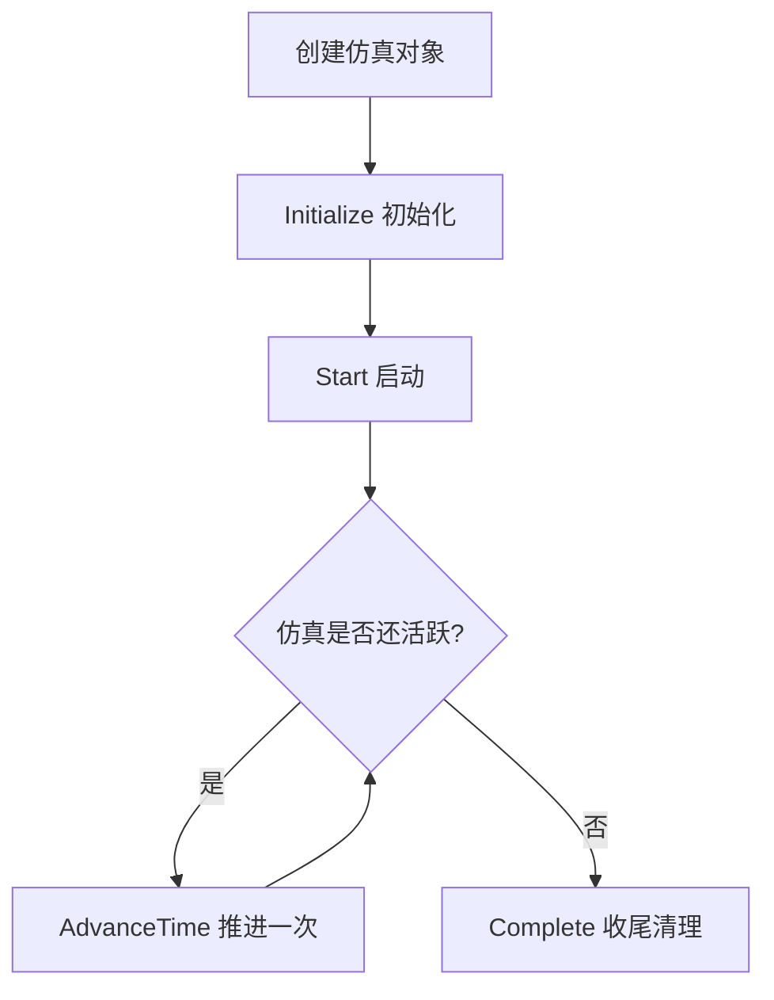

每一步可以这样理解：

| 阶段 | 小白理解 | 关键动作 |
| --- | --- | --- |
| 创建 | 选导演类型 | 应用层创建 `WsfEventStepSimulation` 或 `WsfFrameStepSimulation` |
| Initialize | 布置片场 | 创建时钟、初始化扩展、加入初始平台、注册多线程对象 |
| Start | 开拍 | 启动时钟，状态变为 active |
| AdvanceTime | 拍下一段 | 事件步进执行下一个事件；帧步进推进下一帧 |
| Complete | 收工 | 停时钟、删平台、清事件队列、通知扩展 |

源码入口：

- 应用层选择仿真类型：`WsfStandardApplication.cpp:323-344`
- 基类生命周期：`WsfSimulation.cpp:537-648`、`WsfSimulation.cpp:889-927`、`WsfSimulation.cpp:832-874`

### 事件步进像“按闹钟办事”

事件步进最重要的概念是事件队列。可以把事件队列想成一排闹钟：

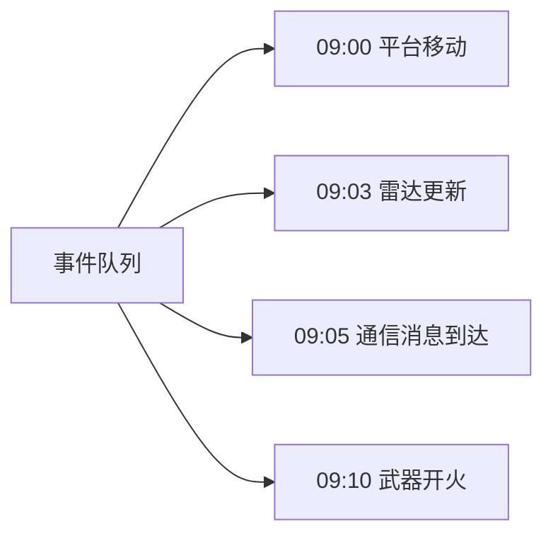

每个事件都有一个仿真时间。`WsfSimulation::AdvanceTime()` 每次看队列里最早的事件，把仿真时间推进到这个事件的时间，然后执行它。事件执行后有两种结果：

- `cDELETE`：事情做完了，这个事件删掉。
- `cRESCHEDULE`：这是周期任务，把自己改到下一次时间后重新放回队列。

所以在事件步进里，“平台什么时候动”“传感器什么时候扫”“处理器什么时候做决策”，多数都是靠事件排队决定的。

典型事件：

| 事件 | 小白理解 | 作用 |
| --- | --- | --- |
| `WsfMoverUpdateEvent` | 平台移动闹钟 | 到时间就更新平台位置，然后按 mover update interval 重排 |
| `WsfPlatformPartEvent::cTURN_ON` | 打开设备闹钟 | 到时间才真正把 sensor/processor/comm 打开 |
| `WsfPlatformPartEvent::cUPDATE` | 设备周期工作闹钟 | 到时间调用部件 `Update()` |
| `ThreadUpdateEvent` | 多线程批量更新闹钟 | 多线程事件步进下，定期让线程池批量更新平台和 sensor |

baseline 对应：`docs/baseline/AFSIM事件系统总结.md` 的“事件执行流程”和“ThreadUpdateEvent”章节。

### 帧步进像“按固定节拍刷新游戏”

帧步进更像游戏主循环。假设 `frame_time = 0.25` 秒，那仿真每 0.25 秒做一轮固定动作：

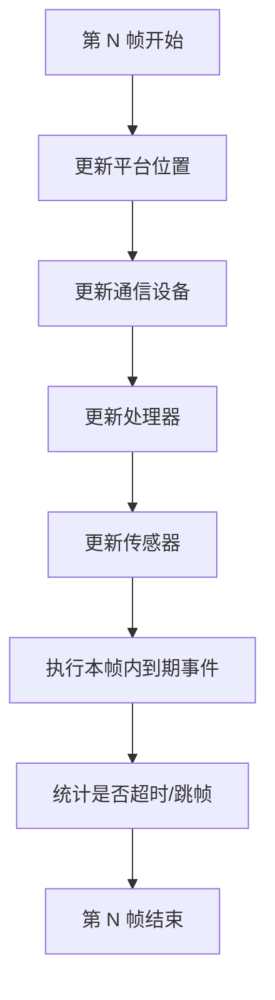

这和事件步进的差异很大：

- 事件步进：谁的闹钟先响，谁先执行。
- 帧步进：每一帧都按固定顺序扫一遍对象。

帧步进因此会维护自己的对象列表：

- `mPlatforms`
- `mComms`
- `mProcessors`
- `mSensors`

部件打开时加入列表，部件关闭时从列表移除。这样每帧就能快速知道“这一帧该更新哪些对象”。

源码入口：

- 帧主循环：`WsfFrameStepSimulation.cpp:111-252`
- 本地列表维护：`WsfFrameStepSimulation.cpp:312-380`、`WsfFrameStepSimulation.cpp:467-524`

### 多线程管理器像“只分派能安全并行的重活”

`WsfMultiThreadManager` 不是什么都并行。它只管两类重活：

1. 平台 mover 相关更新。
2. sensor 更新。

它不负责：

- 事件队列怎么派发。
- comm 怎么更新。
- processor 怎么更新。
- observer 通知。
- 脚本执行。

为什么不把所有东西都扔进线程池？因为多线程最怕共享状态混乱。AFSIM 的做法更保守：

- 能安全并行的更新放到 worker thread。
- 可能有副作用的消息发送、observer、脚本，回到主线程处理。
- 不安全的平台或 sensor，仍然在主线程串行更新。

可以把它理解为：

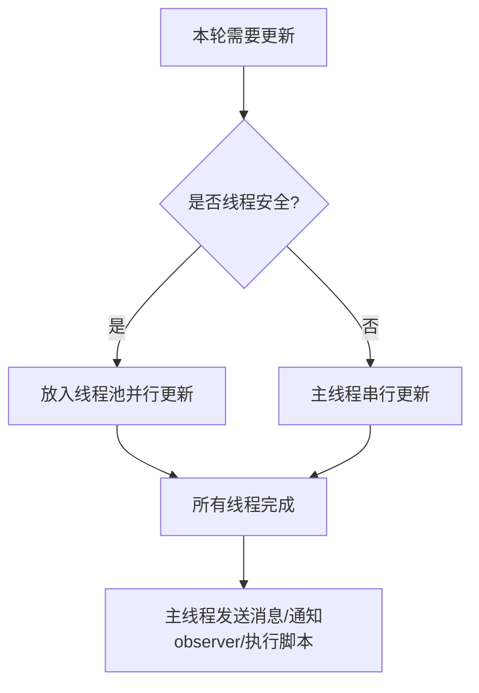

源码入口：

- 平台分类：`WsfMultiThreadManager.cpp:242-263`
- 平台并行更新：`WsfMultiThreadManager.cpp:89-142`
- sensor 并行更新：`WsfMultiThreadManager.cpp:145-211`
- worker 实际干活：`WsfMultiThreadManager.cpp:360-388`

### 三个类放在一起看

一句话版：

- `WsfEventStepSimulation` 决定“按事件闹钟推进”。
- `WsfFrameStepSimulation` 决定“按固定帧推进”。
- `WsfMultiThreadManager` 只是在这两种推进方式中，被叫来加速平台和 sensor 更新。

更具体地说：

| 场景 | 谁是主控 | 多线程怎么接入 |
| --- | --- | --- |
| 事件步进、不开多线程 | 事件队列 | 不接入，多数更新由各类事件周期触发 |
| 事件步进、开多线程 | 事件队列 + `ThreadUpdateEvent` | `ThreadUpdateEvent` 到点后调用 `UpdatePlatforms()` / `UpdateSensors()` |
| 帧步进、不开多线程 | `AdvanceFrame()` | 不接入，每帧主线程顺序更新平台/comm/processor/sensor |
| 帧步进、开多线程 | `AdvanceFrame()` | 每帧直接调用 `UpdatePlatforms()` / `UpdateSensors()` |

### 一条端到端源码链路

小白读源码时最容易迷路，因为函数很多、事件很多。可以先只抓下面这条主线：

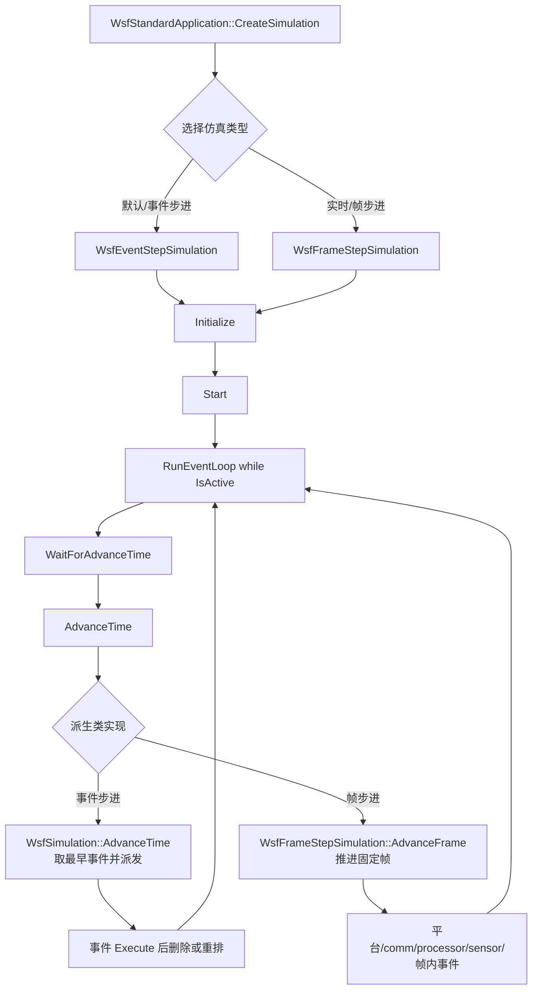

对应源码：

- 仿真类型选择：`WsfStandardApplication.cpp:323-344`
- 外层运行循环：`WsfStandardApplication.cpp:405-518`
- 事件步进时间推进：`WsfSimulation.cpp:186-227`
- 帧步进时间推进：`WsfFrameStepSimulation.cpp:256-283`
- 帧主体：`WsfFrameStepSimulation.cpp:111-252`

`RunEventLoop()` 的关键点只有三个：

1. 如果仿真还没启动，就调用 `Start()`。
2. 只要 `IsActive()`，每轮先调用 `WaitForAdvanceTime()`，再调用 `AdvanceTime()`。
3. 循环结束后调用 `Complete(simTime)` 清理。

所以读代码时不要一开始就追所有模型，先确认“本轮 `AdvanceTime()` 到底进了事件步进还是帧步进”。

### 事件队列到底怎么工作

事件队列由 `WsfEventManager` 管理。它不是普通列表，而是按以下顺序排序：

1. 事件时间越小越先执行。
2. 时间相同时，priority 越小越先执行。
3. 时间和 priority 都相同时，先加入队列的先执行。

源码：`WsfEventManager.hpp:34-39`、`WsfEventManager.hpp:56-66`、`WsfEventManager.cpp:22-29`。

真正派发事件的是 `DispatchEventsHelper()`：

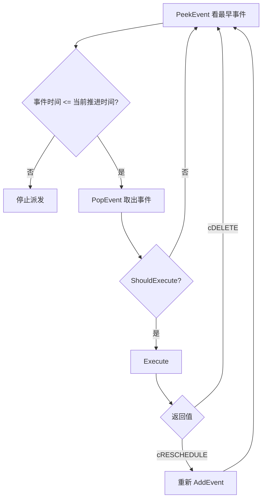

源码：`WsfSimulation.cpp:463-479`。

这解释了为什么 baseline 反复强调“事件生事件，循环往复”：事件执行时可能把自己重排，也可能添加其他事件；下一轮 `AdvanceTime()` 又会继续从最早事件开始。

### 初始平台是怎么开始工作的

很多人第一次读会以为“平台加入仿真后马上所有部件都运行”。源码里更准确的过程是：

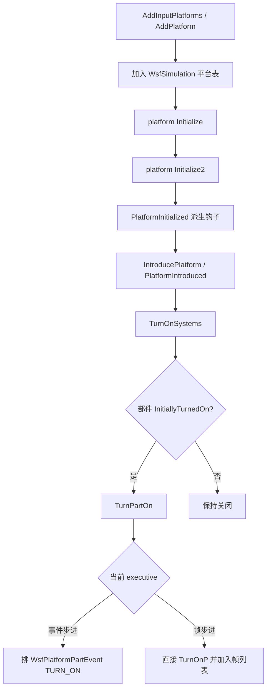

关键源码：

- 平台加入和初始化：`WsfSimulation.cpp:295-379`
- 初始平台批量初始化后开机：`WsfSimulation.cpp:1264-1318`
- `TurnOnSystems()` 遍历初始开启部件：`WsfSimulation.cpp:1326-1339`
- 事件步进 `TurnPartOn()` 排事件：`WsfEventStepSimulation.cpp:227-244`
- 帧步进 `TurnPartOnP()` 直接维护列表：`WsfFrameStepSimulation.cpp:496-524`

这条链路是理解 sensor、processor、comm 何时开始工作的关键。

## 2. 基类 WsfSimulation 提供的共同业务底座

`WsfSimulation` 负责统一生命周期、平台列表、事件队列、时钟、observer、extension 和多线程管理器的持有。

关键共同流程：

1. 构造阶段读取 `WsfSimulationInput`，初始化 `mMultiThreaded`、`mIsRealTime`、`mEndTime`，并构造 `mMultiThreadManager`。
2. `Initialize()` 设置状态、创建时钟、初始化扩展/observer、调用 `AddInputPlatforms()` 添加初始平台，再调用派生扩展点 `SimulationInitialized()`。
3. `AddPlatform()` 完成平台合法性检查、加入平台索引表、平台初始化、`PlatformInitialized()` 派生钩子、`IntroducePlatform()` 和 `PlatformIntroduced()` 派生钩子，最后 `TurnOnSystems()` 打开平台部件。
4. `Start()` 复位/启动时钟、通知扩展和 observer，然后进入 `cACTIVE`。
5. `AdvanceTime()` 由事件队列取下一个事件时间，经过时钟源裁剪后派发事件。
6. `Complete()` 停止时钟、通知完成、删除剩余平台、清空事件队列并完成扩展。

这些共同流程让两个派生步进类主要在以下点分化：

- 时间推进方式：事件队列推进 vs 固定帧推进。
- 平台/部件更新方式：周期事件触发 vs 每帧统一拉动。
- 多线程接入位置：事件步进通过内部 `ThreadUpdateEvent` 定期触发；帧步进在每个 `AdvanceFrame()` 中直接触发。

## 3. WsfEventStepSimulation 业务逻辑

### 3.1 定位

`WsfEventStepSimulation` 是事件驱动 executive。它把平台 mover、部件更新、部件开关等行为排成事件，由 `WsfSimulation::AdvanceTime()` 按事件时间推进。

构造器做两件关键事：

- 从场景输入中 `dynamic_cast` 出 `WsfEventStepSimulationInput`。
- 调用 `SetAmAnEventStepSimulation(true)` 标记事件步进。

源码：`WsfEventStepSimulation.cpp:96-102`。

### 3.2 初始化

`Initialize()` 的事件步进特有逻辑：

- 如果是实时模式且没有显式设置 `minimum_mover_timestep`，默认设为 `0.050` 秒，即 20 Hz。
- 先调用 `WsfSimulation::Initialize()`，让基类完成平台、扩展、observer、事件队列等共同初始化。
- 如果启用多线程且 `mThreadUpdateInterval > 0.0`，启动 `WsfMultiThreadManager`，并向事件队列追加内部 `ThreadUpdateEvent`。该事件从当前仿真时间后一个极小偏移开始，避免与初始平台/传感器登记顺序冲突。

源码：`WsfEventStepSimulation.cpp:131-151`。

### 3.3 普通非多线程更新

非多线程事件步进下，平台 mover 和平台部件由事件负责周期更新：

- 平台初始化后，如果 mover 有 `GetUpdateInterval() > 0.0`，则排 `WsfMoverUpdateEvent`。
- `WsfMoverUpdateEvent::Execute()` 调用 `platformPtr->Update(GetTime())`，再按 mover update interval 重排自己。
- 部件开关和部件 update 由 `WsfPlatformPartEvent` 执行。`TURN_ON` 事件会根据部件类型决定是否排后续 `UPDATE` 事件；sensor 非 slave 时排 sensor update，非 mover 的其他部件按 update interval 排 update。

源码：

- `WsfEventStepSimulation.cpp:181-193`
- `mover/WsfMoverUpdateEvent.cpp:30-49`
- `WsfPlatformPartEvent.cpp:36-97`

### 3.4 多线程更新

事件步进启用多线程后，不再为 mover 单独排 `WsfMoverUpdateEvent`；平台和传感器更新由内部 `ThreadUpdateEvent` 定期触发。

`ThreadUpdateEvent::Execute()` 逻辑：

1. 通知 `FrameStarting`。
2. 根据 `mPlatformUpdateMultiplier` 判断本次是否调用 `GetMultiThreadManager().UpdatePlatforms(GetTime())`。
3. 根据 `mSensorUpdateMultiplier` 判断本次是否调用 `GetMultiThreadManager().UpdateSensors(GetTime())`。
4. 更新两个 counter。
5. 通知 `FrameComplete`。
6. 把事件时间推进 `mUpdateInterval` 并返回 `cRESCHEDULE`。
7. 如果实时模式下下一次更新时间已经落后于真实时间，则把事件时间重置到真实时间之后，避免线程更新事件无限追赶历史时间。

源码：`WsfEventStepSimulation.cpp:44-93`。

### 3.5 平台与部件生命周期接入多线程管理器

事件步进与 `WsfMultiThreadManager` 的连接点主要在平台引入/删除和 sensor 开关事件：

- `PlatformIntroduced()`：多线程时先调用 `GetMultiThreadManager().PlatformIntroduced()`，再调用基类 `PlatformIntroduced()`。
- `PlatformDeleted()`：多线程时先调用 `GetMultiThreadManager().PlatformDeleted()`，再调用基类 `PlatformDeleted()`。
- `TurnPartOn()` / `TurnPartOff()` 本身只排 `WsfPlatformPartEvent`，真正开关发生在事件执行时。
- `WsfPlatformPartEvent::Execute()` 遇到 sensor `TURN_ON` / `TURN_OFF` 时，会在多线程模式下调用 `TurnSensorOn()` / `TurnSensorOff()` 更新多线程管理器的 sensor 列表。
- 实时 + 多线程 + 仿真开始阶段打开 sensor 时，事件步进会随机化 sensor turn-on 时间，以分散初始 sensor 更新负载。

源码：

- `WsfEventStepSimulation.cpp:195-212`
- `WsfEventStepSimulation.cpp:214-244`
- `WsfPlatformPartEvent.cpp:59-85`

### 3.6 实时等待逻辑

`WaitForAdvanceTime()` 仅在实时模式下有实质行为。它查看事件队列下一事件时间，与实时 clock 比较：

- 如果下一事件还没到，记录“不落后”，必要时短睡眠。
- 如果仿真事件时间已经落后真实时间，更新 `mTimeBehind` 并通知 `SimulationTimeBehind` observer。

源码：`WsfEventStepSimulation.cpp:277-339`。

## 4. WsfFrameStepSimulation 业务逻辑

### 4.1 定位

`WsfFrameStepSimulation` 是固定帧 executive。它把仿真推进离散为固定 `frame_time`，每次帧推进统一更新平台、comm、processor、sensor 和帧内事件。

构造器从场景输入中 `dynamic_cast` 出 `WsfFrameStepSimulationInput`，并初始化帧计数、下一帧时间、帧超时统计以及本地对象列表。

源码：`WsfFrameStepSimulation.cpp:60-77`。

应用层会在实时或 frame-stepped 模式下创建 `WsfFrameStepSimulation`：

- `cREAL_TIME`：创建 frame-step simulation 并 `SetRealtime(0, true)`。
- `cFRAME_STEPPED`：创建 frame-step simulation 并 `SetRealtime(0, false)`。
- 其他情况默认创建 `WsfEventStepSimulation`。

源码：`WsfStandardApplication.cpp:323-344`。

### 4.2 初始化

`Initialize()` 的帧步进特有逻辑：

- 清空本地 `mPlatforms`、`mComms`、`mProcessors`、`mSensors`。
- 设置基类 `mTimestep = GetFrameTime()`。
- 把 `mMinimumMoverTimestep` 设为 0，因为帧长本身就是 mover 更新节奏。
- 重置帧计数和实时统计。
- 多线程时先启动 `WsfMultiThreadManager`。
- 最后调用 `WsfSimulation::Initialize()`。这样基类添加初始平台时，帧步进覆写的 `AddPlatform()` / `TurnPartOnP()` 可以同步维护本地帧内对象列表。

源码：`WsfFrameStepSimulation.cpp:384-416`。

### 4.3 平台与部件列表维护

帧步进维护自己的对象列表，用于每帧按类型顺序更新：

- `AddPlatform(double, WsfPlatform*)` 先调用基类添加平台；成功后加入本地 `mPlatforms`，多线程时调用 `GetMultiThreadManager().AddPlatform()`。
- `DeletePlatform()` 先从本地平台、comm、processor、sensor 列表移除，再让基类走删除事件流程；多线程时同步通知 `WsfMultiThreadManager`。
- `TurnPartOnP()` 先调用基类直接打开部件，然后按类型加入 `mComms`、`mProcessors`、`mSensors`；sensor 多线程时调用 `TurnSensorOn()`。
- `TurnPartOffP()` 先调用基类直接关闭部件，然后按类型从本地列表移除；sensor 多线程时调用 `TurnSensorOff()`。

源码：

- `WsfFrameStepSimulation.cpp:312-329`
- `WsfFrameStepSimulation.cpp:347-380`
- `WsfFrameStepSimulation.cpp:467-524`

### 4.4 帧推进

`AdvanceFrame()` 是帧步进核心业务流：

1. 当前帧时间取 `mNextFrameTime`。
2. 通知 `FrameStarting`。
3. `mFrameCount += 1`，计算新的 `mNextFrameTime = mFrameCount * GetFrameTime()`。
4. 更新平台：
   - 多线程：`GetMultiThreadManager().UpdatePlatforms(currentFrameTime)`。
   - 非多线程：遍历基类平台列表，调用 `GetPlatformEntry(i)->Update(currentFrameTime)`，然后通知 `FramePlatformsUpdated`。
5. 顺序更新 `mComms`。
6. 顺序更新 `mProcessors`。
7. 更新 sensor：
   - 多线程：`GetMultiThreadManager().UpdateSensors(currentFrameTime)`。
   - 非多线程：遍历 `mSensors` 调用 `Update(currentFrameTime)`。
8. 调用 `AdvanceFrameObjects(currentFrameTime)` 回调扩展点。
9. 派发所有时间早于下一帧开始的事件；事件执行时临时把事件时间设置为当前帧时间，若事件要求重排，则按原始事件时间和执行后的 delta 计算新事件时间。
10. 实时模式下统计帧剩余/超时时间，必要时跳帧，并调整 sensor 下一次更新时间。
11. 通知 `FrameComplete`，返回当前帧时间。

源码：`WsfFrameStepSimulation.cpp:111-252`。

### 4.5 AdvanceTime 与等待

`AdvanceTime()` 从时钟源读取当前时间：

- 如果当前时钟时间超过 `mNextFrameTime`，推进一帧并通知 `AdvanceTime` observer。
- 否则不推进仿真帧，但调用基类 `AdvanceTime()`，用于处理 wall-clock 事件。
- 如果仿真时间超过 end time，状态变为 `cPENDING_COMPLETE`。

`WaitForAdvanceTime()` 用于实时帧同步：先睡到距下一帧 4ms 左右，再忙等到下一帧时间；如果时钟停止，则短睡眠。

源码：

- `WsfFrameStepSimulation.cpp:256-283`
- `WsfFrameStepSimulation.cpp:557-591`

## 5. WsfMultiThreadManager 业务逻辑

### 5.1 定位

`WsfMultiThreadManager` 是仿真核心的多线程执行服务。当前实现只并行化两类工作：

- 平台 mover/fuel/nav 相关更新。
- sensor 更新。

它不并行化：

- `WsfEventManager` 事件调度。
- comm 更新。
- processor 更新。
- 平台 observer 通知和平台脚本执行。

源码注释明确其目标是通过 thread pool 支持 threaded platform 和 sensor updates：`WsfMultiThreadManager.hpp:28-32`。

### 5.2 初始化与完成

- 构造器保存 `WsfSimulation*`，创建 `WsfThreadPool<SimulationUpdateThread, ThreadFactory>`。
- `Initialize()` 启动指定数量工作线程。
- `Complete()` 等待所有线程完成，清空平台/sensor 跟踪列表和工作队列。

源码：

- `WsfMultiThreadManager.cpp:27-47`
- `WsfMultiThreadManager.cpp:57-86`

### 5.3 平台分类与更新

平台登记逻辑：

- `AddPlatform()` 取平台 index。
- 如果平台有 mover 且 mover `ThreadSafe()`，加入 `mThreadedPlatforms`。
- 否则加入 `mNonThreadedPlatforms`。
- 登记后调用 `aPlatformPtr->SetUpdateLocked(true)`，防止普通 `WsfPlatform::Update()` 路径重复更新。

源码：`WsfMultiThreadManager.cpp:242-263`。

平台更新逻辑：

1. 设置 `mSimulationPtr->SetMultiThreadingActive(true)`。
2. 把 threaded platform index 推入 `mPlatformQueue`。
3. 通过线程池 `AssignWork()` 并等待所有工作完成。
4. 设置 `MultiThreadingActive(false)`。
5. 主线程对每个 threaded platform 执行 `SendQueuedMessages()`、`NotifyUpdate()`、`ExecuteScript()`。
6. 对 non-thread-safe platform 临时解除 update lock，直接调用普通 `Update()`，然后重新加锁。
7. 通知 `FramePlatformsUpdated`。
8. 如果存在 LOS manager，则在平台更新后调用 LOS 更新。

源码：`WsfMultiThreadManager.cpp:89-142`。

工作线程的 threaded platform 实际执行逻辑：

- 从队列 pop `PlatformElement`。
- 用 platform index 回到 `WsfSimulation::GetPlatformByIndex()`。
- 调用 `platformPtr->UpdateMultiThread(simTime)`。

`WsfPlatform::UpdateMultiThread()` 只调用 `DoUpdateMultiThread()`；`DoUpdateMultiThread()` 更新 mover/fuel/nav，不发 observer、不执行脚本。observer 和脚本被放回 `WsfMultiThreadManager::UpdatePlatforms()` 的主线程收尾阶段。

源码：

- `WsfMultiThreadManager.cpp:360-379`
- `WsfPlatform.hpp:174-181`
- `WsfPlatform.cpp:763-773`
- `WsfPlatform.cpp:785-819`

### 5.4 Sensor 分类与更新

sensor 登记逻辑：

- `TurnSensorOn()` 排除 slave sensor 和 externally controlled sensor。
- 线程安全 sensor 加入 `mThreadedSensors`，否则加入 `mNonThreadedSensors`。
- `TurnSensorOff()` 从两类列表中移除。
- `DeletePlatform()` 会从平台下所有 sensor 中移除对应 sensor。

源码：

- `WsfMultiThreadManager.cpp:266-305`
- `WsfMultiThreadManager.cpp:308-347`

sensor 更新逻辑：

1. 设置 `MultiThreadingActive(true)`。
2. 遍历 threaded sensors，只把 `GetNextUpdateTime() <= currentFrameTime + 1.0E-5` 的 sensor 推入优先队列。
3. 如果队列非空，分配线程池工作。
4. 实时模式下调用 `TryWaitUntilAllWorkDone(mBreakUpdateTime)`；超时时设置 `mBreakUpdate = true` 并警告，然后仍等待线程全部结束，以保持线程不变量。
5. 非实时模式下直接等待所有 sensor 工作完成。
6. 设置 `MultiThreadingActive(false)`。
7. 对 threaded sensors 发送 queued messages。
8. 若没有 break update，主线程更新 non-thread-safe sensors。
9. 清空 sensor 队列。

源码：`WsfMultiThreadManager.cpp:145-211`。

工作线程的 sensor 执行逻辑：

- 从 sensor 优先队列 pop 最早 `mNextUpdateTime` 的 sensor。
- 调用 `sensorElement.mSensorPtr->Update(simTime)`。

源码：`WsfMultiThreadManager.cpp:380-388`。

## 6. 三者交互逻辑

### 6.1 构造与配置关系

输入配置来自 `WsfSimulationInput` 及其派生输入片段：

- 公共多线程输入：`multi_thread` / `multi_threading`、`number_of_threads`、`sensor_update_break_time`、`debug_multi_threading`。
- 事件步进多线程输入：`multi_thread_update_rate` / `multi_thread_update_interval`、`platform_update_multiplier`、`sensor_update_multiplier`。
- 帧步进输入：`frame_rate` / `frame_time`。

`WsfDefaultSimulationInput` 同时继承事件步进和帧步进输入片段，`ProcessInput()` 会依次尝试公共输入、事件步进输入和帧步进输入。

源码：

- `WsfSimulationInput.hpp:179-211`
- `WsfSimulationInput.cpp:126-149`
- `WsfSimulationInput.cpp:197-288`

### 6.2 事件步进 + 多线程时序

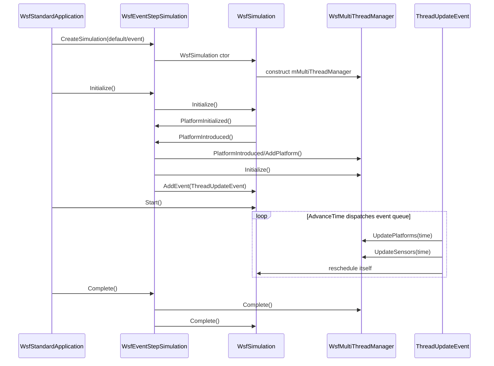

业务含义：

- 事件队列仍是时间推进的主控。
- 多线程平台/sensor 更新被包装成一个内部事件，不改变事件步进的本质。
- 平台和 sensor 的加入/移除通过事件步进钩子和 `WsfPlatformPartEvent` 同步给 `WsfMultiThreadManager`。

### 6.3 帧步进 + 多线程时序

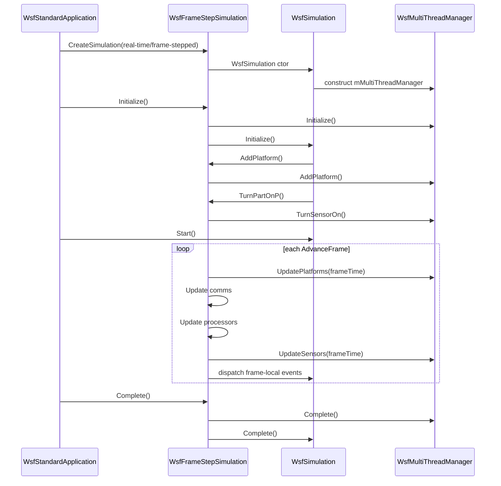

业务含义：

- 固定帧循环是时间推进主控。
- 多线程管理器是每帧 update 阶段的执行器，不通过额外事件触发。
- comm 和 processor 始终在帧步进主线程按顺序更新。

### 6.4 事件步进与帧步进接入多线程管理器的差异

| 维度 | WsfEventStepSimulation | WsfFrameStepSimulation |
| --- | --- | --- |
| 时间推进主控 | `WsfSimulation::AdvanceTime()` 派发事件队列 | `AdvanceFrame()` 固定帧推进 |
| 多线程触发方式 | 内部 `ThreadUpdateEvent` 周期触发 | 每帧直接调用 `UpdatePlatforms/UpdateSensors` |
| 平台 mover 非多线程更新 | 平台初始化后排 `WsfMoverUpdateEvent` | 每帧遍历平台调用 `Update()` |
| sensor 非多线程更新 | `WsfPlatformPartEvent` 排周期 `UPDATE` | 每帧遍历 `mSensors` 调用 `Update()` |
| comm/processor 更新 | 由部件事件按 update interval 驱动 | 每帧按 `mComms`、`mProcessors` 顺序更新 |
| 部件开关 | public `TurnPartOn/Off` 排 `WsfPlatformPartEvent`，事件执行时才改变状态 | protected `TurnPartOnP/OffP` 直接改变状态并更新本地列表 |
| 事件处理 | 所有事件按事件时间推进 | 帧内事件被压到当前帧时间执行，早于下一帧的事件全部派发 |
| 实时节奏 | 等待下一事件时间，记录落后真实时间 | 等待下一帧时间，记录帧超时/跳帧统计 |

## 7. 三个典型业务场景

### 7.1 平台为什么会移动

平台移动本质上是调用 `WsfPlatform::Update()` 或 `WsfPlatform::UpdateMultiThread()`，进而更新 mover/fuel/nav。

事件步进、非多线程时：

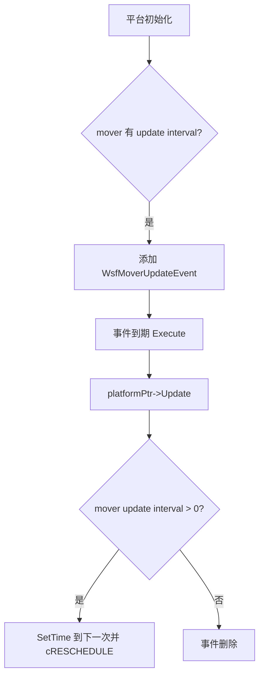

源码：`WsfEventStepSimulation.cpp:181-193`、`mover/WsfMoverUpdateEvent.cpp:30-49`。

帧步进时：

- 每帧先更新平台。
- 如果启用多线程，调用 `WsfMultiThreadManager::UpdatePlatforms()`。
- 如果未启用多线程，直接遍历平台表调用 `GetPlatformEntry(i)->Update(currentFrameTime)`。

源码：`WsfFrameStepSimulation.cpp:123-137`。

小白理解：事件步进下，平台移动靠“移动闹钟”；帧步进下，平台移动靠“每帧刷新”。

### 7.2 传感器为什么会更新

sensor 更新要先经历“打开”。如果 sensor 没有打开，就不会进入正常周期更新。

事件步进、非多线程时：

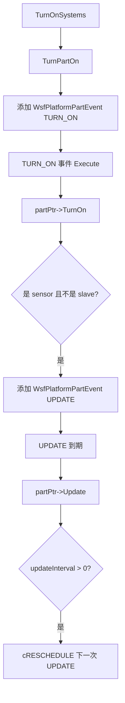

源码：`WsfPlatformPartEvent.cpp:36-97`。

事件步进、多线程时：

- `TURN_ON` 事件执行后，如果部件是 sensor，会调用 `GetMultiThreadManager().TurnSensorOn()`。
- 后续 sensor 是否更新，由 `ThreadUpdateEvent` 周期调用 `UpdateSensors()` 决定。
- sensor 只有在 `GetNextUpdateTime() <= currentFrameTime + 1.0E-5` 时才会进入线程队列。

源码：`WsfPlatformPartEvent.cpp:68-85`、`WsfEventStepSimulation.cpp:44-93`、`WsfMultiThreadManager.cpp:145-163`。

帧步进时：

- `TurnPartOnP()` 直接打开 sensor，并加入 `mSensors`。
- 多线程时还会调用 `TurnSensorOn()` 加入多线程管理器。
- 每帧更新 sensor：多线程走 `UpdateSensors()`，非多线程遍历 `mSensors`。

源码：`WsfFrameStepSimulation.cpp:496-524`、`WsfFrameStepSimulation.cpp:151-161`。

小白理解：sensor 不是“定义在平台上就自动工作”，而是要先打开，再进入事件队列、帧列表或多线程列表。

### 7.3 多线程 sensor 超时时会发生什么

多线程 sensor 更新有一个实时模式保护：`mBreakUpdateTime`。它不是为了让 worker 线程强行中止正在执行的 sensor，而是为了在实时约束下避免这一轮无限等待。

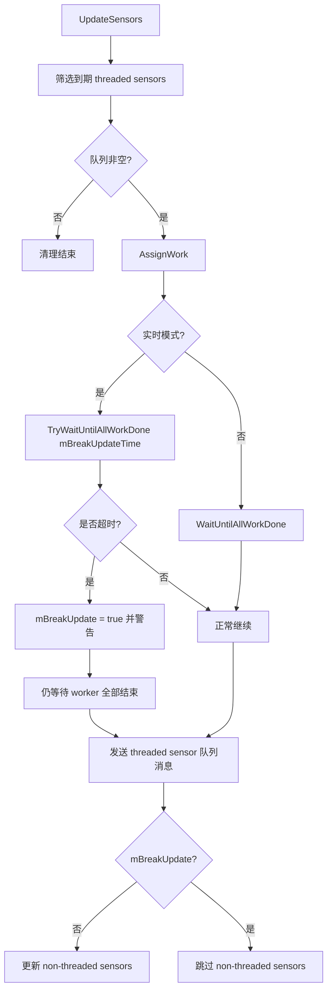

关键点：

- 超时后仍然 `WaitUntilAllWorkDone()`，因为线程安全不变量不能破坏。
- 超时主要影响后续 non-threaded sensor：`mBreakUpdate == true` 时跳过它们。
- threaded sensor 的 queued messages 仍会发送。

源码：`WsfMultiThreadManager.cpp:145-211`。

小白理解：实时模式下，如果线程池里的传感器更新拖太久，本轮会记录“太慢了”，等线程安全收尾后，跳过主线程里的非线程安全 sensor，尽量让仿真节奏别继续扩大延迟。

## 8. 交互约束与后续核查点

1. `WsfMultiThreadManager` 按 platform index 回查平台，依赖 `WsfSimulation::ResetPlatformList()` 保留 index 0 为空平台，以及 `AddToPlatformList()` 从 index 1 开始分配真实平台 index。相关源码为 `WsfSimulation.cpp:1493-1506` 和 `WsfSimulation.cpp:1414-1425`。
2. 多线程平台更新期间，`WsfSimulation::mMultiThreadingActive` 被置为 true；线程结束后才置回 false。若其他代码依赖该标志，需要按“工作线程更新段”和“主线程收尾段”区分理解。
3. threaded platform 的 worker 只更新 mover/fuel/nav，observer、queued messages 和脚本执行在主线程收尾阶段完成。这是避免非线程安全副作用进入 worker 的关键设计。
4. sensor 实时多线程更新可能因为 `sensor_update_break_time` 超时而设置 `mBreakUpdate`。此时 threaded sensor 的工作仍会被等待完成，但 non-threaded sensor 更新会被跳过。
5. `WsfSimulation` 中 `mAmAnEventStepSimulation` 默认值为 true，源码中只看到 `WsfEventStepSimulation` 显式调用 `SetAmAnEventStepSimulation(true)`，未看到 `WsfFrameStepSimulation` 显式置 false。该标志是否只作历史兼容用途，需在后续分析其所有调用点时确认。

## 9. baseline 补读后的源码校准

baseline 文档对理解全局很有帮助，但其中部分内容是教学式简化或伪代码。读源码时建议按下面方式校准：

| baseline 中容易误读的说法 | 当前源码中的更准确理解 |
| --- | --- |
| 多线程管理器“负责将平台更新分配到多个工作线程” | 只把满足条件的平台 mover 更新和 sensor 更新交给线程池；comm、processor、事件调度仍不由它负责。 |
| 平台是否线程安全取决于所有组件 | 当前 `AddPlatform()` 只看平台是否有 mover 且 mover `ThreadSafe()`；sensor 自己在 `TurnSensorOn()` 里按 sensor `ThreadSafe()` 再分类。 |
| 平台分类在初始化阶段完成、运行期间不变 | 初始平台在初始化时登记，但运行期新增/删除平台、sensor 开关都会更新多线程管理器列表。 |
| 实时模式下平台更新超时会跳过平台 | 当前源码看到的有界等待和 `mBreakUpdate` 发生在 `UpdateSensors()`，不是 `UpdatePlatforms()`。 |
| 线程池在每次 `UpdatePlatforms/UpdateSensors` 中 Start/Stop | 当前源码在 `Initialize()` 中 `Start(mNumberOfThreads)`，`Complete()` 中等待和清理；每轮 update 是 `AssignWork()` / wait。 |
| 多线程 worker 直接完成平台全套更新 | worker 只做 `UpdateMultiThread()`，平台消息发送、observer 通知、脚本执行在主线程后处理阶段完成。 |

这也是理解源码时的基本方法：baseline 用来建立概念图，源码用来确认“到底谁调用谁、什么时候调用、哪些对象真的被改动”。

## 10. 给新手的阅读顺序

建议按下面顺序读，不要一上来就追所有类：

1. 先读本文“小白版先建立直觉”，只记住两种推进方式：事件步进是闹钟，帧步进是固定刷新。
2. 再读 `docs/baseline/AFSIM事件系统总结.md` 的事件执行流程，理解 `AddEvent -> Execute -> cDELETE/cRESCHEDULE`。
3. 然后读 `WsfSimulation.cpp:186-227`，看基类 `AdvanceTime()` 怎么从事件队列推进时间。
4. 接着读 `WsfFrameStepSimulation.cpp:111-252`，看帧步进每帧到底按什么顺序更新对象。
5. 最后读 `WsfMultiThreadManager.cpp:89-211` 和 `WsfMultiThreadManager.cpp:360-388`，看并行更新的边界。

如果只想快速判断某个对象“为什么被更新”，可以按这个问题链查：

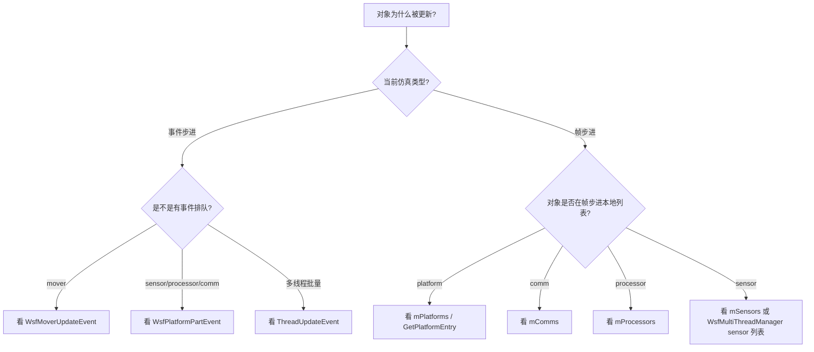

## 11. 常见误区

### 误区 1：`WsfSimulation` 自己就是完整的事件步进仿真

不准确。`WsfSimulation` 提供事件队列、平台管理、时钟和生命周期，但具体 executive 行为由派生类补齐。事件步进由 `WsfEventStepSimulation` 增加 mover 事件、多线程更新事件、部件事件调度策略；帧步进由 `WsfFrameStepSimulation` 改写 `AdvanceTime()` 并增加固定帧逻辑。

### 误区 2：开了多线程以后所有东西都并行

不准确。当前多线程管理器主要接管平台 mover 更新和 sensor 更新。comm、processor、事件派发、平台脚本、observer 通知仍在主线程或原有事件路径中执行。

### 误区 3：事件步进没有“帧”的概念

大体上事件步进不是固定帧仿真，但多线程事件步进里有 `ThreadUpdateEvent`，它会通知 `FrameStarting` / `FrameComplete`，并周期性批量更新平台和 sensor。因此这里的“Frame”更像给 observer 和批量更新使用的更新周期，不等同于 `WsfFrameStepSimulation` 的固定帧主循环。

### 误区 4：帧步进就不需要事件队列

不准确。帧步进仍使用事件队列，只是事件被收束到帧边界处理。`AdvanceFrame()` 会执行早于下一帧时间的事件，并把事件执行时间临时压到当前帧时间。

### 误区 5：多线程越多越好

不一定。线程池只加速可并行部分，线程安全检查、队列调度、主线程后处理仍有成本。sensor 实时更新还有 `sensor_update_break_time` 超时机制，说明系统更关心实时性和稳定性，而不是盲目跑完所有工作。

## 12. 一句话结论

`WsfEventStepSimulation` 是“事件队列驱动 + 可选线程更新事件”的执行模型；`WsfFrameStepSimulation` 是“固定帧驱动 + 每帧统一更新”的执行模型；`WsfMultiThreadManager` 则是二者共享的并行执行服务，只接管线程安全的平台 mover 和 sensor 更新，并把 observer、脚本、消息发送等副作用收束回主线程。
