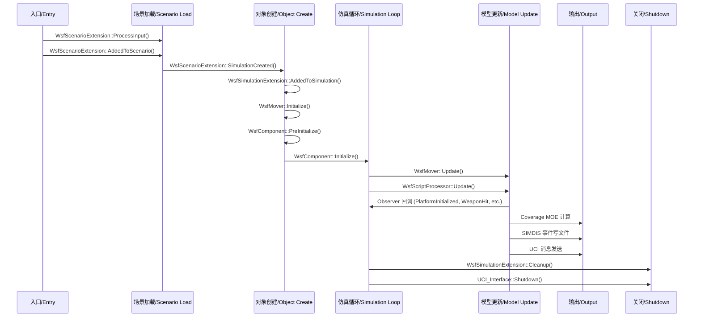
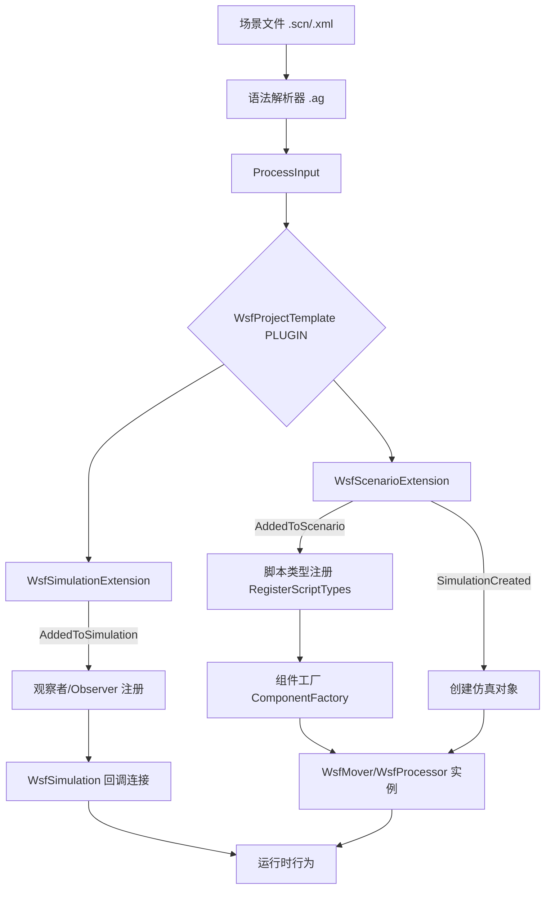

# AFSIM wsf_plugins 插件架构文档

> **状态**：完成
> **日期**：2026-06-10
> **分析范围**：`source_root/src/wsf_plugins/` 全部 16 个插件模块
> **分析深度**：module（模块级扫描 + 核心头文件源码验证）
> **基线文档**：基线 1 core/ 分析

---
## 0. 文档说明

**总体概述**：
wsf_plugins（插件系统）是 AFSIM 仿真框架的官方扩展插件集合，包含 16 个独立模块，总计 11,666 个源文件。这些插件通过 `WsfScenarioExtension`、`WsfSimulationExtension`、`WsfComponent` 等框架扩展点集成到核心框架中，承担运动学仿真（缩比6自由度/点质6自由度/RB6自由度）、作战管理（空战态势感知/IADS C2）、传感器建模（SOSM 光谱光学传感器）、可视化输出（SIMDIS）、场景分析验证（Scenario Analyzer）以及 OMS/UCI 标准化消息接口等专业领域功能。

**业务价值**：
- wsf_plugins 是 AFSIM 的领域功能扩展层，承载了 AFRL（美国空军研究实验室）在航空作战、电子战、导弹防御、多分辨率建模等领域的研究成果
- 为美国国防部（DoD）提供了完整的端到端（End-to-End）作战仿真能力
- 支持从高分辨率 6DOF 到多分辨率保真度（Multi-resolution Fidelity）的多层次建模
- 提供了与外部系统（如 BRAWLER、ARGO8、OMS/UCI 中间件）的互操作接口

**编程语言**：C++（C++14 及以上）

---
## 1. 目录结构总览

```
wsf_plugins/                                # AFSIM 插件集合（16 个模块）
  ├── wsf_air_combat/                       # 空战态势感知（Situational Awareness）模块
  │     ├── source/                         # 核心源码（15个文件）
  │     ├── grammar/                        # 输入语法定义
  │     ├── test/                           # 单元测试
  │     └── test_mission/                   # 测试任务
  ├── wsf_alternate_locations/              # 备用位置（Alternate Locations）仿真扩展
  │     ├── source/                         # 核心源码（7个文件）
  │     ├── grammar/                        # 输入语法定义
  │     └── doc/                            # 文档
  ├── wsf_annotation/                       # 标注系统（Annotation）— 场景标注、POI、Range Ring
  │     ├── source/                         # 核心源码（5个文件）
  │     └── grammar/                        # 输入语法定义
  ├── wsf_argo8/                            # ARGO8 导弹模型对接模块
  │     ├── source/                         # AFSIM 接口层
  │     ├── argo8/                          # ARGO8 独立库（arogo8 静态库）
  │     ├── grammar/                        # 输入语法定义
  │     └── doc/                            # 文档
  ├── wsf_brawler/                          # BRAWLER 空战仿真模型对接模块
  │     ├── source/                         # AFSIM 接口层
  │     ├── brawler/                        # BRAWLER 独立库
  │     ├── conversion/                     # 数据转换工具
  │     ├── grammar/                        # 输入语法定义
  │     └── test_mission/                   # 测试任务
  ├── wsf_coverage/                         # 覆盖性分析（Coverage Analysis）模块
  │     ├── source/                         # 核心源码（112个文件）
  │     ├── grammar/                        # 输入语法定义
  │     ├── test/                           # 单元测试
  │     └── test_mission/                   # 测试任务
  ├── wsf_fires/                            # 火力/武器（Fires/Weapons）弹道计算模块
  │     ├── source/                         # 核心源码（22个文件）
  │     ├── data/                           # 射表数据
  │     ├── grammar/                        # 输入语法定义
  │     └── test_mission/                   # 测试任务
  ├── wsf_iads_c2_lib/                      # 综合防空系统指挥控制（IADS C2）模块
  │     ├── source/                         # AFSIM 接口层（81个header）
  │     ├── iadsLib/                        # IADS C2 独立核心库
  │     ├── grammar/                        # 输入语法定义
  │     ├── test/                           # 测试
  │     └── doc/                            # 文档
  ├── wsf_multiresolution/                  # 多分辨率建模（Multi-resolution）模块
  │     ├── source/                         # 核心源码（17个文件）
  │     ├── grammar/                        # 输入语法定义
  │     ├── test/                           # 单元测试
  │     └── test_mission/                   # 测试任务
  ├── wsf_oms_uci/                          # OMS/UCI 标准化消息接口模块
  │     ├── source/                         # 核心源码（含8588个OCI自动生成头文件）
  │     ├── lib/                            # ASB（抽象服务总线）预编译库
  │     ├── grammar/                        # 输入语法定义
  │     ├── data/                           # 数据文件
  │     └── doc/                            # 文档
  ├── wsf_p6dof/                            # 拟6自由度（Pseudo-6DOF）运动学模块
  │     ├── source/                         # AFSIM 接口层（含 maneuver/ 和 formation/）
  │     ├── p6dof/                          # P6DOF 独立核心库
  │     ├── grammar/                        # 输入语法定义
  │     └── test_mission/                   # 测试任务
  ├── wsf_scenario_analyzer/                # 场景分析器（Scenario Analyzer）模块
  │     ├── source/                         # 核心源码（4个文件 + 插件注册）
  │     └── data/                           # 检查套件（check_suites）数据
  ├── wsf_scenario_analyzer_iads_c2/        # 场景分析器 IADS C2 专项扩展
  │     ├── source/                         # 核心源码（1个文件）
  │     └── data/                           # 检查套件数据
  ├── wsf_simdis/                           # SIMDIS 可视化输出模块
  │     ├── source/                         # 核心源码（1个核心文件）
  │     ├── grammar/                        # 输入语法定义
  │     └── doc/                            # 文档
  ├── wsf_six_dof/                          # 6自由度（Six-DOF）运动学模块（含点质+刚体两种）
  │     ├── source/                         # 核心源码（含 maneuver/ 和 formation/）
  │     ├── grammar/                        # 输入语法定义
  │     ├── test/                           # 单元测试
  │     └── test_mission/                   # 测试任务
  └── wsf_sosm/                             # 光谱光学传感器模型（SOSM）接口模块
        ├── source/                         # AFSIM 接口层（3个文件）
        ├── sosm/                           # SOSM 独立核心库
        ├── grammar/                        # 输入语法定义
        └── doc/                            # 文档
```

---
## 2. wsf_plugins 总览

### 模块概览

| 序号 | 模块 | 源文件数 | 核心职责 | 依赖框架模块 |
|------|------|----------|----------|-------------|
| 1 | wsf_air_combat | 118 | 空战态势感知（SA）— 感知、预测、群组管理 | wsf_mil, wsf_p6dof, wsf_six_dof, wsf_brawler |
| 2 | wsf_alternate_locations | 16 | 备用位置仿真扩展 — 平台备用位置管理 | WSF_LIBS (core) |
| 3 | wsf_annotation | 15 | 场景标注 — POI、范围环、标注信息 | WSF_LIBS (core) |
| 4 | wsf_argo8 | 25 | ARGO8 导弹模型集成 — 6DOF 外挂导弹仿真 | WSF_LIBS, wsf_mil, argo8 |
| 5 | wsf_brawler | 150 | BRAWLER 大尺度空战仿真模型对接 | wsf_mil |
| 6 | wsf_coverage | 239 | 覆盖性分析 — 网格计算、资产交互、效能度量 | WSF_LIBS |
| 7 | wsf_fires | 37 | 火力/非制导弹道武器 — 射表、弹道路径 | wsf_mil |
| 8 | wsf_iads_c2_lib | 399 | 综合防空系统 C2 — 战场管理、资产分配、拦截计算 | wsf, wsf_mil, util, util_script |
| 9 | wsf_multiresolution | 111 | 多分辨率建模 — 保真度驱动模型选择 | wsf_mil |
| 10 | wsf_oms_uci | 8785 | OMS/UCI 标准化消息接口 — ASB 中间件对接 | WSF_LIBS, wsf_mil (+ ASB lib) |
| 11 | wsf_p6dof | 819 | 拟6DOF 飞行器运动学 — 气动、推力、自动驾驶 | wsf_mil (+ 独立库 p6dof/util/genio) |
| 12 | wsf_scenario_analyzer | 15 | 场景分析验证 — 19 项 SAT 场景合规检查 | util, util_script, wsf, wsf_mil |
| 13 | wsf_scenario_analyzer_iads_c2 | 9 | IADS C2 场景专项分析 | util, util_script, wsf, wsf_mil, wsf_scenario_analyzer, wsf_iads_c2_lib |
| 14 | wsf_simdis | 12 | SIMDIS 3D 可视化输出 — ASI 文件写 | wsf, wsf_mil, util |
| 15 | wsf_six_dof | 849 | 6DOF 飞行器运动学 — 点质+刚体双重模型 | wsf_mil |
| 16 | wsf_sosm | 66 | 光谱光学传感器模型（SOSM）对接 | util |

### 模块间构建依赖关系图

```mermaid
graph TD
    subgraph "Core Framework (core/)"
        wsf[wsf]
        wsf_mil[wsf_mil]
        util[util]
        util_script[util_script]
        genio[genio]
    end

    subgraph "独立库 (Standalone Libraries)"
        p6dof_lib[p6dof]
        brawler_lib[brawler]
        argo8_lib[argo8]
        iadsLib[iadsLib]
        sosm_lib[sosm]
    end

    subgraph "插件模块 (Plugin Modules)"
        wsf_air_combat[wsf_air_combat]
        wsf_brawler[wsf_brawler]
        wsf_fires[wsf_fires]
        wsf_p6dof[wsf_p6dof]
        wsf_six_dof[wsf_six_dof]
        wsf_argo8[wsf_argo8]
        wsf_sosm[wsf_sosm]
        wsf_iads_c2[wsf_iads_c2_lib]
        wsf_coverage[wsf_coverage]
        wsf_oms_uci[wsf_oms_uci]
        wsf_multires[wsf_multiresolution]
        wsf_sa[wsf_scenario_analyzer]
        wsf_sa_iads[wsf_scenario_analyzer_iads_c2]
        wsf_simdis[wsf_simdis]
        wsf_annotation[wsf_annotation]
        wsf_altloc[wsf_alternate_locations]
    end

    wsf_mil --> wsf
    wsf_air_combat --> wsf_mil
    wsf_air_combat --> wsf_p6dof
    wsf_air_combat --> wsf_six_dof
    wsf_air_combat --> wsf_brawler

    wsf_brawler --> wsf_mil
    wsf_brawler --> brawler_lib
    brawler_lib --> util

    wsf_fires --> wsf_mil

    wsf_p6dof --> wsf_mil
    wsf_p6dof --> p6dof_lib
    p6dof_lib --> util
    p6dof_lib --> genio

    wsf_six_dof --> wsf_mil

    wsf_argo8 --> wsf_mil
    wsf_argo8 --> argo8_lib
    argo8_lib --> util

    wsf_sosm --> sosm_lib
    sosm_lib --> util

    wsf_iads_c2 --> wsf
    wsf_iads_c2 --> wsf_mil
    wsf_iads_c2 --> util
    wsf_iads_c2 --> util_script
    wsf_iads_c2 --> iadsLib

    wsf_coverage --> wsf
    wsf_oms_uci --> wsf
    wsf_oms_uci --> wsf_mil
    wsf_multires --> wsf_mil
    wsf_sa --> util
    wsf_sa --> util_script
    wsf_sa --> wsf
    wsf_sa --> wsf_mil
    wsf_sa_iads --> wsf_sa
    wsf_sa_iads --> wsf_iads_c2
    wsf_simdis --> wsf
    wsf_simdis --> wsf_mil
    wsf_simdis --> util
    wsf_annotation --> wsf
    wsf_altloc --> wsf
```



其中，箭头表示 CMake `target_link_libraries` 编译期依赖关系。

### 2.1 运动学系统（Kinematics Subsystem）— 路径：`wsf_plugins/wsf_p6dof/`, `wsf_plugins/wsf_six_dof/`, `wsf_plugins/wsf_argo8/`

1.**运动学系统概述**：包含三类不同保真度的飞行器/导弹运动学模型：
- **P6DOF（Pseudo-6DOF）**：拟6自由度模型 — 完整 6DOF 能力但简化了旋转运动学，执行速度快
- **Six-DOF 点质（PointMass）**：点质量6自由度模型 — 进一步简化旋转运动学，提供等效气动和推力建模
- **Six-DOF 刚体（RigidBody）**：全6自由度刚体模型 — 完整转动惯量、完整力矩计算
- **ARGO8**：外部高保真导弹模型集成

2.**目录结构细览**：

| 子目录 | 文件数 | 所属模块 | 核心职责 |
|--------|--------|--------|----------|
| wsf_p6dof/source/ | 22 | wsf_p6dof | AFSIM Mover 接口、自动驾驶、制导、测试对象 |
| wsf_p6dof/source/maneuvers/ | 大量 | wsf_p6dof | 机动动作库（Maneuver Library） |
| wsf_p6dof/source/formations/ | 大量 | wsf_p6dof | 编队动作库（Formation Library） |
| wsf_p6dof/p6dof/source/ | 大量 | p6dof (独立库) | P6DOF 核心：车辆、气动、推力、飞行员、路面、积分器 |
| wsf_six_dof/source/ | 166 | wsf_six_dof | 6DOF Mover 接口、点质/刚体双模型、飞行控制 |
| wsf_six_dof/source/maneuvers/ | 大量 | wsf_six_dof | 6DOF 机动动作库 |
| wsf_six_dof/source/formations/ | 大量 | wsf_six_dof | 6DOF 编队动作库 |
| wsf_argo8/source/ | 1 | wsf_argo8 | ARGO8 Mover 接口封装 |
| wsf_argo8/argo8/source/ | 少量 | argo8 (独立库) | ARGO8 外部库头文件及封装 |


#### 2.1.1 wsf_p6dof 模块（`wsf_plugins/wsf_p6dof/`）

1.**模块概述**：P6DOF（拟6自由度）是 AFSIM 最主要的飞行器运动学模拟插件。它基于 Boeing 研发的 P6DOF 核心库，通过 `WsfP6DOF_Mover`（继承自 `WsfMover`）与 AFSIM 平台框架集成。模块提供完整的气动计算（升力/阻力/侧力/力矩）、推力系统、燃油管理、飞行控制界面（舵面/襟翼/扰流板/起落架）、自动驾驶仪（横向/纵向/速度三通道）、制导计算机（GuidanceComputer）、航路管理、机动/编队执行等。

2.**模块核心类细览**：

| 类 | 文件 | 职责 |
|----|------|------|
| WsfP6DOF_Mover | WsfP6DOF_Mover.hpp | P6DOF 运动器主类 — 继承 WsfMover，P6DOF 与 AFSIM 平台的桥梁 |
| WsfP6DOF_GuidanceComputer | WsfP6DOF_GuidanceComputer.hpp | 制导计算机 — 拦截弹道计算和引导指令生成 |
| WsfP6DOF_Observer | WsfP6DOF_Observer.hpp | P6DOF 观察者 — 连接仿真事件回调 |
| WsfP6DOF_TypeManager | WsfP6DOF_TypeManager.hpp | 类型管理器 — P6DOF 飞行器类型注册和工厂 |
| WsfP6DOF_Fuel | WsfP6DOF_Fuel.hpp | 燃油系统 — 燃油箱、燃油传输管理 |
| WsfP6DOF_ExplicitWeapon | WsfP6DOF_ExplicitWeapon.hpp | 显式武器 — P6DOF 制导弹药模型 |
| WsfP6DOF_ObjectManager | WsfP6DOF_ObjectManager.hpp | 对象管理器 — 子对象/抛离物管理 |
| P6DofVehicle | P6DofVehicle.hpp (p6dof/) | P6DOF 飞行器核心类 — 独立库中的物理模型核心 |

#### 2.1.2 wsf_six_dof 模块（`wsf_plugins/wsf_six_dof/`）

1.**模块概述**：Six-DOF 是 AFSIM 中更高保真度的飞行器运动学模拟模块。它提供两类模型：
- **PointMass（点质模型）**（`wsf::six_dof::PointMassMover`）：简化旋转运动学，计算速度快
- **RigidBody（刚体模型）**（`WsfRigidBodySixDOF_Mover`）：完整转动惯量和力矩计算

模块包含丰富的飞行控制系统（FlightControlSystem），支持手动飞行/合成飞行员/自动驾驶三种模式，以及气动对象、推力系统、积分器等物理计算组件。

2.**模块核心类细览**：

| 类 | 文件 | 职责 |
|----|------|------|
| wsf::six_dof::PointMassMover | WsfPointMassSixDOF_Mover.hpp | 点质6DOF 运动器 — 继承自 Mover 基类 |
| WsfRigidBodySixDOF_Mover | WsfRigidBodySixDOF_Mover.hpp | 刚体6DOF 运动器 — 完整转动惯量计算 |
| PointMassAeroCoreObject | WsfPointMassSixDOF_AeroCoreObject.hpp | 点质气动核心对象 |
| PointMassIntegrator | WsfPointMassSixDOF_Integrator.hpp | 点质积分器 — 运动方程数值积分 |
| PointMassFlightControlSystem | WsfPointMassSixDOF_FlightControlSystem.hpp | 飞行控制系统 |
| PointMassPilotManager | WsfPointMassSixDOF_PilotManager.hpp | 飞行员管理器 — 多种飞行模式管理 |
| PointMassPropulsionSystem | WsfPointMassSixDOF_PropulsionSystem.hpp | 推力系统 — 发动机模型 |
| RigidBodyAeroCoreObject | WsfRigidBodySixDOF_AeroCoreObject.hpp | 刚体气动核心对象 |

#### 2.1.3 wsf_argo8 模块（`wsf_plugins/wsf_argo8/`）

1.**模块概述**：ARGO8 是 AFRL 的 6DOF 导弹仿真模型。wsf_argo8 通过 `WsfARGO8_Mover`（继承自 `WsfMover`）将 ARGO8 导弹模型集成到 AFSIM 平台生态中，支持多种制导方式和导引头模式。核心依赖独立的 `argo8` 静态库。

2.**模块核心类细览**：

| 类 | 文件 | 职责 |
|----|------|------|
| WsfARGO8_Mover | WsfARGO8_Mover.hpp | ARGO8 导弹运动器 — 对接 Argo8Missile 物理模型 |

### 2.2 作战管理系统（Battle Management Subsystem）— 路径：`wsf_plugins/wsf_air_combat/`, `wsf_plugins/wsf_iads_c2_lib/`

1.**作战管理系统概述**：包含两层作战管理能力：
- **wsf_air_combat**：空战态势感知（Situational Awareness, SA），提供群组管理、目标感知、威胁评估、交战建议等空战决策支持
- **wsf_iads_c2_lib**：综合防空系统指挥控制（Integrated Air Defense System C2），提供战场管理、资产管理、交战评估、拦截计算、C2 信息分发等防空作战支持

2.**核心模块细览**：

#### 2.2.1 wsf_air_combat 模块（`wsf_plugins/wsf_air_combat/`）

1.**模块概述**：空战 SA（Situational Awareness，态势感知）处理器，通过 `WsfSA_Processor`（基于 `WsfScriptProcessor`）和多个子模块（感知 Perceive、预测 Predict、评估 Assess）协作，为空战平台提供综合态势感知能力。模块使用模块化架构，包含群组管理器（GroupManager）、实体消息传递（EntityMessage）、感知项管理（PerceivedItem）等组件。

2.**模块核心类细览**：

| 类 | 文件 | 职责 |
|----|------|------|
| WsfSA_Processor | WsfSA_Processor.hpp | SA 处理器 — 空战态势感知主控制器 |
| WsfSA_Module | WsfSA_Module.hpp | SA 模块基类 — 所有 SA 子模块的抽象基础 |
| WsfSA_Perceive | WsfSA_Perceive.hpp | 感知模块 — 传感器数据融合和目标感知 |
| WsfSA_Predict | WsfSA_Predict.hpp | 预测模块 — 目标运动预测 |
| WsfSA_Assess | WsfSA_Assess.hpp | 评估模块 — 威胁评估和交战建议 |
| WsfSA_Group | WsfSA_Group.hpp | 群组 — 协同作战群组建模 |
| WsfSA_GroupManager | WsfSA_GroupManager.hpp | 群组管理器 — 群组管理 |
| WsfSA_GroupUtils | WsfSA_GroupUtils.hpp | 群组工具函数 |
| WsfSA_EntityPerception | WsfSA_EntityPerception.hpp | 实体感知 — 感知结果存储 |
| WsfSA_EntityMessage | WsfSA_EntityMessage.hpp | 实体消息 — 实体间通信 |
| WsfSA_PerceivedItem | WsfSA_PerceivedItem.hpp | 感知项 — 单个目标感知状态 |
| WsfSA_TypesManager | WsfAirCombatTypeManager.hpp | 空战类型管理器 |
| WsfSA_Observer | WsfAirCombatObserver.hpp | 空战观察者 — 事件回调 |

#### 2.2.2 wsf_iads_c2_lib 模块（`wsf_plugins/wsf_iads_c2_lib/`）

1.**模块概述**：综合防空系统指挥控制（IADS C2）是 AFSIM 中规模最大的插件之一（399 源文件）。它由 Radiance Technologies 开发，核心包含：
- `WsfBattleManager`（战场管理器）— 继承自 `WsfScriptProcessor`、`WsfC2ComponentContainer`、`WsfScriptOverridableProcessor`，是 IADS C2 插件的中央控制器
- `WsfAssetManager`（资产管理器）— 跟踪和管理所有防空资产
- `WsfAssetMap`（资产映射）— 平台的资产映射
- 独立的 `iadsLib` 库提供 IADS C2 核心算法（`BattleManagerInterface`、`AssetManagerInterface` 等）
- 丰富的交战评估、拦截计算、地形分析、C2 分发等功能模块

2.**模块核心类细览**：

| 类 | 文件 | 职责 |
|----|------|------|
| WsfBattleManager | WsfBattleManager.hpp | 战场管理器 — IADS C2 核心处理器 |
| WsfAssetManager | WsfAssetManager.hpp | 资产管理器 — 防空资产跟踪 |
| WsfAssetMap | WsfAssetMap.hpp | 资产映射 — 平台与资产关联 |
| WsfBMAssessEngagements | WsfBMAssessEngagements.hpp | 交战评估 — 交战结果评判 |
| WsfBMDisseminateC2 | WsfBMDisseminateC2.hpp | C2 分发 — 指挥信息网络分发 |
| WsfBMEvalAssignment | WsfBMEvalAssignment.hpp | 任务评估 — 武器-目标匹配评估 |
| WsfInterceptCalc | WsfInterceptCalc.hpp | 拦截计算 — 拦截几何和解算 |
| WsfBMTerrainInterface | WsfBMTerrainEngine.hpp | 地形分析接口 |
| WsfBMEventOutput | WsfBMEventOutput.hpp | 事件输出 — IADS C2 事件记录 |
| WsfBMMOELogger | WsfBMMOELogger.hpp | MOE 日志记录器 |
| WsfBMCSV_EventOutput | WsfBMCSV_EventOutput.hpp | CSV 事件输出 |
| WsfBMPluginUtilities | WsfBMPluginUtilities.hpp | 战役管理插件工具函数 |
| WsfBMAssignmentMessage | WsfBMAssignmentMessage.hpp | 任务分配消息 |
| WsfBMCueMessage | WsfBMCueMessage.hpp | 提示消息 |
| WsfBMAssignmentStatusMessage | WsfBMAssignmentStatusMessage.hpp | 分配状态消息 |
| WsfBMAssignmentTrackMessage | WsfBMAssignmentTrackMessage.hpp | 跟踪分配消息 |
| il::BattleManagerInterface | iadsLib/include/ | IADS C2 核心库战斗管理接口 |
| il::AssetManagerInterface | iadsLib/include/ | IADS C2 核心库资产管理接口 |

### 2.3 传感器与分析系统（Sensor & Analysis Subsystem）— 路径：`wsf_plugins/wsf_sosm/`, `wsf_plugins/wsf_coverage/`, `wsf_plugins/wsf_multiresolution/`, `wsf_plugins/wsf_scenario_analyzer/`

#### 2.2.3 wsf_sosm 模块（`wsf_plugins/wsf_sosm/`）

1.**模块概述**：SOSM（Spectral Optical Sensor Model，光谱光学传感器模型）由 Boeing 开发。`WsfSOSM_Interface` 继承自 `WsfScenarioExtension`，提供场景级别的 SOSM 输入处理和传感器/目标类型映射管理。核心物理计算委托给独立的 `sosm` 库。

2.**模块核心类细览**：

| 类 | 文件 | 职责 |
|----|------|------|
| WsfSOSM_Interface | WsfSOSM_Interface.hpp | SOSM 场景扩展 — 处理 `sosm_interface` 输入块 |
| WsfSOSM_Sensor | WsfSOSM_Sensor.hpp | SOSM 传感器 — 自定义 AFSIM 传感器接口 |
| WsfSOSM_Interaction | WsfSOSM_Interaction.hpp | SOSM 交互 — 传感器-目标交互管理 |

#### 2.2.4 wsf_coverage 模块（`wsf_plugins/wsf_coverage/`）

1.**模块概述**：覆盖性分析（Coverage Analysis）是 AFSIM 中的重要分析工具。`wsf::coverage::Coverage` 抽象类定义了覆盖性计算的核心框架。它通过指定的网格（Grid）观察平台间的交互，并计算各种效能度量（MOE — Measure of Effectiveness）。支持多种网格类型（LatLonGrid、DistanceSteppedGrid、ExistingPlatformGrid、CompositeGrid），多种资产类型（GridAsset 网格资产、FreeAsset 自由资产），以及多种约束条件。

2.**模块核心类细览**：

| 类 | 文件 | 职责 |
|----|------|------|
| wsf::coverage::Coverage | WsfCoverage.hpp | 覆盖性计算框架抽象类 |
| wsf::coverage::Grid | WsfCoverageGrid.hpp | 网格抽象基类 |
| WsfCoverageLatLonGrid | WsfCoverageLatLonGrid.hpp | 经纬度网格实现 |
| WsfCoverageDistanceSteppedGrid | WsfCoverageDistanceSteppedGrid.hpp | 距离步进网格 |
| WsfCoverageExistingPlatformGrid | WsfCoverageExistingPlatformGrid.hpp | 基于现有平台的网格 |
| WsfCoverageCompositeGrid | WsfCoverageCompositeGrid.hpp | 复合网格（组合多个网格） |
| wsf::coverage::Measure | WsfCoverageMeasure.hpp | 效能度量（MOE）抽象类 |
| WsfCoverageMeasureGridStats | WsfCoverageMeasureGridStats.hpp | 网格统计 MOE |
| WsfCoverageMeasureLatLonStats | WsfCoverageMeasureLatLonStats.hpp | 经纬度统计 MOE |
| WsfCoverageAccessInterval | WsfCoverageAccessInterval.hpp | 访问区间 — 资产间交互时间窗口 |
| WsfCoverageIntervalConstraint | WsfCoverageIntervalConstraint.hpp | 区间约束 — 过滤访问区间 |
| WsfCoverageAsset | WsfCoverageAsset.hpp | 资产定义 |
| WsfCoverageAssetSpecification | WsfCoverageAssetSpecification.hpp | 资产规格说明 |

#### 2.2.5 wsf_multiresolution 模块（`wsf_plugins/wsf_multiresolution/`）

1.**模块概述**：多分辨率建模（Multi-resolution Modeling）由 Stellar Science 开发。它通过 `WsfMultiresolutionPlatformComponent` 模板基类提供了一个保真度（Fidelity）驱动的模型选择框架。用户可以为不同保真度水平选择不同的组件模型，支持通过 `WsfMultiresolutionMultirunTable` 进行多轮次参数扫描。

2.**模块核心类细览**：

| 类 | 文件 | 职责 |
|----|------|------|
| WsfMultiresolutionPlatformComponent\<T\> | WsfMultiresolutionPlatformComponent.hpp | 多分辨率组件模板基类 |
| WsfMultiresolutionWrapperMetaModel | WsfMultiresolutionWrapperMetaModel.hpp | 多分辨率包装元模型 |
| WsfMultiresolutionMultirunTable | WsfMultiresolutionMultirunTable.hpp | 多轮次保真度参数表 |
| FidelityRange | FidelityRange.hpp | 保真度范围 |
| MultiresolutionRoles | MultiresolutionRoles.hpp | 多分辨率角色定义 |

#### 2.2.6 wsf_scenario_analyzer 模块（`wsf_plugins/wsf_scenario_analyzer/`）

1.**模块概述**：场景分析器（Scenario Analyzer）由 Radiance Technologies 开发，提供了一套自动化的仿真场景合规性检查工具。它包含 19 个核心检查函数，涵盖通信链路检查、指挥链检查、传感器检查、航迹处理器检查、武器检查、运动器能力检查等方面。同时支持 Session Notes（会话记录）功能。

2.**模块核心函数细览**：

| 函数 | 职责 |
|------|------|
| checkCommanderInDeclaredCommandChain | 检查指挥链声明的指挥官存在性 |
| checkCommInternallyLinked | 检查通信设备内部链接 |
| checkDeclaredCommandChainHasStructure | 检查指挥链结构完整性 |
| checkLargeScenarioHasCommandChain | 检查大规模场景是否配置指挥链 |
| checkPlatformHasMeaningfulLocation | 检查平台是否有有效位置 |
| checkPlatformHasRequiredSignatures | 检查平台是否有必需的特征信号 |
| checkPlatformInCommandChainHasComm | 检查指挥链中的平台是否有通信设备 |
| checkScriptProcessorHasUpdateInterval | 检查脚本处理器是否有更新间隔 |
| checkSensorInternallyLinked | 检查传感器内部链接 |
| checkSensorInternallyLinkedToTrackProcessor | 检查传感器到航迹处理器链接 |
| checkSensorOn | 检查传感器是否开启 |
| checkSignaturesDetectableByEnemySensor | 检查信号特征是否可被敌方检测 |
| checkTrackProcessorHasPurgeInterval | 检查航迹处理器清除间隔 |
| checkPurgeIntervalLongEnoughToMaintainTrack | 清除间隔是否足够维持航迹 |
| checkPurgeIntervalLongEnoughToEstablishTrack | 清除间隔是否足够建立航迹 |
| checkTrackProcessorsDontReportFusedTracksToEachOther | 航迹融合循环检查 |
| checkUserConfiguredSpeedsWithinMoverCapabilities | 配置速度是否在运动器能力内 |
| checkWeaponsNonzeroQuantity | 武器数量非零检查 |
| notifyOfPlatformsNotPresentInSimulation | 通知未出现在仿真中的平台 |

#### 2.2.7 wsf_scenario_analyzer_iads_c2 模块（`wsf_plugins/wsf_scenario_analyzer_iads_c2/`）

1.**模块概述**：IADS C2 场景分析专项扩展，依赖于 `wsf_scenario_analyzer` 和 `wsf_iads_c2_lib` 两个模块。它提供针对 IADS C2 场景的专门化分析/检查功能，主类为 `ScenarioAnalyzerIADSC2`，通过 `WsfScenarioAnalyzerIADSC2UnclassProcRegistration.hpp` 进行插件注册。

### 2.4 可视化与数据交换系统（Visualization & Data Exchange Subsystem）— 路径：`wsf_plugins/wsf_simdis/`, `wsf_plugins/wsf_oms_uci/`, `wsf_plugins/wsf_annotation/`

#### 2.4.1 wsf_simdis 模块（`wsf_plugins/wsf_simdis/`）

1.**模块概述**：SIMDIS（SIMulation DISplay）可视化输出插件，由 Lockheed Martin 开发。它生成 SIMDIS 的 ASI（ASCII Scenario Input）格式文件，支持平台状态、武器命中/击杀事件、传感器航迹、DEAD RECKON 等 3D 场景数据的输出。通过 `wsf::simdis::ScenarioExtension`（继承自 `WsfScenarioExtension`）和 `wsf::simdis::Interface`（继承自 `WsfSimulationExtension`）实现。

2.**模块核心类细览**：

| 类 | 文件 | 职责 |
|----|------|------|
| wsf::simdis::ScenarioExtension | WsfSIMDIS_Interface.hpp | SIMDIS 场景扩展 — 读取 SIMDIS 输出配置 |
| wsf::simdis::Interface | WsfSIMDIS_Interface.hpp | SIMDIS 仿真接口 — 处理仿真事件并写 ASI 文件 |

#### 2.4.2 wsf_oms_uci 模块（`wsf_plugins/wsf_oms_uci/`）

1.**模块概述**：OMS/UCI（Open Mission Systems / Universal Command and Control Interface）标准化消息接口插件。这是 wsf_plugins 中最大的模块（8785 个文件，其中 8588 个为 OCI 自动生成头文件）。`wsf::UCI_Interface` 是该模块的核心接口类，它封装了 ASB（Abstract Service Bus，抽象服务总线）连接，管理 UCI 消息的收发、组件注册、工厂服务和消息服务。模块包含 21 个核心源文件，支持 AMTI、ESM、POST 等多种传感器/能力类型的 UCI 消息标准化。

2.**模块核心类细览**：

| 类 | 文件 | 职责 |
|----|------|------|
| wsf::UCI_Interface | WsfUCI_Interface.hpp | UCI 核心接口 — ASB 连接管理、消息收发 |
| WsfUCI_InterfaceExtension | WsfUCI_InterfaceExtension.hpp | UCI 接口扩展 |
| UCI_Component | WsfUCI_Component.hpp | UCI 组件基类 |
| UCI_AMTI_Component | WsfUCI_AMTI_Component.hpp | AMTI 传感器 UCI 组件 |
| UCI_ESM_Component | WsfUCI_ESM_Component.hpp | ESM 传感器 UCI 组件 |
| UCI_IRST_Component | WsfUCI_IRST_Component.hpp | IRST 传感器 UCI 组件 |
| UCI_SensorComponent | WsfUCI_SensorComponent.hpp | 传感器组件基类 |
| UCI_PartComponent | WsfUCI_PartComponent.hpp | 部分组件 |
| UCI_Computer | WsfUCI_Computer.hpp | 计算组件 |
| UCI_FactoryService | WsfUCI_FactoryService.hpp | 工厂服务 |
| UCI_MessageFactory | WsfUCI_MessageFactory.hpp | 消息工厂 |
| UCI_MessageService | WsfUCI_MessageService.hpp | 消息服务 |
| UCI_GenericListener | WsfUCI_GenericListener.hpp | 通用消息监听器 |

#### 2.4.3 wsf_annotation 模块（`wsf_plugins/wsf_annotation/`）

1.**模块概述**：标注系统（Annotation）提供场景标注功能，包括 POI（兴趣点）、RangeRing（范围环）、Decoration（装饰）等标注信息的处理。`WsfAnnotationExtension` 继承自 `WsfScenarioExtension` 和 `WsfAnnotationInput`，同时处理场景输入和仿真创建时的标注配置。

### 2.5 其他功能模块

#### 2.5.1 wsf_alternate_locations 模块（`wsf_plugins/wsf_alternate_locations/`）

1.**模块概述**：备用位置（Alternate Locations）仿真扩展，通过 `wsf::altloc::SimulationExtension`（继承自 `WsfSimulationExtension`）管理平台备用位置信息。它在 `WsfObserver` 命名空间中注册了自定义回调事件 `EventCallback`，用于通知其他组件平台位置变更。

#### 2.5.2 wsf_brawler 模块（`wsf_plugins/wsf_brawler/`）

1.**模块概述**：BRAWLER 大尺度空战仿真模型对接模块，由 Boeing 研发。`WsfBrawler` 继承自 `WsfScenarioExtension`，负责 BRAWLER 相关脚本类型的注册和输入处理。模块通过 `WsfBrawlerMover`、`WsfBrawlerProcessor` 等将 BRAWLER 引擎集成到 AFSIM 平台。核心 BRAWLER 算法封装在独立的 `brawler` 库中。

2.**模块核心类细览**：

| 类 | 文件 | 职责 |
|----|------|------|
| WsfBrawler | WsfBrawler.hpp | BRAWLER 场景扩展 — 脚本类型注册 |
| WsfBrawlerMover | WsfBrawlerMover.hpp | BRAWLER 运动器 — 集成 BRAWLER 动力学 |
| WsfBrawlerProcessor | WsfBrawlerProcessor.hpp | BRAWLER 处理器 — BRAWLER 仿真逻辑 |
| WsfBrawlerComponents | WsfBrawlerComponents.hpp | BRAWLER 组件集合 |
| WsfBrawlerFuel | WsfBrawlerFuel.hpp | BRAWLER 燃油模型 |
| WsfBrawlerConsciousnessEvent | WsfBrawlerConsciousnessEvent.hpp | BRAWLER 感知事件 |

#### 2.5.3 wsf_fires 模块（`wsf_plugins/wsf_fires/`）

1.**模块概述**：火力/武器（Fires）弹道计算模块，专门处理非制导弹药（炮射弹道武器）的弹道计算。核心数据结构是 `FiresTable`（射表），通过 `FiresTableLoader` 从数据文件加载，通过 `FiresTableLookup` 进行快速查表计算射程、最大弹道高度、弹道飞行时间、发射仰角等参数。`FiresPath` 和 `FiresMover` 负责弹道轨迹的模拟。

2.**模块核心类细览**：

| 类 | 文件 | 职责 |
|----|------|------|
| Fires::FiresTable | FiresTable.hpp | 射表 — 弹道数据存储和查询 |
| FiresTableLookup | FiresTableLookup.hpp | 射表查询上下文 |
| FiresTableLoader | FiresTableLoader.hpp | 射表数据加载器 |
| FiresPath | FiresPath.hpp | 弹道路径计算 |
| BallisticPath | BallisticPath.hpp | 弹道航路 |
| BallisticPlatforms | BallisticPlatforms.hpp | 弹道平台管理 |
| FiresMover | FiresMover.hpp | 火力运动器 |
| FiresLaunchComputer | FiresLaunchComputer.hpp | 发射计算机 — 射表解算 |
| FiresObserver | FiresObserver.hpp | 火力观察者 |
| FiresDisObserver | FiresDisObserver.hpp | 火力分发观察者 |

---
## 3. 仿真生命周期

依据 `WsfScenarioExtension`、`WsfSimulationExtension`、`WsfMover` 等框架接口的插件实现源码：



其中，Entry 阶段加载场景输入（标注、SIMDIS配置、SOSM配置、备用位置等）；Scenario Load 阶段各插件通过 `WsfScenarioExtension::SimulationCreated()` 在仿真对象创建时注册类型和回调；Object Create 阶段插件初始化运动器、处理器、组件；Simulation Loop 阶段执行运动学更新、传感器探测、C2处理、覆盖性计算；Output 阶段生成可视化数据、UCI 消息和覆盖性报告；Shutdown 阶段执行资源释放和 ASB 连接关闭。

### 3.1 生命周期各阶段关联

| 阶段 | 入口函数/关键类 | 配置来源 | 主要状态对象 | 证据位置 |
|------|----------------|----------|-------------|----------|
| entry | `WsfScenarioExtension::ProcessInput()` | XML/JSON 场景文件 | mAnnotationInfo, mData, mExtension 成员 | WsfAnnotation.hpp:42, WsfSIMDIS_Interface.hpp:52, WsfAltLocSimulationExtension.hpp:40 |
| scenario_load | `WsfScenarioExtension::AddedToScenario()` | 场景输入块 | 各扩展成员的配置状态 | WsfAnnotation.hpp:41, WsfBrawler.hpp:27, WsfSOSM_Interface.hpp:39 |
| object_create | `WsfMover::Initialize()`, `WsfComponent::PreInitialize()` | 平台/组件定义 | P6DofVehicle, Argo8Missile, 平台状态 | WsfP6DOF_Mover.hpp:65, WsfARGO8_Mover.hpp:31 |
| simulation_loop | `WsfMover::Update()`, `WsfScriptProcessor::Update()` | 运动器/处理器配置 | 运动学状态、燃油、航路 | WsfP6DOF_Mover.hpp:66, WsfBattleManager.hpp:94 |
| model_update | `WsfMover::Update()`, `WsfP6DOF_Mover::Update()` | 飞行控制命令 | 速度、姿态、位置 | WsfP6DOF_Mover.hpp:66, PointMassMover::UpdateFlightControls et al. |
| event_handling | Observer 回调系统 | 事件管道 .utpack 定义 | 航迹、武器命中、平台初始化 | wsf_simdis::Interface (WsfSIMDIS_Interface.hpp:93-112) |
| output | `Coverage::Finalize()`, SIMDIS ASI 写, UCI 消息发 | 输出配置 | MOE 指标、ASI 文件、UCI 网络消息 | WsfCoverage.hpp:77, WsfSIMDIS_Interface.hpp:91, UCI_Interface |
| shutdown | `UCI_Interface::Shutdown()`, `~WsfSimulationExtension()` | 无 | ASB 连接、资源释放 | WsfUCI_Interface.hpp:136 |

---
## 7. 数据流

```mermaid
flowchart LR
    subgraph 场景输入 (Scenario Input)
        XML_IN[XML/JSON 场景文件]
        AGG[语法文件 .ag]
    end

    subgraph 场景扩展 (Scenario Extensions)
        ANNOT[WsfAnnotationExtension]
        SIMDIS_SE[wsf::simdis::ScenarioExtension]
        SOSM[WsfSOSM_Interface]
        BRAWLER[WsfBrawler]
        ALT_LOC[wsf::altloc::SimulationExtension]
    end

    subgraph 仿真核心 (Simulation Core)
        SIM[WsfSimulation]
        PLT[WsfPlatform]
        MOVER[WsfMover 系列]
        PROC[WsfScriptProcessor 系列]
    end

    subgraph 仿真扩展 (Simulation Extensions)
        SIMDIS_IF[wsf::simdis::Interface]
        COV[wsf::coverage::Coverage]
        UCI_IF[wsf::UCI_Interface]
    end

    subgraph 外部输出
        ASI[SIMDIS ASI 文件]
        MOE[覆盖性 MOE 输出]
        UCI_NET[OMS/UCI 网络消息]
        EVENT_PIPE[事件管道消息]
    end

    XML_IN --> ANNOT
    XML_IN --> SIMDIS_SE
    XML_IN --> SOSM
    XML_IN --> BRAWLER
    XML_IN --> ALT_LOC
    ANNOT --> SIM
    SIMDIS_SE --> SIMDIS_IF
    SIM --> PLT
    PLT --> MOVER
    PLT --> PROC
    MOVER -->|更新位置/姿态/速度| SIM
    PROC -->|SA/C2 处理结果| SIM
    SIMDIS_IF --> ASI
    COV --> MOE
    COV -->|观察平台交互| SIM
    UCI_IF --> UCI_NET
    UCI_IF -->|接收 UCI 消息| SIM
    EVENT_PIPE -->|wslayer 推送| SIM
```

其中，场景输入流程为 config_file → parser（语法解析）→ WsfScenarioExtension → WsfSimulationExtension → 工厂/注册 → WsfMover/WsfProcessor 实例 → 运行时行为。数据流则从 state_source（场景输入）→ state_owner（平台/组件）→ update_function（Mover::Update/Processor::Update）→ consumers（观察者/Observer 回调）→ outputs（文件/网络/可视化）。

---
## 8. 配置流



其中，配置路径为：场景文件 → 语法解析器（`.ag` 生成）→ `ProcessInput()` → 场景扩展/仿真扩展 → 将配置写入成员变量 → 通过工厂创建组件实例 → 安装到平台上 → 运行时行为由配置参数驱动。

---
## 9. 扩展点

| 扩展机制 | 关键接口 | 位置 | 说明 |
|----------|----------|------|------|
| 场景扩展 | `WsfScenarioExtension` | 约 7 个插件实现 | 场景加载时处理自定义输入块、注册脚本类型 |
| 仿真扩展 | `WsfSimulationExtension` | wsf_simdis, wsf_alternate_locations | 仿真生命周期中注册回调、处理仿真事件 |
| Mover 扩展 | `WsfMover` | wsf_p6dof, wsf_six_dof, wsf_argo8, wsf_brawler, wsf_fires | 所有运动学模型通过继承 WsfMover 扩展平台运动能力 |
| ScriptProcessor 扩展 | `WsfScriptProcessor` | wsf_air_combat, wsf_iads_c2_lib | 作战管理处理器通过继承 WsfScriptProcessor 实现 |
| 组件扩展 | `WsfPlatformComponent`, `WsfSignature` | wsf_multiresolution | 多分辨率建模通过组件模板扩展平台组件 |
| Observer 回调 | `WsfObserver` 命名空间 / `UtCallbackListN` | 各插件 | 通过回调系统订阅仿真事件 |
| EventPipe | `.utpack` 定义 → 自动生成类 | wsf_air_combat, wsf_p6dof, wsf_six_dof, wsf_annotation | 结构化事件数据分发 |
| 语法扩展 | `.ag` 语法定义文件 | 15 个插件有语法文件 | 为 AFSIM 脚本提供新的输入语句 |
| 插件注册 | `swdev_plugin_install()` / 独立注册 .cpp | 多个插件 | 将插件安装到 `mission_plugins` 或 `wsf_plugins` 目录 |

---
## 10. 关键符号

| 符号 | 类型 | 角色 | 源位置 |
|------|------|------|--------|
| WsfSA_Processor | class | 空战态势感知主控制器 | wsf_air_combat/source/WsfSA_Processor.hpp |
| WsfBattleManager | class | IADS C2 战场管理器 | wsf_iads_c2_lib/source/WsfBattleManager.hpp |
| WsfP6DOF_Mover | class | P6DOF 运动器 | wsf_p6dof/source/WsfP6DOF_Mover.hpp |
| wsf::six_dof::PointMassMover | class | 点质6DOF 运动器 | wsf_six_dof/source/WsfPointMassSixDOF_Mover.hpp |
| WsfARGO8_Mover | class | ARGO8 导弹运动器 | wsf_argo8/source/WsfARGO8_Mover.hpp |
| wsf::coverage::Coverage | class | 覆盖性分析框架 | wsf_coverage/source/WsfCoverage.hpp |
| wsf::UCI_Interface | class | OMS/UCI 核心接口 | wsf_oms_uci/source/WsfUCI_Interface.hpp |
| WsfSOSM_Interface | class | SOSM 传感器接口 | wsf_sosm/source/WsfSOSM_Interface.hpp |
| wsf::simdis::Interface | class | SIMDIS 仿真接口 | wsf_simdis/source/WsfSIMDIS_Interface.hpp |
| WsfAnnotationExtension | class | 标注系统扩展 | wsf_annotation/source/WsfAnnotation.hpp |
| wsf::multiresolution::WsfMultiresolutionPlatformComponent | class | 多分辨率组件模板 | wsf_multiresolution/source/WsfMultiresolutionPlatformComponent.hpp |
| WsfBrawler | class | BRAWLER 场景扩展 | wsf_brawler/source/WsfBrawler.hpp |
| Fires::FiresTable | class | 火力射表 | wsf_fires/source/FiresTable.hpp |

---
## 11. 未知项

| # | 问题 | 原因 | 严重度 |
|----|------|------|--------|
| 1 | wsf_oms_uci/lib/ 中的 ASB (.so/.dll) 预编译库内部实现未知 | ASB（抽象服务总线）是外部闭源二进制库 | 中 |
| 2 | wsf_argo8/argo8/models/ 下 `.so`/`.dll` 预编译模型内部细节未知 | ARGO8 模型是外部编译产物 | 中 |
| 3 | wsf_p6dof/p6dof/ 和 wsf_six_dof/source/ 中 maneuver/ 和 formation/ 子目录下的完整类列表未全部读取 | 文件数量大，优先读取了核心类 | 低 |
| 4 | wsf_iads_c2_lib/iadsLib/ 内部类详细信息未全部提取 | iadsLib 是独立子库，需要深入扫描 include/ 目录 | 低 |
| 5 | wsf_oms_uci/lib/ocl/ 8588 个 OCI 自动生成头文件的生成逻辑未知 | 由外部 OCI 代码生成工具产生 | 低 |
| 6 | 大部分 .cpp 实现文件的函数内部算法细节未分析 | 分析深度为 module 级，未进行函数级拆解 | 低 |

---
## 12. 源码证据

| 证据类型 | 位置 | 数量 | 验证状态 |
|----------|------|------|----------|
| 源码根目录 | `source_root/src/wsf_plugins/` | 11,666 源文件 | ✅ |
| 文件索引 | `workspace/source-index/wsf_plugins/file-index.jsonl` | 11,666 行 | ✅ JSON 全通过 |
| 符号索引 | `workspace/source-index/wsf_plugins/symbol-index.jsonl` | 见索引 | ✅ |
| 函数索引 | `workspace/source-index/wsf_plugins/function-index.jsonl` | 见索引 | ✅ |
| 依赖索引 | `workspace/source-index/wsf_plugins/dependency-index.jsonl` | 见索引 | ✅ source-cited |
| 构建系统 | wsf_plugins/ 下 33 个 CMakeLists.txt | 16 个模块间 target_link_libraries 依赖 | ✅ |
| 源码验证 | 每模块至少阅读 1 个核心头文件 | 16 个核心头文件完整阅读 | ✅ source-cited |
| 基线文档 | 基线 1 core/ 分析输出 | 7 个架构/索引文件 | ✅ document-cited |
