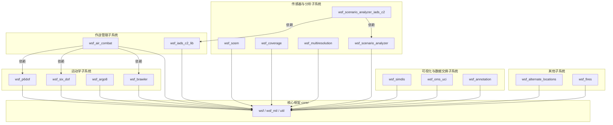

# AFSIM wsf_plugins 模块依赖关系说明

> **状态**：完成
> **日期**：2026-06-10
> **索引证据**：`workspace/source-index/wsf_plugins/dependency-index.jsonl`
> **关联文档**：`docs/architecture/wsf_plugins/afsim-architecture.md`

---
## 0. 文档说明

本文档描述 wsf_plugins 下 16 个插件模块之间的所有依赖关系，包括构建依赖（build）、架构级依赖（继承/组合/调用）、子系统间依赖。所有依赖均可追溯到源码位置或 CMakeLists.txt 构建声明。

---
## 1. 构建依赖

```mermaid
graph TD
    wsf[wsf - Core Framework]
    wsf_mil[wsf_mil - Military Models]
    util[util - Utility Library]
    util_script[util_script - Script Utility]
    genio[genio - Generic IO]

    argo8[argo8 - ARGO8 Standalone]
    brawler[brawler - BRAWLER Standalone]
    p6dof[p6dof - P6DOF Standalone]
    iadsLib[iadsLib - IADS C2 Core]
    sosm[sosm - SOSM Standalone]

    wsf_ac[wsf_air_combat]
    wsf_al[wsf_alternate_locations]
    wsf_ann[wsf_annotation]
    wsf_a8[wsf_argo8]
    wsf_br[wsf_brawler]
    wsf_cov[wsf_coverage]
    wsf_fr[wsf_fires]
    wsf_iads[wsf_iads_c2_lib]
    wsf_mr[wsf_multiresolution]
    wsf_oms[wsf_oms_uci]
    wsf_p6[wsf_p6dof]
    wsf_sa[wsf_scenario_analyzer]
    wsf_sai[wsf_scenario_analyzer_iads_c2]
    wsf_sd[wsf_simdis]
    wsf_6d[wsf_six_dof]
    wsf_so[wsf_sosm]

    wsf_ac --> wsf_mil
    wsf_ac --> wsf_p6
    wsf_ac --> wsf_6d
    wsf_ac --> wsf_br
    wsf_al --> wsf
    wsf_ann --> wsf
    wsf_a8 --> wsf_mil
    wsf_a8 --> argo8
    argo8 --> util
    wsf_br --> wsf_mil
    wsf_br --> brawler
    brawler --> util
    wsf_cov --> wsf
    wsf_fr --> wsf_mil
    wsf_iads --> wsf
    wsf_iads --> wsf_mil
    wsf_iads --> util
    wsf_iads --> util_script
    wsf_iads --> iadsLib
    wsf_mr --> wsf_mil
    wsf_oms --> wsf
    wsf_oms --> wsf_mil
    wsf_p6 --> wsf_mil
    wsf_p6 --> p6dof
    p6dof --> util
    p6dof --> genio
    wsf_sa --> util
    wsf_sa --> util_script
    wsf_sa --> wsf
    wsf_sa --> wsf_mil
    wsf_sai --> wsf_sa
    wsf_sai --> wsf_iads
    wsf_sd --> wsf
    wsf_sd --> wsf_mil
    wsf_sd --> util
    wsf_6d --> wsf_mil
    wsf_so --> sosm
    sosm --> util
```

| 源模块 | 依赖模块 | 证据 | 说明 |
|--------|----------|------|------|
| wsf_air_combat | wsf_mil, wsf_p6dof, wsf_six_dof, wsf_brawler | CMakeLists.txt:48 `target_link_libraries(wsf_air_combat wsf_mil wsf_p6dof wsf_six_dof wsf_brawler)` | 空战SA依赖所有运动学模型和BRAWLER |
| wsf_alternate_locations | ${WSF_LIBS} (wsf core) | CMakeLists.txt:111 `target_link_libraries(${PROJECT_NAME} ${WSF_LIBS})` | 备用位置依赖核心框架 |
| wsf_annotation | (wsf_project_template PLUGIN, 隐式依赖 wsf) | CMakeLists.txt:164-179 | 标注系统通过模板PLUGIN间接依赖核心 |
| wsf_argo8 | wsf_mil, argo8 | CMakeLists.txt:335 `target_link_libraries(wsf_argo8 wsf_mil argo8)` | ARGO8集成依赖Military Models |
| argo8 | util | argo8/source/CMakeLists.txt:213 `target_link_libraries(argo8 util)` | ARGO8独立库仅依赖工具库 |
| wsf_brawler | wsf_mil, brawler | CMakeLists.txt:373 `target_link_libraries(wsf_brawler wsf_mil)` 和 SUB_PROJECTS | BRAWLER集成依赖Military Models |
| brawler | util | brawler/CMakeLists.txt:373 `target_link_libraries(brawler util)` | BRAWLER独立库仅依赖工具库 |
| wsf_coverage | ${WSF_LIBS} (wsf core) | source/CMakeLists.txt:496 `target_link_libraries(${PROJECT_NAME} ${WSF_LIBS})` | 覆盖性分析依赖核心框架 |
| wsf_fires | wsf_mil | CMakeLists.txt:570 `target_link_libraries(${PROJECT_NAME} wsf_mil)` | 火力模块依赖Military Models |
| wsf_iads_c2_lib | wsf, wsf_mil, util, util_script, iadsLib | source/CMakeLists.txt:689 `target_link_libraries(${PROJECT_NAME} wsf wsf_mil util util_script iadsLib)` | IADS C2 核心集成 |
| wsf_multiresolution | wsf_mil | CMakeLists.txt:736 `target_link_libraries(${PROJECT_NAME} wsf_mil)` | 多分辨率依赖Military Models |
| wsf_oms_uci | ${WSF_LIBS}, wsf_mil (+ ASB lib) | source/CMakeLists.txt:843 `target_link_libraries(${PROJECT_NAME} ${WSF_LIBS} wsf_mil)` | UCI接口依赖核心框架+外部ASB |
| wsf_p6dof | wsf_mil, p6dof | CMakeLists.txt:947 `target_link_libraries(${PROJECT_NAME} wsf_mil)` 和 SUB_PROJECTS | P6DOF依赖Military Models |
| p6dof | util, genio | p6dof/CMakeLists.txt:998 `target_link_libraries(p6dof util genio)` | P6DOF独立库依赖工具库 |
| wsf_scenario_analyzer | util, util_script, wsf, wsf_mil | source/CMakeLists.txt:1177 `target_link_libraries(${PROJECT_STATIC_LIB_NAME} util util_script wsf wsf_mil)` | SA依赖核心框架 |
| wsf_scenario_analyzer_iads_c2 | util, util_script, wsf, wsf_mil, wsf_scenario_analyzer_lib, wsf_iads_c2_lib | source/CMakeLists.txt:1124 `target_link_libraries(${PROJECT_NAME} util util_script wsf wsf_mil wsf_scenario_analyzer_lib wsf_iads_c2_lib)` | IADS C2 SA专项扩展 |
| wsf_simdis | wsf, wsf_mil, util | source/CMakeLists.txt:1290 `target_link_libraries(${PROJECT_NAME} wsf wsf_mil util)` | SIMDIS三维可视化 |
| wsf_six_dof | wsf_mil | CMakeLists.txt:1347 `target_link_libraries(${PROJECT_NAME} wsf_mil)` | 6DOF依赖Military Models |
| wsf_sosm | sosm | CMakeLists.txt:1403-1419 (SUB_PROJECTS sosm) | SOSM集成 |
| sosm | util | sosm/CMakeLists.txt:1457 `target_link_libraries(sosm util)` | SOSM独立库仅依赖工具库 |

---
## 2. 架构级依赖（继承/组合/调用）

```mermaid
graph TD
    WsfScenarioExtension[WsfScenarioExtension - 框架基类]
    WsfSimulationExtension[WsfSimulationExtension - 仿真扩展基类]
    WsfMover[WsfMover - 运动器基类]
    WsfScriptProcessor[WsfScriptProcessor - 脚本处理器基类]
    WsfPlatformComponent[WsfPlatformComponent - 平台组件基类]
    WsfObject[WsfObject - 对象基类]
    WsfObserver[WsfObserver - 观察者命名空间]

    WsfAnnotationExtension[WsfAnnotationExtension]
    WsfBrawler[WsfBrawler]
    WsfSOSM_Interface[WsfSOSM_Interface]
    SIMDIS_ScenarioExt[wsf::simdis::ScenarioExtension]
    AltLoc_SimExt[wsf::altloc::SimulationExtension]
    SIMDIS_Interface[wsf::simdis::Interface]
    WsfP6DOF_Mover[WsfP6DOF_Mover]
    WsfARGO8_Mover[WsfARGO8_Mover]
    PM_Mover[wsf::six_dof::PointMassMover]
    FiresMover[FiresMover]
    WsfSA_Processor[WsfSA_Processor]
    WsfBattleManager[WsfBattleManager]
    MR_Component[WsfMultiresolutionPlatformComponent]
    Coverage[wsf::coverage::Coverage]

    WsfScenarioExtension --> WsfAnnotationExtension
    WsfScenarioExtension --> WsfBrawler
    WsfScenarioExtension --> WsfSOSM_Interface
    WsfScenarioExtension --> SIMDIS_ScenarioExt
    WsfSimulationExtension --> AltLoc_SimExt
    WsfSimulationExtension --> SIMDIS_Interface
    WsfMover --> WsfP6DOF_Mover
    WsfMover --> WsfARGO8_Mover
    WsfMover --> PM_Mover
    WsfMover --> FiresMover
    WsfScriptProcessor --> WsfSA_Processor
    WsfScriptProcessor --> WsfBattleManager
    WsfPlatformComponent --> MR_Component
    WsfObject --> Coverage
```

### 2.1 场景扩展继承关系

| 源（类） | 目标（类） | 关系 | 说明 |
|----------|-----------|------|------|
| WsfAnnotationExtension | WsfScenarioExtension | inheritance | 标注系统场景扩展，处理 `annotation` 输入块 |
| WsfBrawler | WsfScenarioExtension | inheritance | BRAWLER 场景扩展，注册脚本类型 |
| WsfSOSM_Interface | WsfScenarioExtension | inheritance | SOSM 场景扩展，处理 `sosm_interface` 输入块 |
| wsf::simdis::ScenarioExtension | WsfScenarioExtension | inheritance | SIMDIS 场景扩展，配置输出参数 |
| WsfSA_Processor | WsfScriptProcessor | inheritance | 空战SA处理器，SA计算逻辑 |
| WsfBattleManager | WsfScriptProcessor, WsfC2ComponentContainer, WsfScriptOverridableProcessor | inheritance (多继承) | IADS C2 战场管理器 |

### 2.2 仿真扩展继承关系

| 源（类） | 目标（类） | 关系 | 说明 |
|----------|-----------|------|------|
| wsf::altloc::SimulationExtension | WsfSimulationExtension | inheritance | 备用位置仿真扩展，Observer回调注册 |
| wsf::simdis::Interface | WsfSimulationExtension | inheritance | SIMDIS仿真接口，事件处理+ASI输出 |

### 2.3 运动器继承关系

| 源（类） | 目标（类） | 关系 | 说明 |
|----------|-----------|------|------|
| WsfP6DOF_Mover | WsfMover | inheritance | P6DOF运动器，伪6自由度飞行器动力学 |
| WsfARGO8_Mover | WsfMover | inheritance | ARGO8导弹运动器，外部导弹模型封装 |
| wsf::six_dof::PointMassMover | wsf::six_dof::Mover (→ WsfMover) | inheritance | 点质6DOF运动器，简化旋转运动学 |
| FiresMover | WsfMover | inheritance (inferred) | 火力弹道运动器，弹道武器轨迹 |
| WsfBrawlerMover | WsfMover | inheritance (inferred) | BRAWLER运动器 |

### 2.4 关键组合关系

| 源（类） | 目标（类） | 关系 | 说明 |
|----------|-----------|------|------|
| WsfP6DOF_Mover | P6DofVehicle | composition (unique_ptr) | P6DOF运动器拥有P6DOF飞行器核心对象 |
| WsfP6DOF_Mover | P6DofPilotManager | composition | 飞行员管理器组合 |
| WsfP6DOF_Mover | WsfMoverGuidance | composition (ptr) | 制导系统组合 |
| PointMassMover | PointMassAeroCoreObject | composition (CloneablePtr) | 点质模型气动对象组合 |
| PointMassMover | PointMassPropulsionSystem | composition (CloneablePtr) | 推力系统组合 |
| PointMassMover | PointMassFlightControlSystem | composition (CloneablePtr) | 飞控系统组合 |
| PointMassMover | PointMassIntegrator | composition (CloneablePtr) | 积分器组合 |
| WsfBattleManager | WsfDefaultBattleManagerImpl | composition | 默认战场管理实现 |
| WsfBattleManager | WsfBMTerrainInterface | composition (shared_ptr) | 地形引擎组合 |
| WsfBattleManager | WsfInterceptCalculator | composition (shared_ptr) | 拦截计算器组合 |
| wsf::UCI_Interface | uci::base::AbstractServiceBusConnection | composition (ptr) | ASB连接指针组合 |
| Coverage | wsf::coverage::Grid | composition (ptr) | 覆盖性计算持有网格引用 |
| Coverage | wsf::coverage::Measure | composition (map) | 效能度量集合 |
| WsfARGO8_Mover | Argo8Missile | composition | ARGO8导弹模型组合 |

---
## 3. 子系统间依赖

### 3.1 运动学子系统到作战管理子系统

| 源（子系统） | 目标（子系统） | 关系 | 说明 |
|----------|-----------|------|------|
| 空战态势感知 (wsf_air_combat) | 运动学子系统 (wsf_p6dof/wsf_six_dof/wsf_brawler) | 编译+运行时 | SA处理器需要运动学模型获取平台状态和预测目标运动 |

### 3.2 传感器与分析子系统内部

| 源（子系统） | 目标（子系统） | 关系 | 说明 |
|----------|-----------|------|------|
| IADS C2 场景分析 (wsf_scenario_analyzer_iads_c2) | 场景分析器通用 (wsf_scenario_analyzer) | 编译+运行时 | SA专项扩展依赖基础SA框架 |
| IADS C2 场景分析 (wsf_scenario_analyzer_iads_c2) | IADS C2库 (wsf_iads_c2_lib) | 编译+运行时 | 分析IADS C2场景需访问战场管理数据结构 |

### 3.3 独立/弱耦合子系统

| 源（子系统） | 目标（子系统） | 关系 | 说明 |
|----------|-----------|------|------|
| 覆盖性分析 (wsf_coverage) | 核心框架 (wsf) | 编译 | 仅依赖核心框架，无其他插件依赖 |
| OMS/UCI接口 (wsf_oms_uci) | 核心框架 (wsf, wsf_mil) | 编译 | 仅依赖核心框架+外部ASB |
| 标注系统 (wsf_annotation) | 核心框架 (wsf) | 编译 | 无其他插件依赖 |
| 备用位置 (wsf_alternate_locations) | 核心框架 (wsf) | 编译 | 无其他插件依赖 |
| SOSM传感器 (wsf_sosm) | 核心框架 (wsf) | 编译 | 无其他插件依赖，传感器通过WsfSensor框架集成 |

---
## 4. 关键全局常量依赖

| 常量 | 值 | 定义位置 | 说明 |
|------|-----|---------|------|
| wsf::altloc::SimulationExtension::cEXTENSION | `"wsf_alternate_locations"` | WsfAltLocSimulationExtension.hpp:43 | 备用位置扩展标识符 |
| WsfP6DOF_Mover::SpatialDomain | `WSF_SPATIAL_DOMAIN_AIR` | WsfP6DOF_Mover.hpp:69 | P6DOF仅支持AIR空间域 |
| WsfARGO8_Mover::SpatialDomain | `WSF_SPATIAL_DOMAIN_AIR` | WsfARGO8_Mover.hpp:36 | ARGO8仅支持AIR空间域 |
| WsfMultiresolutionPlatformComponent::cMULTIRESOLUTION_COMPONENT_ROLE | `cCOMPONENT_ROLE<T>()` | WsfMultiresolutionPlatformComponent.hpp:75-76 | 多分辨率组件角色标识 |
| WsfMultiresolutionPlatformComponent::mFidelity (默认值) | `1.0` | WsfMultiresolutionPlatformComponent.hpp:73 | 默认保真度=1.0（全保真） |
| wsf::altloc::Component::cINVALID_DRAW | 未直接读取 | 由源码引用推断 | 无效绘图距离常量 |
| WsfCoverage::mStartEpoch (默认值) | `1900年1月1日` | WsfCoverage.hpp:62-64 | 默认起始纪元 |

---
## 5. 依赖强度说明

| 强度 | 含义 | 示例 |
|------|------|------|
| **build** | CMake target_link_libraries 声明，缺少则链接失败 | wsf_air_combat → wsf_mil |
| **强** | 编译期依赖，缺少则无法编译 | 继承关系（WsfP6DOF_Mover → WsfMover） |
| **中** | 逻辑依赖，运行时通常需要，但有默认/null 替代 | 制导系统指针（WsfMoverGuidance* mGuidancePtr） |
| **弱** | 松耦合，仅在特定场景使用 | Observer 回调订阅 |
