# AFSIM WSF 仿真核心控制类 — 软件设计文档

## 1. 概述

### 1.1 文档目的

本文档对 AFSIM WSF（Warfare Simulation Framework）仿真引擎的**核心控制类**进行详细设计解读。这些类构成了离散事件仿真引擎的骨架，负责仿真生命周期管理、事件调度、时间推进和多线程协调。

### 1.2 核心控制类边界

本文档聚焦以下核心控制类：

| 类名 | 职责 | 源文件 |
|------|------|--------|
| `WsfSimulation` | 仿真主控制器，状态机，生命周期管理 | `WsfSimulation.hpp/.cpp` |
| `WsfEvent` | 事件基类，定义事件接口 | `WsfEvent.hpp` |
| `WsfEventManager` | 事件队列管理，调度与分发 | `WsfEventManager.hpp/.cpp` |
| `WsfClockSource` | 时钟源基类，时间抽象 | `WsfClockSource.hpp/.cpp` |
| `WsfRealTimeClockSource` | 实时时钟源，墙上时间同步 | `WsfRealTimeClockSource.hpp/.cpp` |
| `WsfSimulationInput` | 仿真输入配置 | `WsfSimulationInput.hpp/.cpp` |
| `WsfMultiThreadManager` | 多线程管理器 | `WsfMultiThreadManager.hpp/.cpp` |
| `ut::Random` | 随机数包装类 | `UtRandom.hpp` |

以下内容**不在本文档范围内**：WsfPlatform（平台实体）、WsfScenario（场景数据）、WsfApplication（应用层）、观察者系统（Observer）、扩展系统（Extension）。

### 1.3 核心类关系总览

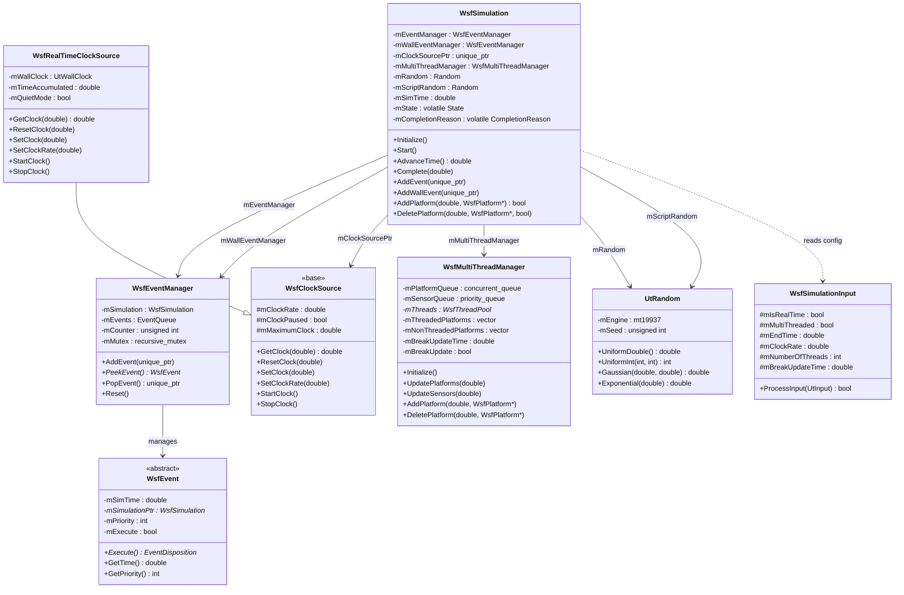

---

## 2. WsfSimulation — 仿真主控制器

`WsfSimulation` 是整个仿真引擎的核心类，管理仿真生命周期、事件调度、平台集合和子系统协调。

> **源文件**：`src/core/wsf/source/WsfSimulation.hpp` (line 108), `WsfSimulation.cpp`

### 2.1 类职责

- 维护仿真状态机，驱动生命周期转换
- 持有两套事件管理器（仿真时间事件 + 墙上时间事件）
- 管理时钟源（支持普通时钟和实时钟源）
- 维护平台集合，支持按索引和按名称查找
- 提供随机数生成（双 RNG 实例）
- 协调多线程管理器
- 持有 16 个域的观察者对象

### 2.2 状态机详解

#### 状态枚举

```cpp
// WsfSimulation.hpp, line 112
enum State
{
    cPENDING_INITIALIZE,  // 0 — 已创建，待初始化
    cINITIALIZING,        // 1 — 正在初始化
    cPENDING_START,       // 2 — 初始化完成，待启动
    cSTARTING,            // 3 — 正在启动
    cACTIVE,              // 4 — 活跃运行中
    cPENDING_COMPLETE,    // 5 — 待完成（时间到达或请求终止）
    cCOMPLETE             // 6 — 已完成
};
```

#### 状态转换图

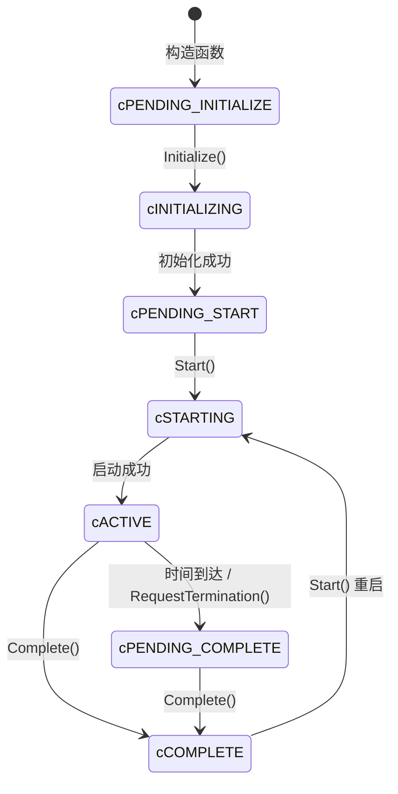

#### 完成原因枚举

```cpp
// WsfSimulation.hpp, line 124
enum CompletionReason
{
    cNONE,              // 未设置
    cEND_TIME_REACHED,  // 仿真时间到达结束时间
    cRESET,             // 重置请求
    cTERMINATE,         // 外部终止请求
    cOTHER              // 其他原因
};
```

#### 各状态说明与合法转换

| 状态 | 含义 | 可转向状态 |
|------|------|------------|
| `cPENDING_INITIALIZE` | 对象已创建，尚未初始化 | `cINITIALIZING` |
| `cINITIALIZING` | 正在执行初始化流程（创建时钟、初始化扩展、添加平台） | `cPENDING_START` |
| `cPENDING_START` | 初始化完成，等待 Start() 调用 | `cSTARTING` |
| `cSTARTING` | 正在执行启动流程（重置时钟、启动扩展） | `cACTIVE` |
| `cACTIVE` | 仿真正在运行，事件正在调度 | `cPENDING_COMPLETE`, `cCOMPLETE` |
| `cPENDING_COMPLETE` | AdvanceTime 检测到时间超过结束时间 | `cCOMPLETE` |
| `cCOMPLETE` | 仿真已完成，资源已清理 | `cSTARTING`（重启） |

> **注意**：`mState` 声明为 `volatile`，支持从外部线程检查状态（如 `IsActive()`）。

### 2.3 核心成员变量

#### 事件与时钟

| 行号 | 声明 | 默认值 | 说明 |
|------|------|--------|------|
| 530 | `WsfEventManager mEventManager` | 构造时传入 `*this` | 仿真时间事件管理器 |
| 533 | `WsfEventManager mWallEventManager` | 构造时传入 `*this` | 墙上时间事件管理器 |
| 536 | `std::unique_ptr<WsfClockSource> mClockSourcePtr` | `nullptr` | 时钟源（多态） |
| 540 | `WsfRealTimeClockSource* mRealTimeClockSourcePtr` | `nullptr` | 实时钟源快速指针 |
| 543 | `double mSimTime` | `0.0` | 当前仿真时间 |
| 547 | `double mRealTime` | `0.0` | 实时时间 |
| 550 | `double mTimeBehind` | `0.0` | 落后于实时的时间 |
| 555 | `double mTimestep` | `0.0` | 当前时间步长 |
| 558 | `double mSyncAccumulatedTime` | `0.0` | 同步累积时间 |

#### 状态与控制

| 行号 | 声明 | 默认值 | 说明 |
|------|------|--------|------|
| 561 | `volatile State mState` | `cPENDING_INITIALIZE` | 仿真状态 |
| 564 | `volatile CompletionReason mCompletionReason` | `cNONE` | 完成原因 |
| 576 | `bool mMultiThreaded` | 从 `mSimulationInput` 读取 | 是否多线程 |
| 581 | `double mEndTime` | `numeric_limits<double>::max()` | 仿真结束时间 |
| 583 | `bool mIsRealTime` | `false` | 是否实时模式 |
| 638 | `bool mAmAnEventStepSimulation` | `true` | 是否事件步进仿真 |
| 632 | `bool mIsExternallyStarted` | `false` | 是否外部启动 |
| 635 | `bool mMultiThreadingActive` | `false` | 多线程更新是否激活 |

#### 平台容器

| 行号 | 声明 | 说明 |
|------|------|------|
| 680 | `std::vector<WsfPlatform*> mPlatforms` | 活跃平台列表 |
| 684 | `std::vector<WsfPlatform*> mPlatformsByIndex` | 按索引查找（可能含空洞） |
| 687 | `std::map<WsfStringId, WsfPlatform*> mPlatformsByName` | 按名称查找 |
| 597 | `std::vector<WsfStringId> mPlatformNameIds` | 平台名称 ID 数组 |
| 600 | `std::vector<WsfStringId> mPlatformTypeIds` | 平台类型 ID 数组 |

#### 随机数

| 行号 | 声明 | 说明 |
|------|------|------|
| 622 | `ut::Random mRandom` | 核心仿真随机数生成器 |
| 623 | `std::recursive_mutex mRandomMutex` | 保护 mRandom 的互斥锁 |
| 628 | `ut::Random mScriptRandom` | 脚本用随机数生成器 |
| 629 | `std::recursive_mutex mScriptRandomMutex` | 保护 mScriptRandom 的互斥锁 |

#### 子系统引用

| 行号 | 声明 | 说明 |
|------|------|------|
| 670 | `WsfMultiThreadManager mMultiThreadManager` | 多线程管理器（直接成员） |
| 527 | `WsfEM_Manager mEM_Manager` | 电磁管理器 |
| 668 | `WsfGroupManager mGroupManager` | 编组管理器 |
| 669 | `WsfLOS_Manager* mLOS_ManagerPtr` | 视线管理器指针 |
| 667 | `wsf::comm::NetworkManager* mCommNetworkManagerPtr` | 通信网络管理器 |
| 672 | `WsfZoneAttenuation mZoneAttenuation` | 区域衰减 |
| 674 | `UtScriptExecutor mScriptExecutor` | 脚本执行器 |
| 677 | `WsfScriptContext mGlobalContext` | 全局脚本上下文 |

#### 观察者对象（16 个域）

```cpp
// WsfSimulation.hpp, lines 650-665
mutable WsfAdvancedBehaviorObserver mAdvancedBehaviorObserver;
mutable WsfBehaviorObserver         mBehaviorObserver;
mutable WsfCommObserver             mCommObserver;
mutable WsfDisObserver              mDisObserver;
mutable WsfExchangeObserver        mExchangeObserver;
mutable WsfFuelObserver             mFuelObserver;
mutable WsfMoverObserver            mMoverObserver;
mutable WsfPlatformObserver         mPlatformObserver;
mutable WsfPlatformPartObserver     mPlatformPartObserver;
mutable WsfProcessorObserver        mProcessorObserver;
mutable WsfScriptStateMachineObserver mScriptStateMachineObserver;
mutable WsfSensorObserver           mSensorObserver;
mutable WsfSimulationObserver       mSimulationObserver;
mutable WsfTaskObserver             mTaskObserver;
mutable WsfTrackObserver            mTrackObserver;
mutable WsfZoneObserver             mZoneObserver;
```

### 2.4 构造函数

```cpp
// WsfSimulation.cpp, line 94
WsfSimulation::WsfSimulation(const WsfScenario& aScenario, unsigned int aRunNumber)
```

**初始化列表**（关键项）：

| 成员 | 初始化来源 |
|------|------------|
| `mEventManager`, `mWallEventManager` | 传入 `*this` |
| `mRunNumber` | 参数 `aRunNumber` |
| `mSimulationInput` | `aScenario.GetSimulationInput()` |
| `mMultiThreaded` | `mSimulationInput.mMultiThreaded` |
| `mEndTime` | `mSimulationInput.mEndTime` |
| `mIsRealTime` | `mSimulationInput.mIsRealTime` |
| `mClockRate` | `mSimulationInput.mClockRate` |
| `mMultiThreadManager` | `(mSimulationInput.mNumberOfThreads, mSimulationInput.mBreakUpdateTime, ...)` |

**构造函数体**：

1. 校验 `aScenario.LoadIsComplete()`，否则抛出 `CreateError`
2. 设置脚本变量 `__SIMULATION` 指向自身
3. 用 `aScenario.GetRandomSeed(aRunNumber)` 初始化 `mRandom` 和 `mScriptRandom`
4. 如果存在地形，执行地形查询
5. 调用 `ResetPlatformList()` 初始化平台列表

### 2.5 Initialize() 流程详解

```cpp
// WsfSimulation.cpp, line 537
virtual void Initialize()
```

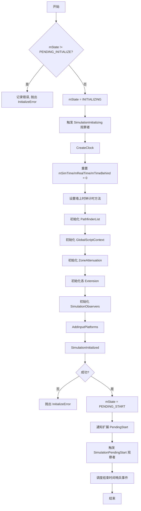

**关键步骤说明**：

1. **状态保护**（line 580）：如果 `mState != cPENDING_INITIALIZE`，抛出 `InitializeError`，防止重复初始化
2. **CreateClock()**（line 597）：基类创建普通 `WsfClockSource`；派生类（如 `WsfEventStepSimulation`）会覆盖此方法创建 `WsfRealTimeClockSource`
3. **扩展初始化**（lines 605-621）：按顺序调用各扩展的 `Initialize()` + `PrepareExtension()`
4. **AddInputPlatforms()**（line 624）：五阶段平台初始化流程（详见 2.8 节）
5. **哨兵事件**（line 647）：在 `GetEndTime() + 0.001` 处调度一个虚拟事件，确保事件队列非空

### 2.6 Start() 流程详解

```cpp
// WsfSimulation.cpp, line 889
virtual void Start()
```

**步骤**：

1. **状态校验**（lines 891-905）：只接受 `cPENDING_START` 或 `cCOMPLETE` 状态，否则抛出 `StartError`
2. **状态转换**：`mState = cSTARTING`（line 907）
3. **重置完成原因**：`mCompletionReason = cNONE`（line 908）
4. **重置时钟**：`mClockSourcePtr->ResetClock()`（line 910）
5. **启动时钟**：如果非外部启动，调用 `mClockSourcePtr->StartClock()`（lines 911-914）
6. **扩展启动**：调用各扩展的 `Start()`（lines 920-923）
7. **观察者通知**：`WsfObserver::SimulationStarting(this)`（line 924）
8. **状态转换**：`mState = cACTIVE`（line 926）

> **重启语义**：从 `cCOMPLETE` 状态可以直接调用 `Start()` 重新启动仿真，这使得仿真可以多次运行。

### 2.7 AdvanceTime() 流程详解

#### 无参版本

```cpp
// WsfSimulation.cpp, line 186
virtual double AdvanceTime()
```

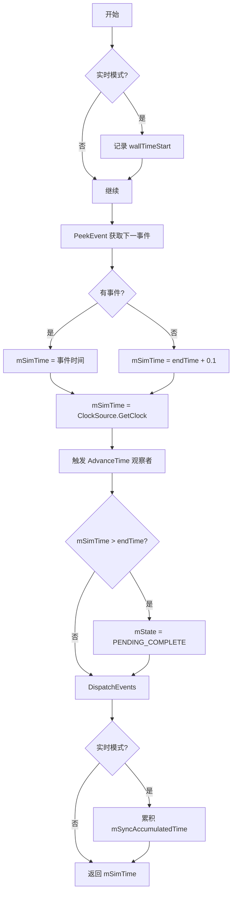

**关键逻辑**：

1. **时间获取**（lines 195-203）：从事件队列 peek 下一事件时间；如果队列为空，使用 `endTime + 0.1`
2. **时钟覆盖**（line 206）：`mSimTime = mClockSourcePtr->GetClock(mSimTime)` — 时钟源可以将时间推进到更大值（特别是实时模式下）
3. **结束检测**（lines 210-213）：如果 `mSimTime > GetEndTime()`，设置状态为 `cPENDING_COMPLETE`
4. **事件分发**（line 216）：调用 `DispatchEvents(mSimTime)`
5. **同步累积**（lines 219-226）：实时模式下，根据墙上时间差累积同步时间

#### 带时间参数版本

```cpp
// WsfSimulation.cpp, line 238
virtual double AdvanceTime(double aSimTime)
```

与无参版本类似，但使用传入的 `aSimTime` 作为基准时间，并与下一事件时间取较小值。

### 2.8 Complete() 流程详解

```cpp
// WsfSimulation.cpp, line 832
virtual void Complete(double aSimTime)
```

**步骤**：

1. **状态校验**（lines 834-839）：如果状态不是 `cACTIVE` 或 `cPENDING_COMPLETE`，记录警告
2. **状态转换**：`mState = cCOMPLETE`（line 841）
3. **设置完成原因**（lines 843-846）：如果 `mCompletionReason == cNONE` 且 `mSimTime >= mEndTime`，设置为 `cEND_TIME_REACHED`
4. **停止时钟**：`mClockSourcePtr->StopClock()`（line 848）
5. **观察者通知**：`WsfObserver::SimulationComplete(this)(aSimTime)`（line 851）
6. **平台清理**（lines 856-859）：遍历所有剩余平台，调用 `ProcessRemovePlatformEvent` 删除
7. **重置平台列表**：`ResetPlatformList()`（line 860）
8. **重置事件队列**：`mEventManager.Reset()`（line 861）
9. **扩展完成**（lines 868-871）：调用各扩展的 `Complete(aSimTime)`
10. **重置时钟**：`mClockSourcePtr->ResetClock()`（line 873）

### 2.9 事件分发机制

#### DispatchEvents

```cpp
// WsfSimulation.cpp, line 452
void WsfSimulation::DispatchEvents(double aSimTime)
{
    DispatchSimEvents(aSimTime);
    DispatchWallEvents();
}
```

#### DispatchSimEvents

```cpp
// WsfSimulation.cpp, line 488
void WsfSimulation::DispatchSimEvents(double aSimTime)
{
    DispatchEventsHelper(mEventManager, aSimTime);
}
```

#### DispatchWallEvents

```cpp
// WsfSimulation.cpp, line 497
void WsfSimulation::DispatchWallEvents()
{
    DispatchEventsHelper(mWallEventManager, mWallClock.GetClock());
}
```

#### DispatchEventsHelper（核心调度循环）

```cpp
// WsfSimulation.cpp, line 463 (匿名命名空间)
void DispatchEventsHelper(WsfEventManager& aManager, double aTime)
{
    while (WsfEvent* eventPtr = aManager.PeekEvent())
    {
        if (eventPtr->GetTime() > aTime) break;
        auto ownedEvent = aManager.PopEvent();
        if (ownedEvent->ShouldExecute())
        {
            auto disposition = ownedEvent->Execute();
            if (disposition == WsfEvent::cRESCHEDULE)
            {
                aManager.AddEvent(std::move(ownedEvent));
            }
        }
    }
}
```

**算法说明**：

1. 循环 peek 事件队列顶部
2. 如果事件时间 > 当前分发时间上限，退出循环
3. 弹出事件（转移所有权）
4. 检查 `ShouldExecute()` 标志（可被外部设为 false 以跳过事件）
5. 执行事件，获取 `EventDisposition`
6. 如果返回 `cRESCHEDULE`，将事件重新加入队列（事件可修改自身的时间和优先级）

> **设计要点**：`cRESCHEDULE` 机制允许事件自我重用，避免频繁的内存分配。事件在 `Execute()` 中修改自身 `mSimTime` 后重新入队。

### 2.10 平台管理接口

#### AddPlatform

```cpp
// WsfSimulation.cpp, line 295
bool WsfSimulation::AddPlatform(double aSimTime, WsfPlatform* aPlatformPtr)
```

**流程**：

1. 设置 `aPlatformPtr->mSimulationPtr = this`（line 298）
2. 如果 `aSimTime` 是未来时间（差值 > 0.01 秒）且非外部控制：调度 `AddPlatformEvent` 延迟添加（lines 304-311）
3. 如果是当前时间且状态 >= `cINITIALIZING`：
   - `AssignDefaultName` — 分配默认名称
   - 重复指针检查、空名称检查、重名检查
   - `AddToPlatformList` — 加入三个容器
   - `WsfObserver::PlatformAdded` — 通知观察者
   - **两阶段初始化**：`Initialize()` → `Initialize2()`
   - `PlatformInitialized` → `IntroducePlatform`
   - 如果任何步骤失败，回滚：从列表删除，通知观察者，标记已删除

#### DeletePlatform

```cpp
// WsfSimulation.cpp, line 410
void WsfSimulation::DeletePlatform(double aSimTime, WsfPlatform* aPlatformPtr, bool aDeleteMemory)
```

**延迟删除设计**（lines 420-431）：平台删除总是通过调度 `WsfOneShotEvent` 延迟执行，因为调用者可能正在该平台的代码上下文中执行。删除事件在当前仿真时间触发 `ProcessRemovePlatformEvent`。

#### 平台查找

```cpp
// 按索引查找 (line 717)
WsfPlatform* GetPlatformByIndex(size_t aIndex) const;

// 按名称查找 (line 725)
WsfPlatform* GetPlatformByName(WsfStringId aNameId) const;
```

### 2.11 随机数访问接口

```cpp
// 单线程模式访问（断言非多线程环境）
ut::Random& GetRandom();           // line 438
ut::Random& GetScriptRandom();     // line 442

// 线程安全访问（加锁/解锁）
ut::Random& LockRandom();          // line 439
void UnlockRandom();               // line 440
ut::Random& LockScriptRandom();    // line 443
void UnlockScriptRandom();         // line 444
```

> **使用约定**：在多线程更新阶段，必须使用 `Lock/Unlock` 对；在单线程上下文中，可使用 `Get` 直接访问（带有断言保护）。

### 2.12 CreateClock 与 SetClockSource

```cpp
// WsfSimulation.cpp, line 151
void WsfSimulation::CreateClock()
{
    SetClockSource(ut::make_unique<WsfClockSource>());
}
```

基类创建普通（非实时）时钟源。派生类 `WsfEventStepSimulation` 覆盖此方法以创建 `WsfRealTimeClockSource`。

```cpp
// WsfSimulation.cpp, line 691
void WsfSimulation::SetClockSource(std::unique_ptr<WsfClockSource> aClockSourcePtr)
```

1. 接管 `unique_ptr`；如果为空，创建默认 `WsfClockSource`
2. 设置时钟速率 `mClockRate`
3. 尝试 `dynamic_cast` 到 `WsfRealTimeClockSource`，成功则设置 `mRealTimeClockSourcePtr`
4. 触发 `SimulationClockRateChange` 观察者通知

---

## 3. WsfEvent 与 WsfEventManager — 事件系统

WSF 的事件系统是离散事件仿真引擎的核心驱动力。事件按时间优先级排列在队列中，由 `WsfEventManager` 管理和调度。

### 3.1 WsfEvent 基类

> **源文件**：`src/core/wsf/source/WsfEvent.hpp` (line 28)

```cpp
class WsfEvent
{
public:
    enum EventDisposition
    {
        cDELETE,      // 执行后删除事件
        cRESCHEDULE   // 执行后重新入队（事件可修改自身时间）
    };

    WsfEvent() = default;
    WsfEvent(double aSimTime, int aPriority = 0);
    virtual ~WsfEvent() = default;

    // 禁止拷贝
    WsfEvent(const WsfEvent&) = delete;
    WsfEvent& operator=(const WsfEvent&) = delete;

    virtual EventDisposition Execute() = 0;  // 纯虚函数

    double GetTime() const;         // return mSimTime
    int GetPriority() const;        // return mPriority
    bool ShouldExecute() const;     // return mExecute
    void SetTime(double aSimTime);
    void SetPriority(int aPriority);
    void SetShouldExecute(bool aExecute);
    WsfSimulation* GetSimulation() const;
    void AddedToEventQueue(WsfSimulation& aSimulation);

private:
    double          mSimTime{0.0};       // 事件触发时间
    WsfSimulation*  mSimulationPtr{nullptr}; // 所属仿真指针
    int             mPriority{0};        // 优先级（数值越小越优先）
    bool            mExecute{true};      // 是否执行（可外部禁用）
};
```

#### 设计要点

- **`cRESCHEDULE` 机制**：事件的 `Execute()` 返回 `cRESCHEDULE` 时，事件管理器会将该事件重新入队。事件可在 `Execute()` 内部修改自身的 `mSimTime`，实现周期性触发。
- **`ShouldExecute()` 标志**：允许外部将事件标记为"跳过"，事件仍在队列中但不会被执行。这提供了一种软取消机制。
- **禁止拷贝**：事件不可拷贝，只能通过 `std::unique_ptr` 管理所有权。

### 3.2 WsfEventManager 事件管理器

> **源文件**：`src/core/wsf/source/WsfEventManager.hpp` (line 43), `WsfEventManager.cpp`

#### 类定义

```cpp
class WsfEventManager
{
public:
    WsfEventManager(WsfSimulation& aSimulation);
    virtual ~WsfEventManager() = default;

    // 禁止拷贝，允许移动
    WsfEventManager(const WsfEventManager&) = delete;
    WsfEventManager& operator=(const WsfEventManager&) = delete;
    WsfEventManager(WsfEventManager&&) = default;
    WsfEventManager& operator=(WsfEventManager&&) = default;

    virtual void AddEvent(std::unique_ptr<WsfEvent> aEventPtr);
    virtual WsfEvent* PeekEvent() const;
    virtual std::unique_ptr<WsfEvent> PopEvent();
    virtual void Reset();

protected:
    mutable std::recursive_mutex mMutex;  // 线程安全互斥锁

private:
    struct Event
    {
        using Key = std::tuple<double, int, unsigned int>;  // (时间, 优先级, 计数器)
        Event(const Key& aKey, std::unique_ptr<WsfEvent> aEventPtr)
           : mKey(aKey), mEventPtr(std::move(aEventPtr)) {}
        bool operator>(const Event& rhs) const { return mKey > rhs.mKey; }
        Key                               mKey;
        mutable std::unique_ptr<WsfEvent> mEventPtr;
    };

    using EventQueue = std::priority_queue<Event, std::vector<Event>, std::greater<Event>>;

    WsfSimulation& mSimulation;  // 所属仿真引用
    EventQueue     mEvents;       // 优先队列
    unsigned int   mCounter{0U};  // FIFO 计数器
};
```

#### Event::Key 三元组

```
Key = (time, priority, counter)
       ↓       ↓        ↓
     double    int    unsigned int
```

排序规则（`std::tuple` 默认字典序比较）：

1. **时间优先**：先执行时间最早的事件
2. **优先级次之**：同一时间的事件，`mPriority` 值越小越先执行
3. **FIFO 保证**：同一时间、同一优先级的事件，按插入顺序（`mCounter` 递增）执行

#### AddEvent 实现

```cpp
// WsfEventManager.cpp, line 22
void WsfEventManager::AddEvent(std::unique_ptr<WsfEvent> aEventPtr)
{
    aEventPtr->AddedToEventQueue(mSimulation);
    auto                                  time     = aEventPtr->GetTime();
    auto                                  priority = aEventPtr->GetPriority();
    std::lock_guard<std::recursive_mutex> lock(mMutex);
    mEvents.emplace(std::make_tuple(time, priority, mCounter++), std::move(aEventPtr));
}
```

- 设置事件的仿真指针
- 在锁保护下构建 `Key` 并入队
- `mCounter` 自增保证 FIFO 顺序

#### PeekEvent 实现

```cpp
// WsfEventManager.cpp, line 32
WsfEvent* WsfEventManager::PeekEvent() const
{
    std::lock_guard<std::recursive_mutex> lock(mMutex);
    return mEvents.empty() ? nullptr : mEvents.top().mEventPtr.get();
}
```

返回队首事件的裸指针，不转移所有权。

#### PopEvent 实现

```cpp
// WsfEventManager.cpp, line 44
std::unique_ptr<WsfEvent> WsfEventManager::PopEvent()
{
    std::lock_guard<std::recursive_mutex> lock(mMutex);
    auto eventPtr = std::move(mEvents.top().mEventPtr);
    mEvents.pop();
    return eventPtr;
}
```

通过 `mutable` 修饰的 `mEventPtr`，在 `const` 引用上移动所有权，然后弹出队列。

#### Reset 实现

```cpp
// WsfEventManager.cpp, line 57
void WsfEventManager::Reset()
{
    std::lock_guard<std::recursive_mutex> lock(mMutex);
    EventQueue empty;
    std::swap(mEvents, empty);
}
```

用空队列替换来释放所有事件。

### 3.3 事件调度机制

#### 双事件队列架构

`WsfSimulation` 持有两个独立的事件管理器：

| 管理器 | 用途 | 时间基准 |
|--------|------|----------|
| `mEventManager` | 仿真时间事件 | 仿真时间 `mSimTime` |
| `mWallEventManager` | 墙上时间事件 | 真实墙上时钟 `WallClock` |

仿真时间事件受仿真速率影响（如 2x 速率下，仿真时间过得更快）。墙上时间事件始终基于真实时间流逝，适用于需要与外部系统同步的场景（如 DIS 心跳、XIO 通信）。

#### 事件分发流程

```
DispatchEvents(simTime)
    ├── DispatchSimEvents(simTime)
    │       └── DispatchEventsHelper(mEventManager, simTime)
    └── DispatchWallEvents()
            └── DispatchEventsHelper(mWallEventManager, wallClock.GetClock())
```

#### cRESCHEDULE 事件重用

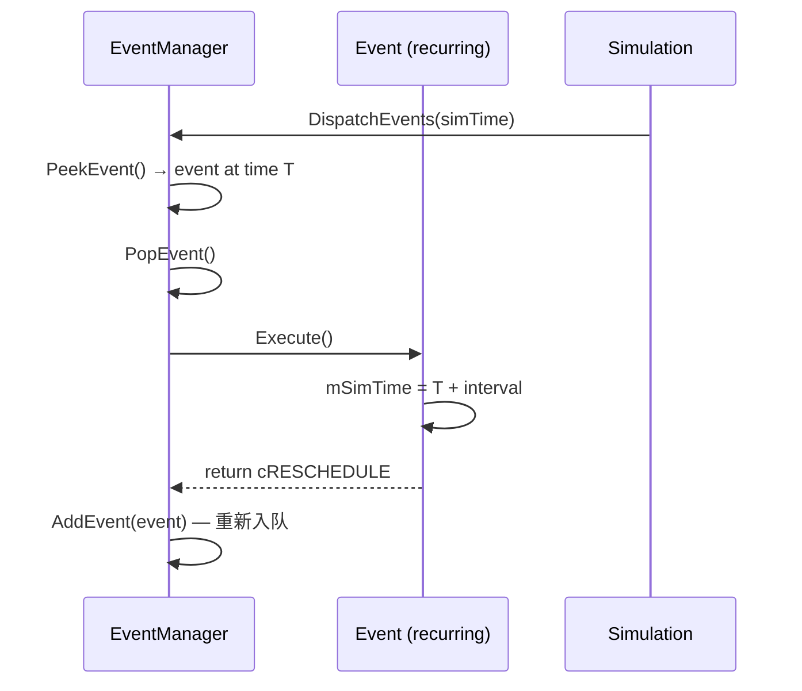

典型用法：传感器更新事件以固定间隔重复触发。在 `Execute()` 中计算下一次更新时间并设置到 `mSimTime`，返回 `cRESCHEDULE`。

#### WsfOneShotEvent 与 WsfRecurringEvent

```cpp
// WsfEvent.hpp, line 138
class WsfOneShotEvent : public WsfEventAdapterT<void>
{
public:
    WsfOneShotEvent(double aSimTime, const ExecuteFn& aExecuteFn);
    EventDisposition Execute() override { mExecuteFn(); return cDELETE; }
};

// WsfEvent.hpp, line 163
class WsfRecurringEvent : public WsfEventAdapterT<WsfEvent::EventDisposition, WsfEvent&>
{
public:
    WsfRecurringEvent(double aSimTime, const ExecuteFn& aExecuteFn);
    EventDisposition Execute() override { return mExecuteFn(*this); }
};
```

- **WsfOneShotEvent**：执行一次后自动删除（`cDELETE`）
- **WsfRecurringEvent**：执行后由回调决定是否重新调度（回调返回 `EventDisposition`）

#### WsfSimulation::AddPlatformEvent

```cpp
// WsfSimulation.hpp, line 158
class WsfSimulation::AddPlatformEvent : public WsfEvent
{
public:
    AddPlatformEvent(double aSimTime, WsfPlatform* aPlatformPtr);
    ~AddPlatformEvent() override;
    EventDisposition Execute() override;
private:
    WsfPlatform* mPlatformPtr;
};
```

用于延迟添加平台的专用事件。当 `AddPlatform()` 被调用且目标时间在未来时，调度此事件。

---

## 4. WsfClockSource — 时钟管理

时钟源负责管理仿真时间的推进。基类提供简单的时间上限裁剪，实时时钟源在此基础上增加了墙上时间同步。

### 4.1 WsfClockSource 基类

> **源文件**：`src/core/wsf/source/WsfClockSource.hpp` (line 24), `WsfClockSource.cpp`

```cpp
class WsfClockSource
{
public:
    WsfClockSource() = default;
    virtual ~WsfClockSource() = default;

    // 禁止拷贝和移动
    WsfClockSource(const WsfClockSource&) = delete;
    WsfClockSource& operator=(const WsfClockSource&) = delete;
    WsfClockSource(WsfClockSource&&) = delete;
    WsfClockSource& operator=(WsfClockSource&&) = delete;

    virtual double GetClock(double aClock) const;
    virtual void ResetClock(double aAccumulatedTime = 0.0);
    virtual void SetClock(double aClock);
    virtual void SetClockRate(double aClockRate);
    virtual double GetClockRate() const;
    virtual void StartClock();
    virtual void StopClock();
    virtual void SetMaximumClock(double aClock);

    bool IsStopped() const { return mClockPaused; }

protected:
    double mClockRate{1.0};            // 时钟速率倍数
    bool   mClockPaused{false};        // 是否暂停
    double mMaximumClock{1.0E300};     // 最大时钟值
};
```

#### 基类实现

| 方法 | 实现 |
|------|------|
| `GetClock(double)` | `return min(aClock, mMaximumClock)` — 简单裁剪 |
| `ResetClock(double)` | 空操作（no-op） |
| `SetClock(double)` | 空操作（no-op） |
| `SetClockRate(double)` | `mClockRate = aClockRate` |
| `GetClockRate()` | `return mClockRate` |
| `StartClock()` | `mClockPaused = false` |
| `StopClock()` | `mClockPaused = true` |
| `SetMaximumClock(double)` | `mMaximumClock = aClock` |

> **设计说明**：基类的 `GetClock()` 直接返回传入值（仅裁剪到最大值）。这意味着在非实时模式下，仿真时间完全由事件驱动，时钟源不干预时间推进。

### 4.2 WsfRealTimeClockSource 实时钟源

> **源文件**：`src/core/wsf/source/WsfRealTimeClockSource.hpp` (line 29), `WsfRealTimeClockSource.cpp`

```cpp
class WsfRealTimeClockSource : public WsfClockSource
{
public:
    WsfRealTimeClockSource();
    ~WsfRealTimeClockSource() override;

    double GetClock(double aClock) const override;
    void ResetClock(double aAccumulatedTime = 0.0) override;
    void SetClock(double aClock) override;
    void SetClockRate(double aClockRate) override;
    void StartClock() override;
    void StopClock() override;
    void SetMaximumClock(double aClock) override;

    void SetQuietMode(bool aQuietMode);
    double GetElapsedWallTime();
    void SetTimingMethod(UtWallClock::TimingMethod aTimingMethod);

private:
    UtWallClock mWallClock;          // 墙上时钟
    double      mTimeAccumulated;    // 累积仿真时间
    bool        mQuietMode;          // 静默模式（减少日志）
};
```

#### 核心设计：累积时间模型

实时钟源的核心思想是将仿真时间分为两部分：

```
仿真时间 = mTimeAccumulated（已累积时间）+ wallElapsed × mClockRate（当前区间增量）
```

- **mTimeAccumulated**：在暂停/速率变更时快照的仿真时间
- **wallElapsed × mClockRate**：自上次快照以来，根据墙上时间流逝和速率倍数计算的增量

#### GetClock 实现

```cpp
// WsfRealTimeClockSource.cpp, line 33
double WsfRealTimeClockSource::GetClock(double aClock) const
{
    double simulationClock = mTimeAccumulated;
    if (!mClockPaused)
    {
        simulationClock += mWallClock.GetClock() * mClockRate;
        if (simulationClock > mMaximumClock)
        {
            simulationClock = mMaximumClock;
        }
    }
    if (aClock < simulationClock)
    {
        simulationClock = aClock;
    }
    return simulationClock;
}
```

**返回值**：`min(aClock, mTimeAccumulated + wallElapsed × mClockRate)`，受 `mMaximumClock` 截断。

- 如果暂停，返回 `mTimeAccumulated`（无增量）
- `aClock` 参数（来自事件队列）作为上界：事件时间不能被时钟超越

#### SetClockRate 的时间防丢失设计

```cpp
// WsfRealTimeClockSource.cpp, line 85
void WsfRealTimeClockSource::SetClockRate(double aClockRate)
{
    assert(aClockRate >= 0.0);
    if (!mClockPaused)
    {
        mTimeAccumulated = GetClock(1.0E300);  // 快照当前仿真时间
        mWallClock.ResetClock();                // 重置墙上时钟起点
    }
    WsfClockSource::SetClockRate(aClockRate);
}
```

**关键设计**：在变更速率之前，先将当前仿真时间快照到 `mTimeAccumulated`，然后重置墙上时钟。这确保了速率变更不会导致时间丢失或跳跃。

**示例**：
```
初始：accumulated=0, rate=1.0, 已运行 10s → GetClock=10.0
变更为 rate=2.0：
  1. accumulated = GetClock(1.0E300) = 10.0
  2. wallClock.ResetClock()
  3. rate = 2.0
再运行 5s 墙上时间 → GetClock = 10.0 + 5.0 × 2.0 = 20.0 ✓
```

#### 暂停/恢复语义

**StopClock（暂停）**：
```cpp
// WsfRealTimeClockSource.cpp, line 116
void WsfRealTimeClockSource::StopClock()
{
    if (!mClockPaused)
    {
        mTimeAccumulated += mWallClock.GetClock() * mClockRate;  // 累积当前区间
        mClockPaused = true;
    }
}
```

**StartClock（恢复）**：
```cpp
// WsfRealTimeClockSource.cpp, line 99
void WsfRealTimeClockSource::StartClock()
{
    if (mClockPaused)
    {
        mClockPaused = false;
        mWallClock.ResetClock();  // 重置墙上时钟起点
    }
}
```

暂停时累积当前增量到 `mTimeAccumulated`，恢复时重置墙上时钟起点。这确保了暂停/恢复操作不会丢失或重复计算时间。

#### SetClock 实现

```cpp
// WsfRealTimeClockSource.cpp, line 67
void WsfRealTimeClockSource::SetClock(double aClock)
{
    assert(aClock >= 0.0);
    if (!mClockPaused)
    {
        mWallClock.ResetClock();  // 关闭当前区间
    }
    mTimeAccumulated = aClock;
    if (mTimeAccumulated > mMaximumClock) { mTimeAccumulated = mMaximumClock; }
    WsfClockSource::SetClock(aClock);
}
```

直接设置累积时间，如果未暂停则重置墙上时钟（关闭当前计算区间）。

#### SetMaximumClock 实现

```cpp
// WsfRealTimeClockSource.cpp, line 132
void WsfRealTimeClockSource::SetMaximumClock(double aClock)
{
    // 如果当前时间恰好等于旧上限，将其对齐到新上限
    if (mTimeAccumulated == mMaximumClock) { mTimeAccumulated = aClock; }
    WsfClockSource::SetMaximumClock(aClock);
}
```

### 4.3 时间流图示

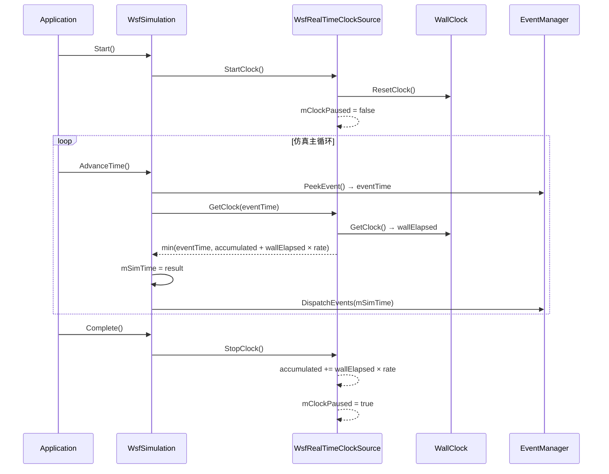

### 4.4 WsfSimulation 中的 CreateClock 派生

基类 `WsfSimulation::CreateClock()` 创建普通 `WsfClockSource`（非实时）。派生类覆盖此方法：

| 仿真类型 | CreateClock 行为 |
|----------|-----------------|
| `WsfSimulation`（基类） | 创建 `WsfClockSource`（简单时间裁剪） |
| `WsfEventStepSimulation` | 创建 `WsfRealTimeClockSource`（墙上时间同步） |
| `WsfFrameStepSimulation` | 创建 `WsfRealTimeClockSource`（墙上时间同步） |

`SetClockSource()` 中的 `dynamic_cast` 检测是否为实时钟源，如果是则设置 `mRealTimeClockSourcePtr` 快速指针。

---

## 5. WsfSimulationInput — 仿真输入配置

`WsfSimulationInput` 定义仿真运行时的配置参数。通过继承组合不同仿真模式的参数。

> **源文件**：`src/core/wsf/source/WsfSimulationInput.hpp` (line 29), `WsfSimulationInput.cpp`

### 5.1 WsfSimulationInput 基类

```cpp
class WsfSimulationInput
{
public:
    WsfSimulationInput(WsfScenario& aScenario);
    virtual ~WsfSimulationInput();
    virtual bool ProcessInput(UtInput& aInput);
    virtual void LoadComplete();

protected:
    WsfScenario* mScenarioPtr;                          // 所属场景
    bool         mIsRealTime{false};                    // 实时模式
    bool         mMultiThreaded{false};                 // 多线程模式
    int          mWallClockTimingMethod{(int)UtWallClock::cDEFAULT}; // 墙上时钟计时方法
    double       mMinimumMoverTimestep{-1.0};           // 最小移动器时间步长
    double       mEndTime{60.0};                        // 仿真结束时间（秒）
    double       mClockRate{1.0};                       // 时钟速率倍数
    WsfDateTime* mDateTimePtr{new WsfDateTime};         // 日期时间
    bool         mUseConstantRequiredPd{false};         // 使用恒定检测概率
    bool         mRandomizeFrequency{false};            // 随机化频率
    bool         mUseDefaultFrequency{false};           // 使用默认频率
    int          mNumberOfThreads{4};                   // 工作线程数
    double       mBreakUpdateTime{0.5};                 // 多线程超时时间（秒）
    bool         mDebugMultiThreading{false};           // 多线程调试模式
    ProcessPriority mProcessPriority{cPP_ABOVE_NORMAL}; // 进程优先级
    bool         mAllowClutterCalculationShortcuts{true};   // 允许杂波计算捷径
    bool         mAllowEM_PropagationCalculationShortcuts{true}; // 允许 EM 传播捷径
};
```

#### 关键参数说明

| 参数 | 默认值 | 说明 |
|------|--------|------|
| `mIsRealTime` | `false` | 启用实时模式（仿真时间与墙上时间同步） |
| `mMultiThreaded` | `false` | 启用多线程更新 |
| `mEndTime` | `60.0` | 仿真结束时间（仿真秒） |
| `mClockRate` | `1.0` | 时钟速率倍数（2.0 = 2 倍速） |
| `mNumberOfThreads` | `4` | 工作线程数 |
| `mBreakUpdateTime` | `0.5` | 传感器多线程更新超时（秒） |
| `mMinimumMoverTimestep` | `-1.0` | 移动器最小时间步长（-1 表示无限制） |
| `mProcessPriority` | `cPP_ABOVE_NORMAL` | 进程优先级（仅 Windows） |

### 5.2 派生输入类

#### WsfEventStepSimulationInput

```cpp
class WsfEventStepSimulationInput
{
public:
    double mThreadUpdateInterval{1.0};          // 线程更新间隔
    int    mPlatformThreadUpdateMultiplier{1};  // 平台线程更新倍数
    int    mSensorThreadUpdateMultiplier{1};    // 传感器线程更新倍数
};
```

#### WsfFrameStepSimulationInput

```cpp
class WsfFrameStepSimulationInput
{
public:
    double mFrameTime{0.25};  // 帧步进时间（秒）
};
```

#### WsfDefaultSimulationInput

```cpp
class WsfDefaultSimulationInput : public WsfSimulationInput,
                                  public WsfEventStepSimulationInput,
                                  public WsfFrameStepSimulationInput
```

多重继承聚合所有参数。`ProcessInput()` 链式调用三个基类的 `ProcessInput()`。

### 5.3 参数传递路径

```
WsfScenario
    └── WsfSimulationInput (owned)
            ↓ GetSimulationInput()
        WsfSimulation (constructor copies params)
            ├── mMultiThreaded
            ├── mEndTime
            ├── mIsRealTime
            ├── mClockRate
            └── mMultiThreadManager(numberOfThreads, breakUpdateTime, ...)
```

---

## 6. WsfMultiThreadManager — 多线程管理

`WsfMultiThreadManager` 实现仿真平台和传感器的多线程更新，使用工作队列 + 线程池架构。

> **源文件**：`src/core/wsf/source/WsfMultiThreadManager.hpp` (line 34), `WsfMultiThreadManager.cpp`

### 6.1 架构概述

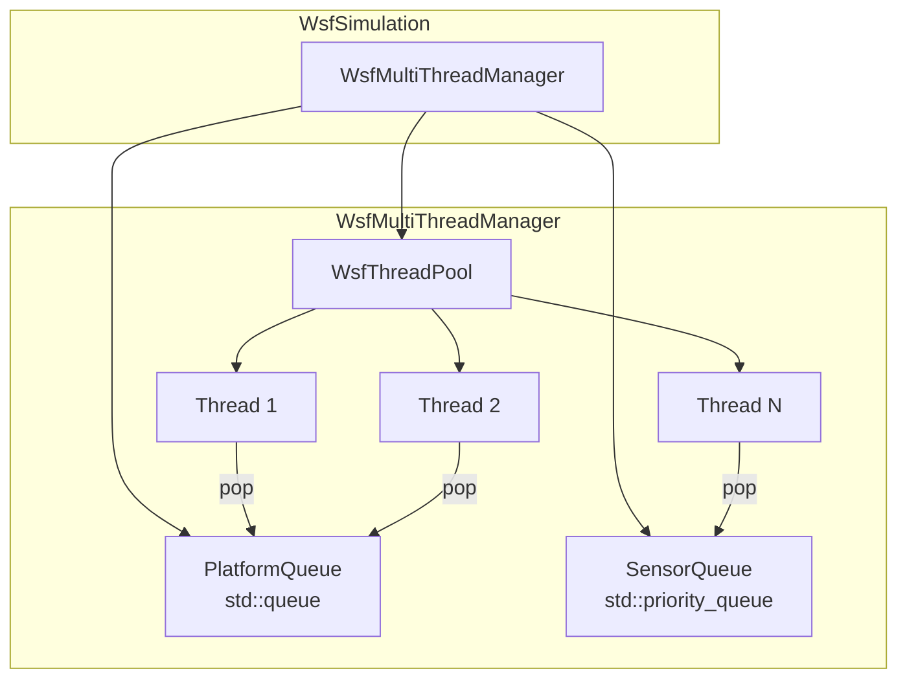

### 6.2 成员变量

| 行号 | 声明 | 说明 |
|------|------|------|
| 169 | `WsfSimulation* mSimulationPtr` | 所属仿真指针 |
| 170 | `std::queue<PlatformElement> mPlatformQueue` | 平台工作队列（FIFO） |
| 171 | `std::priority_queue<SensorElement> mSensorQueue` | 传感器工作队列（最小堆，按下次更新时间排序） |
| 173 | `unsigned int mNumberOfThreads` | 工作线程数 |
| 174 | `WsfThreadPool<SimulationUpdateThread, ThreadFactory>* mThreads` | 线程池指针 |
| 176 | `std::vector<size_t> mThreadedPlatforms` | 可多线程更新的平台索引 |
| 177 | `std::vector<size_t> mNonThreadedPlatforms` | 需串行更新的平台索引 |
| 179 | `std::vector<WsfSensor*> mThreadedSensors` | 可多线程更新的传感器 |
| 180 | `std::vector<WsfSensor*> mNonThreadedSensors` | 需串行更新的传感器 |
| 182 | `double mBreakUpdateTime` | 实时模式超时时间（秒） |
| 183 | `bool mBreakUpdate` | 传感器更新是否因超时中断 |
| 185 | `bool mDebug` | 调试日志标志 |
| 187 | `std::recursive_mutex mMutex` | 保护队列弹出操作 |

### 6.3 平台分类机制

平台在注册时根据其移动器的线程安全性进行分类：

```cpp
// WsfMultiThreadManager.cpp, line 253
if ((aPlatformPtr->GetMover() != nullptr) && aPlatformPtr->GetMover()->ThreadSafe())
{
    mThreadedPlatforms.push_back(platformIndex);
}
else
{
    mNonThreadedPlatforms.push_back(platformIndex);
}
```

**分类规则**：
- **线程安全平台**：拥有非空移动器且 `ThreadSafe()` 返回 `true` → 加入 `mThreadedPlatforms`
- **非线程安全平台**：无移动器或移动器非线程安全 → 加入 `mNonThreadedPlatforms`

分类后，平台被标记为 `SetUpdateLocked(true)`，防止在多线程更新期间被意外修改。

传感器使用类似逻辑（line 338），跳过 `IsSlave()` 或 `IsExternallyControlled()` 的传感器。

### 6.4 工作线程模型

#### WsfThreadPool 模板类

> **源文件**：`src/core/wsf/source/WsfThreadPool.hpp` (header-only)

```cpp
template<class Worker, class WorkerFactory = WsfThreadPool_DefaultWorkerFactor<Worker>>
class WsfThreadPool
{
public:
    void Start(unsigned int aNumThreads);
    void Stop();
    bool AssignWork(size_t aNumTasks = 0u);  // 0 = 唤醒所有线程
    void WaitUntilAllWorkDone();
    bool TryWaitUntilAllWorkDone(double aSecsToWait);

private:
    WorkerFactory  mFactory;
    WorkerThreads  mThread_vector;  // std::vector<Worker*>
};
```

#### WsfThread 基类状态机

```cpp
enum FunctionType {
    STOPPED   = 0,  // 已停止
    AVAILABLE = 1,  // 空闲，等待工作
    ASSIGNED  = 2,  // 已分配工作
    PAUSED    = 3,  // 已暂停
    CRITICAL  = 4   // 临界状态
};
```

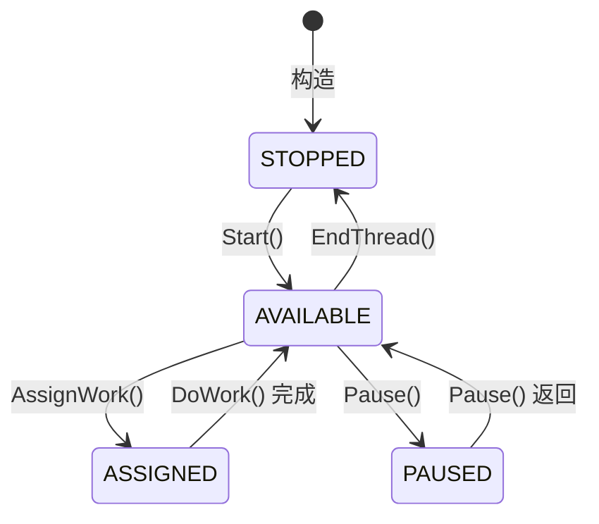

线程主循环在 `Run()` 中实现：
- `AVAILABLE`：通知 `mWorkDoneCond`，然后阻塞在 `mWorkAddedCond` 上等待
- `ASSIGNED`：调用虚函数 `DoWork()`，根据返回值转换状态

#### SimulationUpdateThread 工作逻辑

```cpp
// WsfMultiThreadManager.cpp, line 360
WsfThread::FunctionType WsfMultiThreadManager::SimulationUpdateThread::DoWork()
{
    // 1. 优先处理平台队列
    PlatformElement platformElement;
    if (PopNextPlatformElement(platformElement))
    {
        if (platformElement.mPlatformIndex != 0)
        {
            WsfPlatform* platformPtr = mManagerPtr->mSimulationPtr
                ->GetPlatformByIndex(platformElement.mPlatformIndex);
            if (platformPtr)
                platformPtr->UpdateMultiThread(platformElement.mSimTime);
        }
    }
    // 2. 其次处理传感器队列
    else if (PopNextSensorElement(sensorElement))
    {
        if (sensorElement.mSensorPtr)
            sensorElement.mSensorPtr->Update(sensorElement.mSimTime);
    }

    // 3. 终止检查
    if (NoWork() || mManagerPtr->BreakUpdate())
        return AVAILABLE;
    return ASSIGNED;  // 继续处理下一个工作项
}
```

**设计要点**：
- 平台优先级高于传感器
- `NoWork()` 检查两个队列是否都为空
- `BreakUpdate()` 在实时超时时返回 true，强制线程停止

#### SensorElement 最小堆排序

```cpp
class SensorElement {
    bool operator<(const SensorElement& aRhs) const {
        return (mNextUpdateTime > aRhs.mNextUpdateTime);  // 反转，最小堆
    }
    WsfSensor* mSensorPtr;
    double     mSimTime;
    double     mNextUpdateTime;  // 排序键
};
```

`operator<` 使用 `>` 而非 `<`，使 `std::priority_queue` 表现为最小堆（下次更新时间最早的传感器优先处理）。

### 6.5 UpdatePlatforms 流程

```cpp
// WsfMultiThreadManager.cpp, line 89
void WsfMultiThreadManager::UpdatePlatforms(double aCurrentTime)
```

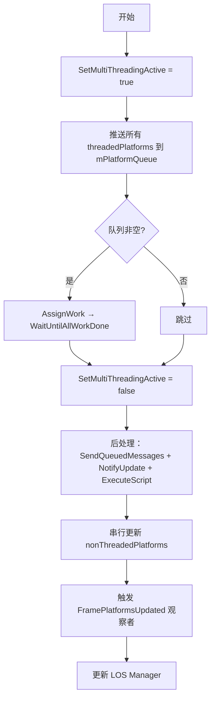

### 6.6 UpdateSensors 流程与实时超时

```cpp
// WsfMultiThreadManager.cpp, line 145
void WsfMultiThreadManager::UpdateSensors(double aCurrentTime)
```

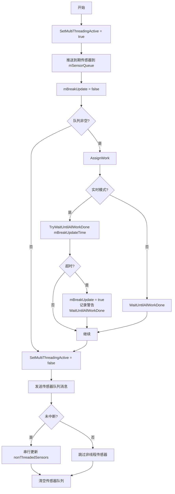

**实时超时机制**：

当仿真处于实时模式时，传感器多线程更新使用 `TryWaitUntilAllWorkDone(mBreakUpdateTime)` 进行有界等待：
- 如果所有线程在 `mBreakUpdateTime`（默认 0.5 秒）内完成，正常继续
- 如果超时，设置 `mBreakUpdate = true`，记录警告日志
- 超时后仍需等待所有线程完成（`WaitUntilAllWorkDone`），以保证线程安全不变量
- 当 `mBreakUpdate` 为 true 时，跳过非线程安全传感器的串行更新

### 6.7 WsfSimulation 与 WsfMultiThreadManager 的交互

| 场景 | 调用 |
|------|------|
| 仿真初始化 | `GetMultiThreadManager().Initialize()` |
| 平台添加 | `GetMultiThreadManager().AddPlatform(simTime, platform)` |
| 平台删除 | `GetMultiThreadManager().PlatformDeleted(simTime, platform)` |
| 传感器开启 | `GetMultiThreadManager().TurnSensorOn(simTime, sensor)` |
| 传感器关闭 | `GetMultiThreadManager().TurnSensorOff(simTime, sensor)` |
| 帧更新（FrameStep） | `GetMultiThreadManager().UpdatePlatforms(time)` / `UpdateSensors(time)` |
| 事件更新（EventStep） | 通过 `WsfMultiThreadUpdatePlatformsEvent` / `WsfMultiThreadUpdateSensorsEvent` 调度 |
| 仿真完成 | `GetMultiThreadManager().Complete(simTime)` |

`mMultiThreadManager` 是 `WsfSimulation` 的直接成员（非指针），在构造函数初始化列表中构造。

---

## 7. 随机数管理

### 7.1 双 RNG 架构

`WsfSimulation` 维护两个独立的随机数生成器实例：

| 实例 | 成员 | 互斥锁 | 用途 |
|------|------|--------|------|
| 核心 RNG | `mRandom` | `mRandomMutex` | 仿真模型内部使用（传感器检测、移动器噪声等） |
| 脚本 RNG | `mScriptRandom` | `mScriptRandomMutex` | 脚本上下文使用（`WsfScriptProcessor` 等） |

两个 RNG 使用相同的种子初始化（来自 `aScenario.GetRandomSeed(aRunNumber)`），但后续独立演进。这种分离确保了：
- 核心模型的随机性不受脚本影响
- 脚本的随机性不受核心模型影响
- 相同种子和场景可重现结果

### 7.2 UtRandom 包装类

> **源文件**：`src/tools/util/source/UtRandom.hpp` (line 28)

```cpp
namespace ut {
class Random
{
public:
    void SetSeed(unsigned int aSeed);
    unsigned int GetSeed() const;

    // 均匀分布
    template<class T = double> T Uniform(T aMin = 0.0, T aMax = 1.0);      // 浮点
    template<class T = int>    T Uniform(T aMin = 0, T aMax = INT_MAX);     // 整数

    // 伯努利族
    bool Bernoulli(double aP = 0.5);
    template<class T = int> T Binomial(T aT = 1, double aP = 0.5);
    template<class T = int> T NegativeBinomial(T aK = 1, double aP = 0.5);
    template<class T = int> T Geometric(double aP = 0.5);

    // 泊松族
    template<class T = int>    T Poisson(double aMean = 1.0);
    template<class T = double> T Exponential(T aLambda = 1.0);
    template<class T = double> T Gamma(T aAlpha = 1.0, T aBeta = 1.0);
    template<class T = double> T Weibull(T aA = 1.0, T aB = 1.0);
    template<class T = double> T ExtremeValue(T aA = 0.0, T aB = 1.0);

    // 正态族
    template<class T = double> T Gaussian(T aMean = 0.0, T aStdDev = 1.0);  // = Normal
    template<class T = double> T Normal(T aMean = 0.0, T aStdDev = 1.0);
    template<class T = double> T LogNormal(T aM = 0.0, T aS = 1.0);
    template<class T = double> T ChiSquared(T aN = 1.0);
    template<class T = double> T Cauchy(T aA = 0.0, T aB = 1.0);
    template<class T = double> T FisherF(T aM = 1.0, T aN = 1.0);
    template<class T = double> T StudentT(T aN = 1);
    template<class T = double> T Rayleigh(T aRadius);  // 自定义实现

private:
    unsigned int   mSeed{1};
    std::mt19937   mGen{1};  // Mersenne Twister 19937
};
}
```

**底层引擎**：`std::mt19937`（Mersenne Twister 19937），默认种子为 1。

**Rayleigh 分布**：唯一不直接使用标准库分布的方法，通过逆 CDF 方法实现：
```cpp
T Rayleigh(T aRadius) {
    return sqrt(-aRadius^2 * log(Uniform<T>()) / log(2.0));
}
```

### 7.3 线程安全访问模型

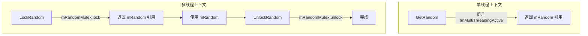

**访问规则**：

| 方法 | 线程安全 | 使用场景 |
|------|----------|----------|
| `GetRandom()` | 否（带断言） | 单线程阶段（初始化、事件处理） |
| `LockRandom()` / `UnlockRandom()` | 是 | 多线程更新阶段 |
| `GetScriptRandom()` | 否（带断言） | 脚本在单线程阶段执行 |
| `LockScriptRandom()` / `UnlockScriptRandom()` | 是 | 脚本在多线程阶段执行 |

**实现**（`WsfSimulation.cpp`）：
```cpp
// 单线程访问（line 1573）
ut::Random& WsfSimulation::GetRandom()
{
    assert(!mMultiThreadingActive);  // 断言不在多线程阶段
    return mRandom;
}

// 线程安全访问（line 1582）
ut::Random& WsfSimulation::LockRandom()
{
    mRandomMutex.lock();
    return mRandom;
}
void WsfSimulation::UnlockRandom()
{
    mRandomMutex.unlock();
}
```

> **注意**：使用 `std::recursive_mutex`，允许同一线程多次加锁（递归锁）。这在复杂调用链中避免了死锁。

---

## 8. 核心控制流时序图

本章通过 UML 时序图展示仿真核心控制类之间的协作流程，涵盖完整的仿真生命周期、事件调度和多线程更新三个关键场景。

### 8.1 完整仿真生命周期时序图

下图展示从仿真创建到完成的完整生命周期，包括 Initialize → Start → AdvanceTime 循环 → Complete 四个阶段：

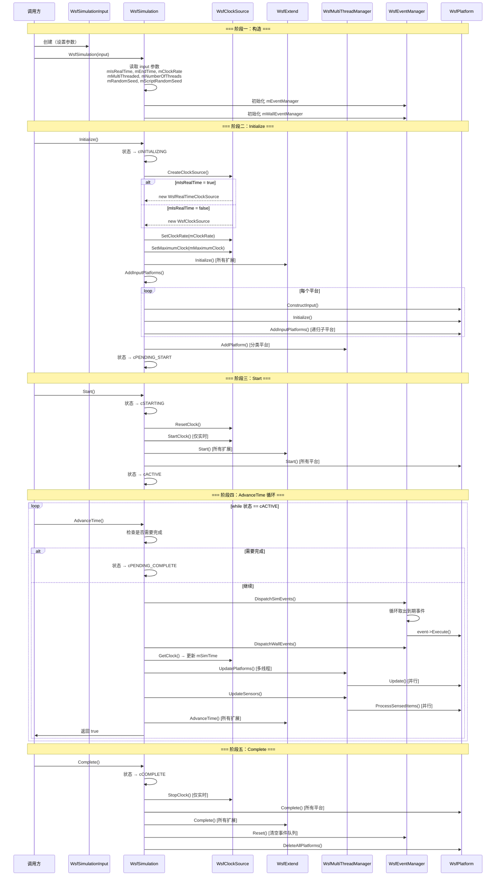

**时序说明**：

1. **构造阶段**：调用方创建 `WsfSimulationInput` 并配置参数，传入 `WsfSimulation` 构造函数
2. **Initialize 阶段**：创建时钟源、初始化扩展、构建平台层次结构、对多线程管理器注册平台
3. **Start 阶段**：启动时钟、通知所有扩展和平台开始运行
4. **AdvanceTime 循环**：核心仿真循环，每次调用处理一个时间步，直到满足结束条件
5. **Complete 阶段**：停止时钟、清理平台、重置事件队列

### 8.2 事件调度时序图

下图展示 `DispatchEventsHelper` 的内部工作流程，这是事件系统的核心调度机制：

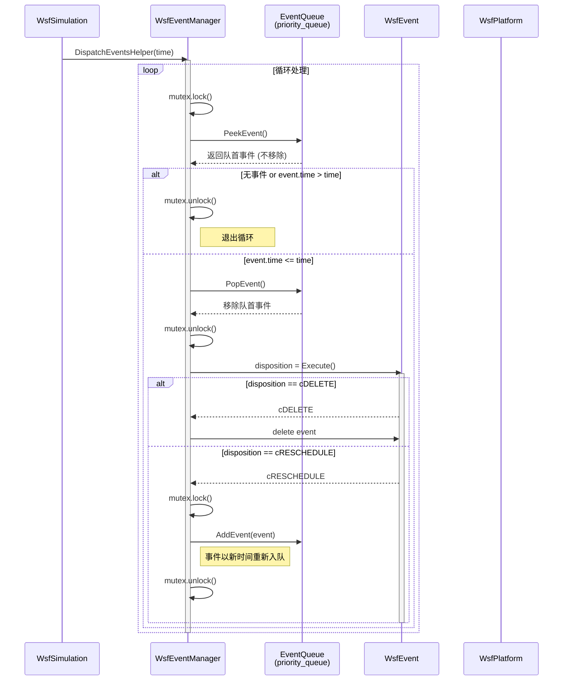

**事件调度要点**：

| 要点 | 说明 |
|------|------|
| **锁粒度** | 每次 Peek/Pop 操作加锁，Execute 在锁外执行 |
| **时间边界** | 只处理 `event.time <= dispatchTime` 的事件 |
| **cRESCHEDULE** | 事件执行后以新时间重新入队，避免 delete + new 开销 |
| **FIFO 保证** | 同一时间、同一优先级的事件按入队顺序（counter）执行 |
| **递归锁** | `std::recursive_mutex` 允许 Execute 内部再调用 AddEvent |

### 8.3 多线程更新时序图

下图展示多线程模式下 `UpdatePlatforms` 和 `UpdateSensors` 的协作流程：

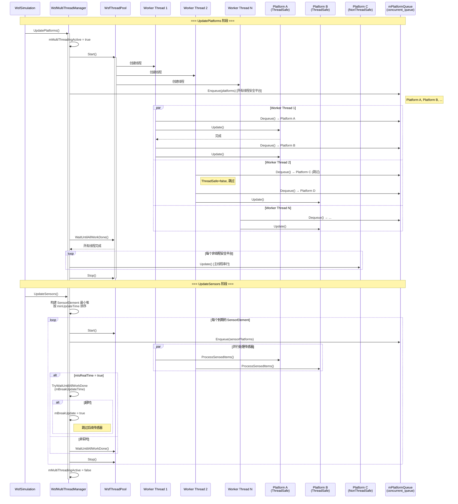

**多线程协作要点**：

| 要点 | 说明 |
|------|------|
| **平台分类** | `mover->ThreadSafe()` 决定平台进入线程安全队列还是串行队列 |
| **工作窃取** | `concurrent_queue` 支持多线程竞争 Dequeue，实现负载均衡 |
| **线程池复用** | UpdatePlatforms 和 UpdateSensors 各自管理 Start/Stop 生命周期 |
| **传感器排序** | 最小堆按 `minUpdateTime` 排序，确保最早到期的传感器优先处理 |
| **实时超时** | `TryWaitUntilAllWorkDone(mBreakUpdateTime)` 防止传感器处理阻塞仿真时间 |
| **状态保护** | `mMultiThreadingActive` 标志防止多线程阶段访问单线程接口 |

### 8.4 实时模式时钟同步时序图

下图展示实时模式下时钟源如何与仿真循环同步：

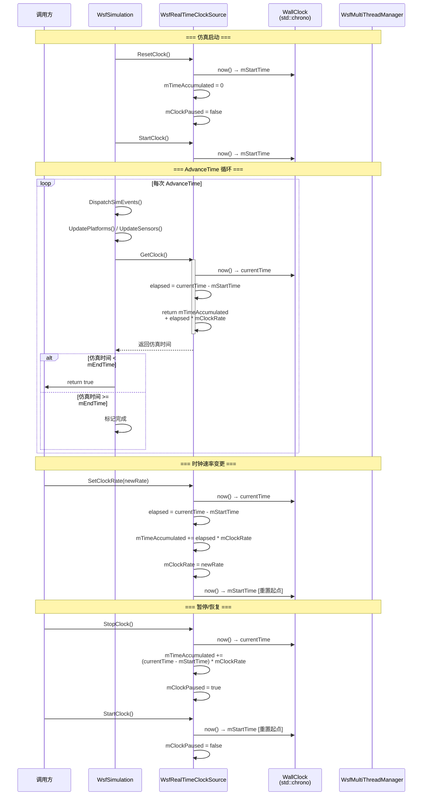

**实时同步要点**：

| 机制 | 说明 |
|------|------|
| **时间累积** | `mTimeAccumulated` 保存已流逝的仿真时间，防止速率变更时丢失时间 |
| **GetClock 公式** | `accumulated + (now - startTime) * clockRate`，精确计算当前仿真时间 |
| **SetClockRate 防丢失** | 先快照当前累积时间，再重置起点，确保无缝切换 |
| **暂停语义** | 暂停时累积当前时间段的时间，恢复时重置起点 |
| **WallClock** | 封装 `std::chrono::high_resolution_clock`，提供毫秒级精度 |

---

> **文档版本**：基于 AFSIM 2.9.0 源码分析
> **最后更新**：2026-05
