# AFSIM WSF 子系统完整软件设计文档

## 目录

1. [系统概述](#1-系统概述)
2. [整体架构](#2-整体架构)
3. [核心仿真控制](#3-核心仿真控制)
4. [平台实体模型](#4-平台实体模型)
5. [平台部件子系统](#5-平台部件子系统)
6. [支撑子系统](#6-支撑子系统)
7. [集成子系统](#7-集成子系统)
8. [初始化与执行流程](#8-初始化与执行流程)
9. [配置系统](#9-配置系统)
10. [设计模式与最佳实践](#10-设计模式与最佳实践)
11. [学习路径指南](#11-学习路径指南)
12. [附录：类图总览](#12-附录类图总览)

---

## 1. 系统概述

### 1.1 简介

AFSIM (Advanced Framework for Simulation, Integration, and Modeling) 是由 Boeing 开发的高级仿真框架。WSF (Warfare Simulation Framework) 是 AFSIM 的核心子系统，提供了一个完整的作战仿真环境，包括：

- **实体建模**: 平台（飞机、舰船、车辆等）及其组件（传感器、通信、处理器、移动器）
- **事件驱动仿真**: 基于优先级队列的离散事件仿真引擎
- **分布式仿真**: 支持 DIS (Distributed Interactive Simulation) 协议
- **可扩展架构**: 通过扩展、插件和组件系统实现功能扩展

**核心职责**：

| 职责 | 说明 |
|------|------|
| 时间管理 | 控制仿真时间推进，支持实时和加速模式 |
| 事件调度 | 管理时间有序的事件队列 |
| 平台管理 | 管理仿真实体的创建、更新和销毁 |
| 传感器仿真 | 雷达、被动传感器、几何传感器等 |
| 通信仿真 | 网络拓扑、消息路由、OSI 协议栈 |
| 运动仿真 | 空中、地面、海上平台的运动模型 |
| 信息处理 | 航迹管理、消息处理、任务分配 |
| 分布式交互 | DIS 协议、XIO 跨应用通信 |

### 1.2 设计目标

| 目标 | 实现方式 |
|------|----------|
| 事件驱动架构 | 基于优先级队列的事件调度系统 |
| 松耦合设计 | 观察者模式 + 组件模式 |
| 高扩展性 | 扩展系统 + 组件系统 + 插件系统 |
| 线程安全 | 独立随机数池、互斥锁保护 |
| 性能优化 | 事件重用、索引访问、延迟删除、多线程 |
| 可互操作 | DIS 协议、XIO 通信 |

### 1.3 代码组织

WSF 源代码位于 `src/core/wsf/source/` 目录下，按功能模块组织：

```
source/
├── *.hpp/cpp              # 核心类（WsfSimulation, WsfPlatform, WsfEvent 等）
├── sensor/                # 传感器子系统
├── mover/                 # 移动器子系统
├── comm/                  # 通信子系统
├── processor/             # 处理器子系统
├── observer/              # 观察者定义
├── script/                # 脚本系统
├── dis/                   # DIS 分布式仿真
├── ext/                   # 扩展实现
├── event_pipe/            # 事件管道（高性能日志）
├── traffic/               # 交通生成
├── xio/                   # 跨应用通信
└── ...
```

---

## 2. 整体架构

### 2.1 系统层次结构

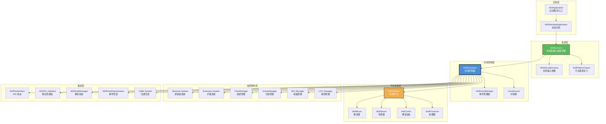
```mermaid
graph TB
    subgraph "应用层"
        APP[WsfApplication<br/>应用程序入口]
        STD[WsfStandardApplication<br/>标准应用]
    end

    subgraph "场景层"
        SCEN[WsfScenario<br/>场景配置与类型管理]
        INPUT[WsfSimulationInput<br/>仿真输入参数]
        PLAT_TYPES[WsfPlatformTypes<br/>平台类型定义]
    end

    subgraph "仿真控制层"
        SIM[WsfSimulation<br/>仿真控制器]
        EVT_MGR[WsfEventManager<br/>事件管理器]
        CLOCK[ClockSource<br/>时钟源]
    end

    subgraph "平台实体层"
        PLAT[WsfPlatform<br/>仿真平台]
        MOVER[WsfMover<br/>移动器]
        SENSOR[WsfSensor<br/>传感器]
        COMM[WsfComm<br/>通信设备]
        PROC[WsfProcessor<br/>处理器]
    end

    subgraph "支撑服务层"
        OBS[Observer System<br/>观察者系统]
        EXT[Extension System<br/>扩展系统]
        TRACK[TrackManager<br/>航迹管理]
        GROUP[GroupManager<br/>分组管理]
        EM[EM_Manager<br/>电磁管理]
        LOS[LOS_Manager<br/>视线管理]
    end

    subgraph "集成层"
        DIS[WsfDisInterface<br/>DIS 协议]
        XIO[WsfXIO_Interface<br/>跨应用通信]
        SCRIPT[WsfScriptManager<br/>脚本系统]
        EVT_PIPE[WsfEventPipeInterface<br/>事件管道]
        TRAFFIC[Traffic System<br/>交通生成]
    end

    APP --> STD
    STD --> SCEN
    SCEN --> INPUT
    SCEN --> PLAT_TYPES
    SCEN --> SIM
    SIM --> EVT_MGR
    SIM --> CLOCK
    SIM --> PLAT
    PLAT --> MOVER
    PLAT --> SENSOR
    PLAT --> COMM
    PLAT --> PROC
    SIM --> OBS
    SIM --> EXT
    SIM --> TRACK
    SIM --> GROUP
    SIM --> EM
    SIM --> LOS
    SIM --> DIS
    SIM --> XIO
    SIM --> SCRIPT
    SIM --> EVT_PIPE
    SIM --> TRAFFIC

    style SIM fill:#4a90d9,stroke:#333,stroke-width:4px,color:#fff
    style PLAT fill:#f0ad4e,stroke:#333,stroke-width:2px,color:#fff
    style SCEN fill:#5cb85c,stroke:#333,stroke-width:2px,color:#fff
```

### 2.2 核心类关系概览

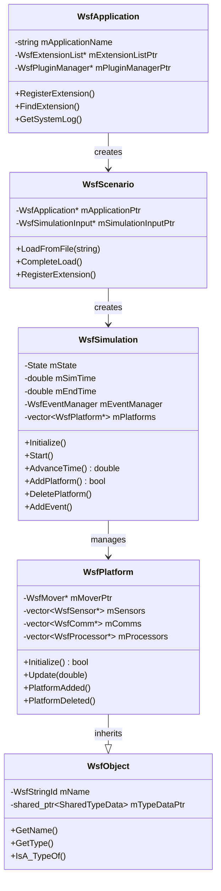
```mermaid
classDiagram
    class WsfApplication {
        -string mApplicationName
        -WsfExtensionList* mExtensionListPtr
        -WsfPluginManager* mPluginManagerPtr
        +RegisterExtension()
        +FindExtension()
        +GetSystemLog()
    }

    class WsfScenario {
        -WsfApplication* mApplicationPtr
        -WsfSimulationInput* mSimulationInputPtr
        +LoadFromFile(string)
        +CompleteLoad()
        +RegisterExtension()
    }

    class WsfSimulation {
        -State mState
        -double mSimTime
        -double mEndTime
        -WsfEventManager mEventManager
        -vector~WsfPlatform*~ mPlatforms
        +Initialize()
        +Start()
        +AdvanceTime() double
        +AddPlatform() bool
        +DeletePlatform()
        +AddEvent()
    }

    class WsfPlatform {
        -WsfMover* mMoverPtr
        -vector~WsfSensor*~ mSensors
        -vector~WsfComm*~ mComms
        -vector~WsfProcessor*~ mProcessors
        +Initialize() bool
        +Update(double)
        +PlatformAdded()
        +PlatformDeleted()
    }

    class WsfObject {
        -WsfStringId mName
        -shared_ptr~SharedTypeData~ mTypeDataPtr
        +GetName()
        +GetType()
        +IsA_TypeOf()
    }

    WsfApplication --> WsfScenario : creates
    WsfScenario --> WsfSimulation : creates
    WsfSimulation --> WsfPlatform : manages
    WsfPlatform --|> WsfObject : inherits
```

### 2.3 仿真状态机

仿真有 7 个明确定义的状态，状态转换严格遵循生命周期：

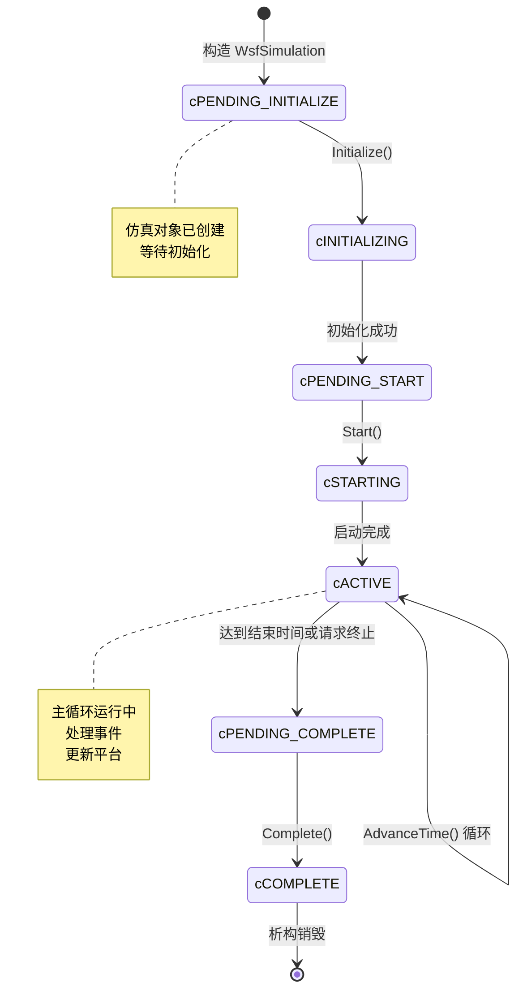
```mermaid
stateDiagram-v2
    [*] --> cPENDING_INITIALIZE: 构造 WsfSimulation
    cPENDING_INITIALIZE --> cINITIALIZING: Initialize()
    cINITIALIZING --> cPENDING_START: 初始化成功
    cPENDING_START --> cSTARTING: Start()
    cSTARTING --> cACTIVE: 启动完成

    cACTIVE --> cACTIVE: AdvanceTime() 循环
    cACTIVE --> cPENDING_COMPLETE: 达到结束时间或请求终止

    cPENDING_COMPLETE --> cCOMPLETE: Complete()
    cCOMPLETE --> [*]: 析构销毁

    note right of cPENDING_INITIALIZE
        仿真对象已创建
        等待初始化
    end note

    note right of cACTIVE
        主循环运行中
        处理事件
        更新平台
    end note
```

**状态说明**：

| 状态 | 说明 | 允许的操作 |
|------|------|------------|
| `cPENDING_INITIALIZE` | 仿真已构造，等待初始化 | `Initialize()` |
| `cINITIALIZING` | 正在执行初始化流程 | 内部操作 |
| `cPENDING_START` | 初始化完成，等待启动 | `Start()` |
| `cSTARTING` | 正在启动 | 内部操作 |
| `cACTIVE` | 仿真运行中 | `AdvanceTime()`, `Pause()`, `AddPlatform()` |
| `cPENDING_COMPLETE` | 等待完成 | `Complete()` |
| `cCOMPLETE` | 仿真已完成 | 销毁 |

---

## 3. 核心仿真控制

### 3.1 事件系统

#### 3.1.1 事件队列架构

WsfSimulation 维护两个独立的事件队列：

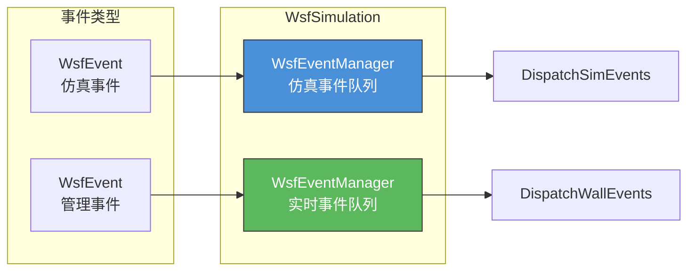
```mermaid
graph LR
    subgraph "WsfSimulation"
        SIM_EVT[WsfEventManager<br/>仿真事件队列]
        WALL_EVT[WsfEventManager<br/>实时事件队列]
    end

    subgraph "事件类型"
        EVT[WsfEvent<br/>仿真事件]
        WALL[WsfEvent<br/>管理事件]
    end

    EVT --> SIM_EVT
    WALL --> WALL_EVT

    SIM_EVT --> DISP[DispatchSimEvents]
    WALL_EVT --> DISP_WALL[DispatchWallEvents]

    style SIM_EVT fill:#4a90d9,stroke:#333,color:#fff
    style WALL_EVT fill:#5cb85c,stroke:#333,color:#fff
```

**两种队列的区别**：

| 队列 | 时间基准 | 用途 | 暂停影响 |
|------|----------|------|----------|
| 仿真事件队列 | 仿真时间 | 模拟的物理事件（移动、传感器探测等） | 仿真暂停时停止处理 |
| 实时事件队列 | 墙钟时间 | 仿真管理事件（DIS同步、界面更新等） | 不受仿真暂停影响 |

#### 3.1.2 事件排序机制

事件使用三元组键值进行严格排序：

```cpp
// 事件的排序键 = (时间, 优先级, 插入顺序计数器)
using Key = std::tuple<double, int, unsigned int>;

// 排序规则：
// 1. 时间升序（小时间先执行）
// 2. 同时间按优先级升序（小优先级先执行）
// 3. 同时间同优先级按FIFO顺序（先插入先执行）
```

#### 3.1.3 事件类层次结构

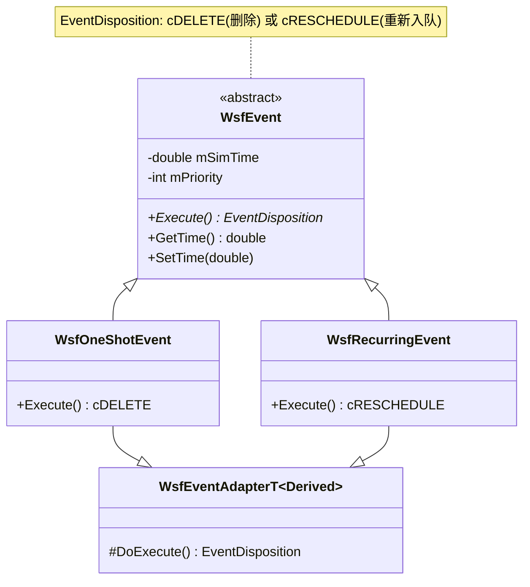
```mermaid
classDiagram
    class WsfEvent {
        <<abstract>>
        -double mSimTime
        -int mPriority
        +Execute() EventDisposition*
        +GetTime() double
        +SetTime(double)
    }

    class WsfOneShotEvent {
        +Execute() cDELETE
    }

    class WsfRecurringEvent {
        +Execute() cRESCHEDULE
    }

    class WsfEventAdapterT~Derived~ {
        #DoExecute() EventDisposition
    }

    WsfEvent <|-- WsfOneShotEvent
    WsfEvent <|-- WsfRecurringEvent
    WsfOneShotEvent --|> WsfEventAdapterT
    WsfRecurringEvent --|> WsfEventAdapterT

    note for WsfEvent "EventDisposition: cDELETE(删除) 或 cRESCHEDULE(重新入队)"
```

#### 3.1.4 自定义事件示例

```cpp
// 示例1：一次性事件 - 平台延迟添加
class AddPlatformEvent : public WsfEvent {
public:
    AddPlatformEvent(double aSimTime, WsfPlatform* aPlatformPtr)
        : WsfEvent(aSimTime), mPlatformPtr(aPlatformPtr) {}

    EventDisposition Execute() override {
        GetSimulation()->AddPlatform(mPlatformPtr);
        return cDELETE;  // 执行后删除
    }
private:
    WsfPlatform* mPlatformPtr;
};

// 示例2：循环事件 - 周期性更新
class PeriodicUpdateEvent : public WsfEvent {
public:
    PeriodicUpdateEvent(double aSimTime, double aInterval)
        : WsfEvent(aSimTime), mInterval(aInterval) {}

    EventDisposition Execute() override {
        DoUpdate();
        SetTime(GetTime() + mInterval);
        return cRESCHEDULE;  // 重新入队
    }
private:
    double mInterval;
};

// 使用便捷方法添加事件
simulation->AddEventT<AddPlatformEvent>(simTime, platformPtr);
```

#### 3.1.5 WsfEventManager 实现细节

**内部数据结构**：

WsfEventManager 使用 `std::priority_queue` 实现优先级队列，队列元素为 `std::tuple<double, int, unsigned int, WsfEvent*>`：

```cpp
class WsfEventManager {
private:
    // 优先级队列：(时间, 优先级, 插入序号, 事件指针)
    using QueueElement = std::tuple<double, int, unsigned int, WsfEvent*>;
    std::priority_queue<QueueElement,
        std::vector<QueueElement>,
        std::greater<QueueElement>> mEventQueue;

    unsigned int mCounter;           // 插入序号计数器，保证 FIFO 顺序
    mutable std::recursive_mutex mMutex;  // 递归互斥锁，保护队列操作
    WsfSimulation* mSimulationPtr;   // 所属仿真对象
};
```

**事件重用机制（cRESCHEDULE）**：

当 `Execute()` 返回 `cRESCHEDULE` 时，事件不会被删除，而是根据新设置的时间重新入队：

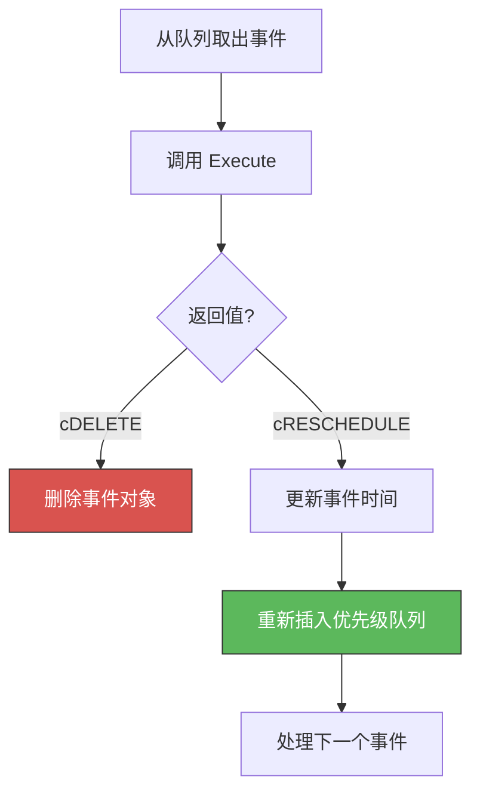
```mermaid
flowchart TD
    DEQUEUE[从队列取出事件] --> EXECUTE[调用 Execute]
    EXECUTE --> CHECK{返回值?}
    CHECK -->|cDELETE| DELETE[删除事件对象]
    CHECK -->|cRESCHEDULE| UPDATE[更新事件时间]
    UPDATE --> REQUEUE[重新插入优先级队列]
    REQUEUE --> NEXT[处理下一个事件]

    style DELETE fill:#d9534f,stroke:#333,color:#fff
    style REQUEUE fill:#5cb85c,stroke:#333,color:#fff
```

这种机制避免了频繁的事件对象创建/销毁，特别适用于周期性事件（如传感器扫描、通信心跳）。

**线程安全**：

WsfEventManager 使用 `std::recursive_mutex` 保护所有队列操作。递归互斥锁允许同一线程多次加锁，解决了事件处理过程中可能触发新事件添加的嵌套调用场景：

```cpp
void WsfEventManager::AddEvent(std::unique_ptr<WsfEvent> aEvent) {
    std::lock_guard<std::recursive_mutex> lock(mMutex);
    mEventQueue.emplace(aEvent->GetTime(), aEvent->GetPriority(),
                        mCounter++, aEvent.release());
}

WsfEvent* WsfEventManager::DequeueNextEvent() {
    std::lock_guard<std::recursive_mutex> lock(mMutex);
    if (mEventQueue.empty()) return nullptr;
    auto [time, priority, count, event] = mEventQueue.top();
    mEventQueue.pop();
    return event;
}
```

**事件调度主循环**：

WsfSimulation 的主循环通过 `DispatchSimEvents()` 驱动事件处理：

```cpp
void WsfSimulation::DispatchSimEvents(double aEndTime) {
    while (WsfEvent* event = mSimEventManager->DequeueNextEvent()) {
        if (event->GetTime() > aEndTime) {
            // 事件超出当前帧，放回队列
            mSimEventManager->AddEvent(std::unique_ptr<WsfEvent>(event));
            break;
        }
        // 推进仿真时间到事件时间
        mCurrentSimTime = event->GetTime();
        // 执行事件
        WsfEvent::EventDisposition disposition = event->Execute();
        if (disposition == WsfEvent::cDELETE) {
            delete event;
        } else { // cRESCHEDULE
            mSimEventManager->AddEvent(std::unique_ptr<WsfEvent>(event));
        }
    }
}
```

---

### 3.2 平台管理系统

#### 3.2.1 平台数据结构

WsfSimulation 使用三重索引来高效管理平台：

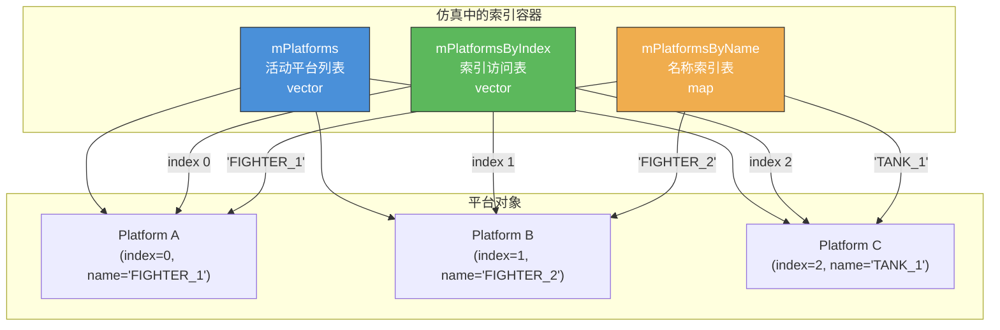
```mermaid
graph TB
    subgraph "仿真中的索引容器"
        LIST[mPlatforms<br/>活动平台列表<br/>vector]
        IDX[mPlatformsByIndex<br/>索引访问表<br/>vector]
        NAME[mPlatformsByName<br/>名称索引表<br/>map]
    end

    subgraph "平台对象"
        PLAT1["Platform A<br/>(index=0, name='FIGHTER_1')"]
        PLAT2["Platform B<br/>(index=1, name='FIGHTER_2')"]
        PLAT3["Platform C<br/>(index=2, name='TANK_1')"]
    end

    LIST --> PLAT1
    LIST --> PLAT2
    LIST --> PLAT3

    IDX -->|"index 0"| PLAT1
    IDX -->|"index 1"| PLAT2
    IDX -->|"index 2"| PLAT3

    NAME -->|"'FIGHTER_1'"| PLAT1
    NAME -->|"'FIGHTER_2'"| PLAT2
    NAME -->|"'TANK_1'"| PLAT3

    style LIST fill:#4a90d9,stroke:#333,color:#fff
    style IDX fill:#5cb85c,stroke:#333,color:#fff
    style NAME fill:#f0ad4e,stroke:#333,color:#fff
```

#### 3.2.2 平台添加详细流程

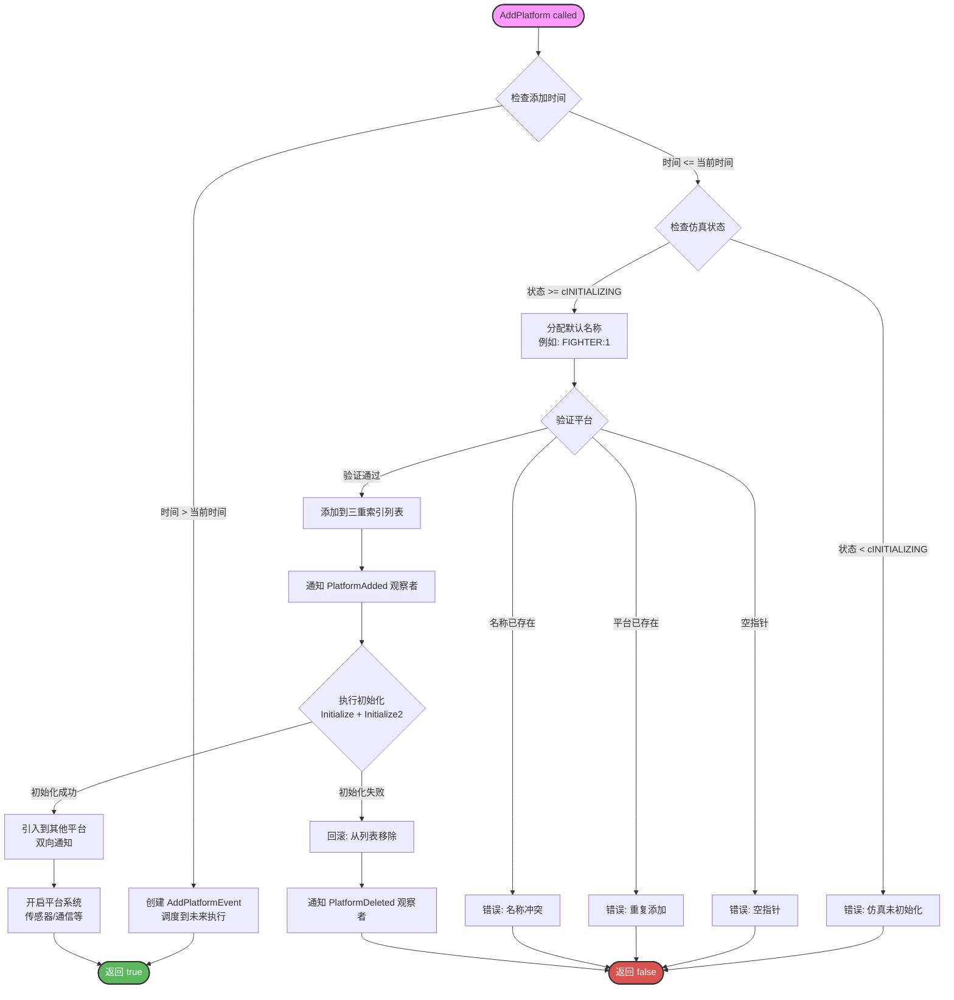
```mermaid
flowchart TD
    START([AddPlatform called]) --> CHECK_TIME{检查添加时间}

    CHECK_TIME -->|"时间 > 当前时间"| SCHEDULE[创建 AddPlatformEvent<br/>调度到未来执行]
    SCHEDULE --> RETURN_TRUE([返回 true])

    CHECK_TIME -->|"时间 <= 当前时间"| CHECK_STATE{检查仿真状态}

    CHECK_STATE -->|"状态 < cINITIALIZING"| ERROR1[错误: 仿真未初始化]
    ERROR1 --> RETURN_FALSE([返回 false])

    CHECK_STATE -->|"状态 >= cINITIALIZING"| ASSIGN_NAME[分配默认名称<br/>例如: FIGHTER:1]

    ASSIGN_NAME --> VALIDATE{验证平台}
    VALIDATE -->|"空指针"| ERROR2[错误: 空指针]
    VALIDATE -->|"平台已存在"| ERROR3[错误: 重复添加]
    VALIDATE -->|"名称已存在"| ERROR4[错误: 名称冲突]

    ERROR2 --> RETURN_FALSE
    ERROR3 --> RETURN_FALSE
    ERROR4 --> RETURN_FALSE

    VALIDATE -->|"验证通过"| ADD_LIST[添加到三重索引列表]
    ADD_LIST --> NOTIFY_OBS[通知 PlatformAdded 观察者]

    NOTIFY_OBS --> INIT{执行初始化<br/>Initialize + Initialize2}
    INIT -->|"初始化失败"| ROLLBACK[回滚: 从列表移除]
    ROLLBACK --> NOTIFY_DEL[通知 PlatformDeleted 观察者]
    NOTIFY_DEL --> RETURN_FALSE

    INIT -->|"初始化成功"| INTRODUCE[引入到其他平台<br/>双向通知]
    INTRODUCE --> TURN_ON[开启平台系统<br/>传感器/通信等]
    TURN_ON --> RETURN_TRUE

    style START fill:#f9f,stroke:#333,stroke-width:2px
    style RETURN_TRUE fill:#5cb85c,stroke:#333,stroke-width:2px,color:#fff
    style RETURN_FALSE fill:#d9534f,stroke:#333,stroke-width:2px,color:#fff
```

#### 3.2.3 平台间的相互感知

当新平台加入时，需要让所有现有平台知道它的存在：

```cpp
bool WsfSimulation::IntroducePlatform(double aSimTime, WsfPlatform* aNewPlatformPtr) {
    for (unsigned int i = 0; i < GetPlatformCount(); ++i) {
        WsfPlatform* oldPlatformPtr = GetPlatformEntry(i);
        if (aNewPlatformPtr != oldPlatformPtr) {
            // 双向通知
            aNewPlatformPtr->PlatformAdded(aSimTime, oldPlatformPtr);  // 新知道旧
            oldPlatformPtr->PlatformAdded(aSimTime, aNewPlatformPtr);  // 旧知道新
        }
    }
    return true;
}
```

#### 3.2.4 平台删除的延迟机制

平台删除使用事件延迟机制，确保在事件执行期间平台指针有效：

```cpp
void WsfSimulation::DeletePlatform(double aSimTime, WsfPlatform* aPlatformPtr, bool aDeleteMemory) {
    aPlatformPtr->SetDeleted();  // 标记为已删除

    // 创建一个事件在当前时间执行实际删除
    // 这确保当前正在执行的事件完成后才真正删除
    AddEvent(ut::make_unique<WsfOneShotEvent>(aSimTime, [=]() {
        ProcessRemovePlatformEvent(aSimTime, aPlatformPtr, aDeleteMemory);
    }));
}
```

**为什么需要延迟删除？**
- 平台的移动器可能在执行事件
- 平台的处理器可能正在处理消息
- 直接删除会导致悬空指针崩溃

#### 3.2.5 WsfPlatform 成员变量详解

WsfPlatform 使用位域标志来压缩存储布尔状态，减少内存占用：

```cpp
class WsfPlatform : public WsfObject {
private:
    // === 位域标志（节省内存） ===
    unsigned int mDeleted : 1;          // 已标记删除
    unsigned int mBroken : 1;           // 平台损坏
    unsigned int mInitialized : 1;      // 已完成初始化
    unsigned int mTurnedOn : 1;         // 系统已开启
    unsigned int mUseDeadReckoning : 1; // 使用死算
    unsigned int mIsClone : 1;          // 克隆平台

    // === 物理属性 ===
    WsfPosition mPosition;              // 当前位置（经纬高）
    WsfVelocity mVelocity;              // 当前速度（北东地）
    WsfAttitude mAttitude;              // 当前姿态（欧拉角）
    double mLength;                     // 平台长度（米）
    double mWidth;                      // 平台宽度（米）
    double mHeight;                     // 平台高度（米）
    double mRadarCrossSection;          // 雷达反射截面积（dBsm）

    // === 组件指针 ===
    WsfMover* mMoverPtr;                // 移动器
    std::vector<WsfSensor*> mSensors;   // 传感器列表
    std::vector<WsfComm*> mComms;       // 通信设备列表
    std::vector<WsfProcessor*> mProcessors; // 处理器列表
    WsfRouter* mRouterPtr;              // 路由器

    // === 标识 ===
    std::string mName;                  // 平台名称
    std::string mClassName;             // 平台类型名
    size_t mIndex;                      // 在仿真中的索引
    WsfStringId mSide;                  // 阵营标识
};
```

#### 3.2.6 两阶段初始化机制

平台初始化分为 `Initialize()` 和 `Initialize2()` 两个阶段，解决组件间的依赖顺序问题：

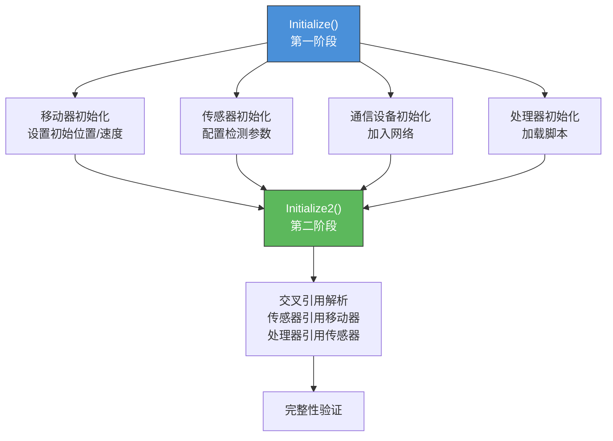
```mermaid
flowchart TD
    INIT1["Initialize()<br/>第一阶段"] --> MOVER_INIT["移动器初始化<br/>设置初始位置/速度"]
    INIT1 --> SENSOR_INIT["传感器初始化<br/>配置检测参数"]
    INIT1 --> COMM_INIT["通信设备初始化<br/>加入网络"]
    INIT1 --> PROC_INIT["处理器初始化<br/>加载脚本"]

    MOVER_INIT --> INIT2["Initialize2()<br/>第二阶段"]
    SENSOR_INIT --> INIT2
    COMM_INIT --> INIT2
    PROC_INIT --> INIT2

    INIT2 --> CROSS_REF["交叉引用解析<br/>传感器引用移动器<br/>处理器引用传感器"]
    CROSS_REF --> VALIDATE["完整性验证"]

    style INIT1 fill:#4a90d9,stroke:#333,color:#fff
    style INIT2 fill:#5cb85c,stroke:#333,color:#fff
```

**为什么需要两阶段？**
- 第一阶段：每个组件独立初始化自身参数
- 第二阶段：组件间可以安全引用其他已初始化的组件
- 例如：传感器模式可能需要查询移动器的位置来计算初始覆盖范围

#### 3.2.7 OnBroken 事件处理

当平台被判定损坏（`mBroken = true`）时，系统支持三种行为：

| 行为 | 说明 | 典型应用 |
|------|------|----------|
| `DELETE_PLATFORM` | 立即从仿真中移除 | 简单场景 |
| `STOP_MOVERS` | 停止所有移动器，保留平台在原地 | 坠毁模拟 |
| `CUSTOM_EVENT` | 触发自定义脚本事件 | 复杂损伤逻辑 |

```cpp
void WsfPlatform::OnBroken(double aSimTime) {
    mBroken = true;

    switch (mOnBrokenAction) {
        case DELETE_PLATFORM:
            GetSimulation()->DeletePlatform(aSimTime, this);
            break;
        case STOP_MOVERS:
            if (mMoverPtr) mMoverPtr->Stop();
            break;
        case CUSTOM_EVENT:
            // 触发脚本定义的 on_broken 事件
            FireCallback(aSimTime, "on_broken");
            break;
    }
}
```

---

### 3.3 时间管理系统

#### 3.3.1 时钟源层次结构

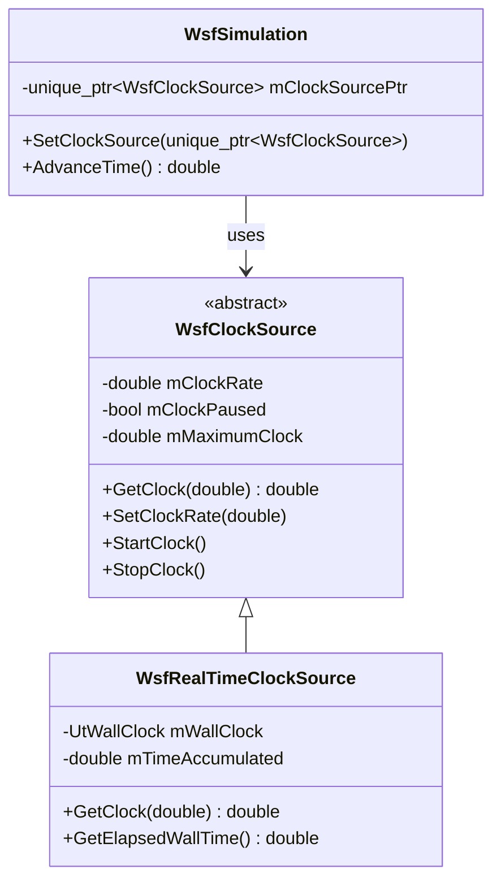
```mermaid
classDiagram
    class WsfClockSource {
        <<abstract>>
        -double mClockRate
        -bool mClockPaused
        -double mMaximumClock
        +GetClock(double) double
        +SetClockRate(double)
        +StartClock()
        +StopClock()
    }

    class WsfRealTimeClockSource {
        -UtWallClock mWallClock
        -double mTimeAccumulated
        +GetClock(double) double
        +GetElapsedWallTime() double
    }

    WsfClockSource <|-- WsfRealTimeClockSource

    class WsfSimulation {
        -unique_ptr~WsfClockSource~ mClockSourcePtr
        +SetClockSource(unique_ptr~WsfClockSource~)
        +AdvanceTime() double
    }

    WsfSimulation --> WsfClockSource : uses
```

#### 3.3.2 时间推进详解

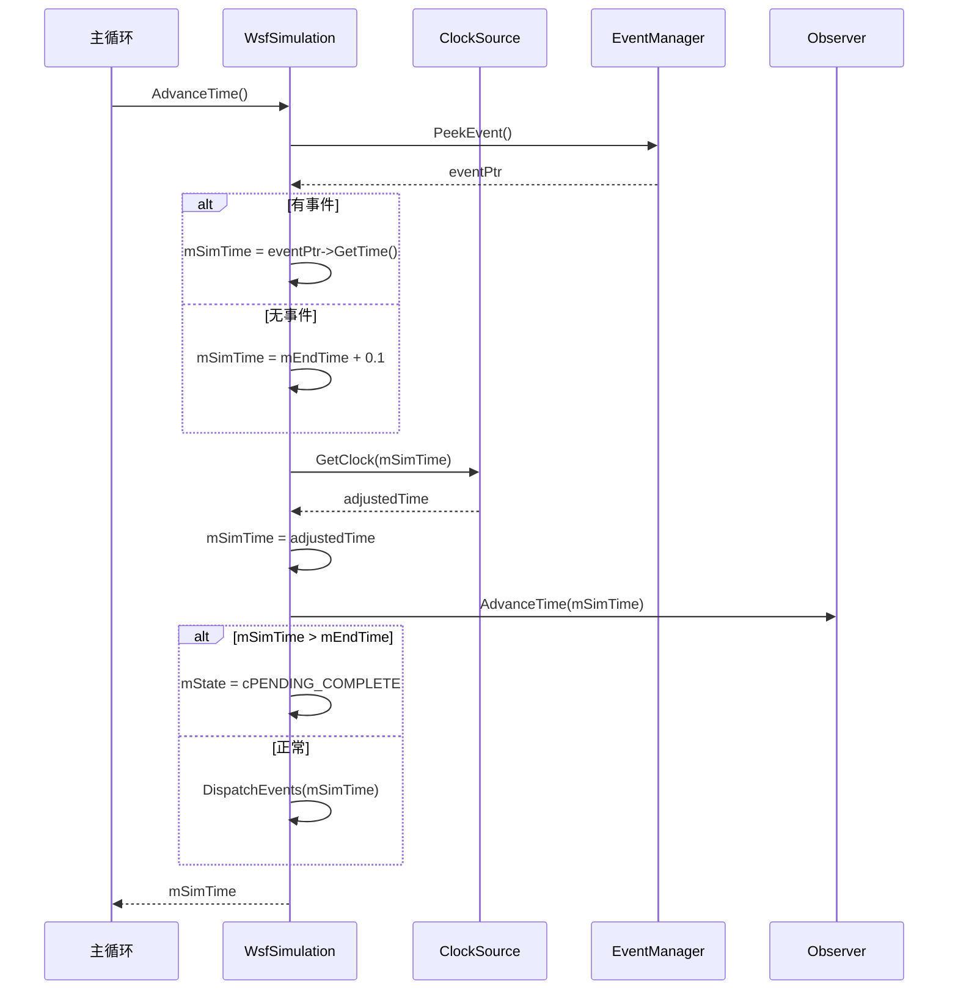
```mermaid
sequenceDiagram
    participant Main as 主循环
    participant Sim as WsfSimulation
    participant Clock as ClockSource
    participant EvtMgr as EventManager
    participant Obs as Observer

    Main->>Sim: AdvanceTime()

    Sim->>EvtMgr: PeekEvent()
    EvtMgr-->>Sim: eventPtr

    alt 有事件
        Sim->>Sim: mSimTime = eventPtr->GetTime()
    else 无事件
        Sim->>Sim: mSimTime = mEndTime + 0.1
    end

    Sim->>Clock: GetClock(mSimTime)
    Clock-->>Sim: adjustedTime

    Sim->>Sim: mSimTime = adjustedTime
    Sim->>Obs: AdvanceTime(mSimTime)

    alt mSimTime > mEndTime
        Sim->>Sim: mState = cPENDING_COMPLETE
    else 正常
        Sim->>Sim: DispatchEvents(mSimTime)
    end

    Sim-->>Main: mSimTime
```

**关键时间变量**：

| 变量 | 类型 | 说明 |
|------|------|------|
| `mSimTime` | double | 当前仿真时间（秒） |
| `mEndTime` | double | 仿真结束时间 |
| `mClockRate` | double | 时钟倍率（1.0 = 实时，2.0 = 2倍速） |

---

### 3.4 观察者系统

#### 3.4.1 观察者模式实现

AFSIM 使用回调列表实现观察者模式，允许外部组件订阅仿真事件：

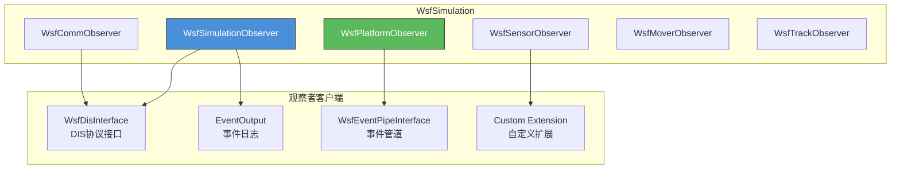
```mermaid
graph TB
    subgraph "WsfSimulation"
        SIM_OBS[WsfSimulationObserver]
        PLAT_OBS[WsfPlatformObserver]
        SENSOR_OBS[WsfSensorObserver]
        COMM_OBS[WsfCommObserver]
        MOVER_OBS[WsfMoverObserver]
        TRACK_OBS[WsfTrackObserver]
    end

    subgraph "观察者客户端"
        DIS[WsfDisInterface<br/>DIS协议接口]
        LOG[EventOutput<br/>事件日志]
        EVT_PIPE[WsfEventPipeInterface<br/>事件管道]
        CUSTOM[Custom Extension<br/>自定义扩展]
    end

    SIM_OBS --> DIS
    SIM_OBS --> LOG
    PLAT_OBS --> EVT_PIPE
    SENSOR_OBS --> CUSTOM
    COMM_OBS --> DIS

    style SIM_OBS fill:#4a90d9,stroke:#333,color:#fff
    style PLAT_OBS fill:#5cb85c,stroke:#333,color:#fff
```

#### 3.4.2 可用的观察者类型

| 观察者类 | 主要回调 | 用途 |
|----------|----------|------|
| `WsfSimulationObserver` | 时间推进、仿真生命周期 | 仿真级别监控 |
| `WsfPlatformObserver` | 平台添加/删除/初始化 | 平台生命周期跟踪 |
| `WsfSensorObserver` | 探测、跟踪、丢失 | 传感器行为监控 |
| `WsfCommObserver` | 消息发送/接收 | 通信行为监控 |
| `WsfMoverObserver` | 移动、航路点到达 | 运动行为监控 |
| `WsfTrackObserver` | 航迹更新、航迹管理 | 航迹处理监控 |
| `WsfTaskObserver` | 任务分配/完成 | 任务管理监控 |
| `WsfFuelObserver` | 燃料消耗、加注 | 燃料状态监控 |

#### 3.4.3 订阅观察者示例

```cpp
class MyObserver {
public:
    void Subscribe(WsfSimulation& aSim) {
        // 使用回调持有器（推荐）
        mCallbacks.Add(WsfObserver::PlatformAdded(&aSim)
            .Connect(&MyObserver::OnPlatformAdded, this));
        mCallbacks.Add(WsfObserver::SimulationComplete(&aSim)
            .Connect([this](double aSimTime) {
                std::cout << "Simulation completed at " << aSimTime << std::endl;
            }));
    }

    void OnPlatformAdded(double aSimTime, WsfPlatform* aPlatform) {
        std::cout << "Platform added: " << aPlatform->GetName() << std::endl;
    }

private:
    UtCallbackHolder mCallbacks;  // 析构时自动取消订阅
};
```

---

### 3.5 扩展系统

#### 3.5.1 三层扩展架构

AFSIM 使用三层扩展架构，每层对应不同的生命周期阶段：

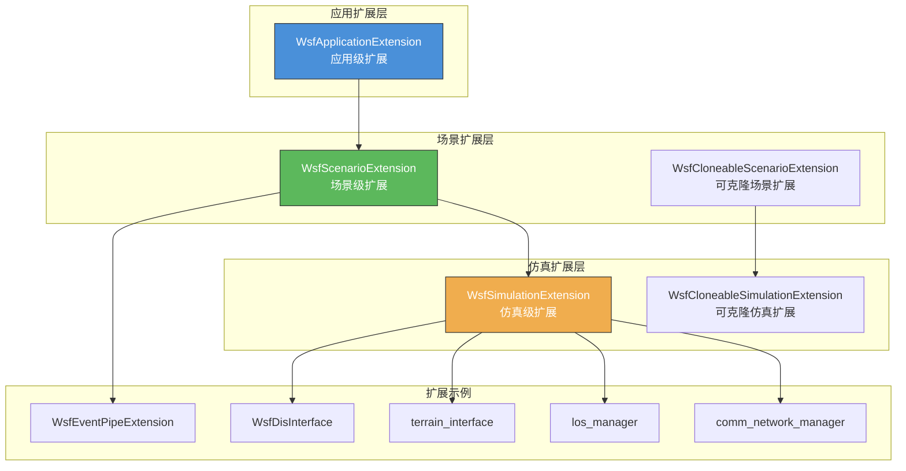
```mermaid
graph TB
    subgraph "应用扩展层"
        APP_EXT[WsfApplicationExtension<br/>应用级扩展]
    end

    subgraph "场景扩展层"
        SCEN_EXT[WsfScenarioExtension<br/>场景级扩展]
        SCEN_CLONE[WsfCloneableScenarioExtension<br/>可克隆场景扩展]
    end

    subgraph "仿真扩展层"
        SIM_EXT[WsfSimulationExtension<br/>仿真级扩展]
        SIM_CLONE[WsfCloneableSimulationExtension<br/>可克隆仿真扩展]
    end

    APP_EXT --> SCEN_EXT
    SCEN_EXT --> SIM_EXT
    SCEN_CLONE --> SIM_CLONE

    subgraph "扩展示例"
        COMM_NET[comm_network_manager]
        LOS_MGR[los_manager]
        TERRAIN[terrain_interface]
        DIS_INT[WsfDisInterface]
        EVT_PIPE[WsfEventPipeExtension]
    end

    SIM_EXT --> COMM_NET
    SIM_EXT --> LOS_MGR
    SIM_EXT --> TERRAIN
    SIM_EXT --> DIS_INT
    SCEN_EXT --> EVT_PIPE

    style APP_EXT fill:#4a90d9,stroke:#333,color:#fff
    style SCEN_EXT fill:#5cb85c,stroke:#333,color:#fff
    style SIM_EXT fill:#f0ad4e,stroke:#333,color:#fff
```

#### 3.5.2 扩展的生命周期

```cpp
class WsfSimulationExtension : public WsfExtension {
public:
    // 调用顺序：

    // 1. 扩展被添加到仿真时
    virtual void AddedToSimulation();

    // 2. 仿真初始化时
    virtual bool Initialize();

    // 3. 初始化后准备
    virtual bool PrepareExtension();

    // 4. 所有平台初始化后
    virtual bool PlatformsInitialized();

    // 5. 所有初始化完成，等待启动
    virtual void PendingStart();

    // 6. 仿真启动
    virtual void Start();

    // 7. 仿真完成
    virtual void Complete(double aSimTime);
};
```

#### 3.5.3 扩展依赖排序

扩展可以声明依赖关系，WsfExtensionList 使用拓扑排序确定初始化顺序：

```cpp
// 扩展A依赖扩展B
extensionList.AddDependency("extension_a", "extension_b", true);  // true = 必需依赖
extensionList.AddDependency("extension_a", "extension_c", false); // false = 可选依赖

// 排序后初始化顺序可能是：B -> C -> A
```

---

### 3.6 多线程管理

#### 3.6.1 WsfMultiThreadManager 架构

WsfMultiThreadManager 负责将平台更新分配到多个工作线程并行执行，显著提升大规模仿真的性能：

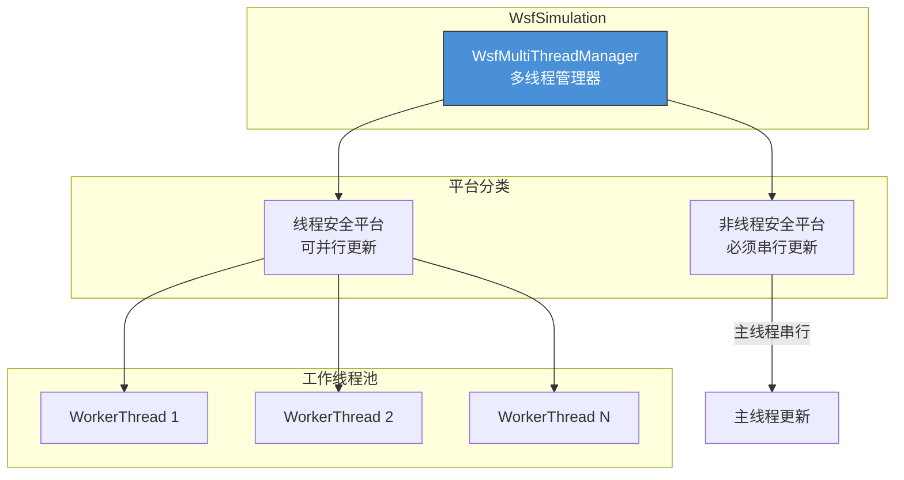
```mermaid
graph TB
    subgraph "WsfSimulation"
        MTM[WsfMultiThreadManager<br/>多线程管理器]
    end

    subgraph "平台分类"
        SAFE[线程安全平台<br/>可并行更新]
        UNSAFE[非线程安全平台<br/>必须串行更新]
    end

    subgraph "工作线程池"
        T1[WorkerThread 1]
        T2[WorkerThread 2]
        T3[WorkerThread N]
    end

    MTM --> SAFE
    MTM --> UNSAFE
    SAFE --> T1
    SAFE --> T2
    SAFE --> T3
    UNSAFE -->|"主线程串行"| MAIN[主线程更新]

    style MTM fill:#4a90d9,stroke:#333,color:#fff
```

#### 3.6.2 平台分类机制

平台根据其组件是否线程安全进行分类：

| 类别 | 条件 | 更新方式 |
|------|------|----------|
| 线程安全 | 所有组件（传感器、通信、处理器）都支持并发 | 分配到工作线程并行更新 |
| 非线程安全 | 任一组件使用共享状态或非线程安全 API | 主线程串行更新 |

分类在仿真初始化阶段完成，运行期间不会改变。

#### 3.6.3 传感器多线程更新流程

传感器使用独立的优先级队列进行多线程调度：

```cpp
class WsfMultiThreadManager {
private:
    // 传感器更新队列：按优先级排序
    struct SensorUpdateEntry {
        WsfSensor* sensorPtr;
        double updateTime;
        int priority;
    };
    std::priority_queue<SensorUpdateEntry> mSensorQueue;

    // 工作线程池
    std::vector<std::thread> mWorkerThreads;
    std::mutex mQueueMutex;
    std::condition_variable mWorkAvailable;
};
```

#### 3.6.4 SimulationUpdateThread 模型

每个工作线程运行 `SimulationUpdateThread` 函数，从共享队列中取任务执行：

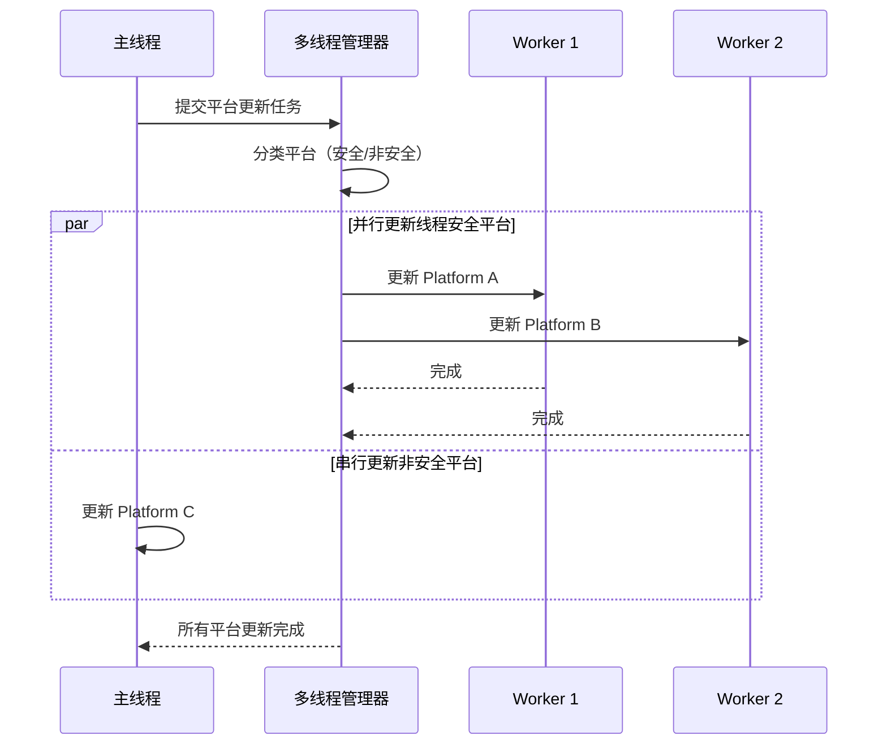
```mermaid
sequenceDiagram
    participant Main as 主线程
    participant MTM as 多线程管理器
    participant W1 as Worker 1
    participant W2 as Worker 2

    Main->>MTM: 提交平台更新任务
    MTM->>MTM: 分类平台（安全/非安全）

    par 并行更新线程安全平台
        MTM->>W1: 更新 Platform A
        MTM->>W2: 更新 Platform B
        W1-->>MTM: 完成
        W2-->>MTM: 完成
    and 串行更新非安全平台
        Main->>Main: 更新 Platform C
    end

    MTM-->>Main: 所有平台更新完成
```

#### 3.6.5 实时模式下的超时处理

在实时模式下，如果平台更新耗时超过帧时间，系统会跳过该平台的当前帧更新：

```cpp
void WsfMultiThreadManager::UpdatePlatforms(double aSimTime, double aFrameDuration) {
    auto frameDeadline = std::chrono::steady_clock::now() +
                         std::chrono::duration<double>(aFrameDuration);

    for (auto& platform : mThreadSafePlatforms) {
        if (std::chrono::steady_clock::now() > frameDeadline) {
            // 超时：跳过剩余平台，记录警告
            break;
        }
        SubmitToUpdate(platform, aSimTime);
    }
    // 非线程安全平台始终在主线程更新（不跳过）
    for (auto& platform : mNonThreadSafePlatforms) {
        platform->Update(aSimTime);
    }
}
```

---

### 3.7 随机数管理

#### 3.7.1 双随机数实例设计

WsfSimulation 维护两个独立的随机数生成器，分别用于仿真逻辑和脚本：

| 实例 | 成员变量 | 用途 | 种子来源 |
|------|----------|------|----------|
| 仿真随机数 | `mRandom` | 传感器检测、噪声计算等核心仿真逻辑 | 配置文件或默认 |
| 脚本随机数 | `mScriptRandom` | 脚本中的随机操作 | 独立种子 |

```cpp
class WsfSimulation {
private:
    UtRandom mRandom;         // 仿真核心随机数
    UtRandom mScriptRandom;   // 脚本随机数
    mutable std::mutex mRandomMutex;       // 保护 mRandom
    mutable std::mutex mScriptRandomMutex; // 保护 mScriptRandom
};
```

#### 3.7.2 为什么需要两个随机数实例？

```mermaid
graph LR
    subgraph "仿真逻辑"
        R1[mRandom] --> SENSOR[传感器检测概率]
        R1 --> NOISE[噪声生成]
        R1 --> DAMAGE[损伤评估]
    end

    subgraph "脚本逻辑"
        R2[mScriptRandom] --> SCRIPT[脚本 rand() 调用]
    end

    style R1 fill:#4a90d9,stroke:#333,color:#fff
    style R2 fill:#5cb85c,stroke:#333,color:#fff
```

**核心原因**：脚本中的随机操作不应影响仿真的可重现性。如果脚本作者在脚本中调用随机函数，不应该改变传感器检测的结果序列。通过分离两个随机数流，仿真结果在相同种子下完全可重现，无论脚本如何使用随机数。

#### 3.7.3 种子管理

```cpp
// 设置种子（确保可重现性）
simulation->SetRandomSeed(12345);
simulation->SetScriptRandomSeed(67890);

// 获取当前种子（用于日志记录）
unsigned int seed = simulation->GetRandomSeed();
```

#### 3.7.4 线程安全

随机数生成器通过互斥锁保护，确保多线程环境下不会出现状态竞争：

```cpp
double WsfSimulation::GetRandomDouble() const {
    std::lock_guard<std::mutex> lock(mRandomMutex);
    return mRandom.GetDouble();
}
```

---

## 4. 平台实体模型

### 4.1 WsfPlatform 类层次结构

WsfPlatform 是 AFSIM 中最核心的实体类，代表仿真中的任何实体（飞机、舰船、车辆、建筑物等）。

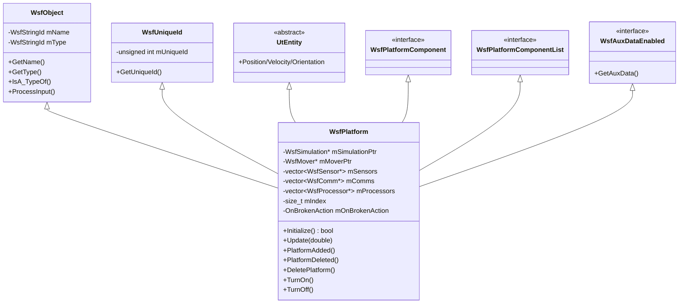
```mermaid
classDiagram
    class WsfObject {
        -WsfStringId mName
        -WsfStringId mType
        +GetName()
        +GetType()
        +IsA_TypeOf()
        +ProcessInput()
    }

    class WsfUniqueId {
        -unsigned int mUniqueId
        +GetUniqueId()
    }

    class UtEntity {
        <<abstract>>
        +Position/Velocity/Orientation
    }

    class WsfPlatformComponent {
        <<interface>>
    }

    class WsfPlatformComponentList {
        <<interface>>
    }

    class WsfAuxDataEnabled {
        <<interface>>
        +GetAuxData()
    }

    class WsfPlatform {
        -WsfSimulation* mSimulationPtr
        -WsfMover* mMoverPtr
        -vector~WsfSensor*~ mSensors
        -vector~WsfComm*~ mComms
        -vector~WsfProcessor*~ mProcessors
        -size_t mIndex
        -OnBrokenAction mOnBrokenAction
        +Initialize() bool
        +Update(double)
        +PlatformAdded()
        +PlatformDeleted()
        +DeletePlatform()
        +TurnOn()
        +TurnOff()
    }

    WsfObject <|-- WsfPlatform
    WsfUniqueId <|-- WsfPlatform
    UtEntity <|-- WsfPlatform
    WsfPlatformComponent <|-- WsfPlatform
    WsfPlatformComponentList <|-- WsfPlatform
    WsfAuxDataEnabled <|-- WsfPlatform
```

### 4.2 平台部件（Platform Part）体系

平台通过组合模式包含多个部件，每个部件负责特定功能：

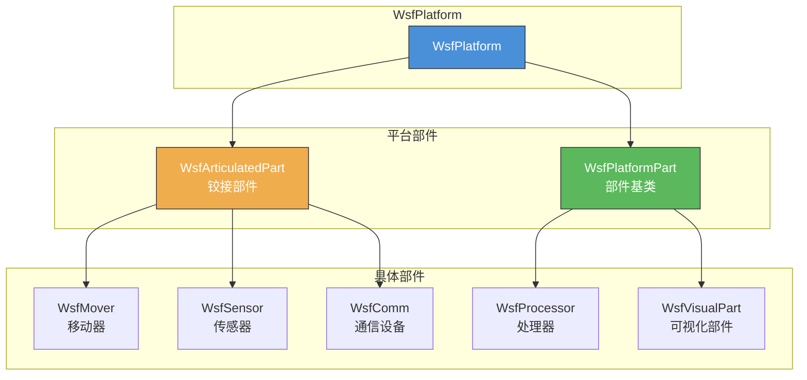
```mermaid
graph TB
    subgraph "WsfPlatform"
        PLAT[WsfPlatform]
    end

    subgraph "平台部件"
        PART[WsfPlatformPart<br/>部件基类]
        ART[WsfArticulatedPart<br/>铰接部件]
    end

    subgraph "具体部件"
        MOVER[WsfMover<br/>移动器]
        SENSOR[WsfSensor<br/>传感器]
        COMM[WsfComm<br/>通信设备]
        PROC[WsfProcessor<br/>处理器]
        VISUAL[WsfVisualPart<br/>可视化部件]
    end

    PLAT --> PART
    PLAT --> ART
    ART --> SENSOR
    ART --> COMM
    ART --> MOVER
    PART --> PROC
    PART --> VISUAL

    style PLAT fill:#4a90d9,stroke:#333,color:#fff
    style PART fill:#5cb85c,stroke:#333,color:#fff
    style ART fill:#f0ad4e,stroke:#333,color:#fff
```

**部件生命周期方法**：

| 方法 | 调用时机 | 用途 |
|------|----------|------|
| `ProcessInput()` | 场景加载时 | 解析输入文件配置 |
| `PreInitialize()` | 初始化前 | 预初始化准备 |
| `Initialize()` | 平台初始化时 | 主要初始化逻辑 |
| `Initialize2()` | Initialize 之后 | 依赖其他部件的初始化 |
| `Update(double)` | 仿真推进时 | 周期性更新 |
| `TurnOn()` | 平台激活时 | 开启部件 |
| `TurnOff()` | 平台停用时 | 关闭部件 |
| `SetOperational()` | 部件可用时 | 设置为可操作状态 |
| `SetNonOperational()` | 部件不可用时 | 设置为不可操作状态 |
| `PartBroken()` | 部件损坏时 | 处理损坏逻辑 |
| `Restore()` | 部件修复时 | 恢复部件功能 |

### 4.3 平台组件（Component）系统

组件系统提供了一种更灵活的扩展机制，允许在不修改基类的情况下添加功能：

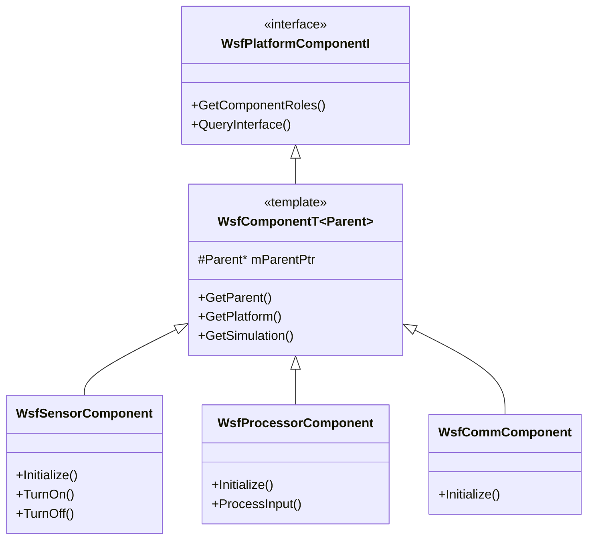
```mermaid
classDiagram
    class WsfPlatformComponentI {
        <<interface>>
        +GetComponentRoles()
        +QueryInterface()
    }

    class WsfComponentT~Parent~ {
        <<template>>
        #Parent* mParentPtr
        +GetParent()
        +GetPlatform()
        +GetSimulation()
    }

    class WsfSensorComponent {
        +Initialize()
        +TurnOn()
        +TurnOff()
    }

    class WsfProcessorComponent {
        +Initialize()
        +ProcessInput()
    }

    class WsfCommComponent {
        +Initialize()
    }

    WsfPlatformComponentI <|-- WsfComponentT
    WsfComponentT <|-- WsfSensorComponent
    WsfComponentT <|-- WsfProcessorComponent
    WsfComponentT <|-- WsfCommComponent
```

**使用示例**：

```cpp
// 定义自定义传感器组件
class MySensorComponent : public WsfComponentT<WsfSensor> {
public:
    void Initialize() override {
        // 从父传感器获取配置
        WsfSensor* sensor = GetParent();
        // 初始化自定义逻辑
    }

    void TurnOn() override {
        // 传感器开启时的自定义行为
    }
};

// 在传感器上注册组件
sensor->AddComponent(ut::make_unique<MySensorComponent>());
```

---

## 5. 平台部件子系统

### 5.1 传感器子系统

#### 5.1.1 传感器类层次结构

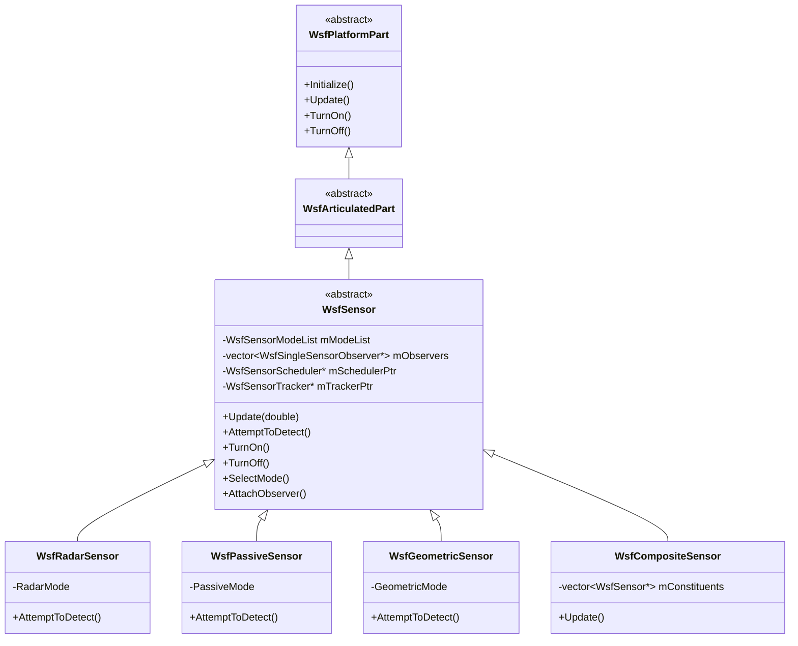
```mermaid
classDiagram
    class WsfPlatformPart {
        <<abstract>>
        +Initialize()
        +Update()
        +TurnOn()
        +TurnOff()
    }

    class WsfArticulatedPart {
        <<abstract>>
    }

    class WsfSensor {
        <<abstract>>
        -WsfSensorModeList mModeList
        -vector~WsfSingleSensorObserver*~ mObservers
        -WsfSensorScheduler* mSchedulerPtr
        -WsfSensorTracker* mTrackerPtr
        +Update(double)
        +AttemptToDetect()
        +TurnOn()
        +TurnOff()
        +SelectMode()
        +AttachObserver()
    }

    class WsfRadarSensor {
        +AttemptToDetect()
        -RadarMode
    }

    class WsfPassiveSensor {
        +AttemptToDetect()
        -PassiveMode
    }

    class WsfGeometricSensor {
        +AttemptToDetect()
        -GeometricMode
    }

    class WsfCompositeSensor {
        +Update()
        -vector~WsfSensor*~ mConstituents
    }

    WsfPlatformPart <|-- WsfArticulatedPart
    WsfArticulatedPart <|-- WsfSensor
    WsfSensor <|-- WsfRadarSensor
    WsfSensor <|-- WsfPassiveSensor
    WsfSensor <|-- WsfGeometricSensor
    WsfSensor <|-- WsfCompositeSensor
```

#### 5.1.2 传感器模式系统

每个传感器可以有多种操作模式（如搜索模式、跟踪模式），模式决定了传感器的行为特征：

```mermaid
graph TB
    subgraph "WsfSensor"
        SENSOR[WsfSensor]
        MODE_LIST[WsfSensorModeList<br/>模式列表]
    end

    subgraph "传感器模式"
        SEARCH[搜索模式<br/>Search Mode]
        TRACK[跟踪模式<br/>Track Mode]
        TWS[边搜边跟模式<br/>TWS Mode]
    end

    subgraph "模式切换事件"
        EVT[ModeChangeEvent<br/>延迟模式切换]
    end

    SENSOR --> MODE_LIST
    MODE_LIST --> SEARCH
    MODE_LIST --> TRACK
    MODE_LIST --> TWS

    SENSOR -->|"SelectMode()"| EVT
    EVT -->|"Execute()"| MODE_LIST

    style SENSOR fill:#4a90d9,stroke:#333,color:#fff
```

#### 5.1.3 传感器调度器

传感器使用策略模式实现不同的检测调度策略：

| 调度器 | 说明 | 适用场景 |
|--------|------|----------|
| `WsfDefaultSensorScheduler` | 默认调度策略 | 通用传感器 |
| `WsfPhysicalScanSensorScheduler` | 物理扫描调度 | 机械扫描雷达 |
| `WsfSectorScanSensorScheduler` | 扇区扫描调度 | 相控阵雷达 |
| `WsfSpinSensorScheduler` | 旋转扫描调度 | 旋转雷达 |

#### 5.1.4 传感器观察者

传感器支持细粒度的观察者通知：

```cpp
class WsfSingleSensorObserver {
public:
    virtual void TrackInitiated(double aSimTime, WsfSensor* aSensor, WsfTrack* aTrack) {}
    virtual void TrackUpdated(double aSimTime, WsfSensor* aSensor, WsfTrack* aTrack) {}
    virtual void TrackDropped(double aSimTime, WsfSensor* aSensor, WsfTrack* aTrack) {}
    virtual void TargetUpdated(double aSimTime, WsfSensor* aSensor, WsfPlatform* aTarget) {}
    virtual void SensorTurnedOn(double aSimTime, WsfSensor* aSensor) {}
    virtual void SensorTurnedOff(double aSimTime, WsfSensor* aSensor) {}
};

// 订阅传感器观察者
sensor->AttachObserver(new MySensorObserver());
```

#### 5.1.5 传感器分类系统

传感器使用位掩码进行分类，支持组合查询：

```cpp
// 传感器分类位掩码
enum SensorClassification {
    cACTIVE   = 0x01,  // 主动传感器（雷达、声纳）
    cPASSIVE  = 0x02,  // 被动传感器（ESM、红外）
    cGEOMETRIC = 0x04, // 几何传感器（纯距离/角度检测）
    cCOMPOSITE = 0x08  // 组合传感器（多传感器融合）
};
```

#### 5.1.6 WsfSensorMode 详细成员

每个传感器模式包含完整的检测参数配置：

```cpp
class WsfSensorMode {
private:
    // === M/N 准则参数 ===
    int mMOfN_Detect;        // M 值：需要检测的次数
    int mN_Scans;            // N 值：扫描总次数
    int mNofN_Drop;          // 连续未检测次数达到此值时丢弃航迹

    // === 误差模型 ===
    double mRangeError;      // 距离测量标准差（米）
    double mAzimuthError;    // 方位角测量标准差（度）
    double mElevationError;  // 仰角测量标准差（度）
    double mRangeRateError;  // 径向速度测量标准差（米/秒）

    // === 自动模式切换 ===
    WsfSensorMode* mSearchToTrackMode;  // 搜索到跟踪的切换目标
    double mTrackRangeThreshold;        // 切换距离阈值

    // === 报告控制 ===
    bool mReportDetections;    // 是否报告检测结果
    bool mReportTracks;        // 是否报告航迹
    bool mReportUncorrelated;  // 是否报告未关联航迹
};
```

#### 5.1.7 WsfRadarSensor 核心算法

**双程功率计算**：

雷达检测基于双程功率方程，计算从发射到目标再返回接收机的总功率：

```cpp
// 雷达方程（双程功率）
double WsfRadarSensor::ComputeReceivedPower(
    double aTransmitPower,      // 发射功率 (W)
    double aGainT,              // 发射天线增益
    double aGainR,              // 接收天线增益
    double aRCS,                // 目标雷达反射截面积 (m²)
    double aRange,              // 目标距离 (m)
    double aWavelength)         // 波长 (m)
{
    double numerator = aTransmitPower * aGainT * aGainR *
                       aWavelength * aWavelength * aRCS;
    double denominator = pow(4.0 * M_PI, 3.0) * pow(aRange, 4.0);
    return numerator / denominator;
}
```

**Marcum-Swerling 检测器**：

AFSIM 实现了完整的 Marcum-Swerling 检测理论，支持 5 种情况：

| 情况 | 目标模型 | 适用场景 |
|------|----------|----------|
| Case 0 | 非起伏目标 | 理想参考 |
| Case 1 | Swerling I | 缓慢起伏（大型目标） |
| Case 2 | Swerling II | 快速起伏（小型目标） |
| Case 3 | Swerling III | 由多个散射体组成 |
| Case 4 | Swerling IV | 快速起伏多散射体 |

检测器支持三种检测律：
- **线性检波**：输出与输入功率成正比
- **平方律检波**：输出与输入功率平方成正比（最常用）
- **对数检波**：输出为输入功率的对数

**脉冲积分**：

多个脉冲的积分可以提高检测概率：

```cpp
// 非相干积分
double integratedSNR = singlePulseSNR * numPulses;

// 相干积分（考虑相位一致性）
double coherentSNR = singlePulseSNR * pow(numPulses, 2.0);
```

#### 5.1.8 WsfPassiveSensor 交互器模型

被动传感器使用交互器（Interactor）模型，不需要主动发射信号：

```mermaid
graph LR
    subgraph "目标平台"
        EMITTER[电磁发射器<br/>雷达/通信/干扰]
    end

    subgraph "被动传感器"
        MODE[WsfPassiveSensorMode<br/>频段/灵敏度]
        DETECT[检测逻辑]
    end

    EMITTER -->|"电磁信号"| MODE
    MODE -->|"信号强度 > 灵敏度?"| DETECT

    style EMITTER fill:#f0ad4e,stroke:#333,color:#fff
    style DETECT fill:#4a90d9,stroke:#333,color:#fff
```

**PSOS 机制（Probabilistic Scan-On-Scan）**：

被动传感器的扫描检测基于概率模型，每个扫描帧对目标有独立的检测概率：

```cpp
bool WsfPassiveSensor::AttemptDetection(double aSignalStrength, double aRange) {
    // 计算基于信号强度的检测概率
    double snr = aSignalStrength / mNoiseFloor;
    double detectionProb = ComputeDetectionProbability(snr);

    // 生成随机数判断是否检测到
    double rand = GetSimulation()->GetRandomDouble();
    return rand < detectionProb;
}
```

#### 5.1.9 WsfGeometricSensor 纯几何检测

几何传感器不依赖电磁信号，仅基于距离/角度进行概率检测：

```cpp
// 基于距离的检测概率衰减
double WsfGeometricSensor::ComputeDetectionProbability(double aRange) {
    if (aRange <= mMinRange) return 1.0;        // 最小距离内 100%
    if (aRange >= mMaxRange) return 0.0;        // 最大距离外 0%
    // 线性衰减
    return 1.0 - (aRange - mMinRange) / (mMaxRange - mMinRange);
}
```

#### 5.1.10 WsfCompositeSensor 独立/同步模式

组合传感器支持两种工作模式：

| 模式 | 说明 | 特点 |
|------|------|------|
| 独立模式 | 各组成传感器独立检测 | 结果可能重复 |
| 同步模式 | 组成传感器同步扫描 | 结果已融合 |

#### 5.1.11 调度器算法详解

**DefaultScheduler**：按固定间隔触发检测，不考虑物理扫描模式。

**PhysicalScanScheduler**：模拟真实的机械扫描模式：

```cpp
class WsfPhysicalScanSensorScheduler {
    double mScanRate;          // 扫描速率（度/秒）
    double mAzimuthBeamwidth;  // 方位波束宽度（度）
    double mElevationBeamwidth;// 仰角波束宽度（度）
    double mCurrentAzimuth;    // 当前扫描方位角
    double mCurrentElevation;  // 当前扫描仰角
};
```

**SectorScanScheduler**：在指定扇区内来回扫描，适用于相控阵雷达。

**SpinSensorScheduler**：360 度连续旋转扫描，适用于地面搜索雷达。

#### 5.1.12 跟踪器 M/N 准则

传感器跟踪器使用 M/N 准则管理航迹生命周期：

```mermaid
stateDiagram-v2
    [*] --> Tentative : 首次检测
    Tentative --> Confirmed : M/N 满足
    Tentative --> Dropped : N 次扫描未满足 M
    Confirmed --> Coast : 连续未检测
    Coast --> Confirmed : 重新检测
    Coast --> Dropped : 超过 NofN_Drop

    state Confirmed {
        [*] --> Tracking
        Tracking --> Updating : 新检测
        Updating --> Tracking
    }
```

**状态转换逻辑**：
- **Tentative（暂定）**：刚创建的航迹，等待确认
- **Confirmed（确认）**：满足 M/N 准则，成为正式航迹
- **Coast（外推）**：连续未检测到，使用卡尔曼滤波外推
- **Dropped（丢弃）**：航迹质量过差，从系统中移除

---

### 5.2 移动器子系统

#### 5.2.1 移动器类层次结构

```mermaid
classDiagram
    class WsfMover {
        <<abstract>>
        -WsfPlatform* mPlatformPtr
        +GoToAltitude(double)
        +GoToSpeed(double)
        +GoToLocation(WsfWaypoint)
        +TurnToHeading(double)
        +SetRoute(WsfRoute)
        +FlyRates(double, double, double)
        +Update(double)
    }

    class WsfRouteMover {
        <<abstract>>
        -WsfRoute* mRoutePtr
        -int mCurrentWaypointIndex
        +SetRoute(WsfRoute)
        +AdvanceToNextWaypoint()
        +UpdatePosition()
    }

    class WsfIterativeRouteMover {
        <<abstract>>
        +LocalUpdate()
    }

    class WsfWaypointMover {
        <<abstract>>
        -WsfPathComputer* mPathComputerPtr
    }

    class WsfAirMover {
        +Update()
        -Takeoff/Landing/Crash logic
    }

    class WsfGroundMover {
        +Update()
    }

    class WsfRoadMover {
        +Update()
        -Road network navigation
    }

    class WsfSurfaceMover {
        +Update()
    }

    class WsfRotorcraftMover {
        +Update()
        -PID controllers
        -Rotor disk model
    }

    class WsfMath3D_Mover {
        +Update()
        -Proportional navigation
    }

    class WsfFollower {
        +Update()
        -Formation flight
    }

    class WsfShadowMover {
        +Update()
        -Mirror another platform
    }

    class WsfOffsetMover {
        +Update()
        -Fixed offset from reference
    }

    class WsfTSPI_Mover {
        +Update()
        -File replay
    }

    WsfPlatformPart <|-- WsfMover
    WsfMover <|-- WsfRouteMover
    WsfMover <|-- WsfShadowMover
    WsfMover <|-- WsfFollower
    WsfMover <|-- WsfOffsetMover
    WsfMover <|-- WsfTSPI_Mover
    WsfMover <|-- WsfMath3D_Mover

    WsfRouteMover <|-- WsfIterativeRouteMover
    WsfRouteMover <|-- WsfWaypointMover

    WsfIterativeRouteMover <|-- WsfRotorcraftMover

    WsfWaypointMover <|-- WsfAirMover
    WsfWaypointMover <|-- WsfGroundMover
    WsfWaypointMover <|-- WsfSurfaceMover

    WsfGroundMover <|-- WsfRoadMover
```

#### 5.2.2 运动模型总结

| 空间域 | 类 | 运动方式 |
|--------|-----|----------|
| 空中 | `WsfAirMover` | 参数化航路点跟踪，支持起降 |
| 空中 | `WsfRotorcraftMover` | PID 控制动力学，旋翼盘模型 |
| 空中 | `WsfMath3D_Mover` | 纯数学 3D 追踪导航 |
| 空中 | `WsfTSPI_Mover` | 文件回放轨迹 |
| 空中 | `WsfFollower` | 速度追踪编队飞行 |
| 地面 | `WsfGroundMover` | 参数化地形航路点 |
| 地面 | `WsfRoadMover` | 道路网络最短路径 |
| 海上 | `WsfSurfaceMover` | 参数化水面航路点 |
| 任意 | `WsfOffsetMover` | 参考平台固定偏移 |
| 任意 | `WsfShadowMover` | 镜像另一个平台位置 |

#### 5.2.3 运动控制接口

```cpp
// 基本运动控制
mover->GoToAltitude(10000.0);      // 爬升到 10000 米
mover->GoToSpeed(250.0);           // 加速到 250 m/s
mover->TurnToHeading(90.0);        // 转向 90 度航向
mover->GoToLocation(waypoint);     // 飞向指定位置

// 航路控制
mover->SetRoute(route);            // 设置航路
mover->UpdateRoute(newWaypoint);   // 更新航路

// 速率控制
mover->FlyRates(climbRate, turnRate, acceleration);  // 按速率飞行
mover->FlyHeadingSpeedAltitude(heading, speed, alt);  // 按航向/速度/高度飞行
```

#### 5.2.4 WsfWaypointMover 参数化路径计算

WsfWaypointMover 使用参数化方法沿航路段移动，通过路径参数 t ∈ [0,1] 插值位置：

```cpp
class WsfWaypointMover {
private:
    WsfPathComputer* mPathComputerPtr;  // 路径计算器
    WsfPathList mPathList;              // 路径段列表
    double mPathParameter;              // 当前路径参数 [0,1]
    double mPathSpeed;                  // 沿路径的速度
};
```

**路径段生成算法（WsfPathComputer）**：

路径计算器根据航路点序列生成连续的路径段，包含转弯弧和直线段：

```mermaid
graph LR
    subgraph "航路点序列"
        WP1[航路点 1] --> WP2[航路点 2]
        WP2 --> WP3[航路点 3]
    end

    subgraph "生成的路径段"
        ARC1[转弯弧 1<br/>圆弧过渡] --> STRAIGHT[直线段]
        STRAIGHT --> ARC2[转弯弧 2]
    end

    WP1 -.-> ARC1
    WP2 -.-> STRAIGHT
    WP3 -.-> ARC2
```

**SpeedAltitudeBreakpoint**：支持速度/高度断点，在特定位置改变运动参数。

#### 5.2.5 WsfAirMover 起飞/降落/坠毁状态机

```mermaid
stateDiagram-v2
    [*] --> GROUND : 初始状态
    GROUND --> TAKEOFF : 起飞命令
    TAKEOFF --> AIRBORNE : 达到起飞速度
    AIRBORNE --> LANDING : 降落命令
    LANDING --> GROUND : 着地
    AIRBORNE --> CRASH : 碰撞/损伤
    CRASH --> [*] : 平台删除

    state AIRBORNE {
        [*] --> CRUISING
        CRUISING --> CLIMBING : 爬升指令
        CRUISING --> DESCENDING : 下降指令
        CLIMBING --> CRUISING : 达到目标高度
        DESCENDING --> CRUISING : 达到目标高度
    }
```

**碰撞损伤评估**：

```cpp
void WsfAirMover::AssessDamage(double aImpactForce) {
    double structuralIntegrity = GetPlatform()->GetStructuralIntegrity();
    if (aImpactForce > structuralIntegrity * 0.8) {
        // 严重损伤 → 坠毁
        SetCrashed();
    } else if (aImpactForce > structuralIntegrity * 0.3) {
        // 中等损伤 → 降低性能
        ReduceMaxSpeed(0.5);
        ReduceManeuverability(0.7);
    }
    // 轻微损伤：无影响
}
```

#### 5.2.6 WsfRotorcraftMover 级联 PID 控制

旋翼飞行器使用 6 个级联 PID 控制器实现精确的姿态和位置控制：

| 控制器 | 输入 | 输出 | 控制对象 |
|--------|------|------|----------|
| 位置 X | 目标 X - 实际 X | 目标滚转角 | 横向位移 |
| 位置 Y | 目标 Y - 实际 Y | 目标俯仰角 | 纵向位移 |
| 位置 Z | 目标高度 - 实际高度 | 总距 | 垂直位移 |
| 滚转 | 目标滚转 - 实际滚转 | 横向周期变距 | 滚转角 |
| 俯仰 | 目标俯仰 - 实际俯仰 | 纵向周期变距 | 俯仰角 |
| 偏航 | 目标偏航 - 实际偏航 | 尾桨距 | 偏航角 |

**DCM 变换**：

使用方向余弦矩阵（DCM）进行坐标系变换，避免万向节锁：

```cpp
// DCM 从机体坐标系到地面坐标系
WsfMatrix3x3 WsfRotorcraftMover::ComputeDCM(double roll, double pitch, double yaw) {
    WsfMatrix3x3 R;
    R(0,0) = cos(pitch)*cos(yaw);
    R(0,1) = sin(roll)*sin(pitch)*cos(yaw) - cos(roll)*sin(yaw);
    R(0,2) = cos(roll)*sin(pitch)*cos(yaw) + sin(roll)*sin(yaw);
    // ... 完整 3x3 旋转矩阵
    return R;
}
```

**风标效应（Weathercocking）**：

旋翼飞行器在悬停时会自动对准风向，模拟真实的风标效应。

#### 5.2.7 WsfIterativeRouteMover 数值积分

迭代路径移动器使用数值积分（Runge-Kutta）更新位置：

```cpp
void WsfIterativeRouteMover::LocalUpdate(double aDt) {
    // 使用 RK4 积分更新位置
    WsfVelocity v0 = GetCurrentVelocity();
    WsfPosition p0 = GetCurrentPosition();

    // k1: 当前速度下的位移
    WsfPosition k1 = IntegratePosition(p0, v0, aDt/2);
    // k2: 中点速度下的位移
    WsfVelocity v1 = ComputeVelocityAt(k1);
    WsfPosition k2 = IntegratePosition(p0, v1, aDt/2);
    // k3: 中点修正速度下的位移
    WsfVelocity v2 = ComputeVelocityAt(k2);
    WsfPosition k3 = IntegratePosition(p0, v2, aDt);
    // k4: 终点速度下的位移
    WsfVelocity v3 = ComputeVelocityAt(k3);

    // 加权平均
    WsfPosition newPos = (k1 + 2*k2 + 2*k3 + k4) / 6.0;
    SetCurrentPosition(newPos);
}
```

**前瞻距离（Lead Distance）**：

移动器根据当前速度和转弯速率计算前瞻距离，提前开始转弯以平滑路径：

```cpp
double leadDistance = currentSpeed * currentSpeed / (maxTurnRate * gravity);
```

---

### 5.3 通信子系统

#### 5.3.1 通信类层次结构

通信子系统实现了类似 OSI 模型的分层架构：

```mermaid
classDiagram
    class WsfArticulatedPart {
        <<abstract>>
    }

    class wsf_comm_Comm {
        <<abstract>>
        -string mName
        -vector~Layer*~ mLayers
        +Send()
        +Receive()
        +CanSendTo()
        +AddLinkAddress()
    }

    class wsf_comm_Router {
        <<abstract>>
        +Send()
        +Receive()
        +FindRoute()
    }

    class wsf_comm_Layer {
        <<abstract>>
        -LayerImp* mImplementationPtr
        +Send()
        +Receive()
    }

    class wsf_comm_Network {
        -string mNetworkType
        -vector~Comm*~ mMembers
        +AddMember()
        +RemoveMember()
        +AddLink()
    }

    class wsf_comm_NetworkManager {
        -map~Address,Comm*~ mAddressMap
        -Graph mGraph
        +AddComm()
        +RemoveComm()
        +AddConnection()
        +EnableComm()
    }

    class wsf_comm_Message {
        -Headers mHeaders
        -Trailers mTrailers
        -TraceRoute mTraceRoute
        +AddHeader()
        +AddTrailer()
    }

    class wsf_comm_Medium {
        <<abstract>>
        +TransmitMessage()
        +PropagateMessage()
    }

    WsfArticulatedPart <|-- wsf_comm_Comm
    WsfPlatformPart <|-- wsf_comm_Router

    wsf_comm_Comm --> wsf_comm_Layer : uses
    wsf_comm_Comm --> wsf_comm_Network : member of
    wsf_comm_NetworkManager --> wsf_comm_Network : manages
    wsf_comm_NetworkManager --> wsf_comm_Comm : tracks
    wsf_comm_Medium --> wsf_comm_Message : transmits
```

#### 5.3.2 OSI 分层架构

```mermaid
graph TB
    subgraph "通信分层架构"
        APP_LAYER[应用层<br/>Application Layer]
        PRES_LAYER[表示层<br/>Presentation Layer]
        SESS_LAYER[会话层<br/>Session Layer]
        TRANS_LAYER[传输层<br/>Transport Layer]
        NET_LAYER[网络层<br/>Network Layer]
        DLL_LAYER[数据链路层<br/>Datalink Layer]
        PHY_LAYER[物理层<br/>Physical Layer]
    end

    subgraph "传输介质"
        MEDIUM[wsf::comm::Medium<br/>传输介质]
    end

    APP_LAYER --> PRES_LAYER
    PRES_LAYER --> SESS_LAYER
    SESS_LAYER --> TRANS_LAYER
    TRANS_LAYER --> NET_LAYER
    NET_LAYER --> DLL_LAYER
    DLL_LAYER --> PHY_LAYER
    PHY_LAYER --> MEDIUM

    style APP_LAYER fill:#4a90d9,stroke:#333,color:#fff
    style PHY_LAYER fill:#5cb85c,stroke:#333,color:#fff
```

#### 5.3.3 网络拓扑类型

| 拓扑类型 | 说明 | 典型应用 |
|----------|------|----------|
| Point-to-Point | 点对点连接 | 数据链 |
| Mesh | 网状网络 | 战术网络 |
| Star | 星型网络 | 中心节点通信 |
| Ring | 环形网络 | 冗余通信 |
| Directed Ring | 有向环 | 定向通信 |

#### 5.3.4 消息传递流程

```mermaid
sequenceDiagram
    participant Sender as 发送平台
    participant Comm as 发送通信设备
    participant Router as 路由器
    participant Medium as 传输介质
    participant RecvComm as 接收通信设备
    participant Receiver as 接收平台

    Sender->>Comm: Send(message, address)
    Comm->>Comm: 应用层处理
    Comm->>Comm: 各层处理 (表示/会话/传输/网络/链路/物理)
    Comm->>Router: 路由查找
    Router-->>Comm: 返回目标列表

    loop 每个目标
        Comm->>Medium: TransmitMessage()
        Medium->>Medium: 传播延迟计算
        Medium->>RecvComm: PropagateMessage()
        RecvComm->>RecvComm: 各层反向处理
        RecvComm->>Receiver: Receive(message)
    end
```

#### 5.3.5 Layer/LayerImp 桥接模式

通信层使用桥接模式分离抽象（Layer）与实现（LayerImp）：

```cpp
// 抽象层：定义接口
class wsf::comm::Layer {
protected:
    LayerImp* mImplementationPtr;  // 实现指针
public:
    virtual bool Send(Message& aMsg, const Address& aDest) = 0;
    virtual bool Receive(Message& aMsg, const Address& aSrc) = 0;
};

// 实现层：具体协议逻辑
class wsf::comm::LayerImp {
public:
    virtual bool DoSend(Message& aMsg, const Address& aDest) = 0;
    virtual bool DoReceive(Message& aMsg, const Address& aSrc) = 0;
};
```

**桥接模式的优势**：可以在运行时替换层实现，例如将 TCP 层替换为 UDP 层，而不需要修改上层协议栈。

#### 5.3.6 路由器组件

路由器由两部分组成：

| 组件 | 职责 |
|------|------|
| `RoutingAlgorithm` | 计算路由路径（如最短路径） |
| `RoutingProtocol` | 维护路由表（如 OSPF、RIP） |

**三种路由代价函数**：

| 算法 | 代价计算 | 适用场景 |
|------|----------|----------|
| `LeastHops` | 跳数最少 | 简单网络 |
| `EdgeWeight` | 链路权重之和 | 带宽敏感 |
| `InverseEdgeWeight` | 1/权重之和 | 延迟敏感 |

```cpp
// 最短路径路由算法示例
class LeastHopsRoutingAlgorithm : public RoutingAlgorithm {
    std::vector<Address> FindRoute(
        const Address& aSource,
        const Address& aDest,
        const Graph& aNetworkGraph) override
    {
        return aNetworkGraph.FindPath(aSource, aDest,
            [](double edgeWeight) { return 1.0; }); // 每跳代价为 1
    }
};
```

#### 5.3.7 Medium 传输结果枚举

```cpp
enum TransmissionResult {
    cSUCCESS,           // 传输成功
    cNO_PATH,           // 无可达路径
    cMEDIUM_BUSY,       // 介质忙
    cCOLLISION,         // 信号碰撞
    cINSUFFICIENT_POWER,// 功率不足
    cTIMEOUT,           // 传输超时
    cFILTERED           // 被过滤器拒绝
};
```

**传播模型分类**：

| 模型 | 说明 | 典型应用 |
|------|------|----------|
| Guided | 有线传输（光纤、电缆） | 固定基础设施 |
| Unguided | 无线传输（自由空间损耗） | 无线电、卫星 |

#### 5.3.8 IPv4 寻址系统

通信子系统使用基于 IPv4 的寻址，支持 CIDR 表示法：

```cpp
class wsf::comm::Address {
    unsigned int mIpAddress;   // IP 地址（网络字节序）
    unsigned int mSubnetMask;  // 子网掩码
    int mPort;                 // 端口号
};

// 子网匹配
bool Address::IsInSameSubnet(const Address& aOther) const {
    return (mIpAddress & mSubnetMask) == (aOther.mIpAddress & aOther.mSubnetMask);
}
```

#### 5.3.9 网络拓扑与图结构

NetworkManager 内部维护一个加权有向图（Graph），用于路由计算：

```cpp
class wsf::comm::Graph {
    // 邻接表表示
    std::map<Address, std::vector<std::pair<Address, double>>> mAdjacencyList;

    // Dijkstra 最短路径
    std::vector<Address> FindPath(
        const Address& aSource,
        const Address& aDest,
        std::function<double(double)> aCostFunc) const;
};
```

---

### 5.4 处理器子系统

#### 5.4.1 处理器类层次结构

```mermaid
classDiagram
    class WsfPlatformPart {
        <<abstract>>
    }

    class WsfProcessor {
        <<abstract>>
        -double mUpdateInterval
        +Initialize()
        +Update()
        +TurnOn()
        +TurnOff()
        +ReceiveMessage()
        +ProcessCallback()
    }

    class WsfScriptProcessor {
        +Update()
        +ProcessMessage()
        -WsfScriptContext* mContext
    }

    class WsfSensorProcessor {
        +Update()
        -vector~WsfSensor*~ mManagedSensors
    }

    class WsfTrackProcessor {
        +Update()
        +ProcessMessage()
        -WsfTrackManager* mTrackManager
    }

    class WsfMessageProcessor {
        +Update()
        +ProcessMessage()
        -vector~Selector*~ mSelectors
        -vector~Action*~ mActions
    }

    class WsfExchangeProcessor {
        +Update()
        +ProcessMessage()
        -vector~Transactor*~ mTransactors
    }

    class WsfTaskManager {
        +Update()
        +ProcessMessage()
        +AssignTask()
        +CancelTask()
        +CompleteTask()
    }

    WsfPlatformPart <|-- WsfProcessor
    WsfProcessor <|-- WsfScriptProcessor
    WsfProcessor <|-- WsfSensorProcessor
    WsfProcessor <|-- WsfTrackProcessor
    WsfProcessor <|-- WsfMessageProcessor
    WsfProcessor <|-- WsfExchangeProcessor
    WsfProcessor <|-- WsfTaskManager
```

#### 5.4.2 处理器功能说明

| 处理器 | 功能 | 典型用途 |
|--------|------|----------|
| `WsfScriptProcessor` | 脚本驱动的处理器 | 自定义行为逻辑 |
| `WsfSensorProcessor` | 传感器管理 | 控制传感器开关、模式切换 |
| `WsfTrackProcessor` | 航迹融合管理 | 多传感器航迹融合 |
| `WsfMessageProcessor` | 消息路由 | 选择器-动作模式的消息处理 |
| `WsfExchangeProcessor` | 资源交换 | 平台间的物资/服务交换 |
| `WsfTaskManager` | 任务编排 | 任务分配、取消、完成 |

#### 5.4.3 消息处理器的选择器-动作模式

```mermaid
graph LR
    subgraph "WsfMessageProcessor"
        MSG[输入消息]
        SEL1[选择器 1<br/>Selector]
        SEL2[选择器 2<br/>Selector]
        ACT1[动作 1<br/>Action]
        ACT2[动作 2<br/>Action]
    end

    MSG --> SEL1
    MSG --> SEL2
    SEL1 -->|"匹配"| ACT1
    SEL2 -->|"匹配"| ACT2
    SEL1 -->|"不匹配"| SKIP1[跳过]
    SEL2 -->|"不匹配"| SKIP2[跳过]

    style MSG fill:#4a90d9,stroke:#333,color:#fff
```

#### 5.4.4 WsfScriptProcessor 状态机与行为树

WsfScriptProcessor 支持两种脚本驱动模式：

**状态机模式**：

```cpp
// 脚本中定义状态
PROCESSOR.SetState("PATROL");
// on_update 中根据状态执行不同逻辑
on_update:
    if PROCESSOR.GetState() == "PATROL":
        # 巡逻逻辑
    elif PROCESSOR.GetState() == "ENGAGE":
        # 交战逻辑
```

**行为树集成**：

脚本可以调用行为树节点，实现更复杂的行为编排：

```cpp
// 行为树节点类型
enum BehaviorNodeType {
    cSEQUENCE,      // 顺序执行
    cSELECTOR,      // 选择执行（成功即返回）
    cPARALLEL,      // 并行执行
    cCONDITION,     // 条件判断
    cACTION         // 动作执行
};
```

#### 5.4.5 WsfTrackProcessor 主/非主模式

| 模式 | 说明 | 行为 |
|------|------|------|
| 主模式 | 航迹处理的权威来源 | 执行相关、融合、生命周期管理 |
| 非主模式 | 辅助航迹处理 | 仅接收和转发航迹数据 |

**循环报告检测**：

防止同一航迹通过多条路径回到处理器导致的无限循环：

```cpp
void WsfTrackProcessor::ProcessTrack(WsfTrack* aTrack) {
    // 检查航迹是否已经在处理中（循环检测）
    if (mProcessingTracks.count(aTrack->GetId()) > 0) {
        return; // 跳过循环报告
    }
    mProcessingTracks.insert(aTrack->GetId());
    // ... 处理航迹
    mProcessingTracks.erase(aTrack->GetId());
}
```

**定期清理事件（PurgeEvent）**：

```cpp
class WsfTrackProcessorPurgeEvent : public WsfRecurringEvent {
    EventDisposition Execute() override {
        // 清理过期航迹
        mTrackProcessor->PurgeStaleTracks(GetTime());
        SetTime(GetTime() + mPurgeInterval);
        return cRESCHEDULE;
    }
};
```

#### 5.4.6 WsfMessageProcessor 延迟队列

消息处理器支持延迟队列，消息可以在指定时间后才被处理：

```cpp
class WsfMessageProcessor {
private:
    // 延迟队列：(处理时间, 消息)
    std::priority_queue<std::pair<double, WsfMessage>> mDelayedQueue;

    void ProcessDelayedMessages(double aSimTime) {
        while (!mDelayedQueue.empty() && mDelayedQueue.top().first <= aSimTime) {
            auto [time, msg] = mDelayedQueue.top();
            mDelayedQueue.pop();
            ProcessMessage(msg);
        }
    }
};
```

#### 5.4.7 WsfTaskManager 任务生命周期

任务管理器维护三个列表管理任务的完整生命周期：

```mermaid
graph LR
    subgraph "任务列表"
        PENDING[待处理列表<br/>Pending Tasks]
        ACTIVE[活动列表<br/>Active Tasks]
        COMPLETED[已完成列表<br/>Completed Tasks]
    end

    subgraph "状态转换"
        ASSIGN[分配任务] --> PENDING
        PENDING -->|"开始执行"| ACTIVE
        ACTIVE -->|"完成"| COMPLETED
        ACTIVE -->|"取消"| CANCEL[取消]
    end

    style PENDING fill:#f0ad4e,stroke:#333,color:#fff
    style ACTIVE fill:#4a90d9,stroke:#333,color:#fff
    style COMPLETED fill:#5cb85c,stroke:#333,color:#fff
```

**可靠消息机制**：

任务管理器支持可靠消息传递，通过重试和超时确保消息送达：

```cpp
class WsfTaskManager {
    int mMaxRetries;          // 最大重试次数
    double mRetryInterval;    // 重试间隔
    double mTimeout;          // 超时时间

    void ProcessReliableMessage(WsfMessage& aMsg) {
        int retries = 0;
        while (retries < mMaxRetries) {
            if (SendMessage(aMsg)) return; // 成功
            retries++;
            Wait(mRetryInterval);
        }
        // 超时处理
        OnMessageTimeout(aMsg);
    }
};
```

**任务回调**：

```cpp
// 任务事件回调
UtCallbackListN<double, const WsfTask*> mOnTaskAssigned;
UtCallbackListN<double, const WsfTask*> mOnTaskCompleted;
UtCallbackListN<double, const WsfTask*> mOnTaskCancelled;
```

#### 5.4.8 WsfExchangeProcessor 容器/供应商/能力

交换处理器用于平台间的物资/服务交换：

| 概念 | 说明 |
|------|------|
| Container | 资源容器（如油箱、弹药库） |
| Supplier | 资源供应者（如加油机、补给舰） |
| Capability | 能力位掩码（如空中加油、弹药补给） |

```cpp
// 能力位掩码
enum ExchangeCapability {
    cFUEL_TRANSFER       = 0x01,  // 燃油转移
    cAMMO_TRANSFER       = 0x02,  // 弹药转移
    cPERSONNEL_TRANSFER  = 0x04,  // 人员转移
    cMEDICAL_SUPPORT     = 0x08   // 医疗支援
};
```

---

## 6. 支撑子系统

### 6.1 航迹管理系统

#### 6.1.1 航迹类层次结构

```mermaid
classDiagram
    class WsfTrack {
        -WsfPosition mPosition
        -WsfVelocity mVelocity
        -WsfCovariance mCovariance
        -TrackType mTrackType
        +GetPosition()
        +GetVelocity()
        +GetTrackType()
    }

    class WsfLocalTrack {
        -vector~TrackId~ mCorrelatedTracks
        -int mUseCount
        -WsfKalmanFilter* mFilterPtr
        -WsfTrackManager* mManagerPtr
        +Correlate()
        +Update()
        +Drop()
    }

    class WsfTrackManager {
        -vector~WsfLocalTrack*~ mLocalTracks
        -vector~WsfTrack*~ mRawTracks
        -WsfCorrelationStrategy* mCorrelationPtr
        -WsfFusionStrategy* mFusionPtr
        +ProcessTrack()
        +InitiateTrack()
        +DropTrack()
        +PurgeTracks()
    }

    WsfTrack <|-- WsfLocalTrack
    WsfSimplePlatformComponent <|-- WsfTrackManager
    WsfTrackManager --> WsfLocalTrack : manages
```

#### 6.1.2 航迹处理流程

```mermaid
flowchart TD
    RAW[原始航迹报告<br/>来自传感器] --> CORRELATE{相关性判断}

    CORRELATE -->|"匹配现有航迹"| UPDATE[更新本地航迹<br/>融合新数据]
    CORRELATE -->|"无匹配"| INITIATE[创建新本地航迹]

    UPDATE --> FILTER[卡尔曼滤波<br/>状态估计]
    INITIATE --> FILTER

    FILTER --> REPORT[生成处理后航迹<br/>报告给处理器]

    REPORT --> CHECK_DROP{检查丢弃条件}
    CHECK_DROP -->|"超时/质量差"| DROP[丢弃航迹]
    CHECK_DROP -->|"继续跟踪"| CONTINUE[继续维护]

    style RAW fill:#f9f,stroke:#333,stroke-width:2px
    style REPORT fill:#5cb85c,stroke:#333,color:#fff
```

#### 6.1.3 航迹类型

| 类型 | 说明 | 来源 |
|------|------|------|
| `UNFILTERED_SENSOR` | 未滤波的传感器航迹 | 传感器直接输出 |
| `FILTERED_SENSOR` | 滤波后的传感器航迹 | 传感器滤波后 |
| `PREDEFINED` | 预定义航迹 | 场景配置 |
| `PROCESSED` | 处理后的航迹 | 航迹处理器 |
| `STATIC_IMAGE` | 静态图像航迹 | 图像数据 |
| `PSEUDO_SENSOR` | 伪传感器航迹 | 模拟数据 |

#### 6.1.4 WsfTrackId 结构

航迹标识由两部分组成，全局唯一标识一条航迹：

```cpp
class WsfTrackId {
    WsfStringId mPlatformNameId;  // 产生航迹的平台名称
    unsigned int mLocalTrackNumber; // 局部航迹号（平台内唯一）
};
```

#### 6.1.5 WsfTrack 完整成员

```cpp
class WsfTrack {
private:
    // === 位置/速度 ===
    WsfPosition mPosition;          // 航迹位置
    WsfVelocity mVelocity;          // 航迹速度
    WsfCovariance mCovariance;      // 协方差矩阵

    // === 信号信息 ===
    double mSignalToNoiseRatio;     // 信噪比
    double mRadarCrossSection;      // 估计的 RCS

    // === IFF 状态 ===
    WsfIFF_Status mIFF_Status;      // 敌我识别状态

    // === 标志位 ===
    unsigned int mTrackType : 4;    // 航迹类型
    unsigned int mCorrelated : 1;   // 是否已关联
    unsigned int mReported : 1;     // 是否已报告
    unsigned int mDropped : 1;      // 是否已丢弃
};
```

#### 6.1.6 WsfLocalTrack 原始航迹关联

本地航迹维护一个原始航迹关联列表，用于多传感器数据融合：

```cpp
class WsfLocalTrack : public WsfTrack {
private:
    std::vector<WsfTrackId> mRawTrackIdList;  // 关联的原始航迹列表
    int mUseCount;                             // 引用计数
    WsfKalmanFilter* mFilterPtr;               // 卡尔曼滤波器
};
```

#### 6.1.7 策略模式：相关与融合

```mermaid
classDiagram
    class WsfCorrelationStrategy {
        <<abstract>>
        +Correlate(rawTrack, localTracks) WsfLocalTrack*
        -mCorrelationMap
    }

    class WsfFusionStrategy {
        <<abstract>>
        +Fuse(localTrack, rawTrack)
        +SubUpdate(localTrack)
    }

    class WsfNearestNeighborCorrelation {
        +Correlate()
        -mMaxGateDistance
    }

    class WsfSimpleFusion {
        +Fuse()
        -mWeightNew
    }

    WsfCorrelationStrategy <|-- WsfNearestNeighborCorrelation
    WsfFusionStrategy <|-- WsfSimpleFusion
```

| 策略 | 算法 | 特点 |
|------|------|------|
| 最近邻相关 | 选择距离最近的本地航迹 | 简单高效 |
| 概率数据关联 | 基于概率门限 | 处理密集目标 |
| 简单融合 | 加权平均 | 低计算开销 |
| 卡尔曼融合 | 卡尔曼滤波 | 最优估计 |

#### 6.1.8 WsfTrackStateController 状态机

航迹状态控制器管理航迹从创建到丢弃的完整生命周期：

```mermaid
stateDiagram-v2
    [*] --> NEW : 创建航迹
    NEW --> TENTATIVE : 首次更新
    TENTATIVE --> CONFIRMED : M/N 满足
    TENTATIVE --> DROPPED : 超时/质量差
    CONFIRMED --> COAST : 连续未检测
    COAST --> CONFIRMED : 重新检测
    COAST --> DROPPED : 超过 NofN_Drop
    DROPPED --> [*] : 清理
```

**回调列表**：

```cpp
UtCallbackListN<double, WsfTrack*> mOnTrackInitiated;  // 航迹创建
UtCallbackListN<double, WsfTrack*> mOnTrackUpdated;    // 航迹更新
UtCallbackListN<double, WsfTrack*> mOnTrackDropped;    // 航迹丢弃
```

---

### 6.2 平台分组系统

```mermaid
classDiagram
    class WsfGroup {
        -WsfStringId mName
        -vector~pair~uint,uint~~ mMembers
        +AddMember(platform_index, part_id)
        +RemoveMember(platform_index, part_id)
        +GetMembers()
    }

    class WsfGroupManager {
        -map~WsfStringId,WsfGroup*~ mGroups
        +CreateGroup(type_name)
        +LoadPlatform(platform, group_name)
        +FindGroup(name) WsfGroup*
    }

    WsfObject <|-- WsfGroup
    WsfGroupManager --> WsfGroup : manages
```

分组系统允许将平台组织成逻辑组，用于：
- 编队管理
- 任务分组
- 通信群组
- 批量操作

#### 6.2.1 电磁管理系统 (WsfEM_Manager)

WsfEM_Manager 管理所有活动的电磁发射器和接收器：

```cpp
class WsfEM_Manager {
private:
    std::vector<WsfEM_Transmitter*> mActiveTransmitters;  // 活动发射器列表
    std::vector<WsfEM_Receiver*> mActiveReceivers;        // 活动接收器列表
    mutable std::mutex mMutex;                            // 线程安全保护
};
```

#### 6.2.2 WsfEM_Interaction 交互计算

电磁交互是传感器检测的核心计算单元，包含完整的功率链路计算：

```mermaid
graph LR
    subgraph "发射端"
        XMTR[发射器<br/>功率/增益/频率]
    end

    subgraph "传播路径"
        GEO[几何关系<br/>距离/角度/LOS]
        ATTEN[衰减模型<br/>大气/雨雾]
        PROP[传播模型<br/>多径/绕射]
    end

    subgraph "接收端"
        RCVR[接收器<br/>灵敏度/带宽]
        SNR[信噪比计算]
    end

    XMTR --> GEO
    GEO --> ATTEN
    ATTEN --> PROP
    PROP --> RCVR
    RCVR --> SNR
```

**单程功率计算**（被动传感器）：

```cpp
double WsfEM_Interaction::ComputeOneWayPower(
    double aEIRP,              // 等效全向辐射功率 (dBW)
    double aRange,             // 距离 (m)
    double aFrequency,         // 频率 (Hz)
    double aAtmosphericLoss)   // 大气衰减 (dB)
{
    double freeSpaceLoss = 20.0 * log10(4.0 * M_PI * aRange * aFrequency / SPEED_OF_LIGHT);
    return aEIRP - freeSpaceLoss - aAtmosphericLoss;
}
```

**双程功率计算**（主动传感器/雷达）：

```cpp
double WsfEM_Interaction::ComputeTwoWayPower(
    double aTransmitPower,     // 发射功率 (dBW)
    double aGainTx,            // 发射增益 (dBi)
    double aGainRx,            // 接收增益 (dBi)
    double aRCS,               // 目标 RCS (dBsm)
    double aRange,             // 距离 (m)
    double aFrequency,         // 频率 (Hz)
    double aAtmosphericLoss)   // 大气衰减 (dB)
{
    double wavelength = SPEED_OF_LIGHT / aFrequency;
    double freeSpaceLoss = 20.0 * log10(4.0 * M_PI * aRange / wavelength);
    return aTransmitPower + aGainTx + aGainRx + 10.0*log10(aRCS)
           + 20.0*log10(wavelength) - 30.0*log10(4.0*M_PI)
           - 2.0 * freeSpaceLoss - 2.0 * aAtmosphericLoss;
}
```

**杂波与干扰**：

交互计算还包含杂波（地面反射）和干扰（有意/无意）的影响：

```cpp
struct WsfEM_InteractionResult {
    double mSignalPower;       // 信号功率 (dBW)
    double mNoisePower;        // 噪声功率 (dBW)
    double mClutterPower;      // 杂波功率 (dBW)
    double mInterferencePower; // 干扰功率 (dBW)
    double mSNR;               // 信噪比 (dB)
    double mSINR;              // 信号与干扰加噪声比 (dB)
};
```

#### 6.2.3 衰减模型

| 模型 | 说明 | 适用频率 |
|------|------|----------|
| Blake | 经典大气衰减模型 | 1-100 GHz |
| ITU-R P.676 | ITU 标准大气衰减 | 全频段 |

#### 6.2.4 传播模型

| 模型 | 说明 | 典型场景 |
|------|------|----------|
| 快速多径 | 双射线模型（直射+地面反射） | 地面/海面目标 |
| 地波 | 地面波传播（VLF/LF） | 远程通信 |
| 视距传播 | 自由空间损耗 + 大气衰减 | 雷达/微波 |

---

### 6.3 管理器类总览

AFSIM 使用多个管理器类来管理特定领域的全局状态：

| 管理器 | 职责 | 关键功能 |
|--------|------|----------|
| `WsfEventManager` | 事件队列管理 | 优先级队列、事件调度 |
| `WsfTrackManager` | 航迹管理 | 航迹相关、融合、生命周期 |
| `WsfGroupManager` | 平台分组 | 分组创建、成员管理 |
| `WsfEM_Manager` | 电磁管理 | 活动发射/接收器列表 |
| `WsfLOS_Manager` | 视线计算 | LOS 查询、多线程支持 |
| `WsfIFF_Manager` | 敌我识别 | 基于阵营/类别的 IFF 状态 |
| `WsfPluginManager` | 插件管理 | 动态加载插件、注册类型 |
| `WsfMultiThreadManager` | 多线程管理 | 线程池、并行更新 |
| `wsf::comm::NetworkManager` | 通信网络 | 拓扑管理、连接跟踪 |
| `WsfScriptManager` | 脚本管理 | 脚本上下文、类型注册 |

#### 6.3.1 WsfLOS_Manager 缓存机制

LOS 管理器使用缓存避免重复计算，缓存键由两个平台的索引组成：

```cpp
class WsfLOS_Manager {
private:
    struct LOS_Key {
        size_t mPlatformIndex1;
        size_t mPlatformIndex2;
        // 用于 map 查找的比较运算符
        bool operator<(const LOS_Key& aOther) const;
    };

    std::map<LOS_Key, bool> mLOSCache;  // 缓存结果
    mutable std::mutex mCacheMutex;      // 线程安全保护
};
```

**多线程 LOS 计算**：

LOS 计算是 CPU 密集型操作，WsfLOS_Manager 支持多线程并行计算：

```cpp
bool WsfLOS_Manager::HasLOS(WsfPlatform* aPlat1, WsfPlatform* aPlat2) {
    LOS_Key key = MakeKey(aPlat1, aPlat2);

    // 先查缓存
    {
        std::lock_guard<std::mutex> lock(mCacheMutex);
        auto it = mLOSCache.find(key);
        if (it != mLOSCache.end()) return it->second;
    }

    // 缓存未命中，计算 LOS（可在工作线程中并行执行）
    bool result = ComputeTerrainLOS(aPlat1->GetPosition(), aPlat2->GetPosition());

    // 存入缓存
    {
        std::lock_guard<std::mutex> lock(mCacheMutex);
        mLOSCache[key] = result;
    }
    return result;
}
```

#### 6.3.2 WsfIFF_Manager 三级查找

IFF 管理器使用三级查找确定目标的敌我状态：

```mermaid
flowchart TD
    QUERY[IFF 查询] --> TIER1{阵营→阵营<br/>查找}

    TIER1 -->|"找到"| RESULT1[返回阵营关系结果]
    TIER1 -->|"未找到"| TIER2{阵营→类别<br/>查找}

    TIER2 -->|"找到"| RESULT2[返回类别结果]
    TIER2 -->|"未找到"| TIER3{默认<br/>查找}

    TIER3 -->|"找到"| RESULT3[返回默认结果]
    TIER3 -->|"未找到"| UNKNOWN[返回 UNKNOWN]

    style QUERY fill:#4a90d9,stroke:#333,color:#fff
    style UNKNOWN fill:#d9534f,stroke:#333,color:#fff
```

```cpp
class WsfIFF_Manager {
private:
    // 三级查找表
    std::map<std::pair<WsfStringId, WsfStringId>, WsfIFF_Status> mSideToSideMap;
    std::map<std::pair<WsfStringId, WsfStringId>, WsfIFF_Status> mSideToCategoryMap;
    WsfIFF_Status mDefaultStatus;

public:
    WsfIFF_Status QueryIFF(WsfStringId aSourceSide, WsfStringId aTargetSide,
                           WsfStringId aTargetCategory) {
        // 第一级：阵营对阵营
        auto key1 = std::make_pair(aSourceSide, aTargetSide);
        auto it1 = mSideToSideMap.find(key1);
        if (it1 != mSideToSideMap.end()) return it1->second;

        // 第二级：阵营对类别
        auto key2 = std::make_pair(aSourceSide, aTargetCategory);
        auto it2 = mSideToCategoryMap.find(key2);
        if (it2 != mSideToCategoryMap.end()) return it2->second;

        // 第三级：默认
        return mDefaultStatus;
    }
};
```

---

## 7. 集成子系统

### 7.1 DIS 分布式交互仿真

#### 7.1.1 DIS 接口架构

```mermaid
classDiagram
    class WsfSimulationExtension {
        <<abstract>>
    }

    class WsfDisInput {
        <<interface>>
    }

    class WsfDisInterface {
        -vector~WsfDisPlatform~ mDisPlatforms
        -map~DisEntityId,WsfDisPlatform*~ mExternalEntities
        -WsfDisDevice* mDevicePtr
        +Initialize()
        +Start()
        +Complete()
        +PlatformAdded()
        +PlatformDeleted()
        +ProcessPDUs()
    }

    class WsfDisDevice {
        <<abstract>>
        +SendPDU()
        +ReceivePDU()
    }

    class WsfDisUDP_Device {
        +SendPDU()
        +ReceivePDU()
    }

    class WsfDisFileDevice {
        +SendPDU()
        +ReceivePDU()
    }

    class WsfDisPlatform {
        -DisEntityId mEntityId
        -WsfPlatform* mPlatformPtr
        +UpdateEntityState()
        +ProcessEmission()
    }

    WsfSimulationExtension <|-- WsfDisInterface
    WsfDisInput <|-- WsfDisInterface
    WsfDisDevice <|-- WsfDisUDP_Device
    WsfDisDevice <|-- WsfDisFileDevice
    WsfDisInterface --> WsfDisDevice : uses
    WsfDisInterface --> WsfDisPlatform : manages
```

#### 7.1.2 DIS PDU 类型

| PDU 类型 | 说明 |
|----------|------|
| Entity State | 实体状态（位置、方向、速度） |
| Emission | 电磁辐射（雷达、通信） |
| Signal | 信号数据 |
| Transmitter | 发射机状态 |
| Action Request/Response | 动作请求/响应 |
| Create/Remove Entity | 创建/删除实体 |
| Resupply/Repair | 补给/维修 |
| Start/Resume/Stop/Freeze | 仿真控制 |
| Data Query/Event Report | 数据查询/事件报告 |
| Designator | 目标指示器 |

#### 7.1.3 DIS 集成流程

```mermaid
sequenceDiagram
    participant Sim as WsfSimulation
    participant DIS as WsfDisInterface
    participant Device as WsfDisDevice
    participant External as 外部 DIS 应用

    Sim->>DIS: SimulationStarting()
    DIS->>Device: 开始接收 PDU

    loop 仿真主循环
        Sim->>DIS: FrameComplete(simTime)

        DIS->>DIS: 生成 Entity State PDU
        DIS->>Device: SendPDU(entityState)
        Device->>External: UDP 发送

        External->>Device: UDP 接收
        Device->>DIS: ReceivePDU()
        DIS->>DIS: 更新外部实体状态
    end

    Sim->>DIS: Complete(simTime)
    DIS->>Device: 停止发送/接收
```

#### 7.1.4 WsfDisPlatform 实体映射

DIS 接口维护内部平台与 DIS 实体 ID 的映射关系：

```cpp
class WsfDisPlatform {
    DisEntityId mEntityId;      // DIS 实体标识（站点、应用、实体号）
    WsfPlatform* mPlatformPtr;  // 对应的内部平台指针
    bool mIsLocal;              // 是否为本地实体（vs 外部实体）

    void UpdateEntityState(double aSimTime);  // 生成 Entity State PDU
    void ProcessEmission();                     // 处理电磁辐射 PDU
};
```

#### 7.1.5 死算（Dead Reckoning）支持

DIS 使用死算算法在 PDU 之间插值实体位置，减少网络带宽：

```mermaid
graph LR
    subgraph "死算算法"
        P0[位置 P₀] --> P1[预测位置 P₁]
        V0[速度 V₀] --> P1
        A0[加速度 A₀] --> P1
    end

    subgraph "算法类型"
        DR1[DR 1: 位置 + 速度<br/>匀速直线]
        DR2[DR 2: 位置 + 速度 + 加速度<br/>匀加速]
        DR3[DR 3: 位置 + 速度 + 角速度<br/>匀速转弯]
    end

    P1 --> DR1
    P1 --> DR2
    P1 --> DR3
```

#### 7.1.6 阴影实体机制

阴影实体（Shadow Entity）用于表示远程 DIS 应用中的实体：

```cpp
class WsfDisShadowEntity {
    DisEntityId mEntityId;          // 远程实体 ID
    WsfPosition mPosition;          // 最后已知位置
    WsfVelocity mVelocity;          // 最后已知速度
    WsfAttitude mAttitude;          // 最后已知姿态
    double mLastUpdateTime;         // 最后更新时间
    WsfPlatform* mShadowPlatform;   // 创建的影子平台

    // 死算更新
    void DeadReckon(double aCurrentTime) {
        double dt = aCurrentTime - mLastUpdateTime;
        mPosition = mPosition + mVelocity * dt;  // 简化的匀速外推
    }
};
```

---

### 7.2 XIO 跨应用通信

#### 7.2.1 XIO 架构

```mermaid
classDiagram
    class WsfXIO_Interface {
        -vector~WsfXIO_Connection*~ mConnections
        -WsfXIO_Publisher* mPublisherPtr
        -WsfXIO_RequestManager* mRequestManagerPtr
        -WsfXIO_QueryManager* mQueryManagerPtr
        +Connect()
        +Disconnect()
        +SendHeartbeat()
        +ProcessPackets()
    }

    class WsfXIO_Connection {
        -string mRemoteHost
        -int mRemotePort
        -ConnectionType mType
        +Send()
        +Receive()
        +IsConnected()
    }

    class WsfXIO_Publisher {
        +Publish(key, data)
        +Subscribe(filter)
        +Unsubscribe()
    }

    class WsfXIO_PublishKey {
        -string mField1
        -string mField2
        -string mField3
        -string mField4
    }

    class WsfXIO_RequestManager {
        +CreateRequest()
        +CancelRequest()
        +ProcessResponse()
    }

    class WsfXIO_Query {
        -string mQueryType
        -Timeout mTimeout
        +Send()
        +WaitForResponse()
    }

    WsfXIO_Interface --> WsfXIO_Connection : manages
    WsfXIO_Interface --> WsfXIO_Publisher : uses
    WsfXIO_Interface --> WsfXIO_RequestManager : uses
    WsfXIO_Publisher --> WsfXIO_PublishKey : uses
```

#### 7.2.2 XIO 应用类型

| 类型 | 说明 |
|------|------|
| `cAPP_SIMULATION` | 仿真应用 |
| `cAPP_USER` | 用户应用 |
| `cAPP_SIMULATION_CONTROLLER` | 仿真控制器 |

#### 7.2.3 发布-订阅机制

```cpp
// 发布数据
WsfXIO_PublishKey key("platform", "FIGHTER_1", "position", "");
publisher->Publish(key, positionData);

// 订阅数据（支持通配符）
WsfXIO_PublishFilter filter("platform", "*", "position", "");
publisher->Subscribe(filter, callback);
```

#### 7.2.4 UDP 心跳发现 + TCP 数据传输

XIO 使用两阶段连接建立：

```mermaid
sequenceDiagram
    participant A as 应用 A
    participant B as 应用 B

    Note over A,B: 阶段 1：UDP 心跳发现
    A->>B: UDP 心跳广播 (端口 X)
    B->>A: UDP 心跳响应

    Note over A,B: 阶段 2：TCP 数据连接
    A->>B: TCP 连接请求
    B->>A: TCP 连接接受

    Note over A,B: 数据交换
    A->>B: TCP: 发布数据
    B->>A: TCP: 查询请求
    A->>B: TCP: 查询响应
```

```cpp
class WsfXIO_Connection {
    enum ConnectionType {
        cUDP_HEARTBEAT,   // UDP 心跳（发现服务）
        cTCP_DATA,        // TCP 数据连接（可靠传输）
        cUDP_STREAM       // UDP 流（高速低延迟）
    };

    std::string mRemoteHost;    // 远程主机地址
    int mRemotePort;            // 远程端口
    ConnectionType mType;       // 连接类型
    int mSocketFd;              // socket 文件描述符
};
```

#### 7.2.5 发布-订阅过滤器

订阅时支持通配符匹配：

| 字段 | 通配符 | 示例 |
|------|--------|------|
| Field1 | `*` 匹配任意 | `"platform"` |
| Field2 | `*` 匹配任意 | `"FIGHTER_*"` |
| Field3 | `*` 匹配任意 | `"position"` |
| Field4 | `*` 匹配任意 | `""` |

```cpp
class WsfXIO_PublishFilter {
    std::string mField1Pattern;
    std::string mField2Pattern;
    std::string mField3Pattern;
    std::string mField4Pattern;

    bool Matches(const WsfXIO_PublishKey& aKey) const {
        return MatchPattern(mField1Pattern, aKey.mField1) &&
               MatchPattern(mField2Pattern, aKey.mField2) &&
               MatchPattern(mField3Pattern, aKey.mField3) &&
               MatchPattern(mField4Pattern, aKey.mField4);
    }
};
```

---

### 7.3 脚本系统

#### 7.3.1 脚本架构

```mermaid
graph TB
    subgraph "脚本定义"
        INPUT[输入文件<br/>script ... end_script]
        ON_UPDATE[on_update<br/>每帧执行]
        ON_MESSAGE[on_message<br/>消息到达时]
        ON_EVENT[on_event<br/>自定义事件]
    end

    subgraph "脚本引擎"
        SCRIPT_PROC[WsfScriptProcessor<br/>脚本处理器]
        SCRIPT_CTX[WsfScriptContext<br/>脚本上下文]
        SCRIPT_MGR[WsfScriptManager<br/>脚本管理器]
    end

    subgraph "可用变量"
        PLATFORM[PLATFORM<br/>当前平台]
        PROCESSOR[PROCESSOR<br/>当前处理器]
        TIME_NOW[TIME_NOW<br/>当前时间]
        MESSAGE[MESSAGE<br/>当前消息]
        TRACK[TRACK<br/>当前航迹]
        SIMULATION[SIMULATION<br/>仿真对象]
    end

    INPUT --> SCRIPT_PROC
    SCRIPT_PROC --> SCRIPT_CTX
    SCRIPT_CTX --> SCRIPT_MGR

    SCRIPT_CTX --> PLATFORM
    SCRIPT_CTX --> PROCESSOR
    SCRIPT_CTX --> TIME_NOW
    SCRIPT_CTX --> MESSAGE
    SCRIPT_CTX --> TRACK
    SCRIPT_CTX --> SIMULATION

    style SCRIPT_PROC fill:#4a90d9,stroke:#333,color:#fff
```

#### 7.3.2 脚本示例

```
// 场景输入文件中的脚本定义
platform FIGHTER
   processor
      script_processor my_behavior
         on_update
            // 每帧执行
            if TIME_NOW > 100.0
               PLATFORM.DeletePlatform()
            end_if
         end_on_update

         on_message
            // 消息到达时执行
            if MESSAGE.MessageType() == "TRACK_REPORT"
               PROCESSOR.SendMessage(MESSAGE, "WEAPON_CONTROLLER")
            end_if
         end_on_message
      end_script_processor
   end_processor
end_platform
```

---

### 7.4 交通生成系统

交通生成系统提供背景合成交通，增加仿真的真实感：

```mermaid
graph TB
    subgraph "交通类型"
        ROAD[XWsfRoadTraffic<br/>道路交通]
        AIR[XWsfAirTraffic<br/>空中交通]
        SEA[XWsfSeaTraffic<br/>海上交通]
        OSM[XWsfOSM_Traffic<br/>OSM道路交通]
    end

    subgraph "交通特征"
        VEHICLE[车辆/飞机/船舶类型]
        ROUTE[路线网络]
        DENSITY[密度控制]
        CONVOY[编队支持]
    end

    ROAD --> VEHICLE
    AIR --> VEHICLE
    SEA --> VEHICLE
    ROAD --> ROUTE
    AIR --> ROUTE
    SEA --> ROUTE
    ROAD --> DENSITY
    AIR --> DENSITY
    OSM --> CONVOY

    style ROAD fill:#4a90d9,stroke:#333,color:#fff
    style AIR fill:#5cb85c,stroke:#333,color:#fff
    style SEA fill:#f0ad4e,stroke:#333,color:#fff
```

| 交通类型 | 特点 |
|----------|------|
| `XWsfRoadTraffic` | 道路网络车辆，支持加权区域密度、车辆类型速度分布、编队 |
| `XWsfAirTraffic` | 空中交通，支持机场、跑道、航班状态跟踪、备降 |
| `XWsfSeaTraffic` | 海上交通，支持港口、航道、停泊模式 |
| `XWsfOSM_Traffic` | OpenStreetMap 道路交通，支持交叉口规则、车道变换、碰撞避免 |

---

### 7.5 事件管道系统

事件管道是高性能的二进制遥测/日志系统：

```mermaid
graph LR
    subgraph "仿真事件"
        PLAT_EVT[平台事件]
        SENSOR_EVT[传感器事件]
        COMM_EVT[通信事件]
        MOVER_EVT[移动事件]
    end

    subgraph "事件管道"
        INTERFACE[WsfEventPipeInterface<br/>事件收集]
        OPTIONS[WsfEventPipeOptions<br/>过滤配置]
        WRITER[WsfEventPipeFileWriteWorker<br/>写入线程]
        FILE[二进制文件<br/>UtPack格式]
    end

    PLAT_EVT --> INTERFACE
    SENSOR_EVT --> INTERFACE
    COMM_EVT --> INTERFACE
    MOVER_EVT --> INTERFACE

    INTERFACE --> OPTIONS
    OPTIONS --> WRITER
    WRITER --> FILE

    style INTERFACE fill:#4a90d9,stroke:#333,color:#fff
```

**事件管道特点**：
- 比标准 EventOutput 更快
- 二进制格式 (UtPack)，更紧凑
- 可按平台配置详细级别
- 专用写入线程，不阻塞仿真
- 支持脚本 API 记录自定义事件

---

## 8. 初始化与执行流程

### 8.1 完整初始化流程

```mermaid
sequenceDiagram
    participant App as Application
    participant Scen as WsfScenario
    participant Sim as WsfSimulation
    participant Ext as Extensions
    participant Obs as Observers
    participant Plat as Platforms

    App->>Scen: LoadFromFile("scenario.txt")
    Scen->>Scen: 解析输入文件
    App->>Scen: CompleteLoad()
    Scen->>Scen: 验证配置

    App->>Sim: new WsfSimulation(scenario, runNumber)
    Sim->>Sim: 初始化成员变量
    Sim->>Sim: 设置随机种子

    App->>Sim: Initialize()
    Sim->>Sim: mState = cINITIALIZING
    Sim->>Obs: SimulationInitializing()

    Sim->>Sim: CreateClock()
    Sim->>Sim: 初始化脚本上下文

    loop 每个扩展（按依赖顺序）
        Sim->>Ext: Initialize()
        Ext-->>Sim: success
        Sim->>Ext: PrepareExtension()
    end

    Sim->>Obs: "Initialize().Callback()"

    loop 每个输入平台
        Sim->>Plat: Initialize()
        Sim->>Plat: Initialize2()
        Sim->>Sim: IntroducePlatform()
    end

    Sim->>Sim: SimulationInitialized()

    Sim->>Sim: mState = cPENDING_START
    Sim->>Ext: PendingStart()
    Sim->>Obs: SimulationPendingStart()

    Note over Sim: 初始化完成，等待启动
```

### 8.2 仿真主循环

```cpp
// 典型的仿真主循环
void RunSimulation(WsfSimulation& sim) {
    sim.Initialize();  // 初始化
    sim.Start();       // 启动

    // 主循环
    while (sim.IsActive()) {
        sim.AdvanceTime();  // 推进一个时间步

        // 可选：检查是否需要提前退出
        if (ShouldAbort()) {
            sim.RequestTermination();
        }
    }

    sim.Complete(sim.GetEndTime());  // 完成
}
```

### 8.3 事件调度详细流程

```mermaid
flowchart TD
    START([AdvanceTime]) --> PEEK[PeekEvent 查看下一个事件]
    PEEK --> HAS_EVENT{有事件?}

    HAS_EVENT -->|是| GET_TIME[获取事件时间]
    HAS_EVENT -->|否| SET_END[mSimTime = mEndTime + 0.1]

    GET_TIME --> SET_TIME[mSimTime = eventTime]
    SET_TIME --> ADJUST[时钟源调整时间]
    SET_END --> ADJUST

    ADJUST --> NOTIFY_OBS[通知 AdvanceTime 观察者]
    NOTIFY_OBS --> CHECK_END{时间超过结束时间?}

    CHECK_END -->|是| SET_COMPLETE[状态 = cPENDING_COMPLETE]
    CHECK_END -->|否| DISPATCH_SIM[DispatchSimEvents]

    SET_COMPLETE --> RETURN([返回当前时间])

    DISPATCH_SIM --> LOOP{还有事件且时间合适?}
    LOOP -->|是| POP[PopEvent 取出事件]
    POP --> SHOULD_EXEC{ShouldExecute?}
    SHOULD_EXEC -->|是| EXEC[Execute 执行事件]
    SHOULD_EXEC -->|否| LOOP
    EXEC --> CHECK_DISP{EventDisposition}
    CHECK_DISP -->|cDELETE| DELETE[删除事件]
    CHECK_DISP -->|cRESCHEDULE| RESCHEDULE[重新入队]
    DELETE --> LOOP
    RESCHEDULE --> LOOP
    LOOP -->|否| DISPATCH_WALL[DispatchWallEvents]

    DISPATCH_WALL --> RETURN

    style START fill:#f9f,stroke:#333,stroke-width:2px
    style RETURN fill:#5cb85c,stroke:#333,stroke-width:2px,color:#fff
```

---

## 9. 配置系统

### 9.1 WsfSimulationInput 配置项

```cpp
class WsfSimulationInput {
    // 时间配置
    double mEndTime;              // 仿真结束时间（秒）
    double mClockRate;            // 时钟倍率（1.0 = 实时）
    bool mIsRealTime;             // 是否实时仿真

    // 多线程配置
    bool mMultiThreaded;          // 是否启用多线程
    int mNumberOfThreads;         // 线程数
    double mBreakUpdateTime;      // 多线程更新间隔

    // 性能优化
    double mMinimumMoverTimestep; // 移动器最小更新间隔

    // 检测配置
    bool mUseConstantRequiredPd;  // 使用固定检测概率
    bool mRandomizeFrequency;     // 随机化频率
};
```

### 9.2 仿真输入子类

| 子类 | 说明 |
|------|------|
| `WsfDefaultSimulationInput` | 默认输入配置 |
| `WsfEventStepSimulationInput` | 事件步进仿真 |
| `WsfFrameStepSimulationInput` | 帧步进仿真 |

### 9.3 典型配置文件示例

```
// simulation_config.txt

end_time  3600.0    // 仿真1小时

real_time            // 启用实时模式
clock_rate  1.0      // 实时速度

multi_threaded
   number_of_threads  4
end_multi_threaded

minimum_mover_timestep  0.1  // 移动器最小更新间隔 0.1秒

// 日期时间设置
date_time
   year 2024
   month 1
   day 15
   hour 8
   minute 0
   second 0
end_date_time
```

---

## 10. 设计模式与最佳实践

### 10.1 使用的设计模式

| 模式 | 应用位置 | 目的 |
|------|----------|------|
| **观察者模式** | Observer 系统 | 解耦仿真核心与外部监控组件 |
| **策略模式** | ClockSource, SensorScheduler | 灵活的算法切换 |
| **模板方法模式** | Initialize/Start/Complete | 定义生命周期骨架 |
| **工厂模式** | WsfScenario, PlatformTypes | 动态创建仿真实体 |
| **组合模式** | WsfPlatform + Parts | 构建复杂实体 |
| **桥接模式** | Comm Layer/LayerImp | 分离抽象与实现 |
| **命令模式** | WsfEvent | 封装操作为对象 |
| **单例模式** | Manager 类 | 全局状态管理 |
| **组件模式** | WsfComponentT | 可插拔功能扩展 |

### 10.2 设计优势

1. **松耦合**: 观察者模式使仿真核心不依赖具体输出模块
2. **可扩展**: 扩展系统和组件系统允许添加新功能而不修改核心代码
3. **可测试**: 虚函数和依赖注入便于单元测试
4. **高性能**: 优化的数据结构和算法支持大规模仿真
5. **线程安全**: 互斥锁和独立随机数池支持多线程环境
6. **可互操作**: DIS 和 XIO 支持分布式仿真

### 10.3 性能优化建议

```cpp
// 1. 使用索引而非名称查找（性能差异巨大）
// 不推荐：
WsfPlatform* plat = sim->GetPlatformByName("SOME_PLATFORM");

// 推荐：缓存索引
size_t platIndex = plat->GetIndex();
// 后续使用
WsfPlatform* plat = sim->GetPlatformByIndex(platIndex);

// 2. 批量处理事件
// 如果需要同时添加多个平台，考虑使用较低优先级让相关事件一起执行

// 3. 合理设置最小更新间隔
// 减少 CPU 负载
simulationInput.SetMinimumMoverTimestep(0.1);  // 100ms

// 4. 多线程注意事项
// 确保平台间没有强依赖关系时再启用多线程
```

### 10.4 常见陷阱

```cpp
// 陷阱1: 在事件执行中删除当前平台
// 错误做法：
void SomeEvent::Execute() {
    sim->DeletePlatform(currentPlatform);  // 可能崩溃
}

// 正确做法：
void SomeEvent::Execute() {
    sim->DeletePlatform(simTime, currentPlatform);  // 延迟删除
}

// 陷阱2: 持有平台裸指针
// 错误做法：
WsfPlatform* myPlatform = sim->GetPlatformByIndex(idx);
// ... 一段时间后
myPlatform->Update();  // 可能悬空指针

// 正确做法：
size_t platformIndex = idx;
// 每次使用前检查
if (sim->PlatformExists(platformIndex)) {
    WsfPlatform* plat = sim->GetPlatformByIndex(platformIndex);
    plat->Update();
}

// 陷阱3: 在构造函数中访问未初始化的资源
// Initialize() 之后才能安全访问大多数资源
```

### 10.5 实际代码模式详解

#### 10.5.1 组件角色类型系统

AFSIM 使用宏定义组件角色类型，实现编译时类型检查：

```cpp
// 声明组件角色类型
WSF_DECLARE_COMPONENT_ROLE_TYPE(WsfSensor, "Sensor")
WSF_DECLARE_COMPONENT_ROLE_TYPE(WsfMover, "Mover")
WSF_DECLARE_COMPONENT_ROLE_TYPE(WsfComm, "Comm")

// 使用示例
class WsfComponentT<WsfSensor> : public WsfComponent {
public:
    WsfSensor* GetParent() {
        return static_cast<WsfSensor*>(WsfComponent::GetParent());
    }
};
```

#### 10.5.2 引用计数管理（UtReferenceTracked）

AFSIM 使用引用计数管理对象生命周期，防止内存泄漏和悬空指针：

```cpp
class UtReferenceTracked {
private:
    mutable std::atomic<int> mRefCount;

public:
    void AddReference() const { mRefCount++; }
    void RemoveReference() const {
        if (--mRefCount == 0) {
            delete this;
        }
    }
};

// 智能指针包装
template<typename T>
class UtRefPtr {
    T* mPtr;
public:
    UtRefPtr(T* aPtr) : mPtr(aPtr) { if (mPtr) mPtr->AddReference(); }
    ~UtRefPtr() { if (mPtr) mPtr->RemoveReference(); }
    T* operator->() { return mPtr; }
};
```

#### 10.5.3 回调系统（UtCallbackListN）

AFSIM 使用类型安全的回调列表实现观察者模式：

```cpp
// N 参数回调列表模板
template<typename... Args>
class UtCallbackListN {
    std::vector<std::function<void(Args...)>> mCallbacks;

public:
    void AddCallback(std::function<void(Args...)> aCallback) {
        mCallbacks.push_back(aCallback);
    }

    void Notify(Args... aArgs) {
        for (auto& callback : mCallbacks) {
            callback(aArgs...);
        }
    }
};

// 使用示例：航迹事件回调
UtCallbackListN<double, WsfTrack*> mOnTrackInitiated;
mOnTrackInitiated.AddCallback([](double aTime, WsfTrack* aTrack) {
    std::cout << "Track initiated at time " << aTime << std::endl;
});
mOnTrackInitiated.Notify(simTime, trackPtr);
```

#### 10.5.4 位域标志模式

AFSIM 大量使用位域标志压缩布尔状态，减少内存占用：

```cpp
class WsfPlatform {
    // 使用位域：每个标志只占 1 位
    unsigned int mDeleted : 1;
    unsigned int mBroken : 1;
    unsigned int mInitialized : 1;
    unsigned int mTurnedOn : 1;
    unsigned int mUseDeadReckoning : 1;
    // ... 8 个标志只占 4 字节
};
```

#### 10.5.5 策略模式的实际应用

| 场景 | 策略接口 | 具体实现 |
|------|----------|----------|
| 时钟源 | `WsfClockSource` | `WsfRealTimeClockSource`, `WsfSimClockSource` |
| 传感器调度 | `WsfSensorScheduler` | `DefaultScheduler`, `PhysicalScanScheduler` |
| 航迹相关 | `WsfCorrelationStrategy` | `NearestNeighbor`, `ProbabilisticDataAssociation` |
| 航迹融合 | `WsfFusionStrategy` | `SimpleFusion`, `KalmanFusion` |
| 路由算法 | `RoutingAlgorithm` | `LeastHops`, `EdgeWeight` |

---

## 11. 学习路径指南

### 11.1 推荐学习顺序

```mermaid
graph TD
    START([开始学习 AFSIM]) --> CORE[核心概念]

    CORE --> STEP1[1. WsfObject<br/>理解类型系统]
    CORE --> STEP2[2. WsfEvent<br/>理解事件驱动]
    CORE --> STEP3[3. WsfSimulation<br/>理解仿真控制]

    STEP1 --> PLATFORM[WsfPlatform<br/>平台实体模型]
    STEP2 --> PLATFORM
    STEP3 --> PLATFORM

    PLATFORM --> PARTS[平台部件]

    PARTS --> MOVER_S[移动器<br/>运动模型]
    PARTS --> SENSOR_S[传感器<br/>探测模型]
    PARTS --> COMM_S[通信<br/>消息传递]
    PARTS --> PROC_S[处理器<br/>信息处理]

    MOVER_S --> ADV[高级主题]
    SENSOR_S --> ADV
    COMM_S --> ADV
    PROC_S --> ADV

    ADV --> EXT_S[扩展系统]
    ADV --> DIS_S[DIS 分布式仿真]
    ADV --> SCRIPT_S[脚本系统]
    ADV --> PERF[性能优化]

    style START fill:#f9f,stroke:#333,stroke-width:2px
    style CORE fill:#4a90d9,stroke:#333,color:#fff
    style PLATFORM fill:#5cb85c,stroke:#333,color:#fff
    style ADV fill:#f0ad4e,stroke:#333,color:#fff
```

### 11.2 关键源文件阅读清单

#### 入门级（理解核心概念）

| 文件 | 内容 | 重要程度 |
|------|------|----------|
| `WsfObject.hpp` | 类型系统基类 | ★★★★★ |
| `WsfEvent.hpp` | 事件基类 | ★★★★★ |
| `WsfSimulation.hpp` | 仿真控制器 | ★★★★★ |
| `WsfSimulation.cpp` | 仿真实现 | ★★★★★ |
| `WsfPlatform.hpp` | 平台实体 | ★★★★★ |
| `WsfApplication.hpp` | 应用入口 | ★★★★ |

#### 中级（理解子系统）

| 文件 | 内容 | 重要程度 |
|------|------|----------|
| `sensor/WsfSensor.hpp` | 传感器基类 | ★★★★ |
| `mover/WsfMover.hpp` | 移动器基类 | ★★★★ |
| `comm/WsfComm*.hpp` | 通信系统 | ★★★★ |
| `processor/WsfProcessor.hpp` | 处理器基类 | ★★★★ |
| `observer/WsfSimulationObserver.hpp` | 观察者定义 | ★★★ |
| `WsfSimulationExtension.hpp` | 扩展基类 | ★★★ |

#### 高级（理解集成）

| 文件 | 内容 | 重要程度 |
|------|------|----------|
| `dis/WsfDisInterface.hpp` | DIS 接口 | ★★★ |
| `xio/WsfXIO_Interface.hpp` | XIO 通信 | ★★★ |
| `script/WsfScriptProcessor.hpp` | 脚本系统 | ★★★ |
| `event_pipe/WsfEventPipeInterface.hpp` | 事件管道 | ★★ |
| `traffic/XWsfRoadTraffic.hpp` | 交通生成 | ★★ |

### 11.3 理解 AFSIM 的关键概念

1. **事件驱动**: 一切皆事件。平台更新、传感器检测、消息传递都是通过事件队列调度的
2. **组合优于继承**: 平台通过组合模式包含多个部件，而不是通过继承
3. **观察者模式**: 仿真核心不直接依赖具体实现，通过观察者通知外部组件
4. **扩展机制**: 三层扩展架构（应用/场景/仿真）支持不同粒度的功能扩展
5. **延迟删除**: 平台删除使用事件延迟，避免在事件执行期间出现悬空指针
6. **三重索引**: 平台同时通过列表、索引、名称三种方式访问，优化不同场景的性能

---

## 12. 附录：类图总览

### 12.1 核心类关系图

```mermaid
classDiagram
    class WsfSimulation {
        -State mState
        -double mSimTime
        -double mEndTime
        -WsfEventManager mEventManager
        -WsfEventManager mWallEventManager
        -vector~WsfPlatform*~ mPlatforms
        -WsfExtensionList mExtensionList
        -unique_ptr~WsfClockSource~ mClockSourcePtr
        -WsfSimulationObserver mObserver
        +Initialize()
        +Start()
        +AdvanceTime() double
        +AddPlatform() bool
        +DeletePlatform()
        +AddEvent()
        +GetPlatformByIndex() WsfPlatform*
        +GetPlatformByName() WsfPlatform*
    }

    class WsfScenario {
        -WsfApplication* mApplicationPtr
        -WsfSimulationInput* mSimulationInputPtr
        +LoadFromFile(string)
        +CompleteLoad()
    }

    class WsfEventManager {
        -priority_queue~Event~ mEvents
        +AddEvent()
        +PeekEvent() WsfEvent*
        +PopEvent() unique_ptr~WsfEvent~
    }

    class WsfEvent {
        -double mSimTime
        -int mPriority
        +Execute() EventDisposition
    }

    class WsfPlatform {
        -WsfMover* mMoverPtr
        -vector~WsfSensor*~ mSensors
        -vector~WsfComm*~ mComms
        -vector~WsfProcessor*~ mProcessors
        -size_t mIndex
        +Initialize() bool
        +Update(double)
    }

    class WsfClockSource {
        <<abstract>>
        -double mClockRate
        -bool mClockPaused
        +GetClock(double) double
    }

    class WsfRealTimeClockSource {
        -UtWallClock mWallClock
        -double mTimeAccumulated
        +GetClock(double) double
        +GetElapsedWallTime() double
    }

    class WsfSimulationExtension {
        <<abstract>>
        +Initialize() bool
        +Start()
        +Complete(double)
    }

    WsfSimulation "1" --> "*" WsfPlatform : manages
    WsfSimulation "1" --> "2" WsfEventManager : uses
    WsfSimulation "1" --> "1" WsfClockSource : uses
    WsfSimulation "1" --> "*" WsfSimulationExtension : extends
    WsfSimulation --> WsfScenario : references
    WsfEventManager "1" --> "*" WsfEvent : dispatches
    WsfClockSource <|-- WsfRealTimeClockSource
```

### 12.2 平台部件关系图

```mermaid
classDiagram
    class WsfPlatform {
        -WsfMover* mMoverPtr
        -vector~WsfSensor*~ mSensors
        -vector~WsfComm*~ mComms
        -vector~WsfProcessor*~ mProcessors
    }

    class WsfMover {
        <<abstract>>
        +GoToAltitude()
        +GoToSpeed()
        +SetRoute()
        +Update()
    }

    class WsfSensor {
        <<abstract>>
        +Update()
        +AttemptToDetect()
        +TurnOn()
        +TurnOff()
    }

    class wsf_comm_Comm {
        <<abstract>>
        +Send()
        +Receive()
        +CanSendTo()
    }

    class WsfProcessor {
        <<abstract>>
        +Update()
        +ReceiveMessage()
        +TurnOn()
        +TurnOff()
    }

    WsfPlatform "1" --> "1" WsfMover : has
    WsfPlatform "1" --> "*" WsfSensor : has
    WsfPlatform "1" --> "*" wsf_comm_Comm : has
    WsfPlatform "1" --> "*" WsfProcessor : has

    WsfMover <|-- WsfAirMover
    WsfMover <|-- WsfGroundMover
    WsfMover <|-- WsfSurfaceMover

    WsfSensor <|-- WsfRadarSensor
    WsfSensor <|-- WsfPassiveSensor
    WsfSensor <|-- WsfGeometricSensor

    WsfProcessor <|-- WsfScriptProcessor
    WsfProcessor <|-- WsfTrackProcessor
    WsfProcessor <|-- WsfMessageProcessor
    WsfProcessor <|-- WsfTaskManager
```

### 12.3 集成子系统关系图

```mermaid
classDiagram
    class WsfSimulation {
        +RegisterExtension()
    }

    class WsfSimulationExtension {
        <<abstract>>
        +Initialize()
        +Start()
        +Complete()
    }

    class WsfDisInterface {
        +ProcessPDUs()
        +SendEntityState()
    }

    class WsfXIO_Interface {
        +Connect()
        +Publish()
        +Query()
    }

    class WsfEventPipeInterface {
        +RecordEvent()
    }

    class WsfScriptManager {
        +ExecuteScript()
    }

    WsfSimulation "1" --> "*" WsfSimulationExtension : extends
    WsfSimulationExtension <|-- WsfDisInterface
    WsfSimulationExtension <|-- WsfXIO_Interface
    WsfSimulationExtension <|-- WsfEventPipeInterface
    WsfSimulationExtension <|-- WsfScriptManager
```

---

## 总结

AFSIM WSF 子系统是一个精心设计的仿真框架，通过以下特性实现了高性能、高可扩展性：

| 特性 | 实现方式 |
|------|----------|
| **事件驱动** | 优先级队列 + 事件重用 |
| **松耦合** | 观察者模式 + 扩展系统 |
| **时间管理** | 可插拔时钟源策略 |
| **实体管理** | 三重索引 + 延迟删除 |
| **组件化** | 平台部件 + 组件系统 |
| **可互操作** | DIS 协议 + XIO 通信 |
| **可扩展** | 三层扩展 + 插件系统 |

该设计文档详细分析了 AFSIM WSF 子系统的完整架构，可作为学习和理解 AFSIM 仿真框架的权威参考。

---

**文档版本**: 3.0
**生成日期**: 2026-05-30
**基于代码版本**: AFSIM 2.9.0
