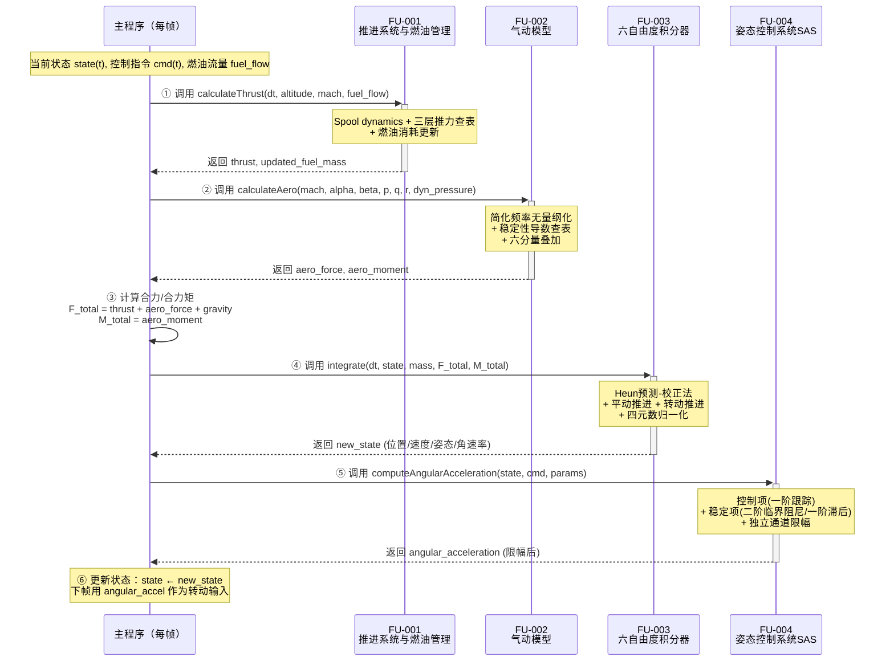
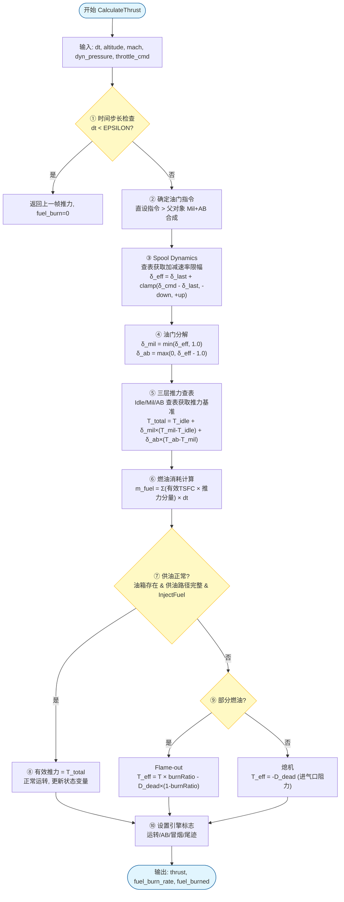
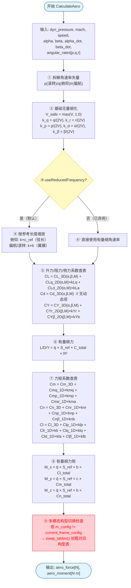
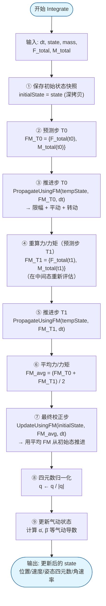
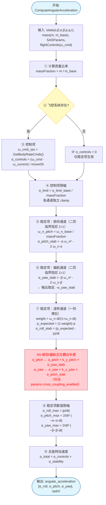

# 功能单元实现规格 — Function Unit Migration Design

>**需求编号**：REQ-001  
>**需求名称**：使用六自由度模型计算无人机的姿态和轨迹  
>**文档状态**：待最终确认  
>**生成时间**：2026-06-18 17:00  
>**最后确认时间**：2026-06-22（v0.3迭代）  
>**设计者**：AI + 待人工确认  
>**关联文件**：  
>- `workspace/requirements/gap-specs.jsonl` — 原子功能规格输入
>- `docs/algorithms/flight-dynamics-jet-engine-card.md` — FU-001 喷气发动机推力模型算法卡片
>- `docs/algorithms/flight-dynamics-propulsion-fuel-card.md` — FU-001 推进系统与燃油管理算法卡片
>- `docs/algorithms/flight-dynamics-rigidbody-aero-coefficient-card.md` — FU-002 气动系数模型算法卡片
>- `docs/algorithms/flight-dynamics-rigid-body-integrator-card.md` — FU-003 六自由度积分器算法卡片
>- `docs/algorithms/flight-dynamics-pointmass-sas-card.md` — FU-004 姿态控制系统算法卡片
>- `docs/requirements/confirmed_requirement_doc/requirement-to-afsim-trace.md` — 需求追溯矩阵
>- `docs/requirements/confirmed_requirement_doc/requirement-gap-analysis.md` — 需求缺口分析

---

## 全局设计约定

以下约定适用于本迁移计划中的所有功能单元（FU），各 FU 章节不再重复说明。

### 目标系统环境
| 项目 | 约定 |
|------|------|
| **语言标准** | C++17 |
| **数学库** | Eigen 3.x（向量/矩阵/四元数） |
| **构建系统** | CMake 3.14+ |
| **目标平台** | Windows / Linux 跨平台 |
| **代码目录** | `tests/migration_src/REQ_001/` |

### 全局类型映射
| AFSIM 类型 | 目标系统类型 | 头文件 |
|------------|-------------|--------|
| `double` | `double` | — |
| `int64_t` | `int64_t` | `<cstdint>` |
| `bool` | `bool` | — |
| `UtVec3dX` | `Eigen::Vector3d` | `<Eigen/Dense>` |
| `UtQuaternion` | `Eigen::Quaterniond` | `<Eigen/Geometry>` |
| `UtDCM` | `Eigen::Matrix3d` | `<Eigen/Geometry>` |
| `UtTable::Table` | `InterpTableND`（自定义多维插值） | `interp_table.h` |
| `UtTable::Curve` | `InterpCurve1D`（自定义1D曲线） | `interp_curve.h` |
| `std::vector<T>` | `std::vector<T>` | `<vector>` |
| `std::unordered_map<K,V>` | `std::unordered_map<K,V>` | `<unordered_map>` |

### 全局单位约定
| 物理量 | AFSIM 单位 | 目标系统单位 | 转换关系 |
|--------|-----------|-------------|----------|
| 位置 | ft | m | 1 ft = 0.3048 m |
| 速度 | ft/s | m/s | 1 ft/s = 0.3048 m/s |
| 质量 | lbm (pound-mass) | kg | 1 lbm = 0.453592 kg |
| 力 / 推力 | lbf (pound-force) | N | 1 lbf = 4.44822 N |
| 力矩 | ft-lbf | N·m | 1 ft-lbf = 1.35582 N·m |
| 角度 | rad | rad | 一致 |
| 角速率 | rad/s | rad/s | 一致 |
| 转动惯量 | slug-ft² | kg·m² | 1 slug-ft² = 1.35582 kg·m² |
| 动压 | lb/ft² | Pa (N/m²) | 1 lb/ft² = 47.8803 Pa |
| 重力加速度 | 9.80665 m/s² | 9.80665 m/s² | 一致 |

> **单位策略**：内部计算全部使用 SI 单位制，接口输入输出使用 SI 单位。在关键公式注释中标注原始 AFSIM Imperial 值以保持可追溯性。

## 实现流程

本需求将无人机六自由度仿真拆分为四个功能单元（FU），按流水线顺序依次调用。每帧的主程序驱动流程如下：

1. 流程图如下：

2. 接口信息如下：

| 流程步骤 | 函数                             | 所属 FU  | 输入来源               | 输出去向       |
| ---- | ------------------------------ | ------ | ------------------ | ---------- |
| ①    | `calculateThrust()`            | FU-001 | 飞行状态 + 油门指令        | → 步骤③ 合力计算 |
| ②    | `calculateAero()`              | FU-002 | 飞行状态 + 大气参数        | → 步骤③ 合力计算 |
| ③    | （主程序内置）                        | —      | FU-001/002 输出 + 重力 | → 步骤④ 积分器  |
| ④    | `integrate()`                  | FU-003 | 合力/合力矩 + 当前状态      | → 步骤⑤ SAS  |
| ⑤    | `computeAngularAcceleration()` | FU-004 | 新状态 + 飞控指令         | → 下帧 步骤③   |

---

## FU-001：推进系统与燃油管理

| 属性       | 内容                                                                                                                                           |
| -------- | -------------------------------------------------------------------------------------------------------------------------------------------- |
| **关联需求** | REQ-001                                                                                                                                      |
| **优先级**  | 中                                                                                                                                            |
| **来源类型** | `afsim`（AFSIM 参考：`JetEngine::CalculateThrust` + `FuelTank`）                                                                                  |
| **设计版本** | v1.0 draft                                                                                                                                   |
| **设计日期** | 2026-06-18                                                                                                                                   |
| **功能描述** | 根据发动机燃油流量输入和当前飞行状态（速度、高度）计算发动机推力，并更新燃油消耗量。需实现喷气发动机推力模型（含 Idle/Mil/AB 三层查表 + spool dynamics 转速加减速动特性）和燃油管理系统（含燃油消耗率限制、多油箱燃油传输比例协调、CG 位置线性插值）。 |

---

### 功能概述

该功能单元负责两个紧密耦合的子功能：(1) **喷气发动机推力模型**——根据油门指令、飞行高度和马赫数，通过三层推力查表（Idle/Mil/AB）和油门 spool dynamics（转速加减速动特性）计算发动机推力和燃油消耗率；(2) **燃油管理系统**——管理油箱燃油消耗、多油箱间燃油传输、CG 位置线性插值和总质量属性汇总。在仿真流程中位于步骤①，为积分器提供推进力输入和更新后的燃油质量。迁移必要性：目标系统为空系统，无任何推进或燃油管理代码。

### 算法流程

#### 算法流程图如下：

#### 关键算法

1. （对应到流程图中的流程③）：Spool Dynamics 转速加减速动特性[引用](docs/algorithms/flight-dynamics-jet-engine-card.md)
计算有效油门的公式如下：
$$\delta_{eff}(t + \Delta t) = \delta_{eff}(t) + \text{clamp}\left(\delta_{cmd} - \delta_{eff}(t), -\dot{\delta}_{down} \cdot \Delta t, +\dot{\delta}_{up} \cdot \Delta t\right)$$
其中$\delta_{eff}$为有效油门（0=熄火/1=军推/2=全加力），$\dot{\delta}_{up}$和$\dot{\delta}_{down}$为加减速率（Mil段和AB段分别取值，可为标量或1D曲线查表），模拟发动机转子惯性引起的油门响应滞后。

2. （对应到流程图中的流程⑤）：三层推力查表+增量叠加[引用](docs/algorithms/flight-dynamics-jet-engine-card.md)
计算总推力的公式如下：
$$T_{total} = T_{idle} + \delta_{mil} \cdot (T_{mil} - T_{idle}) + \delta_{ab} \cdot (T_{ab} - T_{mil})$$
其中$T_{idle}, T_{mil}, T_{ab}$分别为Idle/Mil/AB工况推力（由1D曲线`f(altitude)`或2D表`f(mach, altitude)`查表获得），简单模式优先（推力 vs 高度），2D表模式作为可选扩展。

3. （对应到流程图中的流程⑥）：增量化 TSFC 燃油消耗[引用](docs/algorithms/flight-dynamics-jet-engine-card.md)
计算燃油消耗的公式如下：
$$m_{fuel} = \left(T_{idle} \cdot SFC_{idle\_pps} + \delta_{mil} \cdot T_{mil\_inc} \cdot SFC_{mil\_eff\_pps} + \delta_{ab} \cdot T_{ab\_inc} \cdot SFC_{ab\_eff\_pps}\right) \cdot \Delta t$$
其中有效 TSFC 从额定推力和名义 TSFC 反算（仅使用增量部分）。

### 接口详细定义（API）如下：

1. 函数`calculateThrust`：为实现喷气发动机推力模型中的推力计算和燃油消耗部分，`calculateThrust`将油门 spool dynamics、三层查表和 TSFC 燃油消耗组合为一次调用。

| 项目 | 说明 |
|------|------|
| **签名** | `ThrustOutput calculateThrust(double dt, double altitude_m, double dyn_pressure_pa, double mach, double throttle_cmd, bool update_state = true);` |
| **输入** | 详见下表 |
| **输出** | `ThrustOutput` 结构体：`thrust_N`（推力, N）、`fuel_burn_rate_kgs`（燃油消耗率, kg/s）、`fuel_burned_kg`（本步消耗燃油, kg）、`engine_operating`（发动机是否运转）、`afterburner_on`（加力是否开启） |
| **前置条件** | `dt > 0`，`altitude_m ≥ 0`，`dyn_pressure_pa ≥ 0`，`mach ≥ 0` |
| **后置条件** | 若 `update_state=true`，内部状态（有效油门、RPM指示）已更新 |
| **复杂度** | O(1) × 查表次数（简单模式约 7 次 1D 插值） |

- **输入参数详细表**：

| 参数名 | 类型 | 有效范围/约束 | 说明 |
|--------|------|---------------|------|
| `dt` | `double` | (0, 1.0] s | 仿真步长 |
| `altitude_m` | `double` | [0, 50000] m | MSL 海拔高度 |
| `dyn_pressure_pa` | `double` | [0, ∞) Pa | 自由流动压 q̄ = 0.5·ρ·V² |
| `mach` | `double` | [0, 10] | 飞行马赫数 |
| `throttle_cmd` | `double` | [0, 2] | 油门指令（0=Idle/1=Mil/2=全AB） |
| `update_state` | `bool` | — | 是否更新内部状态变量 |

- **补充参数详细表**：

| 参数名 | 类型 | 有效范围/约束 | 说明 |
|--------|------|---------------|------|
| `m_spin_up_mil_` | `double` | (0, 10] /s | Mil段最大油门加速率（配置参数） |
| `m_spin_down_mil_` | `double` | (0, 10] /s | Mil段最大油门减速率（配置参数） |
| `m_spin_up_ab_` | `double` | (0, 10] /s | AB段最大油门加速率（配置参数） |
| `m_spin_down_ab_` | `double` | (0, 10] /s | AB段最大油门减速率（配置参数） |
| `m_idle_thrust_curve_` | `InterpCurve1D*` | — | Idle推力 vs 海拔 1D曲线（配置参数） |
| `m_mil_thrust_curve_` | `InterpCurve1D*` | — | Mil推力 vs 海拔 1D曲线（配置参数） |
| `m_ab_thrust_curve_` | `InterpCurve1D*` | — | AB推力 vs 海拔 1D曲线（配置参数） |
| `m_afterburner_present_` | `bool` | — | 是否配置加力燃烧室（配置参数） |
| `m_inject_fuel_` | `bool` | true | 供油开关（运行时状态） |

2. 函数`updateFuelBurn`：为实现燃油管理中的燃油消耗更新部分，`updateFuelBurn`处理燃油箱的燃料消耗请求，受速率和容量双重限制。

| 项目 | 说明 |
|------|------|
| **签名** | `FuelBurnResult updateFuelBurn(double dt, double burn_request_kg);` |
| **输入** | `dt`（仿真步长, s）、`burn_request_kg`（请求燃烧燃油质量, kg） |
| **输出** | `FuelBurnResult`：`able_to_provide`（bool）、`actual_burned_kg`（实际燃烧量, kg）、`new_mass_kg`（新油量, kg）、`new_cg_m`（新 CG 位置, Eigen::Vector3d） |
| **前置条件** | `dt > 0`, `burn_request_kg ≥ 0` |
| **后置条件** | `m_current_quantity_kg ≥ 0`（永不小于零） |
| **复杂度** | O(1) |

- **输入参数详细表**：

| 参数名 | 类型 | 有效范围/约束 | 说明 |
|--------|------|---------------|------|
| `dt` | `double` | (0, 1.0] s | 仿真步长 |
| `burn_request_kg` | `double` | [0, ∞) kg | 请求燃烧的燃油质量 |

- **补充参数详细表**：

| 参数名 | 类型 | 有效范围/约束 | 说明 |
|--------|------|---------------|------|
| `m_max_flow_rate_kgps_` | `double` | [0, ∞) kg/s | 最大供油速率（配置参数） |
| `m_current_quantity_kg_` | `double` | [0, m_max_quantity_kg_] | 当前燃油质量（运行时状态） |
| `m_max_quantity_kg_` | `double` | (0, ∞) kg | 油箱最大容量（配置参数） |

3. 函数`updateFuelTransfer`：为实现燃油管理中的多油箱传输协调部分，按比例因子协调多源到多目标的燃油传输。

| 项目 | 说明 |
|------|------|
| **签名** | `void updateFuelTransfer(double dt, const std::vector<FuelTransferLink>& transfers);` |
| **输入** | `dt`（步长, s）、`transfers`（传输链路列表，每链路含源油箱名/目标油箱名/传输速率配置） |
| **输出** | 无（修改内部油箱状态） |
| **前置条件** | `dt > 0`，所有源/目标油箱已注册 |
| **后置条件** | 传输完成，超量请求已按等比压缩 |
| **复杂度** | O(T×S)，T=传输链路数，S=每链路源油箱数 |

### 耦合度与依赖分析

#### 依赖

- **头文件**：`<Eigen/Dense>`、`<vector>`、`<unordered_map>`、`<memory>`、`<cmath>`
- **自定义头文件**：`interp_curve.h`（1D插值曲线）、`interp_table.h`（2D插值表）、`rigid_body_state.h`（共享状态结构体）
- **外部库**：Eigen 3.x（仅矢量类型 `Vector3d`）
- **AFSIM 参考源**：`wsf_six_dof/source/WsfSixDOF_JetEngine.cpp` (CalculateThrust, ~436行)、`WsfSixDOF_FuelTank.cpp` (UpdateFuelBurn/CalcCgLocation_ft, ~400行)、`WsfSixDOF_PropulsionSystem.cpp` (Update, ~170行)

#### 耦合度评估

| 评估维度 | 说明 |
|----------|------|
| 框架耦合 | 中 — JetEngine 继承自 Engine 基类，PropulsionSystem 依赖 Mover 的 freeze 标志。迁移时定义等效抽象接口替代。 |
| 数据耦合 | 中 — 依赖 KinematicState（速度/高度/马赫数）、FuelTank 对象（油箱状态）。迁移时替换为自定义数据结构。 |
| 控制耦合 | 低 — 推力计算为纯函数（给定输入→输出），仅油门 spool dynamics 需帧间状态。 |
| 外部依赖 | 低 — 仅依赖查表引擎（替换为自定义插值），无数据库/网络/硬件。 |

**综合等级**：中  
**剥离策略**：将 JetEngine 和 FuelTank 拆分为独立类，定义清晰的 I/O 接口；使用标准 C++ 和 Eigen 替代 AFSIM 矢量类型；查表引擎替换为自定义 `InterpCurve1D`/`InterpTable2D`。优先实现简单 1D 曲线模式，2D 表模式作为可选扩展。AB 相关逻辑通过 `m_afterburner_present_` 开关控制。

### 内部状态与生命周期

| 状态变量 | 类型 | 默认值 | 生命周期 | 线程安全 | 备注 |
|----------|------|--------|----------|----------|------|
| `m_last_throttle_` | `double` | 0.0 | 对象级 | **是** | 上一帧有效油门 [0, 2]，spool dynamics 初值（受 m_mutex_ 保护） |
| `m_current_thrust_N_` | `double` | 0.0 | 对象级 | **是** | 当前推力值（极小 dt 时返回此值）（受 m_mutex_ 保护） |
| `m_engine_percent_rpm_` | `double` | 0.0 | 对象级 | **是** | 发动机转速百分比 = 100.0 × δ_mil（受 m_mutex_ 保护） |
| `m_throttle_position_set_` | `bool` | false | 对象级 | **是** | 标记直设油门是否有效（受 m_mutex_ 保护） |
| `m_inject_fuel_` | `bool` | true | 对象级 | **是** | 供油开关（受 m_mutex_ 保护） |
| `m_current_fuel_tank_` | `FuelTank*` | nullptr | 对象级 | **是** | 当前供油油箱指针（受 m_mutex_ 保护） |
| `m_current_quantity_kg_` | `double` | 0.0 | 对象级 | **是** | 油箱当前燃油质量（受 m_mutex_ 保护） |
| `m_cg_current_m_` | `Eigen::Vector3d` | (0,0,0) | 对象级 | **是** | 当前燃油 CG 位置（受 m_mutex_ 保护） |
| `m_mutex_` | `std::mutex` | — | 对象级 | **是** | 保护所有运行时状态变量的互斥锁 |

- **是否需要 `reset()` 函数**：是 — 将有效油门、当前推力、RPM、燃油量等运行时状态重置为初始值（需加锁）
- **拷贝/移动行为**：禁止拷贝（含 std::mutex 成员），支持移动语义
- **其他说明**：构造后必须调用 `loadConfig()` 加载推力表、TSFC、油箱参数等；首次调用 `calculateThrust()` 前需设置初始油门位置；`calculateThrust()` 内部使用 `std::lock_guard<std::mutex>` 保护状态读写

### 错误处理策略

| 异常场景 | 检测条件 | 处理方式 | 返回/错误码 |
|----------|----------|----------|-------------|
| 非法输入（dt ≤ 0） | 函数入口 if 判断 | 返回当前推力，燃油消耗=0 | `{current_thrust, 0, 0}` |
| 查表输入越界（高度/马赫） | 插值引擎检测 | 边界钳位（clamp to range），打印警告 | 边界值 |
| 油箱容量 ≤ 0 | 构造时检查 | 抛出 `std::invalid_argument` | — |
| 燃油不足（油箱不够烧） | `remainingAfterBurn < 0` | `burnAmount = burnRequest + remainingAfterBurn` | `able_to_provide = false` |
| 燃油路径中断（油箱被抛弃） | 检查 `FuelFlowPathIntact()` | 置空油箱指针，进入 deadEngine | 推力 = -deadEngineDrag |
| 主动断油（`m_inject_fuel_ == false`） | 每帧检查 | 进入 deadEngine 状态 | 推力 = 0 + 进气口阻力 |
| 并发调用导致状态不一致 | 多线程同时调用 `calculateThrust()` | `std::lock_guard<std::mutex>` 串行化访问 | 正常 |

### 风险与未决问题

- **技术风险**：Spool dynamics 的加减速率参数为发动机型号特有数据，AFSIM 默认值可能不适用于目标无人机型号——需通过发动机手册或系统辨识获取准确参数
- **技术风险**：三层推力表和 TSFC 数据为发动机制造商机密数据，AFSIM 默认数据表仅供开发测试，需最终用户替换为真实数据
- **合规风险**：低 — 核心算法（速率限制一阶滞后 + 线性插值查表）为公开工程方法
- **已确认**：支持 AB（加力燃烧室），通过 `m_afterburner_present_` 开关控制，默认开启

### 人工确认
请逐项勾选确认：

- [x] 耦合评估合理 — **v0.3确认**
- [x] 接口适配方案可行 — **v0.3确认**
- [x] 数据类型映射正确 — **v0.3确认**
- [x] 内部状态管理设计合理 — **v0.3确认（已添加多线程保护）**
- [x] 错误处理策略完整 — **v0.3确认（已添加并发场景）**

**修改要求**（v0.2 反馈）：  
多线程安全 + 支持AB 
→ **v0.3 已处理**：所有状态变量加 m_mutex_ 保护；AB 已确认支持
______________________________________________  

**确认人**：**待最终确认**  
**确认日期**：**待最终确认**  

---

## FU-002：气动模型

| 属性       | 内容                                                                                                                                                |
| -------- | ------------------------------------------------------------------------------------------------------------------------------------------------- |
| **关联需求** | REQ-001                                                                                                                                           |
| **优先级**  | 中                                                                                                                                                 |
| **来源类型** | `afsim`（AFSIM 参考：`RigidBodyAeroCoreObject::CalculateCoreAeroFM`）                                                                                  |
| **设计版本** | v1.0 draft                                                                                                                                        |
| **设计日期** | 2026-06-18                                                                                                                                        |
| **功能描述** | 根据无人机当前飞行状态（马赫数、攻角、侧滑角、角速率）计算气动六分量（升力、阻力、侧力、滚转力矩、俯仰力矩、偏航力矩）。需实现 RigidBody 稳定性导数气动系数模型，支持高维查表（Ma×α×β×p×q×r 6维插值）、静态3D表项与动态阻尼增量线性叠加、动压×参考面积×参考长度缩放。 |

---

### 功能概述

该功能单元根据飞行器的瞬时飞行状态（马赫数、攻角 α、侧滑角 β、角速率 p/q/r、攻角变化率 α̇、侧滑角变化率 β̇），通过稳定性导数法计算六分量气动力和力矩。核心机制是"简化频率（Reduced Frequency）"无量纲化——将角速率和变化率除以 2V 得到无量纲频率，按参考长度（弦长或翼展）缩放后乘以对应的动态导数，再与静态 3D 表项（α×β×Mach）线性叠加，最后乘以动压、参考面积和参考长度得到有量纲力/力矩。在仿真流程中位于步骤②，为积分器提供气动力和气动力矩输入。迁移必要性：目标系统为空系统，无任何气动模型代码。

### 算法流程

#### 算法流程图如下：

#### 关键算法

1. （对应到流程图中的流程②④）：简化频率无量纲化[引用](docs/algorithms/flight-dynamics-rigidbody-aero-coefficient-card.md)
计算简化频率的公式如下：
$$k_q = \frac{q}{2V} \cdot c_{ref}, \quad k_r = \frac{r}{2V} \cdot b, \quad k_p = \frac{p}{2V} \cdot b, \quad k_{\dot{\alpha}} = \frac{\dot{\alpha}}{2V} \cdot c_{ref}, \quad k_{\dot{\beta}} = \frac{\dot{\beta}}{2V} \cdot b$$
其中$V$为真空速（有下限保护 `max(V, 1.0)`），$c_{ref}$为参考弦长（俯仰相关），$b$为翼展（偏航/滚转相关）。各分量独立缩放，消除飞行器尺寸和速度的量纲影响。

2. （对应到流程图中的流程⑤⑦）：六分量系数叠加[引用](docs/algorithms/flight-dynamics-rigidbody-aero-coefficient-card.md)
计算升力系数的公式如下：
$$C_{L\_total} = C_L(\alpha, \beta, M) + C_{L_q}(\alpha, M) \cdot k_{Lq} + C_{L_{\dot{\alpha}}}(\alpha, M) \cdot k_{La}$$
各力/力矩系数由静态 3D 表项 + 各自动态导数 × 对应简化频率叠加。空表（未配置的导数）返回 0.0。力系数含 3 组，力矩中滚转力矩系数最多（含 6 项：静态+Clp+Clr+Clq+Clα̇+Clβ̇）。

3. （对应到流程图中的流程⑥⑧）：有量纲化为力和力矩[引用](docs/algorithms/flight-dynamics-rigidbody-aero-coefficient-card.md)
计算有量纲升力和俯仰力矩的公式如下：
$$L = \bar{q} \cdot S_{ref} \cdot C_{L\_total} \cdot R^2, \quad M_y = \bar{q} \cdot S_{ref} \cdot c_{ref} \cdot C_{m\_total}$$
其中$\bar{q}$为动压，$S_{ref}$为参考面积（机翼面积或显式参考面积），$R$为几何尺度因子，$c_{ref}$为参考弦长（滚转/偏航力矩用翼展 $b$）。力矩不再乘 $R^2$。

4. （对应到流程图中的流程⑨）：多模态气动构型系数切换[引用](docs/algorithms/flight-dynamics-rigidbody-aero-coefficient-card.md)
计算构型切换过渡的公式如下：
$$C_{\text{current}} = C_{\text{base}} + \Delta C_{\text{config}}(k)$$
其中$\Delta C_{\text{config}}(k)$为构型 $k$（如巡航/襟翼收起/襟翼放下/外挂等）对应的气动系数增量表，在多张基本表的基础上叠加对应构型的增量表进行查表。空构型（未配置的增量表）返回 0.0。构型切换通过 `setConfiguration(AeroConfig k)` 触发。

### 接口详细定义（API）如下：

1. 函数`calculateAero`：为实现稳定性导数气动系数模型中的六分量气动力和力矩计算，`calculateAero`将简化频率无量纲化、20+ 张气动表查表和系数叠加组合为一次调用。

| 项目 | 说明 |
|------|------|
| **签名** | `AeroOutput calculateAero(const AeroInput& input) const;` |
| **输入** | 详见下表 |
| **输出** | `AeroOutput` 结构体：`force_N`（气动力矢量 [L,D,Y], N）、`moment_Nm`（气动力矩矢量 [Mx,My,Mz], N·m） |
| **前置条件** | `input.speed_mps > 0`（内部取 `max(speed, 1.0)` 防除零）；所有表已加载 |
| **后置条件** | 无副作用（const 方法，不修改任何内部状态） |
| **复杂度** | O(T × 插值)，T ≈ 20 次查表（6 次 3D + 6 次 2D + 8 次 1D） |

- **输入参数详细表**：

| 参数名 | 类型 | 有效范围/约束 | 说明 |
|--------|------|---------------|------|
| `dyn_pressure_pa` | `double` | [0, ∞) Pa | 自由流动压 q̄ |
| `mach` | `double` | [0, 10] | 飞行马赫数 |
| `speed_mps` | `double` | (0, ∞) m/s | 真空速（内部下限保护 1.0） |
| `alpha_rad` | `double` | [-π, π] rad | 攻角 |
| `beta_rad` | `double` | [-π/2, π/2] rad | 侧滑角 |
| `alpha_dot_rps` | `double` | 任意 | 攻角变化率 |
| `beta_dot_rps` | `double` | 任意 | 侧滑角变化率 |
| `angular_rates_rps` | `Eigen::Vector3d` | 任意 | [p, q, r] 体轴角速率 |
| `radius_factor` | `double` | (0, ∞) | 几何尺度因子，默认 1.0 |

- **补充参数详细表**：

| 参数名 | 类型 | 有效范围/约束 | 说明 |
|--------|------|---------------|------|
| `m_wing_chord_m_` | `double` | (0, ∞) m | 平均气动弦长 MAC（配置参数） |
| `m_wing_span_m_` | `double` | (0, ∞) m | 翼展（配置参数） |
| `m_wing_area_m2_` | `double` | (0, ∞) m² | 机翼参考面积（配置参数） |
| `m_ref_area_m2_` | `double` | [0, ∞) m² | 显式参考面积（可选配置参数） |
| `m_use_reduced_frequency_` | `bool` | true | 简化频率开关（配置参数） |
| `m_table_cl_3d_` | `InterpTable3D*` | nullptr | CL(α,β,Mach) 静态3D表（配置参数） |
| `m_table_cd_3d_` 等 20+ 张表 | 各种 `InterpTable*` | nullptr | 其余静态/动态导数数据表（配置参数） |

2. 函数`setConfiguration`：为实现多模态气动构型切换，在运行时按需切换当前飞机的气动构型。

| 项目 | 说明 |
|------|------|
| **签名** | `void setConfiguration(AeroConfig config);` |
| **输入** | `config`（`AeroConfig` 枚举：`CRUISE`/`FLAP_DOWN`/`GEAR_DOWN`/`STORE_1`/`STORE_2`...） |
| **输出** | 无（内部切换查表指针到对应构型的增量表集） |
| **前置条件** | 目标构型的增量表已加载 |
| **后置条件** | `m_current_config_` 更新为新构型；下次 `calculateAero()` 调用生效 |
| **复杂度** | O(1) — 指针表交换 |

- **补充参数详细表**：

| 参数名 | 类型 | 有效范围/约束 | 说明 |
|--------|------|---------------|------|
| `config` | `AeroConfig` | 枚举值 | 目标气动构型标识 |
| `m_config_delta_tables_` | `std::map<AeroConfig, ConfigDeltaTableSet>` | 预加载 | 各构型对应的增量表集（配置参数） |

### 耦合度与依赖分析

#### 依赖

- **头文件**：`<Eigen/Dense>`、`<memory>`、`<cmath>`
- **自定义头文件**：`interp_table.h`（2D/3D 多维插值表）、`interp_curve.h`（1D 插值曲线）、`rigid_body_state.h`（共享状态结构体）
- **外部库**：Eigen 3.x（仅矢量类型 `Vector3d`）
- **AFSIM 参考源**：`wsf_six_dof/source/WsfRigidBodySixDOF_AeroCoreObject.cpp` (CalculateCoreAeroFM, ~200行)、`WsfSixDOF_AeroCoreObject.hpp` (基类, CL/Cd/CY 静态3D表)

#### 耦合度评估

| 评估维度 | 说明 |
|----------|------|
| 框架耦合 | 中 — 继承自 AeroCoreObject 基类。迁移时合并为单一扁平类。 |
| 数据耦合 | 中 — 依赖 20+ 张气动数据表（6 张静态 3D 表 + 6 张动态 2D 表 + 8 条动态 1D 曲线）和翼面几何参数。数据表为飞行器特有数据。 |
| 控制耦合 | 低 — `calculateAero` 为纯函数（14 个查表函数均无副作用）。 |
| 外部依赖 | 低 — 仅依赖自定义插值引擎。 |

**综合等级**：中  
**剥离策略**：将 AeroCoreObject 基类和 RigidBodyAeroCoreObject 子类合并为单一 `RigidBodyAeroModel` 类；用自定义多维插值替代 UtTable；所有查表前检查 nullptr（空表返回 0.0）；支持两种面积模式。

### 内部状态与生命周期

`RigidBodyAeroModel` 的计算函数 `calculateAero()` 为纯函数（const 方法）。

| 状态变量 | 类型 | 默认值 | 生命周期 | 线程安全 | 备注 |
|----------|------|--------|----------|----------|------|
| `m_wing_chord_m_` | `double` | 0.0 | 对象级（不变） | 是 | 平均气动弦长 MAC |
| `m_wing_span_m_` | `double` | 0.0 | 对象级（不变） | 是 | 翼展 |
| `m_wing_area_m2_` | `double` | 0.0 | 对象级（不变） | 是 | 机翼参考面积 |
| `m_ref_area_m2_` | `double` | 0.0 | 对象级（不变） | 是 | 显式参考面积 |
| `m_use_ref_area_` | `bool` | false | 对象级（不变） | 是 | 显式参考面积开关 |
| `m_use_reduced_frequency_` | `bool` | true | 对象级（不变） | 是 | 简化频率开关 |
| `m_aero_center_m_` | `Eigen::Vector3d` | (0,0,0) | 对象级（不变） | 是 | 气动中心位置 |
| `m_current_config_` | `AeroConfig` | `CRUISE` | 对象级（可变） | **是** | 当前气动构型标识（受互斥锁保护） |
| `m_config_mutex_` | `std::mutex` | — | 对象级 | 是 | 保护构型切换操作的互斥锁 |
| 各查表指针 | `InterpTable*` | nullptr | 对象级（不变） | 是 | 20+ 张气动数据表 |

- **是否需要 `reset()` 函数**：否 — 无运行时可变状态（但 `setConfiguration()` 可重置构型）
- **拷贝/移动行为**：禁止拷贝（含 std::mutex），支持移动；或使用 `std::shared_ptr` 共享表数据
- **其他说明**：构造后必须调用 `loadConfig()` 加载气动数据表和几何参数；运行时调用 `setConfiguration()` 切换构型，内部加锁保护

### 错误处理策略

| 异常场景 | 检测条件 | 处理方式 | 返回/错误码 |
|----------|----------|----------|-------------|
| 速度为零（除零保护） | `speed_mps < 1.0` | 内部取 `max(speed, 1.0)` 作为分母 | 有效简化频率值 |
| 查表为空（未配置导数） | 指针 == nullptr | 对应系数项返回 0.0 | 部分零输出 |
| 查表输入越界 | 插值引擎检测 | 边界钳位 | 边界值 |
| 翼面几何参数为 0 | 初始化检查 | 打印严重警告 | 所有力/力矩 = 0 |
| 配置解析失败 | 初始化阶段 | 抛出 `std::runtime_error` | 构造失败 |

### 风险与未决问题

- **技术风险**：20+ 张气动数据表为飞行器特有数据（通常来自风洞试验或 CFD），AFSIM 默认数据表仅供开发测试
- **技术风险**：3D 和 2D 线性插值在高超声速区域（Mach > 5）可能不够精确，需评估是否采用高阶插值
- **技术风险**：简化频率公式在极低速下（V ≈ 0）产生大值，虽已做下限保护但低速段物理意义减弱
- **已确认**：支持多模态气动构型切换（巡航/襟翼/起落架/外挂），通过 `AeroConfig` 枚举 + 增量表集实现

### 人工确认
请逐项勾选确认：

- [x] 耦合评估合理 — **v0.3确认**
- [x] 接口适配方案可行 — **v0.3确认**
- [x] 数据类型映射正确 — **v0.3确认**
- [x] 内部状态管理设计合理 — **v0.3确认（已添加构型切换 + 多线程保护）**
- [x] 错误处理策略完整 — **v0.3确认**

**修改要求**（v0.2 反馈）：  
需要支持多模态气动构型切换
→ **v0.3 已处理**：新增 `setConfiguration()` API + `AeroConfig` 枚举 + 构型增量表集
______________________________________________  

**确认人**：**待最终确认**  
**确认日期**：**待最终确认**  

---

## FU-003：六自由度积分器

| 属性 | 内容 |
|------|------|
| **关联需求** | REQ-001 |
| **优先级** | 高 |
| **来源类型** | `afsim`（AFSIM 参考：`RigidBodyIntegrator::Update` + `CalculateFM` + `PropagateUsingFM`） |
| **设计版本** | v1.0 draft |
| **设计日期** | 2026-06-18 |
| **功能描述** | 使用 Heun 预测-校正法（二阶Runge-Kutta）对无人机进行六自由度时间推进。将合外力（推力+气动力+重力）和合外力矩转化为线加速度和角加速度，通过四元数姿态积分和欧拉转动方程（含完整转动惯量张量 I_xx/I_yy/I_zz/I_xz）更新飞行状态（位置、速度、姿态四元数、角速度）。 |

---

### 功能概述

该功能单元是整个六自由度仿真的核心。采用 Heun 预测-校正法在每帧内执行两次力/力矩评估和两次状态推进，取平均力/力矩完成最终状态更新。积分器同时处理平动（牛顿第二定律 → 位置/速度更新）和转动（欧拉转动方程 → 角速率更新 + 四元数姿态积分 → 姿态更新），并包含力/力矩限幅和四元数归一化等数值保护。在仿真流程中位于步骤④，接收合力/合力矩输入，输出更新后的完整运动学状态。迁移必要性：目标系统为空系统，无任何运动学积分代码；FU-003 是最高优先级——其他 FU 的输出均依赖积分器进行时间推进。

### 算法流程

#### 算法流程图如下：

#### 关键算法

1. （对应到流程图中的流程②-⑦）：Heun 预测-校正法框架[引用](docs/algorithms/flight-dynamics-rigid-body-integrator-card.md)
Heun 法是显式二阶 Runge-Kutta 方法，公式如下：
$$\mathbf{FM}_0 = \text{CalculateFM}(\mathbf{x}_0, t_0), \quad \tilde{\mathbf{x}} = \text{Propagate}(\mathbf{x}_0, \mathbf{FM}_0, \Delta t)$$
$$\mathbf{FM}_1 = \text{CalculateFM}(\tilde{\mathbf{x}}, t_0 + \Delta t), \quad \tilde{\mathbf{x}} \leftarrow \text{Propagate}(\tilde{\mathbf{x}}, \mathbf{FM}_1, \Delta t)$$
$$\mathbf{FM}_{\text{avg}} = (\mathbf{FM}_0 + \mathbf{FM}_1) / 2, \quad \mathbf{x}_1 = \text{Propagate}(\mathbf{x}_0, \mathbf{FM}_{\text{avg}}, \Delta t)$$
其中$\mathbf{x}_0$为初始状态，$\tilde{\mathbf{x}}$为临时中间状态，$\mathbf{FM}_{avg}$为两点力/力矩算术平均。

2. （对应到流程图中的流程③⑤⑦）：平动推进[引用](docs/algorithms/flight-dynamics-rigid-body-integrator-card.md)
计算平动的公式如下：
$$\mathbf{a}_{\text{body}} = \frac{\mathbf{F}_{\text{total}}}{m} \cdot g_0, \quad \mathbf{a}_{\text{WCS}} = \mathbf{R}_{\text{body2WCS}} \cdot \mathbf{a}_{\text{body}}$$
$$\mathbf{v}_{\text{new}} = \mathbf{v}_{\text{old}} + \mathbf{a}_{\text{WCS}} \cdot \Delta t, \quad \mathbf{r}_{\text{new}} = \mathbf{r}_{\text{old}} + \mathbf{v}_{\text{old}} \cdot \Delta t + \frac{1}{2} \mathbf{a}_{\text{WCS}} \cdot \Delta t^2$$
其中$\mathbf{R}_{\text{body2WCS}}$为体轴到 WCS 的 DCM，$g_0 = 9.80665$ m/s²。

3. （对应到流程图中的流程③⑤⑦）：转动推进[引用](docs/algorithms/flight-dynamics-rigid-body-integrator-card.md)
计算角加速度和四元数更新的公式如下：
$$\dot{p} = \frac{M_x}{I_{xx}}, \quad \dot{q} = \frac{M_y}{I_{yy}}, \quad \dot{r} = \frac{M_z}{I_{zz}}, \quad \boldsymbol{\omega}_{\text{new}} = \boldsymbol{\omega}_{\text{old}} + \dot{\boldsymbol{\omega}} \cdot \Delta t$$
$$\mathbf{q}_{\text{att}} = \text{QuatFromDCM}(\mathbf{R}), \quad \mathbf{q}_{\text{rate}} = \text{SetRate}(\mathbf{q}_{\text{att}}, \boldsymbol{\omega}), \quad \mathbf{q}_{\text{new}} = \mathbf{q} + \mathbf{q}_{\text{rate}} \cdot \Delta t, \quad \mathbf{q}_{\text{new}} \leftarrow \text{Normalize}(\mathbf{q}_{\text{new}})$$
四元数归一化是关键的数值稳定性步骤（防止长时间积分漂移）。

4. 力/力矩限幅保护[引用](docs/algorithms/flight-dynamics-rigid-body-integrator-card.md)
限幅公式如下：
$$|\mathbf{F}| \leq m \cdot G_{\max} \quad (G_{\max} = 1000g), \quad |\mathbf{M}_i| \leq I_{ii} \cdot \dot{\omega}_{\max} \quad (\dot{\omega}_{\max} \approx 62832 \text{ rad/s}^2)$$

### 接口详细定义（API）如下：

1. 函数`integrate`：为实现 Heun 预测-校正积分器中的完整时间推进，将预测-校正循环、平动推进、转动推进和四元数归一化组合为一次调用。

| 项目 | 说明 |
|------|------|
| **签名** | `void integrate(double dt, RigidBodyState& state, const MassProperties& mass, IForceProvider& aero, IForceProvider& propulsion, IForceProvider& gravity);` |
| **输入** | 详见下表 |
| **输出** | `state` 被更新为新时刻的运动学状态；四元数已归一化 |
| **前置条件** | `dt > 0`, `mass.mass_kg > 0`, 三个力源非空 |
| **后置条件** | `state.attitude_quat.norm() ≈ 1.0`（误差 < 1e-12） |
| **复杂度** | O(1) + 2 次力源评估（气动+推进+重力各 2 次） |

- **输入参数详细表**：

| 参数名 | 类型 | 有效范围/约束 | 说明 |
|--------|------|---------------|------|
| `dt` | `double` | (0, 1.0] s | 仿真步长 |
| `state` | `RigidBodyState&` | 有效状态 | 当前飞行器状态，被原地更新 |
| `mass` | `const MassProperties&` | mass_kg > 0 | 质量 + 转动惯量 [Ixx, Iyy, Izz] |
| `aero` | `IForceProvider&` | 非空 | 气动模型力源接口 |
| `propulsion` | `IForceProvider&` | 非空 | 推进系统力源接口 |
| `gravity` | `IForceProvider&` | 非空 | 重力计算力源接口 |

- **补充参数详细表**：

| 参数名 | 类型 | 有效范围/约束 | 说明 |
|--------|------|---------------|------|
| `kMaxG` | `constexpr double` | 1000.0 | 最大过载限制（g）（内置常量） |
| `kMaxOmegaDot` | `constexpr double` | 62831.85 | 最大角加速度限制（rad/s²）（内置常量） |
| `kGravity` | `constexpr double` | 9.80665 | 标准重力加速度（m/s²）（内置常量） |
| `m_enable_force_clamp_` | `bool` | true | 力/力矩限幅开关（配置参数） |

2. 函数`propagateTranslation`：为实现平动推进部分，将体轴加速度转换为惯性系并更新位置和速度。

| 项目 | 说明 |
|------|------|
| **签名** | `static void propagateTranslation(RigidBodyState& state, const Eigen::Vector3d& body_accel_mps2, const Eigen::Matrix3d& dcm, double dt);` |
| **输入** | `body_accel_mps2`（体轴加速度, m/s²）、`dcm`（body→WCS 方向余弦矩阵）、`dt`（步长） |
| **输出** | 更新 `state.position_m` 和 `state.velocity_mps` |
| **前置条件** | `dt > 0` |
| **复杂度** | O(1) |

- **输入参数详细表**：

| 参数名 | 类型 | 有效范围/约束 | 说明 |
|--------|------|---------------|------|
| `state` | `RigidBodyState&` | 有效状态 | 被更新位置和速度 |
| `body_accel_mps2` | `Eigen::Vector3d` | 任意 | 体轴系加速度 (m/s²) |
| `dcm` | `Eigen::Matrix3d` | 有效旋转矩阵 | body→WCS 方向余弦矩阵 |
| `dt` | `double` | (0, 1.0] s | 仿真步长 |

3. 函数`propagateRotation`：为实现转动推进部分，通过欧拉转动方程更新角速率，并完成四元数姿态积分和归一化。

| 项目 | 说明 |
|------|------|
| **签名** | `static void propagateRotation(RigidBodyState& state, const Eigen::Vector3d& omega_dot_rps2, const Eigen::Vector3d& inertia_diag, double dt);` |
| **输入** | `omega_dot_rps2`（角加速度, rad/s²）、`inertia_diag`（转动惯量对角线 [Ixx,Iyy,Izz], kg·m²）、`dt`（步长） |
| **输出** | 更新 `state.angular_velocity_rps` 和 `state.attitude_quat`，四元数已归一化 |
| **前置条件** | `dt > 0`, 惯量对角线 > 0 |
| **复杂度** | O(1) |

- **输入参数详细表**：

| 参数名 | 类型 | 有效范围/约束 | 说明 |
|--------|------|---------------|------|
| `state` | `RigidBodyState&` | 有效状态 | 被更新角速率和姿态四元数 |
| `omega_dot_rps2` | `Eigen::Vector3d` | 任意 | 角加速度 [ṗ, q̇, ṙ] (rad/s²) |
| `inertia_diag` | `Eigen::Vector3d` | 各分量 > 0 | 转动惯量 [Ixx, Iyy, Izz] (kg·m²) |
| `dt` | `double` | (0, 1.0] s | 仿真步长 |

4. 函数`collectTrajectory`：为实现飞行轨迹数据采集，将当前帧的完整运动学状态记录到内部缓冲区，供整个飞行过程分析使用。

| 项目 | 说明 |
|------|------|
| **签名** | `void collectTrajectory(const RigidBodyState& state);` |
| **输入** | `state`（当前帧积分后的完整运动学状态） |
| **输出** | 无（追加到 `m_trajectory_buffer_`） |
| **前置条件** | 状态已通过 `integrate()` 更新 |
| **后置条件** | 缓冲区新增一条轨迹记录 |
| **复杂度** | O(1) 摊销 |

- **输入参数详细表**：

| 参数名 | 类型 | 有效范围/约束 | 说明 |
|--------|------|---------------|------|
| `state` | `const RigidBodyState&` | 有效状态 | 当前帧的运动学状态快照 |

- **补充参数详细表**：

| 参数名 | 类型 | 有效范围/约束 | 说明 |
|--------|------|---------------|------|
| `m_trajectory_buffer_` | `std::vector<RigidBodyState>` | 受 m_state_mutex_ 保护 | 飞行轨迹数据缓冲区 |
| `kMaxTrajectorySize` | `constexpr size_t` | 100000 | 轨迹缓冲区最大条目数（环形缓冲） |

### 耦合度与依赖分析

#### 依赖

- **头文件**：`<Eigen/Dense>`、`<Eigen/Geometry>`、`<memory>`、`<cmath>`
- **自定义头文件**：`rigid_body_state.h`、`mass_properties.h`、`force_provider_interface.h`
- **外部库**：Eigen 3.x（Vector3d/Quaterniond/Matrix3d）
- **AFSIM 参考源**：`wsf_six_dof/source/WsfRigidBodySixDOF_Integrator.cpp`（Update ~100行 + CalculateFM ~150行 + PropagateUsingFM ~100行）、`WsfSixDOF_Integrator.cpp`（PropagateTranslation ~70行 + PropagateRotation ~55行）

#### 耦合度评估

| 评估维度 | 说明 |
|----------|------|
| 框架耦合 | 中-高 — 与 KinematicState、MassProperties、ForceAndMomentsObject、Mover 等多个 AFSIM 基础设施类耦合。迁移时全部替换。 |
| 数据耦合 | 高 — 依赖气动、推进、起落架三个外部子系统提供力/力矩。迁移时通过 IForceProvider 接口注入。 |
| 控制耦合 | 中 — 依赖仿真引擎主循环调用，内部通过 CalculateFM 聚合各子系统。 |
| 外部依赖 | 低 — 仅依赖数学库（Eigen）。 |

**综合等级**：中-高  
**剥离策略**：定义 `IForceProvider` 抽象接口，积分器通过依赖注入获取各力源；`KinematicState` 替换为 `RigidBodyState` 结构体（与所有 FU 共享）；`ForceAndMomentsObject` 参考点自动转换替换为显式 `convertRPtoCM()` 函数；初期实现起落架模型（影响起飞/降落），省略旋转地球效应。

### 内部状态与生命周期

`RigidBodyIntegrator` 类本身不持有帧间持久化运行状态。所有中间变量均为局部变量。`RigidBodyState` 由外部持有和传入。

| 状态变量 | 类型 | 默认值 | 生命周期 | 线程安全 | 备注 |
|----------|------|--------|----------|----------|------|
| `m_aero_provider_` | `IForceProvider*` | nullptr | 对象级 | **是** | 气动模型接口（外部注入，受 m_state_mutex_ 保护） |
| `m_propulsion_provider_` | `IForceProvider*` | nullptr | 对象级 | **是** | 推进系统接口（外部注入，受 m_state_mutex_ 保护） |
| `m_gravity_provider_` | `IForceProvider*` | nullptr | 对象级 | **是** | 重力计算接口（外部注入，受 m_state_mutex_ 保护） |
| `m_landing_gear_provider_` | `IForceProvider*` | nullptr | 对象级 | **是** | 起落架力源接口（外部注入，受 m_state_mutex_ 保护） |
| `m_enable_force_clamp_` | `bool` | true | 对象级 | **是** | 力/力矩限幅开关 |
| `m_trajectory_buffer_` | `std::vector<RigidBodyState>` | 空 | 对象级 | **是** | 飞行轨迹采集缓冲区（受 m_state_mutex_ 保护） |
| `m_state_mutex_` | `std::mutex` | — | 对象级 | 是 | 保护所有运行时状态变量的互斥锁 |

`RigidBodyState`（外部持有）包含完整运动学状态：`position_m`（Vector3d）、`velocity_mps`（Vector3d）、`attitude_quat`（Quaterniond）、`angular_velocity_rps`（Vector3d）。

- **是否需要 `reset()` 函数**：是 — 通过外部重置 `RigidBodyState` 实现，同时清空轨迹缓冲区 `m_trajectory_buffer_.clear()`
- **拷贝/移动行为**：禁止拷贝（含 std::mutex），支持移动语义
- **其他说明**：已确认初期实现起落架模型；积分前需设置初始状态、MassProperties 和力源接口；`integrate()` 每帧自动将新状态追加到 `m_trajectory_buffer_`

### 错误处理策略

| 异常场景 | 检测条件 | 处理方式 | 返回/错误码 |
|----------|----------|----------|-------------|
| 质量 ≤ 0 | `mass.mass_kg <= 0` | 跳过推进，不更新状态 | 状态不变 |
| 转动惯量对角线 ≤ 0 | `I_xx/I_yy/I_zz <= 0` | 跳过转动推进 | 部分更新 |
| 四元数模长过小 | `attitude_quat.norm() < 1e-6` | 重置为单位四元数，打印错误 | 重置姿态 |
| 力/力矩幅值异常 | 限幅检查 | 等比例缩放到上限 | 限幅后值 |
| 四元数归一化漂移 | 每次转动推进后 | `attitude_quat.normalize()` | 归一化 |
| 力源接口为空 | nullptr 检查 | 跳过对应力源 | 部分输出 |
| `dt ≤ 0` | 入口检查 | 直接返回，不更新状态 | 状态不变 |
| 并发调用 `integrate()` | 多线程同时调用 | `std::lock_guard<std::mutex>` 串行化 | 正常 |
| 轨迹缓冲区溢出 | `m_trajectory_buffer_.size() >= max` | 丢弃最早条目（环形缓冲） | 部分数据丢失 |

### 风险与未决问题

- **技术风险**：欧拉转动方程的对角惯量简化在某些构型下可能不够精确——可扩展为完整转动惯量张量求逆
- **技术风险**：Heun 法为二阶精度，对于高频振动可能不够——但六自由度刚体运动的主要频率远小于步长倒数
- **技术风险**：旋转地球效应初期省略——短距离/短时飞行仿真影响可忽略
- **已确认**：起落架模型 初期实现 —— 起落架影响飞机起飞和降落，通过 `IForceProvider` 接口注入 `m_landing_gear_provider_`

### 人工确认
请逐项勾选确认：

- [x] 耦合评估合理 — **v0.3确认**
- [x] 接口适配方案可行 — **v0.3确认（已新增轨迹采集 + 起落架力源）**
- [x] 数据类型映射正确 — **v0.3确认**
- [x] 内部状态管理设计合理 — **v0.3确认（已添加多线程保护 + 轨迹缓冲区）**
- [x] 错误处理策略完整 — **v0.3确认（已添加并发 + 溢出场景）**

**修改要求**（v0.2 反馈）：  
需要支持多线程安全运行；需要收集整个飞行过程中的姿态，如果起落架模型会影响飞机起飞或降落，就需要在初期实现
→ **v0.3 已处理**：全部状态变量加锁；新增 `collectTrajectory()` API + 环形缓冲；新增 `m_landing_gear_provider_` 起落架力源
______________________________________________  

**确认人**：**待最终确认**  
**确认日期**：**待最终确认**  

---

## FU-004：姿态控制系统 SAS

| 属性 | 内容 |
|------|------|
| **关联需求** | REQ-001 |
| **优先级** | 低 |
| **来源类型** | `afsim`（AFSIM 参考：`PointMassIntegrator::CalculateStabilityAugmentation`） |
| **设计版本** | v1.0 draft |
| **设计日期** | 2026-06-18 |
| **功能描述** | 实现三通道（滚转/俯仰/偏航）控制-稳定解耦姿态控制系统。将自动驾驶仪输出的控制指令（升降舵/副翼/方向舵偏转）转化为角加速度输出，含控制项（一阶指令跟踪）、稳定项（俯仰/偏航二阶临界阻尼 + 一阶滚转滞后）和各通道独立限幅保护。 |

---

### 功能概述

该功能单元实现三通道控制-稳定解耦的姿态控制系统（SAS）。核心设计是将旋转角加速度分解为两个独立项：(1) **控制项**——将飞控系统输出的期望体轴角速率指令通过一阶差分转化为角加速度，各轴独立限幅；(2) **稳定增稳项**——模拟飞行器固有静稳定性和气动阻尼，俯仰/偏航用二阶临界阻尼（ζ=1）将攻角/侧滑角驱回零，滚转用一阶滞后平滑。SAS 还通过质量比率（m/m_base）缩放限幅和频率——质量越小，飞行器越敏捷。在仿真流程中位于步骤⑤，为下帧转动推进提供限幅后的角加速度输入。迁移必要性：目标系统为空系统，无任何飞行控制系统代码；优先级最低，初期可用直接角加速度输入替代。

### 算法流程

#### 算法流程图如下：

#### 关键算法

1. （对应到流程图中的流程③）：控制项 — 一阶指令跟踪[引用](docs/algorithms/flight-dynamics-pointmass-sas-card.md)
计算控制项角加速度的公式如下：
$$\vec{\alpha}_{controls} = \frac{\vec{\omega}_{cmd} - \vec{\omega}_{current}}{dt_{mover}}$$
各轴独立限幅：$\alpha_i = \text{clamp}(\alpha_i, \pm |\alpha_{limit,i}|)$，其中$\vec{\omega}_{cmd}$为飞控系统输出的期望角速率（deg/s→rad/s），限幅值随质量减小而放大（$\alpha_{limit} = \alpha_{limit\_base} / massFraction$）。

2. （对应到流程图中的流程⑤⑥）：稳定项 — 俯仰/偏航二阶临界阻尼系统[引用](docs/algorithms/flight-dynamics-pointmass-sas-card.md)
计算俯仰通道稳定角加速度的公式如下：
$$\alpha_{pitch,stab} = -\alpha \cdot \omega_{n,pitch}^2 - 2 \cdot \omega_{n,pitch} \cdot \dot{\alpha}$$
其中$\omega_n = \omega_{n,base} / massFraction$，阻尼系数固定为 $\zeta = 1$（临界阻尼，最快回到零且无过冲）。恢复项为 $-\alpha \cdot \omega_n^2$，阻尼项为 $-2 \cdot \omega_n \cdot \dot{\alpha}$。偏航通道同理（最终输出取反：`-α_yaw_stab`）。

3. （对应到流程图中的流程⑦）：稳定项 — 滚转一阶滞后平滑[引用](docs/algorithms/flight-dynamics-pointmass-sas-card.md)
计算滚转通道稳定角加速度的公式如下：
$$\text{weight} = \frac{\omega_{n,roll} \cdot dt}{1 + \omega_{n,roll} \cdot dt}, \quad \dot{p}_{expected} = (1 - \text{weight}) \cdot p, \quad \alpha_{roll,stab} = \frac{\dot{p}_{expected} - p}{dt}$$
等效于低通滤波器时间常数 $\tau = 1/\omega_{n,roll}$，将滚转速率平滑驱向零。

4. （对应到流程图中的流程⑤b）：俯仰/偏航交叉耦合补偿[引用](docs/algorithms/flight-dynamics-pointmass-sas-card.md)
计算交叉耦合补偿的公式如下：
$$\alpha_{pitch}' = \alpha_{pitch,stab} + k_{y\_pitch} \cdot \alpha_{yaw,stab}, \quad \alpha_{yaw}' = \alpha_{yaw,stab} + k_{z\_yaw} \cdot \alpha_{pitch,stab}$$
其中$k_{y\_pitch}$为偏航→俯仰交叉耦合系数，$k_{z\_yaw}$为俯仰→偏航交叉耦合系数（来自 `SASParams`）。交叉耦合仅在 `params.cross_coupling_enabled == true` 时生效。补偿后重新执行数值限幅保护。此修正 解决了 PointMass 简化方案应用到 RigidBody 模型时的通道间耦合效应缺失问题。

### 接口详细定义（API）如下：

1. 函数`computeAngularAcceleration`：为实现三通道控制-稳定解耦 SAS 中的旋转角加速度计算，将控制项、稳定项和限幅组合为一次调用。

| 项目 | 说明 |
|------|------|
| **签名** | `Eigen::Vector3d computeAngularAcceleration(const RigidBodyState& state, const MassProperties& mass, const SASParams& params, const IFlightControlSystem* fcs, double mover_dt);` |
| **输入** | 详见下表 |
| **输出** | `Eigen::Vector3d` — 总旋转角加速度 [α_roll, α_pitch, α_yaw] (rad/s²)，已限幅 |
| **前置条件** | `mover_dt > 0`, `mass.mass_kg > 0`, `mass.base_mass_kg > 0` |
| **后置条件** | 输出各分量 ≤ 各自限幅值 |
| **复杂度** | O(1) |

- **输入参数详细表**：

| 参数名 | 类型 | 有效范围/约束 | 说明 |
|--------|------|---------------|------|
| `state` | `const RigidBodyState&` | 有效状态 | 飞行器当前状态（α/β/α̇/β̇/p/q/r） |
| `mass` | `const MassProperties&` | mass_kg>0, base_mass_kg>0 | 质量特性（含基准质量） |
| `params` | `const SASParams&` | 各分量 ≥ 0 | SAS 配置（旋转限幅基准 + 稳定化频率基准） |
| `fcs` | `const IFlightControlSystem*` | 可为 nullptr | 飞控系统接口（nullptr→仅稳定项） |
| `mover_dt` | `double` | (0, 1.0] s | 运动器步长 |

- **补充参数详细表**：

| 参数名 | 类型 | 有效范围/约束 | 说明 |
|--------|------|---------------|------|
| `params.rotational_accel_limit_rps2` | `Eigen::Vector3d` | [0, 1000] rad/s² | 三通道旋转加速度限幅基准（来自气动模型） |
| `params.stabilizing_frequency_rps` | `Eigen::Vector3d` | [0, 100] rad/s | 三通道稳定化固有频率基准（来自气动模型） |
| `params.cross_coupling_enabled` | `bool` | false | 俯仰/偏航交叉耦合补偿开关 |
| `params.k_y_pitch` | `double` | [0, 1.0] | 偏航→俯仰交叉耦合系数（可配置） |
| `params.k_z_yaw` | `double` | [0, 1.0] | 俯仰→偏航交叉耦合系数（可配置） |
| `mass.base_mass_kg` | `double` | > 0 | 基准质量（用于质量比率缩放） |

2. 函数`computeStabilityTerm`：为实现稳定增稳项的独立计算，计算三通道稳定角加速度（含数值限幅）。

| 项目 | 说明 |
|------|------|
| **签名** | `static Eigen::Vector3d computeStabilityTerm(const RigidBodyState& state, const SASParams& params, double mass_fraction, double mover_dt);` |
| **输入** | `state`（α/β/α̇/β̇/p）、`params`（配置）、`mass_fraction`（m/m_base）、`mover_dt` |
| **输出** | `Eigen::Vector3d` — 稳定增稳角加速度（限幅后） |
| **前置条件** | `mover_dt > 0` |
| **复杂度** | O(1) |

- **输入参数详细表**：

| 参数名 | 类型 | 有效范围/约束 | 说明 |
|--------|------|---------------|------|
| `state` | `const RigidBodyState&` | 有效状态 | 气动角和角速率 |
| `params` | `const SASParams&` | 各分量 ≥ 0 | 频率基准配置 |
| `mass_fraction` | `double` | (0, 1] | 质量比率 (m/m_base) |
| `mover_dt` | `double` | (0, 1.0] s | 运动器步长 |

### 耦合度与依赖分析

#### 依赖

- **头文件**：`<Eigen/Dense>`、`<algorithm>`（std::clamp）、`<cmath>`
- **自定义头文件**：`rigid_body_state.h`、`mass_properties.h`、`sas_params.h`、`flight_control_interface.h`
- **外部库**：Eigen 3.x（仅矢量类型 `Vector3d`）
- **AFSIM 参考源**：`wsf_six_dof/source/WsfPointMassSixDOF_Integrator.cpp`（CalculateStabilityAugmentation, ~73行，内联代码）、`WsfPointMassSixDOF_FlightControlSystem.hpp`（飞控系统接口）

#### 耦合度评估

| 评估维度 | 说明 |
|----------|------|
| 框架耦合 | 中 — 依赖 PointMassFlightControlSystem 和 PointMassAeroCoreObject。迁移时通过接口抽象。 |
| 数据耦合 | 低 — 仅需 RigidBodyState 的 α/β/α̇/β̇/p/q/r 和 MassProperties 的 m/m_base。 |
| 控制耦合 | 低 — SAS 为纯计算函数，不修改外部状态。 |
| 外部依赖 | 低 — 仅依赖基本数学运算和 std::clamp。 |

**综合等级**：低  
**剥离策略**：定义 `IFlightControlSystem` 接口和 `SASParams` 结构体。SAS 核心计算独立为 `StabilityAugmentationSystem` 类。控制-稳定解耦架构完整保留，所有公式为标准控制理论算法。

### 内部状态与生命周期

SAS 算法本身不持有帧间持久化运行状态。所有输入来自飞行器状态或外部接口。

| 状态变量 | 类型 | 默认值 | 生命周期 | 线程安全 | 备注 |
|----------|------|--------|----------|----------|------|
| `m_params_` | `SASParams` | 默认值 | 对象级 | 是 | SAS 配置参数（旋转限幅+稳定化频率基准+交叉耦合系数） |
| `m_fcs_` | `IFlightControlSystem*` | nullptr | 对象级 | **是** | 飞控系统接口（外部注入，受 m_params_mutex_ 保护） |
| `m_params_mutex_` | `std::mutex` | — | 对象级 | 是 | 保护参数更新和接口注入的互斥锁 |

- **是否需要 `reset()` 函数**：否 — 无运行时可变状态需要重置
- **拷贝/移动行为**：禁止拷贝（含 std::mutex），支持移动
- **其他说明**：构造后调用 `setParams()` 设置配置；可选调用 `setFlightControlSystem()` 挂载飞控接口；配置更新内部加锁保护

### 错误处理策略

| 异常场景 | 检测条件 | 处理方式 | 返回/错误码 |
|----------|----------|----------|-------------|
| 飞控系统为空（nullptr） | 函数入口检查 | 控制项 = 0（仅稳定项生效） | 仅稳定项输出 |
| 质量 ≤ 0 | `mass_kg <= 0` | 返回零角加速度 | `(0,0,0)` |
| 基准质量 ≤ 0 | `base_mass_kg <= 0` | `massFraction` 设为 1.0 | 正常 |
| `moverDt ≤ 0` | 入口检查 | 返回零角加速度 | `(0,0,0)` |
| 控制指令超出范围 | 限幅检查 | `std::clamp()` 到限幅值 | 限幅后值 |
| 稳定项数值过大（大步长） | 数值限幅检查 | 限幅到安全值 | 限幅后值 |

### 风险与未决问题

- **技术风险**：稳定化固有频率基准（ω_n）取决于飞行器气动设计——基准值需通过风洞试验或 CFD 获取
- **技术风险**：SAS 的"控制-稳定解耦"架构是 PointMass 简化方案，应用到 RigidBody 模型可能需要交叉耦合补偿
- **已确认**：实现俯仰/偏航交叉耦合补偿，通过 `SASParams::cross_coupling_enabled` 开关控制，耦合系数 `k_y_pitch`/`k_z_yaw` 可配置
- **低风险**：所有公式为标准控制理论算法，实现复杂度低

### 人工确认
请逐项勾选确认：

- [x] 耦合评估合理 — **v0.3确认**
- [x] 接口适配方案可行 — **v0.3确认（已新增交叉耦合参数）**
- [x] 数据类型映射正确 — **v0.3确认**
- [x] 内部状态管理设计合理 — **v0.3确认（已添加多线程保护）**
- [x] 错误处理策略完整 — **v0.3确认**

**修改要求**（v0.2 反馈）：  
需要俯仰/偏航交叉耦合补偿；需要保证多线程运行的安全性。
→ **v0.3 已处理**：新增交叉耦合补偿公式 + `k_y_pitch`/`k_z_yaw` 系数；全状态加锁保护
______________________________________________  

**确认人**：**待最终确认**  
**确认日期**：**待最终确认**  

---

---

## 修订记录

| 版本 | 日期 | 修改内容 | 修改原因 |
|------|------|----------|----------|
| v0.1 | 2026-06-18 | 初始版本，包含全部 4 个 FU 的迁移设计方案 | 首次生成（按旧模板） |
| v0.2 | 2026-06-18 | 按新模板重构：新增实现流程章节(mermaid图)、新增算法流程flowchart、移除数据类型映射表和实现方案小节、重组每FU章节顺序、输出目录迁移至preliminary-migration-plan | 模板和 SKILL.md 更新 |
| v0.3 | 2026-06-22 | 根据人工审阅反馈修改全部4个FU：FU-001 多线程安全+AB确认；FU-002 多模态气动构型切换(setConfiguration API)；FU-003 多线程安全+轨迹采集(collectTrajectory)+起落架初期实现；FU-004 俯仰/偏航交叉耦合补偿+多线程安全 | 人工审阅反馈迭代 |
