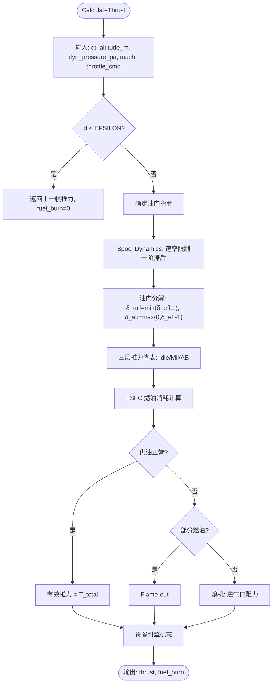
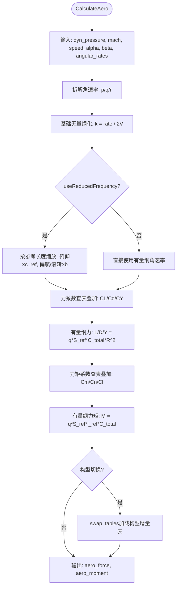
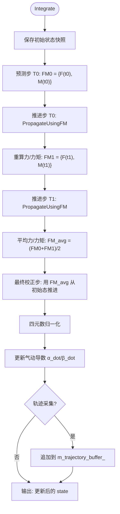
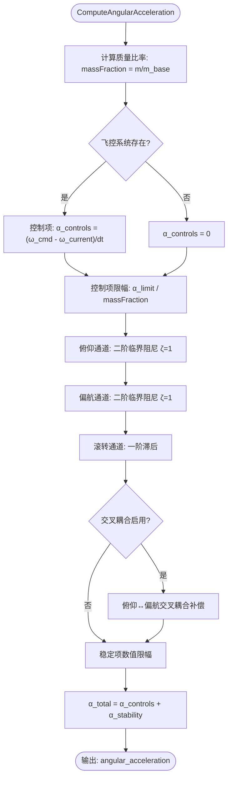

# 软件设计说明 — SDD for REQ-001 Migration

## REQ-001：使用六自由度模型计算无人机的姿态和轨迹
>**文档版本**：1.0  
>**日期**：2026-06-22  
>**作者**：afsim-migration-builder（自动生成）  
>**关联需求**：REQ-001  
>**关联迁移计划**：docs/migration/preliminary-migration-plan/REQ-001-FU-design-confirmed.md  

---

### 1. 目的
本模块实现无人机六自由度（6DOF）飞行仿真系统，将 AFSIM 2.9 中的推进系统、气动模型、刚体积分器和姿态控制系统（SAS）以 Clean-room 方式迁移到目标系统。模块提供完整的飞行动力学仿真能力，包括推力计算、气动六分量求解、Heun 预测-校正时间推进和三通道姿态稳定控制。

### 2. 范围
包含以下 4 个原子功能单元（FU）：

| FU ID | 名称 | 功能简述 | 优先级 |
|-------|------|---------|--------|
| FU-001 | 推进系统与燃油管理 | 喷气发动机推力模型（三层查表 + Spool dynamics）+ 燃油管理系统 | 中 |
| FU-002 | 气动模型 | RigidBody 稳定性导数气动系数模型（简化频率 + 20+ 查表 + 六分量叠加） | 中 |
| FU-003 | 六自由度积分器 | Heun 预测-校正法时间推进（平动 + 转动 + 四元数姿态积分） | 高 |
| FU-004 | 姿态控制系统 SAS | 三通道控制-稳定解耦 SAS（一阶跟踪 + 二阶临界阻尼 + 交叉耦合补偿） | 低 |

### 3. 参考文档
- 需求规范：docs/requirements/confirmed_requirement_doc/requirement-gap-analysis.md
- 迁移计划：docs/migration/preliminary-migration-plan/REQ-001-FU-design-confirmed.md
- 算法卡片：
  - docs/algorithms/flight-dynamics-jet-engine-card.md（FU-001 喷气发动机推力模型）
  - docs/algorithms/flight-dynamics-propulsion-fuel-card.md（FU-001 推进系统与燃油管理）
  - docs/algorithms/flight-dynamics-rigidbody-aero-coefficient-card.md（FU-002 气动系数模型）
  - docs/algorithms/flight-dynamics-rigid-body-integrator-card.md（FU-003 六自由度积分器）
  - docs/algorithms/flight-dynamics-pointmass-sas-card.md（FU-004 姿态控制系统）
- AFSIM 源文件：
  - `wsf_six_dof/source/WsfSixDOF_JetEngine.cpp`（FU-001）
  - `wsf_six_dof/source/WsfRigidBodySixDOF_AeroCoreObject.cpp`（FU-002）
  - `wsf_six_dof/source/WsfRigidBodySixDOF_Integrator.cpp`（FU-003）
  - `wsf_six_dof/source/WsfPointMassSixDOF_Integrator.cpp`（FU-004）

---

### 功能组件
#### 1.FU-001:推进系统与燃油管理
##### 1.1. 功能定位
根据油门指令和飞行状态计算发动机推力与燃油消耗率。核心包括：(a) 喷气发动机推力模型——通过 Spool dynamics（速率限制一阶滞后）模拟油门响应滞后，通过三层推力查表（Idle/Mil/AB）计算推力基准；(b) 燃油管理系统——管理油箱燃油消耗、多油箱间燃油传输、CG 位置线性插值。在仿真流程中位于步骤①，为积分器提供推进力输入。

##### 1.2. 外部接口

| 序号 | 接口类型 | 参数类型 | 参数 | 参数描述 |
|------|-----------|----------|-------|----------|
| 1 | 输入参数 | double | dt | 仿真步长 (s) |
| 2 | 输入参数 | double | altitude_m | MSL 海拔高度 (m) |
| 3 | 输入参数 | double | dyn_pressure_pa | 自由流动压 (Pa) |
| 4 | 输入参数 | double | mach | 飞行马赫数 |
| 5 | 输入参数 | double | throttle_cmd | 油门指令 [0, 2]（0=Idle/1=Mil/2=全AB） |
| 6 | 输出参数 | ThrustOutput | thrust | 推力(N)、燃油消耗率(kg/s)、燃烧量(kg)、引擎状态标志 |
| 7 | 配置参数 | InterpCurve1D* | curves | Idle/Mil/AB 推力曲线 + Spool 速率曲线 |
| 8 | 配置参数 | double | spin_rates | Mil/AB 段油门加减速率 |

##### 1.3. 运行逻辑

运行逻辑如下图所示：

##### 1.4. 数学公式

1. **Spool Dynamics 速率限制一阶滞后**：
   $$\delta_{eff}(t + \Delta t) = \delta_{eff}(t) + \text{clamp}\left(\delta_{cmd} - \delta_{eff}(t), -\dot{\delta}_{down} \cdot \Delta t, +\dot{\delta}_{up} \cdot \Delta t\right)$$
   其中 $\delta_{eff} \in [0, 2]$ 为有效油门，$\dot{\delta}_{up}$ 和 $\dot{\delta}_{down}$ 为加减速率（Mil/AB 段分别取值）。

2. **三层推力查表**：
   $$T_{total} = T_{idle} + \delta_{mil} \cdot (T_{mil} - T_{idle}) + \delta_{ab} \cdot (T_{ab} - T_{mil})$$
   其中 $T_{idle}, T_{mil}, T_{ab}$ 由 1D 曲线 `f(altitude)` 查表获得。

3. **TSFC 燃油消耗**：
   $$m_{fuel} = \left(T_{idle} \cdot SFC_{idle} + \delta_{mil} \cdot T_{mil\_inc} \cdot SFC_{mil\_eff} + \delta_{ab} \cdot T_{ab\_inc} \cdot SFC_{ab\_eff}\right) \cdot \Delta t$$

---

#### 1.FU-002:气动模型
##### 1.1. 功能定位
根据飞行器的瞬时飞行状态（马赫数、攻角 α、侧滑角 β、角速率 p/q/r）通过稳定性导数法计算六分量气动力和力矩。核心机制是"简化频率（Reduced Frequency）"无量纲化——将角速率和变化率除以 2V 得到无量纲频率，按参考长度缩放后乘以对应的动态导数，再与静态 3D 表项线性叠加。支持多模态气动构型切换（巡航/襟翼/起落架/外挂）。

##### 1.2. 外部接口

| 序号 | 接口类型 | 参数类型 | 参数 | 参数描述 |
|------|-----------|----------|-------|----------|
| 1 | 输入参数 | double | dyn_pressure_pa | 自由流动压 (Pa) |
| 2 | 输入参数 | double | mach | 马赫数 |
| 3 | 输入参数 | double | speed_mps | 真空速 (m/s) |
| 4 | 输入参数 | double | alpha_rad | 攻角 (rad) |
| 5 | 输入参数 | double | beta_rad | 侧滑角 (rad) |
| 6 | 输入参数 | Vector3d | angular_rates_rps | 体轴角速率 [p,q,r] (rad/s) |
| 7 | 输出参数 | AeroOutput | forces | 气动力 [L,D,Y] (N) + 气动力矩 [Mx,My,Mz] (N·m) |
| 8 | 配置参数 | AeroConfig | config | 气动构型标识（巡航/襟翼/起落架/外挂） |

##### 1.3. 运行逻辑

运行逻辑如下图所示：

##### 1.4. 数学公式

1. **简化频率无量纲化**：
   $$k_q = \frac{q}{2V} \cdot c_{ref}, \quad k_r = \frac{r}{2V} \cdot b, \quad k_p = \frac{p}{2V} \cdot b, \quad k_{\dot{\alpha}} = \frac{\dot{\alpha}}{2V} \cdot c_{ref}, \quad k_{\dot{\beta}} = \frac{\dot{\beta}}{2V} \cdot b$$

2. **升力系数叠加**：
   $$C_{L\_total} = C_L(\alpha, \beta, M) + C_{L_q}(\alpha, M) \cdot k_{Lq} + C_{L_{\dot{\alpha}}}(\alpha, M) \cdot k_{La}$$

3. **有量纲化**：
   $$L = \bar{q} \cdot S_{ref} \cdot C_{L\_total} \cdot R^2, \quad M_y = \bar{q} \cdot S_{ref} \cdot c_{ref} \cdot C_{m\_total}$$

4. **多模态构型切换**：
   $$C_{\text{current}} = C_{\text{base}} + \Delta C_{\text{config}}(k)$$

---

#### 1.FU-003:六自由度积分器
##### 1.1. 功能定位
六自由度仿真的核心时间推进模块。采用 Heun 预测-校正法（二阶 Runge-Kutta）在每帧内执行两次力/力矩评估和状态推进。积分器同时处理平动（牛顿第二定律 → 位置/速度更新）和转动（欧拉转动方程 → 角速率更新 + 四元数姿态积分），并包含力/力矩限幅和四元数归一化等数值保护。支持飞行轨迹采集和多线程安全。

##### 1.2. 外部接口

| 序号  | 接口类型  | 参数类型                     | 参数         | 参数描述                    |
| --- | ----- | ------------------------ | ---------- | ----------------------- |
| 1   | 输入参数  | double                   | dt         | 仿真步长 (s)                |
| 2   | 输入/输出 | RigidBodyState&          | state      | 飞行器运动学状态（原地更新）          |
| 3   | 输入参数  | MassProperties&          | mass       | 质量 + 转动惯量 [Ixx,Iyy,Izz] |
| 4   | 输入参数  | IForceProvider&          | aero       | 气动模型力源接口                |
| 5   | 输入参数  | IForceProvider&          | propulsion | 推进系统力源接口                |
| 6   | 输入参数  | IForceProvider&          | gravity    | 重力计算力源接口                |
| 7   | 输出参数  | vector\<RigidBodyState\> | trajectory | 飞行轨迹数据缓冲区               |

##### 1.3. 运行逻辑

运行逻辑如下图所示：

##### 1.4. 数学公式

1. **Heun 预测-校正框架**：
   $$\mathbf{FM}_0 = \text{CalcFM}(\mathbf{x}_0), \quad \tilde{\mathbf{x}} = \text{Propagate}(\mathbf{x}_0, \mathbf{FM}_0, \Delta t)$$
   $$\mathbf{FM}_1 = \text{CalcFM}(\tilde{\mathbf{x}}), \quad \mathbf{x}_1 = \text{Propagate}(\mathbf{x}_0, (\mathbf{FM}_0 + \mathbf{FM}_1)/2, \Delta t)$$

2. **平动推进**：
   $$\mathbf{a}_{WCS} = \mathbf{R}_{body2WCS} \cdot \frac{\mathbf{F}_{total}}{m} \cdot g_0, \quad \mathbf{r}_{new} = \mathbf{r}_{old} + \mathbf{v} \cdot \Delta t + \frac{1}{2} \mathbf{a}_{WCS} \cdot \Delta t^2$$

3. **转动推进 + 四元数更新**：
   $$\dot{p} = \frac{M_x}{I_{xx}}, \quad \dot{q} = \frac{M_y}{I_{yy}}, \quad \dot{r} = \frac{M_z}{I_{zz}}$$
   $$\mathbf{q}_{new} = \mathbf{q} + \mathbf{q}_{rate} \cdot \Delta t, \quad \mathbf{q}_{new} \leftarrow \text{Normalize}(\mathbf{q}_{new})$$

4. **力/力矩限幅**：
   $$|\mathbf{F}| \leq m \cdot G_{\max} \quad (G_{\max} = 1000g), \quad |\mathbf{M}_i| \leq I_{ii} \cdot \dot{\omega}_{\max}$$

---

#### 1.FU-004:姿态控制系统SAS
##### 1.1. 功能定位
实现三通道控制-稳定解耦的姿态控制系统。将飞控系统输出的期望体轴角速率指令转化为限幅后的角加速度输出。控制项为一阶指令跟踪，稳定项含俯仰/偏航二阶临界阻尼（ζ=1）和滚转一阶滞后平滑。v0.3 新增俯仰/偏航交叉耦合补偿，解决 PointMass 简化方案应用到 RigidBody 模型的通道耦合效应缺失问题。

##### 1.2. 外部接口

| 序号  | 接口类型 | 参数类型                  | 参数       | 参数描述                                      |
| --- | ---- | --------------------- | -------- | ----------------------------------------- |
| 1   | 输入参数 | RigidBodyState&       | state    | 飞行器当前状态（α/β/α̇/β̇/p/q/r）                  |
| 2   | 输入参数 | MassProperties&       | mass     | 质量特性（含基准质量 m_base）                        |
| 3   | 输入参数 | SASParams&            | params   | SAS 配置（限幅基准 + 频率基准 + 交叉耦合系数）              |
| 4   | 输入参数 | IFlightControlSystem* | fcs      | 飞控系统接口（nullptr→仅稳定项）                      |
| 5   | 输入参数 | double                | mover_dt | 运动器步长 (s)                                 |
| 6   | 输出参数 | Vector3d              | α_total  | 总旋转角加速度 [α_roll, α_pitch, α_yaw] (rad/s²) |

##### 1.3. 运行逻辑

运行逻辑如下图所示：

##### 1.4. 数学公式

1. **控制项 — 一阶指令跟踪**：
   $$\vec{\alpha}_{controls} = \frac{\vec{\omega}_{cmd} - \vec{\omega}_{current}}{dt_{mover}}$$

2. **俯仰/偏航二阶临界阻尼 (ζ=1)**：
   $$\alpha_{pitch,stab} = -\alpha \cdot \omega_{n,pitch}^2 - 2 \cdot \omega_{n,pitch} \cdot \dot{\alpha}$$

3. **滚转一阶滞后平滑**：
   $$w = \frac{\omega_n \cdot dt}{1 + \omega_n \cdot dt}, \quad \alpha_{roll,stab} = \frac{(1-w) \cdot p - p}{dt}$$

4. **俯仰/偏航交叉耦合补偿**：
   $$\alpha_{pitch}' = \alpha_{pitch,stab} + k_{y\_pitch} \cdot \alpha_{yaw,stab}, \quad \alpha_{yaw}' = \alpha_{yaw,stab} + k_{z\_yaw} \cdot \alpha_{pitch,stab}$$

---

## 测试策略
- **单元测试**：每个 FU 独立测试，覆盖正常输入路径、边界条件（dt=0、零质量、零速度）和异常输入（负数参数、空指针接口）。
- **集成测试**：按仿真流水线顺序 (FU-001 → FU-002 → FU-003 → FU-004) 联合测试，验证数据流正确性。
- **验证方法**：对比解析解（恒定力下的匀加速运动）、数值基准（已知初始条件下的轨迹参考值）和人工代码审查。
- **多线程测试**：2 线程并发调用 FU-003 `integrate()`，验证 `std::lock_guard` 保护正确性。

---

## 限制与假设
- 假设重力加速度为常数（9.80665 m/s²），不考虑科里奥利力和旋转地球效应。
- 当前版本支持多线程环境，所有 FU 的运行时状态受 `std::mutex` 保护。
- 气动数据表（20+ 张）和发动机推力表采用 AFSIM 默认数据（仅供开发测试），真实项目需替换为飞行器特有数据。
- 起落架模型初期通过 `IForceProvider` 接口注入，默认返回零力/力矩。
- 简化频率公式在极低速下（V < 1.0 m/s）取下限保护，低速段物理意义减弱。
- 欧拉转动方程采用对角转动惯量简化（Ixx, Iyy, Izz），完整转动惯量张量求逆作为可选扩展。

---

## 人工确认
| 需求ID | 确认状态 | 确认人 | 日期 |
|--------|----------|-------|------|
| REQ-001 | ✅ | 已确认（电子签字） | 2026-06-22 |

---

## 附录
- 附录A：变量映射表（详见各 FU 的 API 补充参数详细表，在迁移计划 confirmed 文档中）
- 附录B：修改记录

| 版本 | 日期 | 修改内容 | 修改原因 |
|------|------|----------|----------|
| v1.0 | 2026-06-22 | 初始版本，包含全部 4 个 FU 的软件设计说明 | 首次生成 |
