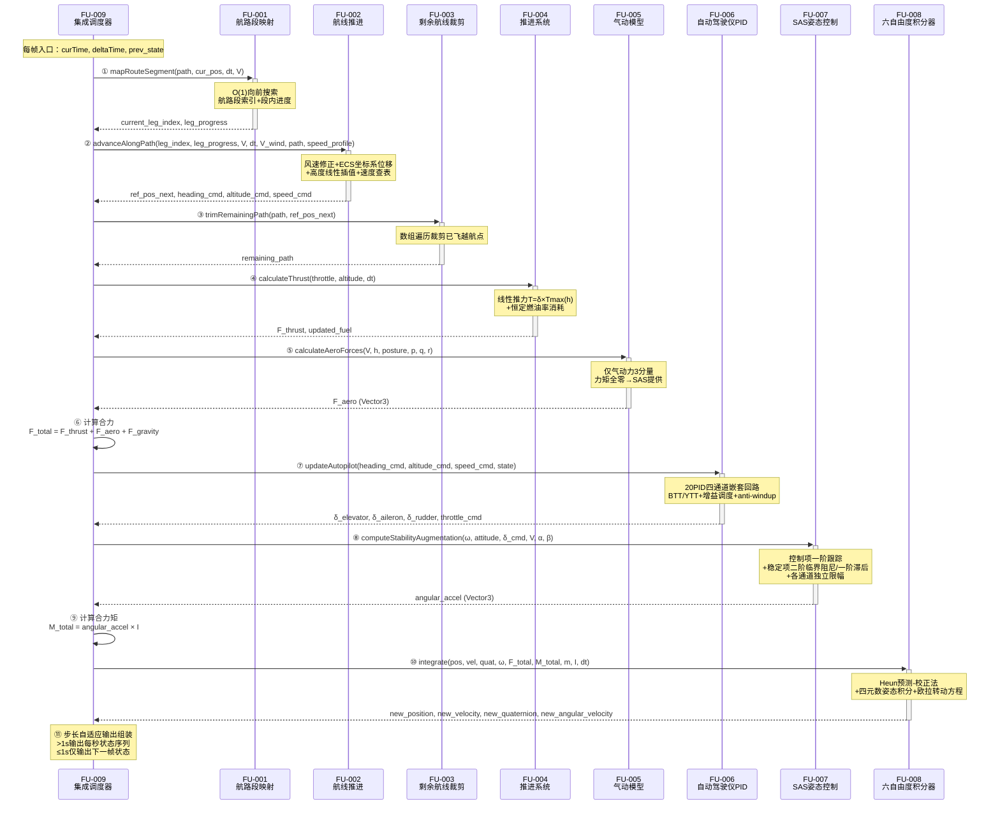
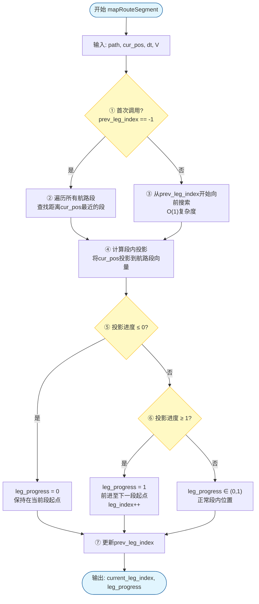
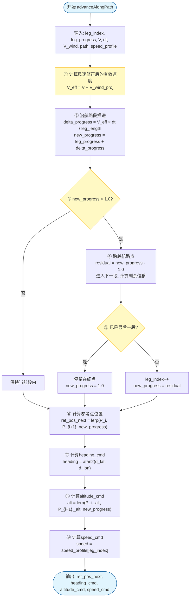
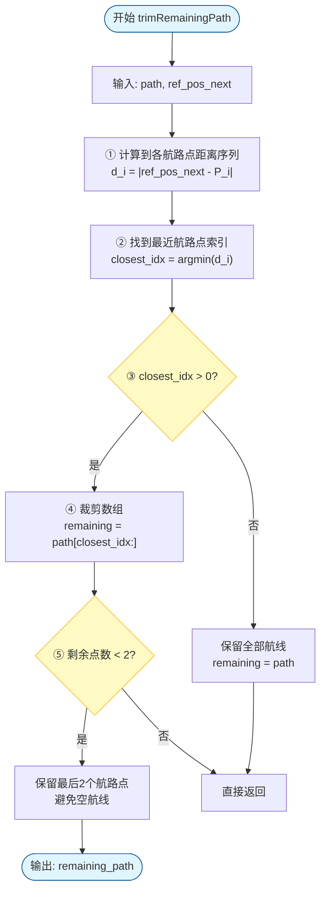
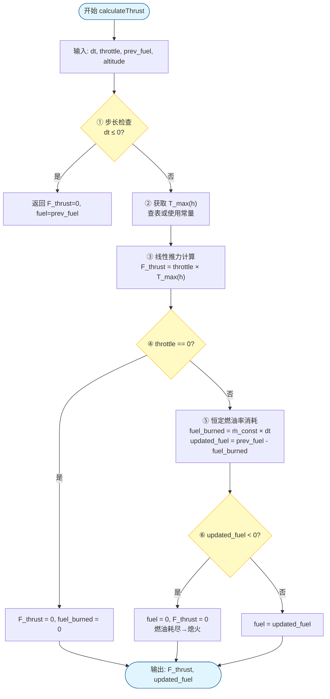
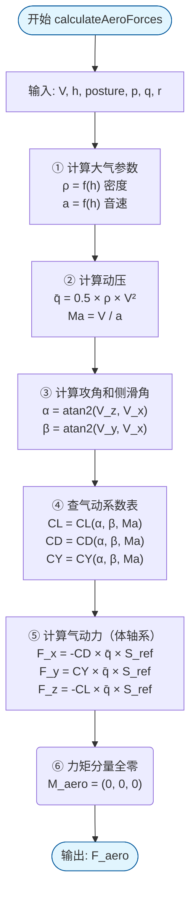
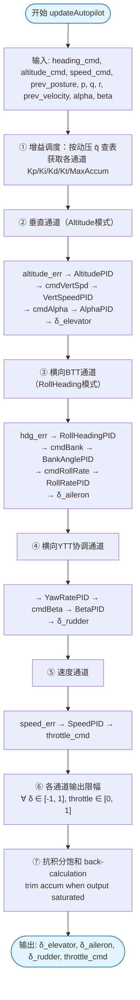
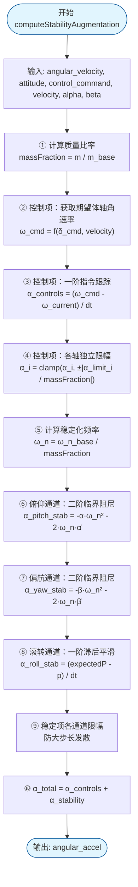
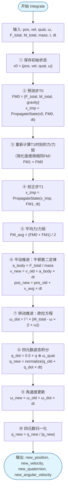
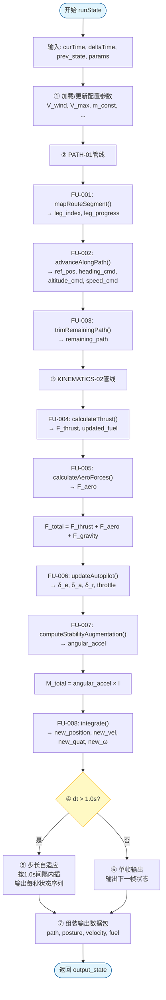

# 功能单元实现规格 — Function Unit Migration Design

>**需求编号**：REQ-002  
>**需求名称**：编队沿航线飞行机动模型设计  
>**文档状态**：草稿  
>**生成时间**：2026-06-30 18:00  
>**最后确认时间**：待确认  
>**设计者**：AI + 待人工确认  
>**关联文件**：  
>- `workspace/requirements/REQ_002/REQ-002-gap-specs.jsonl` — 原子功能规格输入
>- `docs/requirements/REQ_002/3_REQ-002-requirement-gap-analysis.md` — 需求缺口分析
>- `docs/requirements/REQ_002/3_REQ-002-function-mapping-matrix.md` — 功能映射矩阵
>- `docs/requirements/REQ_002/3_REQ-002-requirement-to-afsim-trace.md` — 需求追溯矩阵
>- `docs/migration/REQ-002/target-interfaces.md` — 目标系统公共接口定义
>- `docs/algorithms/flight-dynamics-station-keeping-card.md` — FU-001/002 航路管理算法卡片
>- `docs/algorithms/flight-dynamics-jet-engine-card.md` — FU-004 喷气发动机推力模型算法卡片
>- `docs/algorithms/flight-dynamics-propulsion-fuel-card.md` — FU-004 推进系统与燃油管理算法卡片
>- `docs/algorithms/flight-dynamics-rigidbody-aero-coefficient-card.md` — FU-005 气动系数模型算法卡片
>- `docs/algorithms/flight-dynamics-pointmass-aero-card.md` — FU-005 点质气动模型算法卡片
>- `docs/algorithms/flight-dynamics-autopilot-pid-card.md` — FU-006 自动驾驶仪PID算法卡片
>- `docs/algorithms/flight-dynamics-pointmass-sas-card.md` — FU-007 SAS姿态控制算法卡片
>- `docs/algorithms/flight-dynamics-rigid-body-integrator-card.md` — FU-008 六自由度积分器算法卡片
>- `docs/algorithms/flight-dynamics-pointmass-integrator-card.md` — FU-008 点质积分器算法卡片

---

## 全局设计约定

以下约定适用于本迁移计划中的所有功能单元（FU），各 FU 章节不再重复说明。

### 目标系统环境
| 项目 | 约定 |
|------|------|
| **语言标准** | C++17 |
| **数学库** | Eigen 3.x（向量/矩阵/四元数） |
| **构建系统** | CMake 3.14+ |
| **目标平台** | Windows / Linux 跨平台 |
| **代码目录** | `tests/migration_src/REQ_002/` |

### 全局类型映射
| AFSIM 类型 | 目标系统类型 | 头文件 |
|------------|-------------|--------|
| `double` | `double` | — |
| `int64_t` | `int64_t` | `<cstdint>` |
| `bool` | `bool` | — |
| `UtVec3dX` | `Eigen::Vector3d` | `<Eigen/Dense>` |
| `UtQuaternion` | `Eigen::Quaterniond` | `<Eigen/Geometry>` |
| `UtDCM` | `Eigen::Matrix3d` | `<Eigen/Geometry>` |
| `std::vector<T>` | `std::vector<T>` | `<vector>` |
| `std::unordered_map<K,V>` | `std::unordered_map<K,V>` | `<unordered_map>` |
| `Point`（自定义） | `struct Point { double _lon, _lat, _alt; }` | `types.h` |
| `Posture`（自定义） | `struct Posture { double _yaw, _pitch, _roll; }` | `types.h` |
| `Earth_Params`（AFSIM） | `struct EarthParams { double a, f, ...; }` | `earth_params.h` |

### 全局单位约定
| 物理量 | AFSIM 单位 | 目标系统单位 | 转换关系 |
|--------|-----------|-------------|----------|
| 位置 | ft | m | 1 ft = 0.3048 m |
| 速度 | ft/s | m/s | 1 ft/s = 0.3048 m/s |
| 质量 | lbm (pound-mass) | kg | 1 lbm = 0.453592 kg |
| 力 / 推力 | lbf (pound-force) | N | 1 lbf = 4.44822 N |
| 力矩 | ft-lbf | N·m | 1 ft-lbf = 1.35582 N·m |
| 角度 | rad / deg | rad / deg | 接口保留度（°），内部计算统一 rad |
| 角速率 | rad/s | rad/s | 一致 |
| 转动惯量 | slug-ft² | kg·m² | 1 slug-ft² = 1.35582 kg·m² |
| 动压 | lb/ft² | Pa (N/m²) | 1 lb/ft² = 47.8803 Pa |
| 重力加速度 | 9.80665 m/s² | 9.80665 m/s² | 一致 |
| 燃油消耗率 | lbm/s | kg/s | 1 lbm/s = 0.453592 kg/s |

> **单位策略**：内部计算全部使用 SI 单位制，接口输入输出使用 SI 单位。在关键公式注释中标注原始 AFSIM Imperial 值以保持可追溯性。

## 实现流程

本需求将编队沿航线飞行机动模型拆分为九个功能单元（FU），按两级管线顺序调用：**PATH-01 管线**（航路段映射→航线推进→剩余航线裁剪）负责任务规划层指令生成，**KINEMATICS-02 管线**（推进系统→气动模型→自动驾驶仪PID→SAS姿态控制→六自由度积分器）负责运动学执行层，**INTEGRATION-03 集成层**负责调度和输出组装。

1. 流程图如下：

2. 接口信息如下：

| 流程步骤 | 函数 | 所属 FU | 输入来源 | 输出去向 |
|---|---|---|---|---|
| ① | `mapRouteSegment()` | FU-001 | 航线+当前位置+步长+速度 | → 步骤② |
| ② | `advanceAlongPath()` | FU-002 | 航段索引+段内进度+速度+步长+风速+航线+速度规划 | → 步骤③⑥⑦ |
| ③ | `trimRemainingPath()` | FU-003 | 原始航线+参考点位置 | → 输出 |
| ④ | `calculateThrust()` | FU-004 | 步长+油门+前一时刻燃油+高度 | → 步骤⑥ |
| ⑤ | `calculateAeroForces()` | FU-005 | 速度+高度+姿态+p/q/r | → 步骤⑥ |
| ⑥ | （集成调度器内置） | FU-009 | FU-004/005 输出 + 重力 | → 步骤⑧⑩ |
| ⑦ | `updateAutopilot()` | FU-006 | heading/altitude/speed指令+飞行状态 | → 步骤⑧⑨ |
| ⑧ | `computeStabilityAugmentation()` | FU-007 | 角速度+姿态+δ_cmd+速度+α/β | → 步骤⑨ |
| ⑨ | （集成调度器内置） | FU-009 | FU-007 输出 + 惯量张量 | → 步骤⑩ |
| ⑩ | `integrate()` | FU-008 | 位置+速度+四元数+角速度+合力+合力矩+质量+惯量+步长 | → 步骤⑪ |
| ⑪ | （集成调度器内置） | FU-009 | FU-008 输出 + 原始路径 | → 帧输出 |

---

## FU-001：航路段映射（仅向前搜索）

| 属性 | 内容 |
|------|------|
| **关联需求** | REQ-002-PATH-01 |
| **优先级** | 高 |
| **来源类型** | `afsim`（AFSIM 参考：wsf_six_dof `maneuver/` 航路管理模块、FormUp 阶段航路跟踪逻辑） |
| **设计版本** | v0.1 draft |
| **设计日期** | 2026-06-30 |
| **迁移策略** | Clean-room 重实现（简化版） |
| **风险评估** | 低 |

---

### 功能概述

确定飞机在航线中的位置——所在航路段序号和段内归一化进度。已简化为仅向前搜索（禁止回退），搜索范围为 O(1)。输入为期望航线（航路点数组）、仿真步长、飞机当前速度和当前位置，输出为当前航路段索引（int）和段内归一化进度 [0,1]。该 FU 是 PATH-01 管线的第一级，输出供航线推进（FU-002）使用。目标系统为空系统，无任何航路管理相关代码。算法卡片参考：[station-keeping-card](../../algorithms/flight-dynamics-station-keeping-card.md) 已逐卡阅读。

### 算法流程

#### 算法流程图如下：

#### 关键算法

1. （对应到流程图中的流程②）：首次航线定位——遍历所有航路段查找最近段[引用](../../algorithms/flight-dynamics-station-keeping-card.md)
计算点到线段的最近距离的公式如下：
$$d_i = \frac{|\overrightarrow{P_iP_{i+1}} \times \overrightarrow{P_iP_{cur}}|}{|\overrightarrow{P_iP_{i+1}}|}$$
$$\text{leg\_index} = \arg\min_i d_i$$
其中 $P_i$ 和 $P_{i+1}$ 为航路段端点坐标（Point 含 _lon/_lat/_alt），$P_{cur}$ 为飞机当前位置。

2. （对应到流程图中的流程④）：段内投影——计算归一化进度[引用](../../algorithms/flight-dynamics-station-keeping-card.md)
计算段内进度的公式如下：
$$\text{leg\_progress} = \frac{\overrightarrow{P_iP_{cur}} \cdot \overrightarrow{P_iP_{i+1}}}{|\overrightarrow{P_iP_{i+1}}|^2}$$
其中分子为当前位置到段起点的向量在段方向上的投影长度，分母为段长度的平方。进度值 0 表示段起点，1 表示段终点。

### 接口详细定义（API）：本节需要人工修改、确认

#### 函数`mapRouteSegment`

- **函数功能**：为实现航路段映射算法中的"仅向前搜索定位"部分，`mapRouteSegment` 将期望航线、当前位置、速度和步长作为输入，通过 O(1) 向前搜索确定飞机所在航路段索引和段内归一化进度。
- **AFSIM参考源**：wsf_six_dof `maneuver/` 航路管理模块（FormUp 阶段航路跟踪逻辑）
- **前置条件**：`path` 至少含 2 个航路点；`cur_pos` 有效；`dt > 0`；`V ≥ 0`
- **后置条件**：`current_leg_index` ∈ [0, path.size()-2]；`leg_progress` ∈ [0, 1]
- **复杂度**：O(1)——仅检查当前段和下一段（向前搜索）
- **签名**：`std::pair<int, double> mapRouteSegment(const std::vector<Point>& path, const Point& cur_pos, double dt, double V);`

- **输入参数详细表**：

| # | 参数名 | 类型 | 有效范围/约束 | 说明 |
|---|--------|------|---------------|------|
| 1 | `path` | `const std::vector<Point>&` | size ≥ 2 | 期望航线航路点数组（Point 含 _lon, _lat, _alt，单位 m） |
| 2 | `cur_pos` | `const Point&` | 有效地理坐标 | 飞机当前位置（经纬度/高度，单位 m） |
| 3 | `dt` | `double` | (0, 1.0] s | 仿真步长 |
| 4 | `V` | `double` | [0, ∞) m/s | 飞机当前速度 |

- **输出参数详细表**：

| # | 参数名 | 类型 | 有效范围/约束 | 说明 |
|---|--------|------|---------------|------|
| 1 | `current_leg_index` | `int` | [0, path.size()-2] | 当前所处的航路段序号 |
| 2 | `leg_progress` | `double` | [0, 1] | 归一化进度，0=段起点，1=段终点 |

- **配置参数**：

| # | 名称 | 类型 | 来源 | 有效范围/约束 | 说明 |
|---|------|------|------|----------|------|
| 1 | 无 | — | — | — | 本 FU 无外部配置参数 |

- **依赖**：

| # | 库/头文件 | 用途 |
|---|------|------|
| 1 | `<cmath>` | sqrt、min/max 等基本运算 |
| 2 | `Eigen` | 向量点积、线段投影计算 |

- [ ] 设计确认

#### 函数`computeLegProgress`

- **函数功能**：为实现航路段映射算法中的"段内进度计算"部分，`computeLegProgress` 将当前位置投影到指定航路段上，计算归一化进度值。与 `mapRouteSegment` 分离以提高可测试性——进度计算可独立验证。
- **前置条件**：`leg_index` ∈ [0, path.size()-2]；`cur_pos` 有效
- **后置条件**：返回值 ∈ [0, 1]（内部 clamp）
- **复杂度**：O(1)——单次向量点积和除法
- **签名**：`double computeLegProgress(const std::vector<Point>& path, int leg_index, const Point& cur_pos);`

- **输入参数详细表**：

| # | 参数名 | 类型 | 有效范围/约束 | 说明 |
|---|--------|------|---------------|------|
| 1 | `path` | `const std::vector<Point>&` | size ≥ 2 | 期望航线航路点数组 |
| 2 | `leg_index` | `int` | [0, path.size()-2] | 目标航路段索引 |
| 3 | `cur_pos` | `const Point&` | 有效地理坐标 | 飞机当前位置 |

- **输出参数详细表**：

| # | 参数名 | 类型 | 有效范围/约束 | 说明 |
|---|--------|------|---------------|------|
| 1 | 返回值 | `double` | [0, 1] | 归一化段内进度 |

- **配置参数**：无

- **依赖**：

| # | 库/头文件 | 用途 |
|---|------|------|
| 1 | `<cmath>` | clamp |
| 2 | `Eigen` | 向量运算 |

- [ ] 设计确认

### 耦合度评估

| 评估维度 | 说明 |
|----------|------|
| 框架耦合 | 无——不依赖 AFSIM 任何框架类或工厂模式 |
| 数据耦合 | 低——使用自定义 `Point` 结构体（_lon/_lat/_alt），与 AFSIM `UtVec3d` 解耦 |
| 控制耦合 | 无——纯函数，无全局状态依赖 |
| 外部依赖 | 无——不依赖数据库、网络或硬件 |

**综合等级**：低  
**剥离策略**：完全独立实现。仅需 `<cmath>` 和 `Eigen` 标准库。

### 内部状态与生命周期
| 状态变量 | 类型 | 默认值 | 生命周期 | 线程安全 | 说明 |
|----------|------|--------|----------|----------|------|
| `prev_leg_index_` | `int` | -1 | 模块级 | 否 | 上一帧所在航路段索引，用于 O(1) 向前搜索起点 |

- **是否需要 `reset()` 函数**：是——首次调用或航线变更时需要重置 `prev_leg_index_ = -1`
- **拷贝/移动行为**：允许，状态简单可直接拷贝
- **其他说明**：无

### 错误处理策略
| 异常场景 | 检测条件 | 处理方式 | 返回/错误码 |
|----------|----------|----------|-------------|
| 空航线（path.size() < 2） | 函数入口 if 判断 | 返回 leg_index=0, leg_progress=0，Debug 模式打印警告 | (0, 0.0) |
| 当前位置无效（NaN） | `std::isnan(cur_pos._lon)` | 返回上一帧状态，打印错误日志 | 保持 prev 状态 |
| 非法步长（dt ≤ 0） | 函数入口 if 判断 | 返回上一帧状态，不更新 | 保持 prev 状态 |

### 风险与未决问题
- **技术风险**：经纬度→欧几里得距离的简化假设（小范围内精度足够），大跨度航线需考虑地球曲率
- 需人工确认：`Point` 结构体的 `_lon/_lat` 是否确实是单位 m（而非度），当前 target-interfaces.md 定义 _lon 单位为 m

---

## FU-002：航线推进（三维指令输出）

| 属性 | 内容 |
|------|------|
| **关联需求** | REQ-002-PATH-01 |
| **优先级** | 高 |
| **来源类型** | `afsim`（AFSIM 参考：wsf_six_dof `formation/` 编队动作库、KeepStation ECS 坐标系 P+D+DD 控制） |
| **设计版本** | v0.1 draft |
| **设计日期** | 2026-06-30 |
| **迁移策略** | Clean-room 重实现（完整版） |
| **风险评估** | 中 |

---

### 功能概述

沿当前航路段以设定速度推进参考点位置，输出 heading_cmd（航向方位角）、altitude_cmd（航路段两端高度线性插值的目标高度）、speed_cmd（speed_profile 中对应航路段的期望速度值）。考虑风速矢量叠加影响，使用 ECS 坐标系下的位移计算。该 FU 是 PATH-01 管线的第二级，承接 FU-001 的航段定位结果，为下游 FU-006（Autopilot PID）提供三维制导指令。目标系统为空系统，无任何航线推进相关代码。算法卡片参考：[station-keeping-card](../../algorithms/flight-dynamics-station-keeping-card.md) 已逐卡阅读。

### 算法流程

#### 算法流程图如下：

#### 关键算法

1. （对应到流程图中的流程①②）：风速修正推进[引用](../../algorithms/flight-dynamics-station-keeping-card.md)
计算风速修正后的有效速度和进度增量的公式如下：
$$V_{eff} = V + \mathbf{V}_{wind} \cdot \hat{\mathbf{d}}_{leg}$$
$$\Delta p = \frac{V_{eff} \cdot \Delta t}{L_{leg}}$$
$$\text{new\_progress} = \text{leg\_progress} + \Delta p$$
其中 $\hat{\mathbf{d}}_{leg}$ 为航路段方向单位向量，$L_{leg} = |\overrightarrow{P_iP_{i+1}}|$ 为段长度（m），$V_{eff}$ 为风速沿航路段方向的投影修正后的有效速度。

2. （对应到流程图中的流程⑦）：航向角计算[引用](../../algorithms/flight-dynamics-station-keeping-card.md)
计算从当前参考点指向下一航路点的方位角的公式如下：
$$\theta_{heading} = \text{atan2}\left(\Delta lat, \Delta lon\right) \cdot \frac{180}{\pi}$$
其中 $\Delta lon = P_{i+1}.\_lon - P_i.\_lon$，$\Delta lat = P_{i+1}.\_lat - P_i.\_lat$，输出单位为度（°）。

3. （对应到流程图中的流程⑧）：高度线性插值[引用](../../algorithms/flight-dynamics-station-keeping-card.md)
计算当前段内目标高度的公式如下：
$$h_{cmd} = P_i.\_alt + \text{progress} \cdot (P_{i+1}.\_alt - P_i.\_alt)$$
其中 $P_i.\_alt$ 和 $P_{i+1}.\_alt$ 分别为航路段两端高度（m）。

### 接口详细定义（API）：本节需要人工修改、确认

#### 函数`advanceAlongPath`

- **函数功能**：为实现航线推进算法中的"参考点推进+三维指令输出"部分，`advanceAlongPath` 将航路段索引、段内进度、速度、步长和风速等输入转化为下一时刻参考点位置和三轴制导指令（heading/altitude/speed），支持跨段推进和终点停留。
- **AFSIM参考源**：wsf_six_dof `formation/` 模块（KeepStation ECS 坐标系 P+D+DD 偏差精细控制）
- **前置条件**：`leg_index` ∈ [0, path.size()-2]；`leg_progress` ∈ [0, 1]；`dt > 0`
- **后置条件**：`heading_cmd` ∈ (-180°, 180°]；`altitude_cmd` ≥ 0；`speed_cmd` ∈ [0, V_max]
- **复杂度**：O(1)——常数次向量运算和插值
- **签名**：`AdvanceOutput advanceAlongPath(int leg_index, double leg_progress, double V, double dt, double V_wind, const std::vector<Point>& path, const std::vector<double>& speed_profile);`

- **输入参数详细表**：

| # | 参数名 | 类型 | 有效范围/约束 | 说明 |
|---|--------|------|---------------|------|
| 1 | `leg_index` | `int` | [0, path.size()-2] | 当前航路段索引（来自 FU-001） |
| 2 | `leg_progress` | `double` | [0, 1] | 段内归一化进度（来自 FU-001） |
| 3 | `V` | `double` | [0, ∞) m/s | 飞机设定速度 |
| 4 | `dt` | `double` | (0, 1.0] s | 仿真步长 |
| 5 | `V_wind` | `double` | 任意实数 m/s | 环境风速（含方向，沿航线方向投影） |
| 6 | `path` | `const std::vector<Point>&` | size ≥ 2 | 期望航线航路点数组 |
| 7 | `speed_profile` | `const std::vector<double>&` | size = path.size() | 每个航路点的期望巡航速度（m/s） |

- **输出参数详细表**：

| # | 参数名 | 类型 | 有效范围/约束 | 说明 |
|---|--------|------|---------------|------|
| 1 | `ref_pos_next` | `Point` | 有效地理坐标 | 下一时刻参考点位置（经纬度/高度，单位 m） |
| 2 | `heading_cmd` | `double` | (-180°, 180°] | 期望航向方位角（指向下一航路点，单位 °） |
| 3 | `altitude_cmd` | `double` | [0, ∞) m | 期望高度（航路段两端高度线性插值，单位 m） |
| 4 | `speed_cmd` | `double` | [0, V_max] m/s | 期望速度（speed_profile 对应段的值，单位 m/s） |

- **配置参数**：

| # | 名称 | 类型 | 来源 | 有效范围/约束 | 说明 |
|---|------|------|------|----------|------|
| 1 | `V_max` | `double` | 硬编码（全局常量） | (0, 500] m/s | 最大速度上限限幅 |
| 2 | `Earth_Params` | `EarthParams` | 硬编码（全局常量） | — | 经纬度↔距离转换参数（a, f） |

- **依赖**：

| # | 库/头文件 | 用途 |
|---|------|------|
| 1 | `<cmath>` | sin/cos/sqrt/atan2 三角函数和基本运算 |
| 2 | `Eigen` | 矢量加法/点积、坐标系旋转变换 |
| 3 | FU-001 | 提供 `leg_index` 和 `leg_progress` 输入 |

- [ ] 设计确认

#### 函数`computeHeadingCommand`

- **函数功能**：为实现航线推进算法中的"航向角计算"独立部分，`computeHeadingCommand` 从两个地理坐标点计算方位角，独立于推进逻辑以提高可测试性。
- **前置条件**：`from` 和 `to` 均有效
- **后置条件**：返回值 ∈ (-180°, 180°]
- **复杂度**：O(1)
- **签名**：`double computeHeadingCommand(const Point& from, const Point& to);`

- **输入参数详细表**：

| # | 参数名 | 类型 | 有效范围/约束 | 说明 |
|---|--------|------|---------------|------|
| 1 | `from` | `const Point&` | 有效坐标 | 当前位置 |
| 2 | `to` | `const Point&` | 有效坐标 | 目标位置 |

- **输出参数详细表**：

| # | 参数名 | 类型 | 有效范围/约束 | 说明 |
|---|--------|------|---------------|------|
| 1 | 返回值 | `double` | (-180°, 180°] | 航向方位角，单位 ° |

- **配置参数**：无

- **依赖**：

| # | 库/头文件 | 用途 |
|---|------|------|
| 1 | `<cmath>` | atan2 |

- [ ] 设计确认

### 耦合度评估

| 评估维度 | 说明 |
|----------|------|
| 框架耦合 | 无——不依赖 AFSIM 框架类 |
| 数据耦合 | 低——使用自定义 `Point` 结构体，`Earth_Params` 为简单 struct |
| 控制耦合 | 低——仅依赖 FU-001 输出（纯数据传递） |
| 外部依赖 | 无——不依赖数据库、网络或硬件 |

**综合等级**：低  
**剥离策略**：完全独立实现。核心依赖 FU-001 输出和历史状态变量，均为一阶数据耦合。

### 内部状态与生命周期
| 状态变量 | 类型 | 默认值 | 生命周期 | 线程安全 | 说明 |
|----------|------|--------|----------|----------|------|
| `current_leg_index_` | `int` | 0 | 模块级 | 否 | 跨帧保持的航路段索引（可能因跨段推进而改变） |
| `prev_ref_pos_` | `Point` | {0, 0, 0} | 模块级 | 否 | 上一帧参考点位置，用于速度平滑和异常回退 |

- **是否需要 `reset()` 函数**：是——航线变更时需重置为 `leg_index=0, prev_ref_pos=path[0]`
- **拷贝/移动行为**：允许，状态简单可直接拷贝
- **其他说明**：`advanceAlongPath` 可能在一次调用中跨越多个航路段（高速大步长场景）

### 错误处理策略
| 异常场景 | 检测条件 | 处理方式 | 返回/错误码 |
|----------|----------|----------|-------------|
| 无效航段索引（越界） | `leg_index >= path.size()-1` | 返回 path.back() 作为 ref_pos，heading=0，Debug 模式打印警告 | 终点值 |
| 风速极大导致大幅跳跃 | `|delta_progress| > 2.0` | clamp 到 2.0（最多跨越 2 段），打印警告 | 限幅后值 |
| 空速度规划（size != path.size()） | 入口检查 | 使用默认速度 V_max/2，打印警告 | 默认速度 |

### 风险与未决问题
- **技术风险**：地理坐标系下位移计算需正确处理经纬度→距离转换，小范围假设（平面近似）可能在大跨度场景引入误差
- **未决问题**：`V_wind` 当前定义为标量（沿航线方向投影），是否需要扩展为二维矢量（风速+风向）以支持侧风修正？
- `altitude_cmd` 和 `speed_cmd` 已由人工确认为 PATH-01 输出，本 FU 实现线性插值和查表

---

## FU-003：剩余航线裁剪

| 属性 | 内容 |
|------|------|
| **关联需求** | REQ-002-PATH-01 |
| **优先级** | 低 |
| **来源类型** | 无 AFSIM 参考（基本数组操作，function-index.jsonl 中无独立对应函数） |
| **设计版本** | v0.1 draft |
| **设计日期** | 2026-06-30 |
| **迁移策略** | Clean-room 重实现 |
| **风险评估** | 低 |

---

### 功能概述

从原始航线数组中移除已飞越的航路点，返回剩余未到达的航点序列。通过比较参考点位置与各航路点的欧几里得距离判断飞越状态。基本数组遍历操作，无算法复杂度。该 FU 是 PATH-01 管线的最后一级，输出剩余航线供集成调度器（FU-009）进行步长自适应输出和可视化。目标系统为空系统，cleanroom 直接实现。

### 算法流程

#### 算法流程图如下：

#### 关键算法

本 FU 无复杂算法。核心逻辑为：
$$\text{closest\_index} = \arg\min_i |\mathbf{r}_{ref} - \mathbf{P}_i|$$
$$\text{remaining\_path} = \text{path}[\text{closest\_index}:]$$
其中 $\mathbf{r}_{ref}$ 为参考点位置（来自 FU-002），$\mathbf{P}_i$ 为第 i 个航路点。当参考点已飞越所有航路点时，保留最后一个航路点以避免空路径。

### 接口详细定义（API）：本节需要人工修改、确认

#### 函数`trimRemainingPath`

- **函数功能**：为实现剩余航线裁剪功能，`trimRemainingPath` 从原始航线中移除已飞越的航路点，返回参考点前方未到达的航点序列。
- **前置条件**：`path` 至少含 1 个航路点；`ref_pos_next` 有效
- **后置条件**：返回的 `remaining_path` 至少含 1 个航路点（保底终点）
- **复杂度**：O(N)——遍历一次航线数组
- **签名**：`std::vector<Point> trimRemainingPath(const std::vector<Point>& path, const Point& ref_pos_next);`

- **输入参数详细表**：

| # | 参数名 | 类型 | 有效范围/约束 | 说明 |
|---|--------|------|---------------|------|
| 1 | `path` | `const std::vector<Point>&` | size ≥ 1 | 原始完整航线 |
| 2 | `ref_pos_next` | `const Point&` | 有效地理坐标 | 参考点下一时刻位置（来自 FU-002，用于判断飞越状态） |

- **输出参数详细表**：

| # | 参数名 | 类型 | 有效范围/约束 | 说明 |
|---|--------|------|---------------|------|
| 1 | 返回值 | `std::vector<Point>` | size ≥ 1 | 未到达的航点序列 |

- **配置参数**：无

- **依赖**：

| # | 库/头文件 | 用途 |
|---|------|------|
| 1 | `<vector>` | std::vector 操作 |
| 2 | `<algorithm>` | std::min_element |
| 3 | FU-002 | 提供 `ref_pos_next` 输入 |

- [ ] 设计确认

### 耦合度评估

| 评估维度 | 说明 |
|----------|------|
| 框架耦合 | 无——纯标准库操作 |
| 数据耦合 | 无——仅使用标准 `std::vector<Point>` |
| 控制耦合 | 无——纯函数，无全局状态 |
| 外部依赖 | 无 |

**综合等级**：低  
**剥离策略**：完全独立实现，零 AFSIM 依赖。

### 内部状态与生命周期

无内部状态——纯函数（stateless）。

- **是否需要 `reset()` 函数**：否
- **拷贝/移动行为**：不适用（无状态）
- **其他说明**：无

### 错误处理策略
| 异常场景 | 检测条件 | 处理方式 | 返回/错误码 |
|----------|----------|----------|-------------|
| 空航线（path.empty()） | 函数入口 if 判断 | 返回空 vector，Debug 打印警告 | `{}` |
| 参考点在所有航路点之后 | closest_idx == path.size()-1 | 返回仅含最后一个航路点的 vector | `{path.back()}` |
| 参考点无效（NaN） | `std::isnan(ref_pos_next._lon)` | 返回原始 path 的副本 | 原始 path |

### 风险与未决问题
- 无显著技术风险。基本数组操作，可在航线推进实现后随时添加。

---

## FU-004：推进系统（线性推力+恒定燃油率+单油箱）

| 属性 | 内容 |
|------|------|
| **关联需求** | REQ-002-KINEMATICS-02 |
| **优先级** | 高 |
| **来源类型** | `afsim`（AFSIM 参考：`JetEngine::CalculateThrust` `WsfSixDOF_JetEngine.cpp:428-864` + `PropulsionSystem::Update` + `FuelTank::UpdateFuelBurn`） |
| **设计版本** | v0.1 draft |
| **设计日期** | 2026-06-30 |
| **迁移策略** | Clean-room 重实现（简化版——最简层级） |
| **风险评估** | 中 |

---

### 功能概述

简化版推进系统——采用三个简化方案的组合（最简层级）：(1) **简1**线性推力-油门关系 T=δ×Tmax(h)（跳过 AFSIM 完整三层查表 Idle/Mil/AB + spool dynamics）；(2) **简2**恒定燃油消耗率 m_fuel=ṁ_const×Δt（跳过 TSFC 查表和多工况切换）；(3) **简3**单油箱直接消耗模型（跳过 AFSIM 多油箱传输协调和 CG 位置插值）。该 FU 是 KINEMATICS-02 管线的第一级，为积分器（FU-008）提供推力输入和更新后的燃油质量。目标系统为空系统，参数不足以支持完整模型。算法卡片：[jet-engine-card](../../algorithms/flight-dynamics-jet-engine-card.md) + [propulsion-fuel-card](../../algorithms/flight-dynamics-propulsion-fuel-card.md) 已逐卡阅读。

### 算法流程

#### 算法流程图如下：

#### 关键算法

1. （对应到流程图中的流程③）：线性推力模型[引用](../../algorithms/flight-dynamics-jet-engine-card.md)
计算推力的公式如下（简1）：
$$F_{thrust} = \delta_{throttle} \cdot T_{max}(h)$$
其中 $\delta_{throttle} \in [0, 1]$ 为油门位置（0=慢车/1=全推力），$T_{max}(h)$ 为当前高度下的最大可用推力（N），可将 AFSIM Mil 推力查表值经 Imperial→SI 转换后使用。

2. （对应到流程图中的流程⑤）：恒定燃油消耗率模型[引用](../../algorithms/flight-dynamics-propulsion-fuel-card.md)
计算燃油消耗的公式如下（简2+简3）：
$$m_{fuel}(t + \Delta t) = m_{fuel}(t) - \dot{m}_{const} \cdot \Delta t$$
其中 $\dot{m}_{const}$ 为恒定燃油质量流量（kg/s），可从 AFSIM 名义 SFC 和额定推力反算。单油箱模型不区分油箱间传输——燃油质量直接从单一变量递减。

### 接口详细定义（API）：本节需要人工修改、确认

#### 函数`calculateThrust`

- **函数功能**：为实现最简层级推进系统的推力计算和燃油消耗功能，`calculateThrust` 将线性推力模型、恒定燃油率消耗和单油箱管理组合为一次调用。
- **AFSIM参考源**：`JetEngine::CalculateThrust` (`WsfSixDOF_JetEngine.cpp:428-864`)——完整三层查表+spool dynamics；`PropulsionSystem::Update` (`WsfSixDOF_PropulsionSystem.cpp:78-249`)——多油箱传输协调
- **前置条件**：`dt > 0`；`throttle ∈ [0, 1]`；`prev_fuel ≥ 0`；`altitude ≥ 0`
- **后置条件**：`updated_fuel ∈ [0, Max_Fuel_Capacity]`；`F_thrust ≥ 0`
- **复杂度**：O(1)——最多 1 次 1D 插值查表
- **签名**：`ThrustOutput calculateThrust(double dt, double throttle, double prev_fuel, double altitude);`

- **输入参数详细表**：

| # | 参数名 | 类型 | 有效范围/约束 | 说明 |
|---|--------|------|---------------|------|
| 1 | `dt` | `double` | (0, 1.0] s | 仿真步长 |
| 2 | `throttle` | `double` | [0, 1] | 油门位置（0=慢车/1=全推力，来自 FU-006） |
| 3 | `prev_fuel` | `double` | [0, Max_Fuel_Capacity] kg | 上一时刻燃油质量 |
| 4 | `altitude` | `double` | [0, 50000] m | MSL 海拔高度（用于 T_max(h) 查值） |

- **输出参数详细表**：

| # | 参数名 | 类型 | 有效范围/约束 | 说明 |
|---|--------|------|---------------|------|
| 1 | `F_thrust` | `double` | [0, ∞) N | 当前帧推力 |
| 2 | `updated_fuel` | `double` | [0, Max_Fuel_Capacity] kg | 消耗后的燃油质量 |

- **配置参数**：

| # | 名称 | 类型 | 来源 | 有效范围/约束 | 说明 |
|---|------|------|------|----------|------|
| 1 | `T_max` | `std::vector<double>` 或 `double` | 配置文件（AFSIM 默认值） | [0, 500000] N | 最大推力曲线 f(altitude)，简单模式可用常量 |
| 2 | `m_dot_const` | `double` | 数据库 | (0, 100] kg/s | 恒定燃油质量流量 |
| 3 | `Max_Fuel_Capacity` | `double` | 数据库 | (0, 50000] kg | 油箱最大容量 |

- **依赖**：

| # | 库/头文件 | 用途 |
|---|------|------|
| 1 | `<cmath>` | min/max 限幅操作 |
| 2 | `<algorithm>` | std::clamp |

- [ ] 设计确认

### 耦合度评估

| 评估维度 | 说明 |
|----------|------|
| 框架耦合 | 无——不依赖 AFSIM 框架类 |
| 数据耦合 | 低——仅使用标量 double 参数 |
| 控制耦合 | 无——纯数值计算，无状态机依赖 |
| 外部依赖 | 低——T_max(h) 曲线数据来自配置文件 |

**综合等级**：低  
**剥离策略**：最简层级实现。T_max(h) 可用常量替代以降低初始集成复杂度。

### 内部状态与生命周期
| 状态变量 | 类型 | 默认值 | 生命周期 | 线程安全 | 说明 |
|----------|------|--------|----------|----------|------|
| `fuel_mass_kg_` | `double` | 0 | 模块级 | 否 | 当前燃油质量（跨帧衰减） |

- **是否需要 `reset()` 函数**：是——重置 `fuel_mass_kg_` 为初始值
- **拷贝/移动行为**：允许
- **其他说明**：首帧由外部通过 `init()` 设置初始燃油量，后续每帧 `calculateThrust()` 更新

### 错误处理策略
| 异常场景 | 检测条件 | 处理方式 | 返回/错误码 |
|----------|----------|----------|-------------|
| 非法步长（dt ≤ 0） | 函数入口 if 判断 | 返回 F_thrust=0, fuel=prev_fuel | (0, prev_fuel) |
| 燃油耗尽 | `updated_fuel < 0` | 燃油清零，推力归零，打印警告 | (0, 0) |
| 油门越界 | `throttle < 0 \|\| throttle > 1` | clamp 到 [0,1]，Debug 打印警告 | 限幅后值 |

### 风险与未决问题
- **技术风险**：简化模型精度显著低于 AFSIM 完整模型（无 spool dynamics 延迟效应、无 AB 加力段），仅适用于非实时仿真场景
- 需人工补充：`T_max(h)` 曲线数据（建议使用 AFSIM 默认 Mil 推力表经 Imperial→SI 转换）；`ṁ_const` 和 `Max_Fuel_Capacity` 参数值

---

## FU-005：气动模型（仅气动力）

| 属性 | 内容 |
|------|------|
| **关联需求** | REQ-002-KINEMATICS-02 |
| **优先级** | 高 |
| **来源类型** | `afsim`（AFSIM 参考：`RigidBodyAeroCoreObject::calculateAero` `WsfRigidBodySixDOF_AeroCoreObject.hpp` + PointMass 气动力与旋转限幅模型） |
| **设计版本** | v0.1 draft |
| **设计日期** | 2026-06-30 |
| **迁移策略** | Clean-room 重实现（简化版——仅气动力） |
| **风险评估** | 中 |

---

### 功能概述

仅计算气动力的三个分量（升力、阻力、侧力），不计算气动力矩（三个力矩分量全为零）。力矩全部由 SAS 系统（FU-007）提供。使用参考面积（S_ref）、参考长度（l_ref）和动压（q̄ = 0.5·ρ·V²）进行缩放。该 FU 是 KINEMATICS-02 管线的第二级，为积分器（FU-008）提供气动力输入。目标系统为空系统。算法卡片：[rigidbody-aero-coefficient-card](../../algorithms/flight-dynamics-rigidbody-aero-coefficient-card.md) + [pointmass-aero-card](../../algorithms/flight-dynamics-pointmass-aero-card.md) 已逐卡阅读。

### 算法流程

#### 算法流程图如下：

#### 关键算法

1. （对应到流程图中的流程③⑤）：气动力三向分量计算[引用](../../algorithms/flight-dynamics-rigidbody-aero-coefficient-card.md)
计算体轴系气动力的公式如下（简2——仅气动力）：
$$\mathbf{F}_{aero} = \bar{q} \cdot S_{ref} \cdot \begin{bmatrix} -C_D(\alpha, \beta, Ma) \\ C_Y(\alpha, \beta, Ma) \\ -C_L(\alpha, \beta, Ma) \end{bmatrix}$$
其中动压 $\bar{q} = \frac{1}{2} \rho V^2$（Pa），$S_{ref}$ 为参考面积（m²），$C_L, C_D, C_Y$ 分别为升力/阻力/侧力系数（无量纲），通过攻角 $\alpha$、侧滑角 $\beta$ 和马赫数 $Ma$ 查表获得。

2. （对应到流程图中的流程③）：攻角和侧滑角计算[引用](../../algorithms/flight-dynamics-pointmass-aero-card.md)
$$\alpha = \text{atan2}(V_z, V_x), \quad \beta = \text{atan2}(V_y, V_x)$$
其中 $V_x, V_y, V_z$ 为体轴系速度分量（m/s），由当前速度和姿态角转换得到。

### 接口详细定义（API）：本节需要人工修改、确认

#### 函数`calculateAeroForces`

- **函数功能**：为实现气动模型中"仅气动力三向分量"计算，`calculateAeroForces` 从飞行状态（速度、高度、姿态、角速率）计算大气参数、动压、攻角/侧滑角，查表获取气动系数，最终输出体轴系气动力矢量。力矩输出全零——SAS（FU-007）负责全部力矩。
- **AFSIM参考源**：`RigidBodyAeroCoreObject::calculateAero` (`WsfRigidBodySixDOF_AeroCoreObject.hpp`)——完整 6 分量气动计算
- **前置条件**：`V ≥ 0`；`h ≥ 0`；`S_ref > 0`；`l_ref > 0`
- **后置条件**：`F_aero` 各分量有界（不产生 NaN）
- **复杂度**：O(1) × 查表次数（简单模式约 3 次插值）
- **签名**：`Eigen::Vector3d calculateAeroForces(double V, double h, const Posture& posture, double p, double q, double r);`

- **输入参数详细表**：

| # | 参数名 | 类型 | 有效范围/约束 | 说明 |
|---|--------|------|---------------|------|
| 1 | `V` | `double` | [0, 5000] m/s | 当前速度标量 |
| 2 | `h` | `double` | [0, 50000] m | MSL 海拔高度 |
| 3 | `posture` | `const Posture&` | roll/pitch/yaw ∈ [-180°, 180°] | 当前姿态角（yaw/pitch/roll，单位 °） |
| 4 | `p` | `double` | 任意 rad/s | 滚转角速率（绕体轴 x） |
| 5 | `q` | `double` | 任意 rad/s | 俯仰角速率（绕体轴 y） |
| 6 | `r` | `double` | 任意 rad/s | 偏航角速率（绕体轴 z） |

- **输出参数详细表**：

| # | 参数名 | 类型 | 有效范围/约束 | 说明 |
|---|--------|------|---------------|------|
| 1 | 返回值 | `Eigen::Vector3d` | 有限值 [F_x, F_y, F_z] | 体轴系气动力矢量（N） |

- **配置参数**：

| # | 名称 | 类型 | 来源 | 有效范围/约束 | 说明 |
|---|------|------|------|----------|------|
| 1 | `S_ref` | `double` | 数据库 | (0, 1000] m² | 参考面积，动压缩放 |
| 2 | `l_ref` | `double` | 数据库 | (0, 100] m | 参考长度，力矩系数缩放（当前简2模式下仅保留占位） |
| 3 | `CL/CD/CY` 表 | `InterpTableND` | 配置文件（AFSIM 默认值） | — | 气动系数多维插值表 f(α, β, Ma) |

- **依赖**：

| # | 库/头文件 | 用途 |
|---|------|------|
| 1 | `<cmath>` | sin/cos/atan2 攻角侧滑角分解 |
| 2 | `Eigen` | Vector3 运算 |
| 3 | FU-007（SAS） | 消费模式——SAS 将本 FU 的零力矩替换为完整力矩控制 |

- [ ] 设计确认

### 耦合度评估

| 评估维度 | 说明 |
|----------|------|
| 框架耦合 | 无 |
| 数据耦合 | 低——使用自定义 `Posture` 结构体 |
| 控制耦合 | 无——纯函数 |
| 外部依赖 | 中——依赖气动系数查表数据（CL/CD/CY 表） |

**综合等级**：低  
**剥离策略**：简2实现。气动系数可用常量或简单解析函数替代以降低初始集成复杂度。

### 内部状态与生命周期
| 状态变量 | 类型 | 默认值 | 生命周期 | 线程安全 | 说明 |
|----------|------|--------|----------|----------|------|
| `prev_alpha_` | `double` | 0.0 | 模块级 | 否 | 上一帧攻角（用于导数计算和滤波） |
| `prev_beta_` | `double` | 0.0 | 模块级 | 否 | 上一帧侧滑角 |

- **是否需要 `reset()` 函数**：是
- **拷贝/移动行为**：允许
- **其他说明**：无

### 错误处理策略
| 异常场景 | 检测条件 | 处理方式 | 返回/错误码 |
|----------|----------|----------|-------------|
| 动压为负或零 | `q̄ ≤ 0` | 返回零矢量 F_aero = {0,0,0} | `Vector3d::Zero()` |
| 气动系数查表越界 | 插值输入超出表范围 | clamp 到表边界值，Debug 打印警告 | 边界插值结果 |
| S_ref 未初始化（≤0） | 构造函数检查 | 抛出 `std::invalid_argument` | — |

### 风险与未决问题
- **技术风险**：力矩精度由 SAS 补偿——仅保留气动力三向分量可能导致 SAS 需要更大的控制力矩来维持稳定（因气动力矩缺失）
- 需人工补充：`S_ref`、`l_ref` 参数值；CL/CD/CY 气动系数表（建议简化首版用常量系数或解析函数替代高维查表）

---

## FU-006：自动驾驶仪 PID（完整 20 PID 四通道）

| 属性 | 内容 |
|------|------|
| **关联需求** | REQ-002-KINEMATICS-02 |
| **优先级** | 中 |
| **来源类型** | `afsim`（AFSIM 参考：`CommonController::Update` wsf_six_dof/source/，BTT/YTT 双模式 20 PID 嵌套回路） |
| **设计版本** | v0.1 draft |
| **设计日期** | 2026-06-30 |
| **迁移策略** | Clean-room 重实现（完整版） |
| **风险评估** | 高 |

---

### 功能概述

完整 20 PID 三通道嵌套回路控制系统，四通道全部激活。**横向 BTT（Bank-To-Turn）**：heading_cmd → RollHeadingPID → BankAnglePID → RollRatePID → δ_aileron；**YTT（Yaw-To-Turn）协调**：→ YawRatePID → BetaPID → δ_rudder；**垂直**：altitude_cmd → AltitudePID → VertSpeedPID → AlphaPID → δ_elevator；**速度**：speed_cmd → SpeedPID → throttle_cmd。含增益调度（以动压 q̄ 为控制变量查 PID 增益表）、抗积分饱和（back-calculation anti-windup）、低通滤波导数和前馈偏置。与 SAS（FU-007）明确分工——PID=制导决策（"往哪飞、飞多高、飞多快"），SAS=执行保护（"怎么安全转向"）。目标系统为空系统。算法卡片：[autopilot-pid-card](../../algorithms/flight-dynamics-autopilot-pid-card.md) 已逐卡阅读。

### 算法流程

#### 算法流程图如下：

#### 关键算法

1. （对应到流程图中的通用 PID 核心）：PID 控制律[引用](../../algorithms/flight-dynamics-autopilot-pid-card.md)
单个 PID 控制器的输出公式如下：
$$u(t) = K_p \cdot e(t) + K_i \cdot \int_0^t e(\tau) d\tau + K_d \cdot \frac{de(t)}{dt} + bias$$
其中 $e(t) = SP - PV$ 为设定点与过程变量的误差。导数项经低通滤波平滑：$D_k = \alpha \cdot (-\Delta PV/\Delta t) + (1-\alpha) \cdot D_{k-1}$。

2. （对应到流程图中的流程①）：增益调度[引用](../../algorithms/flight-dynamics-autopilot-pid-card.md)
以动压 $\bar{q}$ 为主控变量，在增益表中线性插值：
$$K(\bar{q}) = K_{low} + \frac{\bar{q} - \bar{q}_{low}}{\bar{q}_{high} - \bar{q}_{low}} \cdot (K_{high} - K_{low})$$
其中 $K$ 为各 PID 的 8 参数集合 $\{K_p, K_i, K_d, \alpha, MaxAccum, MaxErrorZero, MinErrorZero, K_t\}$。

3. （对应到流程图中的流程⑦）：抗积分饱和[引用](../../algorithms/flight-dynamics-autopilot-pid-card.md)
当输出限幅时，通过 back-calculation 防止积分器继续累积：
$$K_i^{eff} = K_i + K_t \cdot (u_{limited} - u_{prelim})$$
$$accum = \int (K_i^{eff} \cdot e) dt$$
其中 $K_t$ 为抗饱和增益（值越大，积分器被修正得越快）。

### 接口详细定义（API）：本节需要人工修改、确认

#### 函数`updateAutopilot`

- **函数功能**：为实现自动驾驶仪 PID 的"三通道嵌套回路+速度通道"完整控制，`updateAutopilot` 将来自 PATH-01（FU-002）的 heading/altitude/speed 三维指令和当前飞行状态作为输入，通过 20 个 PID 控制器级联计算操纵面偏转指令和油门指令。
- **AFSIM参考源**：`CommonController::Update` (`wsf_six_dof/source/`)——20 PID 嵌套回路主入口，BTT/YTT 双模式
- **前置条件**：各增益表已初始化；`heading_cmd` ∈ (-180°, 180°]；`altitude_cmd ≥ 0`；`speed_cmd ≥ 0`
- **后置条件**：`δ_elevator, δ_aileron, δ_rudder ∈ [-1, 1]`；`throttle_cmd ∈ [0, 1]`
- **复杂度**：O(1)——20 个 PID 各执行一次常数时间计算
- **签名**：`AutopilotOutput updateAutopilot(double heading_cmd, double altitude_cmd, double speed_cmd, const Posture& prev_posture, double p, double q, double r, double prev_velocity, double alpha, double beta);`

- **输入参数详细表**：

| # | 参数名 | 类型 | 有效范围/约束 | 说明 |
|---|--------|------|---------------|------|
| 1 | `heading_cmd` | `double` | (-180°, 180°] | 期望航向角（来自 FU-002 PATH-01） |
| 2 | `altitude_cmd` | `double` | [0, ∞) m | 期望高度（来自 FU-002 PATH-01） |
| 3 | `speed_cmd` | `double` | [0, V_max] m/s | 期望速度（来自 FU-002 PATH-01） |
| 4 | `prev_posture` | `const Posture&` | 有效姿态 | 当前姿态角（yaw/pitch/roll，单位 °） |
| 5 | `p` | `double` | 任意 rad/s | 滚转角速率（绕体轴 x） |
| 6 | `q` | `double` | 任意 rad/s | 俯仰角速率（绕体轴 y） |
| 7 | `r` | `double` | 任意 rad/s | 偏航角速率（绕体轴 z） |
| 8 | `prev_velocity` | `double` | [0, ∞) m/s | 当前速度标量 |
| 9 | `alpha` | `double` | [-90°, 90°] | 攻角 |
| 10 | `beta` | `double` | [-90°, 90°] | 侧滑角 |

- **输出参数详细表**：

| # | 参数名 | 类型 | 有效范围/约束 | 说明 |
|---|--------|------|---------------|------|
| 1 | `δ_elevator` | `double` | [-1, 1] | 升降舵偏转指令（-1=全推，+1=全拉） |
| 2 | `δ_aileron` | `double` | [-1, 1] | 副翼偏转指令（-1=全左，+1=全右） |
| 3 | `δ_rudder` | `double` | [-1, 1] | 方向舵偏转指令（-1=全左，+1=全右） |
| 4 | `throttle_cmd` | `double` | [0, 1] | 油门指令（0=慢车，1=全推力） |

- **配置参数**：

| # | 名称 | 类型 | 来源 | 有效范围/约束 | 说明 |
|---|------|------|------|----------|------|
| 1 | `PID_Gains[20][8]` | `double[][]` | 配置文件（AFSIM 默认值） | — | 20 个 PID 各含 Kp/Ki/Kd/Alpha/MaxAccum/MaxErrorZero/MinErrorZero/Kt 共 8 参数，含增益调度表（以动压 q̄ 线性插值） |
| 2 | `ControllingValue` | `double` | 配置文件（AFSIM 默认值） | q̄ ∈ [0, ∞) Pa | 增益调度主控变量（动压） |
| 3 | `max_bank` 等限幅值 | `double[10+]` | 配置文件（AFSIM 默认值） | — | 嵌套回路各层输出限幅（最大滚转角/最大G载荷/最大升降速率/最大攻角/最大侧滑角/最大转弯速率/最大滚转速率/最大偏航速率） |

- **依赖**：

| # | 库/头文件 | 用途 |
|---|------|------|
| 1 | `<cmath>` | sin/cos/atan2/clip |
| 2 | `Eigen` | Vector3 运算（角度归一化 Normalize180） |
| 3 | FU-002 | 提供 heading_cmd/altitude_cmd/speed_cmd |
| 4 | FU-007（SAS） | 消费输出 δ_commands |

- [ ] 设计确认

### 耦合度评估

| 评估维度 | 说明 |
|----------|------|
| 框架耦合 | 无——不依赖 AFSIM CommonController 框架类 |
| 数据耦合 | 中——依赖 FU-002 输出（3 个指令值）+ 飞行状态（7 个参数） |
| 控制耦合 | 中——20 PID 级联序列有严格顺序依赖（外侧先执行，内侧使用外侧输出） |
| 外部依赖 | 高——依赖 60+ PID 增益参数配置文件 |

**综合等级**：高  
**剥离策略**：使用 AFSIM 默认增益表作为首轮实现的初始值。将增益表从代码中分离为独立配置文件，支持后续调参。

### 内部状态与生命周期
| 状态变量 | 类型 | 默认值 | 生命周期 | 线程安全 | 说明 |
|----------|------|--------|----------|----------|------|
| `pid_states_[20]` | `PIDState[20]` | 各零初始化 | 模块级 | 否 | 20 个 PID 控制器各自的状态（累积误差、上帧误差、上帧导数、上帧输出） |
| `prev_qbar_` | `double` | 0.0 | 模块级 | 否 | 上一帧动压（用于增益调度平滑切换） |

- **是否需要 `reset()` 函数**：是——重置所有 PID 累积误差和导数项（如模式切换或航线变更时）
- **拷贝/移动行为**：禁止拷贝（内部状态复杂且含累积误差），允许移动
- **其他说明**：首次调用前必须调用 `init()` 加载增益配置文件

### 错误处理策略
| 异常场景 | 检测条件 | 处理方式 | 返回/错误码 |
|----------|----------|----------|-------------|
| 角度归一化溢出 | `|angle| > 360°` | 归一化到 [-180°, 180°] | 归一化后值 |
| 积分饱和超过 MaxAccum | PID 内部检查 | clamp 到 ±MaxAccum，触发 anti-windup | 限幅后值 |
| 增益表未初始化 | 首次调用检测 | 使用硬编码默认增益（Kp=1, Ki=Kd=0），打印严重警告 | 默认增益输出 |
| 空速为零（地面静止） | `prev_velocity < EPSILON` | 跳过气动相关 PID（BankAngle/Beta），直接输出零舵面指令 | 零输出 |

### 风险与未决问题
- **技术风险（高）**：60+ PID 增益参数调参工作量极大——参数来自 AFSIM 默认配置（Imperial 单位），SI 单位转换后可能需要重调。级联耦合可能不稳定（外侧振荡→内侧放大）
- **技术风险（高）**：增益调度表以动压 q̄ 为主控变量，在低速段（动压低→增益高）可能产生控制过冲
- **建议**：首轮实现使用 AFSIM 默认增益表；逐步增加飞控调参辅助工具（如阶跃响应测试、频域分析）

---

## FU-007：SAS 姿态控制（控制-稳定解耦）

| 属性 | 内容 |
|------|------|
| **关联需求** | REQ-002-KINEMATICS-02 |
| **优先级** | 中 |
| **来源类型** | `afsim`（AFSIM 参考：`PointMassFlightControlSystem::CalculateStabilityAugmentation` `WsfPointMassSixDOF_FlightControlSystem.hpp`） |
| **设计版本** | v0.1 draft |
| **设计日期** | 2026-06-30 |
| **迁移策略** | Clean-room 重实现（完整版——控制-稳定解耦架构） |
| **风险评估** | 低 |

---

### 功能概述

三通道（滚转/俯仰/偏航）控制-稳定解耦架构的姿态控制系统。**控制项**：从 Autopilot PID（FU-006）输出的目标角速率指令经一阶跟踪转换为角加速度（α_controls = (ω_cmd − ω_current) / Δt）；**稳定项**：俯仰/偏航通道使用二阶临界阻尼将攻角/侧滑角驱回零（α_pitch = −α·ω_n² − 2·ω_n·α̇），滚转通道使用一阶滞后平滑；各通道独立限幅后叠加得总旋转加速度。⚠️ 核心算法为控制-稳定解耦架构，**非 PID 控制**。PID 嵌套回路属于上游 FU-006（Autopilot PID）。该 FU 是 KINEMATICS-02 管线的第四级，为积分器（FU-008）提供旋转角加速度输入。算法卡片：[pointmass-sas-card](../../algorithms/flight-dynamics-pointmass-sas-card.md) 已逐卡阅读。

### 算法流程

#### 算法流程图如下：

#### 关键算法

1. （对应到流程图中的流程③④）：控制项——一阶指令跟踪[引用](../../algorithms/flight-dynamics-pointmass-sas-card.md)
计算控制角加速度的公式如下：
$$\vec{\alpha}_{controls} = \frac{\vec{\omega}_{cmd} - \vec{\omega}_{current}}{\Delta t}$$
$$\alpha_i = \text{clamp}\left(\alpha_i, \pm\frac{|\alpha_{limit,i,base}|}{m_{fraction}}\right)$$
其中 $\vec{\omega}_{cmd}$ 为来自 FU-006 的目标角速率（rad/s），$m_{fraction} = m / m_{base}$ 为质量比率（质量越小→限制越宽松→越敏捷）。

2. （对应到流程图中的流程⑥⑦）：稳定项——二阶临界阻尼系统[引用](../../algorithms/flight-dynamics-pointmass-sas-card.md)
俯仰和偏航通道的稳定增稳角加速度公式如下：
$$\alpha_{pitch,stab} = -\alpha \cdot \omega_{n,pitch}^2 - 2 \cdot \omega_{n,pitch} \cdot \dot{\alpha}$$
$$\alpha_{yaw,stab} = -\beta \cdot \omega_{n,yaw}^2 - 2 \cdot \omega_{n,yaw} \cdot \dot{\beta}$$
$$\omega_n = \frac{\omega_{n,base}}{m_{fraction}}$$
其中阻尼系数 $\zeta = 1$（临界阻尼），系统以最快速度回到零且无过冲。$-\alpha \cdot \omega_n^2$ 为恢复项（模拟静稳定性），$2 \cdot \omega_n \cdot \dot{\alpha}$ 为阻尼项。

3. （对应到流程图中的流程⑧）：滚转通道——一阶滞后平滑[引用](../../algorithms/flight-dynamics-pointmass-sas-card.md)
滚转通道使用一阶低通滤波近似：
$$weight = \frac{\omega_{n,roll} \cdot \Delta t}{1 + \omega_{n,roll} \cdot \Delta t}$$
$$\dot{p}_{expected} = (1 - weight) \cdot p$$
$$\alpha_{roll,stab} = \frac{\dot{p}_{expected} - p}{\Delta t}$$
其中 expected roll rate 是向零衰减的加权平滑值，等效于低通滤波器时间常数 $\tau = 1/\omega_{n,roll}$。

### 接口详细定义（API）：本节需要人工修改、确认

#### 函数`computeStabilityAugmentation`

- **函数功能**：为实现 SAS 姿态控制中的"控制-稳定解耦"完整算法，`computeStabilityAugmentation` 将从 FU-006 的控制面指令和当前飞行状态转化为三通道旋转角加速度，含控制项（一阶跟踪）+ 稳定项（二阶临界阻尼/一阶滞后）+ 各通道独立限幅。
- **AFSIM参考源**：`PointMassFlightControlSystem::CalculateStabilityAugmentation` (`WsfPointMassSixDOF_FlightControlSystem.hpp`)——完整控制-稳定解耦 SAS
- **前置条件**：`dt > 0`；`massFraction > 0`；各限幅和频率参数已初始化
- **后置条件**：`angular_accel` 各分量有界（限幅后）
- **复杂度**：O(1)——常数次向量运算
- **签名**：`Eigen::Vector3d computeStabilityAugmentation(const Eigen::Vector3d& angular_velocity, const Eigen::Vector3d& attitude, const Eigen::Vector3d& control_command, double velocity, double alpha, double beta, double massFraction, double dt);`

- **输入参数详细表**：

| # | 参数名 | 类型 | 有效范围/约束 | 说明 |
|---|--------|------|---------------|------|
| 1 | `angular_velocity` | `const Eigen::Vector3d&` | 任意 rad/s | 当前体轴角速率 p/q/r（rad/s） |
| 2 | `attitude` | `const Eigen::Vector3d&` | 任意 ° | 当前姿态角 roll/pitch/yaw（°） |
| 3 | `control_command` | `const Eigen::Vector3d&` | [-1, 1]³ | 控制面指令 δ_aileron/δ_elevator/δ_rudder（来自 FU-006） |
| 4 | `velocity` | `double` | [0, ∞) m/s | 当前速度（动压参考） |
| 5 | `alpha` | `double` | [-90°, 90°] | 攻角 |
| 6 | `beta` | `double` | [-90°, 90°] | 侧滑角 |
| 7 | `massFraction` | `double` | (0, ∞) | m / m_base 质量比率 |
| 8 | `dt` | `double` | (0, 1.0] s | 仿真步长 |

- **输出参数详细表**：

| # | 参数名 | 类型 | 有效范围/约束 | 说明 |
|---|--------|------|---------------|------|
| 1 | 返回值 | `Eigen::Vector3d` | 有限值（限幅后） | 体轴三轴角加速度 p̈/q̈/r̈（rad/s²），含限幅保护 |

- **配置参数**：

| # | 名称 | 类型 | 来源 | 有效范围/约束 | 说明 |
|---|------|------|------|----------|------|
| 1 | `ω_n_base` | `double` | 配置文件（AFSIM 默认值） | (0, 100] rad/s | 基准稳定化频率 |
| 2 | `τ_roll` | `double` | 配置文件（AFSIM 默认值） | (0, 10] s | 滚转一阶滞后时间常数 |
| 3 | `τ_pitch` | `double` | 配置文件（AFSIM 默认值） | (0, 10] s | 俯仰二阶临界阻尼时间常数 |
| 4 | `τ_yaw` | `double` | 配置文件（AFSIM 默认值） | (0, 10] s | 偏航二阶临界阻尼时间常数 |
| 5 | `p̈_max` | `double` | 配置文件（AFSIM 默认值） | (0, 1000] rad/s² | 滚转角加速度限幅 |
| 6 | `q̈_max` | `double` | 配置文件（AFSIM 默认值） | (0, 1000] rad/s² | 俯仰角加速度限幅 |
| 7 | `r̈_max` | `double` | 配置文件（AFSIM 默认值） | (0, 1000] rad/s² | 偏航角加速度限幅 |

- **依赖**：

| # | 库/头文件 | 用途 |
|---|------|------|
| 1 | `<cmath>` | sin/cos/clip |
| 2 | `Eigen` | Vector3 运算 |
| 3 | FU-006（Autopilot PID） | 提供 δ_commands 输入 |

- [ ] 设计确认

### 耦合度评估

| 评估维度 | 说明 |
|----------|------|
| 框架耦合 | 无 |
| 数据耦合 | 低——使用 Eigen 标准类型 |
| 控制耦合 | 中——依赖 FU-006 的 δ_commands 输出（数据耦合），无控制反转 |
| 外部依赖 | 中——依赖 7 个 SAS 配置参数 |

**综合等级**：低  
**剥离策略**：控制-稳定解耦架构独立于 AFSIM 飞行控制系统。参数使用 AFSIM 默认值。

### 内部状态与生命周期
| 状态变量 | 类型 | 默认值 | 生命周期 | 线程安全 | 说明 |
|----------|------|--------|----------|----------|------|
| `prev_alpha_` | `double` | 0.0 | 模块级 | 否 | 上一帧攻角（用于 α̇ 计算） |
| `prev_beta_` | `double` | 0.0 | 模块级 | 否 | 上一帧侧滑角（用于 β̇ 计算） |
| `prev_p_` | `double` | 0.0 | 模块级 | 否 | 上一帧滚转角速率（用于一阶滞后） |

- **是否需要 `reset()` 函数**：是——飞行状态变化时重置
- **拷贝/移动行为**：允许
- **其他说明**：首次调用前 α̇ 和 β̇ 用零初始化

### 错误处理策略
| 异常场景 | 检测条件 | 处理方式 | 返回/错误码 |
|----------|----------|----------|-------------|
| 非法步长（dt ≤ 0） | 函数入口 if 判断 | 返回零矢量，Debug 打印警告 | `Vector3d::Zero()` |
| α/β 超出合理范围 | `|α| > 90° \|\| |β| > 90°` | clamp 并打印警告 | 限幅后值 |
| ω_n_base 未初始化（≤0） | 构造函数检查 | 抛出 `std::invalid_argument` | — |
| 稳定项数值发散 | `|α_stab| > 1e6` | clamp 到安全限幅值并打印严重错误 | 限幅后值 |

### 风险与未决问题
- **技术风险**：二阶临界阻尼的稳定性依赖正确的 ω_n 参数——过高的 ω_n 可能导致大步长下数值振荡。建议 Δt ≤ 1/(2·ω_n) 作为稳定条件
- ⚠️ 与 PID（FU-006）分工明确，不可混淆：PID=制导决策层，SAS=执行保护层

---

## FU-008：六自由度积分器（Heun+四元数+欧拉方程）

| 属性 | 内容 |
|------|------|
| **关联需求** | REQ-002-KINEMATICS-02 |
| **优先级** | 高 |
| **来源类型** | `afsim`（AFSIM 参考：`RigidBodySixDOF_Mover::integrate` `WsfRigidBodySixDOF_Mover.hpp` + `PointMassMover`） |
| **设计版本** | v0.1 draft |
| **设计日期** | 2026-06-30 |
| **迁移策略** | Clean-room 重实现（完整版） |
| **风险评估** | 中 |

---

### 功能概述

使用 Heun 预测-校正法（二阶 Runge-Kutta）对飞机进行六自由度时间推进。将合外力（推力+气动力+重力）和合外力矩（来自 SAS 的角加速度）转化为线加速度和角加速度，通过四元数姿态积分和欧拉转动方程（含完整转动惯量张量 I_xx/I_yy/I_zz/I_xz）更新飞行状态。根据补充约束，质量（m）和转动惯量（I）在飞行全程为常量（仅燃油质量在 FU-004 中单独衰减）。该 FU 是 KINEMATICS-02 管线的最后一级，输出更新后的完整飞行状态。算法卡片：[rigid-body-integrator-card](../../algorithms/flight-dynamics-rigid-body-integrator-card.md) + [pointmass-integrator-card](../../algorithms/flight-dynamics-pointmass-integrator-card.md) 已逐卡阅读。

### 算法流程

#### 算法流程图如下：

#### 关键算法

1. （对应到流程图中的流程②⑤）：Heun 预测-校正法框架[引用](../../algorithms/flight-dynamics-rigid-body-integrator-card.md)
$$\mathbf{FM}_0 = \text{CalculateFM}(\mathbf{x}_0, t_0)$$
$$\tilde{\mathbf{x}} = \text{Propagate}(\mathbf{x}_0, \mathbf{FM}_0, \Delta t)$$
$$\mathbf{FM}_1 = \text{CalculateFM}(\tilde{\mathbf{x}}, t_0 + \Delta t)$$
$$\mathbf{FM}_{avg} = (\mathbf{FM}_0 + \mathbf{FM}_1) / 2$$
$$\mathbf{x}_1 = \text{UpdateUsingFM}(\mathbf{x}_0, \mathbf{FM}_{avg}, \Delta t)$$
其中 $\mathbf{x} = \{\mathbf{r}, \mathbf{v}, \mathbf{q}, \boldsymbol{\omega}\}$ 为完整运动学状态。REQ-002 简化版中 FM1 = FM0（力/力矩在当前步长内视为常量），简化后 Heun 法退化为修正欧拉法。

2. （对应到流程图中的流程⑥）：牛顿第二定律——平动推进[引用](../../algorithms/flight-dynamics-rigid-body-integrator-card.md)
$$\mathbf{a}_{body} = \frac{\mathbf{F}_{total}}{m} + \mathbf{g}_{body}$$
$$\mathbf{a}_{WCS} = \mathbf{R}_{body2WCS} \cdot \mathbf{a}_{body}$$
$$\mathbf{v}_{new} = \mathbf{v}_{old} + \mathbf{a}_{WCS} \cdot \Delta t$$
$$\mathbf{r}_{new} = \mathbf{r}_{old} + \frac{\mathbf{v}_{old} + \mathbf{v}_{new}}{2} \cdot \Delta t$$
其中 $m$ 为质量常量（kg），$\mathbf{R}_{body2WCS}$ 为体轴系→世界系的旋转矩阵（由四元数转换）。

3. （对应到流程图中的流程⑦）：欧拉转动方程（含交叉耦合项）[引用](../../algorithms/flight-dynamics-rigid-body-integrator-card.md)
计算角加速度的公式如下：
$$\mathbf{I} \cdot \dot{\boldsymbol{\omega}} = \mathbf{M}_{total} - \boldsymbol{\omega} \times (\mathbf{I} \cdot \boldsymbol{\omega})$$
$$\dot{\boldsymbol{\omega}} = \mathbf{I}^{-1} \cdot \left[\mathbf{M}_{total} - \boldsymbol{\omega} \times (\mathbf{I} \cdot \boldsymbol{\omega})\right]$$
其中 $\mathbf{I}$ 为转动惯量张量（kg·m²），含非对角项 $I_{xz}$：
$$\mathbf{I} = \begin{bmatrix} I_{xx} & 0 & -I_{xz} \\ 0 & I_{yy} & 0 \\ -I_{xz} & 0 & I_{zz} \end{bmatrix}$$
交叉耦合项 $\boldsymbol{\omega} \times (\mathbf{I} \cdot \boldsymbol{\omega})$ 是欧拉方程的关键——忽视此项会导致非对称旋转体（$I_{xz} \neq 0$）的姿态发散。

4. （对应到流程图中的流程⑧）：四元数姿态积分[引用](../../algorithms/flight-dynamics-rigid-body-integrator-card.md)
$$\dot{\mathbf{q}} = \frac{1}{2} \mathbf{q} \otimes \begin{bmatrix} 0 \\ \boldsymbol{\omega} \end{bmatrix}$$
$$\mathbf{q}_{new} = \text{normalize}\left(\mathbf{q}_{old} + \dot{\mathbf{q}} \cdot \Delta t\right)$$
其中 $\otimes$ 为四元数乘法，归一化步骤防止姿态漂移。

### 接口详细定义（API）：本节需要人工修改、确认

#### 函数`integrate`

- **函数功能**：为实现六自由度积分器的完整 Heun 预测-校正推进，`integrate` 将当前飞行状态、合外力/力矩、质量/惯量属性和步长作为输入，通过平动+转动两步推进输出下一帧的完整运动学状态。
- **AFSIM参考源**：`RigidBodySixDOF_Mover::integrate` (`WsfRigidBodySixDOF_Mover.hpp`)——刚体六自由度 Heun 积分器；`PointMassMover` 点质替代方案
- **前置条件**：`dt > 0`；`mass > 0`；`inertia_tensor` 可逆（行列式 > 0）；`quaternion` 已归一化
- **后置条件**：`new_quaternion` 已归一化（模长 = 1 ± ε）；`new_velocity` 有界
- **复杂度**：O(1)——常数次矩阵/向量/四元数运算
- **签名**：`IntegrationResult integrate(const Point& position, double velocity, const Eigen::Quaterniond& quaternion, const Eigen::Vector3d& angular_velocity, const Eigen::Vector3d& total_force, const Eigen::Vector3d& total_moment, double mass, const Eigen::Matrix3d& inertia_tensor, double dt);`

- **输入参数详细表**：

| # | 参数名 | 类型 | 有效范围/约束 | 说明 |
|---|--------|------|---------------|------|
| 1 | `position` | `const Point&` | 有效地理坐标 | 当前位置（经纬度/高度，单位 m） |
| 2 | `velocity` | `double` | [0, 10000] m/s | 当前速度标量 |
| 3 | `quaternion` | `const Eigen::Quaterniond&` | 模长 ≈ 1 | 当前姿态四元数（q₀,q₁,q₂,q₃） |
| 4 | `angular_velocity` | `const Eigen::Vector3d&` | 任意 rad/s | 当前体轴角速率 p/q/r |
| 5 | `total_force` | `const Eigen::Vector3d&` | 有限值 N | 合外力 F_thrust + F_aero + F_gravity |
| 6 | `total_moment` | `const Eigen::Vector3d&` | 有限值 N·m | 合外力矩（来自气动模型和 SAS） |
| 7 | `mass` | `double` | (0, ∞) kg | 飞行器质量（常量，仅燃油在 FU-004 中衰减） |
| 8 | `inertia_tensor` | `const Eigen::Matrix3d&` | 正定 | 转动惯量张量 I（常量，含 I_xx/I_yy/I_zz/I_xz） |
| 9 | `dt` | `double` | (0, 1.0] s | 仿真步长 |

- **输出参数详细表**：

| # | 参数名 | 类型 | 有效范围/约束 | 说明 |
|---|--------|------|---------------|------|
| 1 | `new_position` | `Point` | 有效地理坐标 | 下一时刻经纬度/高度（m） |
| 2 | `new_velocity` | `double` | [0, 10000] m/s | 下一时刻速度标量 |
| 3 | `new_quaternion` | `Eigen::Quaterniond` | 模长 = 1 | 下一时刻姿态四元数（已归一化） |
| 4 | `new_angular_velocity` | `Eigen::Vector3d` | 有限值 rad/s | 下一时刻体轴角速率 p/q/r |

- **配置参数**：

| # | 名称 | 类型 | 来源 | 有效范围/约束 | 说明 |
|---|------|------|------|----------|------|
| 1 | `g` | `double` | 硬编码（全局常量） | 9.80665 m/s² | 标准重力加速度 |
| 2 | `mass` | `double` | 硬编码（全局常量） | (0, ∞) kg | 飞行器总质量 |
| 3 | `I_xx, I_yy, I_zz, I_xz` | `double[4]` | 硬编码（全局常量） | 正数 | 转动惯量张量分量 |

- **依赖**：

| # | 库/头文件 | 用途 |
|---|------|------|
| 1 | `<cmath>` | sin/cos/sqrt 基本运算 |
| 2 | `Eigen` | Vector3 / Matrix3 / Quaterniond 全量运算 |
| 3 | FU-004 | 提供 F_thrust |
| 4 | FU-005 | 提供 F_aero |
| 5 | FU-007 | 提供 angular_accel（转为力矩：M = I × α） |

- [ ] 设计确认

### 耦合度评估

| 评估维度 | 说明 |
|----------|------|
| 框架耦合 | 无——不依赖 AFSIM Mover 基类和平台接口 |
| 数据耦合 | 中——使用 Eigen 标准类型 + 自定义 Point 结构体 |
| 控制耦合 | 中——依赖 FU-004/005/007 的力/力矩输出（纯数据流） |
| 外部依赖 | 无 |

**综合等级**：中  
**剥离策略**：完整 Heun 积分器实现。使用标准 Eigen 库处理四元数和矩阵运算。

### 内部状态与生命周期
| 状态变量 | 类型 | 默认值 | 生命周期 | 线程安全 | 说明 |
|----------|------|--------|----------|----------|------|
| 无（纯函数） | — | — | — | — | `integrate()` 为纯函数，所有状态由外部管理 |

- **是否需要 `reset()` 函数**：否（无内部状态）
- **拷贝/移动行为**：不适用
- **其他说明**：积分器本身无状态，但调用方需维护飞行状态变量

### 错误处理策略
| 异常场景 | 检测条件 | 处理方式 | 返回/错误码 |
|----------|----------|----------|-------------|
| 非法步长（dt ≤ 0） | 函数入口 if 判断 | 返回输入状态的副本，Debug 打印警告 | 原状态 |
| 质量 ≤ 0 | 函数入口 if 判断 | 抛出 `std::invalid_argument` | — |
| 四元数模长过小（|q| < 1e-9） | 归一化前判断 | 重置为单位四元数（identity），打印错误 | 单位四元数 |
| 惯量张量不可逆（det(I) ≈ 0） | 求逆前检查 | 抛出 `std::runtime_error` | — |
| 角速度发散（|ω| > 1e6 rad/s） | 更新后检查 | clamp 到安全限幅值并打印严重错误 | 限幅后值 |

### 风险与未决问题
- **技术风险**：欧拉转动方程交叉耦合项 ω×(Iω) 需正确处理——$I_{xz} \neq 0$ 时忽视此耦合会导致姿态发散
- **技术风险**：m 和 I 为飞行全程常量（补充约束），仅燃油质量在 FU-004 中单独衰减。若未来需要变惯量支持，需重构积分器接口
- 四元数归一化频率：每帧一次通常足够，但大步长（dt > 0.5s）可能需要中间归一化

---

## FU-009：航线机动集成调度

| 属性 | 内容 |
|------|------|
| **关联需求** | REQ-002-INTEGRATION-03 |
| **优先级** | 中 |
| **来源类型** | `afsim`（AFSIM 参考：`WsfPlatform::Update` → `WsfMover::Update` `WsfPlatform.hpp`, `WsfMover.hpp`） |
| **设计版本** | v0.1 draft |
| **设计日期** | 2026-06-30 |
| **迁移策略** | Clean-room 重实现（调度层） |
| **风险评估** | 中 |

---

### 功能概述

按顺序调度 PATH-01 管线（FU-001 航路段映射→FU-002 航线推进→FU-003 剩余航线裁剪）→ KINEMATICS-02 管线（FU-004 推进系统→FU-005 气动模型→FU-006 自动驾驶仪 PID→FU-007 SAS 姿态控制→FU-008 六自由度积分器）→ 输出组装。步长自适应输出：当 dt > 1s 时输出每秒状态序列（内插中间帧），当 dt ≤ 1s 时仅输出下一帧状态。纯调度逻辑，无独立算法复杂度。该 FU 是 INTEGRATION-03 集成层的唯一功能单元，依赖 FU-001~FU-008 全部完成后集成。目标系统接口定义参考：[target-interfaces.md](target-interfaces.md)。架构参考：[core-architecture](../../architecture/core/afsim-architecture.md) §6 仿真生命周期已确认。

### 算法流程

#### 算法流程图如下：

#### 关键算法

本 FU 为纯调度逻辑，无独立算法公式。调度顺序严格为：
$$\text{PATH-01} \rightarrow \text{KINEMATICS-02} \rightarrow \text{输出组装}$$
协调点：(1) FU-001 输出经 FU-002 消费后方可调用 FU-002；(2) FU-004/005 并行输出经集成调度器求和后进入 FU-008；(3) FU-006 输出经 FU-007 消费后与 FU-008 串联；(4) 步长自适应仅在 dt > STEP_THRESHOLD (1.0s) 时激活。

### 接口详细定义（API）：本节需要人工修改、确认

#### 函数`runState`

- **函数功能**：`runState` 是 REQ-002 的主入口，根据 target-interfaces.md 定义的 `FormationMoveAlongPath::runState()` 接口实现。每仿真帧调用一次，顺序调度全部 8 个子 FU，处理步长自适应和输出组装。
- **AFSIM参考源**：`WsfPlatform::Update` → `WsfMover::Update` (`WsfPlatform.hpp`, `WsfMover.hpp`)——AFSIM 仿真驱动框架
- **前置条件**：所有子 FU 已初始化；`deltaTime > 0`；`curTime ≥ 0`
- **后置条件**：输出状态完整（path/posture/velocity/fuel 均已更新）
- **复杂度**：O(1) × 子 FU 复杂度之和（最大瓶颈为 FU-006 的 20 PID）
- **签名**：`bool runState(double curTime, double deltaTime);`

- **输入参数详细表**：

| # | 参数名 | 类型 | 有效范围/约束 | 说明 |
|---|--------|------|---------------|------|
| 1 | `curTime` | `double` | [0, ∞) s | 当前仿真时间戳 |
| 2 | `deltaTime` | `double` | (0, 3600] s | 仿真步长（支持大步长≥1s） |

- **输出参数详细表**：

| # | 参数名 | 类型 | 有效范围/约束 | 说明 |
|---|--------|------|---------------|------|
| 1 | 返回值 | `bool` | true/false | true=正常完成，false=异常终止（需调用 `reportError`） |

- **配置参数**：

| # | 名称 | 类型 | 来源 | 有效范围/约束 | 说明 |
|---|------|------|------|----------|------|
| 1 | `STEP_THRESHOLD` | `double` | 硬编码（全局常量） | 1.0 s | 步长自适应阈值，控制输出粒度 |
| 2 | `V_wind` | `double` | `params` 参数集 | 任意 m/s | 环境风速 |
| 3 | `V_max` | `double` | `params` 参数集 | (0, 500] m/s | 最大速度 |
| 4 | `m_const` | `double` | `params` 参数集 | (0, ∞) kg | 飞行器质量常量 |
| 5 | `Max_Fuel_Capacity` | `double` | `params` 参数集 | (0, 50000] kg | 油箱最大容量 |
| 6 | `S_ref` | `double` | 数据库 | (0, 1000] m² | 参考面积 |
| 7 | `l_ref` | `double` | 数据库 | (0, 100] m | 参考长度 |

- **依赖**：

| # | 库/头文件 | 用途 |
|---|------|------|
| 1 | FU-001 | 航路段映射 |
| 2 | FU-002 | 航线推进 |
| 3 | FU-003 | 剩余航线裁剪 |
| 4 | FU-004 | 推进系统 |
| 5 | FU-005 | 气动模型 |
| 6 | FU-006 | 自动驾驶仪 PID |
| 7 | FU-007 | SAS 姿态控制 |
| 8 | FU-008 | 六自由度积分器 |

- [ ] 设计确认

#### 函数`reportError`

- **函数功能**：异常情况上报，当 `runState()` 返回 false 时被外部调用。记录异常时间戳和描述字符串。
- **前置条件**：`curTime ≥ 0`；`report_string` 非空
- **后置条件**：错误信息已记录到日志
- **复杂度**：O(1)
- **签名**：`void reportError(double curTime, const std::string& report_string);`

- **输入参数详细表**：

| # | 参数名 | 类型 | 有效范围/约束 | 说明 |
|---|--------|------|---------------|------|
| 1 | `curTime` | `double` | [0, ∞) s | 异常发生时间戳 |
| 2 | `report_string` | `std::string` | 非空 | 异常描述字符串 |

- **输出参数详细表**：无（void）

- **配置参数**：无

- **依赖**：

| # | 库/头文件 | 用途 |
|---|------|------|
| 1 | `<string>` | std::string |
| 2 | `<fstream>` | 文件日志写入 |

- [ ] 设计确认

### 耦合度评估

| 评估维度 | 说明 |
|----------|------|
| 框架耦合 | 低——遵循 target-interfaces.md 定义的 C++ 类接口（CMRBasicBAC 组件指针 + boost::any 参数），但不依赖 AFSIM 核心引擎 |
| 数据耦合 | 高——依赖全部 8 个子 FU 的输入/输出数据流（每个 FU 的输入来源和输出去向均在本集成层定义） |
| 控制耦合 | 高——严格顺序调度 PATH-01 → KINEMATICS-02 两级管线，各子 FU 之间有严格的前置/后置依赖 |
| 外部依赖 | 中——依赖配置参数集（`std::unordered_map<std::string, boost::any>`）和仿真时间 |
| **综合等级** | **中** |
| **剥离策略** | 调度层独立于 AFSIM 仿真引擎。接口遵循 target-interfaces.md 定义但内部实现使用 Eigen + 标准 C++。所有子 FU 通过纯函数接口调用，便于单元测试和替换。 |

### 内部状态与生命周期
| 状态变量 | 类型 | 默认值 | 生命周期 | 线程安全 | 说明 |
|----------|------|--------|----------|----------|------|
| `pPhyComp_` | `CMRBasicBAC*` | nullptr | 对象级 | 否 | 组件指针（含状态数据：path, speed_profile, track, posture, speed, prev_fuel） |
| `params_` | `std::unordered_map<std::string, boost::any>*` | nullptr | 对象级 | 否 | 参数集容器指针 |
| `heading_cmd_` | `double` | 0.0 | 对象级 | 否 | 当前帧航向指令（跨子 FU 传递） |
| `altitude_cmd_` | `double` | 0.0 | 对象级 | 否 | 当前帧高度指令 |
| `speed_cmd_` | `double` | 0.0 | 对象级 | 否 | 当前帧速度指令 |
| `throttle_cmd_` | `double` | 0.0 | 对象级 | 否 | 当前帧油门指令（PID→推进系统） |

- **是否需要 `reset()` 函数**：是——通过 `init()` 重新初始化所有子 FU 和组件指针
- **拷贝/移动行为**：禁止拷贝（含指针和复杂子对象），允许移动
- **其他说明**：首次调用前必须调用 `init()` 完成组件绑定和参数加载

### 错误处理策略
| 异常场景 | 检测条件 | 处理方式 | 返回/错误码 |
|----------|----------|----------|-------------|
| 组件指针为空 | `pPhyComp_ == nullptr` | 调用 `reportError()`，返回 false | false |
| 子 FU 异常（任一返回错误） | 子 FU 返回值检查 | 调用 `reportError()` 记录异常 FU 编号，中断管线 | false |
| 步长超限（dt > 3600s） | `deltaTime > MAX_DT` | clamp 到 MAX_DT，打印警告 | true（限幅后继续） |
| 航线为空 | `path.size() < 2` | 调用 `reportError()`，返回 false | false |

### 风险与未决问题
- **技术风险**：依赖全部 8 个子 FU——任一子 FU 有 bug 都会导致集成测试失败。建议先以简化力模型（常力/零力）验证调度逻辑正确性
- **技术风险**：步长自适应（dt > 1s 时的内插逻辑）需要验证帧间状态一致性
- **未决问题**：`boost::any` 参数传递方式——是否考虑替换为 `std::any`（C++17）或 `std::variant` 以消除 Boost 依赖？

---

## 修订记录

| 版本 | 日期 | 修改内容 | 修改原因 |
|------|------|----------|----------|
| v0.1 | 2026-06-30 | 初始版本——完成 9 个 FU 的完整迁移设计 | 首次生成，待人工确认 |

---
