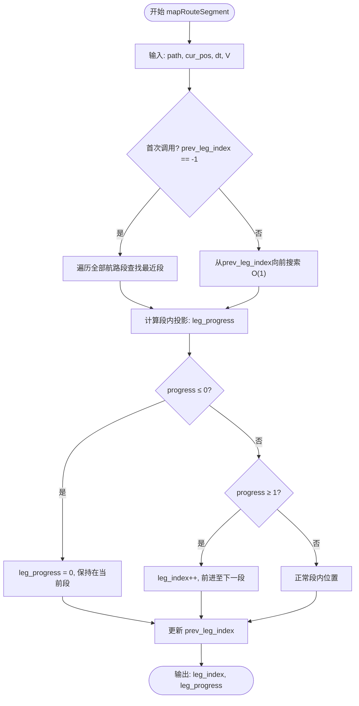
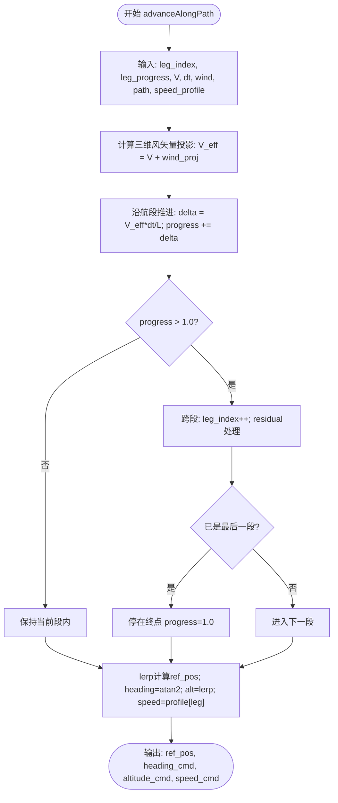
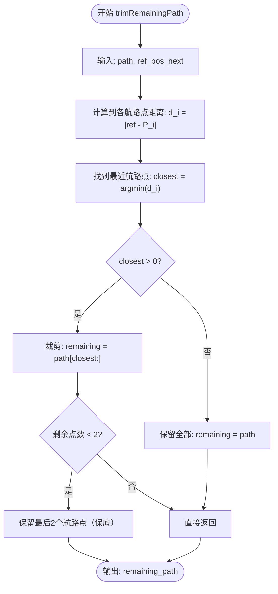
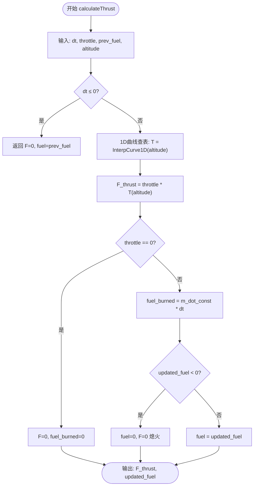
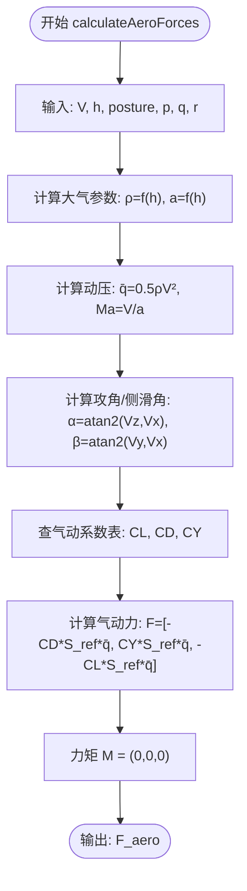
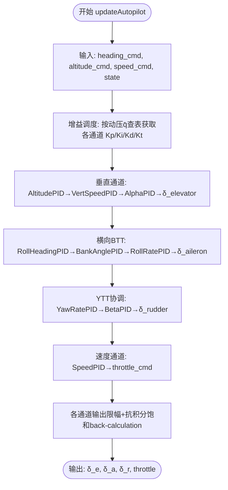
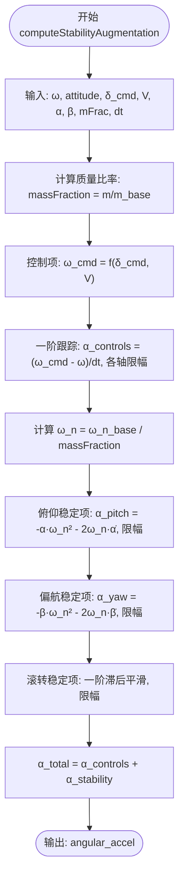
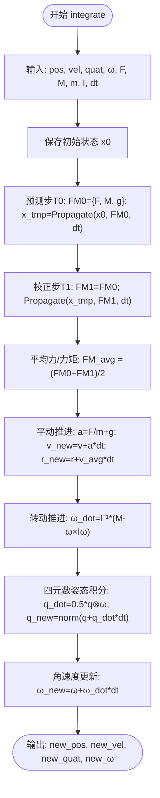
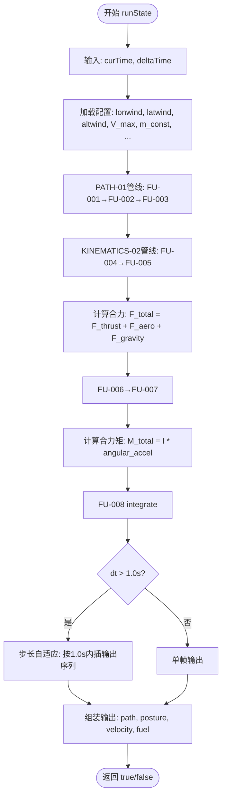

# 软件设计说明 — SDD for Function Migration

## REQ-002：编队沿航线飞行机动模型设计

> **文档版本**：1.0
> **日期**：2026-07-01
> **作者**：AI + 已人工确认
> **关联需求**：REQ-002
> **关联迁移计划**：[REQ-002-FU-design-confirmed.md](REQ-002-FU-design-confirmed.md)

---

### 1. 目的

本文档为 REQ-002 "编队沿航线飞行机动模型设计" 的软件设计说明（SDD），定义从 AFSIM 仿真系统迁移至目标系统的 9 个功能单元（FU）的软件架构、外部接口、运行逻辑和数学公式。本 SDD 面向开发者和测试人员，作为代码实现和验证的依据。

### 2. 范围

本 SDD 涵盖以下 9 个功能单元（FU），按两级管线组织：

| FU ID | 名称 | 优先级 | 所属管线 | 迁移策略 |
|-------|------|--------|----------|----------|
| FU-001 | 航路段映射（仅向前搜索） | 高 | PATH-01 | Clean-room 简化版 |
| FU-002 | 航线推进（三维指令输出） | 高 | PATH-01 | Clean-room 完整版 |
| FU-003 | 剩余航线裁剪 | 低 | PATH-01 | Clean-room 基础 |
| FU-004 | 推进系统（1D推力曲线+恒定燃油率+单油箱） | 高 | KINEMATICS-02 | Clean-room 简化版 |
| FU-005 | 气动模型（仅气动力） | 高 | KINEMATICS-02 | Clean-room 简化版 |
| FU-006 | 自动驾驶仪PID（完整20PID四通道） | 中 | KINEMATICS-02 | Clean-room 完整版 |
| FU-007 | SAS姿态控制（控制-稳定解耦） | 中 | KINEMATICS-02 | Clean-room 完整版 |
| FU-008 | 六自由度积分器（Heun+四元数+欧拉方程） | 高 | KINEMATICS-02 | Clean-room 完整版 |
| FU-009 | 航线机动集成调度 | 中 | INTEGRATION-03 | Clean-room 调度层 |

### 3. 参考文档

| # | 文档 | 路径 |
|---|------|------|
| 1 | 需求规范确认文档 | `docs/requirements/REQ_002/2_REQ-002-requirement-formation-move-along-path.md` |
| 2 | 需求缺口分析 | `docs/requirements/REQ_002/3_REQ-002-requirement-gap-analysis.md` |
| 3 | 功能映射矩阵 | `docs/requirements/REQ_002/3_REQ-002-function-mapping-matrix.md` |
| 4 | 需求追溯矩阵 | `docs/requirements/REQ_002/3_REQ-002-requirement-to-afsim-trace.md` |
| 5 | FU迁移设计（已确认） | `docs/migration/REQ-002/REQ-002-FU-design-confirmed.md` |
| 6 | 目标系统接口定义 | `docs/migration/REQ-002/target-interfaces.md` |
| 7 | 航路管理算法卡片 | `docs/algorithms/flight-dynamics-station-keeping-card.md` |
| 8 | 喷气发动机算法卡片 | `docs/algorithms/flight-dynamics-jet-engine-card.md` |
| 9 | 推进燃油算法卡片 | `docs/algorithms/flight-dynamics-propulsion-fuel-card.md` |
| 10 | 气动系数算法卡片 | `docs/algorithms/flight-dynamics-rigidbody-aero-coefficient-card.md` |
| 11 | 点质气动算法卡片 | `docs/algorithms/flight-dynamics-pointmass-aero-card.md` |
| 12 | 自动驾驶仪PID算法卡片 | `docs/algorithms/flight-dynamics-autopilot-pid-card.md` |
| 13 | SAS算法卡片 | `docs/algorithms/flight-dynamics-pointmass-sas-card.md` |
| 14 | 刚体积分器算法卡片 | `docs/algorithms/flight-dynamics-rigid-body-integrator-card.md` |
| 15 | 点质积分器算法卡片 | `docs/algorithms/flight-dynamics-pointmass-integrator-card.md` |

**AFSIM 源文件参考**：
- `afsim-2_9/swdev/src/wsf_plugins/wsf_six_dof/source/WsfSixDOF_StationKeepingState.hpp`（FU-001/002）
- `afsim-2_9/swdev/src/wsf_plugins/wsf_six_dof/source/WsfSixDOF_JetEngine.hpp`（FU-004）
- `afsim-2_9/swdev/src/wsf_plugins/wsf_six_dof/source/WsfRigidBodySixDOF_AeroMovableObject.hpp`（FU-005）
- `afsim-2_9/swdev/src/wsf_plugins/wsf_six_dof/source/WsfRigidBodySixDOF_CommonController.hpp`（FU-006）
- `afsim-2_9/swdev/src/wsf_plugins/wsf_six_dof/source/P6DofFlightControlSystem.hpp`（FU-007）
- `afsim-2_9/swdev/src/wsf_plugins/wsf_six_dof/source/WsfRigidBodySixDOF_Integrator.hpp`（FU-008）
- `afsim-2_9/swdev/src/wsf_plugins/wsf/source/WsfPlatform.hpp`（FU-009）

---

### 功能组件

#### 1. FU-001：航路段映射（仅向前搜索）

##### 1.1. 功能定位

确定飞机在航线中的位置——所在航路段序号和段内归一化进度。已简化为仅向前搜索（禁止回退），搜索范围为 O(1)。是 PATH-01 管线的第一级，输出供 FU-002 使用。

##### 1.2. 外部接口

| 序号 | 接口类型 | 参数类型 | 参数 | 参数描述 |
|------|---------|---------|------|---------|
| 1 | 输入 | `const std::vector<Point>&` | `path` | 期望航线航路点数组（size ≥ 2） |
| 2 | 输入 | `const Point&` | `cur_pos` | 飞机当前位置（经纬高，m） |
| 3 | 输入 | `double` | `dt` | 仿真步长（0, 1.0] s |
| 4 | 输入 | `double` | `V` | 飞机当前速度 [0, ∞) m/s |
| 5 | 输出 | `int` | `current_leg_index` | 当前航路段索引 [0, N-2] |
| 6 | 输出 | `double` | `leg_progress` | 段内归一化进度 [0, 1] |

**辅助函数 `computeLegProgress`**：独立计算指定航路段的段内进度，输入 path + leg_index + cur_pos，返回 double [0, 1]。

##### 1.3. 运行逻辑

##### 1.4. 数学公式

航路段最近距离（首次定位）：
$$d_i = \frac{|\overrightarrow{P_iP_{i+1}} \times \overrightarrow{P_iP_{cur}}|}{|\overrightarrow{P_iP_{i+1}}|}, \quad \text{leg\_index} = \arg\min_i d_i$$
$d_i$ 表示当前位置到第 i 个航路段的最短距离（m），$P_i$ 和 $P_{i+1}$ 为航路段端点坐标，$P_{cur}$ 为飞机当前位置。

段内归一化进度：
$$\text{leg\_progress} = \frac{\overrightarrow{P_iP_{cur}} \cdot \overrightarrow{P_iP_{i+1}}}{|\overrightarrow{P_iP_{i+1}}|^2}$$
$\text{leg\_progress}$ 表示飞机在航路段上的归一化位置（0 = 段起点，1 = 段终点），分子为向量投影长度，分母为段长度平方。

大跨度地球曲率（>100 km，可选）：
$$a = \sin^2(\Delta lat/2) + \cos(lat_1)\cos(lat_2)\sin^2(\Delta lon/2)$$
$$d = 2R_{earth} \cdot \text{atan2}(\sqrt{a}, \sqrt{1-a})$$
$a$ 为 Haversine 中间量（无量纲），$R_{earth}$ 为地球半径（默认 6378137 m），$d$ 为大圆距离（m）。

---

#### 2. FU-002：航线推进（三维指令输出）

##### 2.1. 功能定位

沿当前航路段以设定速度推进参考点位置，输出 heading_cmd（航向方位角）、altitude_cmd（高度线性插值）、speed_cmd（速度查表）。考虑三维风矢量叠加影响。是 PATH-01 管线的第二级，为 FU-006 提供三维制导指令。

##### 2.2. 外部接口

| 序号 | 接口类型 | 参数类型 | 参数 | 参数描述 |
|------|---------|---------|------|---------|
| 1 | 输入 | `int` | `leg_index` | 当前航路段索引 [0, N-2] |
| 2 | 输入 | `double` | `leg_progress` | 段内归一化进度 [0, 1] |
| 3 | 输入 | `double` | `V` | 飞机设定速度 m/s |
| 4 | 输入 | `double` | `dt` | 仿真步长 s |
| 5 | 输入 | `double` | `lonwind` | 经向风（北为正）m/s |
| 6 | 输入 | `double` | `latwind` | 纬向风（东为正）m/s |
| 7 | 输入 | `double` | `altwind` | 垂直风（向上为正）m/s |
| 8 | 输入 | `const std::vector<Point>&` | `path` | 期望航线 |
| 9 | 输入 | `const std::vector<double>&` | `speed_profile` | 速度规划 |
| 10 | 输出 | `Point` | `ref_pos_next` | 下一时刻参考点位置 |
| 11 | 输出 | `double` | `heading_cmd` | 期望航向角 (°) |
| 12 | 输出 | `double` | `altitude_cmd` | 期望高度 (m) |
| 13 | 输出 | `double` | `speed_cmd` | 期望速度 (m/s) |

##### 2.3. 运行逻辑

##### 2.4. 数学公式

三维风矢量沿航段投影：
$$V_{wind\_proj} = u_{lon}\hat{d}_{lon} + u_{lat}\hat{d}_{lat} + u_{alt}\hat{d}_{alt}, \quad V_{eff} = V + V_{wind\_proj}$$
$u_{lon}$ 为经向风速（m/s，北正），$u_{lat}$ 为纬向风速（m/s，东正），$u_{alt}$ 为垂直风速（m/s，上正），$\hat{d}$ 为航段方向单位向量。

航向角（小跨度平面近似）：
$$\theta_{heading} = \text{atan2}(\Delta lat, \Delta lon) \cdot \frac{180}{\pi}$$
$\Delta lon = P_{i+1}.\_lon - P_i.\_lon$（m），$\Delta lat = P_{i+1}.\_lat - P_i.\_lat$（m），$\theta_{heading}$ 单位为度（°）。

高度线性插值：
$$h_{cmd} = P_i.\_alt + progress \cdot (P_{i+1}.\_alt - P_i.\_alt)$$
$h_{cmd}$ 为目标高度（m），$P_i.\_alt$ 和 $P_{i+1}.\_alt$ 为航段两端高度（m）。

---

#### 3. FU-003：剩余航线裁剪

##### 3.1. 功能定位

从原始航线数组中移除已飞越的航路点，返回剩余未到达的航点序列。基本数组操作，无算法复杂度，无 AFSIM 参考。

##### 3.2. 外部接口

| 序号 | 接口类型 | 参数类型 | 参数 | 参数描述 |
|------|---------|---------|------|---------|
| 1 | 输入 | `const std::vector<Point>&` | `path` | 原始完整航线 |
| 2 | 输入 | `const Point&` | `ref_pos_next` | 参考点下一时刻位置 |
| 3 | 输出 | `std::vector<Point>` | `remaining_path` | 未到达航点序列（至少含 1 个保底终点） |

##### 3.3. 运行逻辑

##### 3.4. 数学公式

$$\text{closest\_index} = \arg\min_i |\mathbf{r}_{ref} - \mathbf{P}_i|, \quad \text{remaining} = \text{path}[\text{closest\_index}:]$$
$\mathbf{r}_{ref}$ 为参考点位置（来自 FU-002），$\mathbf{P}_i$ 为第 i 个航路点坐标，保底逻辑在参考点飞越所有航路点时保留最后一个航路点。

---

#### 4. FU-004：推进系统（1D推力曲线+恒定燃油率+单油箱）

##### 4.1. 功能定位

简化版推进系统——通过 1D 曲线按高度插值获取推力值，使用恒定燃油消耗率和单油箱模型。跳过 AFSIM 完整的三层查表（Idle/Mil/AB）+ spool dynamics + 多油箱传输。为 FU-008 提供推力输入。

##### 4.2. 外部接口

| 序号 | 接口类型 | 参数类型 | 参数 | 参数描述 |
|------|---------|---------|------|---------|
| 1 | 输入 | `double` | `dt` | 仿真步长 (0, 1.0] s |
| 2 | 输入 | `double` | `throttle` | 油门位置 [0, 1]（来自 FU-006） |
| 3 | 输入 | `double` | `prev_fuel` | 上一时刻燃油质量 [0, MaxFuel] kg |
| 4 | 输入 | `double` | `altitude` | MSL 海拔高度 [0, 50000] m |
| 5 | 输出 | `double` | `F_thrust` | 当前帧推力 [0, ∞) N |
| 6 | 输出 | `double` | `updated_fuel` | 消耗后燃油质量 kg |

##### 4.3. 运行逻辑

##### 4.4. 数学公式

1D 推力曲线查表：
$$T(altitude) = \text{InterpCurve1D}(altitude, thrust\_curve), \quad F_{thrust} = \delta_{throttle} \cdot T(altitude)$$
$T(altitude)$ 为通过 1D 曲线按高度线性插值得到的推力值（N），$\delta_{throttle} \in [0,1]$ 为油门位置。推力曲线数据来自 AFSIM 默认 Mil 推力表经 Imperial→SI 转换。

恒定燃油消耗率：
$$m_{fuel}(t + \Delta t) = m_{fuel}(t) - \dot{m}_{const} \cdot \Delta t$$
$\dot{m}_{const}$ 为恒定燃油质量流量（kg/s），通过 `para.getPara("m_dot_const", 0.0)` 读取。当 $m_{fuel} < 0$ 时推力归零（熄火）。

---

#### 5. FU-005：气动模型（仅气动力）

##### 5.1. 功能定位

仅计算气动力的三个分量（升力、阻力、侧力），力矩全零——全部由 SAS（FU-007）提供。使用参考面积、动压和气动系数进行缩放。为 FU-008 提供气动力输入。

##### 5.2. 外部接口

| 序号 | 接口类型 | 参数类型 | 参数 | 参数描述 |
|------|---------|---------|------|---------|
| 1 | 输入 | `double` | `V` | 当前速度 [0, 5000] m/s |
| 2 | 输入 | `double` | `h` | MSL 海拔高度 [0, 50000] m |
| 3 | 输入 | `const Posture&` | `posture` | 当前姿态（yaw/pitch/roll, °） |
| 4 | 输入 | `double` | `p` | 滚转角速率 rad/s |
| 5 | 输入 | `double` | `q` | 俯仰角速率 rad/s |
| 6 | 输入 | `double` | `r` | 偏航角速率 rad/s |
| 7 | 输出 | `Eigen::Vector3d` | `F_aero` | 体轴系气动力矢量 [F_x, F_y, F_z] N |

##### 5.3. 运行逻辑

##### 5.4. 数学公式

动压和马赫数：
$$\bar{q} = \frac{1}{2}\rho(h) V^2, \quad Ma = \frac{V}{a(h)}$$
$\rho(h)$ 为大气密度（kg/m³），$a(h)$ 为当地音速（m/s），$\bar{q}$ 为动压（Pa）。

体轴系气动力：
$$\mathbf{F}_{aero} = \bar{q} \cdot S_{ref} \cdot \begin{bmatrix} -C_D(\alpha, \beta, Ma) \\ C_Y(\alpha, \beta, Ma) \\ -C_L(\alpha, \beta, Ma) \end{bmatrix}$$
$S_{ref}$ 为参考面积（m²），$C_L, C_D, C_Y$ 分别为升力/阻力/侧力系数（无量纲），通过攻角 $\alpha$、侧滑角 $\beta$ 和马赫数 $Ma$ 查表获得。

---

#### 6. FU-006：自动驾驶仪PID（完整20PID四通道）

##### 6.1. 功能定位

完整 20 PID 三通道嵌套回路控制系统，四通道全部激活。BTT（RollHeading→BankAngle→RollRate→δ_aileron）、YTT 协调（YawRate→Beta→δ_rudder）、垂直（Altitude→VertSpeed→Alpha→δ_elevator）、速度（Speed→throttle）。含增益调度、抗积分饱和、低通滤波导数。与 SAS 分工：PID = 制导决策，SAS = 执行保护。

##### 6.2. 外部接口

| 序号 | 接口类型 | 参数类型 | 参数 | 参数描述 |
|------|---------|---------|------|---------|
| 1 | 输入 | `double` | `heading_cmd` | 期望航向角 (-180°, 180°] |
| 2 | 输入 | `double` | `altitude_cmd` | 期望高度 [0, ∞) m |
| 3 | 输入 | `double` | `speed_cmd` | 期望速度 [0, V_max] m/s |
| 4 | 输入 | `const Posture&` | `prev_posture` | 当前姿态角 (°) |
| 5 | 输入 | `double` | `p, q, r` | 角速率 rad/s |
| 6 | 输入 | `double` | `prev_velocity` | 当前速度 m/s |
| 7 | 输入 | `double` | `alpha, beta` | 攻角/侧滑角 (°) |
| 8 | 输出 | `double` | `δ_elevator` | 升降舵 [-1, 1] |
| 9 | 输出 | `double` | `δ_aileron` | 副翼 [-1, 1] |
| 10 | 输出 | `double` | `δ_rudder` | 方向舵 [-1, 1] |
| 11 | 输出 | `double` | `throttle_cmd` | 油门指令 [0, 1] |

##### 6.3. 运行逻辑

##### 6.4. 数学公式

PID 控制律（核心）：
$$u(t) = K_p e(t) + K_i^{eff} \int e(\tau)d\tau + K_d \frac{de}{dt} + bias$$
$e(t) = SP - PV$ 为设定点与过程变量的误差，$K_p, K_i, K_d$ 为比例/积分/微分增益，$bias$ 为前馈偏置。

抗积分饱和 back-calculation：
$$K_i^{eff} = K_i + K_t (u_{limited} - u_{prelim})$$
$K_t$ 为抗饱和增益（越大修正越快），$u_{limited}$ 为限幅后输出，$u_{prelim}$ 为限幅前输出。

增益调度（以动压 $\bar{q}$ 线性插值）：
$$K(\bar{q}) = K_{low} + \frac{\bar{q} - \bar{q}_{low}}{\bar{q}_{high} - \bar{q}_{low}} (K_{high} - K_{low})$$
$K$ 为各 PID 的 8 参数集合 $\{K_p, K_i, K_d, \alpha, MaxAccum, MaxErrorZero, MinErrorZero, K_t\}$。

**⚠️ 单位策略**：FU-006 内部保留 Imperial 单位（避免 SI 转换后重调 60+ 增益参数），仅在 FU-009 接口处转换。

---

#### 7. FU-007：SAS姿态控制（控制-稳定解耦）

##### 7.1. 功能定位

三通道控制-稳定解耦架构——控制项一阶跟踪 + 稳定项二阶临界阻尼（俯仰/偏航）/一阶滞后（滚转）+ 各通道独立限幅。⚠️ 非 PID 控制。为 FU-008 提供旋转角加速度。

##### 7.2. 外部接口

| 序号 | 接口类型 | 参数类型 | 参数 | 参数描述 |
|------|---------|---------|------|---------|
| 1 | 输入 | `const Eigen::Vector3d&` | `angular_velocity` | 当前 p/q/r rad/s |
| 2 | 输入 | `const Eigen::Vector3d&` | `attitude` | 当前 roll/pitch/yaw ° |
| 3 | 输入 | `const Eigen::Vector3d&` | `control_command` | δ 指令 [-1,1]³（来自 FU-006） |
| 4 | 输入 | `double` | `velocity` | 当前速度 m/s |
| 5 | 输入 | `double` | `alpha, beta` | 攻角/侧滑角 ° |
| 6 | 输入 | `double` | `massFraction` | m/m_base 质量比率 |
| 7 | 输入 | `double` | `dt` | 仿真步长 s |
| 8 | 输出 | `Eigen::Vector3d` | `angular_accel` | 角加速度 p̈/q̈/r̈ rad/s² |

##### 7.3. 运行逻辑

##### 7.4. 数学公式

总角加速度 = 控制项 + 稳定增稳项：
$$\vec{\alpha}_{total} = \vec{\alpha}_{controls} + \vec{\alpha}_{stability}$$
$\vec{\alpha}_{controls}$ 为控制角加速度（rad/s²），$\vec{\alpha}_{stability}$ 为增稳角加速度（rad/s²）。

控制项——一阶指令跟踪：
$$\vec{\alpha}_{controls} = \frac{\vec{\omega}_{cmd} - \vec{\omega}_{current}}{\Delta t}, \quad \alpha_i = \text{clamp}(\alpha_i, \pm\frac{|\alpha_{limit,i,base}|}{m_{fraction}})$$
$\vec{\omega}_{cmd}$ 为来自 FU-006 的目标角速率（rad/s），$m_{fraction} = m/m_{base}$ 为质量比率。

稳定项——俯仰/偏航二阶临界阻尼（$\zeta=1$）：
$$\alpha_{pitch,stab} = -\alpha \cdot \omega_{n,pitch}^2 - 2\omega_{n,pitch} \cdot \dot{\alpha}$$
$$\alpha_{yaw,stab} = -\beta \cdot \omega_{n,yaw}^2 - 2\omega_{n,yaw} \cdot \dot{\beta}$$
$\omega_n = \omega_{n,base} / m_{fraction}$ 为稳定化固有频率（rad/s），$-\alpha\omega_n^2$ 为恢复项（模拟静稳定性），$2\omega_n\dot{\alpha}$ 为阻尼项。

稳定项——滚转一阶滞后平滑：
$$weight = \frac{\omega_{n,roll} \cdot \Delta t}{1 + \omega_{n,roll} \cdot \Delta t}, \quad \dot{p}_{expected} = (1 - weight) \cdot p$$
$$\alpha_{roll,stab} = \frac{\dot{p}_{expected} - p}{\Delta t}$$
$weight$ 为平滑权重（无量纲），等效于低通滤波器时间常数 $\tau = 1/\omega_{n,roll}$。

---

#### 8. FU-008：六自由度积分器（Heun+四元数+欧拉方程）

##### 8.1. 功能定位

使用 Heun 预测-校正法对飞机进行六自由度时间推进。平动推进（牛顿第二定律）+ 转动推进（欧拉方程含 $\omega \times I\omega$ 交叉耦合项）+ 四元数姿态积分。m 和 I 为飞行全程常量。

##### 8.2. 外部接口

| 序号 | 接口类型 | 参数类型 | 参数 | 参数描述 |
|------|---------|---------|------|---------|
| 1 | 输入 | `const Point&` | `position` | 当前位置 (m) |
| 2 | 输入 | `double` | `velocity` | 当前速度 [0, 10000] m/s |
| 3 | 输入 | `const Eigen::Quaterniond&` | `quaternion` | 姿态四元数（模长≈1） |
| 4 | 输入 | `const Eigen::Vector3d&` | `angular_velocity` | p/q/r rad/s |
| 5 | 输入 | `const Eigen::Vector3d&` | `total_force` | 合外力 N |
| 6 | 输入 | `const Eigen::Vector3d&` | `total_moment` | 合外力矩 N·m |
| 7 | 输入 | `double` | `mass` | 质量常量 kg |
| 8 | 输入 | `const Eigen::Matrix3d&` | `inertia_tensor` | 惯量张量（正定） |
| 9 | 输入 | `double` | `dt` | 仿真步长 s |
| 10 | 输出 | `Point` | `new_position` | 更新后位置 |
| 11 | 输出 | `double` | `new_velocity` | 更新后速度 |
| 12 | 输出 | `Eigen::Quaterniond` | `new_quaternion` | 更新后姿态（已归一化） |
| 13 | 输出 | `Eigen::Vector3d` | `new_angular_velocity` | 更新后角速率 |

##### 8.3. 运行逻辑

##### 8.4. 数学公式

Heun 预测-校正法框架：
$$\mathbf{FM}_0 = \text{CalculateFM}(\mathbf{x}_0), \quad \tilde{\mathbf{x}} = \text{Propagate}(\mathbf{x}_0, \mathbf{FM}_0, \Delta t)$$
$$\mathbf{FM}_1 = \text{CalculateFM}(\tilde{\mathbf{x}}), \quad \mathbf{FM}_{avg} = (\mathbf{FM}_0 + \mathbf{FM}_1)/2$$
$$\mathbf{x}_1 = \text{UpdateUsingFM}(\mathbf{x}_0, \mathbf{FM}_{avg}, \Delta t)$$
$\mathbf{x} = \{\mathbf{r}, \mathbf{v}, \mathbf{q}, \boldsymbol{\omega}\}$ 为完整运动学状态。REQ-002 简化版中 FM1 = FM0。

平动推进（牛顿第二定律）：
$$\mathbf{a}_{body} = \frac{\mathbf{F}_{total}}{m} + \mathbf{g}_{body}, \quad \mathbf{a}_{WCS} = \mathbf{R}_{body2WCS} \cdot \mathbf{a}_{body}$$
$$\mathbf{v}_{new} = \mathbf{v}_{old} + \mathbf{a}_{WCS} \cdot \Delta t, \quad \mathbf{r}_{new} = \mathbf{r}_{old} + \frac{\mathbf{v}_{old} + \mathbf{v}_{new}}{2} \cdot \Delta t$$
$\mathbf{R}_{body2WCS}$ 为体轴系→世界系的旋转矩阵（由四元数转换），$m$ 为质量常量（kg）。

欧拉转动方程（含 $I_{xz}$ 交叉耦合）：
$$\mathbf{I} \cdot \dot{\boldsymbol{\omega}} = \mathbf{M}_{total} - \boldsymbol{\omega} \times (\mathbf{I} \cdot \boldsymbol{\omega})$$
$$\dot{\boldsymbol{\omega}} = \mathbf{I}^{-1} \cdot [\mathbf{M}_{total} - \boldsymbol{\omega} \times (\mathbf{I} \cdot \boldsymbol{\omega})]$$
$\mathbf{I} = \begin{bmatrix} I_{xx} & 0 & -I_{xz} \\ 0 & I_{yy} & 0 \\ -I_{xz} & 0 & I_{zz} \end{bmatrix}$ 为转动惯量张量（kg·m²），交叉耦合项 $\boldsymbol{\omega} \times (\mathbf{I} \cdot \boldsymbol{\omega})$ 不可忽视。

四元数姿态积分：
$$\dot{\mathbf{q}} = \frac{1}{2} \mathbf{q} \otimes \begin{bmatrix} 0 \\ \boldsymbol{\omega} \end{bmatrix}, \quad \mathbf{q}_{new} = \text{normalize}(\mathbf{q}_{old} + \dot{\mathbf{q}} \cdot \Delta t)$$
$\otimes$ 为四元数乘法，归一化步骤防止姿态漂移。dt > 0.5s 时需中间归一化。

---

#### 9. FU-009：航线机动集成调度

##### 9.1. 功能定位

每仿真帧调用一次，顺序调度 PATH-01 管线（FU-001→002→003）→ KINEMATICS-02 管线（FU-004→005→006→007→008）→ 步长自适应输出组装。纯调度逻辑，依赖全部 8 个子 FU。

##### 9.2. 外部接口

| 序号 | 接口类型 | 参数类型 | 参数 | 参数描述 |
|------|---------|---------|------|---------|
| 1 | 输入 | `double` | `curTime` | 当前仿真时间戳 s |
| 2 | 输入 | `double` | `deltaTime` | 仿真步长 (0, 3600] s |
| 3 | 输出 | `bool` | 返回值 | true=正常完成，false=异常终止 |

**辅助函数 `reportError`**：异常上报，输入 curTime + report_string，void 返回。

##### 9.3. 运行逻辑

##### 9.4. 数学公式

本 FU 为纯调度逻辑，无独立算法公式。调度顺序严格为 PATH-01 → KINEMATICS-02 → 输出组装。步长自适应阈值 `STEP_THRESHOLD` = 1.0 s。

---

### 测试策略

| 测试类型 | 内容 | 验证方法 |
|----------|------|----------|
| 单元测试 | 各 FU 函数独立测试（正常/边界/异常输入） | 固定输入→断言输出在容许范围内 |
| 集成测试 | TC-NORMAL：100 步仿真全管线运行 | 检查物理合理性（位置递增、燃油递减、速度有界） |
| 集成测试 | TC-BOUNDARY：dt=0、空航线、零速度、零燃油 | 断言返回安全默认值，不崩溃 |
| 集成测试 | TC-EXCEPTION：nullptr、退化四元数、负燃油 | 断言返回 false 或抛出异常 |
| 验证方法 | 输出日志比对、数值范围检查、不变量监控 | 对比 AFSIM 参考输出的量级和趋势 |

### 限制与假设

1. **m 和 I 为飞行全程常量**（补充约束），仅燃油质量在 FU-004 中单独衰减
2. **大气模型简化**：密度 ρ(h) 和音速 a(h) 使用 ISA 标准大气简化公式（非完整查表）
3. **气动系数简化**：首版使用常量 CL/CD/CY 或解析函数替代高维查表
4. **PID 增益**：60+ 参数使用 AFSIM 默认增益表（Imperial 单位），FU-006 内部保留 Imperial
5. **地球曲率**：小跨度（≤100 km）默认使用平面近似；大跨度可选 Haversine 模式
6. **单线程**：当前版本不支持多线程仿真（区别于 AFSIM 的 WsfPlatform::DoUpdateMultiThread）
7. **数值精度**：使用 double（64-bit IEEE 754），Heun 二阶精度 O(Δt²)

### 人工确认

| 需求ID | 确认状态 | 确认人 | 日期 |
|--------|---------|--------|------|
| REQ-002 | 已确认 | AI + 已人工确认 | 2026-06-30 |
| FU-001 | 已确认 | — | 2026-06-30 |
| FU-002 | 已确认 | — | 2026-06-30 |
| FU-003 | 已确认 | — | 2026-06-30 |
| FU-004 | 已确认 | — | 2026-06-30 |
| FU-005 | 已确认 | — | 2026-06-30 |
| FU-006 | 已确认 | — | 2026-06-30 |
| FU-007 | 已确认 | — | 2026-06-30 |
| FU-008 | 已确认 | — | 2026-06-30 |
| FU-009 | 已确认 | — | 2026-06-30 |

### 附录

#### 变量映射表

| AFSIM 变量 | 目标系统变量 | 类型 | 转换 |
|------------|-------------|------|------|
| Position (ft) | position (m) | Point | ×0.3048 |
| Velocity (ft/s) | velocity (m/s) | double | ×0.3048 |
| Mass (lbm) | mass (kg) | double | ×0.453592 |
| Force (lbf) | force (N) | double | ×4.44822 |
| Moment (ft-lbf) | moment (N·m) | double | ×1.35582 |
| AngularRate (rad/s) | angular_rate (rad/s) | double | 一致 |
| DynamicPressure (lb/ft²) | q_bar (Pa) | double | ×47.8803 |
| Inertia (slug-ft²) | inertia (kg·m²) | double | ×1.35582 |
| FuelRate (lbm/s) | fuel_rate (kg/s) | double | ×0.453592 |
| Gravity (m/s²) | gravity (m/s²) | double | 一致 |

#### 修改记录

| 版本 | 日期 | 修改内容 | 修改原因 |
|------|------|----------|----------|
| 1.0 | 2026-07-01 | 初始版本——完成 9 个 FU 的 SDD | 首次生成，基于已确认的 FU-design v1.0 |
