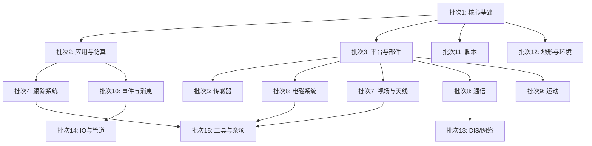

# 03 — 分批计划

**日期**：2026-06-08
**状态**：待执行

---

## 划分依据

wsf/source 共 1,113 个文件（380 顶层 + 733 子目录），按以下原则分为 15 个批次：

1. **功能性内聚**：同一子系统的文件放在同一批，因为它们之间有密集的调用依赖
2. **规模均衡**：每批控制在 30-80 个文件（头+源），保证分析效率
3. **依赖顺序**：基础类优先分析，依赖它们的模块稍后
4. **头文件优先**：每批先分析 .hpp（接口），再分析 .cpp（实现）

---

## 批次列表

### 批次 1：核心基础类（~26 文件）
**优先级原因**：这些类是整个框架的根，所有其他模块都直接或间接依赖它们。

| 文件 | 类型 |
|------|------|
| WsfTypes.hpp/cpp | 核心枚举 (WsfSpatialDomain) |
| WsfVersion.hpp | 版本 |
| WsfException.hpp | 异常 |
| WsfNamed.hpp/cpp | 命名对象基类 |
| WsfObject.hpp/cpp | 对象基类 |
| WsfStringId.hpp | 字符串 ID |
| WsfUniqueId.hpp/cpp | 唯一 ID |
| WsfVariable.hpp/cpp | 可变参数 |
| WsfRandom.hpp/cpp | 随机数 |
| WsfRandomVariable.hpp/cpp | 随机变量 |
| WsfComponent.hpp/cpp | 组件基类 |
| WsfComponentFactory.hpp/cpp | 组件工厂 |
| WsfComponentList.hpp/cpp | 组件列表 |
| WsfComponentRoles.hpp | 组件角色 |
| WsfSimpleComponent.hpp | 简单组件 |

### 批次 2：应用与仿真核心（~22 文件）
| 文件 | 类型 |
|------|------|
| WsfApplication.hpp/cpp | 应用主类 |
| WsfApplicationExtension.hpp/cpp | 应用扩展 |
| WsfStandardApplication.hpp/cpp | 标准应用 |
| WsfSimulation.hpp/cpp | 仿真主循环 |
| WsfSimulationExtension.hpp/cpp | 仿真扩展 |
| WsfSimulationInput.hpp/cpp | 仿真输入 |
| WsfScenario.hpp/cpp | 场景定义 |
| WsfScenarioExtension.hpp/cpp | 场景扩展 |
| WsfFrameStepSimulation.hpp/cpp | 帧步进 |
| WsfEventStepSimulation.hpp/cpp | 事件步进 |
| WsfProfilingApplicationExtension.hpp/cpp | 性能分析 |

### 批次 3：平台与部件（~30 文件）
| 文件 | 类型 |
|------|------|
| WsfPlatform.hpp/cpp | 平台主类 |
| WsfPlatformPart.hpp/cpp | 平台部件 |
| WsfPlatformPartEvent.hpp/cpp | 平台部件事件 |
| WsfPlatformTypes.hpp/cpp | 平台类型 |
| WsfPlatformAvailability.hpp/cpp | 平台可用性 |
| WsfArticulatedPart.hpp/cpp | 铰接部件 |
| WsfArticulatedPartEvent.hpp/cpp | 铰接部件事件 |
| WsfAuxDataEnabled.hpp/cpp | 辅助数据 mixin |
| WsfSignature.hpp/cpp | 特征基类 |
| WsfSignatureInterface.hpp/cpp | 特征接口 |
| WsfSignatureList.hpp/cpp | 特征列表 |
| WsfRadarSignature.hpp/cpp | 雷达特征 |
| WsfRadarSignatureTypes.hpp/cpp | 雷达特征类型 |
| WsfStandardRadarSignature.hpp/cpp | 标准雷达特征 |

### 批次 4：跟踪系统（~50 文件）
WsfTrack, WsfTrackManager, WsfLocalTrack, 所有 Correlation/Fusion/Extrapolation/Reporting 相关文件。

### 批次 5：传感器系统（sensor/ 子目录：~73 文件）
所有传感器模型实现。

### 批次 6：电磁系统（~50 文件）
WsfEM_* 系列：Manager, Antenna, Xmtr, Rcvr, Propagation, Attenuation, Noise, Clutter, Interaction 等。

### 批次 7：视场与天线（~30 文件）
WsfFieldOfView*, WsfAntennaPattern*, WsfMaskingPattern*, WsfStandardAntennaPattern 等。

### 批次 8：通信系统（comm/ 子目录：~108 文件）
所有通信模型。

### 批次 9：运动系统（mover/ 子目录：~101 文件）
所有运动模型。

### 批次 10：事件与消息（~40 文件）
WsfEvent*, WsfMessage*, WsfCallback* 系列。

### 批次 11：脚本系统（script/ 子目录：~108 文件）
脚本引擎和语法接口。

### 批次 12：地形与环境（~35 文件）
WsfTerrain*, WsfZone*, WsfEnvironment, WsfEarthGravityModel 等。

### 批次 13：DIS/网络（dis/ 子目录：~120 文件）
IEEE 1278.1 分布式仿真协议。

### 批次 14：IO 与管道（xio + event_pipe + ext：~86 文件）
外部 IO、事件管道、扩展接口。

### 批次 15：工具与杂项（~60 文件）
WsfUtil, WsfDateTime, WsfGeoPoint, WsfConsole, WsfSystemLog, WsfPluginManager, WsfGroup*, WsfCategoryList, WsfMode*, WsfAttribute*, WsfMeasurement, WsfIntercept, WsfDeferredInput, WsfTimeDelayQueue, WsfMultiThreadManager, WsfThread*, WsfDraw, WsfVisual*, WsfImage, WsfExchange, WsfFilter*, WsfBehaviorTree*, WsfNetworkInterface, WsfCommandChain, WsfExternalLinks, WsfInternalLinks, WsfIntersectMesh*, 等。

---

## 执行顺序

> **并行机会**：批次 4-12 在批次 1-3 完成后可大量并行执行。批次 13-15 可在依赖就绪后并行。

---

## 每批分析流程

对每个批次，启动 Workflow 执行：

1. **文件分组**：将批次内文件按 .hpp/.cpp 配对，未配对文件单独处理
2. **并行阅读**：每个 Agent 分析 5-10 个文件
3. **索引追加**：每个 Agent 将分析结果追加到 4 个索引文件
4. **依赖暂存**：跨批次依赖暂存，待目标批次完成后补充
