# MX004 — 仿真实体组件矩阵参考实现分析

> **时间**: 2026-07-03
> **编号**: MX004
> **来源**: MX004_tm.docx（实体-组件矩阵）

---

## 需求描述

MX004 需求为一个仿真实体-组件矩阵，定义了 11 种仿真实体模型在 6 大类功能组件（机动、探测、火力、通信、毁伤、干扰）上的分布关系。

### 实体-组件矩阵

| 序号 | 模型 | 机动组件 | 探测组件 | 火力组件 | 通信组件 | 毁伤组件 | 干扰组件 |
|------|------|----------|----------|----------|----------|----------|----------|
| 1 | AA无人机 | 空中机动 | 可见光探测 | 自杀攻击, 导弹火力 | 报文发送 | 毁伤 | |
| 2 | BB无人机 | 空中机动 | 雷达探测 | 自杀攻击, 导弹火力 | 报文发送 | 毁伤 | |
| 6 | 电子战飞机 | 空中机动 | 雷达探测 | | 报文发送 | 毁伤 | 电子干扰 |
| 7 | 指挥所 | 陆上机动 | | | 报文发送 | 毁伤 | |
| 8 | EE雷达车 | 陆上机动 | 雷达探测 | | 报文发送 | 毁伤 | |
| 9 | 运弹车 | 陆上机动 | 雷达探测 | | | 毁伤 | |
| 10 | EE发射车 | 陆上机动 | 雷达探测 | 制导武器发射 | 报文发送 | 毁伤 | |
| 11 | EE弹 | 导弹机动 | 雷达探测 | 导弹火力 | | 毁伤 | |
| 12 | EE指挥车 | 陆上机动 | | | 报文发送 | 毁伤 | |
| 17 | 帐篷 | | | | | 毁伤 | |
| 18 | 远箱火弹 | 导弹机动 | 惯性导航 | 导弹火力 | | 毁伤 | |

---

## 功能详情

从矩阵中提取的 12 个独立功能组件，按类别分组如下：

### 机动组件（3项）
1. **空中机动** — AA无人机、BB无人机、电子战飞机
2. **陆上机动** — 指挥所、EE雷达车、运弹车、EE发射车、EE指挥车
3. **导弹机动** — EE弹、远箱火弹

### 探测组件（3项）
4. **可见光探测** — AA无人机
5. **雷达探测** — BB无人机、电子战飞机、EE雷达车、运弹车、EE发射车、EE弹
6. **惯性导航** — 远箱火弹

### 火力组件（3项）
7. **自杀攻击** — AA无人机、BB无人机
8. **导弹火力** — AA无人机、BB无人机、EE弹、远箱火弹
9. **制导武器发射** — EE发射车

### 通信组件（1项）
10. **报文发送** — AA无人机、BB无人机、电子战飞机、指挥所、EE雷达车、EE发射车、EE指挥车

### 毁伤组件（1项）
11. **毁伤** — 全部 11 个实体

### 干扰组件（1项）
12. **电子干扰** — 电子战飞机

---

## AFSIM Reference Implementation Evidence Summary

| # | MX004 功能 | AFSIM 参考 | 覆盖度 |
|---|-----------|-----------|--------|
| 1 | 空中机动 | `WsfAirMover` (wsf/source/mover/WsfAirMover.hpp) extends `WsfWaypointMover` → `WsfRouteMover` → `WsfMover`. 航路点飞行 + 起降/HAT计算/地面碰撞/毁伤评估. 关联算法卡片: flight-dynamics-pointmass-integrator-card.md, flight-dynamics-autopilot-pid-card.md | ✅ 完全覆盖 |
| 2 | 陆上机动 | `WsfGroundMover` (wsf/source/mover/WsfGroundMover.hpp) extends `WsfWaypointMover` → `WsfRouteMover` → `WsfMover`. 地面航路点运动 + 地形跟随. | ✅ 完全覆盖 |
| 3 | 导弹机动 | `WsfGuidedMover` (wsf_mil/source/mover/WsfGuidedMover.hpp) extends `WsfGuidedMoverBase`. 制导飞行器运动 + `WsfTBM_Mover`/`WsfParabolicMover` 弹道模型. 关联算法卡片: flight-dynamics-pointmass-integrator-card.md | ✅ 完全覆盖 |
| 4 | 可见光探测 | `WsfEOIR_Sensor` (wsf_mil/source/sensor/WsfEOIR_Sensor.hpp) with `EOIR_Mode`/`EOIR_ErrorModel`/`EOIR_SensorScheduler`. `WsfOpticalSensor` with `OpticalMode`. 无多模式自动切换机制 | ⚠️ 部分覆盖 |
| 5 | 雷达探测 | `WsfRadarSensor` + `WsfOTH_RadarSensor` + `WsfSurfaceWaveRadarSensor` + `WsfESM_Sensor` (无源). 含 `RadarMode`/`SignalProcessor`/`ErrorModel`. | ✅ 完全覆盖 |
| 6 | 惯性导航 | AFSIM 无独立 INS 组件。平台位置/姿态由 mover 积分器内部跟踪，不暴露为独立导航组件。 | 🆕 缺失 |
| 7 | 自杀攻击 | 可由 `WsfGuidedMover` + `WsfMobilityAndFirepowerLethality` + 触发引信 (`WsfAirTargetFuse`/`WsfGroundTargetFuse`) 组合实现，AFSIM 无专用"自杀无人机"类。 | ⚠️ 部分覆盖 |
| 8 | 导弹火力 | `WsfWeaponComponent` + `WsfImplicitWeapon`/`WsfExplicitWeapon` + 多种杀伤模型 (`WsfSphericalLethality`, `WsfTabulatedLethality`, `WsfGraduatedLethality`, `WsfCarltonLethality`, `WsfMobilityAndFirepowerLethality`). `WsfWeaponTaskManager` + `WsfGuidanceComputer` + `WsfWeaponFuse`. | ✅ 完全覆盖 |
| 9 | 制导武器发射 | `WsfLaunchComputer` (基类) → `WsfAirToAirLaunchComputer`/`WsfSAM_LaunchComputer`/`WsfBallisticMissileLaunchComputer`/`WsfTabularLaunchComputer`. `WsfLaunchHandoffData`. `WsfWeaponComponent::TurnOn/TurnOff`. | ✅ 完全覆盖 |
| 10 | 报文发送 | `WsfNetworkInterface` + `wsf::comm` 命名空间. `WsfAssetMessage`, `WsfTrackNotifyMessage`, `WsfStatusMessage`, `WsfMessageTable`. `WsfJTIDS_Terminal` (Link16). `wsf::comm::PhysicalLayerJTIDS`/`PhysicalLayerLaser`/`ComponentHW_JTIDS`. Demo: demos/comm/ | ✅ 完全覆盖 |
| 11 | 毁伤 | `WsfMobilityAndFirepowerLethality` (M-kill/F-kill/K-kill 三级毁伤 + CM对抗). 多种杀伤模型: `WsfSphericalLethality`, `WsfGraduatedLethality`, `WsfTabulatedLethality`, `WsfHEL_Lethality`, `WsfExoAtmosphericLethality`, `WsfCarltonLethality`, `WsfEngageLaunchPkTableLethality`. `WsfWeaponEffectsTypes` + `WsfExplicitWeaponEffects`. `WeaponKilled`/`WeaponHit`/`WeaponMissed` 事件. | ✅ 完全覆盖 |
| 12 | 电子干扰 | `WsfRF_Jammer` (JammerXmtr + JammerBeam + JammerMode). `WsfEW_Effect` 体系: `WsfEW_EA`(电子攻击) + `WsfEW_EP`(电子防护) + 10+ 种干扰效应 (压制/欺骗/假目标/距离拖引/速度拖引/覆盖脉冲等). `WsfEW_XmtrComponent`/`WsfEW_RcvrComponent`. `WsfJammerTaskResource`. JammingAttempt/JammingRequestInitiated 事件. Demo: demos/electronic_warfare/ (40+ 场景). | ✅ 完全覆盖 |

---

## AFSIM 系统对应功能的详细设计

以下为每个功能在 AFSIM 中的参考实现的详细设计。

---

### 1. 空中机动

- **功能描述**：飞行器在三维空域中按航路点飞行，支持起飞、巡航、着陆，考虑地面高度（HAT）、地形碰撞、毁伤状态影响。
- **功能所属系统**：机动组件 (Mobility Component)
- **功能所属模块**：wsf_mil (MIL-STD 仿真扩展)
- **功能所属类级**：`WsfAirMover` → `WsfWaypointMover` → `WsfRouteMover` → `WsfMover`
- **功能所属方法**：`WsfAirMover::Update`（状态更新）、`WsfWaypointMover::HitWaypoint`（航路点到达）、`WsfRouteMover::AdvanceRoute`（路径推进）

- **功能算法流程图**：

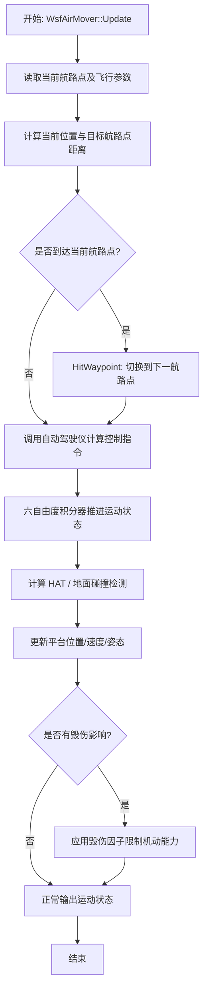

- **功能算法流程说明**：
  1. 读取当前航路点（位置、高度、速度要求）和飞行器当前状态。
  2. 计算当前位置与目标航路点的三维距离和方位。
  3. 判断是否到达当前航路点（距离 < 到达阈值）。
  4. 若到达：触发 HitWaypoint 事件，切换到 Route 中的下一个航路点或执行航路点关联动作。
  5. 若未到达：调用自动驾驶仪（Bank-To-Turn/Yaw-To-Turn PID 控制）计算滚转角/俯仰角/油门指令。
  6. 六自由度积分器（Heun 预测-校正法 + 四元数姿态）推进位置、速度、姿态。
  7. 计算离地高度（HAT）、检测地面碰撞。
  8. 若平台存在毁伤状态，应用毁伤因子（如最大速度衰减、机动能力下降）。
  9. 更新平台全局状态。

- **功能算法关键公式**：
  - **公式名称**：Heun 预测-校正积分（平动）
  - **公式描述**：对飞行器平动进行二阶精度时间推进

  $v_{predict} = v_0 + a_0 \cdot \Delta t$
  $x_{predict} = x_0 + v_0 \cdot \Delta t + \frac{1}{2} a_0 \cdot \Delta t^2$
  $a_1 = f(x_{predict}, v_{predict}, t_1)$
  $a_{avg} = \frac{a_0 + a_1}{2}$
  $v_1 = v_0 + a_{avg} \cdot \Delta t$
  $x_1 = x_0 + v_0 \cdot \Delta t + \frac{1}{2} a_{avg} \cdot \Delta t^2$

  - **公式符号解释**：其中，$v_0$ 表示当前速度，单位为 m/s；$x_0$ 表示当前位置，单位为 m；$a_0$ 表示当前加速度，单位为 m/s²；$\Delta t$ 表示积分步长，单位为 s；$a_{avg}$ 表示 Heun 平均加速度，单位为 m/s²。

- **功能输入**：

| 英文标识符 | 中文名称 | 数据类型 | 含义 | 单位 | 所属方法 |
| ----------- | -------- | -------- | ---- | ---- | -------- |
| waypoint_list | 航路点列表 | `vector<WsfWaypoint>` | 飞行路径的航路点序列（位置/高度/速度） | — | WsfRouteMover::AdvanceRoute |
| current_kinematic_state | 当前运动状态 | `KinematicState` | 位置/速度/姿态 DCM/角速率 | SI/Imperial | WsfAirMover::Update |
| delta_time | 时间步长 | `double` | 仿真帧时间步长 | s | WsfAirMover::Update |
| mass_properties | 质量属性 | `MassProperties` | 质量/质心/转动惯量 | kg, m, kg·m² | Integrator::Update |
| aero_forces | 气动力 | `UtVec3dX` | 体轴系气动六分量力 | N, N·m | Integrator::Update |
| thrust_forces | 推力 | `UtVec3dX` | 推进系统推力矢量 | N | Integrator::Update |

- **功能输出**：

| 英文标识符 | 中文名称 | 数据类型 | 含义 | 单位 | 所属方法 |
| ----------- | -------- | -------- | ---- | ---- | -------- |
| updated_kinematic_state | 更新后运动状态 | `KinematicState` | 更新后的位置/速度/姿态 DCM/角速率 | SI/Imperial | WsfAirMover::Update |
| hat | 离地高度 | `double` | Height Above Terrain | m | WsfAirMover::Update |
| ground_collision | 地面碰撞标志 | `bool` | 是否发生地面碰撞 | — | WsfAirMover::Update |
| damage_factor | 毁伤因子 | `double` | 机动能力衰减系数 [0,1] | — | WsfAirMover::Update |

- **功能配置**：

| 英文标识符 | 中文名称 | 数据类型 | 含义 | 单位 | 所属方法 |
| ----------- | -------- | -------- | ---- | ---- | -------- |
| cruise_speed | 巡航速度 | `double` | 航路点间巡航速度 | m/s 或 KTAS | WsfAirMover |
| max_speed | 最大速度 | `double` | 飞行器最大速度限制 | m/s | WsfAirMover |
| max_climb_rate | 最大爬升率 | `double` | 最大爬升速率 | m/s | WsfAirMover |
| takeoff_speed | 起飞速度 | `double` | 起飞离地速度 | m/s | WsfAirMover |
| landing_speed | 着陆速度 | `double` | 着陆接地速度 | m/s | WsfAirMover |
| waypoint_arrival_radius | 航路点到达半径 | `double` | 判断到达航路点的距离阈值 | m | WsfWaypointMover |

- **功能依赖**：

| 依赖类型 | 依赖名称 | 依赖路径 | 依赖说明 |
| -------- | -------- | -------- | -------- |
| 继承 | WsfWaypointMover | wsf/source/mover/WsfWaypointMover.hpp | 航路点管理基类 |
| 继承 | WsfRouteMover | wsf/source/mover/WsfRouteMover.hpp | 路径/航线管理基类 |
| 继承 | WsfMover | wsf/source/mover/WsfMover.hpp | 运动器抽象基类 |
| 组合 | Autopilot PID | wsf_six_dof/source/WsfSixDOF_CommonController.hpp | 自动驾驶仪 PID 控制器 |
| 组合 | 6-DOF Integrator | wsf_six_dof/source/WsfPointMassSixDOF_Integrator.hpp | 六自由度积分器 |
| 依赖 | WsfPlatform | wsf/source/WsfPlatform.hpp | 仿真平台宿主 |
| 依赖 | Damage Model | wsf_mil/source/weapon/WsfMobilityAndFirepowerLethality.hpp | 毁伤状态查询 |

- **功能非功能需求**：
  - **性能**：每仿真步长内完成航路点判断 + 飞行控制 + 六自由度积分，典型耗时 < 0.1ms。
  - **可移植性**：依赖 WSF 核心框架（C++14），平台相关代码封装在 UtScriptClass 层。
  - **多线程**：mover 更新在 simulation_loop 阶段由 WsfMultiThreadManager 调度并行执行。

- **功能参考证据**：
  - 参考覆盖度：✅ 完全覆盖（AFSIM 有完全参考实现）
  - AFSIM 源码功能索引证据：
    - 证据路径：`afsim-2_9/swdev/src/core/wsf/source/mover/WsfAirMover.hpp`
    - 证据函数名：`WsfAirMover` (class)
    - 证据行号：已在 function-index.jsonl 中索引
    - 证据功能摘要：空中平台运动器，继承 WsfWaypointMover → WsfRouteMover → WsfMover，支持航路点飞行、起飞、着陆、HAT 计算、地面碰撞检测、毁伤状态响应
  - AFSIM 算法卡片概览证据：
    - 证据路径：`docs/algorithms/flight-dynamics-pointmass-integrator-card.md`、`docs/algorithms/flight-dynamics-rigid-body-integrator-card.md`、`docs/algorithms/flight-dynamics-autopilot-pid-card.md`
    - 证据名称：PointMass Heun 积分器、刚体 Heun 积分器、自动驾驶仪 PID 嵌套回路控制
    - 证据摘要：Heun 预测-校正法推进六自由度运动；PID 三通道嵌套回路（垂直/横向/速度）支持增益调度和抗积分饱和
  - AFSIM 使用文档目录证据：
    - 证据路径：`demos/kinematic_mover/`、`demos/air_to_air/`
    - 证据名称：kinematic_mover demo、air_to_air demo
    - 证据摘要：运动学 mover 演示含航路点跟随和空中机动示例；空对空作战演示含飞行器运动

---

### 2. 陆上机动

- **功能描述**：地面车辆沿航路点在地表运动，考虑地形高度约束、地面速度限制，支持毁伤状态影响。
- **功能所属系统**：机动组件 (Mobility Component)
- **功能所属模块**：wsf_mil (MIL-STD 仿真扩展)
- **功能所属类级**：`WsfGroundMover` → `WsfWaypointMover` → `WsfRouteMover` → `WsfMover`
- **功能所属方法**：`WsfGroundMover::Update`（状态更新）、`WsfWaypointMover::HitWaypoint`（航路点到达）

- **功能算法流程图**：

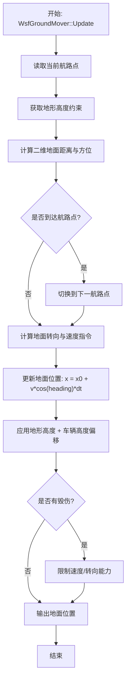

- **功能算法流程说明**：
  1. 读取当前航路点和地面车辆运动参数。
  2. 从地形数据获取当前位置和目标位置的地表高度。
  3. 计算二维水平面距离和方位角（不考虑高度维度，地面运动仅限于地表）。
  4. 到达判断：若距离 < 航路点到达半径，切换到下一航路点。
  5. 转向控制：计算目标方位角与当前航向角的偏差，以最大转弯速率驱动。
  6. 速度控制：以加速度/减速度平滑过渡到目标速度。
  7. 位置更新：$x_1 = x_0 + v \cdot \cos(\psi) \cdot \Delta t$, $y_1 = y_0 + v \cdot \sin(\psi) \cdot \Delta t$。
  8. 高度约束：$z = z_{terrain} + z_{vehicle\_offset}$。
  9. 毁伤影响：降低最大速度、最大转弯速率。

- **功能输入**：

| 英文标识符 | 中文名称 | 数据类型 | 含义 | 单位 | 所属方法 |
| ----------- | -------- | -------- | ---- | ---- | -------- |
| waypoint_list | 航路点列表 | `vector<WsfWaypoint>` | 地面路径航路点序列 | — | WsfRouteMover |
| current_position | 当前位置 | `UtVec3dX` | 当前 WCS 坐标 | m | WsfGroundMover::Update |
| current_heading | 当前航向 | `double` | 当前地面航向角 | rad | WsfGroundMover::Update |
| current_speed | 当前地面速度 | `double` | 当前地面速率 | m/s | WsfGroundMover::Update |
| terrain_elevation | 地形高程 | `double` | 当前位置地形高度 | m | WsfGroundMover::Update |

- **功能输出**：

| 英文标识符 | 中文名称 | 数据类型 | 含义 | 单位 | 所属方法 |
| ----------- | -------- | -------- | ---- | ---- | -------- |
| new_position | 新位置 | `UtVec3dX` | 更新后的 WCS 地面位置 | m | WsfGroundMover::Update |
| new_heading | 新航向 | `double` | 更新后的地面航向角 | rad | WsfGroundMover::Update |
| new_speed | 新速度 | `double` | 更新后的地面速率 | m/s | WsfGroundMover::Update |

- **功能配置**：

| 英文标识符 | 中文名称 | 数据类型 | 含义 | 单位 | 所属方法 |
| ----------- | -------- | -------- | ---- | ---- | -------- |
| max_ground_speed | 最大地面速度 | `double` | 最大行驶速率 | m/s | WsfGroundMover |
| acceleration | 加速度 | `double` | 直线加速度 | m/s² | WsfGroundMover |
| deceleration | 减速度 | `double` | 减速/制动能力 | m/s² | WsfGroundMover |
| max_turn_rate | 最大转弯率 | `double` | 最大转向角速率 | deg/s | WsfGroundMover |
| vehicle_height_offset | 车辆高度偏移 | `double` | 车体在地表以上的高度 | m | WsfGroundMover |

- **功能依赖**：

| 依赖类型 | 依赖名称 | 依赖路径 | 依赖说明 |
| -------- | -------- | -------- | -------- |
| 继承 | WsfWaypointMover | wsf/source/mover/WsfWaypointMover.hpp | 航路点管理 |
| 继承 | WsfRouteMover | wsf/source/mover/WsfRouteMover.hpp | 路径管理 |
| 继承 | WsfMover | wsf/source/mover/WsfMover.hpp | 运动器基类 |
| 依赖 | WsfPlatform | wsf/source/WsfPlatform.hpp | 仿真平台 |

- **功能非功能需求**：同空中机动。

- **功能参考证据**：
  - 参考覆盖度：✅ 完全覆盖
  - AFSIM 源码功能索引证据：
    - 证据路径：`afsim-2_9/swdev/src/core/wsf/source/mover/WsfGroundMover.hpp`
    - 证据函数名：`WsfGroundMover` (class)
    - 证据行号：已在 function-index.jsonl 中索引（line 505, 10208-10214）
    - 证据功能摘要：地面平台运动器，继承 WsfWaypointMover → WsfRouteMover → WsfMover，提供地面航路点运动、地形跟随和毁伤响应
  - AFSIM 使用文档目录证据：
    - 证据路径：`demos/kinematic_mover/`
    - 证据名称：kinematic_mover demo
    - 证据摘要：地面 movers 的地面运动演示

---

### 3. 导弹机动

- **功能描述**：导弹/制导弹药在三维空域中的制导飞行，支持预编程弹道、比例导引、弹道导弹轨迹等运动模式。
- **功能所属系统**：机动组件 (Mobility Component)
- **功能所属模块**：wsf_mil (MIL-STD 仿真扩展)
- **功能所属类级**：`WsfGuidedMover` → `WsfGuidedMoverBase`。弹道变体：`WsfTBM_Mover`（弹道导弹）、`WsfParabolicMover`（抛物线弹道）、`WsfStraightLineMover`（直线运动）
- **功能所属方法**：`WsfGuidedMover::Update`、`WsfGuidedMover::UpdateGuidance`

- **功能算法流程图**：

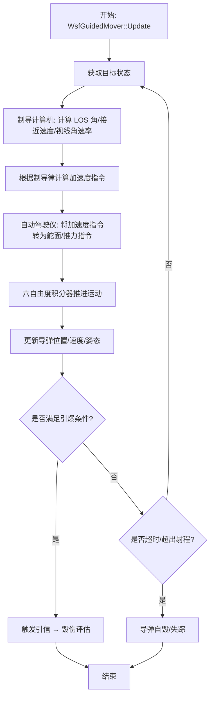

- **功能算法流程说明**：
  1. 从目标跟踪数据获取目标当前状态（位置、速度）。
  2. 制导计算机计算：视线角（LOS angle）、接近速度（closing velocity）、视线角速率（LOS rate）。
  3. 根据配置的制导律（比例导引 PN / 增广比例导引 APN / 纯追踪等）计算所需横向加速度 $a_{cmd} = N \cdot V_c \cdot \dot{\lambda}$。
  4. 自动驾驶仪将加速度指令转换为操纵面偏转和推力调节。
  5. 六自由度积分器（PointMass Heun 积分器）推进运动状态。
  6. 引信判断：若目标进入杀伤半径/触发距离，引爆战斗部。
  7. 超时/射程边界检查。

- **功能算法关键公式**：
  - **公式名称**：比例导引律（Proportional Navigation）
  - **公式描述**：导弹横向加速度指令

  $a_{cmd} = N \cdot V_c \cdot \dot{\lambda}$

  - **公式符号解释**：其中，$a_{cmd}$ 表示指令横向加速度，单位为 m/s²；$N$ 表示导航比（通常 3~5），无量纲；$V_c$ 表示弹目接近速度，单位为 m/s；$\dot{\lambda}$ 表示视线角速率，单位为 rad/s。

- **功能输入**：

| 英文标识符 | 中文名称 | 数据类型 | 含义 | 单位 | 所属方法 |
| ----------- | -------- | -------- | ---- | ---- | -------- |
| target_state | 目标状态 | `TrackState` | 目标位置/速度 | m, m/s | WsfGuidedMover::Update |
| guidance_law | 制导律 | `GuidanceLaw` | 制导律类型及参数 | — | WsfGuidedMover |
| missile_kinematic_state | 导弹运动状态 | `KinematicState` | 当前导弹位置/速度/姿态 | SI | WsfGuidedMover::Update |
| stage_config | 分级配置 | `StageConfig` | 多级火箭各级参数 | — | WsfGuidedMover |

- **功能输出**：

| 英文标识符 | 中文名称 | 数据类型 | 含义 | 单位 | 所属方法 |
| ----------- | -------- | -------- | ---- | ---- | -------- |
| updated_missile_state | 更新后导弹状态 | `KinematicState` | 更新后位置/速度/姿态 | SI | WsfGuidedMover::Update |
| acceleration_command | 加速度指令 | `UtVec3dX` | 制导加速度指令 | m/s² | WsfGuidedMover::UpdateGuidance |
| fuze_trigger | 引信触发标志 | `bool` | 是否满足引爆条件 | — | WsfWeaponFuse |

- **功能配置**：

| 英文标识符 | 中文名称 | 数据类型 | 含义 | 单位 | 所属方法 |
| ----------- | -------- | -------- | ---- | ---- | -------- |
| navigation_ratio | 导航比 N | `double` | 比例导引导航常数 | — | WsfGuidedMover |
| max_acceleration | 最大加速度 | `double` | 导弹横向加速度限制 | g | WsfGuidedMover |
| max_range | 最大射程 | `double` | 导弹最大飞行距离 | m | WsfGuidedMover |
| flight_time_limit | 飞行时间限制 | `double` | 最大飞行时间 | s | WsfGuidedMover |
| fuze_proximity_radius | 近炸半径 | `double` | 近炸引信触发距离 | m | WsfWeaponFuse |

- **功能依赖**：

| 依赖类型 | 依赖名称 | 依赖路径 | 依赖说明 |
| -------- | -------- | -------- | -------- |
| 继承 | WsfGuidedMoverBase | wsf_mil/source/mover/WsfGuidedMover.hpp | 制导运动器基类 |
| 组合 | WsfGuidanceComputer | wsf_mil/source/weapon/WsfGuidanceComputer.hpp | 制导律计算 |
| 组合 | WsfWeaponFuse | wsf_mil/source/weapon/WsfWeaponFuse.hpp | 引信触发判断 |
| 组合 | 6-DOF Integrator | wsf_six_dof/source/ | 运动积分器 |
| 依赖 | WsfWeaponComponent | wsf_mil/source/weapon/WsfWeaponComponent.hpp | 武器组件接口 |

- **功能非功能需求**：
  - **性能**：制导律计算 + 运动积分每步 < 0.05ms。
  - **精度**：比例导引视线角速率计算需满足弹道末端精度要求。

- **功能参考证据**：
  - 参考覆盖度：✅ 完全覆盖
  - AFSIM 源码功能索引证据：
    - 证据路径：`afsim-2_9/swdev/src/core/wsf_mil/source/mover/WsfGuidedMover.hpp`
    - 证据函数名：`WsfGuidedMover` (class)、`WsfTBM_Mover`、`WsfParabolicMover`
    - 证据行号：已在 function-index.jsonl 中索引
    - 证据功能摘要：制导武器运动器，支持多种制导律（比例导引等）、多级火箭分级、弹道导弹轨迹
  - AFSIM 算法卡片概览证据：
    - 证据路径：`docs/algorithms/flight-dynamics-pointmass-integrator-card.md`、`docs/algorithms/space-rocket-staging-card.md`
    - 证据名称：PointMass Heun 积分器、多级火箭齐奥尔科夫斯基方程
    - 证据摘要：点质模型六自由度时间推进；多级火箭推力/ΔV/燃耗管理
  - AFSIM 使用文档目录证据：
    - 证据路径：`demos/ballistic/`、`demos/ballistic_missile_shootdown/`
    - 证据名称：ballistic demo、ballistic missile shootdown demo
    - 证据摘要：弹道导弹轨迹演示和拦截场景

---

### 4. 可见光探测

- **功能描述**：利用可见光/红外（EO/IR）传感器探测目标，受大气衰减、光学路径、目标对比度等因素影响。
- **功能所属系统**：探测组件 (Detection Component)
- **功能所属模块**：wsf_mil (MIL-STD 仿真扩展)
- **功能所属类级**：`WsfEOIR_Sensor` (with `EOIR_Mode`, `EOIR_ErrorModel`, `EOIR_SensorScheduler`)；`WsfOpticalSensor` (with `OpticalMode`)；`WsfIRST_Sensor` (红外搜索跟踪)
- **功能所属方法**：`WsfEOIR_Sensor::Update`、`EOIR_Mode::Detect`

- **功能算法流程图**：

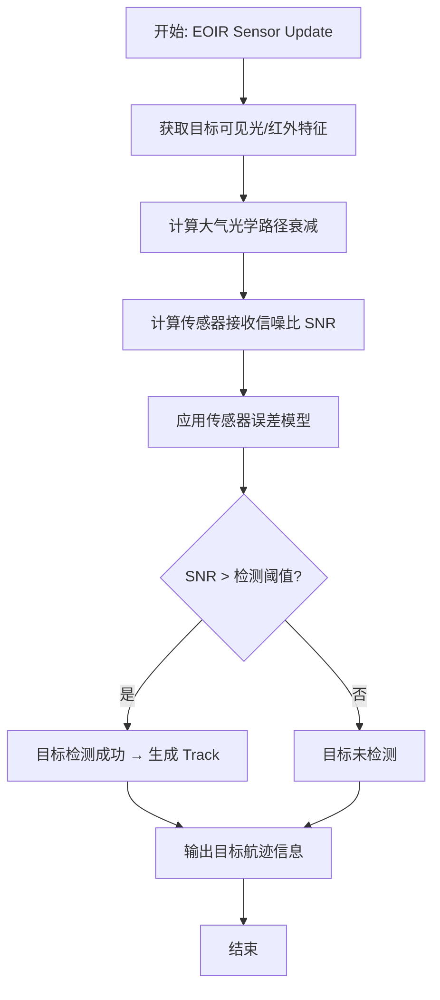

- **功能算法流程说明**：
  1. 获取目标的可见光/红外信号特征（`WsfOpticalSignature`/`WsfInfraredSignature`）。
  2. 计算光学路径衰减（大气透过率、湍流扩展等）。
  3. 传感器信噪比计算：$SNR = \frac{P_{signal}}{NEP}$，其中 NEP 为噪声等效功率。
  4. 应用传感器误差模型（`EOIR_ErrorModel`：角度噪声、距离噪声）。
  5. SNR 阈值判断 → 检测成功/失败。
  6. 注意：AFSIM 中 EO/IR 传感器不自动切换可见光/红外/微光模式，该功能需手动配置或脚本扩展。

- **功能输入**：

| 英文标识符 | 中文名称 | 数据类型 | 含义 | 单位 | 所属方法 |
| ----------- | -------- | -------- | ---- | ---- | -------- |
| target_optical_signature | 目标光学特征 | `WsfOpticalSignature` | 目标的可见光/红外辐射强度 | W/sr | EOIR_Mode::Detect |
| atmospheric_attenuation | 大气衰减 | `double` | 光学路径的大气透过率 | — | WsfOpticalPath |
| sensor_position | 传感器位置 | `UtVec3dX` | 传感器 WCS 位置 | m | EOIR_Mode |
| sensor_orientation | 传感器指向 | `UtDcm3dX` | 传感器视轴方向余弦矩阵 | — | EOIR_Mode |

- **功能输出**：

| 英文标识符 | 中文名称 | 数据类型 | 含义 | 单位 | 所属方法 |
| ----------- | -------- | -------- | ---- | ---- | -------- |
| detection_result | 检测结果 | `DetectionResult` | 是否检测到目标及含误差的测量值 | — | EOIR_Mode::Detect |
| track_report | 航迹报告 | `TrackReport` | 目标航迹信息（角度/距离估计） | deg, m | WsfEOIR_Sensor |

- **功能配置**：

| 英文标识符 | 中文名称 | 数据类型 | 含义 | 单位 | 所属方法 |
| ----------- | -------- | -------- | ---- | ---- | -------- |
| fov_azimuth | 方位视场角 | `double` | 水平方向视场角 | deg | EOIR_Mode |
| fov_elevation | 俯仰视场角 | `double` | 垂直方向视场角 | deg | EOIR_Mode |
| detection_threshold | 检测阈值 | `double` | 最小可检测 SNR | dB | EOIR_Mode |
| max_detection_range | 最大探测距离 | `double` | 传感器最大探测距离 | m | EOIR_Mode |
| wavelength_band | 工作波段 | `enum` | 可见光/中波红外/长波红外 | μm | EOIR_Mode |

- **功能依赖**：

| 依赖类型 | 依赖名称 | 依赖路径 | 依赖说明 |
| -------- | -------- | -------- | -------- |
| 组合 | EOIR_ErrorModel | wsf_mil/source/sensor/WsfEOIR_Sensor.hpp | 传感器误差模型 |
| 组合 | EOIR_SensorScheduler | wsf_mil/source/sensor/WsfEOIR_Sensor.hpp | 传感器扫描调度 |
| 依赖 | WsfOpticalSignature | wsf_mil/source/sensor/WsfOpticalSignature.hpp | 目标光学特征 |
| 依赖 | WsfOpticalPath | wsf_mil/source/sensor/WsfOpticalPath.hpp | 光学传播路径 |
| 依赖 | WsfPlatform | wsf/source/WsfPlatform.hpp | 平台宿主 |

- **功能非功能需求**：
  - **精度**：大气模型精度受限于内置的简单衰减模型（CN2 湍流），不包含 MODTRAN 级详细大气传输。
  - **局限性**：无多模式自动切换（可见光 ↔ 红外 ↔ 微光），需脚本扩展实现。

- **功能参考证据**：
  - 参考覆盖度：⚠️ 部分覆盖（AFSIM 有 EO/IR 传感器框架但缺少多模式自动切换机制）
  - AFSIM 源码功能索引证据：
    - 证据路径：`afsim-2_9/swdev/src/core/wsf_mil/source/sensor/WsfEOIR_Sensor.hpp`
    - 证据函数名：`WsfEOIR_Sensor` (class)、`EOIR_Mode`、`EOIR_ErrorModel`
    - 证据行号：已在 function-index.jsonl 中索引
    - 证据功能摘要：EO/IR 传感器框架，含探测模式、误差模型、传感器调度器，但可见光/红外切换需手动配置
  - AFSIM 使用文档目录证据：
    - 证据路径：`demos/base_types/`
    - 证据名称：base_types demo
    - 证据摘要：基础传感器类型演示，包含 EO/IR 传感器配置示例

---

### 5. 雷达探测

- **功能描述**：利用主动/被动雷达传感器探测目标，支持多种雷达体制（脉冲多普勒、MTI、OTH、ESM等），包含信号处理链路和误差模型。
- **功能所属系统**：探测组件 (Detection Component)
- **功能所属模块**：wsf_mil (MIL-STD 仿真扩展) + wsf_nx (电子战扩展)
- **功能所属类级**：`WsfRadarSensor` → `RadarMode`。变体：`WsfOTH_RadarSensor`、`WsfSurfaceWaveRadarSensor`、`WsfESM_Sensor`（无源探测）、`WsfTRIMSIM_SensorComponent`
- **功能所属方法**：`WsfRadarSensor::Update`、`RadarMode::Detect`、`WsfRadarPD_SignalProcessor::Process`

- **功能算法流程图**：

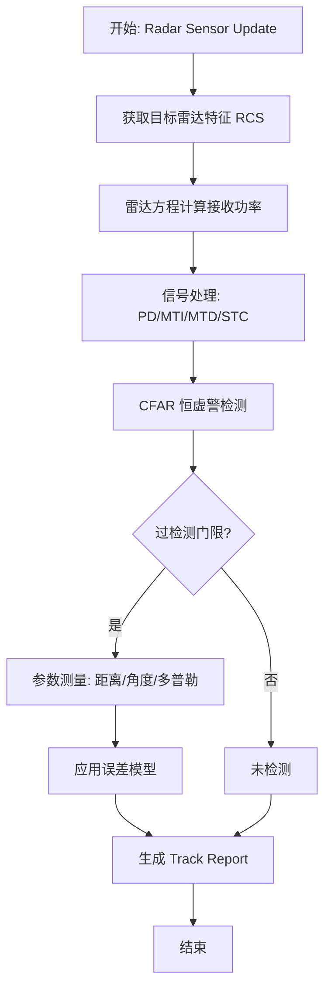

- **功能算法流程说明**：
  1. 读取目标雷达散射截面（RCS），考虑方向性（`WsfMilRadarSignature`）。
  2. 应用雷达距离方程：$P_r = \frac{P_t G_t G_r \lambda^2 \sigma}{(4\pi)^3 R^4 L}$。
  3. 信号处理链路：脉冲多普勒（PD）/ 动目标显示（MTI）/ 动目标检测（MTD）/ 灵敏度时间控制（STC）。
  4. CFAR 恒虚警率检测：自适应门限计算。
  5. 参数测量：距离（时延）、角度（波束指向/单脉冲）、径向速度（多普勒频移）。
  6. 应用 `BistaticErrorModel` / `SensorErrorModel` 添加测量噪声。
  7. 生成目标航迹报告（Track Report）。

- **功能算法关键公式**：
  - **公式名称**：雷达距离方程
  - **公式描述**：计算雷达接收功率

  $P_r = \frac{P_t \cdot G_t \cdot G_r \cdot \lambda^2 \cdot \sigma}{(4\pi)^3 \cdot R^4 \cdot L}$

  - **公式符号解释**：其中，$P_r$ 表示接收功率，单位为 W；$P_t$ 表示发射功率，单位为 W；$G_t$/$G_r$ 表示发射/接收天线增益，无量纲；$\lambda$ 表示波长，单位为 m；$\sigma$ 表示目标 RCS，单位为 m²；$R$ 表示目标距离，单位为 m；$L$ 表示系统损耗因子，无量纲。

- **功能输入**：

| 英文标识符 | 中文名称 | 数据类型 | 含义 | 单位 | 所属方法 |
| ----------- | -------- | -------- | ---- | ---- | -------- |
| target_rcs | 目标 RCS | `double` | 目标雷达散射截面 | m² 或 dBsm | RadarMode::Detect |
| target_position | 目标位置 | `UtVec3dX` | 目标 WCS 位置 | m | RadarMode::Detect |
| radar_platform_state | 雷达平台状态 | `PlatformState` | 雷达平台位置/速度/姿态 | m, m/s | WsfRadarSensor::Update |

- **功能输出**：

| 英文标识符 | 中文名称 | 数据类型 | 含义 | 单位 | 所属方法 |
| ----------- | -------- | -------- | ---- | ---- | -------- |
| detection_report | 检测报告 | `DetectionReport` | 含测量值和误差的目标检测报告 | m, deg, m/s | WsfRadarSensor::Update |
| track_report | 航迹报告 | `TrackReport` | 目标航迹更新（关联后的） | — | WsfRadarSensor |
| signal_metrics | 信号指标 | `SignalMetrics` | SNR/检测概率/虚警概率 | dB, — | RadarMode |

- **功能配置**：

| 英文标识符 | 中文名称 | 数据类型 | 含义 | 单位 | 所属方法 |
| ----------- | -------- | -------- | ---- | ---- | -------- |
| tx_power | 发射功率 | `double` | 雷达发射机峰值功率 | W | RadarMode |
| antenna_gain | 天线增益 | `double` | 天线主瓣增益 | dBi | RadarMode |
| frequency | 工作频率 | `double` | 雷达载波频率 | Hz | RadarMode |
| pulse_width | 脉冲宽度 | `double` | 发射脉冲宽度 | s | RadarMode |
| prf | 脉冲重复频率 | `double` | 脉冲重复频率 | Hz | RadarMode |
| noise_figure | 噪声系数 | `double` | 接收机噪声系数 | dB | RadarMode |
| detection_pd | 检测概率要求 | `double` | 期望检测概率 P_d | — | RadarMode |
| false_alarm_rate | 虚警率 | `double` | 允许的虚警概率 P_fa | — | RadarMode |

- **功能依赖**：

| 依赖类型 | 依赖名称 | 依赖路径 | 依赖说明 |
| -------- | -------- | -------- | -------- |
| 组合 | BistaticErrorModel | wsf_mil/source/sensor/ | 双基地雷达误差模型 |
| 组合 | WsfRadarPD_SignalProcessor | wsf_nx/source/ | PD 信号处理器 |
| 组合 | WsfRadarMTI_SignalProcessor | wsf_nx/source/ | MTI 信号处理器 |
| 依赖 | WsfMilRadarSignature | wsf_mil/source/ | 目标 RCS 特征 |
| 依赖 | WsfPlatform | wsf/source/WsfPlatform.hpp | 平台宿主 |

- **功能非功能需求**：
  - **计算性能**：雷达信号处理链路较为复杂，多目标场景需优化调度。

- **功能参考证据**：
  - 参考覆盖度：✅ 完全覆盖
  - AFSIM 源码功能索引证据：
    - 证据路径：`afsim-2_9/swdev/src/core/wsf_mil/source/sensor/WsfRadarSensor.hpp`
    - 证据函数名：`WsfRadarSensor` (class)、`RadarMode`、`BistaticErrorModel`
    - 证据行号：已在 function-index.jsonl 中索引
    - 证据功能摘要：完整雷达传感器体系，支持多种雷达体制、信号处理链路、误差模型和无源 ESM 探测
  - AFSIM 使用文档目录证据：
    - 证据路径：`demos/base_types/`、`demos/iads/`
    - 证据名称：base_types demo、IADS demo
    - 证据摘要：基础传感器配置演示；IADS 含多雷达组网探测场景

---

### 6. 惯性导航

- **功能描述**：利用惯性测量单元（IMU）数据通过积分计算平台的姿态、速度和位置，不依赖外部信号。
- **功能所属系统**：探测组件 (Detection Component)
- **功能所属模块**：无独立 INS 模块
- **功能所属类级**：🆕 无对应类
- **功能所属方法**：🆕 无对应方法

- **功能算法流程图**：

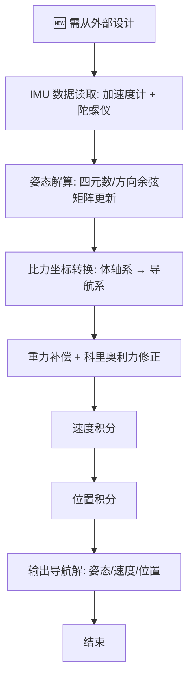

- **功能算法流程说明**：
  AFSIM 中无独立 INS 导航组件。平台的位置和姿态跟踪由各 mover 的内部积分器直接完成（如 PointMass Heun 积分器的第 5/8 步），不通过独立的惯性导航解算流程。这意味着：
  - 惯性传感器误差累积（陀螺漂移、加速度计零偏）未被建模。
  - 无 INS/GPS 组合导航或 Kalman 滤波融合。
  - 若需独立 INS 功能，需参考外部惯性导航文献设计。

- **功能算法关键公式**：
  - **公式名称**：捷联惯导速度更新方程
  - **公式描述**：导航系下速度微分方程

  $\dot{v}^n = C_b^n \cdot f^b - (2\omega_{ie}^n + \omega_{en}^n) \times v^n + g^n$

  - **公式符号解释**：其中，$\dot{v}^n$ 表示导航系下速度导数，单位为 m/s²；$C_b^n$ 表示体轴系到导航系的姿态矩阵，无量纲；$f^b$ 表示加速度计测量的比力，单位为 m/s²；$\omega_{ie}^n$ 表示地球自转角速度在导航系下的投影，单位为 rad/s；$\omega_{en}^n$ 表示导航系相对地球系的转动角速率，单位为 rad/s；$g^n$ 表示当地重力加速度矢量，单位为 m/s²。

- **功能参考证据**：
  - 参考覆盖度：🆕 缺失（AFSIM 无独立 INS 组件）
  - AFSIM 源码功能索引证据：
    - 证据路径：无
    - 证据函数名：无
    - 证据行号：无
    - 证据功能摘要：AFSIM 中位置/姿态由各 mover 积分器直接计算，无独立 INS 模块。需从外部惯性导航教材/文献中获取设计依据。
  - 说明：此功能的算法流程需从领域文献或算法教材中寻找设计依据，不可依赖 AFSIM 源码。

---

### 7. 自杀攻击

- **功能描述**：无人机/巡飞弹以自身为战斗部撞击目标，在撞击瞬间引爆，实现一次性杀伤。
- **功能所属系统**：火力组件 (Firepower Component)
- **功能所属模块**：wsf_mil (MIL-STD 仿真扩展)
- **功能所属类级**：可组合实现：`WsfGuidedMover`（制导飞行）+ `WsfMobilityAndFirepowerLethality`（杀伤评估）+ `WsfAirTargetFuse`/`WsfGroundTargetFuse`（触发/近炸引信）
- **功能所属方法**：`WsfWeaponFuse::Evaluate`、`WsfMobilityAndFirepowerLethality::Detonate`

- **功能算法流程图**：

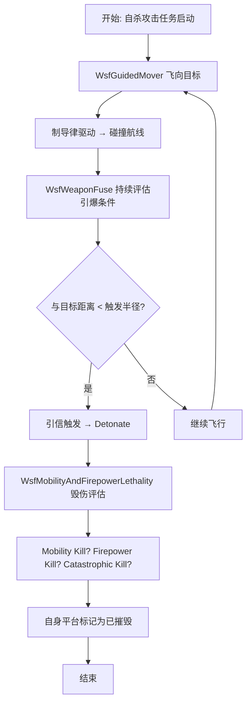

- **功能算法流程说明**：
  1. 自杀攻击无人机由 `WsfGuidedMover` 采用碰撞航线（零脱靶量）制导。
  2. 引信 (`WsfWeaponFuse` / `WsfAirTargetFuse`) 持续计算与目标的距离。
  3. 当距离 < 触发半径（接触/近炸）时引信动作。
  4. `WsfMobilityAndFirepowerLethality::Detonate` 评估毁伤效果。
  5. 自身平台被标记为 Killed（`WeaponKilled` 事件）。
  6. ⚠️ AFSIM 无专用"自杀无人机"类，需从制导武器 + 特殊引信配置组合实现。

- **功能参考证据**：
  - 参考覆盖度：⚠️ 部分覆盖（AFSIM 可组合现有组件实现但无专用类）
  - AFSIM 源码功能索引证据：
    - 证据路径：`afsim-2_9/swdev/src/core/wsf_mil/source/mover/WsfGuidedMover.hpp`、`afsim-2_9/swdev/src/core/wsf_mil/source/weapon/WsfMobilityAndFirepowerLethality.hpp`
    - 证据函数名：`WsfGuidedMover`、`WsfMobilityAndFirepowerLethality`、`WsfWeaponFuse`
    - 证据行号：已在 function-index.jsonl 中索引
    - 证据功能摘要：可通过制导运动器 + 碰撞引信 + 杀伤模型组合实现自杀攻击逻辑，但无专用"自杀无人机"类

---

### 8. 导弹火力

- **功能描述**：导弹对目标进行火力打击，包含目标分配、发射决策、制导飞行、引信引爆、毁伤评估全过程。
- **功能所属系统**：火力组件 (Firepower Component)
- **功能所属模块**：wsf_mil (MIL-STD 仿真扩展)
- **功能所属类级**：`WsfWeaponComponent` → `WsfImplicitWeapon`/`WsfExplicitWeapon`；杀伤模型：`WsfSphericalLethality`/`WsfTabulatedLethality`/`WsfGraduatedLethality`/`WsfCarltonLethality`/`WsfMobilityAndFirepowerLethality`
- **功能所属方法**：`WsfWeaponComponent::TurnOn`/`TurnOff`、`WsfImplicitWeapon::Engage`、`WeaponFired`/`WeaponHit`/`WeaponKilled` 事件

- **功能算法流程图**：

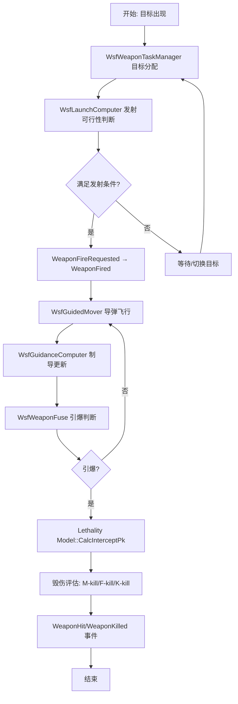

- **功能算法流程说明**：
  1. 武器任务管理器 (`WsfWeaponTaskManager`) 进行目标-武器配对（量子分配矩阵）。
  2. 发射计算机 (`WsfLaunchComputer`) 评估发射可行性：目标是否在射程内、是否有射击解。
  3. 满足条件 → `WeaponFireRequested` → `WeaponFired` 事件。
  4. `WsfGuidedMover` 推进导弹飞行（参见"导弹机动"）。
  5. `WsfGuidanceComputer` 每步更新制导指令（参见"导弹机动"）。
  6. `WsfWeaponFuse` 评估引爆条件（距离/高度/时间）。
  7. 杀伤模型 (`CalcInterceptPk`) 计算毁伤概率 Pk。
  8. 根据 Pk 和随机抽样确定毁伤等级（M-kill 机动毁伤 / F-kill 火力毁伤 / K-kill 灾难性摧毁）。
  9. 发送 `WeaponHit`（命中）或 `WeaponMissed`（脱靶）事件。

- **功能算法关键公式**：
  - **公式名称**：球形杀伤概率
  - **公式描述**：WsfSphericalLethality 的 Pk 计算

  $P_k(R) = \begin{cases} P_{k,max} & R \le R_{kill} \\ P_{k,max} \cdot \frac{R_{max} - R}{R_{max} - R_{kill}} & R_{kill} < R \le R_{max} \\ 0 & R > R_{max} \end{cases}$

  - **公式符号解释**：其中，$P_k(R)$ 表示距离 R 处的毁伤概率；$P_{k,max}$ 表示最大毁伤概率；$R_{kill}$ 表示确保杀伤半径，单位为 m；$R_{max}$ 表示最大杀伤半径，单位为 m。

- **功能输入**：

| 英文标识符 | 中文名称 | 数据类型 | 含义 | 单位 | 所属方法 |
| ----------- | -------- | -------- | ---- | ---- | -------- |
| target_type | 目标类型 | `TargetType` | 目标类别/型号 | — | WsfLaunchComputer |
| target_state | 目标状态 | `TrackState` | 目标位置/速度 | m, m/s | WsfWeaponTaskManager |
| weapon_config | 武器配置 | `WeaponConfig` | 导弹型号/战斗部/引信参数 | — | WsfWeaponComponent |

- **功能输出**：

| 英文标识符 | 中文名称 | 数据类型 | 含义 | 单位 | 所属方法 |
| ----------- | -------- | -------- | ---- | ---- | -------- |
| pk_result | 毁伤概率 | `double` | 计算得到的毁伤概率 | — | Lethality::CalcInterceptPk |
| kill_assessment | 毁伤评估 | `KillAssessment` | M-kill/F-kill/K-kill/未命中 | — | WeaponHit/WeaponKilled |
| weapon_event | 武器事件 | `WeaponEvent` | 发射/命中/杀伤/脱靶事件 | — | WsfMilEventResults |

- **功能配置**：

| 英文标识符 | 中文名称 | 数据类型 | 含义 | 单位 | 所属方法 |
| ----------- | -------- | -------- | ---- | ---- | -------- |
| warhead_type | 战斗部类型 | `enum` | 高爆/破片/穿甲/子母等 | — | WsfWeaponComponent |
| lethal_radius | 杀伤半径 | `double` | 球形杀伤模型杀伤半径 | m | WsfSphericalLethality |
| pk_table | 毁伤概率表 | `Table` | 距离/角度 → Pk 查表 | — | WsfTabulatedLethality |
| fuze_type | 引信类型 | `enum` | 触发/近炸/时间/高度 | — | WsfWeaponFuse |

- **功能依赖**：

| 依赖类型 | 依赖名称 | 依赖路径 | 依赖说明 |
| -------- | -------- | -------- | -------- |
| 组合 | WsfLaunchComputer | wsf_mil/source/weapon/ | 发射计算机 |
| 组合 | WsfGuidedMover | wsf_mil/source/mover/ | 导弹运动器 |
| 组合 | WsfGuidanceComputer | wsf_mil/source/weapon/ | 制导计算机 |
| 组合 | WsfWeaponFuse | wsf_mil/source/weapon/ | 引信 |
| 组合 | Lethality Model | wsf_mil/source/weapon/ | 杀伤模型（多选一） |
| 依赖 | WsfWeaponTaskManager | wsf_mil/source/weapon/ | 武器任务管理 |

- **功能非功能需求**：导弹飞行轨迹计算精度需满足末端脱靶量评估要求。

- **功能参考证据**：
  - 参考覆盖度：✅ 完全覆盖
  - AFSIM 源码功能索引证据：
    - 证据路径：`afsim-2_9/swdev/src/core/wsf_mil/source/weapon/WsfImplicitWeapon.hpp`、`WsfExplicitWeapon.hpp`、`WsfSphericalLethality.hpp`、`WsfMobilityAndFirepowerLethality.hpp`
    - 证据函数名：`WsfImplicitWeapon`、`WsfExplicitWeapon`、`WsfSphericalLethality`、`WsfMobilityAndFirepowerLethality`
    - 证据行号：已在 function-index.jsonl 中索引
    - 证据功能摘要：完整导弹火力链：任务分配 → 发射决策 → 制导飞行 → 引信引爆 → 毁伤评估（多级杀伤 + 对抗措施）
  - AFSIM 使用文档目录证据：
    - 证据路径：`demos/air_to_air/`、`demos/ballistic/`
    - 证据名称：air_to_air demo、ballistic demo
    - 证据摘要：空战导弹交战演示、弹道导弹攻防演示

---

### 9. 制导武器发射

- **功能描述**：发射平台对制导武器的发射管理，包括目标分配、发射可行性判断、发射决策、交班数据生成。
- **功能所属系统**：火力组件 (Firepower Component)
- **功能所属模块**：wsf_mil (MIL-STD 仿真扩展)
- **功能所属类级**：`WsfLaunchComputer`（基类）→ `WsfAirToAirLaunchComputer` / `WsfSAM_LaunchComputer` / `WsfBallisticMissileLaunchComputer` / `WsfTabularLaunchComputer` / `WsfATG_LaunchComputer` / `WsfOrbitalLaunchComputer`
- **功能所属方法**：`WsfLaunchComputer::ProcessInput`、`WsfAirToAirLaunchComputer::ProcessInput`

- **功能算法流程图**：

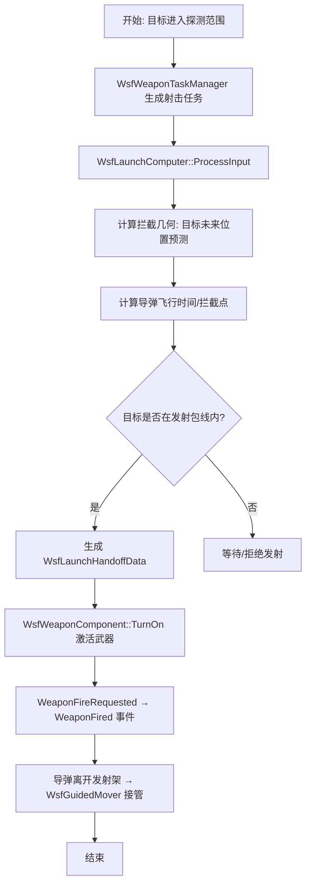

- **功能算法流程说明**：
  1. 武器任务管理器 (`WsfWeaponTaskManager`) 进行目标-武器量子分配。
  2. 发射计算机 (`WsfLaunchComputer`) 接收目标跟踪数据。
  3. 拦截几何计算：预测目标未来位置（外推时间 = 导弹飞行时间）。
  4. 导弹飞行时间估算：基于导弹速度和目标距离。
  5. 发射包线判断：目标是否在最大/最小射程内，是否在可用过载范围内。
  6. 满足条件 → 生成交班数据 (`WsfLaunchHandoffData`)：目标状态、预测拦截点、中制导参考。
  7. 武器激活 → 发射事件 → 导弹飞行由 `WsfGuidedMover` 接管。
  8. 对于 EE发射车：`WsfSAM_LaunchComputer`（地对空）或 `WsfTabularLaunchComputer`（查表发射）。

- **功能输入**：

| 英文标识符 | 中文名称 | 数据类型 | 含义 | 单位 | 所属方法 |
| ----------- | -------- | -------- | ---- | ---- | -------- |
| target_track | 目标航迹 | `TrackState` | 目标当前位置/速度/加速度 | m, m/s | WsfLaunchComputer::ProcessInput |
| launcher_state | 发射架状态 | `LauncherState` | 发射架方位/俯仰/装弹状态 | deg | WsfLaunchComputer |
| weapon_inventory | 武器库存 | `WeaponInventory` | 可用导弹型号/数量 | — | WsfWeaponTaskManager |

- **功能输出**：

| 英文标识符 | 中文名称 | 数据类型 | 含义 | 单位 | 所属方法 |
| ----------- | -------- | -------- | ---- | ---- | -------- |
| launch_solution | 发射解算 | `LaunchSolution` | 发射方位/仰角/预测拦截点 | deg, m | WsfLaunchComputer |
| handoff_data | 交班数据 | `WsfLaunchHandoffData` | 导弹中制导参考数据 | — | WsfLaunchComputer |
| fire_event | 发射事件 | `WeaponFired` | 武器发射事件 | — | WsfMilEventResults |

- **功能配置**：

| 英文标识符 | 中文名称 | 数据类型 | 含义 | 单位 | 所属方法 |
| ----------- | -------- | -------- | ---- | ---- | -------- |
| min_launch_range | 最小发射距离 | `double` | 导弹最小有效射程 | m | WsfLaunchComputer |
| max_launch_range | 最大发射距离 | `double` | 导弹最大有效射程 | m | WsfLaunchComputer |
| max_launch_altitude | 最大发射高度 | `double` | 最大有效发射高度 | m | WsfLaunchComputer |
| salvo_size | 齐射数量 | `int` | 单次齐射导弹数量 | — | SalvoOptions |
| reload_time | 再装填时间 | `double` | 发射后重新装填时间 | s | WsfWeaponComponent |

- **功能依赖**：

| 依赖类型 | 依赖名称 | 依赖路径 | 依赖说明 |
| -------- | -------- | -------- | -------- |
| 组合 | WsfWeaponTaskManager | wsf_mil/source/weapon/ | 武器任务管理器 |
| 组合 | WsfLaunchHandoffData | wsf_mil/source/weapon/ | 交班数据结构 |
| 依赖 | WsfWeaponComponent | wsf_mil/source/weapon/WsfWeaponComponent.hpp | 武器组件接口 |
| 依赖 | WsfGuidedMover | wsf_mil/source/mover/ | 发射后接管导弹运动 |

- **功能非功能需求**：发射解算需在仿真步长内完成，典型 < 1ms。

- **功能参考证据**：
  - 参考覆盖度：✅ 完全覆盖
  - AFSIM 源码功能索引证据：
    - 证据路径：`afsim-2_9/swdev/src/core/wsf_mil/source/weapon/WsfLaunchComputer.hpp`、`WsfSAM_LaunchComputer.hpp`、`WsfAirToAirLaunchComputer.hpp`
    - 证据函数名：`WsfLaunchComputer`、`WsfSAM_LaunchComputer`、`WsfAirToAirLaunchComputer`
    - 证据行号：已在 function-index.jsonl 中索引
    - 证据功能摘要：多类型发射计算机体系（空对空/地对空/弹道导弹/查表/轨道），含发射包线计算、交班数据生成、齐射管理

---

### 10. 报文发送

- **功能描述**：仿真平台之间通过通信网络发送报文（数据包），支持多种物理层（JTIDS/Link16、激光、水下声学）和网络协议。
- **功能所属系统**：通信组件 (Communication Component)
- **功能所属模块**：wsf (核心通信) + wsf_l16 (Link16) + wsf_mil (MIL-STD 通信扩展)
- **功能所属类级**：`WsfNetworkInterface` + `NetworkUpdateEvent`；`WsfMessageTable`（消息注册表）；`wsf::comm::Message`（消息基类）；`WsfAssetMessage`、`WsfTrackNotifyMessage`、`WsfStatusMessage`（具体消息类型）；`WsfJTIDS_Terminal`（JTIDS 终端）；`wsf::comm::PhysicalLayerJTIDS`/`PhysicalLayerLaser`
- **功能所属方法**：`WsfNetworkInterface::ProcessNetworkInput`、`NetworkUpdateEvent::Execute`

- **功能算法流程图**：

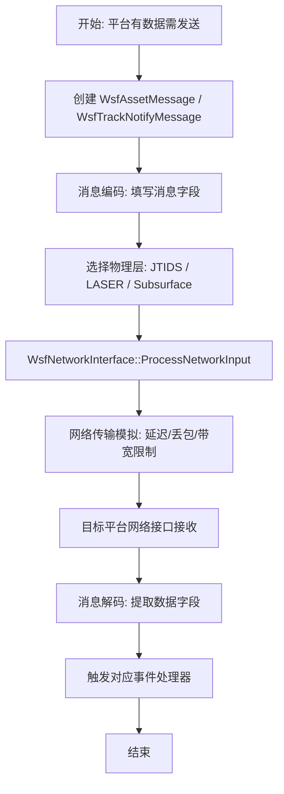

- **功能算法流程说明**：
  1. 发送方平台创建消息对象（`WsfAssetMessage` 用于平台状态报告，`WsfTrackNotifyMessage` 用于航迹通知，`WsfStatusMessage` 用于状态更新）。
  2. 消息编码：按通信协议填充字段（如 Link16 J-series 消息格式）。
  3. 物理层选择：JTIDS（Link16 TDMA 终端）、LASER（激光通信）、Subsurface（水下声学）。
  4. `WsfNetworkInterface` 处理发送队列，模拟网络传输延迟和带宽约束。
  5. 接收方 `WsfNetworkInterface` 接收消息 → 解码 → 触发对应事件处理器。
  6. 报文发送功能由 `wsf::comm` 命名空间的类体系完整支持。

- **功能输入**：

| 英文标识符 | 中文名称 | 数据类型 | 含义 | 单位 | 所属方法 |
| ----------- | -------- | -------- | ---- | ---- | -------- |
| message_content | 消息内容 | `MessageContent` | 待发送的消息数据 | — | WsfNetworkInterface |
| source_platform_id | 源平台 ID | `PlatformId` | 发送方平台标识 | — | WsfNetworkInterface |
| destination_id | 目标 ID | `DestinationId` | 接收方标识（单播/组播/广播） | — | WsfNetworkInterface |

- **功能输出**：

| 英文标识符 | 中文名称 | 数据类型 | 含义 | 单位 | 所属方法 |
| ----------- | -------- | -------- | ---- | ---- | -------- |
| received_message | 接收消息 | `MessageContent` | 接收方解码后的消息 | — | WsfNetworkInterface |
| message_event | 消息事件 | `MessageEvent` | 触发的消息处理事件 | — | NetworkUpdateEvent |

- **功能配置**：

| 英文标识符 | 中文名称 | 数据类型 | 含义 | 单位 | 所属方法 |
| ----------- | -------- | -------- | ---- | ---- | -------- |
| transmission_power | 发射功率 | `double` | 通信发射机功率 | W | PhysicalLayer |
| data_rate | 数据速率 | `double` | 通信数据率 | bps | PhysicalLayer |
| network_latency | 网络延迟 | `double` | 消息传输延迟 | s | WsfNetworkInterface |
| packet_loss_rate | 丢包率 | `double` | 消息丢失概率 | — | WsfNetworkInterface |

- **功能依赖**：

| 依赖类型 | 依赖名称 | 依赖路径 | 依赖说明 |
| -------- | -------- | -------- | -------- |
| 组合 | WsfNetworkInterface | wsf/source/WsfNetworkInterface.hpp | 网络接口 |
| 组合 | WsfMessageTable | wsf/source/ | 消息类型注册表 |
| 依赖 | wsf_l16 | wsf_l16/source/ | Link16 协议栈 |
| 依赖 | wsf::comm | wsf/source/ (wsf::comm 命名空间) | 通信框架 |

- **功能非功能需求**：
  - **时延**：消息延迟和丢包率可参数化配置。
  - **协议**：支持 Link16（MIL-STD-6016）J-series 消息格式。

- **功能参考证据**：
  - 参考覆盖度：✅ 完全覆盖
  - AFSIM 源码功能索引证据：
    - 证据路径：`afsim-2_9/swdev/src/core/wsf/source/WsfNetworkInterface.hpp`、`afsim-2_9/swdev/src/core/wsf_mil/source/WsfAssetMessage.hpp`
    - 证据函数名：`WsfNetworkInterface`、`WsfMessageTable`、`WsfAssetMessage`、`WsfTrackNotifyMessage`、`WsfJTIDS_Terminal`
    - 证据行号：已在 function-index.jsonl 中索引
    - 证据功能摘要：完整通信框架：消息类型体系 + 网络接口 + 物理层抽象（JTIDS/激光/水下）+ Link16 协议
  - AFSIM 使用文档目录证据：
    - 证据路径：`demos/comm/`、`demos/l16_j11/`
    - 证据名称：comm demo、L16 J11 demo
    - 证据摘要：通信网络演示含 ad_hoc 组网和群组通信示例；Link16 J11 消息演示

---

### 11. 毁伤

- **功能描述**：评估武器命中后对目标的毁伤效果，按机动毁伤（M-kill）、火力毁伤（F-kill）、灾难性摧毁（K-kill）三级评估，并考虑对抗措施（CM）。
- **功能所属系统**：毁伤组件 (Damage Component)
- **功能所属模块**：wsf_mil (MIL-STD 仿真扩展) + wsf (核心杀伤概率框架)
- **功能所属类级**：`WsfMobilityAndFirepowerLethality`（MFK 三级毁伤 + CM 对抗），多种杀伤模型：`WsfSphericalLethality`、`WsfGraduatedLethality`、`WsfTabulatedLethality`、`WsfHEL_Lethality` (高能激光)、`WsfExoAtmosphericLethality` (大气层外)、`WsfCarltonLethality`、`WsfEngageLaunchPkTableLethality`
- **功能所属方法**：`Lethality::CalcInterceptPk`、`WsfMobilityAndFirepowerLethality::Detonate`、`WsfMobilityAndFirepowerLethality::ApplyEffectTo`

- **功能算法流程图**：

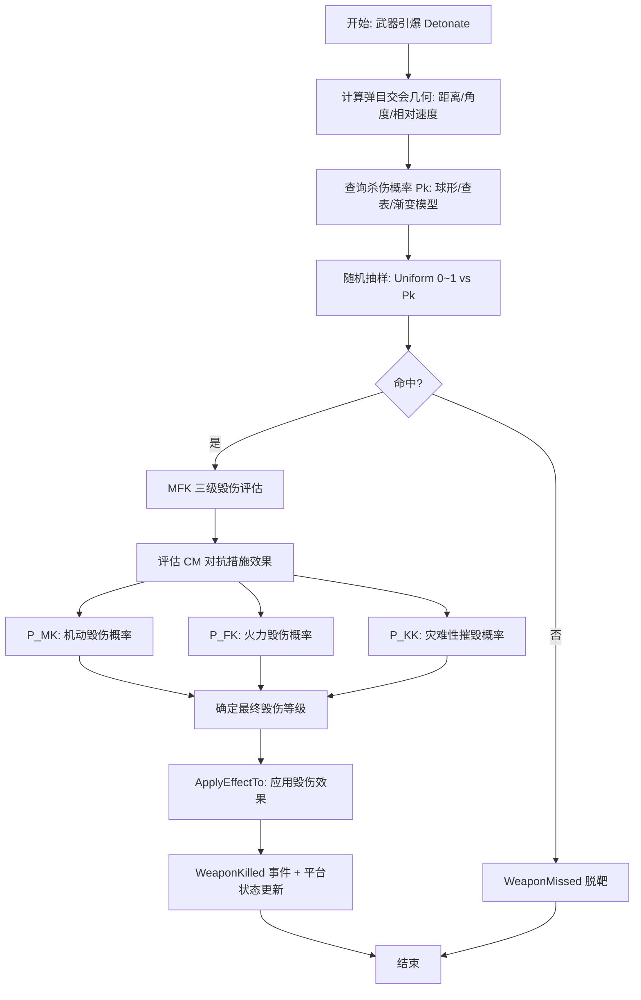

- **功能算法流程说明**：
  1. 武器引爆 (`Detonate`) 时计算弹目交会几何参数：脱靶距离（miss distance）、交会角、相对速度。
  2. 根据杀伤模型类型计算毁伤概率 Pk：
     - 球形模型：Pk = f(脱靶距离, 杀伤半径)。
     - 查表模型：Pk = Table(距离, 角度, 速度)。
     - 渐变模型：Pk 分段线性衰减。
  3. 随机抽样：生成 U[0,1] 随机数 → 与 Pk 比较 → 判定命中/脱靶。
  4. 若命中：进入 MFK 三级评估（`WsfMobilityAndFirepowerLethality`）：
     - $P_{MK}$ (Mobility Kill)：平台丧失机动能力。
     - $P_{FK}$ (Firepower Kill)：平台丧失火力能力。
     - $P_{KK}$ (Catastrophic Kill / K-kill)：平台完全摧毁。
  5. 对抗措施（CM）影响：每种 CM 类型（箔条/诱饵/ECM）可降低对应毁伤概率。
  6. `ApplyEffectTo` 将毁伤效果写入目标平台（如限制最大速度、禁用武器组件等）。
  7. 发送 `WeaponKilled` 或 `WeaponMissed` 事件。

- **功能算法关键公式**：
  - **公式名称**：MFK 条件毁伤概率
  - **公式描述**：在命中条件下各等级毁伤的条件概率

  $P_{MK|Hit} = P_{MK\_base} \cdot \prod_{i} CM_{MK,i}$
  $P_{FK|Hit} = P_{FK\_base} \cdot \prod_{i} CM_{FK,i}$
  $P_{KK|Hit} = P_{KK\_base} \cdot \prod_{i} CM_{KK,i}$

  - **公式符号解释**：其中，$P_{MK|Hit}$ 表示命中条件下的机动毁伤概率，无量纲；$P_{MK\_base}$ 表示基础机动毁伤概率，无量纲；$CM_{MK,i}$ 表示第 i 种对抗措施对 M-kill 的衰减因子，无量纲（≤1）。F-kill 和 K-kill 同理。

- **功能输入**：

| 英文标识符 | 中文名称 | 数据类型 | 含义 | 单位 | 所属方法 |
| ----------- | -------- | -------- | ---- | ---- | -------- |
| miss_distance | 脱靶距离 | `double` | 弹目最近距离 | m | Lethality::CalcInterceptPk |
| intercept_angle | 交会角 | `double` | 弹目接近角 | deg | Lethality::CalcInterceptPk |
| target_type | 目标类型 | `TargetType` | 目标类别/型号 | — | WsfMobilityAndFirepowerLethality |
| cm_states | CM 状态 | `CM_State[]` | 各对抗措施的当前状态 | — | WsfMobilityAndFirepowerLethality |
| warhead_type | 战斗部类型 | `WarheadType` | 战斗部型号 | — | WeaponConfig |

- **功能输出**：

| 英文标识符 | 中文名称 | 数据类型 | 含义 | 单位 | 所属方法 |
| ----------- | -------- | -------- | ---- | ---- | -------- |
| kill_level | 毁伤等级 | `KillLevel` | M-kill / F-kill / K-kill / 无毁伤 | — | WsfMobilityAndFirepowerLethality::Detonate |
| pk | 毁伤概率 | `double` | 综合毁伤概率 | — | Lethality::CalcInterceptPk |
| kill_event | 毁伤事件 | `WeaponKilled` | 武器毁伤事件 | — | WsfMilEventResults |

- **功能配置**：

| 英文标识符 | 中文名称 | 数据类型 | 含义 | 单位 | 所属方法 |
| ----------- | -------- | -------- | ---- | ---- | -------- |
| pk_max | 最大毁伤概率 | `double` | 理想条件下的最大 Pk | — | Lethality |
| kill_radius | 杀伤半径 | `double` | 确保杀伤的脱靶距离 | m | WsfSphericalLethality |
| vulnerability_table | 易损性表 | `MFK_Table` | 目标类型 → MFK 概率映射 | — | WsfMobilityAndFirepowerLethality |
| cm_effectiveness | CM 效能 | `double[]` | 各对抗措施的衰减因子 | — | WsfMobilityAndFirepowerLethality |

- **功能依赖**：

| 依赖类型 | 依赖名称 | 依赖路径 | 依赖说明 |
| -------- | -------- | -------- | -------- |
| 组合 | WsfWeaponEffectsTypes | wsf_mil/source/weapon/WsfWeaponEffectsTypes.hpp | 武器效应类型注册 |
| 依赖 | WsfPlatform | wsf/source/WsfPlatform.hpp | 目标平台（应用毁伤效果） |
| 依赖 | WsfPk::WsfWeaponEffects | wsf_mil/source/weapon/ | 杀伤概率计算框架 |

- **功能非功能需求**：
  - **随机性**：毁伤评估含有随机抽样，需支持可复现的随机种子。

- **功能参考证据**：
  - 参考覆盖度：✅ 完全覆盖
  - AFSIM 源码功能索引证据：
    - 证据路径：`afsim-2_9/swdev/src/core/wsf_mil/source/weapon/WsfMobilityAndFirepowerLethality.hpp`、`WsfSphericalLethality.hpp`、`WsfGraduatedLethality.hpp`
    - 证据函数名：`WsfMobilityAndFirepowerLethality` (52 methods)、`WsfSphericalLethality`、`WsfGraduatedLethality` (21 methods)
    - 证据行号：已在 function-index.jsonl 中索引（MobilityAndFirepowerLethality: lines 73-282）
    - 证据功能摘要：最全面的杀伤模型（MFK 三级毁伤 + CM 对抗 + 目标易损性表），另有球形/查表/渐变/高能激光/大气层外等多种模型可选
  - AFSIM 算法卡片概览证据：
    - 证据路径：`docs/algorithms/space-nasa-breakup-model-card.md`
    - 证据名称：NASA 卫星解体模型
    - 证据摘要：空间碎片解体模型（与毁伤相关的特定应用场景）

---

### 12. 电子干扰

- **功能描述**：对敌方雷达/通信系统实施电子干扰（Electronic Attack / EA），包括压制干扰、欺骗干扰、假目标、距离/速度拖引等多种技术，以及对己方系统的电子防护（EP）。
- **功能所属系统**：干扰组件 (Jamming Component)
- **功能所属模块**：wsf_mil (MIL-STD 仿真扩展) + wsf_nx (电子战扩展)
- **功能所属类级**：`WsfRF_Jammer`（`JammerXmtr` + `JammerBeam` + `JammerMode`）；`WsfEW_Effect` 体系：`WsfEW_EA`（电子攻击）、`WsfEW_EP`（电子防护）、10+ 种具体干扰效应；`WsfEW_XmtrComponent`/`WsfEW_RcvrComponent`；`WsfJammerTaskResource`（干扰任务资源）
- **功能所属方法**：`WsfRF_Jammer::Update`、`WsfEW_Effect::Apply`、`JammerXmtr::Transmit`

- **功能算法流程图**：

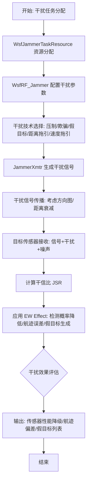

- **功能算法流程说明**：
  1. 干扰任务管理器 (`WsfJammerTaskResource`) 分配干扰资源到目标传感器（雷达/通信）。
  2. `WsfRF_Jammer` 配置干扰参数：功率、频率、带宽、天线方向图（`JammerXmtr` + `JammerBeam`）。
  3. 选择干扰技术 (`JammerMode`/`WsfEW_Technique`)：
     - **压制干扰**（Barrage/Spot/Comms Jamming）：宽带/窄带/通信压制。
     - **欺骗干扰**（Repeater/Agile Repeater）：转发式欺骗。
     - **假目标**（False Target）：生成虚拟目标航迹。
     - **距离拖引**（RGPO/RGPI）：距离门拖引/拖近。
     - **速度拖引**（VGPO）：速度门拖引。
     - **覆盖脉冲**（Cover Pulse）：掩护真实回波。
     - **角闪烁/极化调制**：角度/极化域干扰。
  4. 干扰信号传播：方向图增益 + 距离衰减（$P_{rx} = \frac{P_{tx} G_{tx} G_{rx} \lambda^2}{(4\pi R)^2 L}$，单向传播）。
  5. 目标传感器接收端：干信比 $JSR = P_{jam} / P_{sig}$。
  6. `WsfEW_Effect` 家族应用干扰效应：
     - 压制效应：降低检测概率 $P_d$，增加虚警率。
     - 欺骗效应：诱导跟踪误差、建立假航迹。
     - 假目标效应：在传感器输出中插入虚假目标。
  7. 电子防护 (EP)：`WsfEW_EP` 评估接收方的抗干扰措施效果。

- **功能算法关键公式**：
  - **公式名称**：干信比 (J/S Ratio)
  - **公式描述**：目标传感器处干扰功率与信号功率之比

  $JSR = \frac{P_j \cdot G_j \cdot G_r(\theta_j) \cdot \lambda^2 \cdot B_s}{(4\pi)^2 \cdot R_j^2 \cdot L_j} \div \frac{P_t \cdot G_t \cdot G_r(\theta_t) \cdot \lambda^2 \cdot \sigma}{(4\pi)^3 \cdot R_t^4 \cdot L_t \cdot L_r}$

  - **公式符号解释**：其中，$JSR$ 表示干信比，无量纲（通常以 dB 表示）；$P_j$ 表示干扰机发射功率，单位为 W；$P_t$ 表示雷达发射功率，单位为 W；$G_j$ 表示干扰机天线增益，无量纲；$G_t$ 表示雷达天线增益，无量纲；$G_r(\theta)$ 表示雷达天线在方向 $\theta$ 上的接收增益；$R_j$ 表示干扰机距离，单位为 m；$R_t$ 表示目标距离，单位为 m；$\sigma$ 表示目标 RCS，单位为 m²；$B_s$ 表示信号带宽与干扰带宽的匹配因子。

- **功能输入**：

| 英文标识符 | 中文名称 | 数据类型 | 含义 | 单位 | 所属方法 |
| ----------- | -------- | -------- | ---- | ---- | -------- |
| target_sensor | 目标传感器 | `SensorPtr` | 被干扰的传感器对象 | — | WsfRF_Jammer |
| jammer_platform_state | 干扰平台状态 | `PlatformState` | 干扰机位置/速度/姿态 | m, m/s | WsfRF_Jammer::Update |
| technique_config | 干扰技术配置 | `TechniqueConfig` | 干扰技术类型及参数 | — | WsfEW_Technique |

- **功能输出**：

| 英文标识符 | 中文名称 | 数据类型 | 含义 | 单位 | 所属方法 |
| ----------- | -------- | -------- | ---- | ---- | -------- |
| jsr | 干信比 | `double` | 传感器接收端 J/S 比 | dB | WsfEW_Effect |
| detection_degradation | 检测降级 | `DetectionDegradation` | 检测概率降低/虚警增加 | — | WsfEW_PowerEffect |
| track_error | 航迹误差 | `TrackError` | 跟踪偏差增大 | m, deg | WsfEW_TrackEffect |
| false_targets | 假目标列表 | `FalseTarget[]` | 生成的假目标航迹 | — | WsfEW_FalseTargetEffect |

- **功能配置**：

| 英文标识符 | 中文名称 | 数据类型 | 含义 | 单位 | 所属方法 |
| ----------- | -------- | -------- | ---- | ---- | -------- |
| jammer_power | 干扰功率 | `double` | 干扰机有效辐射功率 ERP | W | JammerXmtr |
| jammer_bandwidth | 干扰带宽 | `double` | 干扰信号带宽 | Hz | JammerXmtr |
| antenna_pattern | 天线方向图 | `AntennaPattern` | 干扰天线增益方向图 | dBi | JammerBeam |
| technique_type | 技术类型 | `enum` | 压制/欺骗/假目标/拖引等 | — | JammerMode |

- **功能依赖**：

| 依赖类型 | 依赖名称 | 依赖路径 | 依赖说明 |
| -------- | -------- | -------- | -------- |
| 组合 | WsfEW_EA | wsf_mil/source/ | 电子攻击技术 |
| 组合 | WsfEW_EP | wsf_mil/source/ | 电子防护措施 |
| 组合 | WsfEW_EffectManager | wsf_mil/source/ | 干扰效应管理器 |
| 依赖 | WsfJammerTaskResource | wsf_mil/source/ | 干扰任务资源分配 |
| 依赖 | WsfRF_Jammer | wsf_mil/source/ | RF 干扰机主体 |

- **功能非功能需求**：
  - **实时性**：多干扰机 + 多传感器场景的计算复杂度 $O(N_{jammer} \times N_{sensor})$，大规模场景需优化。
  - **保真度**：支持从简单功率模型到详细信号级仿真的多级保真度。

- **功能参考证据**：
  - 参考覆盖度：✅ 完全覆盖
  - AFSIM 源码功能索引证据：
    - 证据路径：`afsim-2_9/swdev/src/core/wsf_mil/source/weapon/WsfEW_Effect.hpp`、`afsim-2_9/swdev/src/core/wsf_mil/source/weapon/WsfRF_Jammer.hpp`、`WsfEW_EA.hpp`、`WsfEW_EP.hpp`
    - 证据函数名：`WsfRF_Jammer`、`WsfEW_Effect`、`WsfEW_EA`、`WsfEW_EP`、`WsfEW_PowerEffect`、`WsfEW_RepeaterEffect`、`WsfEW_FalseTargetEffect`、`WsfEW_TrackEffect`、`WsfEW_CoverPulseEffect`
    - 证据行号：已在 function-index.jsonl 中索引
    - 证据功能摘要：最全面的电子战框架。10+ 种干扰效应（压制/欺骗/假目标/距离拖引/速度拖引/角闪烁/覆盖脉冲/极化调制/通信干扰等），EA + EP 双体系，支持脚本体扩展，含干扰任务资源管理器
  - AFSIM 使用文档目录证据：
    - 证据路径：`demos/electronic_warfare/`（40+ 场景文件）
    - 证据名称：electronic_warfare demo suite
    - 证据摘要：电子战演示套件含 40+ 场景：agile_jamming, barrage_jamming, comm_jamming, cover_pulse_jamming, false_target_jamming, pol_mod_jamming, repeater_jamming, rpj_jamming, spot_jamming, track_error, track_drop_maintain_effect, jam_strobe_direction_finder 等，覆盖几乎所有干扰技术

---

## 覆盖度汇总

| 覆盖度 | 数量 | 功能组件 |
|--------|------|---------|
| ✅ 完全覆盖 | 9 | 空中机动、陆上机动、导弹机动、雷达探测、导弹火力、制导武器发射、报文发送、毁伤、电子干扰 |
| ⚠️ 部分覆盖 | 2 | 可见光探测（缺多模式自动切换）、自杀攻击（无专用类，需组合实现） |
| 🆕 缺失 | 1 | 惯性导航（AFSIM 无独立 INS 组件，需从领域文献设计） |
| ❓ 无法判断 | 0 | — |

**总计**：12 个功能组件中，9 项 AFSIM 完全覆盖，2 项部分覆盖（可通过脚本扩展组合实现），1 项缺失（惯性导航需外部设计）。

---

> **下一步**：等待人工审核确认。如有修改要求，将根据反馈修改本参考设计文档。
