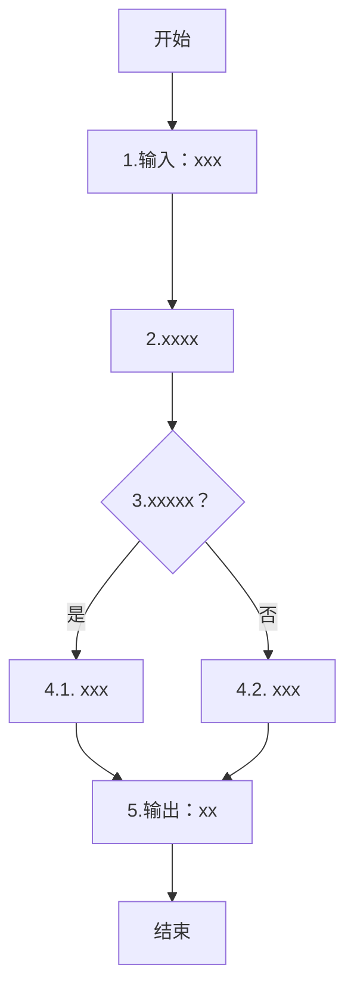

# 算法卡片规范

1. **中文注释全覆盖**：算法卡片应当是可供只会中文的新手开发人员阅读和理解的产物，本文所有章节都必须添加中文注释，且避免复杂高深的表述。
2. **语言统一**：文档中不同章节在表示相同内容时使用的标识符和名称应当统一，语言风格应当保持严谨准确。
3. **格式标准化**：算法卡片模板的格式，尤其是章节结构、表格表头、非必要不允许擅自修改，如需要修改，请询问人工。

--- 

# 算法卡片模板

## xxx(总标题)算法模型

> **状态**：
> **日期**：
> **索引证据**：
> **关联文档**：
> **关联源文件**：`xxx.hpp`、`yyy.cpp`...

### 基础资料

- **算法名称**：
- **算法所属模块**：
- **算法功能**：

### 算法流程

整个算法流程图如下：


其中，第一步为.....，第二步为....，第三步.......(解释图中标识，并用语言描述整个算法流程，注意语言描述要清楚明确)。

### 算法变量和常量映射表
(所属函数(Method) 必须与`function-index.josnl`中函数的`qualified_name`保持一致)
(代码标识(Symbol)必须为代码中的变量名称，与`Symbol-index.jsonl`中的`symbol_name`保持一致)
(算法没有的变量类型可以省略不写)

1. 输入变量(input)：
   
    | # | 中文名称(Name) | 代码标识(Symbol) | 数学符号(Math-sym) | 数据类型(Type) | 含义(Meaning) | 单位(Units) | 所属函数(Method) |
    |---| ---- | ---- | ---- | --- | ---- | --- |
    | 1 | xxx | `xxx` | $xxx$ | `xxx` | xxx | xxx | `xxx` |

2. 输出变量(output)：
      
    | # | 中文名称(Name) | 代码标识(Symbol) | 数学符号(Math-sym) | 数据类型(Type) | 含义(Meaning) | 单位(Units) | 所属函数(Method) |
    |---| ---- | ---- | ---- | --- | ---- | --- |
    | 1 | xxx | `xxx` | $xxx$ | `xxx` | xxx | xxx | `xxx` |

3. 参数变量(parameters)：
      
    | # | 中文名称(Name) | 代码标识(Symbol) | 数学符号(Math-sym) | 数据类型(Type) | 含义(Meaning) | 单位(Units) | 所属函数(Method) |
    |---| ---- | ---- | ---- | --- | ---- | --- |
    | 1 | xxx | `xxx` | $xxx$ | `xxx` | xxx | xxx | `xxx` |

4. 状态变量(state variables)：
      
    | # | 中文名称(Name) | 代码标识(Symbol) | 数学符号(Math-sym) | 数据类型(Type) | 含义(Meaning) | 单位(Units) | 所属函数(Method) | 初始值(Initial-val) | 更新时机(Update-tim) |
    |---| ---- | ---- | ---- | --- | ---- | --- |
    | 1 | xxx | `xxx` | $xxx$ | `xxx` | xxx | xxx | `xxx` | xxx | xxxxxxxxxxxxxxxxxxxxxxxxxxxx |

5. 常量(contant):

    | # | 中文名称(Name) | 代码标识(Symbol) | 数学符号(Math-sym) | 数据类型(Type) | 含义(Meaning) | 单位(Units) | 所属函数(Method) |
    |---| ---- | ---- | ---- | --- | ---- | --- |
    | 1 | xxx | `xxx` | $xxx$ | `xxx` | xxx | xxx | `xxx` |


### 关键数学公式

1. **xxxx**：
    （简单介绍公式计算目的），公式如下：
    $y=x+z$
    其中：
    - $y$ 表示...，单位为...，取值为...。
    - $x$ 表示...，单位为...，取值为...。
    - $z$ 表示...，单位为...，取值为...。
    
2. **xxxx**
    （简单介绍公式计算目的），公式如下：
    $y=x+z$
    其中：
    - $y$ 表示...，单位为...，取值为...。
    - $x$ 表示...，单位为...，取值为...。
    - $z$ 表示...，单位为...，取值为...。
    
3. **xxxx**
    （简单介绍公式计算目的），公式如下：
    $y=x+z$
    其中：
    - $y$ 表示...，单位为...，取值为...。
    - $x$ 表示...，单位为...，取值为...。
    - $z$ 表示...，单位为...，取值为...。

### 算法伪代码

(
伪代码输出必须遵循以下要求：
- **语言**：伪代码使用英文标识符（变量名/函数名/算法名），但每条注释和说明必须使用**中文**。每行伪代码应有对应的中文注释解释其物理意义或计算目的。
- **格式**：伪代码块用 ` ``` ` 包裹，结构体使用类 C/类 Python 语法。
- **注释模板**：
  - 算法开头用中文说明整体目标和调用上下文。
  - 每一步/每一阶段用中文说明该步在做什么（如 `// 预测步：用 F₀ 推进到临时中间状态`）。
  - 关键物理量标注单位和物理意义（如 `a_body = F_body / mass   // 体轴加速度 = 牛顿第二定律 (m/s²)`）。
  - 边界条件/保护限幅说明其数值原因和使用的阈值来源。
- **最低注释密度**：伪代码中每 3-5 行至少有一行中文注释。
)

### 源码使用说明

#### 入口和调用链

(
调用链中的每一行必须附带中文注释，说明该步在算法流程中的作用：
- 示例：`→ CalculateFM()  // 第一步：计算当前力/力矩（气动+推进+起落架+重力）`
)

#### 源码位置
(
- 入口和调用链上每一项在源码中的位置(file:line_start-line_end)
)

#### 框架依赖
(
- 框架依赖和可替换依赖。
)

#### 边界条件

1. **xxx**：xxxxxxxxxxxxxxxxxxxxx。

#### 测试和验证计划
(
- 给出测试该算法的最简单测试方案
)

#### 可移植性评分
**可移植性**：高/中/低
**原因**：
1. ...
2. ... 


