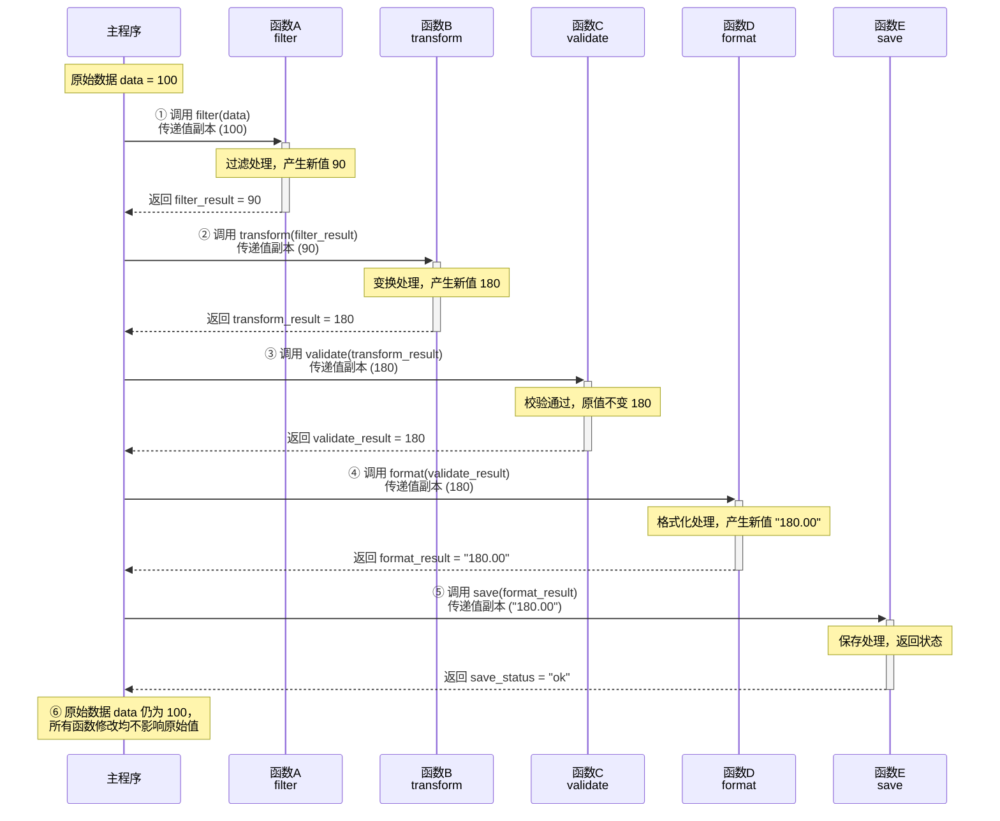
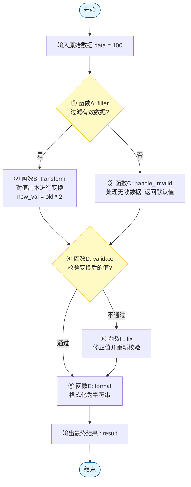

# 功能单元实现规格 — Function Unit Migration Design

>**需求编号**：<REQ_XXX>  
>**需求名称**：<需求简要描述>  
>**文档状态**：草稿 / 待确认 / 已确认  
>**生成时间**：YYYY-MM-DD HH:MM  
>**最后确认时间**：YYYY-MM-DD HH:MM  
>**设计者**：AI + 待人工确认  
>**关联文件**：  

---

## 全局设计约定

以下约定适用于本迁移计划中的所有功能单元（FU），各 FU 章节不再重复说明。

### 目标系统环境
| 项目 | 约定 |
|------|------|
| **语言标准** | xxx |
| **数学库** | xxx |
| **构建系统** | xxx |
| **目标平台** | xxx |
| **代码目录** | `tests/migration_src/<REQ_xxx>/` |

### 全局类型映射
| AFSIM 类型 | 目标系统类型 | 头文件 |
|------------|-------------|--------|
| `double` | `double` | — |
| `int64_t` | `int64_t` | `<cstdint>` |

### 全局单位约定
| 物理量 | AFSIM 单位 | 目标系统单位 | 转换关系 |
|--------|-----------|-------------|----------|
| 位置 | ft | m | 1 ft = 0.3048 m |
| 速度 | ft/s | m/s | 1 ft/s = 0.3048 m/s |

> **单位策略**：内部计算全部使用 SI 单位制，接口输入输出使用 SI 单位。在关键公式注释中标注原始 AFSIM Imperial 值以保持可追溯性。

## 实现流程

1. 流程图如下：

2. 接口信息如下：

## FU-{XXX}：{功能单元名称}

| 属性 | 内容 |
|------|------|
| **关联需求** | REQ-XXX |
| **优先级** | 高 / 中 / 低 |
| **来源类型** | `afsim` |
| **设计版本** | v1.0 draft |
| **设计日期** | YYYY-MM-DD |
| **功能描述** | <从缺口规格复制> |
| **AFSIM 源位置** | `src/<path>:<line_start>-<line_end> (<Class::method>)` |
| **源码行数** | {N} |
| **迁移策略** | 直接适配 / 局部重写 / Clean-room 重实现 |
| **风险评估** | 高 / 中 / 低 |

---

### 功能概述
简要描述该功能单元的业务目标、在仿真流程中的位置以及迁移的必要性。

### 算法流程

#### 算法流程图如下：

#### 关键算法

1. （对应到流程图中的流程）：算法xxxx[引用](path/to/file.md)
计算xxxx的公式如下：
$xxxxx$
其中$x$为xxx，表示..........。

2. （对应到流程图中的流程）：算法yyyy[引用](path/to/file.md)
计算yyyy的公式如下：
$yyyyyy$
其中$y$为yyyy，表示..........。

###  接口详细定义（API）如下：

1. 函数`{function_name}`:为实现{xxxxx}算法中的{xxxx}部分，`{function_name}`将....

| 项目 | 说明 |
|------|------|
| **签名** | `{return_type} {function_name}({parameters});` |
| **输入** | 详见下表 |
| **输出** | {返回值描述，包括后置条件} |
| **前置条件** | {必须满足的条件，如参数范围、对象状态} |
| **后置条件** | {返回值承诺，如四元数归一化} |
| **复杂度** | O(1) / O(N) / 约{X}次浮点运算 |

- **输入参数详细表**：

| 参数名 | 类型 | 有效范围/约束 | 说明 |
|--------|------|---------------|------|
| {param1} | {type} | {e.g., dt ∈ (0, 0.1]} | {描述} |
| {param2} | {type} | {约束} | {描述} |

- **补充参数详细表**：

| 参数名 | 类型 | 有效范围/约束 | 说明 |
|--------|------|---------------|------|
| {param1} | {type} | {e.g., dt ∈ (0, 0.1]} | {描述} |
| {param2} | {type} | {约束} | {描述} |

2. 函数`{function_name}`:为实现{xxxxx}算法中的{xxxx}部分，`{function_name}`将....

| 项目 | 说明 |
|------|------|
| **签名** | `{return_type} {function_name}({parameters});` |
| **输入** | 详见下表 |
| **输出** | {返回值描述，包括后置条件} |
| **前置条件** | {必须满足的条件，如参数范围、对象状态} |
| **后置条件** | {返回值承诺，如四元数归一化} |
| **复杂度** | O(1) / O(N) / 约{X}次浮点运算 |

- **输入参数详细表**：

| 参数名 | 类型 | 有效范围/约束 | 说明 |
|--------|------|---------------|------|
| {param1} | {type} | {e.g., dt ∈ (0, 0.1]} | {描述} |
| {param2} | {type} | {约束} | {描述} |

- **补充参数详细表**：

| 参数名 | 类型 | 有效范围/约束 | 说明 |
|--------|------|---------------|------|
| {param1} | {type} | {e.g., dt ∈ (0, 0.1]} | {描述} |
| {param2} | {type} | {约束} | {描述} |

3. ...

### 耦合度与依赖分析

#### 依赖
{头文件、库连接.....}

#### 耦合度评估

| 评估维度 | 说明 |
|----------|------|
| 框架耦合 | 依赖 AFSIM 特定基础类、工厂模式、插件注册等的程度 |
| 数据耦合 | 对 AFSIM 特有数据结构（如 `af::State`）的依赖 |
| 控制耦合 | 是否依赖全局状态机、仿真循环钩子 |
| 外部依赖 | 是否依赖数据库、网络、特定硬件 |

**综合等级**：低 / 中 / 高  
**剥离策略**：{基于综合等级的剥离方式，与迁移策略一致}

### 内部状态与生命周期
| 状态变量 | 类型 | 默认值 | 生命周期 | 线程安全 | 备注 |
|----------|------|--------|----------|----------|------|
| `prev_error_` | double | 0.0 | 模块级 | 否 | 用于误差累积 |
| `...` | ... | ... | ... | ... | ... |

- **是否需要 `reset()` 函数**：是 / 否
- **拷贝/移动行为**：{是否允许，如何处理内部状态}
- **其他说明**：{例如“首次调用前必须调用 init()”}

### 错误处理策略
| 异常场景 | 检测条件 | 处理方式 | 返回/错误码 |
|----------|----------|----------|-------------|
| 非法输入（dt <= 0） | 函数入口 if 判断 | 返回原状态，Debug 模式打印警告 | 原 state |
| 质量参数 <= 0 | 构造时检查 | 抛出 `std::invalid_argument` | — |
| 四元数模长过小 | 归一化前判断 | 重置为单位四元数，打印错误 | — |

### 风险与未决问题
- {技术风险}
- {合规风险}
- {需要进一步澄清的接口问题}

### 人工确认
请逐项勾选确认：

- [ ] 耦合评估合理
- [ ] 接口适配方案可行
- [ ] 数据类型映射正确
- [ ] 内部状态管理设计合理
- [ ] 错误处理策略完整

**修改要求**（若有）：  
______________________________________________  

**确认人**：__________  
**确认日期**：__________  

---

## 修订记录

| 版本 | 日期 | 修改内容 | 修改原因 |
|------|------|----------|----------|
| v0.1 | YYYY-MM-DD | 初始版本 | 首次生成 |
| v0.2 | YYYY-MM-DD | 修改 FU-001 接口 | 人工反馈要求增加参数 |

---

