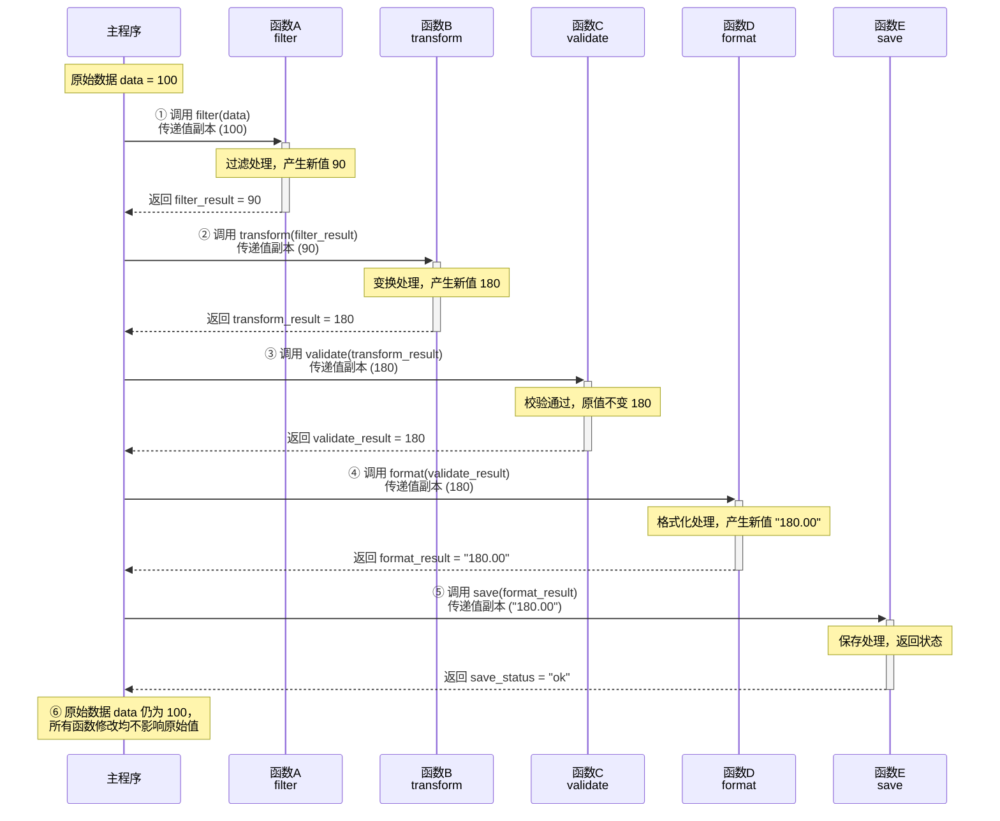

# 功能单元实现规格 — Function Unit Migration Design

>**需求编号**：<REQ_XXX>  
>**需求名称**：<需求简要描述>  
>**文档状态**：草稿 / 待确认 / 已确认  
>**生成时间**：YYYY-MM-DD HH:MM  
>**最后确认时间**：YYYY-MM-DD HH:MM  
>**设计者**：AI + 待人工确认  
>**关联文件**：  

---


## 全局设计约定

以下约定适用于本迁移计划中的所有功能单元（FU），各 FU 章节不再重复说明。

### 目标系统环境
| 项目 | 约定 |
|------|------|
| **语言标准** | xxx |
| **数学库** | xxx |
| **构建系统** | xxx |
| **目标平台** | xxx |
| **代码目录** | `tests/migration_src/<REQ_xxx>/` |

### 全局类型映射
| AFSIM 类型 | 目标系统类型 | 头文件 |
|------------|-------------|--------|
| `double` | `double` | — |
| `int64_t` | `int64_t` | `<cstdint>` |


### 全局单位约定
| 物理量 | AFSIM 单位 | 目标系统单位 | 转换关系 |
|--------|-----------|-------------|----------|
| 位置 | ft | m | 1 ft = 0.3048 m |
| 速度 | ft/s | m/s | 1 ft/s = 0.3048 m/s |

> **单位策略**：内部计算全部使用 SI 单位制，接口输入输出使用 SI 单位。在关键公式注释中标注原始 AFSIM Imperial 值以保持可追溯性。

## 实现流程

1. 流程图如下：



2. 接口信息如下：


## FU-{XXX}：{功能单元名称}

| 属性 | 内容 |
|------|------|
| **关联需求** | REQ-XXX |
| **优先级** | 高 / 中 / 低 |
| **来源类型** | `afsim` |
| **设计版本** | v1.0 draft |
| **设计日期** | YYYY-MM-DD |
| **功能描述** | <从缺口规格复制> |
| **AFSIM 源位置** | `src/<path>:<line_start>-<line_end> (<Class::method>)` |
| **源码行数** | {N} |
| **迁移策略** | 直接适配 / 局部重写 / Clean-room 重实现 |
| **风险评估** | 高 / 中 / 低 |

---

### 1. 功能概述
简要描述该功能单元的业务目标、在仿真流程中的位置以及迁移的必要性。

### 2. 算法流程

#### 算法流程图如下：


#### 关键算法

1. （对应到流程图中的流程）：算法xxxx[引用](path/to/file.md)
计算xxxx的公式如下：
$xxxxx$
其中$x$为xxx，表示..........。

2. （对应到流程图中的流程）：算法yyyy[引用](path/to/file.md)
计算yyyy的公式如下：
$yyyyyy$
其中$y$为yyyy，表示..........。

####  接口详细定义（API）如下：

1. 函数：`{function_name}`
| 项目 | 说明 |
|------|------|
| **签名** | `{return_type} {function_name}({parameters});` |
| **输入** | 详见下表 |
| **输出** | {返回值描述，包括后置条件} |
| **前置条件** | {必须满足的条件，如参数范围、对象状态} |
| **后置条件** | {返回值承诺，如四元数归一化} |
| **复杂度** | O(1) / O(N) / 约{X}次浮点运算 |

**输入参数详细表**：

| 参数名 | 类型 | 有效范围/约束 | 说明 |
|--------|------|---------------|------|
| {param1} | {type} | {e.g., dt ∈ (0, 0.1]} | {描述} |
| {param2} | {type} | {约束} | {描述} |

2. （若有多个函数，重复 1 结构）


#### 依赖
{头文件、库连接.....}


---


以下将原本带有条件注释的 FU 章节拆分为两个独立、完整的模板块：**`source: afsim`（有 AFSIM 参考）** 与 **`source: novel`（无 AFSIM 参考，全新设计）**。使用时根据 FU 的实际来源类型选择对应章节进行填充。

---

## 一、模板：source: afsim（有 AFSIM 源码参考）

## FU-{XXX}：{功能单元名称}（source: afsim）

| 属性 | 内容 |
|------|------|
| **关联需求** | REQ-XXX |
| **优先级** | 高 / 中 / 低 |
| **来源类型** | `afsim` |
| **设计版本** | v1.0 draft |
| **设计日期** | YYYY-MM-DD |
| **功能描述** | <从缺口规格复制> |
| **AFSIM 源位置** | `src/<path>:<line_start>-<line_end> (<Class::method>)` |
| **源码行数** | {N} |
| **迁移策略** | 直接适配 / 局部重写 / Clean-room 重实现 |
| **风险评估** | 高 / 中 / 低 |

---

### 1. 功能概述
简要描述该功能单元的业务目标、在仿真流程中的位置以及迁移的必要性。

### 2. 参考来源与算法依据

#### 2.1 AFSIM 参考实现
| 属性 | 值 |
|------|----|
| 源函数 | `{Class::method}` |
| 源文件 | `{relative_path:line_start-line_end}` |
| 源码行数 | {N} |
| 依赖的 AFSIM 类型/宏 | {list} |
| 依赖的全局变量/常量 | {list} |
| 使用的第三方库 | {list} |

#### 2.2 核心算法摘要
以伪代码或自然语言描述该函数的主要处理逻辑，必要时引用[算法卡片](path/to/file.md)中的公式。

### 3. 耦合度与依赖分析
| 评估维度 | 说明 |
|----------|------|
| 框架耦合 | 依赖 AFSIM 特定基础类、工厂模式、插件注册等的程度 |
| 数据耦合 | 对 AFSIM 特有数据结构（如 `af::State`）的依赖 |
| 控制耦合 | 是否依赖全局状态机、仿真循环钩子 |
| 外部依赖 | 是否依赖数据库、网络、特定硬件 |

**综合等级**：低 / 中 / 高  
**剥离策略**：{基于综合等级的剥离方式，与迁移策略一致}

### 4. 实现方案
#### 4.1 接口转换
| 原 AFSIM 接口 | 目标系统接口 | 转换说明 |
|---------------|--------------|----------|
| `{AFSIM 参数名:类型}` | `{目标参数名:类型}` | {单位转换、坐标系变换、数据重组等} |

- **源接口**：`<原函数签名>`
- **目标接口**：`<目标函数签名>`

#### 4.2 需移除的 AFSIM 专属代码
- [ ] {列出要删除的宏、日志、性能计数器等}

#### 4.3 需保留并修改的部分
- [ ] {核心算法函数，修改点说明}

#### 4.4 新增辅助代码
- [ ] {适配器、转换函数、工厂函数等}

### 5. 接口详细定义（API）
#### 5.1 函数：`{function_name}`
| 项目 | 说明 |
|------|------|
| **签名** | `{return_type} {function_name}({parameters});` |
| **输入** | 详见下表 |
| **输出** | {返回值描述，包括后置条件} |
| **前置条件** | {必须满足的条件，如参数范围、对象状态} |
| **后置条件** | {返回值承诺，如四元数归一化} |
| **复杂度** | O(1) / O(N) / 约{X}次浮点运算 |

**输入参数详细表**：

| 参数名 | 类型 | 有效范围/约束 | 说明 |
|--------|------|---------------|------|
| {param1} | {type} | {e.g., dt ∈ (0, 0.1]} | {描述} |
| {param2} | {type} | {约束} | {描述} |

#### 5.2 （若有多个函数，重复 5.1 结构）

### 6. 数据类型映射表
| AFSIM 类型 | 目标系统类型 | 头文件/定义位置 | 备注 | 转换代码示例 |
|------------|-------------|----------------|------|-------------|
| `af::Vector3` | `Eigen::Vector3d` | `<Eigen/Dense>` | 单位一致 | `Eigen::Vector3d(v.x, v.y, v.z)` |
| `af::Quaternion` | `Eigen::Quaterniond` | `<Eigen/Geometry>` | 顺序 (w,x,y,z) | `Eigen::Quaterniond(q.w(), q.x(), q.y(), q.z())` |
| `af::Time` | `double` (秒) | — | 精度损失确认 | `t.seconds()` |

### 7. 内部状态与生命周期
| 状态变量 | 类型 | 默认值 | 生命周期 | 线程安全 | 备注 |
|----------|------|--------|----------|----------|------|
| `prev_error_` | double | 0.0 | 模块级 | 否 | 用于误差累积 |
| `...` | ... | ... | ... | ... | ... |

- **是否需要 `reset()` 函数**：是 / 否
- **拷贝/移动行为**：{是否允许，如何处理内部状态}
- **其他说明**：{例如“首次调用前必须调用 init()”}

### 8. 错误处理策略
| 异常场景 | 检测条件 | 处理方式 | 返回/错误码 |
|----------|----------|----------|-------------|
| 非法输入（dt <= 0） | 函数入口 if 判断 | 返回原状态，Debug 模式打印警告 | 原 state |
| 质量参数 <= 0 | 构造时检查 | 抛出 `std::invalid_argument` | — |
| 四元数模长过小 | 归一化前判断 | 重置为单位四元数，打印错误 | — |


### 9. 风险与未决问题
- {技术风险}
- {合规风险}
- {需要进一步澄清的接口问题}

### 10. 人工确认
请逐项勾选确认：

- [ ] 耦合评估合理
- [ ] 接口适配方案可行
- [ ] 数据类型映射正确
- [ ] 内部状态管理设计合理
- [ ] 错误处理策略完整
- [ ] 测试策略与用例充分

**修改要求**（若有）：  
______________________________________________  

**确认人**：__________  
**确认日期**：__________  


---

## 二、模板：source: novel（无 AFSIM 参考，全新设计）

## FU-{XXX}：{功能单元名称}（source: novel）

| 属性 | 内容 |
|------|------|
| **关联需求** | REQ-XXX |
| **优先级** | 高 / 中 / 低 |
| **来源类型** | `novel`（全新设计） |
| **设计版本** | v1.0 draft |
| **设计日期** | YYYY-MM-DD |
| **功能描述** | <从缺口规格复制> |
| **AFSIM 源位置** | 无（AFSIM 无参考） |
| **源码行数** | 不适用 |
| **迁移策略** | novel（全新设计） |
| **风险评估** | 高 / 中 / 低 |

---

### 1. 功能概述
简要描述该功能单元的业务目标、在仿真流程中的位置以及设计的必要性。

### 2. 参考来源与算法依据
#### 2.1 设计依据
| 属性 | 值 |
|------|----|
| 设计依据文献 | {文献标题/URL/ISBN} |
| 核心算法来源 | {算法名称/教材章节/论文引用} |
| 参考伪代码/公式 | {关键公式或伪代码} |

#### 2.2 核心算法摘要
以伪代码或自然语言描述该功能的主要处理逻辑，可直接引用算法卡片中的公式。

### 3. 依赖与约束分析
| 评估维度 | 说明 |
|----------|------|
| 目标系统框架依赖 | {是否需要特定基类或初始化接口} |
| 外部第三方库依赖 | {Eigen, Boost, 其它} |
| 平台/编译器限制 | {是否依赖 C++17/20，操作系统特性等} |

**综合复杂度**：低 / 中 / 高（基于算法和外部依赖）

### 4. 实现方案
#### 4.1 接口设计依据
| 需求来源 | 接口要素 | 设计决策 |
|----------|----------|----------|
| {缺口规格/算法卡片} | 输入参数 | 根据...确定参数 {name:type} |
| {缺口规格/算法卡片} | 输出参数 | 根据...确定返回值类型 |

- **目标接口签名**：
  ```cpp
  {return_type} {function_name}({parameters});
  ```

#### 4.2 核心实现要点
- [ ] {关键算法步骤、数值方法、特殊处理}
- [ ] {数据流、状态转换}

#### 4.3 需新增的辅助代码
- [ ] {适配器、工具函数、测试桩等}

### 5. 接口详细定义（API）
#### 5.1 函数：`{function_name}`
| 项目 | 说明 |
|------|------|
| **签名** | `{return_type} {function_name}({parameters});` |
| **输入** | 详见下表 |
| **输出** | {返回值描述，后置条件} |
| **前置条件** | {必须满足的条件} |
| **后置条件** | {返回值承诺} |
| **复杂度** | O(1) / O(N) |

**输入参数详细表**：

| 参数名 | 类型 | 有效范围/约束 | 说明 |
|--------|------|---------------|------|
| {param1} | {type} | {范围} | {描述} |
| {param2} | {type} | {约束} | {描述} |

### 6. 数据类型定义
| 类型名称 | 定义位置 | 说明 |
|----------|----------|------|
| {MyStruct} | `types.h` | 全新定义的结构体，包含... |
| `Eigen::Vector3d` | `<Eigen/Dense>` | 三维向量 |

### 7. 内部状态与生命周期
| 状态变量 | 类型 | 默认值 | 生命周期 | 线程安全 | 备注 |
|----------|------|--------|----------|----------|------|
| `state_` | MyStruct | {} | 模块级 | 否 | 核心状态 |
| `...` | ... | ... | ... | ... | ... |

- **是否需要 `reset()` 函数**：是 / 否
- **拷贝/移动行为**：{说明}
- **初始化要求**：{如首次调用前的设置}

### 8. 错误处理策略
| 异常场景 | 检测条件 | 处理方式 | 返回/错误码 |
|----------|----------|----------|-------------|
| 非法输入 | if 判断 | 返回错误状态或抛出异常 | 待定 |
| 数值发散 | 检查 isfinite | 重置为安全值并记录 | — |

### 9. 风险与未决问题
- {技术风险，如算法稳定性}
- {设计假设，如“不考虑科里奥利力”}
- {待确认的需求细节}

### 10. 人工确认
请逐项勾选确认：

- [ ] 设计依据充分、算法来源可靠
- [ ] 接口定义合理可行
- [ ] 数据类型定义正确
- [ ] 内部状态与生命周期设计合理
- [ ] 错误处理策略完整
- [ ] 测试策略与用例充分

**修改要求**（若有）：  
______________________________________________  

**确认人**：__________  
**确认日期**：__________  

---

## 修订记录

| 版本 | 日期 | 修改内容 | 修改原因 |
|------|------|----------|----------|
| v0.1 | YYYY-MM-DD | 初始版本 | 首次生成 |
| v0.2 | YYYY-MM-DD | 修改 FU-001 接口 | 人工反馈要求增加参数 |

---

