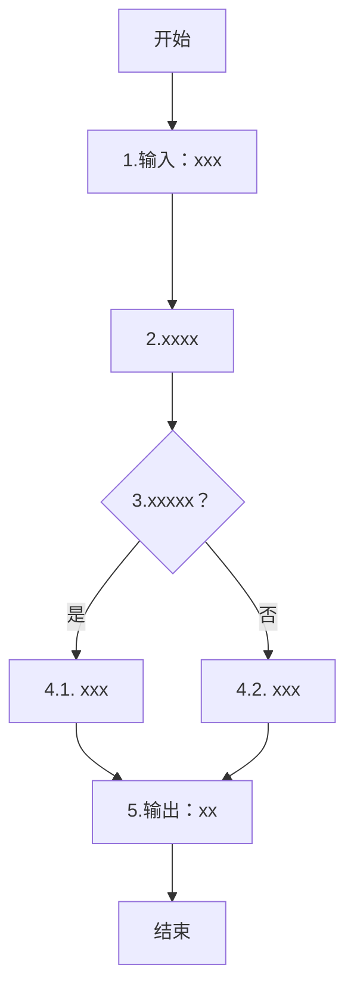

# 软件设计说明模板 — SDD for Function Migration

> 本模板用于生成 `docs/migration/software-design-description.md`。
> 针对每个需求（REQ）按以下章节组织，多个 REQ 可顺序拼接。
> “逻辑数据”/“控制组件”章节没有内容可以不写，完成“功能组件”章节即可。

## {REQ-...}：{需求名称}
- **优先级**：{高/中/低}
- **设计版本**：{v1.0 draft}
- **设计日期**：{YYYY-MM-DD}
- **设计者**：AI + 待人工确认

### 逻辑数据

- 功能名称：

#### 1.行为指令格式

##### 1.1.指令基本信息

| 项目 | 内容 |
|------|------|
|指令名称|{待人工确认}|
|指令编码|{待人工确认}|

##### 1.2.指令参数

| 序号 | 指令参数 | 格式 | 名称 | 是否可选 |
|------|----------|------|-------|-------|
| 1 | destID | string | 目标ID | 必选 |

#### 2.行为逻辑描述

{简述该行为逻辑的业务目标。}

#### 3.行为逻辑图



#### 4.组件间交互

##### 4.1.交互定义

| 交互名称 | 发起方 | 接收方 | 交互内容及格式 | 交互方式 |
|---------|--------|--------|--------------|----------|
| 探测信息交互 | 雷达探测组件 | 火力运用组件 | 目标经度`tlon`(double)<br>目标纬度`tlat`(double)<br>目标高度`talt`(double) | 交互黑板 |

#### 5.实体间交互

| 交互名称 | 发起方 | 接收方 | 交互内容及格式 | 交互方式 |
|---------|--------|--------|--------------|----------|
| xxxx交互 | xxx | yyy | targetID(黑板名称)<br>side(黑板名称)<br>location(黑板名称) | 交互黑板 |

### 控制组件

#### 1.功能定位

简要描述该控制组件的业务目标。

| 项目 | 内容 |
|------|------|
| 控制组件类型 | 火力类/探测类/机动类/通信类/毁伤类/后勤类/干扰类/指挥类/环境类 |
| 组件名称 | {待人工确认} |

#### 2.触发指令格式

##### 1.1.指令基本信息

| 项目 | 内容 |
|------|------|
|指令名称|{待人工确认}|
|指令编码|{待人工确认}|

##### 1.2.指令参数

| 序号 | 指令参数 | 格式 | 名称 | 是否可选 |
|------|----------|------|-------|-------|
| 1 | destID | string | 目标ID | 必选 |

#### 3.输出状态事件
##### 3.1 输出状态

| 状态分类 | 状态标识 | 状态语义 | 数据类型 | 取值范围 | 备注 |
|---------|---------|---------|---------|---------|-------|
| 火力/... | xxxxx | xxxxx | json/... | - | 格式见表aaaab |

- 表aaaab：
```json
"xxxxx":[
    {
        "y":"yyyy1",
        "z":3
    }
]
```
##### 3.2 输出事件

1. 事件1：任务开始执行

| 事件名 | 事件编码 |
|--------|----------|
|{待人工确认}|{待人工确认}|

| 参数名 | 数据类型 | 说明 |
|--------|----------|-------|

#### 4.运行逻辑

运行逻辑如下图：
```mermaid
```

其中，......。{用语言简要描述}


#### 5.使用约束
- aaaa：
- bbbb：


### 功能组件
#### 1.FU-{xxx}:{功能单元名称}
##### 1.1. 功能定位

简要描述该功能单元的业务目标、在仿真流程中的位置。

##### 1.2. 外部接口

| 序号 | 接口类型 | 参数类型 | 参数 | 参数描述 |
|------|-----------|----------|-------|----------|
| 1 | 输入参数 | 想定参数 | countPerTarget | 每个目标的数量 |
| 2 | 输入参数 | 状态参数 | countTarget | 目标个数 |
| 3 | 输出参数 | / | lauchCount | 装载数量 |

##### 1.3. 运行逻辑

- 运行逻辑如下图所示：
```mermaid
```

##### 1.4. 数学公式

1. {公式名称}：{公式含义}
    $xxxxxxxxxxxx$
    其中，$x$表示xxx，$y$表示yyy....。

2. {公式名称}：{公式含义}
    $xxxxxxxxxxxx$
    其中，$x$表示xxx，$y$表示yyy....。


## 人工确认
| 需求ID | 确认状态 | 确认人 | 日期 |
|--------|----------|-------|------|
| REQ-{xxx} | ✅/❌/❓ | .... | .....|
