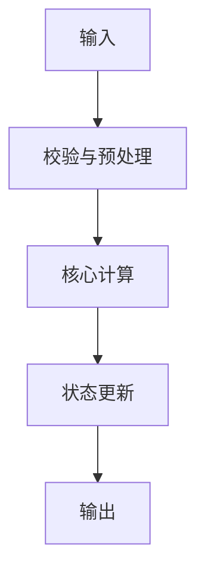

# AFSIM 算法卡片模板

# <中文名称>（<English Name>）

> **算法 ID**：ALG-<DOMAIN>-<SLUG>
> **状态**：draft / verified / needs-review
> **版本/日期**：1.0 / YYYY-MM-DD
> **领域**：<domain>
> **AFSIM 模块**：<module>
> **覆盖候选**：`candidate-id-1`、`candidate-id-2`
> **接口规格**：`docs/extracted-algorithms/<algorithm>/<domain>-<algorithm>-interface-spec.md`

## 1. 算法边界

- **目的**：……
- **入口条件**：……
- **完成条件**：……
- **包含**：……
- **不包含**：<说明与相邻算法的拆分边界>
- **生命周期位置**：scenario_load / initialize / simulation_loop / event / shutdown / other

## 2. 流程



用中文逐步解释流程、分支、循环和终止条件。

## 3. 数据契约

### 3.1 输入

| # | 中文名称 | 代码标识 | 数学符号 | 类型 | 含义 | 单位/坐标系 | 所属函数 Method |
| --- | --- | --- | --- | --- | --- | --- | --- |
| 1 | <名称> | `<symbol>` | $x$ | `<type>` | <含义> | <unit/frame> | `<qualified_name>` |

### 3.2 输出

| # | 中文名称 | 代码标识 | 数学符号 | 类型 | 含义 | 单位/坐标系 | 所属函数 Method |
| --- | --- | --- | --- | --- | --- | --- | --- |
| 1 | <名称> | `<symbol>` | $y$ | `<type>` | <含义> | <unit/frame> | `<qualified_name>` |

### 3.3 参数与常量

| # | 中文名称 | 代码标识 | 数学符号 | 类型 | 值/范围 | 单位 | 来源 | 所属函数 Method |
| --- | --- | --- | --- | --- | --- | --- | --- | --- |
| 1 | <名称> | `<symbol>` | $c$ | `<type>` | <value/range> | <unit> | 理论/配置/经验值/unknown | `<qualified_name>` |

### 3.4 内部状态

| # | 状态 | 代码标识 | 类型 | 单位/坐标系 | 初值 | 读取函数 | 写入函数 | 更新时机 | 重置 |
| --- | --- | --- | --- | --- | --- | --- | --- | --- | --- |
| 1 | <名称> | `<symbol>` | `<type>` | <unit/frame> | <value> | `<qualified_name>` | `<qualified_name>` | <timing> | <rule> |

`Method` 必须是当前 `function-index.jsonl` 中存在的 `qualified_name`，不得填写不存在的 `function` 字段或只写短函数名。

## 4. 数学模型

### 4.1 <公式名称>

说明公式对应的源码步骤和计算目的：

$$
y_{k+1} = f(x_k, u_k, \Delta t)
$$

- $y_{k+1}$：……，单位……
- $x_k$：……，单位……
- $u_k$：……，单位……
- $\Delta t$：……，单位 s

明确这是连续模型、离散实现还是代码近似；列出假设、经验系数和无法证明的部分。

## 5. 伪代码

```text
function algorithm_step(input, state, config):
    # 中文：校验单位、范围和坐标系
    validate(input, config)

    # 中文：按源码中的离散顺序计算，不交换有状态步骤
    intermediate = compute(input, state, config)
    next_state = update_state(state, intermediate)

    # 中文：返回结果及需要持久化的新状态
    return result, next_state
```

标识符使用英文，说明与注释使用中文。关键物理量注明单位/坐标系；每 3–5 行至少一条有意义的中文注释。

## 6. 源码证据

### 6.1 入口和调用链

```text
<qualified_name>  // 中文：入口作用
  -> <qualified_name>  // 中文：核心计算
  -> <qualified_name>  // 中文：状态更新
```

### 6.2 源码位置

| candidate_id | qualified_name | 模块 | 源码位置 | 角色 | 证据等级 |
| --- | --- | --- | --- | --- | --- |
| `<id>` | `<qualified_name>` | `<module>` | `path:start-end` | 入口/核心/状态/辅助 | source-cited |

### 6.3 框架与依赖

| 依赖 | 分类 | 用途 | 算法核心必需 | 中性替代 |
| --- | --- | --- | --- | --- |
| `<dependency>` | 标准库/第三方/AFSIM 框架/配置 | <用途> | yes/no | <方案> |

## 7. 边界、风险与未知

| 条件 | 源码行为 | 数学/数值影响 | 建议处理 | 证据 |
| --- | --- | --- | --- | --- |
| <条件> | <行为> | <影响> | <建议> | `path:start-end` |

- **已确认假设**：……
- **待人工复核**：<问题及缺失证据>

## 8. 验证计划

| 类型 | 输入/场景 | Oracle | 容差/不变量 | 覆盖证据 |
| --- | --- | --- | --- | --- |
| 正常 | <输入> | 解析解/黄金数据/独立实现 | <tolerance> | <公式/步骤> |
| 边界 | <输入> | <预期> | <range> | <边界> |
| 退化/异常 | <输入> | <错误或退化结果> | — | <错误路径> |

## 9. 可移植性

- **等级**：高 / 中 / 低
- **可移植核心**：……
- **AFSIM 耦合**：……
- **类型/单位/坐标系适配**：……
- **许可证/clean-room 注意**：……

## 10. 覆盖账本回写

| candidate_id | 状态 | algorithm_id | 决策理由 | 验证 |
| --- | --- | --- | --- | --- |
| `<id>` | extracted | ALG-<DOMAIN>-<SLUG> | <核心/辅助角色> | passed |
