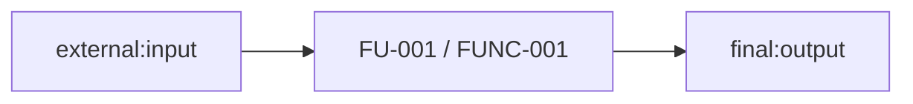
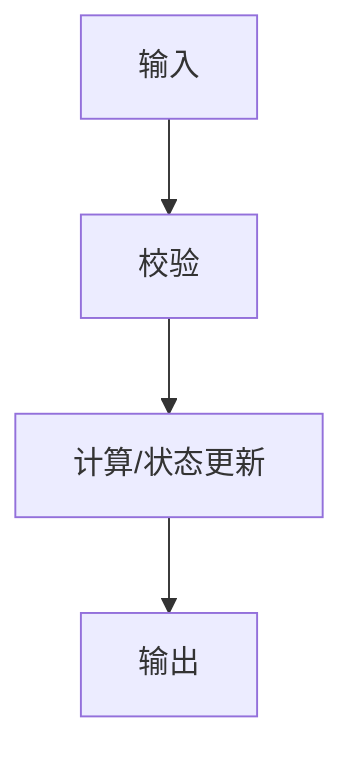

# 功能单元迁移设计模板

# <需求名称>功能单元迁移设计

> **需求集 ID**：REQ-XXX
> **版本**：0.1
> **状态**：草稿 / 待确认 / 已确认
> **需求映射验证**：`<report>`
> **生成日期**：YYYY-MM-DD
> **确认记录**：<确认人或用户消息、日期>

## 1. 设计边界

- 目标系统：……
- 代码接入目录：……
- C++ 标准与构建系统：……
- 许可证/clean-room 边界：……
- 未纳入范围：……

## 2. 全局约定

### 2.1 类型映射

| AFSIM/需求类型 | 目标类型 | 所有权 | 头文件 | 说明 |
| --- | --- | --- | --- | --- |
| `<type>` | `<type>` | value/ref/owned | `<header>` | <说明> |

### 2.2 单位与坐标系

| 物理量 | 输入单位/坐标系 | 内部单位/坐标系 | 输出单位/坐标系 | 转换与验证 |
| --- | --- | --- | --- | --- |
| <量> | <unit/frame> | <unit/frame> | <unit/frame> | <公式/测试> |

### 2.3 错误、线程与状态策略

- 错误模型：……
- 线程安全：……
- 状态所有权：……
- 初始化/重置：……

## 3. FU 数据流

| 数据 | 类型 | 单位 | 坐标系 | 生产者 | 消费者 | 生命周期 |
| --- | --- | --- | --- | --- | --- | --- |
| `<name>` | `<type>` | <unit> | <frame> | external/FU | FU/final/state | <说明> |

## 4. FU 设计

### FU-001：<名称>

#### 4.1 追溯与策略

| 项 | 内容 |
| --- | --- |
| 关联需求 | REQ-XXX-FUNC-01 |
| 验收标准 | <标准> |
| 覆盖状态 | partial / missing_with_afsim_reference / missing_without_afsim_reference |
| 迁移策略 | direct_adaptation / partial_rewrite / cleanroom / novel |
| 选择理由 | <证据、许可证、耦合> |
| 被否决方案 | <方案与原因> |

#### 4.2 AFSIM 证据或设计依据

AFSIM 有参考时：

| candidate_id | qualified_name | 源码位置 | 角色 | 已验证差异 |
| --- | --- | --- | --- | --- |
| `<id>` | `<qualified_name>` | `path:start-end` | <角色> | <差异> |

AFSIM 无参考时：

- 设计依据：……
- AFSIM 检索范围：……

#### 4.3 算法与行为

<说明算法、状态机或处理流程。>

- 关键公式：……
- 符号、单位和坐标系：……
- 边界与退化行为：……

#### 4.4 函数设计

##### FUNC-001：`Result computeValue(const Input& input)`

- **职责**：……
- **FU/REQ**：FU-001 / REQ-XXX-FUNC-01
- **来源**：`path:start-end` / <非 AFSIM 设计依据>

输入：

| 名称 | 类型 | 单位 | 坐标系 | 约束 | 来源 |
| --- | --- | --- | --- | --- | --- |
| `input` | `const Input&` | <unit> | <frame> | <约束> | external/FU/state |

输出：

| 名称 | 类型 | 单位 | 坐标系 | 约束 | 消费者 |
| --- | --- | --- | --- | --- | --- |
| `return` | `Result` | <unit> | <frame> | <约束> | final/FU/state |

状态与副作用：

| 状态 | 读/写 | 初值 | 更新时机 | 重置 | 线程安全 |
| --- | --- | --- | --- | --- | --- |
| `<state>` | read/write | <value> | <timing> | <rule> | <rule> |

依赖：

| 分类 | 依赖 | 用途 | 保留/替换/移除 |
| --- | --- | --- | --- |
| 标准库/第三方/目标系统/AFSIM | `<dependency>` | <用途> | <方案> |

错误：

| 条件 | 检测 | 行为 | 可测试 oracle |
| --- | --- | --- | --- |
| <非法输入> | <检查> | <错误/返回> | <预期> |

测试：

| 类型 | 输入/夹具 | Oracle | 容差 | 关联验收标准 |
| --- | --- | --- | --- | --- |
| normal | <输入> | <预期> | <容差> | <标准> |
| boundary | <输入> | <预期> | <容差> | <标准> |
| invalid/degenerate | <输入> | <预期> | — | <标准> |

#### 4.5 风险与待确认

| ID | 问题/风险 | 影响 | 建议 | 阻塞实施 |
| --- | --- | --- | --- | --- |
| Q-001 | <问题> | <影响> | <建议> | yes/no |

> 对其余 FU 和函数重复本节。

## 5. 确认

待确认版：

| 决策 ID | 决策内容 | 推荐选项 | 人工选择 | 修改要求 |
| --- | --- | --- | --- | --- |
| D-001 | <接口/单位/策略> | <推荐> | <待确认> | |

确认版：

| 版本 | 确认来源 | 日期 | 已批准决策 | 未决非阻塞项 |
| --- | --- | --- | --- | --- |
| 1.0 | <人/消息> | YYYY-MM-DD | D-001 | <none/list> |

## 6. 修订记录

| 版本 | 日期 | 变化 | 原因 | 来源 |
| --- | --- | --- | --- | --- |
| 0.1 | YYYY-MM-DD | 初稿 | — | — |
