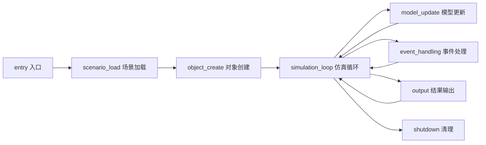
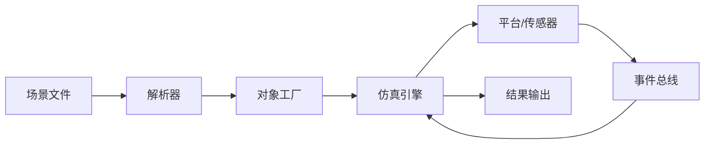
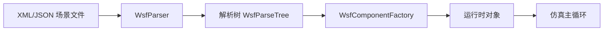

# AFSIM 仿真框架架构文档

> **状态**：已完成（Phase 1-7 全量分析）
> **日期**：2026-06-22
> **分析范围**：17342 源文件（43591 总文件），107 个模块
> **分析深度**：full（7 阶段完整流水线）
> **基线文档**：Phase 1-6 全部产出（13+ 文件）

---

## 0. 文档说明

**总体概述**：AFSIM（Advanced Framework for Simulation, Integration, and Modeling）是一个用于国防和航空航天领域的 C++14 仿真框架。它提供了从场景加载、对象创建、仿真循环、模型更新到结果输出的完整生命周期管理。

**业务价值**：支持多域（空中、太空、地面、海上、网络空间）作战仿真，提供扩展性强的组件模型、脚本化能力和丰富的可视化工具。

**关键技术栈**：
- **编程语言**：C++14（核心框架）
- **构建系统**：CMake
- **脚本引擎**：Lua/Python（通过 `UtScriptClass`）
- **图形渲染**：OpenSceneGraph（osg）、Qt
- **数据协议**：Link16、DIS、MIL-STD

---

## 1. 目录结构总览

```
afsim-2_9/  # AFSIM 2.9 主发布目录
├── swdev/src/  # 核心开发源码
│   ├── core/  # 核心仿真引擎
│   │   ├── wsf/source/  # WSF 仿真框架（最核心：平台、传感器、事件、仿真引擎）
│   │   ├── wsf_util/source/  # 工具库（数学、缓冲、序列化）
│   │   ├── wsf_parser/source/  # 场景文件解析器
│   │   ├── wsf_space/source/  # 太空轨道仿真
│   │   ├── wsf_cyber/source/  # 网络攻击仿真
│   │   ├── wsf_l16/source/  # Link16 数据链
│   │   ├── wsf_mil/source/  # MIL-STD 标准库
│   │   ├── wsf_mtt/source/  # 多目标跟踪
│   │   ├── wsf_nx/source/  # 电子战仿真
│   │   └── sensor_plot_lib/source/  # 传感器绘图库
│   ├── tools/  # 工具集
│   │   ├── wkf/  # 向导框架 (Wizard Framework)
│   │   ├── util_script/  # 脚本工具
│   │   └── ...
│   ├── wsf_plugins/  # WSF 插件
│   │   ├── wsf_six_dof/source/  # 六自由度飞行器模型
│   │   ├── wsf_p6dof/source/  # 质点六自由度模型
│   │   ├── wsf_space/source/  # 太空插件
│   │   └── ...
│   ├── wizard/  # 向导/UI 插件
│   ├── warlock/  # 军事/战术 UI 插件
│   ├── mystic/  # 结果可视化插件
│   └── engage/  # 交战规则引擎
├── training/  # 培训教程和示例
├── documentation/  # 文档
└── demos/  # 演示示例

```

---

## 2. 模块总览

### 核心仿真引擎子系统

| 系统 | 子系统 | 核心模块 | 源文件数 | 核心职责 |
|------|--------|----------|----------|----------|
| 仿真框架 | WSF Core | wsf, wsf_util | 2,810+ | 平台(Platform)/传感器(Sensor)/事件(Event)/仿真引擎(Simulation) |
| 数据链路 | Link16/Comm | wsf_l16, comm | 685+ | Link16 消息处理、通信网络、数据字段定义 |
| 太空仿真 | Space | wsf_space, sosm | 1,542+ | 轨道预报、星座管理、大气模型、交会对接 |
| 飞行器动力学 | Flight Dynamics | wsf_six_dof, wsf_p6dof | 1,744+ | 六自由度/质点动力学、自动驾驶仪、气动系数 |
| 电子战 | EW | wsf_nx, wsf_ripr | 249+ | 雷达电子战、箔条云、天线方向图 |
| 网络战 | Cyber | wsf_cyber | 209+ | 网络攻击、防御模型 |
| 解析器 | Parser | wsf_parser, wsf_mil_parser | 163+ | 场景文件 XML/JSON 解析、语法检查 |
| 可视化 | Viz | wizard, warlock, mystic | 2,500+ | 2D/3D 地图、数据显示、结果回放 |
| 工具集 | Tools | tools/wkf, util_script, genio | 583+ | 向导框架、脚本方法构建器、文件IO |

### 模块级统计

| 指标 | 数量 |
|------|------|
| 总模块数 | 107 |
| 含源码模块 | 48 |
| 总 class/struct（结构体） | 5941 |
| 总方法/函数 | 45603 |
| 总宏定义 | 9381 |
| 总枚举 | 814 |

---

## 3. 仿真生命周期

AFSIM 仿真遵循标准的 8 阶段生命周期：



### 生命周期各阶段关联

| 阶段 | 方法数量 | 入口函数示例 | 关键类 |
|------|---------|-------------|--------|
| entry（入口） | 0 | main / Initialize | WsfApplication, WsfSimulation |
| scenario_load（场景加载） | 1586 | LoadScenario / ParseXML | WsfParser, WsfParseGrammar, WsfScenario |
| object_create（对象创建） | 5269 | Create / Register / Initialize | WsfComponentFactory, WsfObjectTypeList |
| simulation_loop（仿真循环） | 782 | UpdatePlatforms / AdvanceTime | WsfSimulation, WsfMultiThreadManager |
| model_update（模型更新） | 3886 | Update / Compute / Process | WsfPlatform, WsfMover, WsfSensor |
| event_handling（事件处理） | 13273 | Handle / On / Publish | WsfEvent, WsfEventPublisher |
| output（结果输出） | 1730 | WriteResults / Serialize / Render | WsfResultWriter, PostProcessor |
| shutdown（清理） | 2257 | ~Destructor / Cleanup / Shutdown | WsfSimulation, WsfApplication |

详细信息见 [lifecycle.md](lifecycle.md)。

---

## 4. 数据流

AFSIM 数据流遵循"生产→存储→更新→消费→输出"模式。



### 关键数据对象

| 数据对象 | 角色 | 生命周期 |
|---------|------|---------|
| WsfPlatform（平台） | 仿真平台实例，承载 mover/sensor | 从 scene_load 创建到 shutdown 销毁 |
| WsfTrack（航迹） | 传感器检测输出的目标跟踪 | model_update 持续更新 |
| WsfEvent（事件） | 仿真事件（检测、命令、状态变更） | event_handling 发布和响应 |
| WsfMessage（消息） | 数据链消息（Link16/DIS/自定义） | 编解码、传输和路由 |
| WsfSignature（信号特征） | 平台电磁/红外信号特征 | model_update 计算并更新 |

详细信息见 [dataflow.md](dataflow.md)。

---

## 5. 配置流



---

## 6. 扩展点

| 扩展机制 | 关键接口 | 说明 |
|----------|----------|------|
| 组件工厂 | WsfComponentFactory / WsfObjectTypeList | 通过宏注册新组件类型 |
| 插件系统 | Plugin / PluginManager::Load | 动态库加载和初始化 |
| 事件总线 | WsfEvent / Subscribe / Publish | 发布-订阅事件分发 |
| 脚本扩展 | UtScriptClass / UtScriptAccessible | C++ 方法暴露到脚本层 |
| 仿真扩展 | WsfSimulationExtension | 在仿真生命周期的特定阶段注入逻辑 |
| 策略模式 | WsfFusionStrategy / WsfTrackExtrapolationStrategy | 运行时策略切换 |

详细信息见 [extension-points.md](extension-points.md)。

---

## 7. 关键符号

### 核心类

| 符号 | 类型 | 角色 | 成员函数数 |
|------|------|------|----------|
| WsfScriptPlatformClass | class | Class in WsfScriptPlatformClass.hpp | 308 |
| ScenarioImporter::OutputTemplate | class | Class in Output.hpp | 287 |
| WsfScriptTrackClass | class | Class in WsfScriptTrackClass.hpp | 175 |
| wsf::comm::WsfSimulation | class | Class in WsfSimulation.hpp | 160 |
| Designer::GeometryGLWidget | class | Class in GeometryGLWidget.hpp | 150 |
| Designer::VehicleAeroCore | class | Class in VehicleAeroCore.hpp | 149 |
| wsf::comm::WsfDisInterface | class | Class in WsfDisInterface.hpp | 133 |
| Designer::GeometryWing | class | Class in GeometryWing.hpp | 133 |
| ut::script::wsf::WsfPlatform | class | Class in WsfPlatform.hpp | 130 |
| UtGraphAlgorithm::UtGraphT | class | Class in UtGraph.hpp | 121 |
| wsf::comm::router::medium::WsfScenario | class | Class in WsfScenario.hpp | 118 |
| wizard::Project | class | Class in Project.hpp | 117 |
| Designer::Ui::Designer::GeometryWidget | class | Class in GeometryWidget.hpp | 111 |
| wsf::WsfGuidanceComputer | class | Class in WsfGuidanceComputer.hpp | 107 |
| WsfTrackManager | class | Class in WsfTrackManager.hpp | 99 |
| rv::MessageBaseArray | class | Class in RvResultMessageArray.hpp | 99 |
| WsfGuidedMover | class | Class in WsfGuidedMover.hpp | 97 |
| il::WsfWMAIEngagementMod | class | Class in WsfWMAIEngagementMod.hpp | 92 |
| WsfScriptEM_InteractionClass | class | Class in WsfScriptEM_InteractionClass.hpp | 88 |
| wkf::vespa::WkPlatformHistory::Plugin | class | Class in PlatformHistoryPlugin.hpp | 88 |


### 核心方法（按调用复杂度排序前 30）

| qualified_name（限定名） | lifecycle_role（生命周期角色） | 调用数 |
|--------------------------|-------------------------------|--------|
| WsfEM_Antenna::WsfEM_Antenna | unknown | 50 |
| WsfEM_Antenna::WsfEM_Antenna | unknown | 50 |
| WsfEM_Antenna::~WsfEM_Antenna | shutdown | 50 |
| WsfEM_Antenna::GetArticulatedPart | unknown | 50 |
| WsfEM_Antenna::GetPlatform | unknown | 50 |
| WsfEM_Antenna::Initialize | object_create | 50 |
| WsfEM_Antenna::ProcessInput | model_update | 50 |
| WsfEM_Antenna::UpdatePosition | simulation_loop | 50 |
| WsfEM_Antenna::GetScriptClassName | unknown | 50 |
| WsfEM_Antenna::SetRangeLimits | unknown | 50 |
| WsfPlatformPart::GetPlatform | unknown | 50 |
| WsfPlatformPart::SetPlatform | unknown | 50 |
| WsfPlatformPart::PlatformAdded | object_create | 50 |
| WsfPlatformPart::PlatformDeleted | shutdown | 50 |
| ut::script::wsf::WsfPlatform::GetCreationTime | event_handling | 50 |
| ut::script::wsf::WsfPlatform::InitializeCreationTime | object_create | 50 |
| ut::script::wsf::WsfPlatform::SetCreationTime | event_handling | 50 |
| ut::script::wsf::WsfPlatform::GetLastUpdateTime | simulation_loop | 50 |
| ut::script::wsf::WsfPlatform::GetSimTime | unknown | 50 |
| ut::script::wsf::WsfPlatform::SetUpdateLocked | model_update | 50 |
| wsf::comm::router::medium::WsfScenario::CloneType | object_create | 50 |
| wsf::comm::router::event::Comment::GetPlatform | event_handling | 50 |
| wsf::comm::router::event::Comment::GetComment | event_handling | 50 |
| wsf::comm::router::event::CommAddedToLocal::Print | object_create | 50 |
| wsf::comm::router::event::CommAddedToLocal::PrintCSV | object_create | 50 |
| wsf::comm::router::event::CommAddedToLocal::GetLocalRouter | object_create | 50 |
| wsf::comm::router::event::CommAddedToLocal::GetProtocol | object_create | 50 |
| wsf::comm::router::event::CommAddedToLocal::GetAddedAddress | object_create | 50 |
| wsf::comm::router::event::CommRemovedFromLocal::Print | event_handling | 50 |
| wsf::comm::router::event::CommRemovedFromLocal::PrintCSV | event_handling | 50 |


### 关键宏

| 宏名 | 类型 | 位置 |
|------|------|------|
| NOMINMAX | expression | afsim-2_9/training/developer/core/labs/solution/mover/source/MATLABBallisticMover.hpp |
| __libAFSIM_Mover_h | constant | afsim-2_9/training/developer/core/labs/solution/mover/MATLAB_mover/lib/libAFSIM_Mover.h |
| PUBLIC_libAFSIM_Mover_C_API | expression | afsim-2_9/training/developer/core/labs/solution/mover/MATLAB_mover/lib/libAFSIM_Mover.h |
| LIB_libAFSIM_Mover_C_API | expression | afsim-2_9/training/developer/core/labs/solution/mover/MATLAB_mover/lib/libAFSIM_Mover.h |
| PUBLIC_libAFSIM_Mover_CPP_API | expression | afsim-2_9/training/developer/core/labs/solution/mover/MATLAB_mover/lib/libAFSIM_Mover.h |
| LIB_libAFSIM_Mover_CPP_API | expression | afsim-2_9/training/developer/core/labs/solution/mover/MATLAB_mover/lib/libAFSIM_Mover.h |
| FLIGHT_CONTROLLER_INTERFACE | expression | afsim-2_9/training/developer/core/labs/solution/xio/flight_controller/source/FlightControllerInterface.hpp |
| FLIGHT_CONTROLLER_WIDGET | expression | afsim-2_9/training/developer/core/labs/solution/xio/flight_controller/source/FlightControllerWidget.hpp |
| GENIO_LIT_ENDIAN | expression | afsim-2_9/swdev/src/tools/genio/source/GenIODefs.hpp |
| GENIO_UINT64 | expression | afsim-2_9/swdev/src/tools/genio/source/GenIODefs.hpp |
| GENIO_INT64 | expression | afsim-2_9/swdev/src/tools/genio/source/GenIODefs.hpp |
| GENIO_LONG64 | expression | afsim-2_9/swdev/src/tools/genio/source/GenIODefs.hpp |
| GENIO_BIG_ENDIAN | expression | afsim-2_9/swdev/src/tools/genio/source/GenIODefs.hpp |
| GENIO_VAX_D_FLOAT | expression | afsim-2_9/swdev/src/tools/genio/source/GenIODefs.hpp |
| GENIO_VAX_G_FLOAT | expression | afsim-2_9/swdev/src/tools/genio/source/GenIODefs.hpp |
| I64 | function_like | afsim-2_9/swdev/src/tools/genio/source/GenIODefs.hpp |
| UI64 | function_like | afsim-2_9/swdev/src/tools/genio/source/GenIODefs.hpp |
| DEBUG_IT | function_like | afsim-2_9/swdev/src/tools/genio/source/GenUmpIO.cpp |
| GEN_UMP_IO_SERVER_CC_IS_DEFINED | expression | afsim-2_9/swdev/src/tools/genio/source/GenUmpIOServerCC.hpp |
| UT_SCRIPT_WRAP_CLASS | function_like | afsim-2_9/swdev/src/tools/util_script/source/UtScriptMethodDefine.hpp |


---

## 8. 未知项

| # | 问题 | 原因 | 严重度 |
|----|------|------|--------|
| 1 | symbol-index base_symbols coverage 63.4% | 代码库特征：92.5% struct 无基类继承，21% class 无继承 | 低 |
| 2 | qualified_name duplicates in function-index (3,122 groups) | Phase 3 overloaded methods 使用相同 qualified_name | 低 |
| 3 | function-body-summary coverage 61.1% (vs 70% target) | 大量方法仅有头文件声明 (include-only) | 低 |
| 4 | algorithm_hint unknown 63.2% | 启发式关键词分类覆盖率天然有限 | 低 |
| 5 | enum_class detection 0 entries | 代码库中未发现 C++ enum class 语法 | 低 |
| 6 | 2 empty enum values (Phase, UtStringEnumId) | 特殊语法导致值提取失败 | 低 |

---

## 9. 源码证据

| 证据类型 | 位置 | 数量 | 验证状态 |
|----------|------|------|----------|
| 源码根目录 | source_root/afsim-2_9 + source_root/src | 17342 源文件 | ✅ |
| 项目边界 | workspace/project-boundary/project-boundary.json | 107 模块 | ✅ |
| 符号索引 | workspace/source-index/symbol-index.jsonl | 83095 符号 | ✅ |
| 宏索引 | workspace/source-index/macro-index.jsonl | 9381 宏 | ✅ |
| 枚举索引 | workspace/source-index/enum-index.jsonl | 814 枚举 | ✅ |
| 函数索引 | workspace/source-index/function-index.jsonl | 50402 条目（四层） | ✅ |
| 函数体摘要 | workspace/source-index/function-body-summary.jsonl | 27047 条目 | ✅ |
| 依赖索引 | workspace/source-index/dependency-index.jsonl | 52996 条目 | ✅ |
| 生命周期分析 | workspace/architecture/lifecycle.md | 8 阶段 | ✅ |
| 数据流分析 | workspace/architecture/dataflow.md | 10 数据对象 + 5 流路径 | ✅ |
| 扩展点分析 | workspace/architecture/extension-points.md | 6 扩展机制 | ✅ |
