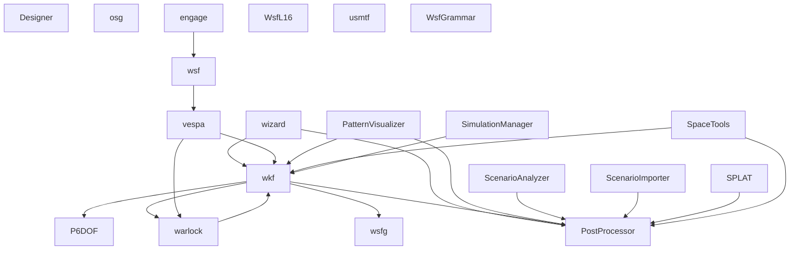

# AFSIM 依赖关系图

> 生成日期：2026-06-22
> 阶段：Phase 5

## 依赖统计

| Relation | 条目数 | 占比 |
|----------|--------|------|
| build | 298 | 0.6% |
| inheritance | 3908 | 7.4% |
| composition | 10402 | 19.6% |
| call | 28095 | 53.0% |
| include | 8736 | 16.5% |
| registration | 1557 | 2.9% |

| **总计** | **52996** | 100% |

## 类继承关系图

> 展示前 10 个最大继承层次结构，覆盖 75 个核心类。
> 过滤条件：排除 38 条自引用、5 条残片名称（`er`、`T`、`Set`、`map`、`nt`）。

```mermaid
classDiagram
  class UtScriptAccessible
  class Constraint
  Constraint --|> UtScriptAccessible
  class WsfEM_Antenna
  WsfEM_Antenna --|> UtScriptAccessible
  class WsfEM_XmtrRcvr
  WsfEM_XmtrRcvr --|> UtScriptAccessible
  class WsfFieldOfView
  WsfFieldOfView --|> UtScriptAccessible
  class WsfImage
  WsfImage --|> UtScriptAccessible
  class WsfMessage
  WsfMessage --|> UtScriptAccessible
  class WsfObject
  WsfObject --|> UtScriptAccessible
  class WsfRandomVariable
  WsfRandomVariable --|> UtScriptAccessible
  class UtReferenceTracked
  class WsfDebugValueModelData
  WsfDebugValueModelData --|> UtReferenceTracked
  class WsfDebugValueModelNode
  WsfDebugValueModelNode --|> UtReferenceTracked
  class WsfDebugValueModelQueryData
  WsfDebugValueModelQueryData --|> UtReferenceTracked
  class WsfTaskData
  WsfTaskData --|> UtReferenceTracked
  class WsfTrack
  WsfTrack --|> UtReferenceTracked
  class WsfXIO_Connection
  WsfXIO_Connection --|> UtReferenceTracked
  class UtScriptClass
  class ScriptScenarioAnalyzerMessageClass
  ScriptScenarioAnalyzerMessageClass --|> UtScriptClass
  class WsfDisScriptClass
  WsfDisScriptClass --|> UtScriptClass
  class MessageScriptClass
  MessageScriptClass --|> UtScriptClass
  class WsfScriptAtmosphere
  WsfScriptAtmosphere --|> UtScriptClass
  class WsfScriptClusterManagerClass
  WsfScriptClusterManagerClass --|> UtScriptClass
  class WsfScriptCommAddressClass
  WsfScriptCommAddressClass --|> UtScriptClass
  class WsfScriptConstellation
  WsfScriptConstellation --|> UtScriptClass
  class WsfScriptConstellationMaker
  WsfScriptConstellationMaker --|> UtScriptClass
  class SimEvent
  class AnnotationSimEvent
  AnnotationSimEvent --|> SimEvent
  class EventMarkSimEvent
  EventMarkSimEvent --|> SimEvent
  class HDDEvent
  HDDEvent --|> SimEvent
  class HeadsUpDisplayEvent
  HeadsUpDisplayEvent --|> SimEvent
  class JoystickEvent
  JoystickEvent --|> SimEvent
  class ProjectorEvent
  ProjectorEvent --|> SimEvent
  class SatelliteTetherEvent
  SatelliteTetherEvent --|> SimEvent
  class AcesEvent
  AcesEvent --|> SimEvent
  class WsfAuxDataEnabled
  class WsfGroup
  WsfGroup --|> WsfAuxDataEnabled
  class WsfPlatformPart
  WsfPlatformPart --|> WsfAuxDataEnabled
  class WsfWaypoint
  WsfWaypoint --|> WsfAuxDataEnabled
  class WsfZone
  WsfZone --|> WsfAuxDataEnabled
  class QObject
  class Network
  Network --|> QObject
  class TextChannel
  TextChannel --|> QObject
  class CoverageDataManager
  CoverageDataManager --|> QObject
  class ImportWorker
  ImportWorker --|> QObject
  class AeroObject
  AeroObject --|> QObject
  class AutopilotSupportFileWork
  AutopilotSupportFileWork --|> QObject
  class MoverCreatorEnvironment
  MoverCreatorEnvironment --|> QObject
  class JoystickDataContainer
  JoystickDataContainer --|> QObject
  class WsfUniqueId
  class WsfChaffCloud
  WsfChaffCloud --|> WsfUniqueId
  class WsfPlatform
  WsfPlatform --|> WsfUniqueId
  class Layer
  Layer --|> WsfUniqueId
  class LayerImp
  LayerImp --|> WsfUniqueId
  class QWidget
  class BullseyeWidget
  BullseyeWidget --|> QWidget
  class EngineWidget
  EngineWidget --|> QWidget
  class GeometryWidget
  GeometryWidget --|> QWidget
  class StartDialog
  StartDialog --|> QWidget
  class EventTableDialog
  EventTableDialog --|> QWidget
  class RulerPropertiesWidget
  RulerPropertiesWidget --|> QWidget
  class DialogMenuAndButtonsWidget
  DialogMenuAndButtonsWidget --|> QWidget
  class Attribute
  Attribute --|> QWidget
  class Result
  class ComponentInitialized
  ComponentInitialized --|> Result
  class BehaviorTreeNodeChildren
  BehaviorTreeNodeChildren --|> Result
  class BehaviorTreeNodeExec
  BehaviorTreeNodeExec --|> Result
  class CommAddedToLocal
  CommAddedToLocal --|> Result
  class CommAddedToManager
  CommAddedToManager --|> Result
  class CommBroken
  CommBroken --|> Result
  class CommFrequencyChanged
  CommFrequencyChanged --|> Result
  class CommNonOperational
  CommNonOperational --|> Result
  class WsfPlatformComponent
  class WsfCallback
  WsfCallback --|> WsfPlatformComponent
  class WsfWeaponPlatformExtension
  WsfWeaponPlatformExtension --|> WsfPlatformComponent
  class Component
  Component --|> WsfPlatformComponent
```

## 核心继承层次统计

| 基类 | 直接子类 | 总后代 |
|------|---------|--------|
| UtScriptAccessible | 21 | 348 |
| UtReferenceTracked | 10 | 333 |
| UtScriptClass | 68 | 169 |
| SimEvent | 42 | 161 |
| WsfAuxDataEnabled | 12 | 156 |
| QObject | 87 | 134 |
| WsfUniqueId | 6 | 133 |
| QWidget | 61 | 131 |
| Result | 130 | 130 |
| WsfPlatformComponent | 6 | 126 |
| NormalField | 110 | 110 |
| QDialog | 75 | 106 |
| PlotUpdater | 90 | 99 |
| PlatformUnitlessUpdater | 98 | 98 |
| WsfEvent | 63 | 90 |

## 模块间依赖图

> 基于继承+组合关系聚合，展示前 20 个连接最密集的模块。

## 模块依赖详情

| 模块                | 依赖目标数 | 主要目标                                                             |
| ----------------- | ----- | ---------------------------------------------------------------- |
| wsf               | 498   | vespa, Chat, WsfXIO_Interface                                    |
| wizard            | 263   | wkf, PostProcessor, WsfXIO_Interface                             |
| wkf               | 214   | wsfg, PostProcessor, P6DOF                                       |
| Designer          | 98    | G_LimitSettings, LiftDataCharacteristics, QObject                |
| vespa             | 87    | wkf, warlock, WsfArticulatedPart                                 |
| PatternVisualizer | 85    | wkf, PostProcessor, WsfAntennaPattern                            |
| osg               | 54    | SharedData, Utok, UtoTerrainUpdateMarkNodeVisito                 |
| engage            | 53    | wsf, WsfPrivate, WsfSensorMode                                   |
| WsfL16            | 49    | profiling, WsfMessage, WsfObjectTypeList                         |
| ScenarioAnalyzer  | 45    | PostProcessor, QVector, SelectCheckGroupModel                    |
| ScenarioImporter  | 40    | PostProcessor, Data, Stage                                       |
| usmtf             | 35    | Point, Segment, PackageData                                      |
| SPLAT             | 30    | PostProcessor, TargetType, QStringList                           |
| wsfg              | 29    | ealConfigWidgetT : ConfigWidge, QObject, AstrolabeDockWidgetBase |
| PostProcessor     | 29    | WsfProxy, TrajectoryDialog, QVector                              |

## Strength 分布

| Strength | 条目数   | 占比    |
| -------- | ----- | ----- |
| strong   | 19596 | 37.0% |
| medium   | 31843 | 60.1% |
| weak     | 1557  | 2.9%  |
